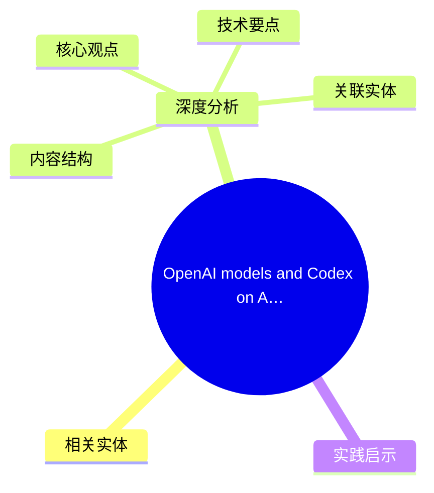
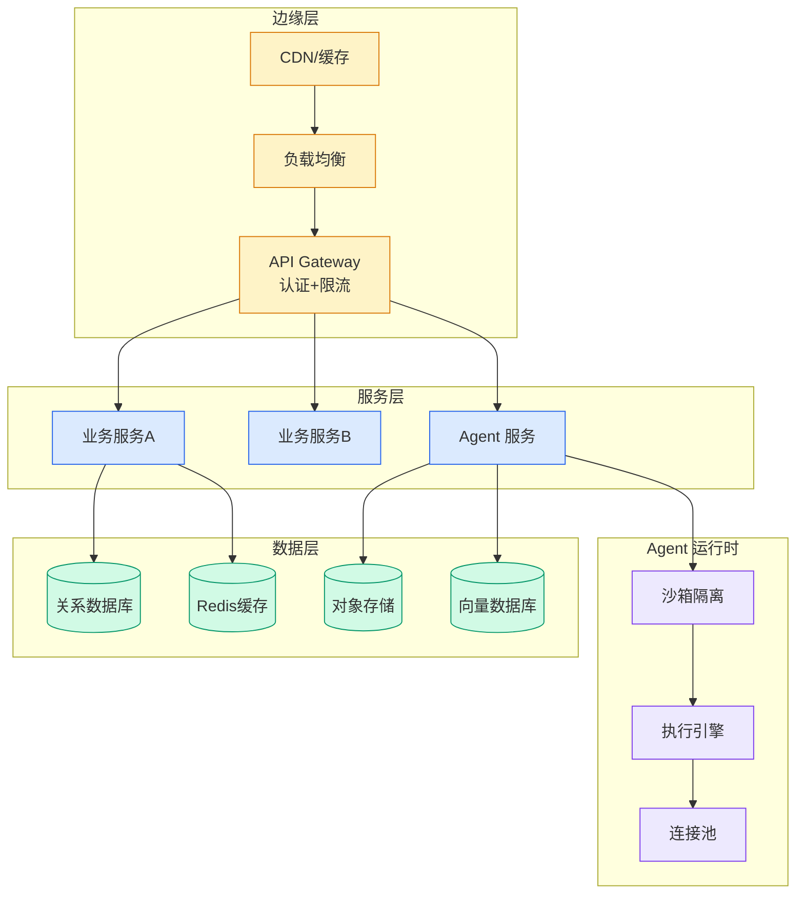

# OpenAI models and Codex on Amazon Bedrock are now generally available

> 📊 Level ⭐⭐ | 3.4KB | `entities/openai-models-and-codex-on-amazon-bedrock-are-now-generally-.md`

# OpenAI models and Codex on Amazon Bedrock are now generally available

## 概念导图

## 相关实体

- [neurips 2026 使用闭源 ai 检测器 pangram 批量 desk-reject 论文事件](../ch01/900-20.html)
→ [原文存档](https://github.com/QianJinGuo/wiki-book/tree/main/docs/raw/articles/openai-models-and-codex-on-amazon-bedrock-are-now-generally-.md)

- [MOC](https://github.com/QianJinGuo/wiki/blob/main/moc/reinforcement-learning-rlhf.md)
## 深度分析

OpenAI models and Codex on Amazon Bedrock are now generally available 涉及agent领域的核心技术议题。
### 核心观点
1. # OpenAI models and Codex on Amazon Bedrock are now generally available
GPT-5.
2. 4, and Codex are now generally available on Amazon Bedrock.
3. Deploy them in production applications and agents today, on Bedrock’s high performance inference engine.
4. ## Key takeaways
* GPT-5.
5. 5, the most advanced frontier model from OpenAI, is generally available on Amazon Bedrock.

### 内容结构
- OpenAI models and Codex on Amazon Bedrock are now generally available
- Key takeaways
- **What’s  next**
- **Get started**
- About the author
- Bharat Sandhu

### 技术要点

- **agent架构**: 本文在agent方向提出的设计理念与实现路径
- **工程挑战**: 实际落地中面临的关键问题与应对策略
- **aws趋势**: 相关技术演进方向与新兴范式
### 关联实体

- [Karpathy 最新访谈从 Vibe Coding 到 Agentic Engineering](../ch04/238-agentic.html)
- [Karpathy Vibe Coding Agentic Engineering](../ch04/129-karpathy-vibe-coding-agentic-engineering.html)
- [Agentops Operationalize Agentic Ai At Scale With Amazon Bedr](../ch04/297-agentops-operationalize-agentic-ai-at-scale-with-amazon-bed.html)
- [你不知道的 Agent原理架构与工程实践 V2](../ch03/035-agent.html)
- [Openclaw 完全指南这可能是全网最新最全的系统化教程了32W字建议收藏](ch11/230-openclaw.html)
- [存之有序治之有矩Agent 记忆系统的工程实践与演进](../ch03/035-agent.html)

## 实践启示
1. **工程落地**: agent领域方案需关注可观测性、可维护性和成本效率
2. **技术选型**: 根据场景选择合适的技术栈，避免过度设计或盲目追新
3. **持续迭代**: 建立数据驱动的反馈闭环，持续优化系统表现
4. **风险管控**: 引入新技术需评估对现有系统稳定性的影响，做好降级预案

---

