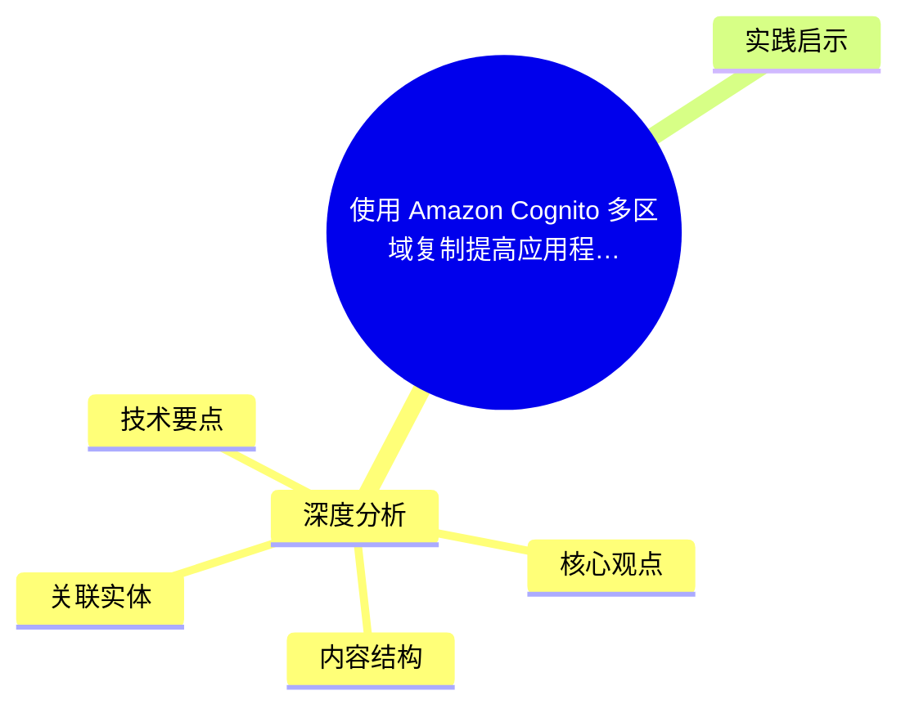
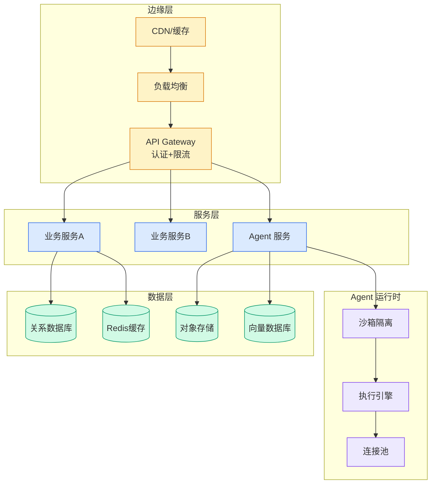

# 使用 Amazon Cognito 多区域复制提高应用程序韧性

## Ch11.275 使用 Amazon Cognito 多区域复制提高应用程序韧性

> 📊 Level ⭐⭐ | 3.5KB | `entities/使用-amazon-cognito-多区域复制提高应用程序韧性.md`

# 使用 Amazon Cognito 多区域复制提高应用程序韧性

→ [原文存档](https://github.com/QianJinGuo/wiki-book/tree/main/docs/raw/articles/使用-amazon-cognito-多区域复制提高应用程序韧性.md)

## 概念导图

## 深度分析

使用 Amazon Cognito 多区域复制提高应用程序韧性 涉及agent领域的核心技术议题。
### 核心观点
1. # 使用 Amazon Cognito 多区域复制提高应用程序韧性
作为一名与 Web 和移动应用程序开发者合作的开发者布道师，我经常听到一项需求：在不太可能发生的区域性服务中断情况下，也要保持一致的用户身份验证。
2. 随着代理式人工智能、微服务、自动化和服务帐户越来越普及，对对机器间身份验证也催生了同样的需求。
3. 今天，我很高兴与大家分享 Amazon Cognito 的两项重要更新：**多区域复制** （用于提高韧性）和支持**客户托管密钥** （用于强化加密控制）。
4. 许多应用程序依赖 Amazon Cognito 来处理用户和机器间身份验证以及管理用户个人资料。
5. 在构建高可用性架构时，跨 AWS 区域的数据一致性是关键方法，但在此之前，实现该目标面临诸多挑战。

### 内容结构
- 使用 Amazon Cognito 多区域复制提高应用程序韧性

### 技术要点

- **agent架构**: 本文在agent方向提出的设计理念与实现路径
- **工程挑战**: 实际落地中面临的关键问题与应对策略
- **architecture趋势**: 相关技术演进方向与新兴范式
### 关联实体

- [Agentops Operationalize Agentic Ai At Scale With Amazon Bedr](../ch04/299-agentops-operationalize-agentic-ai-at-scale-with-amazon-bed.html)
- [Scale Robot Reinforcement Learning With Nvidia Isaac Lab On ](../ch01/1160-scale-robot-reinforcement-learning-with-nvidia-isaac-lab-on.html)
- [Nvidia Isaac Lab Sagemaker Robot Rl Humanoid](https://github.com/QianJinGuo/wiki/blob/main/entities/nvidia-isaac-lab-sagemaker-robot-rl-humanoid.md)
- [Karpathy 最新访谈从 Vibe Coding 到 Agentic Engineering](../ch04/631-agentic.html)
- [构建基于多智能体架构的深度思考交易系统 V2](https://github.com/QianJinGuo/wiki/blob/main/entities/构建基于多智能体架构的深度思考交易系统-v2.md)
- [Openclaw 完全指南这可能是全网最新最全的系统化教程了32W字建议收藏](ch11/231-openclaw.html)

## 实践启示
1. **工程落地**: agent领域方案需关注可观测性、可维护性和成本效率
2. **技术选型**: 根据场景选择合适的技术栈，避免过度设计或盲目追新
3. **持续迭代**: 建立数据驱动的反馈闭环，持续优化系统表现
4. **风险管控**: 引入新技术需评估对现有系统稳定性的影响，做好降级预案

---

