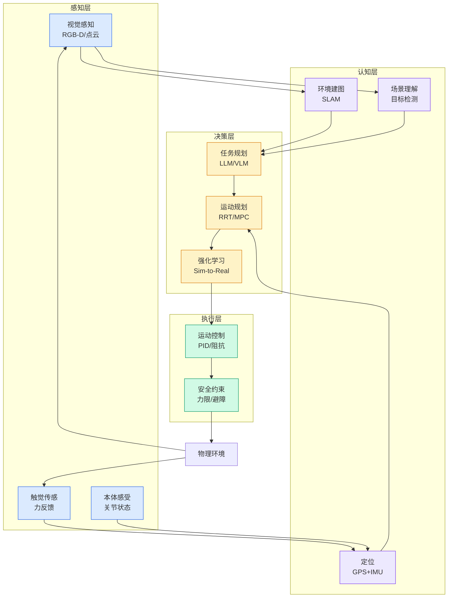

# Amazon Quick ARNs: Cross-account migration and namespace permissions

## Ch11.280 Amazon Quick ARNs: Cross-account migration and namespace permissions

> 📊 Level ⭐⭐ | 3.2KB | `entities/amazon-quick-arns-cross-account-migration-and-namespace-perm.md`

# Amazon Quick ARNs: Cross-account migration and namespace permissions

## 相关实体

- [amazon quick arns: cross-account migration and namespace per](ch11/220-amazon-quick.html)
→ [原文存档](https://github.com/QianJinGuo/wiki-book/tree/main/docs/raw/articles/amazon-quick-arns-cross-account-migration-and-namespace-perm.md)

- [MOC](https://github.com/QianJinGuo/wiki/blob/main/moc/mlops-training-inference.md)
## 深度分析

Amazon Quick ARNs: Cross-account migration and namespace permissions 涉及architecture领域的核心技术议题。
### 核心观点
1. # Amazon Quick ARNs: Cross-account migration and namespace permissions
You migrate dashboards from development to production, but the permissions don’t carry over.
2. You share a dashboard with your Finance team, but they keep getting “access denied.
3. ” You set up namespaces for multi-tenant isolation, and the same username works in one namespace but not another.
4. These are real tasks that Amazon Quick administrators tackle regularly, and getting them right requires a clear understanding of how Amazon Resource Names (ARNs) work.
5. Amazon Quick is a unified, AI-powered business intelligence service that helps you build interactive dashboards, query data in natural language, automate workflows, and embed analytics directly into applications.

### 内容结构
- Amazon Quick ARNs: Cross-account migration and namespace permissions
- A note on naming
- Think of ARNs as postal addresses
- What this looks like in practice: Dev/QA/Prod
- Why permissions don’t transfer during migration
- How the dependency chain works
- Reusing existing resources with OverrideParameters
- Namespaces: How identity works in multi-tenant environments

### 技术要点

- **architecture架构**: 本文在architecture方向提出的设计理念与实现路径
- **工程挑战**: 实际落地中面临的关键问题与应对策略
- **aws趋势**: 相关技术演进方向与新兴范式
### 关联实体

- [Scale Robot Reinforcement Learning With Nvidia Isaac Lab On ](../ch01/1161-scale-robot-reinforcement-learning-with-nvidia-isaac-lab-on.html)
- [Nvidia Isaac Lab Sagemaker Robot Rl Humanoid](https://github.com/QianJinGuo/wiki/blob/main/entities/nvidia-isaac-lab-sagemaker-robot-rl-humanoid.md)
- [存之有序治之有矩Agent 记忆系统的工程实践与演进](../ch03/035-agent.html)
- [Karpathy 最新访谈从 Vibe Coding 到 Agentic Engineering](../ch04/238-agentic.html)
- [构建基于多智能体架构的深度思考交易系统 V2](https://github.com/QianJinGuo/wiki/blob/main/entities/构建基于多智能体架构的深度思考交易系统-v2.md)
- [Openclaw 完全指南这可能是全网最新最全的系统化教程了32W字建议收藏](ch11/232-openclaw.html)

## 实践启示
1. **工程落地**: architecture领域方案需关注可观测性、可维护性和成本效率
2. **技术选型**: 根据场景选择合适的技术栈，避免过度设计或盲目追新
3. **持续迭代**: 建立数据驱动的反馈闭环，持续优化系统表现
4. **风险管控**: 引入新技术需评估对现有系统稳定性的影响，做好降级预案

---

