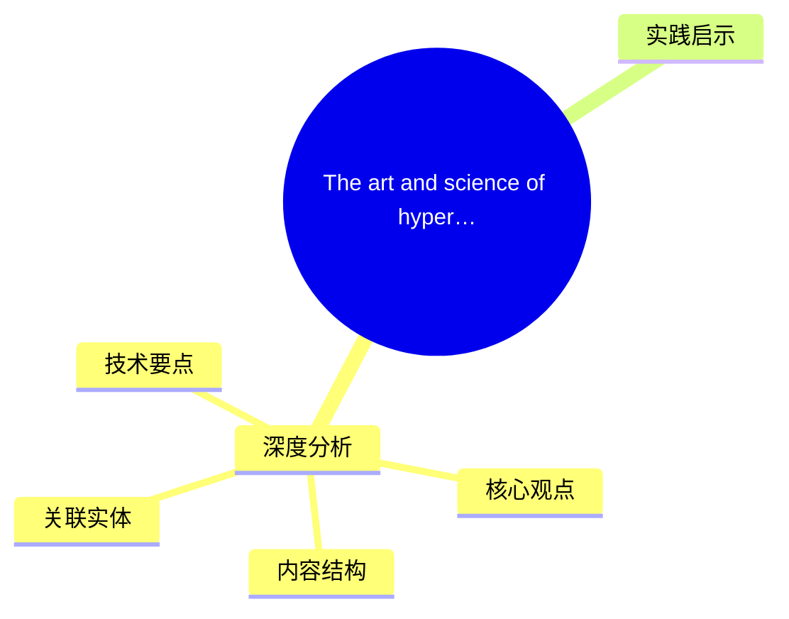
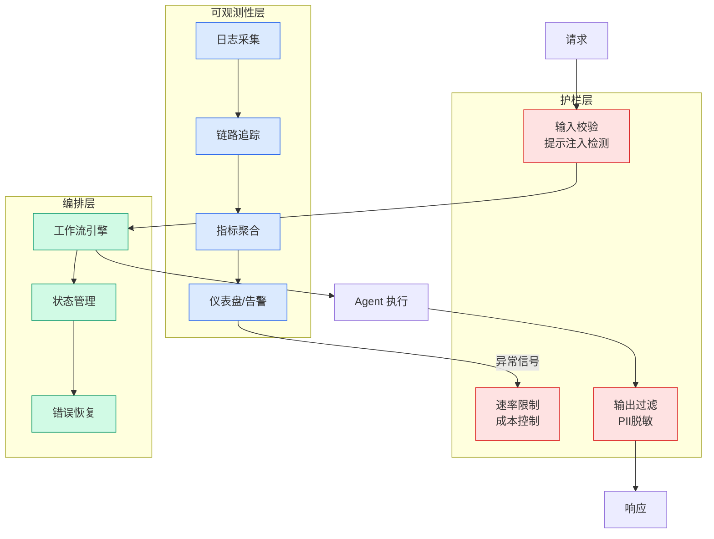

# The art and science of hyperparameter optimization on Amazon Nova Forge

## Ch11.281 The art and science of hyperparameter optimization on Amazon Nova Forge

> 📊 Level ⭐⭐ | 3.5KB | `entities/the-art-and-science-of-hyperparameter-optimization-on-amazon-nova-forge.md`

# The art and science of hyperparameter optimization on Amazon Nova Forge

→ [原文存档](https://github.com/QianJinGuo/wiki-book/tree/main/docs/raw/articles/the-art-and-science-of-hyperparameter-optimization-on-amazon-nova-forge.md)

## 概念导图

## 深度分析

The art and science of hyperparameter optimization on Amazon Nova Forge 涉及aws领域的核心技术议题。
### 核心观点
1. Amazon Nova Forge addresses this by enabling you to build your own frontier models using Amazon Nova.
2. You can start development from early model checkpoints, blend proprietary data with Amazon Nova-curated training data, and host custom models securely on AWS.
3. A key capability is data mixing, which blends your training data with curated datasets.
4. This helps the model absorb your domain while retaining broad reasoning, instruction-following, and language capabilities.
5. This prevents catastrophic forgetting that typically undermines domain customization.

### 内容结构
- The art and science of hyperparameter optimization on Amazon Nova Forge
- The art and science of hyperparameter optimization on Amazon Nova Forge
- The hyperparameter tuning challenge
- Challenge 1: Catastrophic forgetting
- Challenge 2: Finding the right learning rate
- Challenge 3: Baseline performance constraints
- The Nova Forge customization pipeline
- Strategic decisions

### 技术要点

- **aws架构**: 本文在aws方向提出的设计理念与实现路径
- **工程挑战**: 实际落地中面临的关键问题与应对策略
- **code趋势**: 相关技术演进方向与新兴范式
### 关联实体

- [存之有序治之有矩Agent 记忆系统的工程实践与演进](../ch03/035-agent.html)
- [Karpathy 最新访谈从 Vibe Coding 到 Agentic Engineering](../ch04/237-agentic.html)
- [Karpathy Vibe Coding Agentic Engineering](../ch04/126-karpathy-vibe-coding-agentic-engineering.html)
- [两万字详解Claude Code源码核心机制](../ch03/078-claude-code.html)
- [Scale Robot Reinforcement Learning With Nvidia Isaac Lab On ](../ch01/1170-scale-robot-reinforcement-learning-with-nvidia-isaac-lab-on.html)
- [Nvidia Isaac Lab Sagemaker Robot Rl Humanoid](https://github.com/QianJinGuo/wiki/blob/main/entities/nvidia-isaac-lab-sagemaker-robot-rl-humanoid.md)

## 实践启示
1. **工程落地**: aws领域方案需关注可观测性、可维护性和成本效率
2. **技术选型**: 根据场景选择合适的技术栈，避免过度设计或盲目追新
3. **持续迭代**: 建立数据驱动的反馈闭环，持续优化系统表现
4. **风险管控**: 引入新技术需评估对现有系统稳定性的影响，做好降级预案

---

