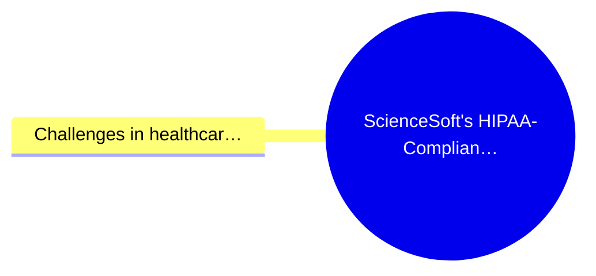
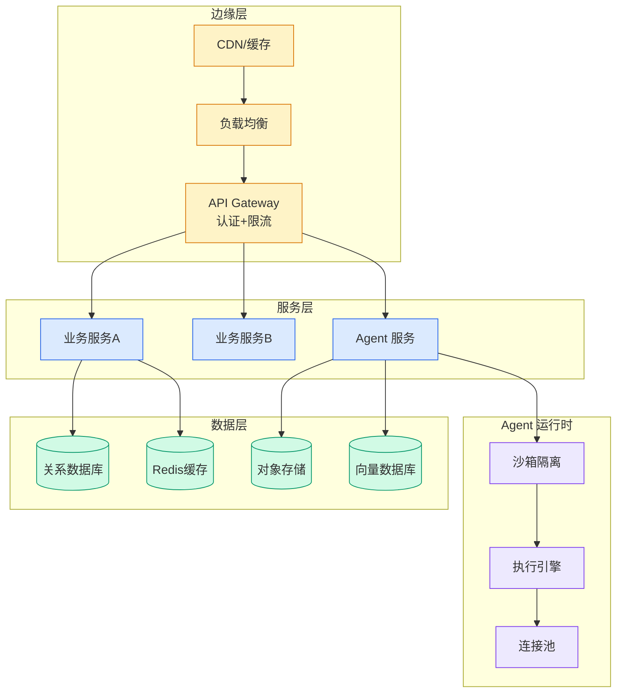

# ScienceSoft's HIPAA-Compliant AI Voice Scheduler Built on AWS

> 📊 Level ⭐⭐ | 3.2KB | `entities/sciencesofts-hipaa-compliant-ai-voice-scheduler-built-on-aws.md`

# ScienceSoft's HIPAA-Compliant AI Voice Scheduler Built on AWS

> [Healthcare organizations](<https://aws.amazon.com/health/gen-ai/>) need efficient scheduling solutions, and ScienceSoft’s AI voice assistant, powered by Amazon Nova Sonic and Amazon Bedrock Guardrails, shows how responsible AI can deliver that. The AI patient scheduling software market is one of he

## 概念导图

## 摘要

# ScienceSoft’s HIPAA-compliant AI voice scheduler built on AWS

[Healthcare organizations](<https://aws.amazon.com/health/gen-ai/>) need efficient scheduling solutions, and ScienceSoft’s AI voice assistant, powered by Amazon Nova Sonic and Amazon Bedrock Guardrails, shows how responsible AI can deliver that.

The AI patient scheduling software market is one of healthcare’s fastest-growing technology segments. According to [Grand View Research](<https://www.grandviewresearch.com/industry-analysis/ai-patient-scheduling-software-market-report>), this market is growing rapidly, valued at approximately $260 million in 2023 and projected to reach over $1.2 billion by 2030. Voice AI is emerging as a transformative technology in healthcare settings, and AWS Partner ScienceSoft is at the forefront of developing responsible AI applications for the industry.

In this post, you will learn how [ScienceSoft](<https://www.scnsoft.com/case-studies/hipaa-compliant-healthcare-ai-voice-scheduler-powered-by-amazon-nova-sonic>), an Amazon Web Services (AWS) Services Partner, integrated [Amazon Nova 2 Sonic](<https://aws.amazon.com/blogs/aws/introducing-amazon-nova-2-sonic-next-generation-speech-to-speech-model-for-conversational-ai/>) with [Amazon Bedrock Guardrails](<https://aws.amazon.com/bedrock/guardrails/>) to build a [Health Insurance Portability and Accountability Act (HIPAA)-compliant](<https://aws.amazon.com/compliance/hipaa-compliance/>) AI voice scheduler. You will see how the solution addresses healthcare scheduling challenges while maintaining privacy, compliance, and responsible AI standards, and how you can apply the same architecture to your own workflows.

## Challenges in healthcare scheduling operations

Healthcare scheduling relies on manual, phone-based workflows that are slow, hard to scale, and expensive to maintain. These inefficiencies directly affect patient access and staff productivity. Solving them with AI is promising, but healthcare organizations must als

→ [原文存档](https://github.com/QianJinGuo/wiki-book/tree/main/docs/raw/articles/sciencesofts-hipaa-compliant-ai-voice-scheduler-built-on-aws.md)

---
## 关联
- 相关概念: [Harness Engineering](https://github.com/QianJinGuo/wiki/blob/main/concepts/harness-engineering-framework.md)

---

