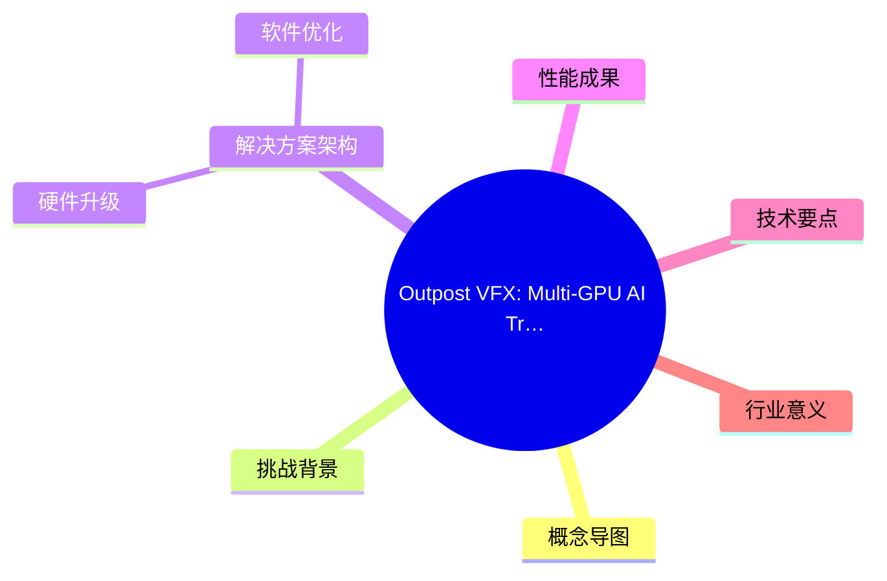
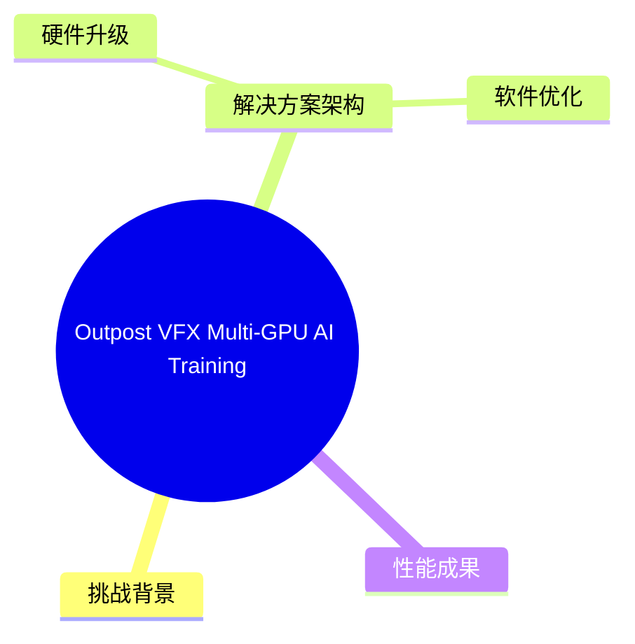
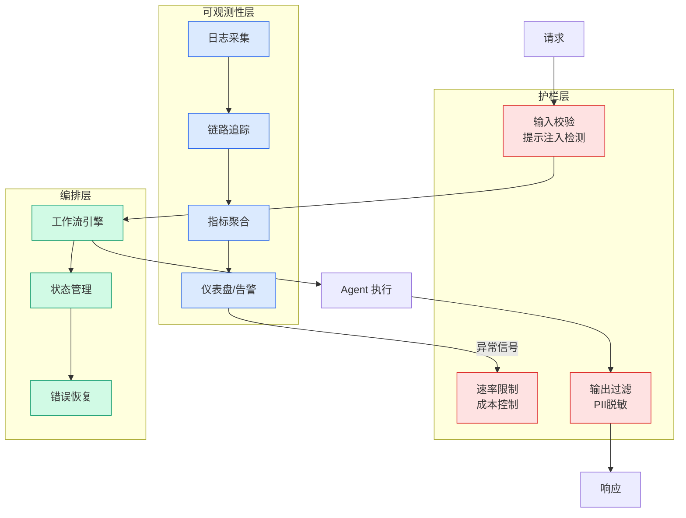

# Outpost VFX: Multi-GPU AI Training on AWS P5 for Visual Effects

> 📊 Level ⭐⭐ | 3.1KB | `entities/outpost-vfx-multi-gpu-ai-training-aws-p5.md`

# Outpost VFX: Multi-GPU AI Training on AWS P5 for Visual Effects

Outpost VFX 与 AWS Generative AI Innovation Center 合作，通过多 GPU 分布式训练将面部替换模型的训练速度提升 8 倍，显著缩短 VFX 制作周期。

## 概念导图

## 概念导图

## 挑战背景

传统面部替换工作流需要 5 天以上合成时间才能获得导演初审版本。Outpost VFX 开发的 AI 模型受限于单 GPU 计算能力：

- **单 GPU 瓶颈**：原有工具仅利用一块 GPU，VRAM 和计算容量受限
- **训练周期**：每次微调需 1-2 周，迭代缓慢
- **质量限制**：无法处理更高分辨率图像和更大规模数据集

## 解决方案架构

### 硬件升级

迁移至 **Amazon EC2 P5 实例**：
- **NVIDIA H100 GPU**：14,592 CUDA 核心，80GB HBM3 显存
- **NVLink 互联**：相比 G 系列实例的 PCIe，提供显著更高的梯度同步带宽
- **分布式训练**：多 GPU 并行化面部替换模型训练

### 软件优化

AWS 团队协助将模型代码转换为 **PyTorch Distributed Data Parallel (DDP)**：
- 模型权重复制到每个 GPU
- 每个批次处理更多图像
- 直接加速训练过程

## 性能成果

| 指标 | 优化前 | 优化后 | 提升 |
|------|--------|--------|------|
| 训练速度 | 1-2 周 | 2 天 | **8x** |
| 分辨率支持 | 有限 | 更高分辨率 | 质量提升 |
| 数据集规模 | 小数据集 | 更大规模 | 质量提升 |

**关键业务指标**：v001 初版交付客户时间从 1-2 周缩短至 2 天

## 技术要点

- **安全架构**：处理高度敏感的制作数据，符合严格安全要求
- **云原生栈**：Outpost VFX 自 2022 年起全面采用 AWS 虚拟化技术栈
- **扩展路径**：未来考虑 Amazon SageMaker AI 用于托管训练、模型版本控制和托管推理

## 行业意义

> "这些模型不再是研究实验；它们正在成为现代 VFX 管道的核心组成部分。" — Dheeraj Bhadani, Outpost VFX 首席软件架构师

多 GPU 加速是下一代创意工具的基础架构，使 AI 辅助面部替换能力能够在保持安全和可扩展性的同时，满足高端视觉特效制作的需求。

→ [原文存档](https://github.com/QianJinGuo/wiki-book/tree/main/docs/raw/articles/how-outpost-vfx-uses-aws-to-accelerate-ai-model-training-for.md)

---
## 关联
- 相关概念: [Harness Engineering](https://github.com/QianJinGuo/wiki/blob/main/concepts/harness-engineering-framework.md)

---

