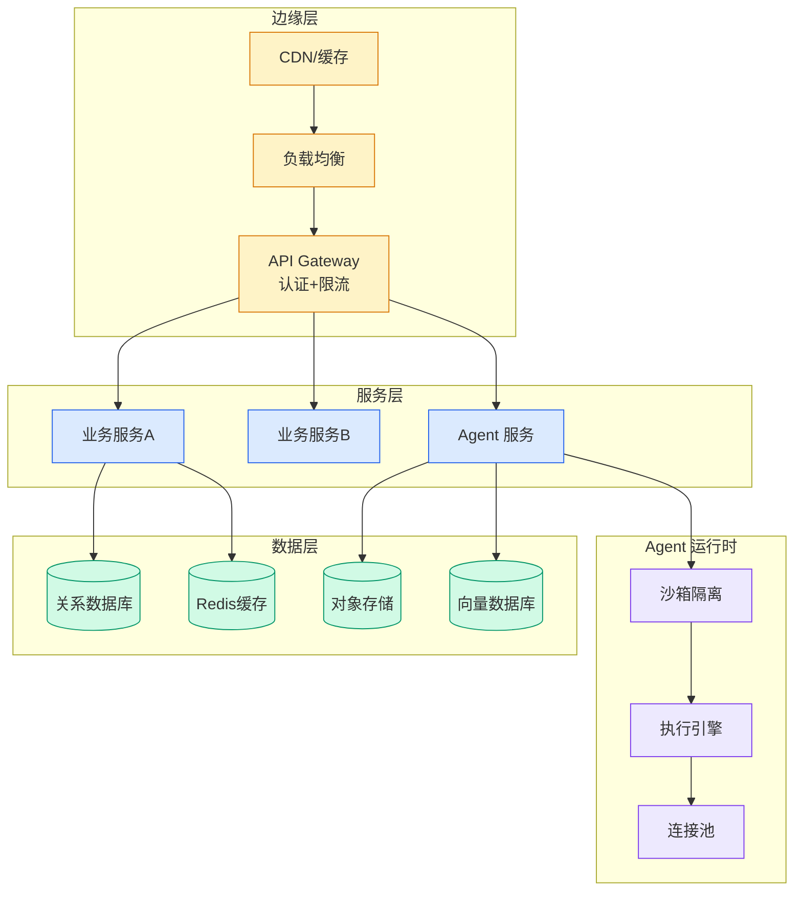

# Reference your own AWS Secrets Manager secrets in Amazon Bedrock AgentCore Identity

## Ch11.285 Reference your own AWS Secrets Manager secrets in Amazon Bedrock AgentCore Identity

> 📊 Level ⭐⭐ | 3.1KB | `entities/bedrock-agentcore-secrets-manager-identity.md`

# Reference your own AWS Secrets Manager secrets in Amazon Bedrock AgentCore Identity

→ [原文存档](https://github.com/QianJinGuo/wiki-book/tree/main/docs/raw/articles/bedrock-agentcore-secrets-manager-identity.md)

## 深度分析

Reference your own AWS Secrets Manager secrets in Amazon Bedrock AgentCore Identity 涉及agent领域的核心技术议题。
### 核心观点
1. sha256: 59ab9fcf9525ccb30d11b2162928a4cc0e1955d3db620fb2db6f9f07bc28ed70
# Reference your own AWS Secrets Manager secrets in Amazon Bedrock AgentCore Identity
AI agents are only as powerful as the tools they can access.
2. Whether retrieving customer data from a CRM, posting updates to Slack, or querying a GitHub repository, agents need to call external APIs, and that means securely passing credentials at runtime.
3. Getting that right, without hardcoding secrets in code or exposing them in agent prompts, is one of the defining challenges of building production-ready agentic systems.
4. Amazon Bedrock AgentCore Identity meets this challenge through credential providers and a token vault that automatically create and manage a secret in AWS Secrets Manager in your account for each Outbound credential provider resource.
5. This secret contains either the API key or client secret along with the other metadata for the external identity provider.

### 内容结构
- Example use cases
- Prerequisites
- Getting started
- Using the console
- A. Add an API key with a referenced secret
- B. Add an OAuth client secret with a referenced secret
- Using the AWS CLI
- Using an AI agent on your desktop

### 技术要点

- **agent架构**: 本文在agent方向提出的设计理念与实现路径
- **工程挑战**: 实际落地中面临的关键问题与应对策略
- **aws趋势**: 相关技术演进方向与新兴范式
### 关联实体

- [两万字详解Claude Code源码核心机制](../ch03/076-claude-code.html)
- [Agentops Operationalize Agentic Ai At Scale With Amazon Bedr](../ch04/299-agentops-operationalize-agentic-ai-at-scale-with-amazon-bed.html)
- [存之有序治之有矩Agent 记忆系统的工程实践与演进](../ch03/035-agent.html)
- [龙虾装上了可以用来干啥分享下我的 Openclaw 多智能体团队搭建经验 V2](ch11/232-openclaw.html)
- [Karpathy 最新访谈从 Vibe Coding 到 Agentic Engineering](../ch04/238-agentic.html)
- [构建基于多智能体架构的深度思考交易系统 V2](https://github.com/QianJinGuo/wiki/blob/main/entities/构建基于多智能体架构的深度思考交易系统-v2.md)

## 实践启示
1. **工程落地**: agent领域方案需关注可观测性、可维护性和成本效率
2. **技术选型**: 根据场景选择合适的技术栈，避免过度设计或盲目追新
3. **持续迭代**: 建立数据驱动的反馈闭环，持续优化系统表现
4. **风险管控**: 引入新技术需评估对现有系统稳定性的影响，做好降级预案

## 相关实体

- [MOC](https://github.com/QianJinGuo/wiki/blob/main/moc/prompt-engineering-guide.md)

---

