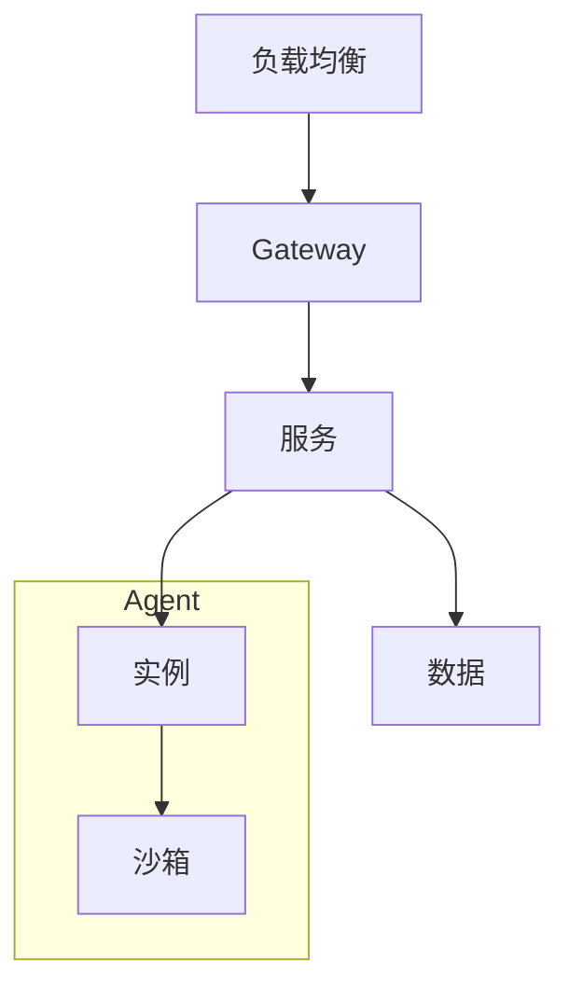

# Claude Opus 5 on AWS：Anthropic 最强 Opus 模型发布

## Ch11.287 Claude Opus 5 on AWS：Anthropic 最强 Opus 模型发布

> 📊 Level ⭐⭐ | 2.3KB | `entities/introducing-claude-opus-5-on-aws-anthropics-most-capable-opus-model.md`

# Claude Opus 5 on AWS：Anthropic 最强 Opus 模型发布

> **vxc score**: 64 | Anthropic 第五代Opus模型发布详情，覆盖Agentic Coding、知识工作、视觉理解、长时间任务等改进
> **发布**: Introducing Claude Opus 5 on AWS: Anthropic's most capable Opus model

## Summary

本文是 AWS 官方博客，宣布 Claude Opus 5 在 Amazon Bedrock 和 Claude Platform on AWS 上正式可用。Claude Opus 5 是 Anthropic 第五代 Opus 模型，在 Agentic Coding、知识工作、视觉理解、长时间运行任务等多个生产工作负载上提供显著改进。它在许多领域匹配 Claude Fable 5 的顶级智能水平，同时保持 Opus 级别的定价，并在 Bedrock 上默认提供零数据保留 (ZDR)。

## Key Points

- Claude Opus 5 是 Anthropic 第五代 Opus 模型，在 Agentic Coding、知识工作、视觉理解方面有显著改进。
- 在许多领域匹配 Claude Fable 5 的顶级智能水平，但保持 Opus 级别的定价。
- 在 Bedrock 上默认提供零数据保留 (ZDR)，满足企业数据治理要求。
- 由 Bedrock 下一代推理引擎驱动，支持企业安全、区域数据驻留和零操作员访问的扩展。
- 同时通过 Claude Platform on AWS 提供，支持请求级别的零数据保留。

## Related Entities

- [Claude Platform on AWS](../ch01/149-introducing-claude-platform-on-aws-anthropic-s-native-platf.html)

→ [原文存档](https://github.com/QianJinGuo/wiki-book/tree/main/docs/raw/articles/introducing-claude-opus-5-on-aws-anthropics-most-capable-opus-model.md)

---

