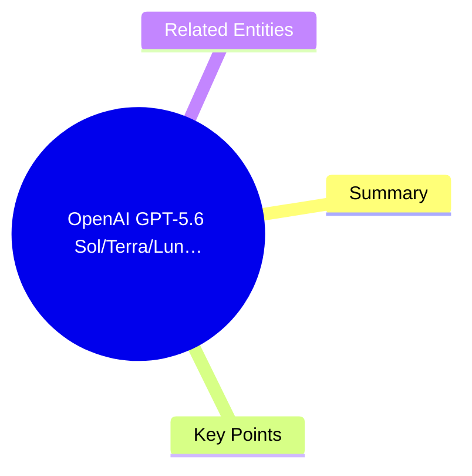
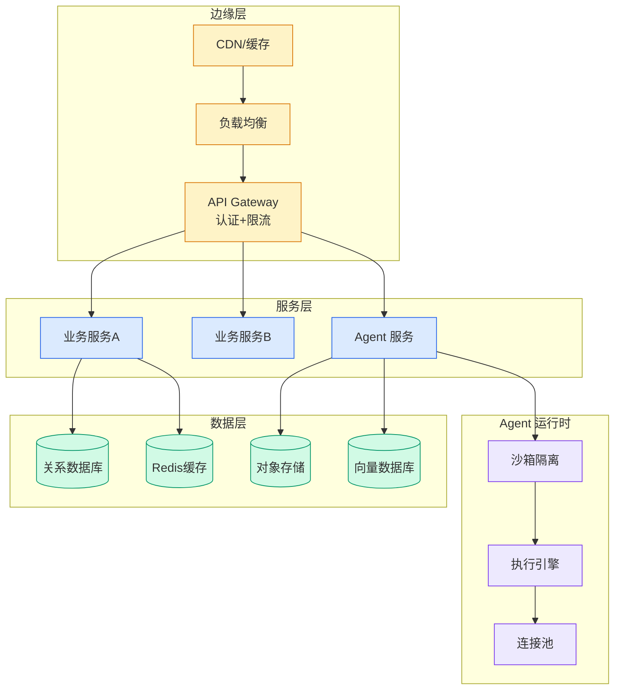

# OpenAI GPT-5.6 Sol/Terra/Luna on Amazon Bedrock 部署指南

## Ch11.288 OpenAI GPT-5.6 Sol/Terra/Luna on Amazon Bedrock 部署指南

> 📊 Level ⭐⭐ | 2.6KB | `entities/get-started-with-openai-gpt-56-sol-terra-and-luna-on-amazon-bedrock.md`

# OpenAI GPT-5.6 Sol/Terra/Luna on Amazon Bedrock 部署指南

> **vxc score**: 72 | AWS官方GPT-5.6部署指南，涵盖Sol/Terra/Luna三款模型的选型、推理配置、Prompt缓存、Codex集成、配额管理
> **发布**: Get started with OpenAI GPT-5.6 Sol, Terra, and Luna on Amazon Bedrock

## 概念导图

## Summary

本文是 AWS 官方博客，详细介绍 OpenAI GPT-5.6 家族（Sol/Terra/Luna）在 Amazon Bedrock 上的部署与使用指南。文章覆盖模型选型建议（Sol 适合自主编码 Agent 和长程推理、Terra 适合日常生产工作负载、Luna 适合高吞吐低延迟推理）、通过 Responses API 进行推理调用、利用 Prompt Caching 降低成本的策略、连接 OpenAI Codex 编码 Agent、以及配额管理与扩展规划。

## Key Points

- GPT-5.6 家族三款模型覆盖从旗舰推理到低成本推理的全谱系工作负载。
- Sol 是旗舰推理模型，适合自主编码 Agent 和长程推理任务；Terra 平衡性能与成本用于日常生产；Luna 针对高吞吐、低延迟推理优化。
- 通过 Bedrock 的 bedrock-mantle 端点统一访问，定价匹配 OpenAI 第一方价格，使用计入 AWS 承诺消费。
- 支持 Prompt Caching 降低推理成本，提供缓存 Token 用量测量。
- 可连接 OpenAI Codex 编码 Agent，支持配额管理和扩缩容规划。
- Prompt 和 Completion 不会被用于训练任何模型，也不会与模型提供商共享。

## Related Entities

- [GPT-5.6 定价层次与 Codex 合并](../ch01/516-codex.html)
- [OpenAI Models + Codex on Bedrock GA](ch11/162-amazon-bedrock.html)

→ [原文存档](https://github.com/QianJinGuo/wiki-book/tree/main/docs/raw/articles/get-started-with-openai-gpt-56-sol-terra-and-luna-on-amazon-bedrock.md)

---

