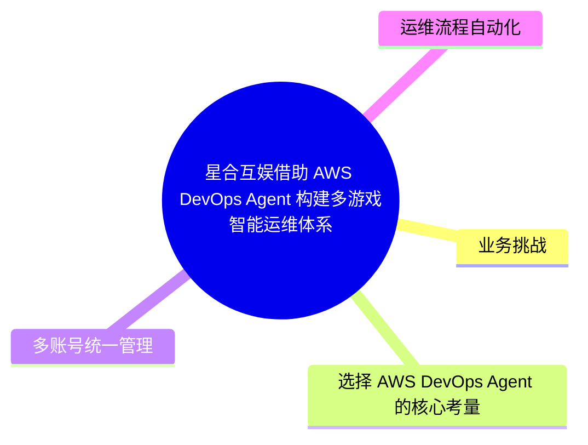
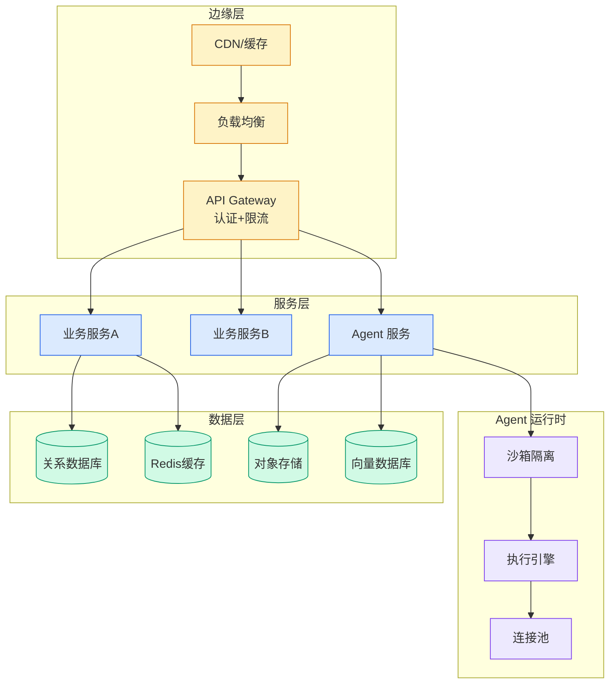

```mermaid
mindmap
  root(("星合互娱借助 AWS DevOps Agent 构建多游…"))
    概念导图
    业务挑战
    选择 AWS DevOps Agent 的核心考量
    落地实践
      多账号统一管理
      运维流程自动化
    实践启示
    相关实体
```

# 星合互娱借助 AWS DevOps Agent 构建多游戏智能运维体系

## Ch11.289 星合互娱借助 AWS DevOps Agent 构建多游戏智能运维体系

> 📊 Level ⭐⭐ | 3.1KB | `entities/星合互娱借助-aws-devops-agent-构建多游戏智能运维体系.md`

# 星合互娱借助 AWS DevOps Agent 构建多游戏智能运维体系

> **Background**：本文基于 AWS China Blog 的客户案例，介绍星合互娱（Xinghe Huyu）面对多游戏、多账号、小团队的运维压力，如何选择并落地 AWS DevOps Agent 的实践经验。

## 概念导图

## 概念导图

## 业务挑战

星合互娱是一家全球化游戏公司，运营多款游戏，面临多游戏、多账号（每个游戏独立 AWS 账户）、小团队（数人 SRE 团队支撑数十款游戏）的典型游戏公司运维困境。传统运维方式无法有效支撑这种"小团队管多游戏"的并行压力。

## 选择 AWS DevOps Agent 的核心考量

星合互娱在评估多种 AI 运维方案后，最终选择了 AWS DevOps Agent。核心原因在于：DevOps Agent 并非独立于现有体系之外的另一套工具，而是能够直接融入已有监控、代码和云账号体系，让 AI 在现有数据上发挥价值，而非要求团队重新建设数据管道。

## 落地实践

### 多账号统一管理
通过 DevOps Agent 的多账户支持能力，将多个游戏账户挂载在同一 Agent Space 下，实现单一入口统一管理所有游戏的监控和告警。

### 运维流程自动化
DevOps Agent 自动响应告警事件，执行调查流程，输出 RCA 报告。运维团队从被动响应模式转向主动预防模式，Agent 定期生成防护建议。

## 实践启示

游戏行业特有的运维痛点（多产品线、小团队、高频迭代）使得 AWS DevOps Agent 的自动化调查能力尤为有价值。核心经验：先从一个游戏账户开始建立信任，再逐步扩展覆盖范围；告警质量是 Agent 效率的前提，需要先行治理。

→ [原文存档](https://github.com/QianJinGuo/wiki-book/tree/main/docs/raw/articles/星合互娱借助-aws-devops-agent-构建多游戏智能运维体系.md)

## 相关实体
- [Habby 游戏借助 AWS DevOps Agent 实现智能运维最佳实践](ch11/289-aws-devops-agent.html)
- [AWS DevOps Agent 实战：云网络故障自主调查与修复建议](ch11/289-aws-devops-agent.html)
- [AWS DevOps Agent 实战：如何使用生成式 AI 加速故障演练](ch11/289-aws-devops-agent.html)
- [AgentCore Managed Harness](../ch04/683-agentcore-harness.html)

---

