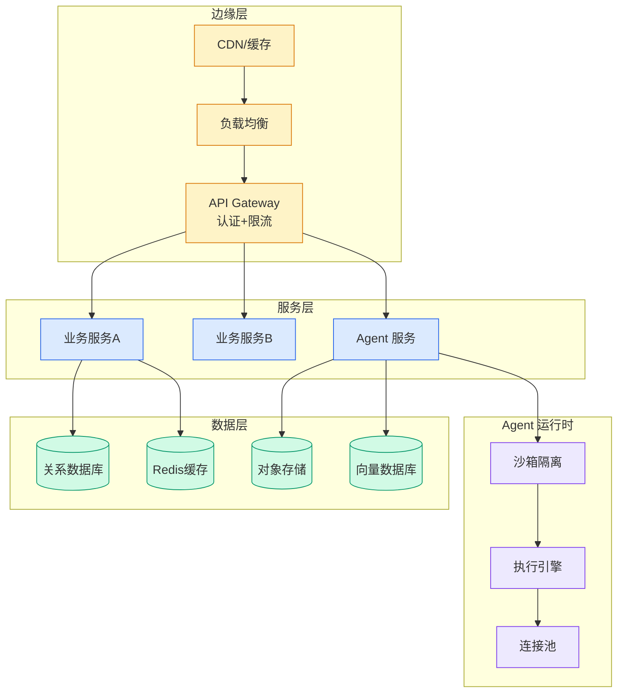

# Scaling medical content review at Flo Health with Amazon Bedrock

## Ch11.289 Scaling medical content review at Flo Health with Amazon Bedrock

> 📊 Level ⭐⭐ | 1.6KB | `entities/flo-health-medical-content-review-bedrock.md`

# Scaling medical content review at Flo Health with Amazon Bedrock – Part 2

## 核心内容

Flo Health 工程团队基于 AWS Generative AI Innovation Center 的 PoC，构建了一套基于 Amazon Bedrock 的 AI 驱动的医疗内容审核与生成系统。该系统通过引入专门的 AI Judge（分别负责医疗准确性、法律合规、品牌风格等维度），结合 MACROS 架构和 Retrieval Augmented Generation (RAG)，将每篇内容的审核时间缩短了 60%，内容吞吐量翻了三倍，且无需扩大医疗团队。

关键实践包括：针对不同任务选用不同层级的 Claude 模型（Haiku 用于轻量分类，Sonnet 用于高保真内容生成）；用 YAML 替代 JSON 作为输出格式（更鲁棒，解析错误更少）；用具体示例而非抽象规则进行提示工程；通过结构化反馈循环将每次专家修正转化为可复用的规则和示例，使重复错误减少 70% 以上。系统采用三层验证：内部医疗指南检查 → 外部可信医学来源验证 → 人类专家终审，确保 AI 始终作为智能助手而非替代品。

→ [原文存档](https://github.com/QianJinGuo/wiki-book/tree/main/docs/raw/articles/flo-health-medical-content-review-bedrock.md)

---

