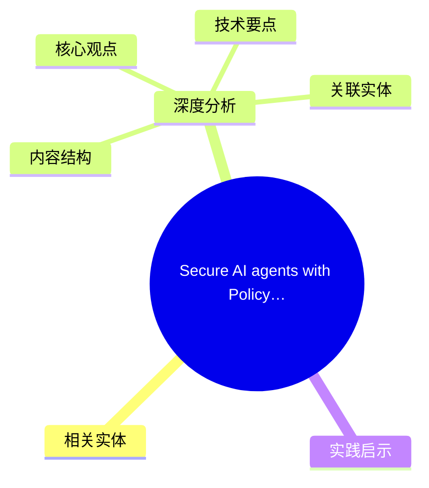
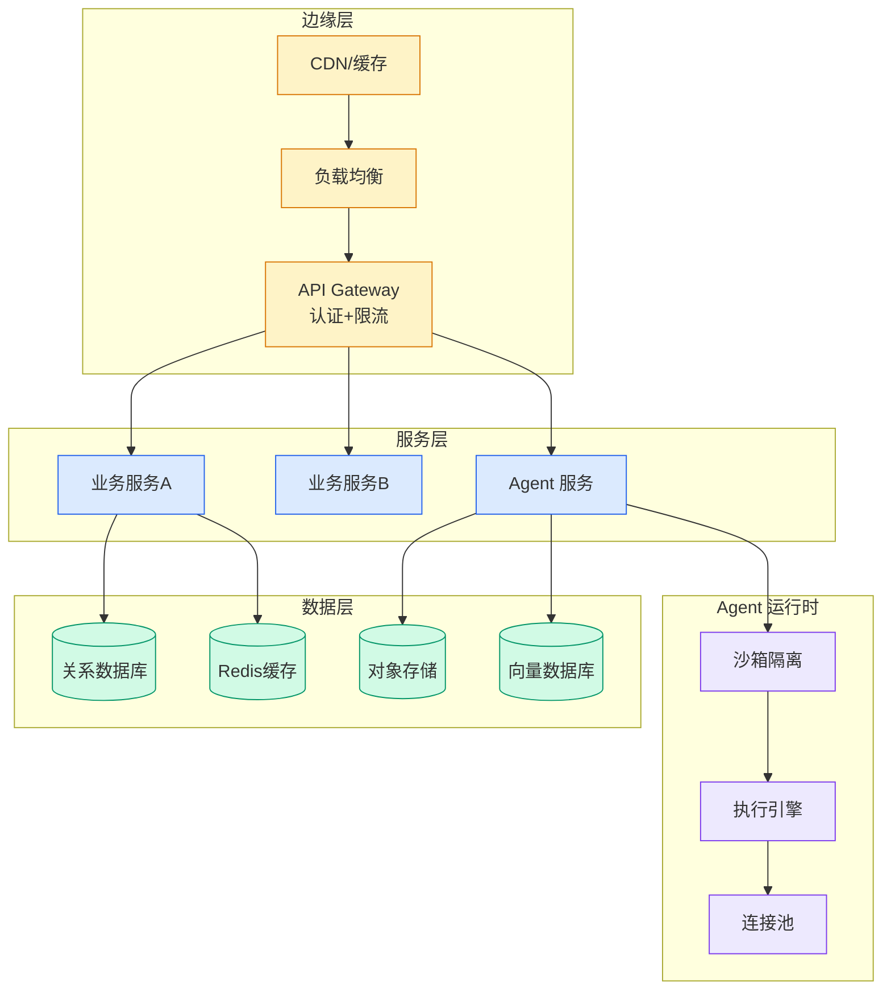

# Secure AI agents with Policy and Lambda interceptors in Amazon Bedrock AgentCore gateway

> 📊 Level ⭐⭐ | 3.0KB | `entities/secure-ai-agents-with-policy-and-lambda-interceptors-in-amaz.md`

# Secure AI agents with Policy and Lambda interceptors in Amazon Bedrock AgentCore gateway

## 概念导图

## 相关实体

- [direct connect (dx) 迁移最佳实践](ch11/039-direct-connect-dx.html)
→ [原文存档](https://github.com/QianJinGuo/wiki-book/tree/main/docs/raw/articles/secure-ai-agents-with-policy-and-lambda-interceptors-in-amaz.md)

## 深度分析

Secure AI agents with Policy and Lambda interceptors in Amazon Bedrock AgentCore gateway 涉及agent领域的核心技术议题。
### 核心观点
1. # Secure AI agents with Policy and Lambda interceptors in Amazon Bedrock AgentCore gateway
Securing AI agent behavior is a key customer challenge in building agentic solutions.
2. As enterprises rapidly adopt AI agents to automate workflows, they face a scaling challenge in managing secure access to tools across the organization.
3. Modern unified enterprise AI platforms have hundreds of agents serving users across the organization.
4. These agents need to access thousands of Model Context Protocol (MCP) tools spanning different teams, organizations, and business units.
5. The scale of these platforms creates a fundamental governance problem.

### 内容结构
- Prerequisites
- Solution overview
- Request flow
- Policy enforcement in AgentCore Gateway
- Design 1: Policy only
- Policy evaluation results for Design 1
- Benefits of policy-based enforcement
- Interceptors for dynamic control

### 技术要点

- **agent架构**: 本文在agent方向提出的设计理念与实现路径
- **工程挑战**: 实际落地中面临的关键问题与应对策略
- **architecture趋势**: 相关技术演进方向与新兴范式
### 关联实体

- [Karpathy 最新访谈从 Vibe Coding 到 Agentic Engineering](../ch04/633-agentic.html)
- [Openclaw 完全指南这可能是全网最新最全的系统化教程了32W字建议收藏](ch11/235-openclaw.html)
- [Karpathy Vibe Coding Agentic Engineering](../ch04/708-karpathy-vibe-coding-agentic-engineering.html)
- [Agentops Operationalize Agentic Ai At Scale With Amazon Bedr](../ch04/301-agentops-operationalize-agentic-ai-at-scale-with-amazon-bed.html)
- [存之有序治之有矩Agent 记忆系统的工程实践与演进](../ch03/035-agent.html)
- [你不知道的 Agent原理架构与工程实践 V2](../ch03/035-agent.html)

## 实践启示
1. **工程落地**: agent领域方案需关注可观测性、可维护性和成本效率
2. **技术选型**: 根据场景选择合适的技术栈，避免过度设计或盲目追新
3. **持续迭代**: 建立数据驱动的反馈闭环，持续优化系统表现
4. **风险管控**: 引入新技术需评估对现有系统稳定性的影响，做好降级预案

---

