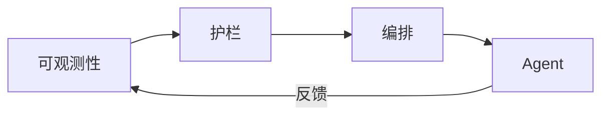

# LLaMA.cpp Deployment

## Ch11.292 LLaMA.cpp Deployment

> 📊 Level ⭐⭐ | 0.5KB | `entities/llama-cpp-deployment.md`

# LLaMA.cpp Deployment

> 🚧 占位页面 — 内容待补充

工具/产品/团队实体页面，待从相关 raw 文章中提取详细信息。

---
## 关联

- 相关概念: [Harness Engineering](https://github.com/QianJinGuo/wiki/blob/main/concepts/harness-engineering-framework.md)
- 相关: [Agent 架构](https://github.com/QianJinGuo/wiki/blob/main/concepts/agent-architecture.md)

---

