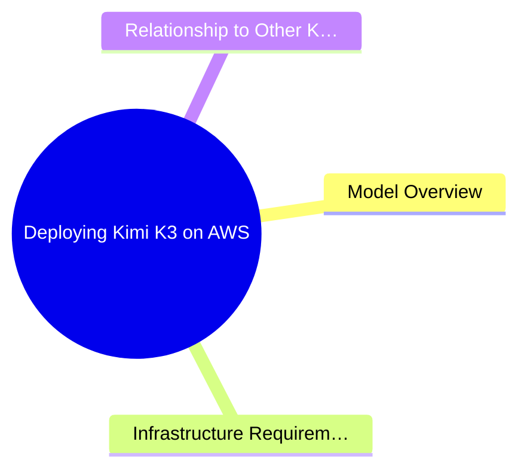
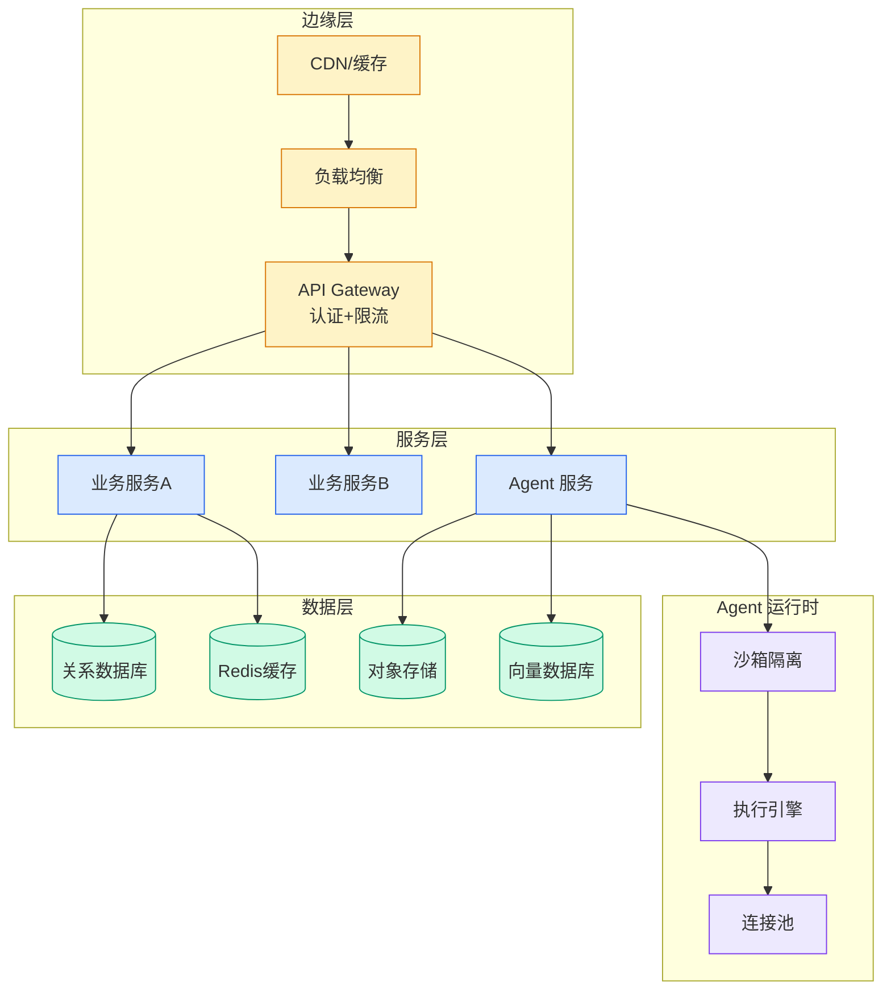

# Deploying Kimi K3 on AWS

## Ch11.293 Deploying Kimi K3 on AWS

> 📊 Level ⭐⭐ | 2.1KB | `entities/deploying-kimi-k3-on-aws.md`

# Deploying Kimi K3 on AWS

> **Background**: Based on the AWS ML Blog article "Deploying Kimi K3 on AWS" (2026-07-27), covering the deployment of Moonshot AI's 2.8T parameter MoE model on AWS infrastructure via SageMaker HyperPod and EKS.

## 概念导图

## Model Overview

Kimi K3 is a 2.8 trillion parameter Mixture of Experts (MoE) model released by Moonshot AI on July 27, 2026. It features Kimi Delta Attention (KDA), Gated Multi Head Latent Attention (MLA), and a Stable LatentMoE framework. The model distributes its parameters across 896 specialist experts, activating only 16 per token (approximately 104B active parameters per forward pass). It supports a 1M token context window and native multimodal (text + vision) capabilities.

## Infrastructure Requirements

Deploying a model of this scale requires substantial GPU compute. The article details two primary approaches:

- **Amazon SageMaker HyperPod**: Managed infrastructure for large-scale distributed training and inference
- **Amazon EKS**: Kubernetes-based deployment for more custom control

The model weights are distributed in **MXFP4** (Microscaling Floating Point 4-bit) format, providing a balance between model quality and memory efficiency. Serving requires a vLLM day-0 inference container for Kimi K3 (`vllm/vllm-openai:kimi-k3`).

## Relationship to Other Kimi K3 Entities

This article focuses specifically on the **AWS deployment** angle of Kimi K3, complementing existing entities that cover its architecture ([Kimi K3 2.8T Open Source Model 2026](../ch09/072-kimi-k3.html)), open-source release ([Kimi K3 2 8T Params Open Source](../ch01/650-kimi-k3-2-8t.html)), and weight escalation ([Kimi K3 The Open Weights Escalation](../ch01/497-kimi-k3-the-open-weights-escalation.html)).

→ [原文存档](https://github.com/QianJinGuo/wiki-book/tree/main/docs/raw/articles/deploying-kimi-k3-on-aws.md)

---

