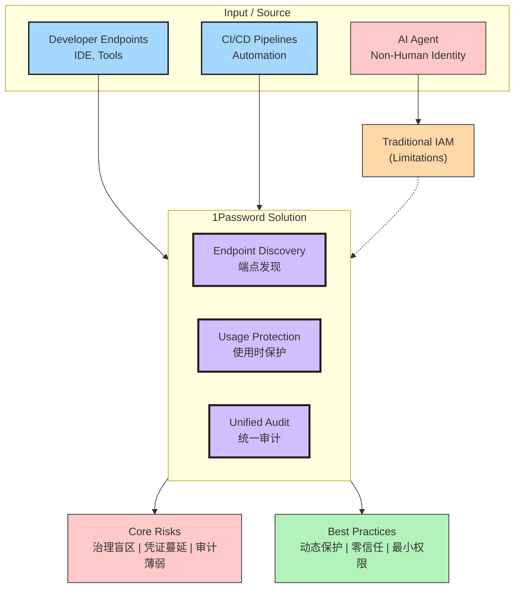

# Securing AI Agents and Machine Identities

## Ch12.043 Securing AI Agents and Machine Identities

> 📊 Level ⭐⭐ | 9.0KB | `entities/1password-securing-ai-agents-machine-identities.md`

## 可视化

### 架构图（Excalidraw / 推荐使用 ✨）

Shareable link: https://excalidraw.com/#json=OUQMTvqOC0O-tqvY2kjvR,0k90NsmJUHkicR8wSny03A

文件位置：`assets/entities/1password-securing-ai-agents-machine-identities.excalidraw`

> Flow moves from AI agents and developer endpoints through 1Password's three core capabilities to risks and best practices, with traditional IAM shown as a limitation requiring replacement.

### 架构图（Mermaid / 知识源 / 可嵌入）

### 封面图（AI 生成 / 装饰参考，仅供参考）

> Agnes image-2.0-flash 生成的 1536×1024 封面。文字可能有拼写错误（典型 AI 图像模型问题），**仅作视觉参考，请以上方 Excalidraw / Mermaid 图为准**。

### 三种可视化对比

| 格式 | 文字准确性 | 可编辑 | 风格 | 推荐场景 |
|------|----------|--------|------|----------|
| **Excalidraw** | ✓ 完美 | ✓ 浏览器/插件可改 | 手绘 (Virgil) | ✨ 首选：演示、分享、嵌入 |
| **Mermaid** | ✓ 完美 | ✓ 修改 .md 即可 | 干净矢量 | 代码嵌入、文本搜索、版本控制 |
| **AI 图像** | ✗ 常拼错 | ✗ 像素锁定 | 手绘 (AI 模拟) | 装饰、封面、社交分享卡 |

### 如何读架构图

1. **三个输入源**（蓝色）：AI Agent、Developer Endpoints、CI/CD Pipelines — 任何需要凭证的身份类型
2. **传统 IAM**（橙色）：左侧 limitation box — 无法覆盖机器工作流
3. **1Password 解决方案**（紫色）：三件套 — 端点发现 / 使用时保护 / 统一审计
4. **核心风险**（红色）：治理盲区 / 凭证蔓延 / 审计薄弱 — 不解决的代价
5. **最佳实践**（绿色）：动态保护 / 零信任 / 最小权限 — 实施方向

## 核心要点
- AI 代理和非人类身份正在扩展访问风险边界，传统 IAM 无法覆盖机器工作流凭证
- 开发者端点、IDE 内、CI/CD 管道中的凭证处于可见性盲区
- 应在凭证使用时动态保护，而非硬编码存储
- 需要建立覆盖人类和机器的统一审计追踪体系

## 背景与问题

随着 AI 代理和自动化工具的普及，访问控制模式正在发生根本性转变。传统的 IAM（身份和访问管理）系统主要针对人类身份设计，但如今凭证越来越多地由机器工作流在开发者端点、IDE 内部以及 CI/CD 管道中创建和使用。

这一转变带来三大核心挑战：

1. **治理盲区**：安全团队无法有效监控非人类身份的访问行为
2. **凭证蔓延**：机器身份产生的凭证分散在多个系统，难以集中管理
3. **审计薄弱**：传统审计日志难以追踪 AI 代理的操作轨迹

## 深度分析

### 非人类身份的风险特征

AI 代理具有自主决策和行动能力，其身份验证凭证（如 API 密钥、服务账户令牌）一旦泄露或被滥用，攻击者可以：

- 在无需二次验证的情况下横向移动
- 以机器身份执行敏感操作
- 绕过基于人类行为的异常检测机制

这与 [Tool Poisoning 攻击](../ch04/296-ai-tool-poisoning-exposes-a-major-flaw-in-enterprise-agent-s.md) 形成互补威胁——后者针对工具供应链，前者针对身份认证层。

### 传统 IAM 的局限性

传统 IAM 系统设计时假设：

- 身份数量有限且相对稳定
- 身份与特定人员强绑定
- 访问行为具有可预测的人类模式

这些假设在 AI 代理场景下均不成立。AI 代理可能同时以多种机器身份运行，且行为模式与人类显著不同。

### 1Password 的解决思路

根据 1Password 的 webinar 分享，其企业方案聚焦于三个核心能力：

1. **端点级发现**：从开发者端点开始识别非人类凭证
2. **使用时保护**：在凭证被调用的瞬间进行安全处理，而非静态存储
3. **统一审计**：生成跨越人类和机器身份的完整审计轨迹

这一思路与 [AWS 和 Cisco 的 AI Defense 方案](../ch04/030-ai-agent.md) 在「覆盖人类和机器的统一审计」目标上形成呼应，但 1Password 更聚焦于开发者端点侧的凭证发现与保护。

## 与其他安全方案的关联

| 维度 | 1Password 方案 | AWS/Cisco AI Defense | Tool Poisoning 防御 |
|------|---------------|---------------------|-------------------|
| **核心焦点** | 端点凭证发现与保护 | MCP/A2A 协议级安全 | 工具供应链验证 |
| **覆盖范围** | 开发者端点、IDE、CI/CD | AI Agent 通信协议 | 工具注册表元数据 |
| **防护阶段** | 凭证使用时的动态保护 | 协议层的注册与扫描 | 工具加载前的验证 |

详见 [MCP Gateway 与 AI Gateway 的安全对比](../ch11/078-ai-gateways-vs-mcp-gateways-what-security-teams-need-to-kno.md)。

## 实践启示

### 对于安全团队

- 立即盘点现有 AI 代理和自动化工具使用的凭证资产
- 评估现有 IAM 是否能覆盖非人类身份场景
- 建立专门的机器身份治理策略

### 对于开发团队

- 避免在代码中硬编码凭证，使用专门的密钥管理服务
- 在 CI/CD 流程中实施最小权限原则
- 为 AI 代理操作启用详细审计日志

### 对于组织

- 将非人类身份纳入整体零信任架构
- 定期审计 AI 代理的权限范围和实际使用情况
- 准备应对 AI 代理被攻击后的应急响应流程

## 相关实体

- [AgentCore Identity](../ch11/229-aws-bedrock-agentcore.md) — AWS Bedrock Agent 身份与访问管理

→ [原文存档](https://github.com/QianJinGuo/wiki/blob/main/raw/articles/1password-securing-ai-agents-machine-identities.md)

---

