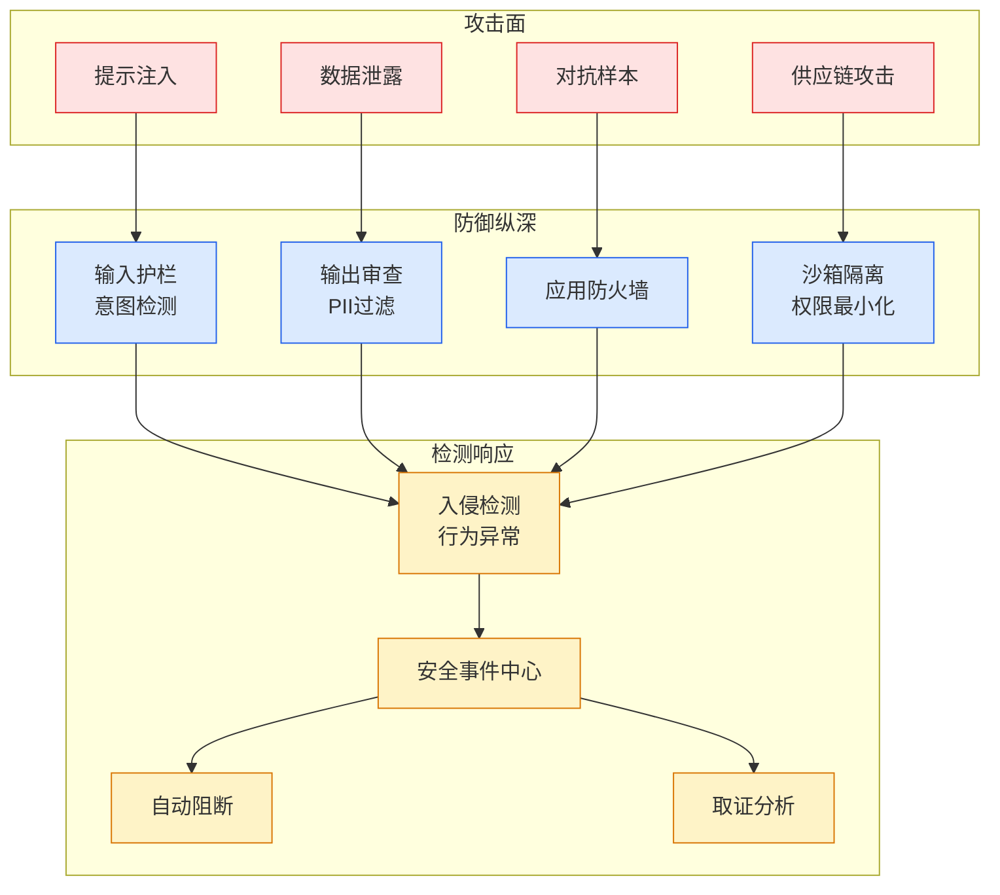

# On Post-Quantum Security Adoption

## Ch12.114 On Post-Quantum Security Adoption

> 📊 Level ⭐⭐ | 4.0KB | `entities/on-post-quantum-security-adoption.md`

# On Post-Quantum Security Adoption

Published Time: 2026-06-15

Markdown Content:
From Alex’s [blog post](https://alexwlchan.net/2026/post-quantum-blog/), I’ve learned that there are enough recent breakthroughs in quantum computing that I should take post-quantum cryptography seriously. [Google](https://blog.google/innovation-and-ai/technology/safety-security/cryptography-migration-timeline/) and [Cloudflare](https://blog.cloudflare.com/post-quantum-roadmap/) both set a target of 2029 for having their systems secure against quantum computers. Similarly, the [UK government](https://www.ncsc.gov.uk/guidance/pqc-migration-timelines) is targeting 2035.

The issue is that cryptography is built upon math problems that are difficult to solve. Quantum computers make solving some of these problems such as integer factorization and discrete logs easier. If someone has a quantum computer that can sufficiently solve those two problems, then they can likely decrypt many ciphertexts that were produced using [asymmetric cryptography](https://en.wikipedia.org/wiki/Public-key_cryptography) techniques (think public/private key-pairs). Wikipedia has a great article discussing [post-quantum cryptography](https://en.wikipedia.org/wiki/Post-quantum_cryptography) if you want to read more.

Given all that, if the cost isn’t too high then it’s not a bad idea to look at our current systems and see what we can make quantum-resistant today. Otherwise, we risk being vulnerable to [harvest now, decrypt later](https://en.wikipedia.org/wiki/Harvest_now,_decrypt_later) attacks. This is where an adversary stores encrypted packets until they have a computer powerful enough to break the encryption. You might wonder if encrypted packets from 5 years ago matter. Though if you’re like me, chances are you had to transmit personally identifiable information over the internet for jobs, housing, etc. In the US, it is [really difficult](https://www.ssa.gov/faqs/en/questions/KA-02220.html) to change your social security number.

We’ll explore three different protocols I rely on and how we can make them post-quantum resistant.

## SSH

OpenSSH implemented and made default post-quantum key agreement [back in April 2022](https://www.openssh.org/pq.html). At the time of writing, the `mlkem768x25519-sha256` scheme is used. That’s a mouthful but it essentially describes what the scheme is:

*   `mlkem`: [Module lattices](https://en.wikipedia.org/wiki/Lattice-based_cryptography)[key encapsulation mechanism](https://en.wikipedia.org/wiki/Key_encapsulation_mechanism) (also known as key-exchange)
*   `768`: Not sure what this means, sorry.
*   `x25519`: [Elliptic curve](https://en.wikipedia.org/wiki/Curve25519) used in the classical Diffie-Hellman key-exchange.
*   `sha256`: The hash function used to [combine the keys](https://datatracker.ietf.org/doc/draft-ietf-sshm-mlkem-hybrid-kex/) generated from ML-KEM and x25519 (see Section 2.4 of previous link).

As you might notice, this is a hybrid quantum/classical algorithm. This is a hedg

→ [原文存档](https://github.com/QianJinGuo/wiki-book/tree/main/docs/raw/articles/on-post-quantum-security-adoption.md)

---

