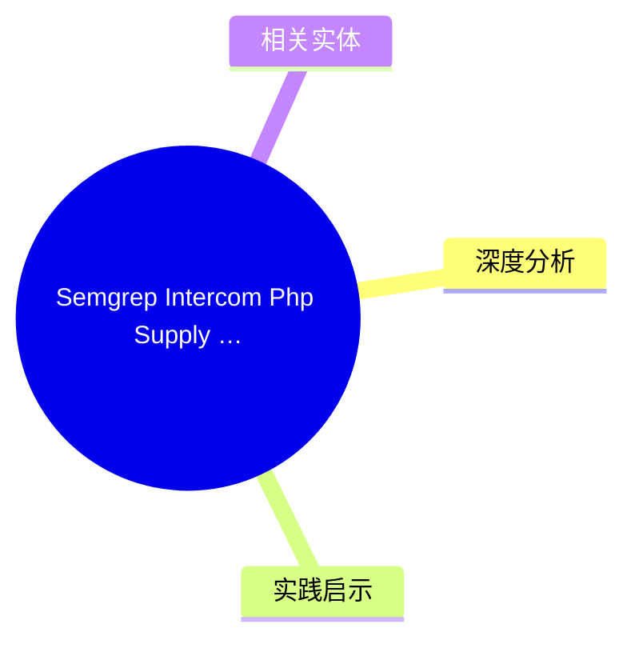
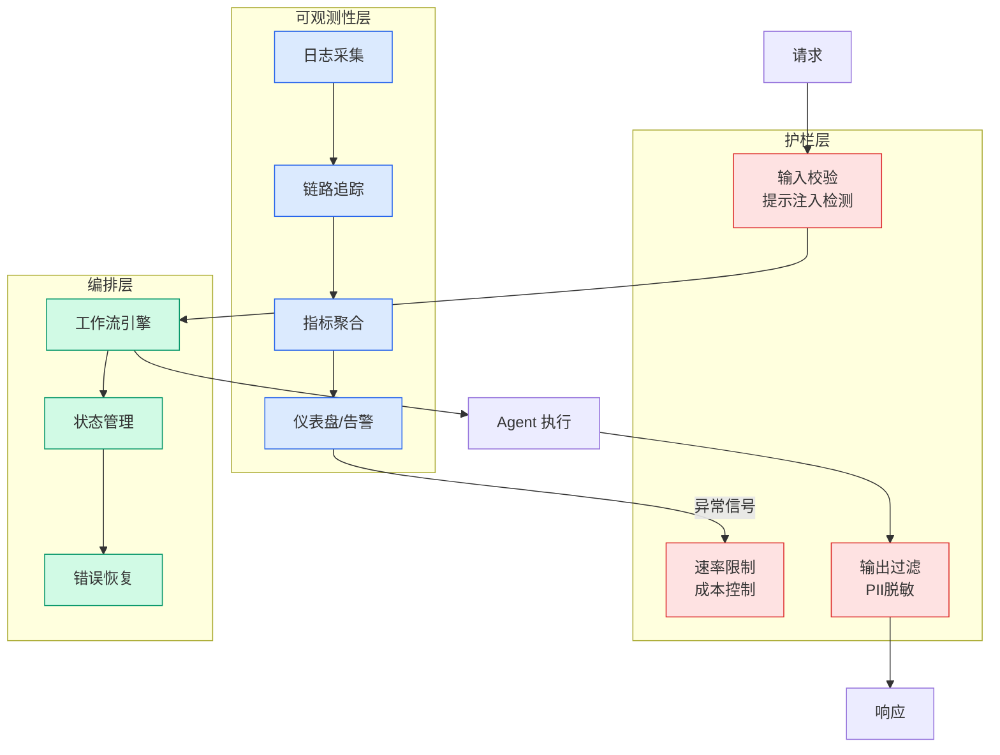

# Semgrep Intercom Php Supply Chain

## Ch12.117 Semgrep Intercom Php Supply Chain

> 📊 Level ⭐⭐ | 3.7KB | `entities/semgrep-intercom-php-supply-chain.md`

# Malicious Intercom PHP Package Mini-Shai-Hulud
Semgrep security research: malicious Intercom PHP package spreading Mini-Shai-Hulud attack via Packagist/Composer. Attack chain, IOCs, code-level analysis.
**Source**: [raw article](https://github.com/QianJinGuo/wiki-book/tree/main/docs/raw/articles/semgrep-intercom-php-security.md) | **Review**: value=7 confidence=8

## 概念导图

## 深度分析

**PHP 供应链攻击的精细化演进**：
1. **生态系统的精准定位**：攻击者选择 Intercom PHP 包（而非直接攻击框架本身），利用开发者对官方客户端库的信任——这类包名劫持（typosquatting/package renaming）是供应链攻击的低成本高回报路径
2. **Composer 插件机制滥用**：通过 Composer 插件而非直接包投递实现持久化，这意味着恶意代码在 `composer install` 时即以安装者权限运行，而非依赖包的受限上下文
3. **Mini-Shai-Hulud 命名含义**：Hulud 是弗兰肯斯坦怪物的作者 Mary Shelley 家族的文学作品中的沙漠蠕虫；这一命名暗示攻击者可能具有文化背景或特定叙事意图
4. **Packagist 的中间人位置**：作为 PHP 的官方包索引，Packagist 一旦被污染，影响范围覆盖所有使用 Composer 的 PHP 项目——这是一种基础设施级别的信任滥用
5. **Semgrep 的检测价值**：Semgrep 作为静态分析工具能够检测 Composer 插件的异常行为和恶意代码模式，说明代码安全扫描已成为供应链防御的必要环节
PHP 生态的供应链攻击揭示了一个深层问题：Composer 的插件机制权限过大，缺乏沙箱隔离；包名验证完全依赖开发者肉眼识别而非加密签名验证。

## 实践启示
- **Composer 安全性**：使用 `--no-plugins` 标志安装来源不明的包；审查 Composer 插件的 JSON 配置，拒绝在生产环境安装非必要的插件
- **包管理策略**：在 `composer.json` 中锁定精确版本而非使用 `*` 通配符；定期审查 `vendor/` 目录的变更
- **供应链安全检测**：使用 Semgrep 或同类 SAST 工具扫描依赖包中的已知恶意模式；建立 CI/CD 中的依赖审计流程
- **组织层面的包治理**：维护内部镜像/私有包源；制定白名单机制，仅允许来自受信任发布者的包安装
- **开发者教育**：定期培训开发者识别包名误植攻击（typosquatting）；强调使用完整的包 URL 而非简短包名

## 相关实体
- [semgrep intercom php security](ch12/106-semgrep-intercom-php-security.html)
- [rigged-game-scarcruft-compromises-gaming-platform-supply-chain-attack](../ch01/759-scarcruft.html)
- [Semis Memo: Supply Chain Inheritance](../ch01/641-semis-memo-supply-chain-inheritance.html)
- [Postmortem: TanStack npm supply-chain compromise | TanStack Blog](ch12/035-postmortem-tanstack-npm-supply-chain-compromise-tanstack.html)
- [Amazon launches Supply Chain Services for businesses of all sizes](../ch05/094-ai.html)

→ [原文存档](https://github.com/QianJinGuo/wiki-book/tree/main/docs/raw/articles/2026.md)

- [Semis Memo: Supply Chain Inheritance](../ch05/094-ai.html)
- [MOC](https://github.com/QianJinGuo/wiki/blob/main/moc/security-landscape.md)

---

