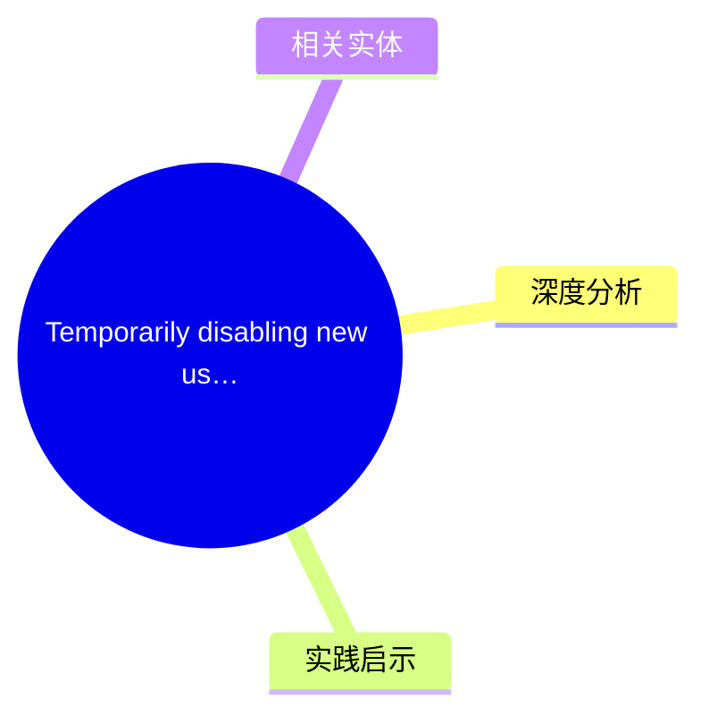
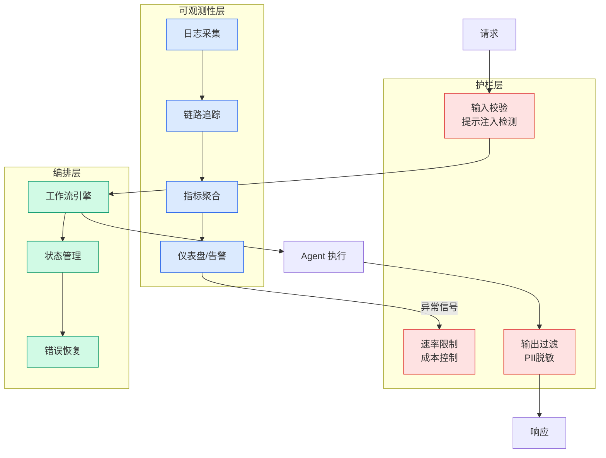

# Temporarily disabling new user registrations

## Ch12.124 Temporarily disabling new user registrations

> 📊 Level ⭐⭐ | 3.0KB | `entities/temporarily-disabling-new-user-registrations.md`

> -> [原文存档](https://github.com/QianJinGuo/wiki-book/tree/main/docs/raw/articles/temporarily-disabling-new-user-registrations.md)

## 概念导图

## 核心要点

- 来自 newsletter 的高质量技术文章

## 深度分析
RubyGems 这次事件是一个典型的"开源基础设施遭受 DDoS + spam 攻击"的案例，虽然没有造成服务中断（gem 安装和推送对现有用户正常），但攻击者利用注册功能批量创建 bot 账号并推送恶意包，说明开源包管理平台的供应链安全是一个持续性的攻击面。
几个值得注意的细节：第一，攻击者在注册环节发起，说明人机验证（CAPTCHA）或更严格的注册审核机制是必要的——但这也意味着对正常开发者会有摩擦，RubyGems 选择了"先关注册，等 WAF 和 rate limiting 上线再重开"的务实策略。第二，攻击者推送了 500+ 恶意包且全部被 yank，说明 RubyGems 的安全响应速度还是不错的，但"事后再 yank"和"事前阻止"之间存在时间窗口，供应链攻击在这个窗口内已经可以造成影响。
Adrian Wong 在另一篇文章（sovereign cloud 事件）中的观察在这里也适用：RubyGems 作为关键开源基础设施，其运营方对安全事件的响应方式（关闭注册 vs 实时拦截）会直接影响大量下游开发者的日常工作。这是一个典型的"基础设施杠杆效应"——一个看似小的安全决策，影响面远超运营团队的预估。

## 实践启示
- **对你的 CI/CD 链路做 audit**：如果你的项目依赖 RubyGems 作为 gem source，这次事件提醒你需要检查：你的 CI 是否锁定了 gem 版本（而非每次都拉最新）、是否有 hash verification、以及是否有内部 gem mirror 作为 fallback
- **关注 registry 健康度**：RubyGems 的事件（500+ 恶意包被 yank）说明即便是有安全意识的平台也难以做到完全事前防御。你的供应链安全策略应该假设"包可能在某个时间窗口内是恶意的"，而不是假设"platform 不会让恶意包上架"
- **WAF 和 rate limiting 的必要性**：RubyGems 选择与 Fastly 协作启用 WAF + rate limiting ，对于运营公共 API 或开放注册平台的技术团队，这个组合是防御 spam 和 DDoS 的基础层
→ [原文存档](https://github.com/QianJinGuo/wiki-book/tree/main/docs/raw/articles/temporarily-disabling-new-user-registrations.md)

## 相关实体

- [Temporarily disabling new user registrations](https://github.com/QianJinGuo/wiki/blob/main/entities/rubygems-temp-disable-registrations.md)
- [IC work is the new career flex](../ch03/009-ic-work-is-the-new-career-flex.html)
- [New and improved Agent governance intelligent workflows](../ch03/035-agent.html)

---

