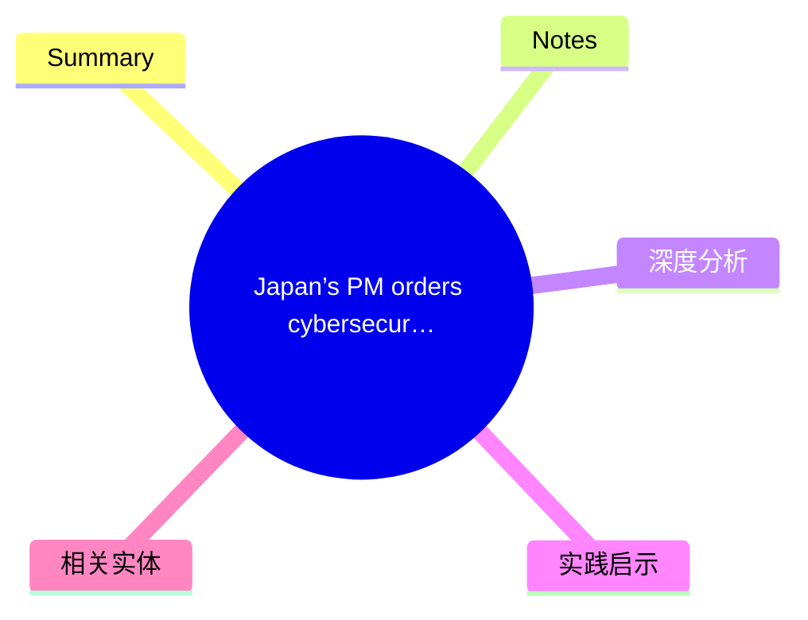
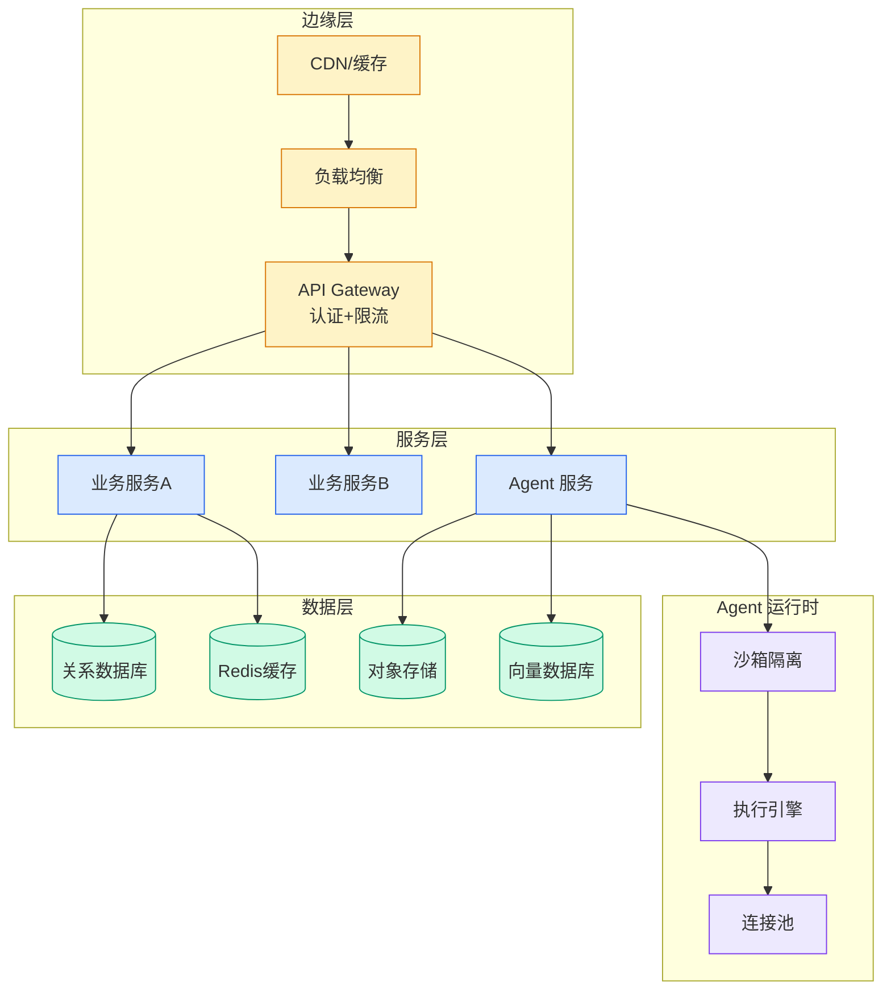

# Japan’s PM orders cybersecurity review to defend against Anthropic Mythos

## Ch12.125 Japan’s PM orders cybersecurity review to defend against Anthropic Mythos

> 📊 Level ⭐⭐⭐⭐⭐ | 3.0KB | `entities/japan-pm-cybersecurity-review-anthropic-mythos.md`

> -> [原文存档](https://github.com/QianJinGuo/wiki-book/tree/main/docs/raw/articles/japan-pm-cybersecurity-review-anthropic-mythos.md)

## 概念导图

## Summary

7×8=56 - Article ingested from newsletter candidate pipeline.

## Notes
→ [原文存档](https://github.com/QianJinGuo/wiki-book/tree/main/docs/raw/articles/japan-pm-cybersecurity-review-anthropic-mythos.md)

## 深度分析
日本首相下令对 Anthropic Mythos 进行网络安全审查，这一事件折射出**国家级安全监管与 AI 技术发展之间的深层矛盾**。Mythos 作为 Anthropic 的漏洞赏金计划，其"greatest marketing stunt"的争议揭示了 AI 安全问题的双面性。
关键分析：

- **漏洞赏金的边界**：漏洞赏金计划究竟是安全改进还是变相营销？日本政府的审查态度表明监管机构对此持谨慎态度
- **AI 系统的攻击面扩大**：随着 AI Agent 进入生产环境，其复杂性和潜在攻击向量急剧增加
- **国家安全视角**：主要经济体开始将 AI 系统视为关键基础设施的一部分，相应监管随之加强
这一事件预示着未来 AI 产品进入敏感市场将面临更严格的安全审查。

## 实践启示
1. **AI 产品出海需重视合规**：进入不同国家的市场前，充分了解当地的网络安全和 AI 监管要求
2. **安全与营销的平衡**：漏洞赏金计划应建立透明的运营机制，避免被质疑为营销噱头
3. **企业主动拥抱监管**：在 AI 系统部署前，主动进行安全评估和合规审查，降低被调查风险
4. **关注国际监管趋势**：日本的做法可能成为其他国家参考的模板，企业应提前布局应对全球性 AI 监管
→ [原文存档](https://github.com/QianJinGuo/wiki-book/tree/main/docs/raw/articles/japan-pm-cybersecurity-review-anthropic-mythos.md)

## 相关实体
- [Anthropic PM 的 Agentic 工作流](../ch04/471-anthropic-pm-agentic.html)
- [Anthropic's bug-hunting Mythos was greatest marketing stunt ever says curl creator](ch12/109-anthropic-s-bug-hunting-mythos-was-greatest-marketing-stunt.html)

→ [原文存档](https://github.com/QianJinGuo/wiki-book/tree/main/docs/raw/articles/2026.md)

- [Anthropic's bug-hunting Mythos was greatest marketing stunt ever, says cURL creator](../ch01/1326-anthropic.html)
- [anthropic vs dow (department of war) 与开源模型的 5-10 年权力均衡](../ch01/1326-anthropic.html)
- [dario amodei 2026 policy on the ai exponential](../ch05/092-ai.html)

---
