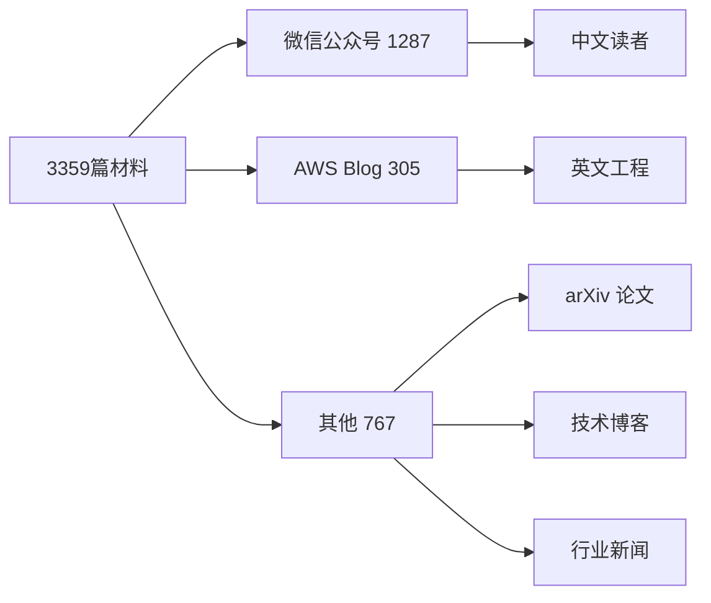

# 参考文献
> 本书基于 **3359** 篇一手 AI 材料系统编撰。
> 涵盖 **354** 个来源站点。

---
## 主要来源
| 来源 | 文章数 |
|---|---|
| mp.weixin.qq.com | 1287 |
| aws.amazon.com | 305 |
| www.interconnects.ai | 27 |
| www.oneusefulthing.org | 22 |
| netflixtechblog.com | 20 |
| www.theregister.com | 20 |
| huggingface.co | 19 |
| unknown | 15 |
| thehackernews.com | 13 |
| developer.nvidia.com | 13 |
| arxiv.org | 12 |
| www.anthropic.com | 9 |
| www.cio.com | 9 |
| deepmind.google | 9 |
| www.testingcatalog.com | 8 |
| juejin.cn | 8 |
| hackread.com | 8 |
| blog.crewai.com | 7 |
| claude.com | 6 |
| www.infoworld.com | 6 |
| github.com | 6 |
| www.a16z.news | 6 |
| www.ciodive.com | 6 |
| pytorch.org | 6 |
| www.microsoft.com | 6 |
| github.blog | 5 |
| blog.google | 5 |
| stochasticparrot.substack.com | 5 |
| lovable.dev | 5 |
| depthfirst.com | 5 |

---
> 共 354 个来源，3359 篇实体。

## 来源分布

