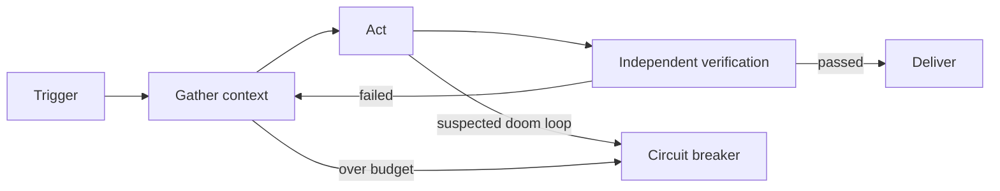

# Chapter 3 Anatomy of the Agent Loop: The Minimal Cycle and Its Five Organs

!!! abstract "Learning objectives"
    - Write a framework-free agent loop in ~60 lines of Python, and internalize that "the model is a subroutine; the loop is the program";
    - Distinguish open loops from closed loops, and explain why a loop without a verifier must fail;
    - Design stop conditions, and detect and stop doom loops.

## 3.1 First, an inversion: the model does not run the system; the system runs the model

The beginner's mental model: I call the model, the model does the work. The engineering model inverts this: **your program is the main program; the model is a called, probabilistic subroutine.** The loop is the main program's body: it decides when the model is invoked, what it sees, what happens after each step, and when to stop.

Boris Cherny (creator of Claude Code) summarized his job in 2026 as "my job is writing loops." Peter Steinberger went further: "You shouldn't be writing prompts for coding agents anymore. You should be designing loop mechanisms." (`moc/loop-engineering`). Not rhetoric: prompts solve "how to phrase the next sentence"; loops solve "how does this work keep going, how do we know it's right, when does it stop."

From this chapter on, our running example `fix-agent` takes the stage: a minimal coding agent that repairs failing tests. Each turn it does three things — **gather context (read code) → act (change code) → verify (run tests)** — and repeats until tests pass or the budget runs out.

## 3.2 Minimal implementation: ~60 lines, no framework

```python
import json, subprocess
from pathlib import Path
from openai import OpenAI

client = OpenAI()

TOOLS = [
    {"type": "function", "function": {
        "name": "list_dir", "description": "List directory contents",
        "parameters": {"type": "object", "properties": {
            "path": {"type": "string"}}, "required": ["path"]}}},
    {"type": "function", "function": {
        "name": "read_file", "description": "Read a file's contents",
        "parameters": {"type": "object", "properties": {
            "path": {"type": "string"}}, "required": ["path"]}}},
    {"type": "function", "function": {
        "name": "run_tests", "description": "Run the test suite and return output",
        "parameters": {"type": "object", "properties": {}}}},
]

def execute(name: str, args: dict) -> str:
    """Tool execution layer: the only place the loop touches the real world."""
    if name == "list_dir":
        return "\n".join(p.name for p in Path(args["path"]).iterdir())
    if name == "read_file":
        return Path(args["path"]).read_text()[:4000]      # truncate to protect context
    if name == "run_tests":
        r = subprocess.run(["pytest", "-x", "-q"],
                           capture_output=True, text=True, timeout=120)
        return (r.stdout + r.stderr)[-4000:]
    raise ValueError(f"unknown tool: {name}")

def run(goal: str, max_steps: int = 15) -> str:
    messages = [
        {"role": "system", "content":
            "You are an engineer fixing failing tests. Read code before editing; "
            "make one small change at a time; run tests after each change; "
            "report done only when the suite is green."},
        {"role": "user", "content": goal},
    ]
    for step in range(max_steps):                          # stop condition 1: step budget
        resp = client.chat.completions.create(
            model="your-model", messages=messages, tools=TOOLS)
        msg = resp.choices[0].message
        messages.append(msg)
        if not msg.tool_calls:                             # no tools = model claims done
            return msg.content
        for call in msg.tool_calls:
            result = execute(call.function.name,
                             json.loads(call.function.arguments))
            messages.append({"role": "tool",
                             "tool_call_id": call.id, "content": result})
    return "REACHED_MAX_STEPS"                             # stop condition 2: budget gone
```

Sixty lines containing the entire anatomy of an agent loop:

| Organ | Where in the code | Role |
|-------|-------------------|------|
| **State** | the `messages` list | The loop's only memory; every step's output is appended |
| **Tool contract** | `TOOLS` + `execute` | What the model can do; the schema is the contract, `execute` is fulfillment |
| **Control flow** | `for step in range(max_steps)` | Continue or stop — **in code, not in the model** |
| **Observation feedback** | `role: "tool"` messages | Tool results fed back to the model, forming feedback |
| **Termination semantics** | no tool_calls / budget exhausted | Two stops: the model claims done vs. the system force-stops |

Note that **"only report done when the suite is green" in the system prompt is engineering-wise weak** — it is a request, not a mechanism. The model can simply never call `run_tests` and declare victory, and the loop can do nothing about it. That is Chapter 4's protagonist, the verifier. For now, keep the dividing line: **rules in prompts are "please don't"; checks in loops are "can't"** (the distinction as drawn by front-line practice; see the hook-vs-documentation contrast in Ch 8).

## 3.3 Open vs closed: a loop is not a timer

The most common misunderstanding: a loop is a cron — "re-run the agent every 5 minutes." Such **open loops** (feedback-free) fail predictably: the agent repeats itself inside the loop, confirming its own errors until the budget dies (`moc/loop-engineering`; `entities/loop-engineering-feedback-control-system`).

A **closed loop** is what deserves the name. Four things, all required:

1. **Verifier gate**: every cycle gets independent verification — tests, review, sub-agent. Never self-review.
2. **Stop conditions**: tests pass / goal achieved / budget exceeded / rollback triggered — four stop paths, written down in advance.
3. **Rollback**: when the loop detects quality degradation, it can return to the last good state (a Git commit is the usual implementation).
4. **Human in the loop**: value conflicts and irreversible actions return control to a person.

In control-theory terms (`entities/loop-engineering-feedback-control-system`): the verifier is the sensor, stop conditions the comparator, the budget cap the fuse, rollback the relief valve. **A loop is not "running repeatedly"; it is "every run gets feedback."**



## 3.4 The five-stage cycle and two scales

The converged practice shape is five stages: **discover → plan → execute → verify → iterate** (`moc/loop-engineering`). Pass verification and deliver; fail and re-enter with the verdict attached. `fix-agent` is a minimized form: discover (read test output), plan (inside the model), execute (edit), verify (run tests), iterate.

Loops come in two scales (Peter Steinberger's division, `entities/loop-engineering-feedback-control-system`):

- **Single-agent loop**: one agent runs the whole cycle. Focused goals, bounded scope. `fix-agent` belongs here.
- **Fleet loop**: an orchestrator decomposes the goal → specialist agents each own a stage → sub-agents do fine-grained work → evaluation gates hold quality. Complex projects at scale — the world of Chapters 10 and 11.

Cost expectations first: a single-agent loop runs roughly 50K–200K tokens per task; a fleet loop roughly 0.5M–2M. Cheaper models and longer contexts make these viable, but **a loop without a budget cap is a circuit without a fuse** (Chapter 5).

## 3.5 Inner and outer loops

Samuel McDonnell's cut is especially useful for engineers (`entities/loop-engineering-feedback-control-system`):

- **Inner loop**: in-task self-checking — write tests, run tests, fix from failures. Mainstream agents already do this well.
- **Outer loop**: cross-session persistence of lessons — "the right lessons, at the right granularity, written to the right place" (AGENTS.md, SKILL.md, progress files).

His verdict: the inner loop is mature; **the outer loop is only half-built** — the repository does not forget, but the model does, and value is sitting on the table unclaimed. Chapter 5 covers the outer loop's mechanics (state memory); Chapter 9 its storage design.

## 3.6 Pathology: the doom loop and its tourniquets

The classic pathology is the **doom loop**: the agent fine-tunes the same bad approach forever, each round "almost there." LangChain's countermeasure is loop detection middleware (`topics/agent-harness-deep-dive-qa`): count edits per file; past a threshold N, inject a message — "consider revisiting the approach."

A full tourniquet has four rungs:

1. **Same-file edit count** past threshold → inject a change-course hint (lightest);
2. **K consecutive failed verifications** → roll back to the last good state, re-plan;
3. **Step/time/token budget exhausted** (any one) → forced stop, escalate to a human;
4. **The same error appears a second time** → terminate, record, trigger an "error → rule" write-back (the anti-pattern governance of Ch 6).

The matching judgment from production practice: feedback is not infinite — if the generator-evaluator cycle fails to converge after N rounds, the system should terminate and escalate, not retry forever.

## 3.7 Anti-patterns

- **Delegating stop conditions to the model.** The model's job is progress, not damage control. Four stop paths, in code.
- **Open-loop timers posing as loops.** "Re-run every N minutes" without a verification gate just repeats the same mistake at a higher price.
- **Self-review as verification.** Self-evaluation is systematically optimistic (Ch 2); a self-approved loop only confirms its own bias.
- **Loops without rollback.** Bad state written in round one is inherited by every later round. Git first, loop second.

## 3.8 Summary

- Invert the mental model: the model is a subroutine; your loop is the main program; control flow lives in code.
- Minimal loop = state + tool contract + control flow + observation feedback + termination semantics; ~60 lines.
- Open loops die; closed loops need four: verifier gate, stop conditions, rollback, human intervention.
- Inner loops are mature; outer loops (cross-session lesson persistence) are the highest-value gap.
- Doom loops have four tourniquets: count-hint → rollback → budget breaker → error write-back.

## 3.9 Exercises

**Hands-on**

1. Get `fix-agent` running (any callable model + a practice repo with a small bug). Delete "run tests" discipline from the system prompt and measure how often it declares done without testing. That rate is the bill Chapter 4's verifier pays.
2. Add tourniquet rungs 1 and 2: same-file edit counting, and rollback after 3 consecutive failed verifications.

**Reflective**

1. Which of `fix-agent`'s stop conditions is more trustworthy — "tests pass" or "the model stopped calling tools"? How could each deceive you?
2. In the five-stage cycle, planning happens inside the model. What signal, observable outside the loop, indicates a task's planning went wrong? (Hint: classify patterns across K consecutive verification failures.)

## 3.10 References

- In-vault: `moc/loop-engineering` (Boris/Peter quotes, five stages, single vs fleet, cost magnitudes); `entities/loop-engineering-feedback-control-system` (closed-loop four, control-theory mapping, inner/outer, doom loops, Bun case background); `topics/agent-harness-deep-dive-qa` (loop primitives, loop-detection middleware, generator-evaluator cap).
- Public: Yao et al., *ReAct* (arXiv:2210.03629) — the origin of alternating reasoning and acting; OpenAI tool-calling documentation (the function-calling protocol used in this chapter's code).
