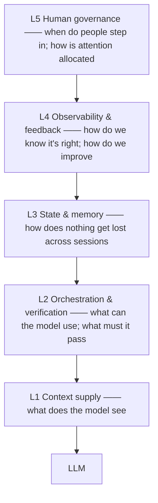

# Chapter 6 The Harness, surveyed: Five Layers and the Minimum Viable Harness

!!! abstract "Learning objectives"
    - Build the layered mental model of the harness (L1–L5) and what question each layer answers;
    - Remember the five cross-camp consensus principles and seven anti-patterns;
    - Use the Context-vs-Harness diagnostic table so you stop treating every problem as a prompt problem;
    - Assemble a Minimum Viable Harness (MVH) scaled to your risk level.

## 6.1 Three generations of engineering: the problem changed, not the difficulty

Another cut of Chapter 1's timeline — not a tool history but a **history of the engineer's role** (`entities/harness-engineering`):

| | Prompt Engineering | Context Engineering | Harness Engineering |
|--|---|---|---|
| Focus | How to phrase instructions | How to manage information | How to build a control system |
| Scope | One prompt | The context window | The task's full lifecycle |
| Engineer's role | Prompt writer | Information-pipeline designer | **Control-system architect** |
| Typical tools | The chat box | LangChain, LlamaIndex | LangGraph, AutoGen, Claude Code |

The layers nest: **Prompt ⊂ Context ⊂ Harness**. The prompt is the "turn right" command; context is the map you hand the model; the harness is the whole car — steering, brakes, lane boundaries, maintenance schedule, warning lights (`topics/agent-harness-deep-dive-qa`).

The harness has quantitative support; three of the most-cited numbers:

- **The Can.ac experiment**: with model weights untouched, changing only harness tool formatting took Grok Code Fast 1 from 6.7% to 68.3% on coding, while cutting output tokens ~20% (`entities/harness-engineering`);
- **LangChain**: same underlying model, harness-only changes, Terminal Bench 2.0 score 52.8 → 66.5 — rank ~30 to rank ~5;
- **OpenAI practice report**: ~5 months from empty repo to ~1M lines, almost none hand-written — Codex agents plus merged PRs.

**Attribution**: model capability sets the ceiling; harness design determines whether the ceiling can be released stably.

## 6.2 The five layers

Synthesizing Anthropic, OpenAI, Stripe, and one two-month production system (22,792 shadow calls, 54 cron jobs), a mature harness has five layers (`topics/agent-harness-deep-dive-qa`):



| Layer | Core question | Representative mechanisms | Chapter |
|-------|--------------|--------------------------|---------|
| L1 Context supply | What does the model see? | Bootstrap injection, on-demand loading, progressive disclosure | Ch 7 |
| L2 Orchestration & verification | What can it use; what must it pass? | Tool orchestration, permission sandbox, generator-evaluator split | Ch 8 |
| L3 State & memory | How to survive across sessions? | External artifacts, checkpoints, startup sequences | Ch 9 |
| L4 Observability & feedback | How do we know it's right? | Traces, quality grading, feedback attribution | Ch 12 |
| L5 Human governance | When do humans step in? | Takeover points, escalation paths, attention allocation | Ch 12–13 |

A widely shared alternative (the six-layer view in `concepts/harness-engineering-framework`: context management, tools, execution orchestration, state & memory, evaluation & observation, constraints & failure recovery) is the same elephant cut differently — five layers cut by *question*, six by *component*. Either works; what matters is that **every layer has an owner and a failure signal**.

## 6.3 Five cross-camp consensus principles

A 2026 survey distilled OpenAI, Anthropic, and ThoughtWorks practice into five consensus points (`entities/harness-engineering`). Three camps converging independently is itself evidence these survived contact with production:

1. **Context beats instruction** — rather than repeating requests, put the right information in the window. (ETH Zurich's measurement is brutal: human-written docs gained ~4% success; AI-auto-generated docs *lost* 3% while costing 20% more — documentation's marginal utility is near zero; hard constraints work.)
2. **Planning and execution separate** — negotiate "what does done mean" before implementing.
3. **The feedback loop is non-negotiable** — automation without a verifier is not automation; it's gambling.
4. **One thing at a time** — WIP=1 is the safest default.
5. **The repository is the documentation** — rules live in the repo (versioned, executable), not in chat logs.

The companion set is seven anti-patterns (same source): layer confusion (harness logic written into prompts), tool hoarding (50+ tools), premature autonomy (skipping verification to chase full automation), ignoring verification (judging output by "looks right"), static rule libraries (rules never updated), stateless design (every conversation starts over), entropy neglect (unbounded side effects). Each appears weekly in real projects — chapters 7–9 give per-layer remedies.

## 6.4 Symptom diagnosis: stop treating every problem as a prompt problem

The most common first move in practice — output wrong, tweak the prompt; still wrong, swap the model — skips the diagnosis. The right first step is **layered diagnosis** (`entities/harness-engineering`, Context-vs-Harness table):

| Dimension | Context problem | Harness problem |
|-----------|-----------------|-----------------|
| Object of optimization | Input quality of a single task | Running quality of the whole system |
| Core question | What should the agent see? | What should the system block, verify, correct? |
| Typical symptoms | Off-topic answers, missing information | Multi-turn drift, rule decay, quality variance |
| Common means | Prompts, RAG, memory, doc organization | Lint, CI, hooks, permissions, flow control |
| Rate of change | Dynamic per task | Stable; infrastructure-like |

Plus the bottleneck trio (`queries/harness-minimum-checklist`): where is the current bottleneck?

| Symptom | Bottleneck layer | Action |
|---------|-----------------|--------|
| Misreads instructions | Prompt | Improve the system prompt |
| Forgets key information | Context | Restructure context |
| Wrong execution path | Harness | Add verification or constraints |

**Do not treat every agent problem as a prompt/context problem** — check whether the harness is good enough before swapping models.

## 6.5 The Minimum Viable Harness (MVH)

Five layers do not mean building five layers on day one. Anthropic's minimal practical advice is five items (`queries/harness-minimum-checklist`):

1. **Write AGENTS.md (or CLAUDE.md)** — the project constitution: domain, stack, conventions, dangerous-operations list;
2. **Write verification commands** — turn "tests should run" into a pre-completion check of results;
3. **Create feature_list.json** — features with `pending`/`in_progress`/`completed` states;
4. **Create a progress file** — per-session progress, curing "where were we?";
5. **Set a completion gate** — merges/PRs only in a verified-green state.

Two counter-intuitive defaults come with it: **cut 80% of tools first** (fewer tools are easier to choose; Ch 8) and **start single-agent** (multi-agent is not a default; it is the response when single-agent hits a clear boundary, Ch 11).

WIP=1 is the safest default: one feature, one PR at a time.

## 6.6 Build by tier: which layers does your scenario need

`entities/harness-engineering`'s tiered table — **not every scenario needs all five layers**:

| Scenario | Must have | Can defer |
|----------|-----------|-----------|
| Internal knowledge Q&A bot | Knowledge delivery, output guardrails | Tool sandbox |
| Code-review agent | Context, tools, guardrails, observability — all | — |
| Ops-automation agent | All five layers + human review node | — |

Cost tiers likewise: no harness ≈1–2s responses, low reliability; minimal harness 2–4s, notably better; full harness 5–15s, production-grade. One A/B comparison is often quoted: no-harness ~$9/20min with core features broken vs full harness ~$200/6h with the feature complete. **The 22× premium buys deliverability, not polish — whether it's worth it depends on what one failed release costs you.**

## 6.7 Operating philosophy: feed errors to the rule library

A harness is not a one-time construction; it is a system with an operating rhythm. The core cycle (`entities/harness-engineering`):

```
The AI errs → convert to a rule/test/constraint → update the rule library
→ the error class stops recurring → the system evolves
```

Ghostty's summary is the most vivid: every rule in the config file corresponds to a real mistake the agent once made — **every rule is a scar that healed**. Mitchell Hashimoto's version: every time the agent errs, engineer a fix so it never happens again.

This makes harness and fine-tuning a stark contrast: fine-tuning changes model parameters (slow, expensive, hard to explain); the harness changes a rule library (fast, cheap, explainable, auditable). For most teams the rule library is the better lever.

## 6.8 Anti-patterns

- **MVH as the end state.** Minimal harness is a starting point; when risk tier rises and the harness doesn't, you're free-soloing — re-score against 6.6 periodically.
- **Rule libraries that only grow.** Without an "error → rule" pipeline a harness dies of fat; without deletion mechanisms a rule library is debt (Ch 13).
- **Building all five layers at once.** Open the minimal circuit first — context → verification → state — then add L4/L5; otherwise you debug five variables at once.

## 6.9 Summary

- Three generations of engineering are a migration of the engineer's role: writer → pipeline designer → control-system architect; Prompt ⊂ Context ⊂ Harness.
- Three numbers (6.7%→68.3%, 52.8→66.5, 1M lines in 5 months) establish the harness as a capability lever independent of the model.
- Five layers, each answering one question; diagnose from symptoms, not from prompts.
- MVH is five items plus two defaults (cut tools, start single-agent); build by risk tier.
- Operating philosophy: feed errors to the rule library; every rule is a healed scar.

## 6.10 Exercises

**Hands-on**

1. Apply the five MVH items to one of your agent projects; run 10 similar tasks before and after; compare rework rate and context-related failures.
2. Use the 6.4 tables on your most recent "the agent misbehaved" incident: which layer was it? Was your response (prompt/model/constraints) the right one?

**Reflective**

1. "Feed errors to the rule library" and "harness decay" are a tension: rules must accumulate *and* be deletable. Who runs your rule library's deletion review, and on what cadence?
2. The $9 vs $200 A/B is often quoted as "full harness is worth it." Name two business scenarios where the conclusion inverts.

## 6.11 References

- In-vault: `entities/harness-engineering` (three generations, six-layer, seven anti-patterns, 5 artifacts/3 camps/5 principles, decay & build-to-delete, sovereignty, Can.ac and $9/$200 data, error-fed rule library, tier table, cost model); `topics/agent-harness-deep-dive-qa` (five layers, tack/car metaphor, production system, MVH); `concepts/harness-engineering-framework` (six-layer view, context tiers, generator-evaluator, LangChain 52.8→66.5); `queries/harness-minimum-checklist` (MVH items, bottleneck trio, A/B cost); `drafts/agent-harness-engineering-2026`.
- Public: Anthropic, *Effective Harnesses for Long-Running Agents* (2025-11); OpenAI, *Harness engineering* (2026-02); Can.ac, *I Improved 15 LLMs at Coding in One Afternoon. Only the Harness Changed.* (2026-02); ETH Zurich documentation experiment; LangChain, *Improving Deep Agents with harness engineering* (2026-02) (all via in-vault notes).
