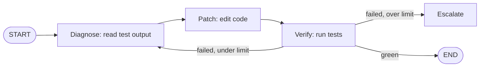

# Chapter 10 From Loop to Graph: State Machines and Orchestration Engines

!!! abstract "Learning objectives"
    - Explain why "stateful loop control flow" wants an explicit graph engine;
    - Master the state machine triad (State/Node/Edge) and the Reducer mechanism — nodes return deltas, state is immutable;
    - Understand that conditional edges are ReAct's essence: prompts elicit *willingness*; graphs guarantee *correctness*;
    - Judge when a loop should become a graph.

## 10.1 The limits of the linear chain

Early LLM applications were linear chains: `input → PromptTemplate → LLM → OutputParser → output`. Their fatal weakness is **fixed control flow** — the moment you need "query the database only if the model thinks it should," the chain cannot hold that logic (`entities/langgraph-state-machine-under-the-hood`). Real tasks are non-linear throughout: call a tool → read the result → decide the next; draft → self-review → rewrite; multi-turn dialog branching on intent. All of it needs **stateful loop control flow**.

Drawing `fix-agent`'s control flow makes the point — it stopped being a line long ago:



## 10.2 The state machine triad

Graph engines (LangGraph being the representative) formalize this control flow as a state machine (same source):

| Element | Meaning | In fix-agent |
|---------|---------|--------------|
| **State** | The current data snapshot | Conversation history + test output + attempt count |
| **Node** | Performs an action and updates state | Diagnose / Patch / Verify (LLM calls, tool execution, business logic) |
| **Edge** | Decides the next node | Green→END; failed-and-over-limit→escalate; else→patch |

**The key mechanism is the Reducer: a node function returns not a "new State" but an "update fragment of State."** The scheduler merges deltas through the reducer registered per field:

```python
import operator
from typing import Annotated, TypedDict

class State(TypedDict):
    messages: Annotated[list, operator.add]   # appending reducer: merge old + new
    fix_attempts: int                          # overwriting reducer: latest wins
```

The deep point of the reducer design is **state immutability**: every node execution produces a new snapshot; old snapshots survive. Not functional-programming piety — it purchases three capabilities outright (same source): **checkpoint recovery** (return to any old snapshot), **parallel safety** (concurrent updates to different fields don't conflict), and **debuggability** (every state change is recorded).

## 10.3 Conditional edges: ReAct's essence

ReAct is often taught as a prompting technique. The graph view is more accurate: **ReAct is a loop graph with conditional edges** — after the LLM node runs, a conditional edge checks for `tool_calls`: present → tools node; absent → END.

```python
from langgraph.graph import StateGraph, START, END

def route_after_llm(state: State) -> str:
    last = state["messages"][-1]
    return "tools" if getattr(last, "tool_calls", None) else END

g = (
    StateGraph(State)
    .add_node("llm", call_llm)
    .add_node("tools", run_tools)
    .add_edge(START, "llm")
    .add_conditional_edges("llm", route_after_llm)
    .add_edge("tools", "llm")     # tool results flow back; the loop closes
    .compile()
)
```

The deep meaning is the division of labor (same source's analysis): **a prompt can only induce the model to *want* to call tools; the graph guarantees tools are called *correctly* and results recovered.** Control flow moves from the model's fuzzy judgment to the graph's precise routing — the LLM produces actions; the graph decides when and what. In essence the LLM becomes a pure function: input to output; orchestration belongs to deterministic code.

Two disciplines (same source's practice notes):

- **Routing functions must be pure**: read state, return a node name; no API calls, no mutations. The scheduler may invoke a route multiple times on the same state (retries, timeout recovery);
- **Count loops with a reducer, not a global**: define `attempts` in State and accumulate; every snapshot records its own count — globals trample each other under parallelism and replay.

## 10.4 Compile and schedule: from "a described graph" to "an executable scheduler"

`compile()` does three things: detects isolated nodes, verifies every node can reach END, and precomputes adjacency. **It moves structural validation from runtime to deploy time** — the compiler's type check. Dead ends and orphan nodes should never debut in production.

The scheduler is an event loop: run the node → merge with reducers → query outgoing edges → (conditional edges consult the router) → enqueue the next. Parallelism is expressed as **fan-out/fan-in**: one node's multiple outgoing edges trigger several nodes at once; the merge node waits for all predecessors. This is the proper form of "query three sources in parallel, then merge" — don't hide a `Promise.all` inside one node, where no observer can see three subtasks running.

Streaming granularity is worth knowing too: `stream()`'s chunks are **node-level** state updates (`{"llm": {...}}`), not token-level — typewriter effects need the token stream separately, but orchestration-grade feedback ("node A finished; update the progress bar") is direct.

## 10.5 When should a loop become a graph

A graph is not an upgraded loop; it is a **different expression**. Criteria (this book's synthesis):

| Signal | Graph |
|--------|-------|
| Multiple branches and joins whose conditions matter enough to unit-test | ✅ Conditional edges are testable |
| Parallel subtasks that must rejoin | ✅ Fan-out/fan-in is a first-class citizen |
| Mid-run pause, human approval, resume-from-checkpoint | ✅ Immutable snapshots + checkpointer, native |
| Per-step state audit (compliance) | ✅ The snapshot sequence *is* the audit log |
| A single loop with a simple stop condition | ❌ Use Chapter 3's bare loop; don't over-engineer |
| Control flow changes often; topology decided by the model at runtime | ❌ A graph is a declarative asset; topology changes go through release |

A pragmatic path: **start with the bare loop (Ch 3); migrate to a graph at the second branch or the first parallel need.** Migration's real cost is state definition — splitting the `messages` dumping ground into structured fields is itself a deepening of your understanding of the task.

## 10.6 Anti-patterns

- **Graphs for graph's sake**: a two-node task drawn as ten nodes multiplies the debugging surface fivefold.
- **Side-effecting routers**: routing that calls APIs or mutates state behaves unpredictably under retries.
- **Everything in State**: State is the decision-relevant minimum, not an in-memory database; large objects live in external storage behind references (Ch 7's supply-chain principle, projected onto graphs).
- **Skipping compile checks**: deferring structural errors to runtime is the graph era's most expensive economy.

## 10.7 Summary

- Linear chains cannot hold branches and cycles; the triad State/Node/Edge formalizes control flow.
- Reducers + immutable snapshots = checkpoints, parallel safety, auditability in one purchase.
- ReAct's essence is a conditional-edge loop graph; prompts elicit willingness; graphs guarantee correctness.
- `compile()` moves structural validation to deploy time; fan-out/fan-in is parallelism's proper form; stream is node-level.
- Choose graph vs loop by control-flow complexity: branches/parallel/interrupt-resume → graph; a single loop → write it bare.

## 10.8 Exercises

**Hands-on**

1. Rewrite `fix-agent` as a LangGraph graph: three nodes + two conditional edges (failed-under-limit→diagnose; failed-over-limit→escalate node). Export with `get_graph()` and compare with 10.1's mermaid.
2. Add a "human approval" node: L4-level changes (e.g., config edits) interrupt before execution and resume after approval (hint: LangGraph checkpointer + interrupt).

**Reflective**

1. What is the relation between "control flow moves to the graph" and Chapter 3's "control flow lives in code"? (Answer: the same principle landing twice — the bare loop is its procedural form; the graph its declarative form.)
2. Which of your business processes "looks like a loop but is actually a state machine"? Draw it — the moment the graph exists, you will see branch conditions no one ever wrote down.

## 10.9 References

- In-vault: `entities/langgraph-state-machine-under-the-hood` (this chapter's backbone: triad, reducers, scheduler, compile, fan-out/fan-in, stream, five analyses, practice notes); `comparisons/orchestrator-worker-vs-dag-agent` (topology scale boundaries); `moc/loop-engineering` (graph/loop hierarchy).
- Public: LangGraph official documentation (StateGraph/Annotation/Checkpointer APIs); Yao et al., *ReAct* (2022).
