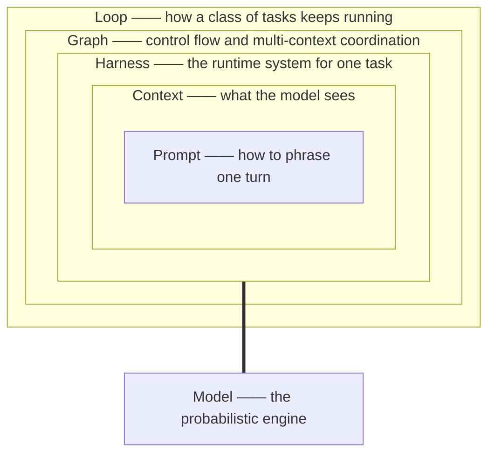

# Preface: Why Harness, Loop, Graph

Between 2025 and 2026, AI engineering underwent a quiet changing of the guard. The conversation at center stage shifted from "how to write prompts" to "how to build the system around the model": Anthropic published *Effective Harnesses for Long-Running Agents*, OpenAI published *Harness Engineering*, Claude Code's creator Boris Cherny said "my job is writing loops," and Mitchell Hashimoto, Ben Thompson, and Martin Fowler each put the same judgment into print — **once model capabilities converge, the systems engineering around the model is the differentiator.**

This book organizes that scattered practice into three primitives:

- **Harness** — the control infrastructure built around the model: context supply, tools and permissions, state and memory, observability, human governance. It answers: *how does a single task become reliable?*
- **Loop** — the mechanism that keeps tasks running and self-correcting: triggers, verification gates, stop conditions, budgets, state memory. It answers: *how does work continue, how do we know it's right, and when does it stop?*
- **Graph** — moving control flow from the model's fuzzy judgment to the graph's precise routing: state machines, conditional edges, fan-out/fan-in, multi-agent topologies. It answers: *how do complex tasks and multiple contexts coordinate?*

They form a hierarchy, not a list: **Loop ⊃ Harness ⊃ Context ⊃ Prompt**. Prompt governs how to phrase a sentence; Context governs what the model sees; Harness governs how this task runs; Loop governs how this class of tasks keeps happening. The book builds upward through that hierarchy.

## Four commitments

**1. Every claim has a source.** This book is compiled from a continuously maintained knowledge base: 2,700+ entity notes covering 2024–2026 engineering practice from Anthropic, OpenAI, Stripe, LangChain, Tencent, Alibaba Cloud, Manus, and others, plus first-hand statements from Karpathy, Hashimoto, Steinberger, and more. Every load-bearing number — "same model, harness-only change, coding score 6.7% → 68.3%," "quality degrades sharply past ~40% context fill" — carries a citation: an in-vault note path or a public source, collected at each chapter's end and in Appendix C. We do not fabricate.

**2. Controversy is presented, not smoothed over.** Whether model progress will devalue harness engineering is the field's biggest live question: one model generation (Opus 4.5→4.6) made a generation of scaffolding 38% cheaper to remove, and Skill interventions have shown *negative* returns on stronger models. Chapter 13 presents both sides and a verdict framework — three falsifiable predictions, not a slogan.

**3. Fact, attribution, and practice are distinguished.** **Facts** are reproducible results or public records; **attribution** is interpretation of failure/success patterns that later evidence may revise; **practice** is converged engineering custom, not law. Where our sources mark these distinctions, we keep them.

**4. Executable artifacts over eloquence.** Every chapter ends in checklists, code, or decision tables; Appendix B collects them all. The test of a book is not what it says but what a reader can do with it on Monday morning.

## Readers and prerequisites

This book is for:

- Engineers and architects burned by "stunning POC, disastrous production";
- Tech leads introducing coding agents (Claude Code, Codex, OpenClaw, etc.) into teams;
- Backend/platform engineers building agent products and owning their reliability;
- Anyone wondering what work remains for humans when agents get good.

Prerequisites: you can call an LLM API, you read Python, and you have used at least one coding agent. No ML background needed — this book does not teach you to train models, only to **build systems around them**.

## One running example

From Chapter 3 onward, a minimal example runs through the book: `fix-agent`, a coding agent that repairs failing tests.

- **Ch 3**: the minimal loop in ~60 lines of plain Python (gather context → act → verify → repeat);
- **Ch 4**: an independent verifier, and why "all green ≠ correct";
- **Ch 5**: the outer loop — scheduling, budgets, cross-session state;
- **Ch 10**: the same control flow as an explicit state graph, and when graphs beat loops;
- **Ch 11**: splitting by context boundary into orchestrator and workers.

The code is deliberately framework-free at first: once you can write a loop from raw APIs, any framework's source code reads like something you have already written.

## How to read this book

- **Cover to cover**: Ch 1–2 establish the problem (why bare models are unreliable); Ch 3–5 Loop; Ch 6–9 Harness; Ch 10–11 Graph; Ch 12–13 production and governance. This is the argument's order.
- **By problem**: production incidents → Ch 12; loops that don't converge → Ch 4; context explosion → Ch 7; should we go multi-agent → Ch 11; a model upgrade broke our setup → Ch 13.
- **As a handbook**: Appendix B collects the book's seven checklists, from "minimum harness on day one" to "model migration."

Each chapter has a fixed shape: **objectives → body (with code and diagrams) → anti-patterns → summary → exercises → references**. Exercises come in hands-on and reflective flavors; for the latter, this book offers thinking frameworks, not answer keys.

## Acknowledgments and limits

This book is compiled from the Hermes Wiki knowledge base; the in-vault paths cited in each chapter's references (e.g., `entities/harness-engineering`) resolve to original notes with their own external sources. Harness, Loop, and Graph engineering evolve fast: tool capabilities and data are current as of mid-2026, and the book is revised continuously alongside the knowledge base's daily check & eval process. Found an error? Open an issue — corrections ship in the next edition.

Now, the first question: **why is the model so smart, yet the system so unreliable?**
