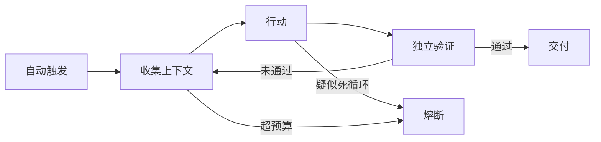

# 第 3 章 解剖 Agent Loop：最小循环与五个必备组件

!!! abstract "学习目标"
    - 用 60 行纯 Python 写出一个无框架的智能体循环，理解"模型是子程序，循环才是程序"；
    - 区分开环（open-loop）与闭环（closed-loop），说清为什么没有验证器的循环必然失败；
    - 掌握循环的停止条件设计，以及 doom loop 的检测与止血。

## 3.1 先反转一次：模型不运行系统，系统运行模型

初学者心智模型：我调用模型，模型干活。工程视角要反转过来：**你的程序才是主程序，模型是一个被调用的、概率性的子程序**。循环（loop）就是主程序的身体：它决定模型何时被调用、看到什么、做完一步之后发生什么、什么时候停。

Boris Cherny（Claude Code 创建者）在 2026 年把自己的工作概括为一句话："我的工作就是写循环。" Peter Steinberger 的表述更激进："你不该再给编程 Agent 写提示词了。你应该设计一套循环机制。"（`moc/loop-engineering`）。这不是修辞——提示词解决"下一句话怎么说"，循环解决"这件事怎么持续做、怎么知道做对、什么时候停"。

从本章起，我们的贯穿实例 `fix-agent` 登场：一个修复失败测试的最小编码智能体。它的每一轮循环做三件事：**收集上下文（读代码）→ 行动（改代码）→ 验证（跑测试）**，然后重复，直到测试通过或预算耗尽。

## 3.2 最小实现：60 行，无框架

```python
import json, subprocess
from pathlib import Path
from openai import OpenAI

client = OpenAI()

TOOLS = [
    {"type": "function", "function": {
        "name": "list_dir", "description": "列出目录内容",
        "parameters": {"type": "object", "properties": {
            "path": {"type": "string"}}, "required": ["path"]}}},
    {"type": "function", "function": {
        "name": "read_file", "description": "读取文件内容",
        "parameters": {"type": "object", "properties": {
            "path": {"type": "string"}}, "required": ["path"]}}},
    {"type": "function", "function": {
        "name": "run_tests", "description": "运行测试套件并返回输出",
        "parameters": {"type": "object", "properties": {}}}},
]

def execute(name: str, args: dict) -> str:
    """工具执行层：循环里唯一接触真实世界的地方。"""
    if name == "list_dir":
        return "\n".join(p.name for p in Path(args["path"]).iterdir())
    if name == "read_file":
        return Path(args["path"]).read_text()[:4000]      # 截断，保护上下文
    if name == "run_tests":
        r = subprocess.run(["pytest", "-x", "-q"],
                           capture_output=True, text=True, timeout=120)
        return (r.stdout + r.stderr)[-4000:]
    raise ValueError(f"unknown tool: {name}")

def run(goal: str, max_steps: int = 15) -> str:
    messages = [
        {"role": "system", "content":
            "你是修复测试的工程师。先读代码再改；每次只做一个小修改；"
            "改完必须运行测试；测试全绿后才能报告完成。"},
        {"role": "user", "content": goal},
    ]
    for step in range(max_steps):                          # 停止条件 1：步数预算
        resp = client.chat.completions.create(
            model="your-model", messages=messages, tools=TOOLS)
        msg = resp.choices[0].message
        messages.append(msg)
        if not msg.tool_calls:                             # 模型放弃工具 = 它认为完成
            return msg.content
        for call in msg.tool_calls:
            result = execute(call.function.name,
                             json.loads(call.function.arguments))
            messages.append({"role": "tool",
                             "tool_call_id": call.id, "content": result})
    return "REACHED_MAX_STEPS"                             # 停止条件 2：预算耗尽
```

这 60 行里藏着智能体循环的全部解剖结构：

| 结构 | 在代码里的位置 | 职责 |
|------|--------------|------|
| **状态** | `messages` 列表 | 循环的唯一记忆；每一步的产物都追加进去 |
| **工具契约** | `TOOLS` + `execute` | 模型能做什么；schema 是合同，execute 是履约 |
| **控制流** | `for step in range(max_steps)` | 何时继续、何时停——**在代码里，不在模型里** |
| **观测回流** | `role: "tool"` 消息 | 工具结果喂回模型，形成反馈 |
| **终止语义** | 无 tool_calls / 预算耗尽 | 两种停止：模型宣告完成 vs 系统强制止损 |

注意**系统提示里的那句"测试全绿后才能报告完成"在工程上是弱的**——它是请求，不是机制。模型完全可以不调 `run_tests` 就宣布完成，而循环对此毫无办法。这正是下一章的主角：验证器。目前请记住分界：**提示词里的规则是"请求别做"，循环里的检查是"做不到"**（这个区分来自一线实践的总结，见第 8 章 hook 与文档的对比）。

## 3.3 开环与闭环：Loop ≠ 定时器

对循环最常见的误解是把它当成 cron——"每 5 分钟让 Agent 重做一次"。这种**开环**（无反馈的循环）在实践中必然失败：Agent 会在循环中不断重复并自我确认错误，烧完预算为止（`moc/loop-engineering`；`entities/loop-engineering-feedback-control-system`）。

**闭环**才有资格叫 Loop Engineering。一个闭环必须同时具备四样东西：

1. **验证门禁（verifier gate）**：每个循环周期必须有独立验证——测试、审查、子智能体——不能让 Agent 自审；
2. **停止条件（stop condition）**：测试通过、目标达成、超出预算、回滚触发——四种停止路径要事先写明；
3. **回滚机制（rollback）**：当循环发现产出质量恶化时，能回到上一个好状态（Git 提交是最常用的实现）；
4. **人工介入（human-in-the-loop）**：遇到循环自身无法判断的事——价值冲突、不可逆动作——必须交还给人。

用控制论的语言重述一遍（`entities/loop-engineering-feedback-control-system`）：验证器是传感器，停止条件是比较器，预算上限是保险丝，回滚是安全阀。**循环的本质不是"反复运行"，而是"每次运行都有反馈"。**



## 3.4 五阶段循环与两个尺度

实践共同体验收过的循环形状可以概括为五阶段：**发现 → 规划 → 执行 → 验证 → 迭代**（`moc/loop-engineering`）。验证通过就交付，未通过就带着验证结果进入下一轮。`fix-agent` 是它的最小化：发现（读测试输出）、规划（模型内部）、执行（改文件）、验证（跑测试）、迭代。

循环有两个尺度（Peter Steinberger 的划分，`entities/loop-engineering-feedback-control-system`）：

- **单智能体循环**：一个 Agent 独立运行整个周期。适合目标明确、范围有限的任务。`fix-agent` 属于此类。
- **舰队循环（Fleet Loop）**：编排者拆目标 → 专业 Agent 各负责一步 → 子智能体做细粒度工作 → 评估门禁控质量。适合复杂项目与规模化任务——那已经是第 10、11 章的世界。

成本量级要先打好预防针：单智能体循环一个中等任务约 5–20 万 token；舰队循环约 50–200 万 token。低成本模型与更长上下文让这些数字在经济上变得可行，但**没有预算上限的循环等于没有熔断器的电路**（第 5 章展开）。

## 3.5 内循环与外循环

Samuel McDonnell 对循环做了一个对工程特别有用的切分（`entities/loop-engineering-feedback-control-system`）：

- **内循环（inner loop）**：任务内的自我检验——写测试、跑测试、根据报错修改。今天的主流智能体已经做得不错。
- **外循环（outer loop）**：跨会话的教训持久化——把"对的教训、用对的颗粒度、写到对的地方"（AGENTS.md、SKILL.md、进度文件）。

他的判断是：内循环已经成熟，**外循环还只搭了一半**——仓库不遗忘，但模型遗忘；大量价值摊在桌上没人捡。第 5 章讲外循环的机制（状态记忆），第 9 章讲它的存储设计。

## 3.6 病理：doom loop 与它的止血带

循环的典型病理是 **doom loop**：Agent 在同一个坏方案上反复微调，每轮都"差一点"，永不收敛。LangChain 的应对是给中间件加一个循环检测器（`topics/agent-harness-deep-dive-qa`）：追踪同一文件的编辑次数，超过阈值 N 就注入一条消息——"考虑重新审视方案"。

工程上完整的止血带有四档：

1. **同文件编辑计数**超阈值 → 注入换思路的提示（最轻）；
2. **连续 K 轮验证不通过** → 回滚到上一个好状态，重开规划；
3. **步数/时间/token 任一预算耗尽** → 强制停止，上报人类；
4. **同一错误第二次出现** → 终止并记录，触发"错误→规则"回写（第 6 章的反模式治理）。

 Anthropic 生产实录中对应的判断是：反馈不是无限的——Generator-Evaluator 循环 N 次仍未收敛，系统应该主动终止并上报，而不是无限重试。

## 3.7 反模式

- **把停止条件交给模型**。模型的任务是推进，不是止损。四种停止路径（通过/达成/超预算/回滚）必须写在代码里。
- **开环定时器冒充循环**。没有验证门禁的"每 N 分钟重跑"只会以更高昂的价格重复同一个错误。
- **让 Agent 自审过关**。自评系统性偏乐观（第 2 章），自审通过的循环只是在确认自己的偏见。
- **没有回滚就上循环**。第一轮循环写入的坏状态，会被后续所有轮次继承。先有 Git，再有循环。

## 3.8 本章小结

- 反转心智模型：模型是子程序，你的循环才是主程序；控制流必须长在代码里。
- 最小循环 = 状态 + 工具契约 + 控制流 + 观测回流 + 终止语义，60 行就能写完。
- 开环必死，闭环四件套：验证门禁、停止条件、回滚、人工介入。
- 内循环已成熟，外循环（跨会话教训持久化）是当前最大价值洼地。
- doom loop 有四档止血带：计数提醒 → 回滚 → 预算熔断 → 错误回写。

## 3.9 练习

**动手**

1. 把 `fix-agent` 跑起来（任何可调用模型 + 一个有小 bug 的练习仓库）。故意删掉系统提示里的"必须运行测试"，统计它不跑测试就宣布完成的比例。这个比例就是你为第 4 章验证器要付的账。
2. 给循环加上 doom loop 止血带的第 1、2 档：同文件编辑计数与连续 3 轮验证失败回滚。

**思辨**

1. `fix-agent` 的停止条件里，"测试通过"和"模型不再调用工具"哪个更可信？各自可能怎么骗过你？
2. 五阶段循环里"规划"发生在模型内部。什么信号能让你在循环外观察到一个任务的规划出了问题？（提示：连续 K 轮验证失败的模式分类。）

## 3.10 本章参考

- 库内：`moc/loop-engineering`（Boris/Peter 原话、五阶段、单智能体 vs 舰队、成本量级）；`entities/loop-engineering-feedback-control-system`（闭环四件套、控制论四映射、内/外循环、doom loop、成本结构、Bun 案例背景）；`topics/agent-harness-deep-dive-qa`（Loop 六原语、循环检测中间件、Generator-Evaluator 上限）。
- 公开：Yao et al., *ReAct* (arXiv:2210.03629)——"推理+行动交替"的原始出处；OpenAI 官方 tool calling 文档（本章代码所用的函数调用协议）。
