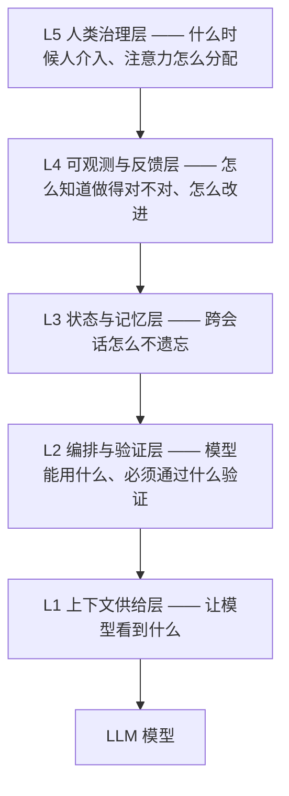

# 第 6 章 Harness 总览：五层架构与最小可行 Harness

!!! abstract "学习目标"
    - 建立Harness 的分层心智模型（L1–L5），并知道每一层回答什么问题；
    - 记住五条跨阵营共识原则与七种反模式；
    - 会用"Context vs Harness"对照表做症状诊断，避免把所有问题都当 Prompt 问题；
    - 能按场景分级搭出最小可行 Harness（MVH）。

## 6.1 三代工程范式：问题换了，不是难度加了

把第 1 章的时间线换一个视角——不是工具的进化史，而是**工程师角色的进化史**（`entities/harness-engineering`）：

| | Prompt Engineering | Context Engineering | Harness Engineering |
|--|---|---|---|
| 核心关注 | 如何表达指令 | 如何管理信息 | 如何构建控制系统 |
| 管理范围 | 单轮 Prompt | 上下文窗口 | 任务全生命周期 |
| 工程师角色 | Prompt 撰写者 | 信息管道设计者 | **控制系统架构师** |
| 典型工具 | 对话框 | LangChain、LlamaIndex | LangGraph、AutoGen、Claude Code |

三层是包含关系：**Prompt ⊂ Context ⊂ Harness**。Prompt 是"右转"的口令，Context 是给模型的地图，Harness 是整辆车——方向盘、刹车、车道边界、维护计划、警示灯（`topics/agent-harness-deep-dive-qa`）。

Harness 工程有量化证据支撑，三个最常被引用的数字：

- **Can.ac 实验**：模型权重一动不动，仅改 Harness 的工具格式，Grok Code Fast 1 的编码分数从 6.7% 到 68.3%，输出 token 还降了约 20%（`entities/harness-engineering`）；
- **LangChain**：底层模型不变，仅改造 Harness，Terminal Bench 2.0 成绩 52.8 → 66.5，从第 30 名到第 5 名；
- **OpenAI 实践报告**：约 5 个月从空仓库到约 100 万行代码，几乎无手写代码，主要靠 Codex Agent + PR 合并。

**归因**：模型能力决定上限，Harness 设计决定这个上限能否稳定释放。

## 6.2 五层架构

综合 Anthropic、OpenAI、Stripe 与一份运行两个月的生产系统实录（22,792 次 shadow 调用、54 个 cron 任务），成熟的 Harness 可归纳为五层（`topics/agent-harness-deep-dive-qa`）：



| 层 | 核心问题 | 代表机制 | 本书章节 |
|----|---------|---------|---------|
| L1 上下文供给 | 让模型看到什么？ | Bootstrap 注入、按需加载、渐进式披露 | 第 7 章 |
| L2 编排与验证 | 能用什么、必须通过什么？ | 工具编排、权限沙箱、生成-评估分离 | 第 8 章 |
| L3 状态与记忆 | 跨会话怎么不遗忘？ | 外部制品、检查点、启动序列 | 第 9 章 |
| L4 可观测与反馈 | 怎么知道对不对？ | Trace、质量分级、反馈归因 | 第 12 章 |
| L5 人类治理 | 人何时介入？ | 接管点、升级路径、注意力分配 | 第 12、13 章 |

另一份广为流传的分层（`concepts/harness-engineering-framework` 六层：上下文管理、工具系统、执行编排、状态与记忆、评估与观测、约束校验与失败恢复）与本表是同一头象的两种切法——五层按"问题"切，六层按"组件"切。工程上用哪套都行，重要的是**每一层都有明确的责任人、明确的失效信号**。

## 6.3 五条跨阵营共识原则

2026 年一份综述把 OpenAI、Anthropic、ThoughtWorks 三家的实践提炼为五条共识（`entities/harness-engineering`）。三方独立收敛到同一批原则，本身说明这些原则经过了压力测试：

1. **上下文胜过指令**——与其反复叮嘱，不如让正确的信息出现在窗口里（ETH Zurich 的实测更狠：人写的说明文档只提升约 4% 成功率，AI 自动生成的文档反而降 3% 还多烧 20% 成本——文档的边际效用近乎为零，硬约束才有效）；
2. **规划与执行分开**——先协商"什么叫完成"，再开始实现；
3. **反馈回路不可商量**——没有验证器的自动化不是自动化，是赌博；
4. **一次一事**——WIP=1 是最安全的默认设置；
5. **代码库即文档**——规则要长在仓库里（可版本化、可执行），不要长在聊天记录里。

与之配套的是七种反模式（同源笔记）：层级混淆（把 Harness 逻辑写进 Prompt）、工具堆砌（50+ 个工具）、过早自治（跳过验证回路追求全自动化）、忽视验证（只看输出"像对的"）、静态规则库（规则写完就不更新）、无状态设计（每次对话重新开始）、忽视熵管理（Agent 无限产生副作用）。每一个都在真实项目里反复出现——第 7–9 章会逐层给出解法。

## 6.4 症状诊断：别把所有问题都当 Prompt 问题

一线实践最常见的错误：输出不对就改提示词，改不好就换模型。正确的第一步是**分层诊断**（`entities/harness-engineering` 的 Context vs Harness 对照表）：

| 维度 | Context 问题 | Harness 问题 |
|------|-------------|-------------|
| 优化对象 | 单次任务的输入质量 | 系统的持续运行质量 |
| 核心问题 | Agent 应该看到什么 | 系统应该阻止、验证、修正什么 |
| 典型症状 | 回答偏题、信息缺失 | 多轮漂移、规则失效、质量波动 |
| 常见手段 | Prompt、RAG、记忆、文档组织 | Lint、CI、Hooks、权限、流程控制 |
| 变化频率 | 随任务动态变化 | 相对稳定，偏基础设施 |

配套的瓶颈三问（`queries/harness-minimum-checklist`）：当前模型的瓶颈在哪一层？

| 症状 | 瓶颈层 | 该做什么 |
|------|--------|---------|
| 指令理解错误 | Prompt | 改进系统提示 |
| 忘记关键信息 | Context | 优化上下文结构 |
| 执行路径错误 | Harness | 加验证回路或约束 |

**不要把所有 Agent 问题都当作 Prompt/Context 问题**——先检查 Harness 是否足够好，而不是急着换模型。

## 6.5 最小可行 Harness（MVH）

五层架构不等于第一天就建五层。Anthropic 官方的最小实操建议只有五件事（`queries/harness-minimum-checklist`）：

1. **写 AGENTS.md（或 CLAUDE.md）**——项目宪法：领域、技术栈、关键约定、危险操作清单；
2. **写验证命令**——把"应该跑测试"变成 completion 前检查验证结果；
3. **建 feature_list.json**——记录功能点及完成状态（`pending`/`in_progress`/`completed`）；
4. **建 progress 文件**——每次会话的进展记录，解决"下次打开不知道干到哪"；
5. **设完成门禁**——任何提交/PR 必须在验证通过的状态下合并。

配套两条反直觉默认：**先砍掉 80% 的工具**（工具越少越容易选对，见第 8 章）；**从单智能体开始**（多智能体不是默认选项，是单智能体碰到明确边界后的应对，见第 11 章）。

WIP=1 是最安全的默认：一次只做一个功能/一个 PR。

## 6.6 分级建设：什么场景需要哪几层

`entities/harness-engineering` 的分级决策表——**不是所有场景都需要全部五层**：

| 场景 | 必须做 | 可暂缓 |
|------|--------|--------|
| 内部知识问答 Bot | 知识传递、输出护栏 | 工具沙箱 |
| 代码审查 Agent | 上下文、工具、护栏、可观测全做 | —— |
| 自动化运维 Agent | 全部五层 + 人工审核节点 + 回滚机制 + 变更审计 | —— |

成本上同样分级：无 Harness 约 1–2 秒响应但低可靠；最小 Harness 2–4 秒、可靠性显著提升；完整 Harness 5–15 秒、适合生产。一条 A/B 成本对比常被引用：无 Harness 的任务约 $9/20 分钟但核心功能有缺陷；完整 Harness 约 $200/6 小时且功能完备。**22 倍成本差买的不是"更好看"，是可交付性——是否值得取决于一次失败发布的代价。**

## 6.7 运营哲学：用错误喂养规则库

Harness 不是一次性的搭建物，是一个有运营节奏的系统。核心闭环（`entities/harness-engineering`）：

```
AI 犯错 → 转化为规则/测试/约束 → 更新规则库 → 同类错误不再犯 → 系统自我进化
```

Ghostty 项目总结的规律说得最形象：配置文件里每一条规则，对应着过去 Agent 真实犯过的一次错——**每条规矩都是结过痂的伤疤**。Mitchell Hashimoto 的版本是"每当 Agent 犯错，就工程化一个方案让它永不再犯"。

这让 Harness 与微调形成鲜明对照：微调改模型参数（慢、贵、难解释），Harness 改规则库（快、便宜、可解释、可审计）。对绝大多数团队，规则库是更合适的杠杆。

## 6.8 反模式

- **MVH 当成终态**。最小 Harness 是起点，风险等级升了不升级等于裸奔——参考 6.6 的分级表定期重估。
- **规则库只增不减**。没有"错误→规则"管道的 Harness 会胖死；没有删除机制的规则库是负债（第 13 章正面处理）。
- **五层并行开工**。先打通"上下文→验证→状态"这条最小回路，再补 L4/L5——顺序错了会同时调试五个变量。

## 6.9 本章小结

- 三代范式是工程师角色的迁移：撰写者 → 管道设计者 → 控制系统架构师；Prompt ⊂ Context ⊂ Harness。
- 三个量化证据（6.7%→68.3%、52.8→66.5、5 个月百万行）说明 Harness 是独立于模型的能力杠杆。
- 五层各管一个问题；诊断从症状入手，别把 Harness 问题当 Prompt 问题。
- MVH 五件事 + 两条反直觉默认（砍工具、单智能体）；按风险分级建设。
- 运营哲学：错误喂养规则库，每条规矩都是结过痂的伤疤。

## 6.10 练习

**动手**

1. 用 MVH 五件事升级你手头的一个智能体项目，前后各跑 10 个同类任务，对比返工率与上下文相关失败的比例。
2. 用 6.4 的两张表诊断你最近一次"Agent 不听话"：它属于哪一层？当时的处理（改提示词/换模型/加约束）选对了吗？

**思辨**

1. 6.7 的"错误喂养规则库"与第 13 章的"Harness 衰减"是一对张力：规则既要积累又要可删。你的规则库应该由谁、按什么节奏做"删除评审"？
2. 22 倍成本差的 A/B 数据常被用来论证"完整 Harness 值得"。请给出两个使这个结论不成立的业务场景。

## 6.11 本章参考

- 库内：`entities/harness-engineering`（三代范式、六层架构、七反模式、5 制品/3 阵营/5 原则、Can.ac 与 $9/$200 数据、错误喂养规则库、分级决策树、成本模型）；`topics/agent-harness-deep-dive-qa`（五层架构、马具/汽车比喻、生产实录、MVH）；`concepts/harness-engineering-framework`（六层视图、上下文分层、Generator-Evaluator、LangChain 52.8→66.5）；`queries/harness-minimum-checklist`（MVH 五件事、瓶颈三问、A/B 成本）；`drafts/agent-harness-engineering-2026`。
- 公开：Anthropic《Effective Harnesses for Long-Running Agents》(2025-11)；OpenAI《Harness engineering》(2026-02)；Can.ac《I Improved 15 LLMs at Coding in One Afternoon. Only the Harness Changed.》(2026-02)；ETH Zurich 说明文档实验、LangChain《Improving Deep Agents with harness engineering》(2026-02)（均经库内笔记转引）。
