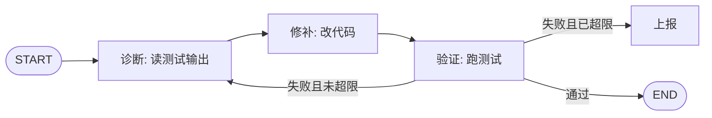

# 第 10 章 从循环到图：状态机与编排引擎

!!! abstract "学习目标"
    - 说清"带状态的循环控制流"为什么需要一个显式的图引擎；
    - 掌握状态机三要素（State/Node/Edge）与 Reducer 机制——节点返回增量，状态不可变；
    - 理解条件边是 ReAct 的本质：Prompt 引导"愿意"，图保证"正确"；
    - 会判断：什么时候该把循环改写成图。

## 10.1 线性链的极限

早期 LLM 应用是线性链：`用户输入 → PromptTemplate → LLM → OutputParser → 输出`。它的致命弱点是**控制流固定**——一旦需要"如果模型认为要查数据库就查，不需要就跳过"，链式结构放不下这种逻辑（`entities/langgraph-state-machine-under-the-hood`）。现实任务全是非线性的：调工具 → 看结果 → 决定下一步；生成草稿 → 自审 → 重写；多轮对话按意图分流。这些都需要**带状态的循环控制流**。

把 `fix-agent` 的控制流画出来就一目了然——它早就不是一条线了：



## 10.2 状态机三要素

图引擎（以 LangGraph 为代表）把这套控制流形式化为状态机（同源笔记）：

| 要素 | 含义 | 在 fix-agent 里 |
|------|------|----------------|
| **State** | 当前数据快照 | 对话历史 + 测试输出 + 尝试次数 |
| **Node** | 执行动作并更新状态 | 诊断 / 修补 / 验证（LLM 调用、工具执行、业务逻辑） |
| **Edge** | 决定下一步去哪个节点 | 测试通过→END；失败且超限→上报；否则→修补 |

**关键机制是 Reducer：节点函数返回的不是"新 State"，而是"State 的更新片段"。** 调度器用每个字段注册的 Reducer 合并增量：

```python
import operator
from typing import Annotated, TypedDict

class State(TypedDict):
    messages: Annotated[list, operator.add]   # 追加式：新旧合并
    fix_attempts: int                          # 覆盖式：最新值生效
```

Reducer 设计的深意在于**状态不可变**：每次节点执行产生新快照，旧快照保留。这不是函数式教条，它直接买到三样能力（同源笔记）：**检查点恢复**（任意时刻回到旧快照）、**并行安全**（多个节点同时改不同字段不冲突）、**可调试**（每步状态变化都有记录）。

## 10.3 条件边：ReAct 的本质

业界常把 ReAct 当成提示词技巧。图视角给出更准确的认识：**ReAct 是一个带条件边的循环图**——LLM 节点执行后，条件边检查是否有 `tool_calls`：有则去工具节点，没有则结束。

```python
from langgraph.graph import StateGraph, START, END

def route_after_llm(state: State) -> str:
    last = state["messages"][-1]
    return "tools" if getattr(last, "tool_calls", None) else END

g = (
    StateGraph(State)
    .add_node("llm", call_llm)
    .add_node("tools", run_tools)
    .add_edge(START, "llm")
    .add_conditional_edges("llm", route_after_llm)
    .add_edge("tools", "llm")     # 工具结果回流，形成循环
    .compile()
)
```

这个结构的深层意义是把职责分开（同源笔记的深度分析）：**Prompt 只能引导模型"愿意"调工具，图才能保证"正确"调工具并回收结果。**控制流从模型的模糊判断转移到图的精确路由——LLM 负责产生动作，图负责决定什么时候做什么。这本质上是把 LLM 当作一个纯函数：给定输入产生输出，流程编排交给确定性代码。

两条纪律（同源笔记的实践启示）：

- **路由函数必须是纯函数**：只读状态、返回节点名；不发 API 调用、不改状态。调度器可能在同一状态上多次调用路由（重试、超时恢复）；
- **循环计数用 Reducer，不用全局变量**：在 State 里定义 `attempts` 字段累加，每个快照精确记录当时的计数——全局变量在并行与重放时会互相覆盖。

## 10.4 编译与调度：把"描述的图"变成"可执行的调度器"

`compile()` 做三件事：孤立节点检测、END 可达性验证、邻接表预计算。**它把图结构合法性的验证从运行时提前到部署时**——相当于编译器的类型检查。死循环、孤岛节点这类低级错误，不该在生产环境第一次发现。

调度器本身是一个事件循环：执行当前节点 → Reducer 合并 → 查出边 →（条件边则调路由函数）→ 下一个节点入队。并行由**扇出/扇入（fan-out/fan-in）**表达：一个节点多条出边同时触发多个节点，合并节点等待所有前驱就绪。这是"一个问题并行检索多个数据源再汇总"的正规表达——不要在一个节点里 `Promise.all`，那会让外部看不到有三个子任务在跑。

流式输出的粒度也值得知道：`stream()` 的每个 chunk 是**节点级**的状态更新（`{"llm": {...}}`），不是 token 级——前端"打字机"效果需要另行接 token 流，但"节点 A 完成时更新进度条"这类编排级反馈直接可用。

## 10.5 什么时候该把循环改写成图

图不是循环的升级版，是**另一种表达**。判断标准（本书综合）：

| 信号 | 该用图 |
|------|-------|
| 控制流有多个分支与汇聚点，且分支条件重要到值得测试 | ✅ 条件边可单测 |
| 需要并行子任务并汇合 | ✅ 扇出/扇入是一等公民 |
| 需要中途暂停、人工审批、从断点恢复 | ✅ 不可变快照 + 检查点原生支持 |
| 需要"每步状态可审计"（合规场景） | ✅ 快照序列即审计日志 |
| 单一循环 + 简单终止条件 | ❌ 用第 3 章的裸循环，别过度工程 |
| 控制流频繁变化、拓扑由模型即时决定 | ❌ 图是声明式资产，改拓扑要走发布 |

一个务实的路径：**从裸循环起步（第 3 章），出现第二个分支或第一个并行需求时迁移到图。**迁移的成本主要在状态定义——把 `messages` 一锅烩改成结构化字段，这本身就是对任务理解的深化。

## 10.6 反模式

- **为图而图**：两个节点的任务画成十个节点的图，调试面积翻五倍。
- **有副作用的路由函数**：路由里发请求、写状态——重试时行为不可预测。
- **把一切都塞进 State**：State 是决策相关的最小集，不是内存数据库；大对象走外部存储 + 引用（第 7 章供给链原则在图上的投影）。
- **跳过 compile 校验**：结构错误推迟到运行时暴露，是图时代最贵的省钱方式。

## 10.7 本章小结

- 线性链装不下分支与循环；状态机三要素（State/Node/Edge）把控制流形式化。
- Reducer + 不可变快照 = 检查点、并行安全、可审计三件套。
- ReAct 的本质是条件边循环图；Prompt 引导"愿意"，图保证"正确"。
- compile() 把结构验证提前到部署时；扇出/扇入是并行的正规表达；stream 是节点级更新。
- 图与循环按控制流复杂度选择：分支/并行/中断恢复→图；单循环→裸写。

## 10.8 练习

**动手**

1. 把 `fix-agent` 改写成 LangGraph 图：三个节点 + 两条条件边（失败未超限→诊断；失败超限→上报节点）。用 `get_graph()` 导出图结构，与 10.1 的 mermaid 图对照。
2. 给图加一个"人工审批"节点：L4 级修改（如改配置文件）在执行前中断，等人工批准后从断点恢复（提示：LangGraph 的 checkpointer + interrupt）。

**思辨**

1. "控制流从模型转移到图"与第 3 章"控制流长在代码里"是什么关系？（答：同一原则的两次落地——裸循环是过程的表达，图是声明的表达。）
2. 你的哪个业务流程"看起来是循环、其实是状态机"？把它画出来——画出图的那一刻，你会看见哪些从未被写下来的分支条件。

## 10.9 本章参考

- 库内：`entities/langgraph-state-machine-under-the-hood`（本章主体：三要素、Reducer、调度器、compile、扇出扇入、stream、五条深度分析、实践启示）；`comparisons/orchestrator-worker-vs-dag-agent`（图拓扑的规模边界）；`moc/loop-engineering`（图与循环的层级关系）。
- 公开：LangGraph 官方文档（StateGraph/Annotation/Checkpointer API）；Yao et al., *ReAct* (2022)。
