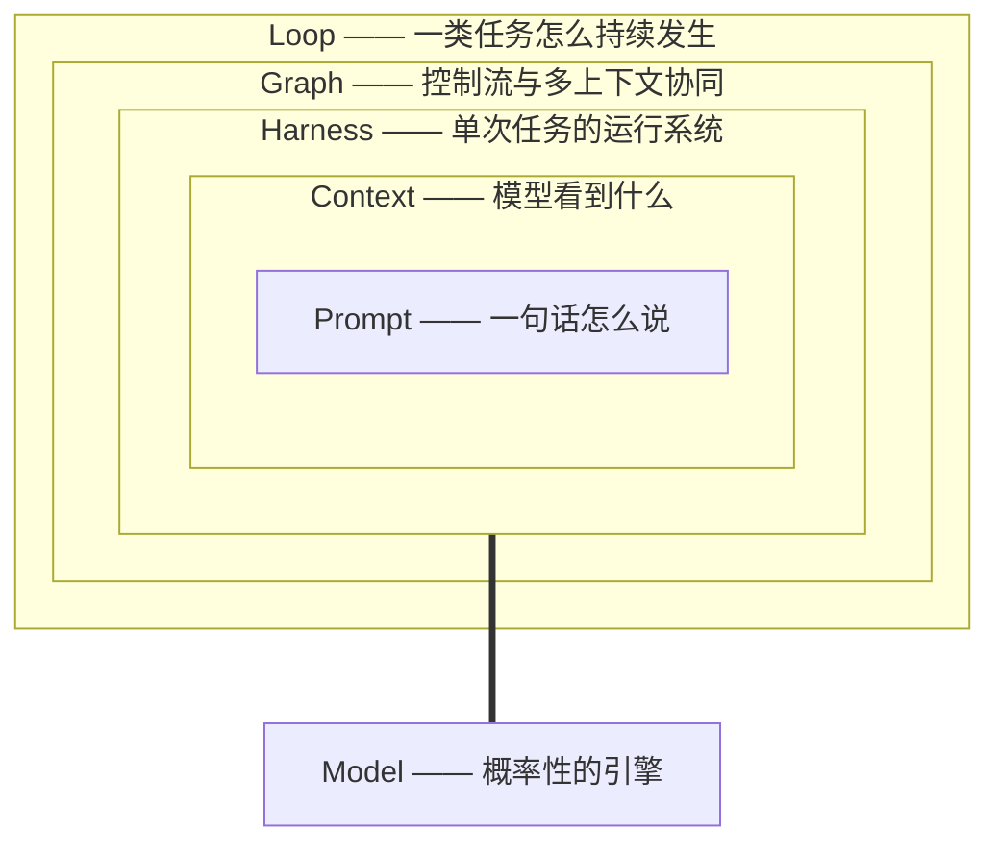

# 前言：为什么是 Harness、Loop、Graph

2025 年到 2026 年，AI 工程圈发生了一次安静的换岗。舞台中央的话题从"怎么写提示词"变成了"怎么搭运行系统"：Anthropic 发布《Effective Harnesses for Long-Running Agents》，OpenAI 发文《Harness Engineering》，Claude Code 的创建者 Boris Cherny 说"我的工作就是写循环"， Mitchell Hashimoto、Ben Thompson、Martin Fowler 相继把同一个判断写成文章——**模型能力趋同之后，围绕模型的系统工程才是差异所在**。

本书把这些分散的实践收拢成三个原语：

- **Harness（驾驭层）**：环绕模型修建的控制基础设施——上下文供给、工具与权限、状态与记忆、可观测、人工治理。它回答：*单次任务怎么才能可靠？*
- **Loop（循环层）**：让任务持续发生并自我纠偏的机制——触发器、验证门禁、停止条件、预算、状态记忆。它回答：*任务怎么持续做、怎么知道做对了、什么时候停？*
- **Graph（图编排层）**：把控制流从模型的"模糊判断"转移到图的"精确路由"——状态机、条件边、扇出扇入、多智能体拓扑。它回答：*复杂任务与多个上下文怎么协同？*

三者是层级关系：**Loop ⊃ Harness ⊃ Context ⊃ Prompt**。Prompt 管一句话怎么说，Context 管模型看到什么，Harness 管这一次任务怎么跑，Loop 管这类任务怎么持续发生。全书就沿着这个层级，从下往上修。

## 本书的四个承诺

**一、每个论断有出处。** 本书的素材是一个持续运行的知识库：2,700+ 篇实体笔记，覆盖 2024–2026 年 Anthropic、OpenAI、Stripe、LangChain、腾讯、阿里云、Manus 等一线团队的工程实录，以及 Karpathy、Hashimoto、Steinberger 等当事人的原始表述。书中每个关键数据（比如"同一模型仅改 Harness，编码分数从 6.7% 到 68.3%"、"上下文填充率超过 40% 后质量快速衰退"）都标注了来源——库内笔记路径或公开文献，收口在各章末尾与附录 C。我们不做无出处的断言。

**二、承认争议，呈现双方。** "模型进步会不会让 Harness 工程贬值"是这个领域最大的真问题：Opus 4.5→4.6 一代更新使上一代脚手架节省 38% 成本，强模型上额外的 Skill 干预出现过负收益。本书不回避这些证据，第 13 章给出正反方的裁决框架——三个可检验的预测，而不是一句站队的话。

**三、区分事实、归因与实践。** 书中用三种标记区分内容性质：**事实**（可复现的实验或公开记录）、**归因**（对失败/成功模式的解释，可能被后续证据修正）、**实践**（工程共同体收敛的做法，属于经验而非定律）。原文如此标注之处，我们保留其不确定性。

**四、给可执行的工件。** 每章以可落地的检查清单、代码或决策表收尾，附录 B 是全书清单合集。判断一本书的标准不是它说了什么，而是读者周一早上能用它做什么。

## 读者与前置

本书为以下读者而写：

- 被"POC 惊艳、生产翻车"伤害过的工程师与架构师；
- 正在把编码智能体（Claude Code、Codex、OpenClaw 等）引入团队的 tech lead；
- 构建 Agent 产品、需要为可靠性负责的后端/平台工程师；
- 想知道"Agent 时代人到底还剩什么活"的所有从业者。

前置要求：会调用 LLM API，读过 Python，用过至少一个编码智能体。不需要机器学习背景——本书不教你训练模型，只教你**在模型周围修建系统**。

## 一条贯穿全书的实例

从第 3 章起，我们用一个最小实例贯穿全书：一个修复失败测试的编码智能体 `fix-agent`。

- **第 3 章**：用 60 行纯 Python 写出它的最小循环（收集上下文 → 行动 → 验证 → 重复）；
- **第 4 章**：给它装上独立的验证器，讨论"测试全绿 ≠ 正确"；
- **第 5 章**：把它包进外循环——定时触发、预算上限、跨会话状态记忆；
- **第 10 章**：把同一个控制流改写成显式状态图，看图何时优于循环；
- **第 11 章**：当单循环触顶，如何按上下文边界拆成编排者与工人。

代码刻意保持框架无关：先会用裸 API 写循环，再谈框架。会写循环的人，读任何框架的源码都像读自己写过的东西。

## 如何阅读

- **从头读**：Ch1–2 建立问题意识（为什么裸模型不可靠），Ch3–5 Loop，Ch6–9 Harness，Ch10–11 Graph，Ch12–13 生产与治理。这是全书论证顺序。
- **按问题读**：上线翻车 → Ch12；循环不收敛 → Ch4；上下文爆炸 → Ch7；多智能体该不该上 → Ch11；模型又升级了、旧配置失灵 → Ch13。
- **当手册用**：附录 B 汇集了全书 7 张检查清单，从"第一天搭最小 Harness"到"模型迁移检查表"。

每章结构固定：**学习目标 → 正文（含代码与图）→ 反模式 → 本章小结 → 练习 → 本章参考**。练习分"动手"与"思辨"两类——后者多为开放问题，本书给出的是思考框架而非标准答案。

## 致谢与边界

本书编撰自 Hermes Wiki 知识库，各章"本章参考"中的库内路径（如 `entities/harness-engineering`）均可在该知识库中检索到原始笔记及其外部出处。Harness/Loop/Graph 是快速演进的领域：书中工具能力与数据截至 2026 年中，我们会随知识库的每日 check & eval 持续修订本书——发现错误请提 issue，勘误将进入下一版。

现在，从第一个问题开始：**为什么模型那么聪明，系统还是不可靠？**
